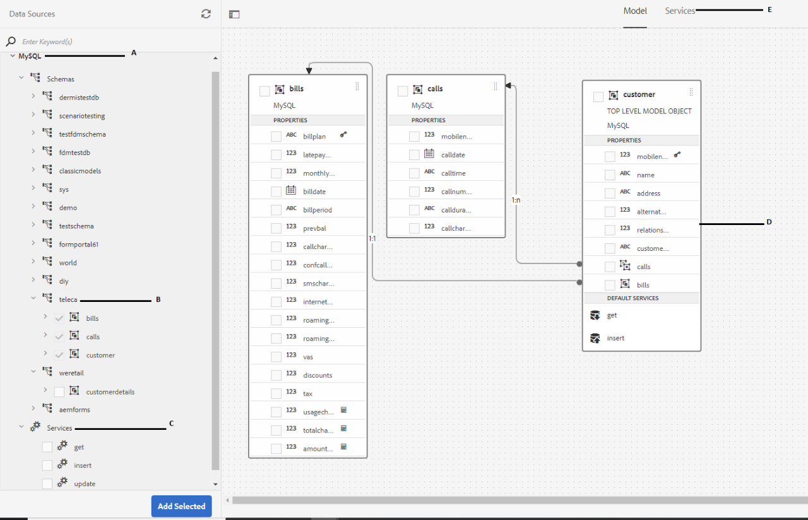
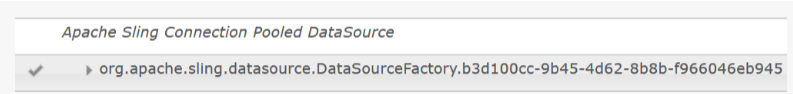
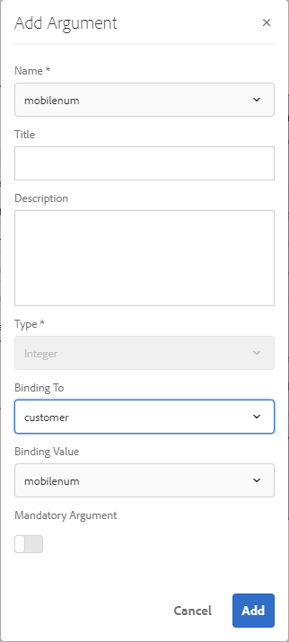

# Tutorial: Criar modelo de dados de formulário{#tutorial-create-form-data-model}


Este tutorial é uma etapa da série [Criar sua primeira comunicação interativa](/help/forms/using/create-your-first-interactive-communication.md). É recomendável seguir a série em sequência cronológica para entender, executar e demonstrar o caso de uso do tutorial completo.

## Sobre o tutorial {#about-the-tutorial}

O módulo de integração de dados da AEM Forms permite criar um modelo de dados de formulário a partir de diferentes fontes de dados de backend, como AEM perfil do usuário, serviços Web RESTful, serviços da Web baseados em SOAP, serviços OData e bancos de dados relacionais. É possível configurar objetos e serviços de modelo de dados em um modelo de dados de formulário e associá-lo a um formulário adaptável. Campos de formulário adaptáveis são vinculados às propriedades de objetos de modelo de dados. Os serviços permitem que você preencha previamente o formulário adaptável e grave os dados de formulário enviados de volta para o objeto de modelo de dados.

Para obter mais informações sobre a integração de dados de formulário e o modelo de dados de formulário, consulte [Integração de dados da AEM Forms](https://helpx.adobe.com/experience-manager/6-3/forms/using/data-integration.html).

Este tutorial o orienta pelas etapas para preparar, criar, configurar e associar um modelo de dados de formulário a uma comunicação interativa. No final deste tutorial, você poderá:

* [Configurar o banco de dados](../../forms/using/create-form-data-model0.md#step-set-up-the-database)
* [Configurar o banco de dados MySQL como fonte de dados](../../forms/using/create-form-data-model0.md#step-configure-mysql-database-as-data-source)
* [Criar modelo de dados de formulário](../../forms/using/create-form-data-model0.md#step-create-form-data-model)
* [Configurar modelo de dados de formulário](../../forms/using/create-form-data-model0.md#step-configure-form-data-model)
* [Modelo de dados do formulário de ensaio](../../forms/using/create-form-data-model0.md#step-test-form-data-model-and-services)

O modelo de dados de formulário é semelhante ao seguinte:



**A.** Fontes de dados configuradas  **B.schemas** de fonte de dados  **C.** Serviços disponíveis  **D.** Objetos de modelo de dados  **E.** Serviços configurados

## Pré-requisitos {#prerequisites}

Antes de começar, verifique se você tem o seguinte:

* Banco de dados MySQL com dados de amostra conforme declarado na seção [Configure o banco de dados](../../forms/using/create-form-data-model0.md#step-set-up-the-database).
* Pacote OSGi para o driver JDBC MySQL, conforme explicado em [Pacote do Driver de Banco de Dados JDBC](https://helpx.adobe.com/experience-manager/6-3/help/sites-developing/jdbc.html#bundling-the-jdbc-database-driver)

## Etapa 1: Configurar o banco de dados {#step-set-up-the-database}

Um banco de dados é essencial para criar uma Comunicação Interativa. Este tutorial usa um banco de dados para exibir o Form Data Model e os recursos de persistência do Interative Communications. Configure um banco de dados contendo tabelas de clientes, contas e chamadas.
A imagem a seguir ilustra os dados de amostra da tabela do cliente:


Use a seguinte instrução DDL para criar a tabela **customer** no banco de dados.

```sql
CREATE TABLE `customer` (
   `mobilenum` int(11) NOT NULL,
   `name` varchar(45) NOT NULL,
   `address` varchar(45) NOT NULL,
   `alternatemobilenumber` int(11) DEFAULT NULL,
   `relationshipnumber` int(11) DEFAULT NULL,
   `customerplan` varchar(45) DEFAULT NULL,
   PRIMARY KEY (`mobilenum`),
   UNIQUE KEY `mobilenum_UNIQUE` (`mobilenum`)
 ) ENGINE=InnoDB DEFAULT CHARSET=utf8
```

Use a instrução DDL a seguir para criar a tabela **bill** no banco de dados.

```sql
CREATE TABLE `bills` (
   `billplan` varchar(45) NOT NULL,
   `latepayment` decimal(4,2) NOT NULL,
   `monthlycharges` decimal(4,2) NOT NULL,
   `billdate` date NOT NULL,
   `billperiod` varchar(45) NOT NULL,
   `prevbal` decimal(4,2) NOT NULL,
   `callcharges` decimal(4,2) NOT NULL,
   `confcallcharges` decimal(4,2) NOT NULL,
   `smscharges` decimal(4,2) NOT NULL,
   `internetcharges` decimal(4,2) NOT NULL,
   `roamingnational` decimal(4,2) NOT NULL,
   `roamingintnl` decimal(4,2) NOT NULL,
   `vas` decimal(4,2) NOT NULL,
   `discounts` decimal(4,2) NOT NULL,
   `tax` decimal(4,2) NOT NULL,
   PRIMARY KEY (`billplan`)
 ) ENGINE=InnoDB DEFAULT CHARSET=utf8
```

Use a seguinte instrução DDL para criar a tabela **calls** no banco de dados.

```sql
CREATE TABLE `calls` (
   `mobilenum` int(11) DEFAULT NULL,
   `calldate` date DEFAULT NULL,
   `calltime` varchar(45) DEFAULT NULL,
   `callnumber` int(11) DEFAULT NULL,
   `callduration` varchar(45) DEFAULT NULL,
   `callcharges` decimal(4,2) DEFAULT NULL,
   `calltype` varchar(45) DEFAULT NULL
 ) ENGINE=InnoDB DEFAULT CHARSET=utf8
```

A tabela **chamadas** inclui detalhes da chamada, como data da chamada, hora da chamada, número da chamada, duração da chamada e taxas de chamada. A tabela **customer** está vinculada à tabela de chamadas usando o campo Número do celular (mobilenum). Para cada número de celular listado na tabela **customer**, há vários registros na tabela **chamadas**. Por exemplo, você pode recuperar os detalhes da chamada para o número móvel **1457892541** referindo-se à tabela **calls**.

A tabela **letras** inclui os detalhes da lista, como data da fatura, período da fatura, encargos mensais e encargos de chamada. A tabela **customer** está vinculada à tabela **bill** usando o campo Plano de Cobrança. Há um plano associado a cada cliente na tabela **customer**. A tabela **bill** inclui os detalhes de preços de todos os planos existentes. Por exemplo, você pode recuperar os detalhes do plano para **Sarah** da tabela **customer** e usar esses detalhes para recuperar os detalhes do preço da tabela **bill**.

## Etapa 2: Configurar o banco de dados MySQL como fonte de dados {#step-configure-mysql-database-as-data-source}

Você pode configurar diferentes tipos de fontes de dados para criar um modelo de dados de formulário. Para este tutorial, você irá configurar o banco de dados MySQL que está configurado e preenchido com dados de amostra. Para obter informações sobre outras fontes de dados compatíveis e como configurá-las, consulte [Integração de dados da AEM Forms](https://helpx.adobe.com/experience-manager/6-3/forms/using/data-integration.html).

Faça o seguinte para configurar seu banco de dados MySQL:

1. Instale o driver JDBC para o banco de dados MySQL como um pacote OSGi:

   1. Faça logon na Instância de autor da AEM Forms como administrador e vá para AEM pacotes de console da Web. O URL padrão é [https://localhost:4502/system/console/bundles](https://localhost:4502/system/console/bundles).
   1. Toque em **Instalar/Atualizar**. Uma caixa de diálogo **Carregar / Instalar Pacotes** é exibida.

   1. Toque em **Escolha Arquivo** para navegar e selecionar o pacote OSGi do driver JDBC do MySQL. Selecione **Pacote de Start** e **Atualizar Pacotes** e toque em **Instalar** ou **Atualizar**. Verifique se o driver JDBC da Oracle Corporation para MySQL está ativo. O driver está instalado.

1. Configure o banco de dados MySQL como uma fonte de dados:

   1. Vá para AEM console da Web em [https://localhost:4502/system/console/configMgr](https://localhost:4502/system/console/configMgr).
   1. Localize a configuração **Apache Sling Connection Pooling DataSource**. Toque em para abrir a configuração no modo de edição.
   1. Na caixa de diálogo de configuração, especifique os seguintes detalhes:

      * **Nome da fonte de dados:** você pode especificar qualquer nome. Por exemplo, especifique **MySQL**.

      * **Nome** da propriedade do serviço DataSource: Especifique o nome da propriedade de serviço que contém o nome DataSource. É especificado ao registrar a instância da fonte de dados como serviço OSGi. Por exemplo, **datasource.name**.

      * **Classe** de driver JDBC: Especifique o nome da classe Java do driver JDBC. Para o banco de dados MySQL, especifique **com.mysql.jdbc.Driver**.

      * **URI** de conexão JDBC: Especifique o URL de conexão do banco de dados. Para o banco de dados MySQL em execução na porta 3306 e teleca do schema, o URL é: `jdbc:mysql://'server':3306/teleca?autoReconnect=true&useUnicode=true&characterEncoding=utf-8`
      * **Nome de usuário:** Nome de usuário do banco de dados. É necessário ativar o driver JDBC para estabelecer uma conexão com o banco de dados.
      * **Senha:** Senha do banco de dados. É necessário ativar o driver JDBC para estabelecer uma conexão com o banco de dados.
      * **Teste em linha de crédito:** ative o  **teste em** linha de crédito.

      * **Teste na devolução:** ative o  **teste na** devolução.

      * **Query de validação:** especifique um query SQL SELECT para validar conexões do pool. O query deve retornar pelo menos uma linha. Por exemplo, **selecione * de customer**.

      * **Isolamento** da transação: Defina o valor como  **READ_COMPROMISTED**.
   Deixe outras propriedades com os [valores](https://tomcat.apache.org/tomcat-7.0-doc/jdbc-pool.html) padrão e toque em **Salvar**.

   É criada uma configuração semelhante à seguinte.

   

## Etapa 3: Criar modelo de dados de formulário {#step-create-form-data-model}

A AEM Forms fornece uma interface de usuário intuitiva para [criar um modo de dados de formulário](https://helpx.adobe.com/experience-manager/6-3/forms/using/data-integration.html#main-pars_header_1524967585)l a partir de fontes de dados configuradas. É possível usar várias fontes de dados em um modelo de dados de formulário. Para o caso de uso neste tutorial, você usará o MySQL como a fonte de dados.

Faça o seguinte para criar um modelo de dados de formulário:

1. Em AEM instância do autor, navegue até **Forms** > **Integrações de dados**.
1. Toque em **Criar** > **Modelo de Dados de Formulário**.
1. No assistente Criar modelo de dados de formulário, especifique um **nome** para o modelo de dados de formulário. Por exemplo, **FDM_Create_First_IC**. Toque em **Next**.
1. A tela da fonte de dados selecionada lista todas as fontes de dados configuradas. Selecione **Origem de dados MySQL** e toque em **Criar**.

   

1. Clique em **Concluído**. O modelo de dados de formulário **FDM_Create_First_IC** é criado.

## Etapa 4: Configurar o modelo de dados de formulário {#step-configure-form-data-model}

A configuração do modelo de dados de formulário inclui:

* [adição de objetos e serviços do modelo de dados](#add-data-model-objects-and-services)
* [criação de propriedades secundárias calculadas para objetos de modelo de dados](#create-computed-child-properties-for-data-model-object)
* [adição de associações entre objetos de modelo de dados](#add-associations-between-data-model-objects)
* [edição de propriedades de objetos de modelo de dados](#edit-data-model-object-properties)
* [configuração de serviços para objetos de modelo de dados](#configure-services)

### Adicionar serviços e objetos de modelo de dados {#add-data-model-objects-and-services}

1. Em AEM instância do autor, navegue até **Forms** > **Integrações de dados**. O URL padrão é [https://localhost:4502/aem/forms.html/content/dam/formsanddocuments-fdm](https://localhost:4502/aem/forms.html/content/dam/formsanddocuments-fdm).
1. O modelo de dados de formulário **FDM_Create_First_IC** criado anteriormente está listado aqui. Selecione-o e toque em **Editar**.

   A fonte de dados selecionada **MySQL** é exibida no painel **Fontes de Dados**.

   

1. Expanda a árvore de fonte de dados **MySQL**. Selecione os seguintes objetos e serviços de modelo de dados do schema **teleca**:

   * **Objetos** do modelo de dados:

      * faturamento
      * chamadas
      * cliente
   * **Serviços:**

      * get
      * atualizar

   Toque em **Adicionar selecionados** para adicionar objetos e serviços de modelo de dados selecionados ao modelo de dados de formulário.

   

   Os objetos de listas, chamadas e modelo de dados do cliente são exibidos no painel direito na guia **Modelo**. Os serviços get e update são exibidos na guia **Serviços**.

   

### Criar propriedades secundárias calculadas para o objeto de modelo de dados {#create-computed-child-properties-for-data-model-object}

Uma propriedade calculada é aquela cujo valor é calculado com base em uma regra ou expressão. Usando uma regra, é possível definir o valor de uma propriedade calculada como uma string literal, um número, resultado de uma expressão matemática ou o valor de outra propriedade no modelo de dados de formulário.

Com base no caso de uso, crie a propriedade computada secundária **usagecharges** no objeto de modelo de dados **bill** usando a seguinte expressão matemática:

* taxas de utilização = taxas de chamada + tarifas de chamada de conferência + tarifas SMS + tarifas móveis da Internet + roaming nacional + roaming internacional + VAS (todas essas propriedades existem no objeto de modelo de dados de faturas)
Para obter mais informações sobre a **usagecharges** propriedade computada secundária, consulte [Planejar a Comunicação Interativa](/help/forms/using/planning-interactive-communications.md).

Execute as seguintes etapas para criar propriedades filhas computadas para o objeto de modelo de dados do bill:

1. Marque a caixa de seleção na parte superior do objeto de modelo de dados **bill** para selecioná-lo e toque em **Criar propriedade secundária**.
1. No painel **Criar propriedade secundária**:

   1. Insira **usagecharges** como o nome da propriedade filho.
   1. Ative **Calculado**.
   1. Selecione **Flutuar** como o tipo e toque **Concluído** para adicionar a propriedade filho ao objeto de modelo de dados **bill**.

   

1. Toque em **Editar regra** para abrir o Editor de regras.
1. Toque em **Criar**. A janela de regra **Definir valor** é aberta.
1. Na lista suspensa Selecionar opção, selecione **Expressão matemática**.

   

1. Na expressão matemática, selecione **chamamentos** e **configure** como primeiro e segundo objetos, respectivamente. Selecione **mais** como operador. Toque em dentro da expressão matemática e toque em **Estender Expressão** para adicionar **smscharges**, **inter-redes**, **roamingnational**, **roamingintnl** e **a11/> objetos na expressão.**

   A imagem a seguir descreve a expressão matemática no editor de regras:

   

1. Toque em **Concluído**. A regra é criada no Editor de regras.
1. Toque em **Fechar** para fechar a janela do Editor de regras.

### Adicionar associações entre objetos de modelo de dados {#add-associations-between-data-model-objects}

Depois que os objetos do modelo de dados forem definidos, é possível criar associações entre eles. A associação pode ser um para um ou um para muitos. Por exemplo, pode haver vários dependentes associados a um funcionário. É chamada de associação de um para muitos e representada por 1:n na linha que conecta objetos de modelo de dados associados. No entanto, se uma associação retornar um nome de funcionário exclusivo para uma determinada ID de funcionário, ela será chamada de associação de um para um.

Quando objetos de modelo de dados associados são adicionados em uma fonte de dados a um modelo de dados de formulário, suas associações são mantidas e exibidas como conectadas por linhas de seta.

Com base no caso de uso, crie as seguintes associações entre os objetos do modelo de dados:

| Associação | Objetos do modelo de dados |
|---|---|
| 1:n | cliente:chamadas (várias chamadas podem ser associadas a um cliente em uma lista mensal) |
| 1:1 | cliente:faturamentos (uma lista está associada a um cliente em um mês específico) |

Execute as seguintes etapas para criar associações entre objetos de modelo de dados:

1. Marque a caixa de seleção na parte superior do objeto de modelo de dados **customer** para selecioná-lo e toque em **Adicionar Associação**. O painel de propriedades **Adicionar Associação** é aberto.
1. No painel **Adicionar Associação**:

   * Especifique um título para a associação. É um campo opcional.
   * Selecione **Um para Muitos** na lista suspensa **Tipo**.

   * Selecione **chamadas** na lista suspensa **Objeto Modelo**.

   * Selecione **get** na lista suspensa **Service**.

   * Toque em **Adicionar** para ligar o objeto de modelo de dados **customer** a **calls** objetos de modelo de dados utilizando uma propriedade. Com base no caso de uso, o objeto de modelo de dados de chamadas deve estar vinculado à propriedade mobile number no objeto de modelo de dados do cliente. A caixa de diálogo **Adicionar Argumento** é aberta.

   

1. Na caixa de diálogo **Adicionar Argumento**:

   * Selecione **mobilenum** na lista suspensa **Name**. A propriedade mobile number é uma propriedade comum que está disponível no cliente e chama objetos de modelo de dados. Como resultado, é usado para criar uma associação entre os objetos do modelo de dados de chamada e cliente.
Para cada número móvel disponível no objeto de modelo de dados do cliente, há vários registros de chamada disponíveis na tabela de chamadas.

   * Especifique um título e uma descrição opcionais para o argumento.
   * Selecione **customer** na lista suspensa **Vínculo a**.

   * Selecione **mobilenum** na lista suspensa **Valor de Ligação**.

   * Toque em **Adicionar**.

   

   A propriedade mobilenum é exibida na seção **Argumentos**.

   

1. Toque em **Concluído** para criar uma associação 1:n entre o cliente e os objetos do modelo de dados de chamada.

   Depois de criar uma associação entre o cliente e chamar objetos do modelo de dados, crie uma associação 1:1 entre o cliente e os objetos do modelo de dados do faturamento.

1. Marque a caixa de seleção na parte superior do objeto de modelo de dados **customer** para selecioná-lo e toque em **Adicionar Associação**. O painel de propriedades **Adicionar Associação** é aberto.
1. No painel **Adicionar Associação**:

   * Especifique um título para a associação. É um campo opcional.
   * Selecione **Um para um** na lista suspensa **Tipo**.

   * Selecione **bill** na lista suspensa **Objeto Modelo**.

   * Selecione **get** na lista suspensa **Service**. A propriedade **billplan**, que é a chave primária para a tabela de listas, já está disponível na seção **Arguments**.
Os objetos de modelo de faturamento e dados do cliente são vinculados usando as propriedades plano de faturamento (faturamentos) e plano do cliente (cliente), respectivamente. Crie um vínculo entre essas propriedades para recuperar os detalhes do plano para qualquer cliente disponível no banco de dados MySQL.

   * Selecione **customer** na lista suspensa **Vínculo a**.

   * Selecione **customerplan** na lista suspensa **Valor de Vínculo**.

   * Toque em **Done** para criar um vínculo entre as propriedades billplan e customerplan.

   

   A imagem a seguir descreve as associações entre os objetos do modelo de dados e as propriedades usadas para criar associações entre eles:

   

### Editar propriedades de objetos de modelo de dados {#edit-data-model-object-properties}

Depois de criar associações entre o cliente e outros objetos de modelo de dados, edite as propriedades do cliente para definir a propriedade com base na qual os dados são recuperados do objeto de modelo de dados. Com base no caso de uso, o número móvel é usado como a propriedade para recuperar dados do objeto de modelo de dados do cliente.

1. Marque a caixa de seleção na parte superior do objeto de modelo de dados **customer** para selecioná-lo e toque em **Editar propriedades**. O painel **Editar propriedades** é aberto.
1. Especifique **customer** como o **objeto de Modelo de Nível Superior**.
1. Selecione **get** na lista suspensa **Ler serviço**.
1. Na seção **Argumentos**:

   * Selecione **Atributo de solicitação** na lista suspensa **Vínculo a**.

   * Especifique **mobilenum** como o Valor de Vínculo.

1. Selecione **update** na lista suspensa **Gravar** Serviço.
1. Na seção **Argumentos**:

   * Para a propriedade **mobilenum**, selecione **customer** na lista suspensa **Ligar a**.

   * Selecione **mobilenum** na lista suspensa **Valor de Ligação**.

1. Toque em **Done** para salvar as propriedades.

   

1. Marque a caixa de seleção na parte superior do objeto de modelo de dados **calls** para selecioná-lo e toque em **Editar propriedades**. O painel **Editar propriedades** é aberto.
1. Desative o objeto **Modelo de nível superior** para **chamadas** objeto de modelo de dados.
1. Toque em **Concluído**.

   Repita as etapas 8 - 10 para configurar as propriedades para o objeto de modelo de dados **bill**.

### Configurar serviços {#configure-services}

1. Vá para a guia **Serviços**.
1. Selecione o serviço **get** e toque em **Editar propriedades**. O painel **Editar propriedades** é aberto.
1. No painel **Editar propriedades**:

   * Insira um título e uma descrição opcionais.
   * Selecione **customer** na lista suspensa **Output Model Object**.

   * Toque em **Done** para salvar as propriedades.

   

1. Selecione o serviço **update** e toque em **Editar propriedades**. O painel **Editar propriedades** é aberto.
1. No painel **Editar propriedades**:

   * Insira um título e uma descrição opcionais.
   * Selecione **customer** na lista suspensa **Input Model Object**.

   * Toque em **Concluído**.
   * Toque em **Salvar** para salvar o modelo de dados do formulário.

   

## Etapa 5: Testar o modelo e os serviços de dados do formulário {#step-test-form-data-model-and-services}

Você pode testar o objeto e os serviços do modelo de dados para verificar se o modelo de dados do formulário está configurado corretamente.

Execute o teste a seguir:

1. Vá para a guia **Modelo**, selecione o objeto de modelo de dados **customer** e toque em **Testar objeto de modelo**.
1. Na janela **Testar Modelo de Dados de Formulário**, selecione **Ler objeto de modelo** na lista suspensa **Selecionar Modelo/Serviço**.
1. Na seção **Input**, especifique um valor para a propriedade **mobilenum** que existe no banco de dados MySQL configurado e toque em **Test**.

   Os detalhes do cliente associados à propriedade mobilenum especificada são buscados e exibidos na seção Saída, como mostrado abaixo. Feche a caixa de diálogo.

   

1. Vá para a guia **Serviços**.
1. Selecione o serviço **get** e toque em **Serviço de Teste.**
1. Na seção **Input**, especifique um valor para a propriedade **mobilenum** que existe no banco de dados MySQL configurado e toque em **Test**.

   Os detalhes do cliente associados à propriedade mobilenum especificada são buscados e exibidos na seção Saída, como mostrado abaixo. Feche a caixa de diálogo.

   

### Editar e salvar dados de amostra {#edit-and-save-sample-data}

O editor de modelo de dados de formulário permite gerar dados de amostra para todas as propriedades de objetos de modelo de dados, incluindo propriedades calculadas, em um modelo de dados de formulário. É um conjunto de valores aleatórios que está em conformidade com o tipo de dados configurado para cada propriedade. Também é possível editar e salvar dados, que são retidos mesmo se os dados de amostra forem regenerados.

Faça o seguinte para gerar, editar e salvar dados de amostra:

1. Na página de modelo de dados de formulário, toque em **Editar dados de amostra**. Ele gera e exibe os dados de amostra na janela Editar dados de amostra.

   

1. Na janela **Editar dados de amostra**, edite os dados, conforme necessário, e toque em **Salvar**. Feche a janela.


