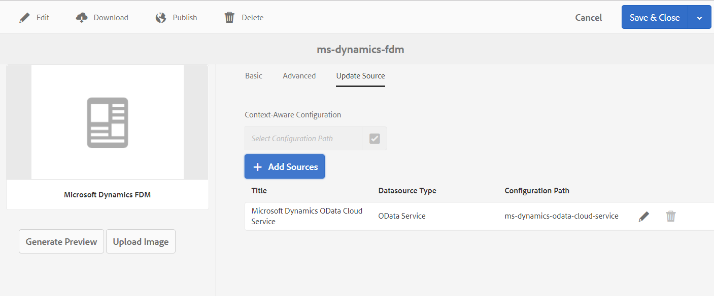

# Criar modelo de dados de formulário{#create-form-data-model}

| Versão | Link do artigo |
| -------- | ---------------------------- |
| AEM as a Cloud Service | [Clique aqui](https://experienceleague.adobe.com/docs/experience-manager-cloud-service/content/forms/integrate/use-form-data-model/create-form-data-models.html) |
| AEM 6.5 | Este artigo |

A integração de dados do AEM Forms fornece uma interface de usuário intuitiva para criar e trabalhar com modelos de dados de formulário. Um modelo de dados de formulário depende de fontes de dados para troca de dados; no entanto, é possível criar um modelo de dados de formulário com ou sem uma fonte de dados. Há duas abordagens para criar um a partir do modelo de dados, dependendo se você configurou as fontes de dados:

* **Uso de fontes de dados pré-configuradas**: Se você tiver configurado as fontes de dados conforme descrito em [Configurar fontes de dados](../../forms/using/configure-data-sources.md), você pode selecioná-los ao criar um modelo de dados de formulário. Ele traz todos os objetos, propriedades e serviços do modelo de dados das fontes de dados selecionadas disponíveis para uso no modelo de dados de formulário.

* **Sem fontes de dados**: se você não tiver configurado as fontes de dados para o seu modelo de dados de formulário, ainda será possível criá-lo sem fontes de dados. Você pode usar o modelo de dados de formulário para criar formulários adaptáveis e comunicação interativa e testá-los usando dados de amostra. Quando as fontes de dados estiverem disponíveis, você poderá vincular o modelo de dados de formulário às fontes de dados, que serão refletidas automaticamente nos formulários adaptáveis associados e nas comunicações interativas.

>[!NOTE]
>
>Você deve ser membro de ambos **fdm-author** e **forms-user** grupos para poder criar e trabalhar com o modelo de dados de formulário. Entre em contato com o administrador do AEM para se tornar um membro dos grupos.

## Criar modelo de dados de formulário {#data-sources}

Verifique se você configurou as fontes de dados que pretende usar no modelo de dados de formulário conforme descrito em [Configurar fontes de dados](../../forms/using/configure-data-sources.md). Faça o seguinte para criar um modelo de dados de formulário com base nas fontes de dados configuradas:

1. Na instância do autor AEM, navegue até **[!UICONTROL Forms > Integrações de dados]**.
1. Selecionar **[!UICONTROL Criar > Modelo de dados do formulário]**.
1. Na caixa de diálogo Criar modelo de dados de formulário:

   * Especifique um nome para o modelo de dados de formulário.
   * (**Opcional**) Especifique o título, a descrição e as tags para o modelo de dados de formulário.
   * (**Opcional e aplicável somente se as fontes de dados estiverem configuradas**) Selecione o ícone de marca de verificação ao lado da **[!UICONTROL Configuração da fonte de dados]** e selecione o nó de configuração onde residem os serviços em nuvem para as fontes de dados que deseja usar. Ele restringe a lista de origens de dados disponíveis para seleção na próxima página às disponíveis no nó de configuração selecionado. No entanto, qualquer banco de dados JDBC e origens de dados de perfil de usuário AEM são listados por padrão. Se você não selecionar um nó de configuração, as origens de dados de todos os nós de configuração serão listadas.

   Selecione **[!UICONTROL Próximo]**.

1. (**Aplicável somente se as fontes de dados estiverem configuradas**) O **[!UICONTROL Selecionar fonte de dados]** lista as fontes de dados disponíveis, se houver. Selecione as fontes de dados que deseja usar no modelo de dados do formulário.
1. Selecionar **[!UICONTROL Criar]** e na caixa de diálogo de confirmação, selecione **[!UICONTROL Abertura]** para abrir o editor do modelo de dados de formulário.

Vamos revisar os diferentes componentes da interface do editor do modelo de dados de formulário.

**A. Fontes de dados** Lista as fontes de dados em um modelo de dados de formulário. Expanda uma fonte de dados para exibir seus objetos de modelo de dados e serviços.

**B. Atualizar definições da fonte de dados** Busca todas as alterações nas definições de fonte de dados das fontes de dados configuradas e as atualiza na guia Fontes de dados do editor de modelo de dados de formulário.

**C. Modelo** Área de conteúdo em que os objetos de modelo de dados adicionados aparecem.

**D. Serviços** Área de conteúdo onde aparecem as operações ou os serviços da fonte de dados adicionados.

**E. Barra de ferramentas** Ferramentas para trabalhar com o modelo de dados de formulário. A barra de ferramentas mostra mais opções dependendo do objeto selecionado no modelo de dados de formulário.

**F. Adicionar Selecionados** Adiciona objetos de modelo de dados e serviços selecionados ao modelo de dados de formulário.

Para obter mais informações sobre o editor de modelo de dados de formulário e como você pode trabalhar com ele para editar e configurar o modelo de dados de formulário, consulte [Trabalhar com o modelo de dados de formulário](../../forms/using/work-with-form-data-model.md).

## Atualizar fontes de dados {#update}

Faça o seguinte para adicionar ou atualizar fontes de dados a um modelo de dados de formulário existente.

1. Ir para **[!UICONTROL Forms > Integrações de dados]**, selecione o modelo de dados de formulário no qual deseja adicionar ou atualizar fontes de dados e selecione **[!UICONTROL Propriedades]**.
1. Nas propriedades do modelo de dados de formulário, vá para a **[!UICONTROL Atualizar fonte]** guia.

   Na guia Origem da atualização:

   * Selecione o ícone de procura na **[!UICONTROL Configuração sensível ao contexto]** e selecione um nó de configuração em que reside a configuração em nuvem da fonte de dados que deseja adicionar. Se você não selecionar um nó, as configurações de nuvem que residem somente no `global` são listados ao selecionar **[!UICONTROL Adicionar fontes]**.

   * Para adicionar uma nova fonte de dados, selecione **[!UICONTROL Adicionar fontes]** e selecione as fontes de dados a serem adicionadas ao modelo de dados do formulário. Todas as fontes de dados configuradas no `global` e o nó de configuração selecionado, se houver, serão exibidos.

   * Para substituir uma fonte de dados existente por outra fonte de dados do mesmo tipo, selecione a **[!UICONTROL Editar]** ícone da fonte de dados e selecione na lista de fontes de dados disponíveis.
   * Para excluir uma fonte de dados existente, selecione a **[!UICONTROL Excluir]** ícone da fonte de dados. O ícone Excluir será desativado se um objeto de modelo de dados na fonte de dados for adicionado no modelo de dados de formulário.

   

1. Selecionar **[!UICONTROL Salvar e fechar]** para salvar as atualizações.

>[!NOTE]
>
>Depois de adicionar novas fontes de dados ou atualizar fontes de dados existentes em um modelo de dados de formulário, atualize as referências de associação, conforme apropriado, nos formulários adaptáveis e nas comunicações interativas que usam o modelo de dados de formulário atualizado.

## Próximas etapas {#next-steps}

Agora você tem um modelo de dados de formulário com fontes de dados adicionadas a ele. Em seguida, você pode editar o modelo de dados de formulário para adicionar e configurar objetos e serviços de modelo de dados, adicionar associações entre objetos de modelo de dados, editar propriedades, adicionar objetos e propriedades de modelo de dados personalizados, gerar dados de amostra e assim por diante.

Para obter mais informações, consulte [Trabalhar com o modelo de dados de formulário](../../forms/using/work-with-form-data-model.md).
