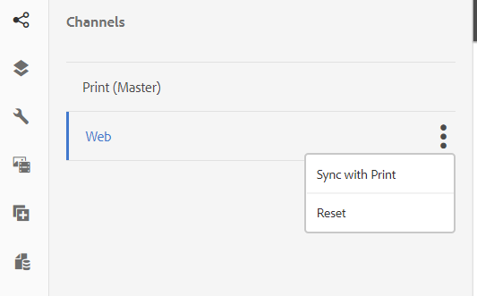

# Criar uma comunicação interativa{#create-an-interactive-communication}

## Visão geral {#overview}

As Comunicações interativas centralizam e gerenciam a criação, montagem e entrega de correspondências personalizadas e interativas. Utilizar a impressão como canal principal para a Web, você pode minimizar a duplicação de esforços na criação da saída da Web da comunicação interativa.

### Pré-requisitos {#prerequisites}

A seguir estão os pré-requisitos para criar uma Comunicação interativa:

* Configurar um [Modelo de dados do formulário](/help/forms/using/data-integration.md) contendo dados de teste ou com uma fonte de dados real, como uma instância do Microsoft® Dynamics.
* Certifique-se de ter o [Fragmentos do documento](/help/forms/using/document-fragments.md).
* Certifique-se de que [Modelos para impressão e canal da Web](/help/forms/using/web-channel-print-channel.md).
* Certifique-se de que você tenha a [tema](/help/forms/using/themes.md) para o canal da web.

## Criar a comunicação interativa {#createic}

1. Faça logon na instância de autor do AEM e acesse **[!UICONTROL Adobe Experience Manager]** > **[!UICONTROL Forms]** > **[!UICONTROL Forms e documentos]**.
1. Toque **[!UICONTROL Criar]** e selecione **[!UICONTROL Comunicação interativa]**. Criar comunicação interativa é exibida.

   

1. Especifique as informações a seguir. :

   * **[!UICONTROL Título]**: insira o título da Comunicação interativa.
   * **[!UICONTROL Nome]**: o nome da Comunicação interativa é derivado do título inserido. Edite-a, se necessário.
   * **[!UICONTROL Descrição]**: insira uma descrição sobre a Comunicação interativa.
   * **[!UICONTROL Modelo de dados do formulário]**: Procure e selecione o modelo de dados de formulário. Para obter mais informações sobre o Modelo de dados de formulário, consulte [Integração de dados do AEM Forms](/help/forms/using/data-integration.md).

   * **[!UICONTROL Preencher Serviço]**: selecione o serviço de preenchimento prévio para recuperar os dados e preencher previamente a Comunicação interativa.
   * **[!UICONTROL Tipo de pós-processamento]**: é possível selecionar o fluxo de trabalho do AEM ou do Forms que será acionado quando a Comunicação interativa for enviada. Selecione o tipo de workflow a ser acionado.

   * **[!UICONTROL Pós-processamento]**: selecione o nome do workflow a ser acionado. Ao selecionar o fluxo de trabalho do AEM, forneça o Caminho do anexo, o Caminho do layout, o Caminho do PDF, o Caminho dos dados de impressão e o Caminho dos dados da Web.
   * **[!UICONTROL Tags]**: selecione as tags a serem aplicadas à comunicação interativa. Você também pode digitar um nome de tag novo/personalizado e pressionar Enter para criá-lo.
   * **[!UICONTROL Autor]**: O nome do autor é retirado automaticamente do nome de usuário do usuário conectado.
   * **[!UICONTROL Data de publicação:]** Insira a data para publicar a Comunicação interativa.
   * **[!UICONTROL Data de cancelamento da publicação]**: insira a data para desfazer a publicação da Comunicação interativa.

1. Toque **[!UICONTROL Próxima]**. A tela para especificar os detalhes do canal da Web e de impressão é exibida.
1. Insira o seguinte:

   * **[!UICONTROL Imprimir]**: selecione essa opção para gerar o canal de impressão da Comunicação interativa.
   * **[!UICONTROL Modelo de impressão]**: procure e selecione um XDP como o modelo de impressão.
   * **[!UICONTROL Web]**: selecione essa opção para gerar o canal da Web ou a saída responsiva de Comunicação interativa.
   * **[!UICONTROL Modelo da Web de comunicação interativa]**: procure e selecione o modelo da Web.
   * **[!UICONTROL Tema]** e **[!UICONTROL Selecionar tema]**: procure e selecione o tema para criar o estilo do canal da Web da Comunicação interativa. Para obter mais informações, consulte [Temas no AEM Forms](/help/forms/using/themes.md).

   * **[!UICONTROL Usar impressão como principal no canal da Web]**: selecione essa opção para criar o canal da Web em sincronia com o canal de impressão. Usar o canal de impressão como mestre para o canal da Web garante que o conteúdo e a vinculação de dados do canal da Web sejam derivados do canal de impressão, e as alterações feitas no canal de impressão são refletidas no canal da Web ao tocar em Sincronizar. Os autores podem, no entanto, interromper a herança de componentes específicos no canal da Web, conforme necessário. Para obter mais informações, consulte [Sincronizar canal da Web com canal de impressão](../../forms/using/create-interactive-communication.md#synchronize).
Se você selecionar a variável **[!UICONTROL Usar impressão como principal no canal da Web]** , é possível selecionar qualquer um dos seguintes modos para gerar um canal da Web:

      * **[!UICONTROL Layout automático]**: selecione esse modo para gerar automaticamente espaços reservados, conteúdo e vinculação de dados para o canal da Web a partir do canal de impressão.
      * **[!UICONTROL Organizar manualmente]**: selecione este modo para selecionar e adicionar manualmente os elementos do canal de impressão ao canal da Web usando o conteúdo principal disponível na **[!UICONTROL Fontes de dados]** guia. Para obter mais informações, consulte [Selecione Print channel elements para criar o conteúdo do canal da Web](#selectprintchannelelements).

   Para obter mais informações sobre canal de impressão e canal da Web, consulte [Canal de impressão e canal da Web](/help/forms/using/web-channel-print-channel.md).

1. Toque em **[!UICONTROL Criar]**. A comunicação interativa é criada e uma caixa de alerta é exibida. Toque **[!UICONTROL Editar]** para começar a criar o conteúdo da comunicação interativa, conforme explicado em [Adicionar conteúdo usando a interface do usuário de criação da Comunicação interativa](#step2). Como alternativa, toque em **[!UICONTROL Concluído]** e escolha editar a Comunicação interativa posteriormente.

## Adicionar conteúdo à comunicação interativa {#step2}

Depois de criar uma Comunicação interativa, você pode usar a interface de criação Comunicação interativa para criar seu conteúdo.

Para obter mais informações sobre a interface de criação da Comunicação interativa, consulte [Introdução à criação de comunicação interativa](/help/forms/using/introduction-interactive-communication-authoring.md).

1. A interface de criação da Comunicação interativa é iniciada ao tocar em Editar, conforme mencionado na [Criar comunicação interativa](#createic). Como alternativa, você pode navegar para um ativo de Comunicação interativa existente no AEM, selecioná-lo e tocar **[!UICONTROL Editar]** para iniciar a interface de criação de Comunicação interativa.

   Por padrão, o canal de impressão da Comunicação interativa é exibido, a menos que a Comunicação interativa seja somente para canal da Web. O canal de impressão da comunicação interativa exibe as áreas de destino, conforme disponível no modelo de canal XDP/impressão selecionado. Nesses campos e áreas de destino, é possível adicionar componentes ou ativos.

1. Com o canal de impressão selecionado, selecione **[!UICONTROL Componentes]** guia. Os seguintes componentes estão disponíveis no canal de impressão:

   | **Componente** | **Funcionalidade** |
   |---|---|
   | Gráfico | Adiciona um gráfico que pode ser usado na Comunicação interativa para representação visual de dados bidimensionais recuperados de uma coleção de modelo de dados de formulário. Para obter mais informações, consulte [Utilização de gráficos em Comunicações interativas](/help/forms/using/chart-component-interactive-communications.md). |
   | Fragmento do documento | Permite adicionar um componente reutilizável, como texto, lista ou condição, a uma Comunicação interativa. O componente adicionado pode ser baseado no modelo de dados de formulário ou sem um modelo de dados de formulário. |
   | Imagem | Permite inserir uma imagem. |

   Arraste e solte os componentes na sua Comunicação interativa e configure-os conforme necessário.

   Você também pode usar as operações desfazer e refazer ao criar uma comunicação interativa para os canais de impressão e da Web.

   Use a operação de desfazer para descartar a última ação executada e a operação de refazer para incorporar a ação descartada novamente. Por exemplo, se você tiver inserido uma imagem ou criado uma vinculação de dados em uma Comunicação interativa e precisar descartá-la, use a operação de desfazer.

   

   As opções desfazer e refazer são exibidas na barra de ferramentas da página interface do usuário de criação. A opção desfazer é exibida somente após a execução de uma ação. A opção Refazer é exibida na barra de ferramentas da página somente após a execução de uma operação de desfazer. Essas ações são redefinidas na atualização da página.

1. Com o canal de impressão selecionado, vá para a **[!UICONTROL Assets]** e aplique o filtro para exibir somente os ativos que deseja visualizar.

   Usando o navegador de ativos, você também pode arrastar e soltar ativos diretamente em áreas de destino da Comunicação interativa.

   

1. Arraste e solte os fragmentos do documento na Comunicação interativa. A seguir estão os tipos de fragmentos de documento que você pode usar no canal de impressão da Comunicação interativa.

<table>
 <tbody>
  <tr>
   <td><strong>Tipo do fragmento do documento</strong></td>
   <td><strong>Exemplo de propósito</strong></td>
  </tr>
  <tr>
   <td><a href="/help/forms/using/texts-interactive-communications.md" target="_blank">Texto</a></td>
   <td>Texto para adicionar endereço, email do destinatário e corpo de texto da carta </td>
  </tr>
  <tr>
   <td><a href="/help/forms/using/conditions-interactive-communications.md" target="_blank">Condição</a></td>
   <td>Condição para adicionar a imagem de cabeçalho apropriada à comunicação com base no tipo de política: Standard ou Premium. <br /> </td>
  </tr>
  <tr>
   <td>Lista</td>
   <td>Grupo de fragmentos de documento, incluindo texto, condições, outras listas e imagens. <br /> </td>
  </tr>
 </tbody>
</table>

Você também pode substituir a vinculação entre uma área de destino e um fragmento de documento soltando o novo fragmento na área de destino usando o **[!UICONTROL Assets]** guia. O sombreamento de cor azul da área de destino ao arrastar o fragmento indica que o fragmento do documento pode ser solto na área de destino.

Para obter mais informações sobre fragmentos de documento, consulte [Fragmentos do documento](/help/forms/using/document-fragments.md).

A interface de criação permite distinguir entre os campos e variáveis desvinculados e vinculados em uma Comunicação interativa. A interface destaca os campos e variáveis não vinculados usando uma borda laranja.


Além disso, ao passar o mouse sobre esses elementos, uma dica de ferramenta é exibida com a mensagem Campo (não vinculado) ou Variável (não vinculado).

Às vezes, uma variável não vinculada usada em um fragmento de documento pode não ser exibida na interface de criação. Isso pode acontecer devido a uma regra de texto em linha em um fragmento de documento ou se houver um fragmento de condição. Nesses casos, uma dica de ferramenta, realçada em azul, é exibida como parte do fragmento do documento. A dica de ferramenta exibe o número de variáveis não vinculadas usadas em um fragmento de documento.


Toque no fragmento do documento e toque em  (Configurar) e toque em **[!UICONTROL Propriedades]** da comunicação interativa. A variável **[!UICONTROL Objetos de modelo de dados e variáveis]** A seção lista as variáveis, incluindo as variáveis ocultas e os objetos de modelo de dados usados nos fragmentos do documento. Use o  (Editar) ícone ao lado de cada objeto ou variável de modelo de dados para editar as propriedades.

1. Para configurar a vinculação de variáveis, toque em uma variável e selecione  (Configurar) e, em seguida, defina as propriedades de vínculo no painel Propriedades na barra lateral.

   * **Nenhum**: o agente preencherá o valor da variável.
   * **Fragmento de texto**: se essa opção for selecionada, você poderá procurar e selecionar um fragmento de documento de texto cujo conteúdo seja renderizado no campo. Somente os fragmentos do documento de texto podem ser vinculados a variáveis que não têm variáveis no.
   * **Objeto de modelo de dados**: selecione uma propriedade de modelo de dados de formulário cujo valor esteja preenchido no campo.
   * **Valor padrão:** Você pode definir um valor padrão para a variável usando esse campo. O valor é exibido ao visualizar a Comunicação interativa ou na interface do usuário do agente.
   * **Padrão de exibição:** Você também pode definir um formato de exibição para uma variável. Selecione qualquer uma das opções predefinidas no **Tipo** para aplicar um formato de exibição a uma variável. Selecionar **Personalizado** para definir um padrão de exibição que não está disponível na lista. Para obter mais informações, consulte [Padrões de exibição de dados](../../forms/using/create-interactive-communication.md#datadisplaypatterns).

   Navegue até [Objetos de modelo de dados e variáveis](../../forms/using/create-interactive-communication.md#hiddenvariables) para configurar a vinculação de variáveis ocultas no fragmento do documento.

   Você também pode arrastar e soltar elementos de origem de dados ou fragmentos de documento de texto para configurar a vinculação de variáveis.  Para criar uma ligação com qualquer um dos elementos da fonte de dados, selecione a **Fontes de dados** e arraste e solte o elemento no nome da variável. O elemento de fonte de dados e a variável devem ser do mesmo tipo para configurar a associação com êxito. Se você arrastar e soltar um elemento de fonte de dados em uma variável já vinculada, o novo elemento substituirá o anterior para criar uma vinculação com a variável. Da mesma forma, selecione o **Assets** e arraste e solte o fragmento do documento de texto no nome da variável para configurar a vinculação entre eles. O fragmento do documento de texto não deve conter nenhuma variável.

1. Para adicionar uma tabela, com o canal de impressão selecionado, no campo **[!UICONTROL Assets]** Aplique o filtro para exibir somente os Fragmentos de layout. Arraste e solte o fragmento de layout necessário na Comunicação interativa. Um fragmento de layout é baseado em um XDP e pode ser usado para criar layouts gráficos ou tabelas estáticas e dinâmicas na Comunicação interativa que são preenchidas com dados dinâmicos.

   Exemplo: uma tabela de layout para exibir prêmio bruto, % de desconto de fidelidade e disponibilidade de assistência emergencial na estrada para políticas antigas e novas.

   Para obter mais informações sobre fragmentos de layout, consulte [Fragmentos do documento](/help/forms/using/document-fragments.md).

1. Com o canal de impressão selecionado, na caixa **[!UICONTROL Assets]** aplique o filtro para exibir imagens. Arraste e solte as imagens necessárias na Comunicação interativa, como para o logotipo da empresa.

   Além disso, gerencie o seguinte na Comunicação interativa:

   * [Adição e configuração de gráficos](/help/forms/using/chart-component-interactive-communications.md)
   * [Sincronização do canal da Web com o canal de impressão](../../forms/using/create-interactive-communication.md#synchronize)

      * Sincronização automática
      * Cancelar herança
      * Reativar herança
      * Sincronizar

   * [Anexos e acesso à biblioteca](../../forms/using/create-interactive-communication.md#attachmentslibrary)
   * [Propriedades do campo XDP/Layout](../../forms/using/create-interactive-communication.md#xdplayoutfieldproperties)
   * [Adicionar regras aos componentes](../../forms/using/create-interactive-communication.md#rules)

1. Alternar para **[!UICONTROL Canal da Web]**. O canal da Web é exibido no editor de comunicação interativa. Quando você alterna do canal Print para o canal Web pela primeira vez, a sincronização automática ocorre. Para obter mais informações, consulte [Sincronização do canal da Web a partir do canal de impressão](../../forms/using/create-interactive-communication.md#synchronize).

   Como estamos usando a opção Imprimir como principal da Web neste exemplo, os espaços reservados para o canal de impressão, o conteúdo e a vinculação de dados são sincronizados com o canal da Web. No entanto, você pode alterar e personalizar o conteúdo específico no canal da Web. [Cancelar herança](#cancelinheritance) para que as áreas e variáveis de destino geradas com o uso do canal de impressão possam personalizar o conteúdo.

   

   Toque no fragmento do documento e toque em  (Configurar) e toque em **[!UICONTROL Propriedades]** da comunicação interativa. A variável **[!UICONTROL Objetos de modelo de dados e variáveis]** A seção lista as variáveis, incluindo as variáveis ocultas e os objetos de modelo de dados usados nos fragmentos do documento. Use o  (Editar) ícone ao lado de cada objeto ou variável de modelo de dados para editar as propriedades. Além disso, para fragmentos de documentos que foram [gerado automaticamente](#synchronize) no canal da Web por meio do canal de impressão, use o  Ícone (Cancelar herança) ao lado de cada objeto e variável do modelo de dados para [cancelar herança](#cancelinheritance) e poder editá-los.

1. Para adicionar outros componentes no canal Web, com o canal Web selecionado, toque em **[!UICONTROL Componentes]**. Arraste e solte componentes no canal da Web da sua Comunicação interativa, conforme necessário, e prossiga para configurá-los.

   | Componentes | Funcionalidade |
   |---|---|
   | Gráfico | Adiciona um gráfico que pode ser usado na Comunicação interativa para representação visual de dados bidimensionais recuperados de uma coleção de modelo de dados de formulário. Para obter mais informações, consulte [Uso do componente de gráfico](../../forms/using/chart-component-interactive-communications.md). |
   | Fragmento do documento | Permite adicionar um componente, texto, lista ou condição reutilizáveis a uma comunicação interativa. O componente reutilizável adicionado a uma comunicação interativa pode ser baseado em modelo de dados de formulário ou sem um modelo de dados de formulário. |
   | Imagem | Permite inserir uma imagem. |
   | Painel | Permite adicionar um [Painel](../../forms/using/create-interactive-communication.md#add-panel-component-to-the-web-channel) à comunicação interativa. |
   | Tabela | Adiciona uma tabela que permite organizar dados em linhas e colunas. |
   | Área de destino | Insere uma área de destino em um canal da Web para organizar os componentes específicos do canal da Web. A área de destino é um contêiner simples que permite agrupar componentes específicos do canal da Web. |
   | Texto | Adiciona rich text ao canal da Web de uma comunicação interativa. O texto também pode usar objetos de modelo de dados de formulário para tornar o conteúdo dinâmico. |
   | Botão | Permite adicionar um [Botão](../../forms/using/create-interactive-communication.md#add-button-component-to-the-web-channel) à comunicação interativa. Você pode usar o componente de Botão para navegar para outras Comunicações interativas, formulários adaptáveis, outros ativos, como imagens ou fragmentos de documentos, ou um URL externo. |
   | Separador | Permite inserir uma linha horizontal em uma Comunicação interativa. Use este componente para distinguir seções em uma correspondência. Por exemplo, você pode usar o componente Separador para distinguir entre as seções Detalhes do Cliente e Detalhes do Cartão de Crédito em um demonstrativo de cartão de crédito. |

1. Conforme necessário, insira ativos no canal da Web.

   Você pode [visualizar sua comunicação interativa](#previewic) para ver a aparência das saídas de impressão e da web da Comunicação interativa e continuar fazendo alterações, conforme necessário.

## Pré-visualizar a comunicação interativa {#previewic}

Você pode usar o **Opção Visualizar** para avaliar a aparência da comunicação interativa. O canal da Web de Comunicação interativa também fornece uma opção para Emular a experiência de uma Comunicação interativa para vários dispositivos. Por exemplo, iPhone, iPad e Desktop. Você pode usar ambos **Visualizar** e **Emulador**  opções em conjunto umas com as outras para visualizar as saídas da web para dispositivos de diferentes tamanhos de tela. Os dados de amostra na visualização são preenchidos a partir do modelo de dados de formulários especificado.

1. Selecione o canal (impressão ou Web) para visualizar e toque em visualizar. A Comunicação interativa é exibida.

   >[!NOTE]
   >
   >A visualização é preenchida com os dados de amostra do modelo de dados de formulário especificado. Para obter mais informações sobre como visualizar a Comunicação interativa com alguns outros dados ou usar o serviço de preenchimento, consulte [Usar modelo de dados de formulário](/help/forms/using/using-form-data-model.md) e [Trabalhar com o modelo de dados de formulário](/help/forms/using/work-with-form-data-model.md).

1. Para o canal da Web, use  para ver como a Comunicação interativa aparece em vários dispositivos.

   

Além disso, você pode [Preparar e enviar a comunicação interativa usando a interface do usuário do agente](/help/forms/using/prepare-send-interactive-communication.md).

## Configurar propriedades na Comunicação interativa  {#configure-properties-in-interactive-communication}

### Anexos e acesso à biblioteca {#attachmentslibrary}

No canal de impressão, é possível configurar os anexos e o acesso à biblioteca para permitir que o agente gerencie anexos na interface do usuário do agente para a Comunicação interativa:

1. No canal Imprimir, realce o Contêiner de documentos e toque em **Propriedades**.

   

   O painel Propriedades é exibido na barra lateral.

   

1. Expandir **Anexos** e especifique as seguintes propriedades:

   * **[!UICONTROL Permitir acesso à biblioteca]**: selecione para ativar o acesso à biblioteca para o agente na interface do usuário do Agente. Se ativado, o agente pode adicionar arquivos da biblioteca enquanto prepara a comunicação interativa.
   * **[!UICONTROL Permitir Reorganização Dos Anexos]**: selecione para permitir que o Agente reordene os anexos com a Comunicação interativa.
   * **[!UICONTROL Número Máximo De Anexos Permitidos]**: especifique o número máximo de anexos permitidos com a Comunicação interativa.
   * **[!UICONTROL Arquivos a serem anexados]**: Toque **[!UICONTROL Adicionar]** e navegue para selecionar arquivos a serem anexados e especifique o seguinte:

      * **[!UICONTROL Anexar Este Arquivo Ao Documento Por Padrão]**: Você poderá alterar essa opção se apenas o anexo não for Obrigatório.
      * **[!UICONTROL Obrigatório:]** O agente não poderá remover o anexo na interface do usuário do agente.

   

1. Toque **[!UICONTROL Concluído]**.

### Propriedades do campo XDP/Layout {#xdplayoutfieldproperties}

1. Ao editar o canal de impressão de uma comunicação interativa, passe o mouse sobre um campo, que está integrado no modelo Canal de impressão, e selecione  (Configurar).

   A caixa de diálogo Propriedades é exibida na barra lateral.

   

1. Especifique o seguinte:

   * **[!UICONTROL Nome]**: Nome do nó JCR.
   * **[!UICONTROL Título]**: insira um título que será visível para o Agente na interface do usuário do Agente e na árvore do Contêiner de documentos.
   * **[!UICONTROL Tipo de vínculo]**: selecione um dos seguintes tipos de ligação para o campo.

      * Nenhum: o agente preencherá o valor da propriedade.
      * Fragmento de texto: se selecionado, você pode procurar e selecionar um fragmento de documento de texto cujo conteúdo é renderizado no campo. Como alternativa, arraste e solte o fragmento do documento de texto no nome do campo para configurar a vinculação entre eles. O fragmento do documento de texto não deve conter nenhuma variável.
      * Objeto de modelo de dados: selecione uma propriedade de modelo de dados de formulário cujo valor esteja preenchido no campo. Como alternativa, selecione o **Fontes de dados** e solte a propriedade no campo.

   * **[!UICONTROL Valores padrão]**: o valor padrão garante que o campo não fique vazio quando não houver valor fornecido pelo objeto de modelo de dados ou fragmento de texto especificado. Se o tipo de vínculo de dados for none, o valor padrão será pré-preenchido no campo.
   * **[!UICONTROL Padrão de exibição]**: também é possível definir um formato de exibição para um campo. Selecione qualquer uma das opções predefinidas no **Tipo** para aplicar um formato de exibição a um campo. Selecionar **Personalizado** para definir um padrão de exibição que não está disponível na lista. Para obter mais informações, consulte [Padrões de exibição de dados](../../forms/using/create-interactive-communication.md#datadisplaypatterns)

   * **[!UICONTROL Editável pelo agente]**: selecione para permitir que o agente edite o valor no campo na interface do usuário do agente. Essa configuração não será aplicável se o Tipo de vínculo for Fragmento de texto.
   * **[!UICONTROL Rótulo]**: especifique uma string de texto exibida com o campo para o Agente na interface do usuário do Agente. Essa configuração não será aplicável se o Tipo de vínculo for Fragmento de texto.
   * **[!UICONTROL Dica de ferramenta]**: Insira uma string de texto que será visível ao passar o mouse sobre o Agente na interface do usuário do Agente. Essa configuração não será aplicável se o Tipo de vínculo for Fragmento de texto.
   * **[!UICONTROL Obrigatório]**: selecione para tornar o campo obrigatório para o Agente. Essa configuração não será aplicável se o Tipo de vínculo for Fragmento de texto.
   * **[!UICONTROL Permitir várias linhas]**: selecione este campo para permitir várias linhas de texto como entrada no campo. Essa configuração não será aplicável se o Tipo de vínculo for Fragmento de texto.

1. Toque .

### Padrões de exibição de dados {#datadisplaypatterns}

A interface de criação permite definir padrões de exibição de dados para campos, variáveis e elementos de modelo de dados de formulário disponíveis ao criar uma Comunicação interativa para canais de impressão e da Web.

Para configurar o padrão de exibição de dados, toque no elemento, selecione  (Configurar) e definir o padrão de exibição no **[!UICONTROL Propriedades]** painel na barra lateral. Selecione qualquer opção predefinida no **[!UICONTROL Tipo]** para exibir o padrão associado ao tipo selecionado. Selecionar **[!UICONTROL Personalizado]** do **[!UICONTROL Tipo]** para definir um padrão que não esteja disponível na lista. Edição de valores no **[!UICONTROL Padrão]** automaticamente modifica o tipo para **[!UICONTROL Personalizado]**.

Para aplicar o padrão de exibição, o número de caracteres ou dígitos definido no campo Padrão deve corresponder ou exceder os caracteres ou dígitos definidos no valor para campos, variáveis e elementos do modelo de dados de formulário. Para obter mais informações, consulte [exemplo](../../forms/using/create-interactive-communication.md#greaternumberofdigits).


Você pode redefinir o padrão de exibição para um campo, variável ou um elemento de modelo de dados de formulário após gerar conteúdo da Web do canal de impressão. Como resultado, um elemento pode ter diferentes padrões de exibição definidos para canais de impressão e da Web. Se você não definir um padrão de exibição para um elemento no canal de impressão e gerar automaticamente conteúdo da Web usando o canal de impressão, a associação de dados definida para o elemento no canal de impressão definirá as opções de padrão de exibição disponíveis na **[!UICONTROL Tipo]** lista suspensa. Se não houver associação definida para o elemento, o tipo de dados do elemento definirá as opções de padrão de exibição disponíveis. Por exemplo, se você criar uma vinculação de dados do tipo Number para um elemento no canal de impressão, as opções de padrão de exibição estarão disponíveis no **[!UICONTROL Tipo]** As listas suspensas são do tipo Number em vários formatos.

Alterne para a **Visualizar** ou abra a Interface do usuário do Agente para visualizar o padrão de exibição aplicado a esses elementos.

A tabela a seguir lista um exemplo dos valores exibidos como resultado da configuração do padrão de exibição de dados de uma variável:

| Tipo | Valor padrão | Padrão de exibição | Exibir valor | Descrição |
|---|---|---|---|---|
| SocialSecurityNumber | 123456789 | texto{999-99-9999} | 123-45-6789 | O número de dígitos no campo de valor padrão corresponde ao número de dígitos no campo Padrão. O valor com base no padrão é exibido com sucesso. |
| SocialSecurityNumber | 1234567 | texto{999-99-9999} | 1-23-4567 | O número de dígitos no campo de valor padrão é menor que o número de dígitos no campo Padrão. O padrão se aplica aos 7 dígitos disponíveis. |
| SocialSecurityNumber | 1234567890 | texto{999-99-9999} | 1234567890 | O número de dígitos no campo de valor padrão é maior que o número de dígitos no campo Padrão. Como resultado, não há alteração no valor de exibição. |

Se um padrão de exibição não for especificado para uma variável ou um elemento de modelo de dados de formulário, a variável [configuração do fragmento do documento global](https://helpx.adobe.com//experience-manager/6-5/forms/using/interactive-communication-configuration-properties.html) é usado por padrão.

Se você não aplicar um padrão de exibição a uma variável do tipo de dados Number, a Visualização de impressão exibirá o padrão de acordo com a configuração global do fragmento do documento. Se você aplicar alterações à configuração padrão do fragmento de documento global, a interface do usuário do agente ainda exibirá o padrão de acordo com os separadores padrão definidos para o local.

Da mesma forma, para campos, se o padrão de exibição não for especificado, o padrão definido ao criar o Modelo de impressão (XDP) será aplicado ao campo. Se não houver um padrão ao criar o modelo de impressão, os padrões padrão com base nas especificações XFA serão aplicados aos campos.

Além disso, se o padrão de exibição especificado estiver incorreto ou não puder ser aplicado, os padrões padrão com base nas especificações XFA serão aplicados aos campos, variáveis ou elementos do modelo de dados de formulário.

## Aplicar regras a componentes de Comunicação interativa {#rules}

Para condicionar componentes ou conteúdo na comunicação interativa, toque no componente/parte do conteúdo e selecione  (Criar regra) para iniciar o Editor de regras.

Para obter mais informações, consulte:

* [Editor de regras](/help/forms/using/rule-editor.md)
* [Introdução à criação de comunicação interativa](/help/forms/using/introduction-interactive-communication-authoring.md)

## Uso de tabelas {#tables}

### Tabelas dinâmicas na Comunicação interativa {#dynamic-tables-in-interactive-communication}

Você pode adicionar tabelas dinâmicas na Comunicação interativa usando fragmentos de layout. As etapas a seguir usam um exemplo de um demonstrativo de cartão de crédito para ilustrar o uso de um fragmento de layout para criar uma tabela dinâmica em uma Comunicação interativa.

1. Verifique se o fragmento de layout necessário para criar a tabela está disponível no AEM.
1. No canal de impressão da sua Comunicação interativa, arraste e solte um fragmento de layout (com uma tabela de várias colunas) em uma Área de destino do navegador de ativos.

   

   Uma tabela é exibida na área de layout Comunicação interativa.

   

1. Especifique a associação de dados para cada uma das células da tabela. Para criar uma linha repetível, insira as propriedades do modelo de dados de formulário na linha que pertence a uma propriedade de coleção comum.

   1. Toque em uma célula na tabela e selecione  (Configurar).

      A caixa de diálogo Propriedades é exibida na barra lateral.

      

   1. Configure as propriedades:

      * **[!UICONTROL Nome]**: Nome do nó JCR.
      * **[!UICONTROL Título]**: insira um título que ficará visível no editor de Comunicação interativa.
      * **[!UICONTROL Tipo de vínculo]**: selecione um dos seguintes tipos de ligação para o campo.

         * **[!UICONTROL Nenhum]**
         * **[!UICONTROL Objeto de modelo de dados]**: o valor da propriedade do modelo de dados de formulário é preenchido no campo. Como alternativa, selecione o **Fontes de dados** e solte a propriedade no campo.

      * **[!UICONTROL Objeto de modelo de dados]**: a propriedade do modelo de dados de formulário cujo valor é preenchido no campo.
      * **[!UICONTROL Valor padrão]**: o valor padrão garante que o campo não fique vazio quando não haja valor fornecido pelo objeto de modelo de dados especificado. O valor padrão é pré-preenchido no campo.

      * **[!UICONTROL Editável pelo agente]**: selecione para permitir que o agente edite o valor no campo na interface do usuário do agente.

   1. Toque .

1. Visualize a comunicação interativa para ver a tabela renderizada com os dados.

   

### Tabelas somente de canal da Web {#webchanneltables}

Toque no painel raiz no modelo da Web e toque em **+** para adicionar um **Tabela** componente para a comunicação interativa. Uma tabela com duas linhas é inserida na comunicação interativa. A primeira linha da tabela representa o cabeçalho Tabela.

#### Adicionar linhas e colunas à tabela {#addrowscolumnstable}

**Para adicionar ou excluir colunas:**

1. Toque na caixa de texto padrão na linha de cabeçalho da tabela para exibir a barra de ferramentas do componente.
1. Selecionar **Adicionar coluna** ou **Excluir coluna** para adicionar ou excluir colunas da tabela respectivamente.


**Para adicionar ou excluir linhas:**

1. Toque em qualquer uma das linhas da tabela para visualizar a barra de ferramentas do componente. Você também pode selecionar a linha da tabela usando o navegador Conteúdo no sidekick da Comunicação interativa.
1. Selecionar **Adicionar linha** ou **Excluir linha** para adicionar ou excluir linhas de tabela respectivamente. Use o **Mover para cima** e **Mover para baixo** opções disponíveis na barra de ferramentas para reorganizar linhas na tabela.


**A.** Adicionar linha **B.** Excluir linha **C** Mover para cima **D.** Mover para baixo

#### Adicionar ou editar texto em células de tabela {#addedittexttable}

1. Selecione a caixa de texto padrão na célula da tabela e toque em  (Editar).
1. Digite o texto na célula da tabela e toque em  para salvá-lo.

#### Criar vínculo entre células de tabela e elementos de objeto de modelo de dados {#createbindingtablecells}

1. Selecione a caixa de texto padrão na linha de tabela e toque em  (Editar).
1. Toque na lista suspensa Objetos do modelo de dados e selecione a propriedade.
1. Toque para salvar e criar uma ligação entre a célula da tabela e a propriedade do objeto de modelo de dados.


#### Criar um hiperlink para o texto na célula da tabela {#createhyperlinktable}

1. Selecione a caixa de texto padrão na célula da tabela e toque em  (Editar).
1. Selecione o texto na célula da tabela e toque no ícone Hiperlink.
1. Especifique o URL no **Caminho** campo.
1. Toque  para salvar as propriedades do hiperlink.


#### Criar tabelas dinâmicas {#createdynamictables}

Você pode criar uma tabela dinâmica de canal da Web somente em uma comunicação interativa usando uma propriedade de modelo de dados do tipo coleção. Essa tabela é uma representação das propriedades secundárias de uma propriedade de coleção. É possível editar somente as propriedades de formatação das várias células da tabela.

1. Alterne para o canal da Web e escolha exibir o navegador de Fontes de dados.
1. Arraste e solte uma propriedade de coleção em um subformulário. Uma tabela é criada no subformulário.
1. Visualize a tabela na visualização da Web da Comunicação interativa.

#### Classificar colunas em uma tabela {#sortcolumns}

Você pode classificar dados com base em qualquer coluna em uma tabela na Comunicação interativa. Os valores na coluna podem ser classificados em ordem crescente ou decrescente.

A classificação pode ser aplicada a tabelas e colunas que contêm:

* Texto estático
* Propriedades do objeto de modelo de dados
* Combinação de texto estático e propriedades do objeto de modelo de dados

Para ativar a classificação:

1. Selecione a tabela e toque em  (Configurar). Também é possível selecionar a tabela usando o **Conteúdo** no sidekick da Comunicação interativa.
1. Selecionar **Habilitar Classificação.**
1. Toque  para salvar as propriedades da tabela. Os ícones de classificação, setas para cima e para baixo, nos cabeçalhos das colunas, representam que a classificação foi ativada.

   

1. Alterne para a **Visualizar** para exibir a saída. A tabela é classificada automaticamente com base na primeira coluna da tabela.
1. Clique no cabeçalho da coluna para classificar os valores com base na coluna.

   Um cabeçalho de coluna com uma seta para cima representa que:

   * a tabela é classificada com base nessa coluna.
   * os valores na coluna são exibidos na ordem crescente.

   

   Da mesma forma, um cabeçalho de coluna com uma seta para baixo representa que os valores na coluna são exibidos na ordem decrescente.

## Editar propriedades de comunicação interativa {#edit-interactive-communication-properties}

Depois de criar uma comunicação interativa, você pode editar suas propriedades em um estágio posterior.

Use o **Propriedades** página para:

* Edite valores para os campos especificados ao criar a Comunicação interativa, como Título e Descrição.
* Adicionar ou excluir o canal da Web de uma comunicação interativa existente.
* Visualizar, baixar ou excluir a Comunicação interativa
* Abra o [IU do agente](/help/forms/using/prepare-send-interactive-communication.md).

Para acessar o **Propriedades** página:

1. Faça logon na instância de autor do AEM e acesse **Adobe Experience Manager** > **Forms** > **Forms e documentos**.
1. Selecione a Comunicação interativa e toque em **Propriedades**.
1. Selecione o **Geral** para editar a **Título** e **Descrição** campos.

### Adicionar ou excluir o canal da Web {#add-or-delete-the-web-channel}

Execute as seguintes etapas para adicionar o canal da Web para uma Comunicação interativa existente:

1. No **Propriedades** selecione a **Canais** guia.
1. Selecione o **Web** e selecione um template para o canal da Web.
1. Selecionar **Usar impressão como principal no canal da Web** para habilitar a sincronização entre o canal da Web e o canal de impressão.
1. Toque **Salvar e fechar** para salvar as alterações.

   Da mesma forma, você pode tocar no **Web** caixa de seleção na **Canais** para excluir o canal da Web da Comunicação interativa.

## Adicionar o componente de Botão ao canal da Web {#add-button-component-to-the-web-channel}

Você pode adicionar um botão como um componente ao canal da Web da Comunicação interativa. Definir regras usando o [editor de regras](../../forms/using/rule-editor.md) para navegar até outras Comunicações interativas, formulários adaptáveis, outros ativos, como imagens ou fragmentos de documentos, ou um URL externo ao tocar no botão.

Para adicionar um botão e definir regras nele:

1. Toque no painel raiz no modelo da Web e toque em **+** para adicionar o **Botão** componente para a comunicação interativa.
1. Toque no componente de botão e toque em  para definir regras ao tocar no botão.
1. No **Quando** , selecione **clicado** no estado da lista suspensa do botão.
1. No **Depois** seção:

   1. Selecione uma ação na lista suspensa. Por exemplo, selecione **Navegue até** como o tipo de ação.

   1. Especifique o URL da comunicação interativa, do formulário adaptável, de um ativo ou de uma página da Web. Por exemplo, especifique o URL no seguinte formato para navegar para outra Comunicação interativa: https://&lt;server-name>:&lt;port>/editor.html/content/forms/af/&lt;interactive communication=&quot;&quot; name=&quot;&quot;>/channels/&lt;channel name=&quot;&quot; print=&quot;&quot; or=&quot;&quot; web=&quot;&quot;>.html
   1. Especifique a opção para abrir o ativo na mesma guia, nova guia ou nova janela.
   1. Toque **Concluído** e toque em **Fechar** para salvar a regra.

   Da mesma forma, você pode selecionar outras opções disponíveis na lista suspensa tipo de ação, como Chamar serviço e Enviar formulário. Para obter mais informações, consulte [editor de regras](../../forms/using/rule-editor.md).

1. Pré-visualize a Comunicação interativa e toque no botão para visualizar a Comunicação interativa, o formulário adaptável, um ativo ou uma página da Web especificada na etapa 4(b).

## Adicionar componente Painel ao canal da Web {#add-panel-component-to-the-web-channel}

O componente Painel é um espaço reservado para agrupar outros componentes e controla como um grupo de componentes, como acordeão e guias, são apresentados na Comunicação interativa. Um componente do painel também permite fazer com que um grupo de componentes seja repetível para o usuário final, como em várias entradas necessárias para preencher credenciais educacionais.

Execute as seguintes etapas para adicionar um componente Painel ao canal Web:

1. Insira o **Painel** no canal da web usando uma das seguintes opções:

   * Toque em um componente, toque em **+** e selecione o **Painel** componente.

   * No **Componente** painel do navegador, arraste e solte a **Painel** componente na comunicação interativa.

   * Toque no **Painel** no **Conteúdo** painel do navegador e toque em **Adicionar painel secundário**. Selecionar o **Adicionar painel secundário** exibe a variável **Adicionar painel secundário** caixa de diálogo. Insira o título, uma descrição opcional e um nome para o componente Painel.

1. Toque no painel da **Conteúdo** navegador para executar ações adicionais no painel, como configurar, editar regras, copiar, excluir e inserir o componente.

   Também é possível arrastar e soltar um painel dentro da **Conteúdo** navegador para refletir a alteração na estrutura da Comunicação interativa no painel direito.

## Sincronização do canal da Web com o canal de impressão {#synchronize}

Quando você seleciona Imprimir como Mestre para Canal da Web ao criar uma Comunicação interativa, o canal da Web é criado em sincronia com o canal de impressão e o conteúdo e a vinculação de dados do canal da Web são derivados do canal de impressão, e as alterações feitas no canal de impressão podem ser refletidas no canal da Web quando você toca em Sincronizar.

No entanto, os autores podem interromper a herança dos componentes no canal da Web, conforme necessário.

 

### Sincronização automática {#autosync}

Se você selecionar a variável **[!UICONTROL Usar impressão como principal no canal da Web]** , é possível selecionar qualquer um dos seguintes modos para gerar um canal da Web:

* **[!UICONTROL Layout automático]**: selecione esse modo para gerar automaticamente espaços reservados, conteúdo e vinculação de dados para o canal da Web a partir do canal de impressão.
* **[!UICONTROL Organizar manualmente]**: selecione este modo para selecionar e adicionar manualmente elementos do canal de impressão ao canal da Web usando o conteúdo principal disponível na guia Fontes de dados. Para obter mais informações, consulte [Selecione Print channel elements para criar o conteúdo do canal da Web](#selectprintchannelelements).


>[!NOTE]
>
>A sincronização de canais sincroniza apenas os fragmentos de documento, imagens, condições, listas e fragmentos de layout do canal de impressão para o canal da Web. Os subformulários ou nós principais que incluem esses elementos não são sincronizados.

### Selecione Print channel elements para criar o conteúdo do canal da Web {#selectprintchannelelements}

Se você selecionar Imprimir como mestre ao criar a Comunicação interativa e não selecionar a opção de sincronização automática, também será possível arrastar e soltar elementos do canal de impressão na interface de criação do canal da Web.

Navegue até **Fontes de dados** > **Conteúdo principal** para visualizar os elementos do canal de impressão. Arraste e solte as áreas, os campos ou as tabelas de destino na interface de criação do canal da Web. Um ícone de círculo azul ao lado do nome do elemento indica que o elemento Canal de impressão já foi incluído no canal da Web.


### Cancelar herança {#cancelinheritance}

No canal da Web, os componentes são incorporados nas áreas de destino.

Passe o mouse sobre a área ou variável de destino relevante no canal da Web e selecione  (Cancelar herança) e, na caixa de diálogo Cancelar herança, toque em **[!UICONTROL Sim]**.

A herança dos componentes na área de destino é cancelada e agora você pode editá-los conforme necessário.

### Habilitar herança novamente {#re-enable-inheritance}

No canal da Web, se você tiver cancelado a herança de um componente, será possível reativá-lo. Para reativar a herança, passe o mouse sobre o limite da área de destino relevante, que inclui o componente, e toque em .

A caixa de diálogo Reverter herança é exibida.


Se necessário, selecione **[!UICONTROL Sincronizar A Página Após Reverter A Herança]**. Selecione esta opção para sincronizar toda a comunicação interativa. Se você não selecionar essa opção, somente a área de destino relevante será sincronizada ao restaurar a herança.

Toque **[!UICONTROL Sim]**.

### Sincronizar {#synchronize-1}

Se você estiver usando a opção Imprimir como Principal do Canal da Web e alterar o canal Imprimir, será possível sincronizar o conteúdo para trazer as alterações recém-feitas para o canal da Web.

1. Para sincronizar o canal da Web com o canal de impressão, alterne para o canal da Web e toque no ícone More options.

   

1. Toque em uma das opções a seguir:

   * **[!UICONTROL Sincronizar com impressão]**: sincroniza o conteúdo somente para as áreas de destino nas quais a herança não foi cancelada.
   * **[!UICONTROL Redefinir]**: sincroniza o conteúdo do canal da Web com o canal de impressão e descarta todas as alterações feitas no canal da Web.

### Usar a barra de ferramentas do componente para executar ações em componentes herdados {#componenttoolbar}

Depois de ter o conteúdo gerado automaticamente no canal da Web usando a opção Sincronizar, você poderá executar mais ações nos componentes sem cancelar a herança.


Toque no componente para exibir as seguintes opções:

* **Copiar:** Copie um componente e cole-o em outros locais na Comunicação interativa.
* **Recortar:** Mova um componente de um local para outro na Comunicação interativa.
* **Inserir componente:** Insira um componente acima do componente selecionado.
* **Colar:** Cole o componente recortado ou copiado usando as opções descritas acima.
* **Grupo:** Selecione vários componentes se desejar recortar, copiar ou colar mais de um componente juntos.
* **Pai:** Selecione o primário de um componente.
* **Exibir expressão SOM:** Exibir o [Expressão SOM](../../forms/using/using-som-expressions-adaptive-forms.md) para o componente.

* **Agrupar objetos no painel:** Agrupe os componentes em um painel para poder executar operações nesses componentes simultaneamente. Para obter detalhes, consulte [Agrupar objetos no Painel](#groupobjectspanel).

* **Cancelar herança:** [Cancelar a herança](#cancelinheritance) dos componentes na área de destino para editá-los.

### Agrupar objetos no Painel {#groupobjectspanel}

A interface de criação do canal da Web facilita o agrupamento de componentes em um painel para que seja possível executar operações nesses componentes simultaneamente. A variável **Conteúdo** A guia lista os componentes agrupados como elementos secundários do painel na árvore de conteúdo.

1. Toque em um componente e selecione o Grupo ( ).
1. Selecione vários componentes e toque em **Agrupar objetos no Painel**.

   

1. No **Agrupar objetos no painel** digite um nome para o Painel.
1. Insira um título opcional e uma descrição para o Painel.
1. Clique em .

   Os componentes agrupados são exibidos como elementos secundários do Painel na árvore de conteúdo.

   

## Formato de saída do canal de impressão {#output-format-print-channel}

Use a API PrintChannel para definir o formato de saída para o canal de impressão de uma comunicação interativa. Se você não definir um formato de saída, o AEM Forms gerará a saída no formato PDF.

```javascript
//options for rendering print channel of a multi-channel document
PrintChannelRenderOptions renderOptions = new PrintChannelRenderOptions();
PrintDocument printDocument = printChannel.render(renderOptions);
```

Para gerar a saída em qualquer outro formato, especifique o tipo de formato de saída. Consulte [API PrintChannel](https://helpx.adobe.com/experience-manager/6-5/forms/javadocs/com/adobe/fd/output/api/PrintConfig.html) para obter a lista de tipos de formato de saída compatíveis.

Por exemplo, você pode usar a seguinte amostra para definir PCL como formato de saída para uma comunicação interativa:

```javascript
//options for rendering print channel of a multi-channel document
PrintChannelRenderOptions renderOptions = new PrintChannelRenderOptions();
renderOptions.setRenderFormat(PrintConfig.HP_PCL_5e);
PrintDocument printDocument = printChannel.render(renderOptions);
```
