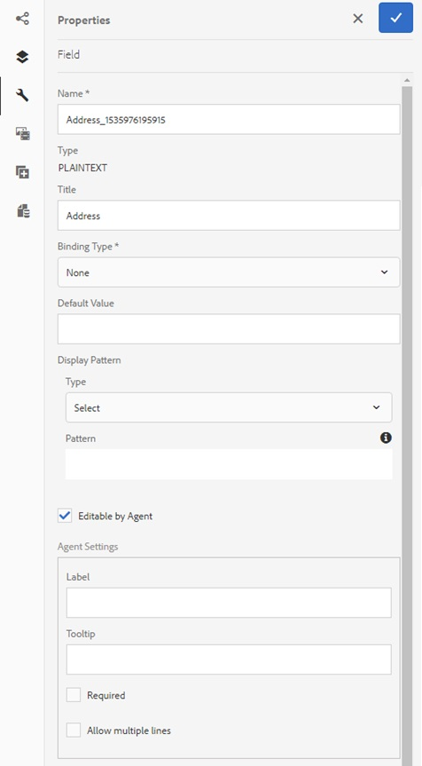
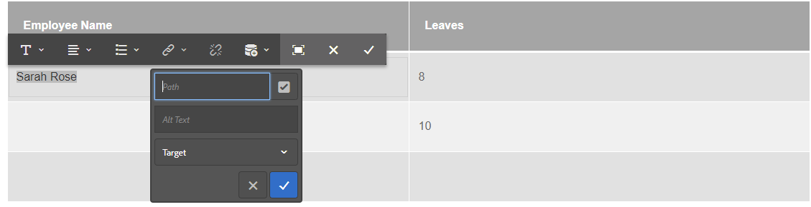

# Criar uma comunicação interativa{#create-an-interactive-communication}

## Visão geral {#overview}

As Comunicações interativas centralizam e gerenciam a criação, a montagem e o delivery personalizado e as correspondências interativas. Utilize a impressão como canal principal para a Web, você pode minimizar a duplicação de esforços ao criar a saída da Web da Interative Communication.

### Pré-requisitos {#prerequisites}

Estes são os pré-requisitos para a criação de uma comunicação interativa:

* Configure um Modelo [de dados de](/help/forms/using/data-integration.md) formulário contendo dados de teste ou com uma fonte de dados real, como uma instância do Microsoft® Dynamics.
* Verifique se você tem os fragmentos [do](/help/forms/using/document-fragments.md)Documento.
* Verifique se você tem [Modelos para impressão e canal](/help/forms/using/web-channel-print-channel.md)da Web.
* Verifique se você tem o [tema](/help/forms/using/themes.md) necessário para o canal da Web.

## Criar a comunicação interativa {#createic}

1. Faça logon na instância do autor do AEM e navegue até **[!UICONTROL Adobe Experience Manager]** > **[!UICONTROL Formulários]** > **[!UICONTROL Formulários e Documentos]**.
1. Toque em **[!UICONTROL Criar]** e selecione Comunicação **** interativa. A página Criar comunicação interativa é exibida.

   

1. Digite as seguintes informações. :

   * **[!UICONTROL Título]**: Insira o título da Comunicação interativa.
   * **[!UICONTROL Nome]**: O nome da Comunicação interativa é derivado do título inserido. Edite-o, se necessário.
   * **[!UICONTROL Descrição]**: Insira uma descrição sobre a Comunicação interativa.
   * **[!UICONTROL Modelo]** de dados de formulário: Procure e selecione o modelo de dados do formulário. Para obter mais informações sobre o Modelo de dados de formulário, consulte Integração [de dados do](/help/forms/using/data-integration.md)AEM Forms.

   * **[!UICONTROL Serviço]** de preenchimento prévio: Selecione o serviço de pré-preenchimento para recuperar os dados e pré-preencher a Comunicação interativa.
   * **[!UICONTROL Tipo]** de pós-processo: Você pode selecionar o fluxo de trabalho do AEM ou do Forms a ser acionado quando a Comunicação interativa for enviada. Selecione o tipo de fluxo de trabalho a ser acionado.

   * **[!UICONTROL Processo]** de publicação: Selecione o nome do fluxo de trabalho a ser acionado. Ao selecionar o fluxo de trabalho do AEM, forneça Caminho do anexo, Caminho do layout, Caminho do PDF, Caminho de dados de impressão e Caminho de dados da Web.
   * **[!UICONTROL Tags]**: Selecione as tags a serem aplicadas à Comunicação interativa. Você também pode digitar um nome de tag novo/personalizado e pressionar Enter para criá-lo.
   * **[!UICONTROL Autor]**: o nome do autor é automaticamente retirado do nome de usuário do usuário conectado.
   * **[!UICONTROL Data de publicação:]** Informe a data para publicar a Comunicação interativa.
   * **[!UICONTROL Desfazer publicação da data]**: Informe a data para cancelar a publicação da Comunicação interativa.

1. Toque em **[!UICONTROL Avançar]**. A tela para especificar detalhes de impressão e canal da Web é exibida.
1. Digite o seguinte:

   * **[!UICONTROL Imprimir]**: Selecione essa opção para gerar o canal de impressão da Comunicação interativa.
   * **[!UICONTROL Modelo]** de impressão: Procure e selecione um XDP como modelo de impressão.
   * **[!UICONTROL Web]**: Selecione essa opção para gerar o canal da Web ou a saída responsiva do Interative Communication.
   * **[!UICONTROL Modelo]** Web de Comunicação Interativa: Procure e selecione o modelo da Web.
   * **[!UICONTROL Tema]** e **[!UICONTROL selecione o tema]**: Navegue e selecione o tema para criar o estilo do canal da Web da Comunicação interativa. Para obter mais informações, consulte [Temas em AEM Forms](/help/forms/using/themes.md).

   * **[!UICONTROL Use Imprimir como Principal para o Canal]** da Web: Selecione essa opção para criar o canal da Web em sincronia com o canal de impressão. Usar o canal de impressão como principal para o canal da Web garante que o conteúdo e o vínculo de dados do canal da Web sejam derivados do canal de impressão e as alterações feitas no canal de impressão sejam refletidas no canal da Web quando você toca em Sincronizar. No entanto, os autores podem interromper a herança de componentes específicos no canal da Web, conforme necessário. Para obter mais informações, consulte [Sincronizar o canal da Web com o canal](../../forms/using/create-interactive-communication.md#synchronize)de impressão.
Se você selecionar a opção **[!UICONTROL Usar Imprimir como Principal para o Canal]** da Web, poderá selecionar qualquer um dos seguintes modos para gerar o canal da Web:

      * **[!UICONTROL Layout]** automático: Selecione esse modo para gerar automaticamente espaços reservados, conteúdo e vínculo de dados para o canal da Web a partir do canal de impressão.
      * **[!UICONTROL Organizar]** manualmente: Selecione esse modo para selecionar e adicionar manualmente os elementos Imprimir canal ao canal da Web usando o conteúdo principal disponível na guia Fontes **** de Dados. Para obter mais informações, consulte [Selecionar elementos do canal de impressão para criar conteúdo](#selectprintchannelelements)do canal da Web.

   Para obter mais informações sobre o canal impresso e o canal da Web, consulte canal [Imprimir e canal](/help/forms/using/web-channel-print-channel.md)da Web.

1. Toque em **[!UICONTROL Criar]**. A comunicação interativa é criada e uma caixa de alerta é exibida. Toque em **[!UICONTROL Editar]** para criar o conteúdo da Comunicação interativa, conforme explicado em [Adicionar conteúdo usando a interface](#step2)do usuário de criação de Comunicações interativas. Como alternativa, você pode tocar em **[!UICONTROL Concluído]** e optar por editar a Comunicação interativa posteriormente.

## Adicionar conteúdo à comunicação interativa {#step2}

Depois de criar uma Comunicação interativa, você pode usar a interface de criação de Comunicação interativa para construir seu conteúdo.

Para obter mais informações sobre a interface de criação de Comunicação interativa, consulte [Introdução à criação](/help/forms/using/introduction-interactive-communication-authoring.md)de Comunicação interativa.

1. A interface de criação de Comunicação interativa é aberta quando você toca em Editar, conforme mencionado em [Criar comunicação](#createic)interativa. Como alternativa, você pode navegar até um ativo de Comunicação interativa existente no AEM, selecioná-lo e tocar em **[!UICONTROL Editar]** para iniciar a interface de criação de Comunicação interativa.

   Por padrão, o canal print da Interative Communication é exibido, a menos que a Interative Communication seja somente canal da Web. O canal Imprimir da Comunicação Interativa exibe áreas de público alvo, conforme disponível no modelo de canal XDP/print selecionado. Nestas áreas e campos de públicos alvos, é possível adicionar componentes ou ativos.

1. Com a opção Imprimir canal selecionada, selecione a guia **[!UICONTROL Componentes]** . Os seguintes componentes estão disponíveis no canal de impressão:

   | **Componente** | **Funcionalidade** |
   |---|---|
   | Gráfico | Adiciona um gráfico que pode ser usado no Interative Communication para representação visual de dados bidimensionais recuperados de uma coleção de modelo de dados de formulário. Para obter mais informações, consulte [Uso de gráficos em Comunicações](/help/forms/using/chart-component-interactive-communications.md)interativas. |
   | Fragmento do documento | Permite adicionar um componente reutilizável, como texto, lista ou condição, a uma Comunicação interativa. O componente adicionado pode ser baseado em modelo de dados de formulário ou sem um modelo de dados de formulário. |
   | Imagem | Permite inserir uma imagem. |

   Arraste e solte os componentes em sua Comunicação interativa e configure-os conforme necessário.

   Você também pode usar as operações desfazer e refazer durante a criação de uma Comunicação interativa para canais de impressão e da Web.

   Use a operação de desfazer para descartar a última ação executada e a operação de refazer para incorporar a ação descartada novamente. Por exemplo, se você tiver inserido uma imagem ou criado um vínculo de dados em uma Comunicação interativa e precisar descartá-la, use a operação desfazer.

   

   As opções desfazer e refazer são exibidas na barra de ferramentas da página da interface de criação. A opção desfazer é exibida somente depois de executar uma ação. A opção de refazer é exibida na barra de ferramentas da página somente depois de executar uma operação de desfazer. Essas ações são redefinidas ao atualizar a página.

1. Com o canal de impressão selecionado, vá para a guia **[!UICONTROL Ativos]** e aplique o filtro para exibir somente os ativos que você deseja visualizar.

   Usando o navegador Ativos, também é possível arrastar e soltar ativos diretamente nas áreas do público alvo de Comunicação Interativa.

   

1. Arraste e solte os fragmentos do documento na Comunicação interativa. A seguir estão os tipos de fragmentos de documento que você pode usar no canal de impressão da Comunicação interativa.

<table>
 <tbody>
  <tr>
   <td><strong>Tipo do fragmento do documento</strong></td>
   <td><strong>Exemplo de propósito</strong></td>
  </tr>
  <tr>
   <td><a href="/help/forms/using/texts-interactive-communications.md" target="_blank">Texto</a></td>
   <td>Texto para adicionar endereço, email do recipient e texto do corpo da carta </td>
  </tr>
  <tr>
   <td><a href="/help/forms/using/conditions-interactive-communications.md" target="_blank">Condição</a></td>
   <td>Condição para adicionar a imagem de cabeçalho apropriada à comunicação com base no tipo da política: Padrão ou Premium.   </td>
  </tr>
  <tr>
   <td>Lista</td>
   <td>Grupo de fragmentos de documento, incluindo texto, condições, outras listas e imagens.   </td>
  </tr>
 </tbody>
</table>

Você também pode substituir o vínculo entre uma área de público alvo e um fragmento de documento soltando o novo fragmento na área do público alvo usando a guia **[!UICONTROL Ativos]** . O sombreamento da cor azul da área do público alvo ao arrastar o fragmento indica que o fragmento do documento pode ser solto na área do público alvo.

Para obter mais informações sobre fragmentos de documento, consulte Fragmentos [de](/help/forms/using/document-fragments.md)Documento.

A interface de criação permite distinguir entre campos e variáveis não vinculados e vinculados em uma Comunicação interativa. A interface destaca os campos e variáveis não vinculados usando uma borda laranja.

Além disso, quando você passa o mouse sobre esses elementos, uma dica de ferramenta é exibida com a mensagem Campo (não vinculado) ou Variável (não vinculado).

Uma variável não vinculada usada em um fragmento de documento pode, às vezes, não ser exibida na interface de criação. Isso pode ocorrer devido a uma regra de texto em linha em um fragmento de documento ou no caso de um fragmento de condição. Nesses casos, uma dica de ferramenta, realçada em azul, é exibida como parte do fragmento do documento. A dica de ferramenta exibe o número de variáveis não vinculadas usadas em um fragmento de documento.

Toque no fragmento do documento, toque em  (Configurar) e, em seguida, toque em **[!UICONTROL Propriedades]** no sidekick da Comunicação interativa. A seção **[!UICONTROL Variáveis e objetos]** de modelo de dados lista as variáveis, incluindo as variáveis ocultas, e os objetos de modelo de dados usados nos fragmentos do documento. Use o ícone  (Editar) ao lado de cada objeto ou variável do modelo de dados para editar as propriedades.

1. Para configurar o vínculo de variáveis, toque em uma variável e selecione  (Configurar) e configure as propriedades de vínculo no painel Propriedades na barra lateral.

   * **Nenhum**: O agente preencherá o valor da variável.
   * **Fragmento** de texto: Se selecionado, é possível navegar e selecionar um fragmento de documento de texto cujo conteúdo é renderizado no campo. Somente esses fragmentos de documento de texto podem ser vinculados a variáveis que não possuem variáveis.
   * **Objeto** de Modelo de Dados: Selecione uma propriedade de modelo de dados de formulário cujo valor é preenchido no campo.
   * **Valor padrão:** É possível definir um valor padrão para a variável usando esse campo. O valor é exibido quando você pré-visualização o Interative Communication ou na interface do usuário do agente.
   * **Padrão de exibição:** Também é possível definir um formato de exibição para uma variável. Selecione qualquer uma das opções predefinidas na lista suspensa **Tipo** para aplicar um formato de exibição a uma variável. Selecione **Personalizado** para definir um padrão de exibição que não esteja disponível na lista. Para obter mais informações, consulte Padrões [de exibição de](../../forms/using/create-interactive-communication.md#datadisplaypatterns)dados.

   Navegue até [Variáveis e Objetos](../../forms/using/create-interactive-communication.md#hiddenvariables) de Modelo de Dados para configurar o vínculo de variáveis ocultas no fragmento do documento.

   Também é possível arrastar e soltar elementos de fonte de dados ou fragmentos de documento de texto para configurar o vínculo de variáveis.  Para criar um vínculo com qualquer um dos elementos da fonte de dados, selecione a guia Fontes **** de dados e arraste e solte o elemento no nome da variável. O elemento e a variável da fonte de dados devem ser do mesmo tipo para configurar o vínculo com êxito. Se você arrastar e soltar um elemento de fonte de dados em uma variável já vinculada, o novo elemento substituirá o anterior para criar um novo vínculo com a variável. Da mesma forma, selecione a guia **Ativos** e arraste e solte o fragmento do documento de texto para o nome da variável para configurar o vínculo entre eles. O fragmento do documento de texto não deve conter variáveis.

1. Para adicionar uma tabela, com o canal de impressão selecionado, na guia **[!UICONTROL Ativos]** , aplique o filtro para exibir apenas os Fragmentos de layout. Arraste e solte o fragmento de layout necessário para a Comunicação interativa. Um fragmento de layout é baseado em um XDP e pode ser usado para criar layouts gráficos ou tabelas estáticas e dinâmicas no Interative Communication que são preenchidas com dados dinâmicos.

   Exemplo: Uma tabela de layout para exibir o prêmio bruto, a % de desconto de fidelidade e a disponibilidade de assistência de emergência nas estradas para políticas antigas e novas.

   Para obter mais informações sobre fragmentos de layout, consulte Fragmentos [de](/help/forms/using/document-fragments.md)Documento.

1. Com o canal de impressão selecionado, na guia **[!UICONTROL Ativos]** , aplique o filtro para exibir imagens. Arraste e solte as imagens necessárias para a Comunicação interativa, como para o logotipo de empresa.

   Além disso, gerencie o seguinte na Comunicação interativa:

   * [Adicionar e configurar gráficos](/help/forms/using/chart-component-interactive-communications.md)
   * [Como sincronizar o canal da Web com o canal de impressão](../../forms/using/create-interactive-communication.md#synchronize)

      * Sincronização automática
      * Cancelar herança
      * Reativar herança
      * Sincronizar
   * [Anexos e acesso à biblioteca](../../forms/using/create-interactive-communication.md#attachmentslibrary)
   * [Propriedades de campos XDP/Layout](../../forms/using/create-interactive-communication.md#xdplayoutfieldproperties)
   * [Adicionar regras aos componentes](../../forms/using/create-interactive-communication.md#rules)

1. Mude para o Canal **[!UICONTROL da Web]**. O canal da Web é exibido no editor de Comunicação interativa. Quando você alterna do canal Imprimir para o canal da Web pela primeira vez, a sincronização automática ocorre. Para obter mais informações, consulte [Sincronização do canal da Web do canal](../../forms/using/create-interactive-communication.md#synchronize)de impressão.

   Como estamos usando a opção Imprimir como principal para a Web neste exemplo, os espaços reservados para canais de impressão, o conteúdo e o vínculo de dados são sincronizados com o canal da Web. No entanto, você pode alterar e personalizar o conteúdo específico no canal da Web. [Cancele a herança](#cancelinheritance) das áreas de público alvo e variáveis que foram geradas usando o canal de impressão para personalizar o conteúdo.

   

   Toque no fragmento do documento, toque em  (Configurar) e, em seguida, toque em **[!UICONTROL Propriedades]** no sidekick da Comunicação interativa. A seção **[!UICONTROL Variáveis e objetos]** de modelo de dados lista as variáveis, incluindo as variáveis ocultas, e os objetos de modelo de dados usados nos fragmentos do documento. Use o ícone  (Editar) ao lado de cada objeto ou variável do modelo de dados para editar as propriedades. Além disso, para fragmentos de documento que foram gerados  automaticamente no canal da Web usando o canal Imprimir, use o ícone de herança  cancelamento (Cancelar herança) ao lado de cada objeto de modelo de dados e variável para [cancelar a herança](#cancelinheritance) e editá-los.

1. Para adicionar outros componentes ao canal da Web, com o canal da Web selecionado, toque em **[!UICONTROL Componentes]**. Arraste e solte componentes no canal da Web de sua Comunicação interativa, conforme necessário, e continue a configurá-los.

   | Componentes | Funcionalidade |
   |---|---|
   | Gráfico | Adiciona um gráfico que pode ser usado no Interative Communication para representação visual de dados bidimensionais recuperados de uma coleção de modelo de dados de formulário. Para obter mais informações, consulte [Uso do componente](../../forms/using/chart-component-interactive-communications.md)gráfico. |
   | Fragmento do documento | Permite adicionar um componente reutilizável, texto, lista ou condição, a uma Comunicação interativa. O componente reutilizável adicionado a uma Comunicação interativa pode ser baseado em modelo de dados de formulário ou sem um modelo de dados de formulário. |
   | Imagem | Permite inserir uma imagem. |
   | Painel | Permite adicionar um [painel](../../forms/using/create-interactive-communication.md#add-panel-component-to-the-web-channel) à Comunicação interativa. |
   | Tabela | Adiciona uma tabela que permite organizar dados em linhas e colunas. |
   | Área de destino | Insere uma área de público alvo em um canal da Web para organizar os componentes específicos do canal da Web. A área do Público alvo é um container simples que permite agrupar componentes específicos do canal da Web. |
   | Texto | Adiciona texto formatado ao canal da Web de uma Comunicação Interativa. O texto também pode usar objetos de modelo de dados de formulário para tornar o conteúdo dinâmico. |
   | Botão | Permite adicionar um [botão](../../forms/using/create-interactive-communication.md#add-button-component-to-the-web-channel) à Comunicação interativa. Você pode usar o componente Botão para navegar para outras Comunicações interativas, formulários adaptáveis, outros ativos, como imagens ou fragmentos de documentos, ou um URL externo. |
   | Separador | Permite inserir uma linha horizontal em uma Comunicação interativa. Use este componente para distinguir entre seções em uma correspondência. Por exemplo, você pode usar o componente Separador para distinguir entre as seções Detalhes do cliente e Detalhes do cartão de crédito em uma declaração de cartão de crédito. |

1. Conforme necessário, insira os ativos em seu canal da Web.

   Você pode [pré-visualização sua Comunicação](#previewic) interativa para ver como são as saídas de impressão e da Web da Comunicação interativa e continuar fazendo alterações, conforme necessário.

## Pré-visualização da comunicação interativa {#previewic}

Você pode usar a opção **** Pré-visualização para avaliar a aparência da Comunicação interativa. O canal da Web de Comunicação Interativa também oferece uma opção para Emular a experiência de uma Comunicação Interativa para vários dispositivos. Por exemplo, iPhone, iPad e Desktop. Você pode usar as opções de **Pré-visualização** e **Emulador** de  em conjunto para pré-visualização das saídas da Web de dispositivos de tamanhos de tela diferentes. Os dados de amostra na pré-visualização são preenchidos a partir do modelo de dados de formulários especificado.

1. Selecione o canal (impresso ou da Web) para pré-visualização e toque em pré-visualização. A mensagem Interative Communication (Comunicação interativa) é exibida.

   >[!NOTE]
   >
   >A pré-visualização é preenchida com os dados de amostra do modelo de dados de formulário especificado. Para obter mais informações sobre como visualizar a Comunicação interativa com alguns outros dados ou usar o serviço de preenchimento prévio, consulte [Usar o modelo](/help/forms/using/using-form-data-model.md) de dados do formulário e [Trabalhar com o modelo](/help/forms/using/work-with-form-data-model.md)de dados do formulário.

1. Para o canal da Web, use a  para visualização da aparência da Comunicação interativa em vários dispositivos.

   

Além disso, você pode [Preparar e enviar comunicação interativa usando a interface do usuário](/help/forms/using/prepare-send-interactive-communication.md)do agente.

## Configurar propriedades no Interative Communication  {#configure-properties-in-interactive-communication}

### Anexos e acesso à biblioteca {#attachmentslibrary}

No canal Imprimir, você pode configurar os anexos e o acesso à biblioteca para permitir que o Agente gerencie os anexos na interface do agente para a comunicação interativa:

1. No canal Print (Imprimir), realce o Container do Documento e toque em **Properties (Propriedades**).

   

   O painel Propriedades é exibido na barra lateral.

   

1. Expanda **Anexos** e especifique as seguintes propriedades:

   * **[!UICONTROL Permitir acesso]**&#x200B;à biblioteca: Selecione para habilitar o acesso à biblioteca para o agente na interface do usuário do agente. Se ativado, o Agente pode adicionar arquivos da biblioteca enquanto prepara a Comunicação interativa.
   * **[!UICONTROL Permitir Reordenação De Anexos]**: Selecione para permitir que o Agente reordene os anexos com a Comunicação interativa.
   * **[!UICONTROL Número Máximo De Anexos Permitidos]**: Especifique o número máximo de anexos permitidos com a Comunicação interativa.
   * **[!UICONTROL Arquivos a serem anexados]**: Toque em **[!UICONTROL Adicionar]** e navegue para selecionar os arquivos a serem anexados e especifique o seguinte:

      * **[!UICONTROL Anexar Este Arquivo Ao Documento Por Padrão]**: É possível alterar essa opção se apenas o anexo não for Obrigatório.
      * **[!UICONTROL Obrigatória:]** O agente não poderá remover o anexo na interface do agente.

   

1. Toque em **[!UICONTROL Concluído]**.

### Propriedades de campos XDP/Layout {#xdplayoutfieldproperties}

1. Ao editar o canal Imprimir de uma comunicação interativa, passe o cursor do mouse sobre um campo, que é integrado ao modelo Imprimir canal, e selecione  (Configurar).

   A caixa de diálogo Propriedades é exibida na barra lateral.

   

1. Especifique o seguinte:

   * **[!UICONTROL Nome]**: Nome do nó JCR.
   * **[!UICONTROL Título]**: Digite um título que estará visível para o Agente na interface do usuário do Agente e na árvore de Container do Documento.
   * **[!UICONTROL Tipo]** de vínculo: Selecione um dos seguintes tipos de vínculo para o campo.

      * Nenhum: O agente preencherá o valor da propriedade.
      * Fragmento de texto: Se selecionado, é possível navegar e selecionar um fragmento de documento de texto cujo conteúdo é renderizado no campo. Como alternativa, arraste e solte o fragmento do documento de texto no nome do campo para configurar o vínculo entre eles. O fragmento do documento de texto não deve conter variáveis.
      * Objeto de modelo de dados: Selecione uma propriedade de modelo de dados de formulário cujo valor é preenchido no campo. Como alternativa, selecione a guia Fontes **** de dados e arraste e solte a propriedade no campo.
   * **[!UICONTROL Valores]** padrão: O valor padrão garante que o campo não esteja vazio quando não houver valor fornecido pelo objeto de modelo de dados ou fragmento de texto especificado. Se o tipo de vínculo de dados for nenhum, o valor padrão será pré-preenchido no campo.
   * **[!UICONTROL Padrão]** de exibição: Também é possível definir um formato de exibição para um campo. Selecione qualquer uma das opções predefinidas na lista suspensa **Tipo** para aplicar um formato de exibição a um campo. Selecione **Personalizado** para definir um padrão de exibição que não esteja disponível na lista. Para obter mais informações, consulte Padrões de exibição [de dados](../../forms/using/create-interactive-communication.md#datadisplaypatterns)

   * **[!UICONTROL Editável pelo agente]**: Selecione para permitir que o agente edite o valor no campo na interface do usuário do agente. Essa configuração não se aplica se o Tipo de vínculo for Fragmento de texto.
   * **[!UICONTROL Rótulo]**: Especifique uma string de texto exibida com o campo para o Agente na interface do usuário do agente. Essa configuração não se aplica se o Tipo de vínculo for Fragmento de texto.
   * **[!UICONTROL Dica de ferramenta]**: Insira uma string de texto que estará visível ao passar o mouse sobre o Agente na interface do usuário do agente. Essa configuração não se aplica se o Tipo de vínculo for Fragmento de texto.
   * **[!UICONTROL Obrigatório]**: Selecione para tornar o campo obrigatório para o Agente. Essa configuração não se aplica se o Tipo de vínculo for Fragmento de texto.
   * **[!UICONTROL Permitir várias linhas]**: Selecione esse campo para permitir várias linhas de texto como entrada no campo. Essa configuração não se aplica se o Tipo de vínculo for Fragmento de texto.

1. Toque em .

### Padrões de exibição de dados {#datadisplaypatterns}

A interface de criação permite definir padrões de exibição de dados para campos, variáveis e elementos de modelo de dados de formulário disponíveis ao criar uma Comunicação interativa para canais da Web e da impressão.

Para configurar o padrão de exibição de dados, toque no elemento, selecione  (Configurar) e configure o padrão de exibição no painel **[!UICONTROL Propriedades]** na barra lateral. Selecione qualquer opção predefinida na lista suspensa **[!UICONTROL Tipo]** para visualização do padrão associado ao tipo selecionado. Selecione **[!UICONTROL Personalizado]** na lista suspensa **[!UICONTROL Tipo]** para definir um padrão que não esteja disponível na lista. Editar valores no campo **[!UICONTROL Padrão]** modifica automaticamente o tipo para **[!UICONTROL Personalizado]**.

Para aplicar o padrão de exibição, o número de caracteres ou dígitos definidos no campo Padrão deve corresponder ou exceder os caracteres ou dígitos definidos no valor para campos, variáveis e elementos do modelo de dados de formulário. For more information, see [example](../../forms/using/create-interactive-communication.md#greaternumberofdigits).

É possível redefinir o padrão de exibição para um campo, uma variável ou um elemento de modelo de dados de formulário depois de gerar conteúdo da Web a partir do canal de impressão. Como resultado, um elemento pode ter diferentes padrões de exibição definidos para canais impressos e da Web. Se você não definir um padrão de exibição para um elemento no canal de impressão e gerar automaticamente conteúdo da Web usando o canal de impressão, o vínculo de dados definido para o elemento no canal de impressão definirá as opções de padrão de exibição disponíveis na lista suspensa **[!UICONTROL Tipo]** . Se não houver vínculo definido para o elemento, o tipo de dados do elemento definirá as opções de padrão de exibição disponíveis. Por exemplo, se você criar um vínculo de dados do tipo Number para um elemento no canal de impressão, as opções de padrão de exibição disponíveis na lista suspensa **[!UICONTROL Tipo]** serão do tipo Number em vários formatos.

Alterne para o modo de **Pré-visualização** ou abra a interface do usuário do agente para visualização do padrão de exibição aplicado a esses elementos.

A tabela a seguir lista um exemplo dos valores exibidos como resultado da configuração do padrão de exibição de dados para uma variável:

| Tipo | Valor padrão | Padrão de exibição | Exibir valor | Descrição |
|---|---|---|---|---|
| SocialSecurityNumber | 123456789 | text{999-99-9999} | 123-45-6789 | O número de dígitos no campo de valor padrão corresponde ao número de dígitos no campo Padrão. O valor baseado no padrão é exibido com êxito. |
| SocialSecurityNumber | 1234567 | text{999-99-9999} | 1-23-4567 | O número de dígitos no campo de valor padrão é menor que o número de dígitos no campo Padrão. O padrão se aplica aos 7 dígitos disponíveis. |
| SocialSecurityNumber | 1234567890 | text{999-99-9999} | 1234567890 | O número de dígitos no campo de valor padrão é maior que o número de dígitos no campo Padrão. Como resultado, não há alteração no valor de exibição. |

Se um padrão de exibição não for especificado para uma variável ou um elemento de modelo de dados de formulário, a configuração [do fragmento do documento](https://helpx.adobe.com//experience-manager/6-5/forms/using/interactive-communication-configuration-properties.html) global será usada por padrão.

Se você não aplicar um padrão de exibição a uma variável de tipo de dados numéricos, a pré-visualização Imprimir exibirá o padrão de acordo com a configuração global do fragmento do documento. Se você aplicar alterações à configuração padrão do fragmento do documento global, a interface do usuário do agente ainda exibirá o padrão de acordo com os separadores padrão definidos para a localidade.

Da mesma forma, para campos, se o padrão de exibição não for especificado, o padrão definido ao criar o modelo de impressão (XDP) será aplicado ao campo. Se não houver padrão durante a criação do modelo de impressão, os padrões padrão baseados nas especificações XFA serão aplicados aos campos.

Além disso, se o padrão de exibição especificado estiver incorreto ou não puder ser aplicado, os padrões padrão baseados nas especificações XFA serão aplicados aos campos, variáveis ou elementos do modelo de dados do formulário.

## Aplicar regras a componentes de Comunicação interativa {#rules}

Para condicionar componentes ou conteúdo na comunicação interativa, toque no componente/parte do conteúdo e selecione  (Criar regra) para iniciar o Editor de regras.

Para obter mais informações, consulte:

* [Editor de regras](/help/forms/using/rule-editor.md)
* [Introdução à criação de comunicação interativa](/help/forms/using/introduction-interactive-communication-authoring.md)

## Uso de tabelas {#tables}

### Tabelas dinâmicas no Interative Communication {#dynamic-tables-in-interactive-communication}

É possível adicionar tabelas dinâmicas no Interative Communication usando fragmentos de layout. As etapas a seguir usam um exemplo de uma declaração de cartão de crédito para ilustrar o uso de um fragmento de layout para criar uma tabela dinâmica em uma Comunicação interativa.

1. Verifique se o fragmento de layout necessário para criar a tabela está disponível no AEM.
1. No canal de impressão de sua Comunicação interativa, arraste e solte um fragmento de layout (com uma tabela de várias colunas) em uma Área do Público alvo no navegador Ativos.

   

   Uma tabela é exibida na área de layout Comunicação interativa.

   

1. Especifique o vínculo de dados para cada uma das células da tabela. Para criar uma linha repetível, insira as propriedades do modelo de dados de formulário na linha que pertence a uma propriedade de coleção comum.

   1. Toque em uma célula na tabela e selecione  (Configurar).

      A caixa de diálogo Propriedades é exibida na barra lateral.

      

   1. Configure as propriedades:

      * **[!UICONTROL Nome]**: Nome do nó JCR.
      * **[!UICONTROL Título]**: Insira um título que estará visível no editor de Comunicação interativa.
      * **[!UICONTROL Tipo]** de vínculo: Selecione um dos seguintes tipos de vínculo para o campo.

         * **[!UICONTROL Nenhum]**
         * **[!UICONTROL Objeto]** de modelo de dados: O valor de uma propriedade de modelo de dados de formulário é preenchido no campo. Como alternativa, selecione a guia Fontes **** de dados e arraste e solte a propriedade no campo.
      * **[!UICONTROL Objeto]** de Modelo de Dados: A propriedade de modelo de dados de formulário cujo valor é preenchido no campo.
      * **[!UICONTROL Valor]** padrão: O valor padrão garante que o campo não esteja vazio quando não houver valor fornecido pelo objeto de modelo de dados especificado. O valor padrão é pré-preenchido no campo.

      * **[!UICONTROL Editável pelo agente]**: Selecione para permitir que o agente edite o valor no campo na interface do usuário do agente.
   1. Toque em .

1. Pré-visualização a Comunicação interativa para ver a tabela renderizada com os dados.

   

### Tabelas somente de canais da Web {#webchanneltables}

Toque no painel raiz no modelo da Web e toque em **+** para adicionar um componente de **Tabela** à Comunicação interativa. Uma tabela que inclui duas linhas é inserida na Comunicação interativa. A primeira linha da tabela representa o cabeçalho Tabela.

#### Adicionar linhas e colunas à tabela {#addrowscolumnstable}

**Para adicionar ou excluir colunas:**

1. Toque na caixa de texto padrão na linha de cabeçalho da tabela para visualização a barra de ferramentas do componente.
1. Selecione **Adicionar coluna** ou **Excluir coluna** para adicionar ou excluir colunas de tabela respectivamente.

**Para adicionar ou excluir linhas:**

1. Toque em qualquer linha da tabela para visualização na barra de ferramentas do componente. Você também pode selecionar uma linha de tabela usando o navegador Conteúdo no sidekick da Comunicação Interativa.
1. Selecione **Adicionar linha** ou **Excluir linha** para adicionar ou excluir linhas de tabela respectivamente. Use as opções **Mover para cima** e **Mover para baixo** disponíveis na barra de ferramentas para reorganizar linhas na tabela.

**A.** Adicione a linha **B.** Excluir linha **C.** Mover para cima **D.** Mover para baixo

#### Adicionar ou editar texto em células de tabela {#addedittexttable}

1. Selecione a caixa de texto padrão na célula da tabela e toque em  (Editar).
1. Digite o texto na célula da tabela e toque em  para salvá-lo.

#### Criar vínculo entre células de tabela e elementos de objeto de modelo de dados {#createbindingtablecells}

1. Selecione a caixa de texto padrão na linha de tabela e toque em  (Editar).
1. Toque na lista suspensa de objetos do Modelo de dados e selecione a propriedade.
1. Toque em para salvar e criar um vínculo entre a célula da tabela e a propriedade do objeto de modelo de dados.

#### Criar um hiperlink para texto na célula da tabela {#createhyperlinktable}

1. Selecione a caixa de texto padrão na célula da tabela e toque em  (Editar).
1. Selecione o texto na célula da tabela e toque no ícone Hiperlink.
1. Especifique o URL no campo **Caminho** .
1. Toque em  para salvar as propriedades do hiperlink.

#### Criar tabelas dinâmicas {#createdynamictables}

É possível criar uma tabela dinâmica somente para canais da Web em uma Comunicação interativa usando uma propriedade de modelo de dados da coleção de tipos. Essa tabela é uma representação das propriedades filhas de uma coleção. É possível editar apenas as propriedades de formatação das várias células na tabela.

1. Alterne para o canal da Web e escolha exibir o navegador das Fontes de Dados.
1. Arraste e solte uma propriedade de coleção em um subformulário. Uma tabela é criada no subformulário.
1. Pré-visualização a tabela na pré-visualização da Web da Comunicação interativa.

#### Classificar colunas em uma tabela {#sortcolumns}

É possível classificar dados com base em qualquer coluna em uma tabela na Comunicação interativa. Os valores na coluna podem ser classificados em ordem crescente ou decrescente.

A classificação pode ser aplicada às colunas de tabelas que contêm:

* Texto estático
* Propriedades de objetos do modelo de dados
* Combinação de propriedades de objetos de texto estático e modelo de dados

Para ativar a classificação:

1. Selecione a tabela e toque em  (Configurar). Você também pode selecionar a tabela usando o navegador **Conteúdo** no sidekick da Comunicação Interativa.
1. Selecione **Ativar classificação.**
1. Toque em  para salvar as propriedades da tabela. Os ícones de classificação, setas para cima e para baixo, em cabeçalhos de colunas representam que a classificação foi ativada.

   

1. Alterne para o modo de **Pré-visualização** para visualização da saída. A tabela é classificada automaticamente com base na primeira coluna da tabela.
1. Clique no cabeçalho da coluna para classificar os valores com base na coluna.

   Um cabeçalho de coluna com uma seta para cima representa que:

   * é classificada com base nessa coluna.
   * na coluna são exibidos na ordem crescente.

   

   Da mesma forma, um cabeçalho de coluna com uma seta para baixo representa que os valores na coluna são exibidos na ordem decrescente.

## Editar propriedades de comunicação interativa {#edit-interactive-communication-properties}

Depois de criar uma Comunicação interativa, você pode editar suas propriedades em um estágio posterior.

Use a página **Propriedades** para:

* Edite valores para os campos especificados ao criar a Comunicação interativa, como Título e Descrição.
* Adicione ou exclua canais da Web para uma Comunicação Interativa existente.
* Pré-visualização, download ou exclusão da Comunicação interativa
* Abra a interface do [agente](/help/forms/using/prepare-send-interactive-communication.md).

Para acessar a página **Propriedades** :

1. Faça logon na instância do autor do AEM e navegue até **Adobe Experience Manager** > **Formulários** > **Formulários e Documentos**.
1. Selecione Interative Communication (Comunicação interativa) e toque **Properties (Propriedades**).
1. Selecione a guia **Geral** para editar os campos **Título** e **Descrição** .

### Adicionar ou excluir o canal da Web {#add-or-delete-the-web-channel}

Execute as seguintes etapas para adicionar o canal da Web a uma comunicação interativa existente:

1. Na página **Propriedades** , selecione a guia **Canais** .
1. Marque a caixa de seleção **Web** e selecione um modelo para o canal da Web.
1. Selecione **Usar Imprimir como Principal para o Canal** da Web para ativar a sincronização entre o canal da Web e o canal Imprimir.
1. Tap **Save &amp; Close** to save the changes.

   Da mesma forma, você pode tocar na caixa de seleção **Web** na guia **Canais** para excluir o canal da Web da Interative Communication.

## Componente Adicionar botão ao canal da Web {#add-button-component-to-the-web-channel}

Você pode adicionar um botão como um componente ao canal da Web da Comunicação interativa. Defina regras usando o editor [de](../../forms/using/rule-editor.md) regras para poder navegar para outras Comunicações interativas, formulários adaptáveis, outros ativos, como imagens ou fragmentos de documentos, ou um URL externo ao tocar no botão.

Para adicionar um botão e definir regras sobre ele:

1. Toque no painel raiz no modelo da Web e toque em **+** para adicionar o componente **Botão** à Comunicação interativa.
1. Toque no componente de botão e toque em  para definir regras no toque do botão.
1. Na seção **Quando** , selecione **clicado** no estado da lista suspensa do botão.
1. Na seção **Então** :

   1. Selecione uma ação na lista suspensa. Por exemplo, selecione **Navegar** como o tipo de ação.

   1. Especifique o URL da Comunicação interativa, formulário adaptável, um ativo ou uma página da Web. Por exemplo, especifique o URL no seguinte formato para navegar até outra Comunicação interativa: https://&lt;nome-do-servidor>:&lt;porta>/editor.html/content/forms/af/&lt;Nome da comunicação interativa>/canais/&lt;nome do canal - imprimir ou Web>.html
   1. Especifique a opção para abrir o ativo na mesma guia, nova guia ou nova janela.
   1. Toque em **Concluído** e, em seguida, toque em **Fechar** para salvar a regra.

   Da mesma forma, você pode selecionar outras opções disponíveis na lista suspensa do tipo de ação, como Chamar serviço e Enviar formulário. Para obter mais informações, consulte o editor [de](../../forms/using/rule-editor.md)regras.

1. Pré-visualização a Comunicação interativa e toque no botão para visualização da Comunicação interativa, do formulário adaptável, de um ativo ou de uma página da Web especificada na etapa 4(b).

## Adicionar o componente Painel ao canal da Web {#add-panel-component-to-the-web-channel}

O componente Painel é um espaço reservado para agrupar outros componentes e controla como um grupo de componentes, como acordeão e guias, é apresentado na Comunicação interativa. Um componente de painel também permite tornar um grupo de componentes repetíveis para o usuário final, como em várias entradas necessárias para o preenchimento de credenciais educacionais.

Execute as seguintes etapas para adicionar um componente Painel ao canal da Web:

1. Insira o componente **Painel** no canal da Web usando qualquer uma das seguintes opções:

   * Toque em um componente, toque **+** e selecione o componente **Painel** .

   * No painel Navegador de **componentes** , arraste e solte o componente **Painel** na Comunicação interativa.

   * Toque no **Painel** no painel do navegador **Conteúdo** e toque em **Adicionar painel** filho. A seleção da opção **Adicionar painel** filho exibe a caixa de diálogo **Adicionar painel** filho. Digite o título e uma descrição e nome opcionais para o componente Painel.

1. Toque no painel do navegador **Conteúdo** para executar ações adicionais no Painel, como configurar, editar regras, copiar, excluir e inserir componentes.

   Você também pode arrastar e soltar um painel no navegador **Conteúdo** para refletir a alteração na estrutura da Comunicação interativa no painel direito.

## Sincronização do canal da Web com o canal de impressão {#synchronize}

Quando você seleciona Imprimir como Principal para o Canal da Web ao criar uma comunicação interativa, o canal da Web é criado em sincronia com o canal Imprimir e o conteúdo e o vínculo de dados do canal da Web são derivados do canal de impressão e as alterações feitas no canal de impressão podem ser refletidas no canal da Web quando você toca em Sincronizar.

No entanto, os autores podem interromper a herança de componentes no canal da Web, conforme necessário.

 

### Sincronização automática {#autosync}

Se você selecionar a opção **[!UICONTROL Usar Imprimir como Principal para o Canal]** da Web, poderá selecionar qualquer um dos seguintes modos para gerar o canal da Web:

* **[!UICONTROL Layout]** automático: Selecione esse modo para gerar automaticamente espaços reservados, conteúdo e vínculo de dados para o canal da Web a partir do canal de impressão.
* **[!UICONTROL Organizar]** manualmente: Selecione esse modo para selecionar e adicionar manualmente os elementos Imprimir canal ao canal da Web usando o conteúdo principal disponível na guia Fontes de Dados. Para obter mais informações, consulte [Selecionar elementos do canal de impressão para criar conteúdo](#selectprintchannelelements)do canal da Web.

>[!NOTE]
>
>A sincronização dos canais sincroniza apenas fragmentos de documento, imagens, condições, listas e fragmentos de layout do canal de impressão para o canal da Web. Os subformulários ou nós principais que incluem esses elementos não são sincronizados.

### Selecione Imprimir elementos de canal para criar conteúdo de canal da Web {#selectprintchannelelements}

Se você selecionar Imprimir como principal ao criar a Comunicação interativa e não selecionar a opção de sincronização automática, também poderá arrastar e soltar os elementos do canal Imprimir na interface de criação do canal da Web.

Navegue até Fontes **de** dados > Conteúdo **** Principal para visualização dos elementos Imprimir canal. Arraste e solte as áreas, campos ou tabelas do público alvo na interface de criação do canal da Web. Um ícone de círculo azul ao lado do nome do elemento indica que o elemento Imprimir canal já foi incluído no canal da Web.

### Cancelar herança {#cancelinheritance}

No canal da Web, os componentes são incorporados nas áreas do público alvo.

Passe o mouse sobre a área ou variável de público alvo relevante no canal da Web e selecione  (Cancelar herança) e, na caixa de diálogo Cancelar herança, toque em **[!UICONTROL Sim]**.

A herança dos componentes dentro da área do público alvo é cancelada e agora você pode editá-los conforme necessário.

### Reativar herança {#re-enable-inheritance}

No canal da Web, se você cancelou a herança de um componente, poderá reativá-lo. Para reativar a herança, passe o mouse sobre o limite da área do público alvo relevante, que inclui o componente, e toque em .

A caixa de diálogo Reverter herança é exibida.

Se necessário, selecione **[!UICONTROL Sincronizar a página depois de reverter herança]**. Selecione esta opção para sincronizar toda a comunicação interativa. Se você não selecionar essa opção, somente a área do público alvo relevante será sincronizada ao reinstalar a herança.

Toque em **[!UICONTROL Sim]**.

### Sincronizar {#synchronize-1}

Se estiver usando a opção Imprimir como Principal para o Canal da Web e fizer alterações no canal Imprimir, você poderá sincronizar o conteúdo para trazer as alterações feitas recentemente para o canal da Web.

1. Para sincronizar o canal da Web com o canal Imprimir, alterne para o canal da Web e toque no ícone Mais opções.

   

1. Toque em uma das seguintes opções:

   * **[!UICONTROL Sincronizar com Impressão]**: Sincroniza o conteúdo somente para as áreas de público alvo nas quais a herança não é cancelada.
   * **[!UICONTROL Redefinir]**: Sincroniza o conteúdo do canal da Web com o canal Imprimir e descarta todas as alterações feitas no canal da Web.

### Use a barra de ferramentas do componente para executar ações em componentes herdados {#componenttoolbar}

Depois que você tiver conteúdo gerado automaticamente no canal da Web usando a opção Sincronizar, poderá executar mais ações em componentes sem cancelar a herança.

Toque no componente para visualização as seguintes opções:

* **Copiar:** Copie um componente e cole-o em outros locais na Comunicação interativa.
* **Recortar:** Mova um componente de um local para outro na Comunicação interativa.
* **Inserir componente:** Inserir um componente acima do componente selecionado.
* **Colar:** Cole o componente que você recortou ou copiou usando as opções descritas acima.
* **Grupo:** Selecione vários componentes se desejar recortar, copiar ou colar mais de um componente juntos.
* **Pai:** Selecione o pai de um componente.
* **Expressão SOM Visualização:** Visualização a expressão  SOM do componente.

* **Agrupar objetos no painel:** Agrupe os componentes em um painel para poder executar operações nesses componentes simultaneamente. Para obter detalhes, consulte [Agrupar objetos no Painel](#groupobjectspanel).

* **Cancelar herança:** [Cancele a herança](#cancelinheritance) dos componentes dentro da área do público alvo para editá-los.

### Group objects in Panel {#groupobjectspanel}

A interface de criação de canais da Web facilita o agrupamento dos componentes em um painel para poder executar operações nesses componentes simultaneamente. A guia **Conteúdo** lista os componentes agrupados como elementos filho do painel na árvore de conteúdo.

1. Toque em um componente e selecione a operação Grupo ( ).
1. Selecione vários componentes e toque em **Agrupar objetos no Painel**.

   

1. Na caixa de diálogo **Agrupar objetos no painel** , digite um nome para o painel.
1. Digite um título e uma descrição opcionais para o Painel.
1. Clique em de seleção.

   Os componentes agrupados são exibidos como elementos filho do Painel na árvore de conteúdo.

   

