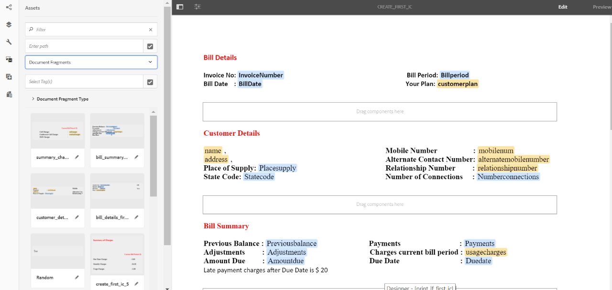

# Tutorial: Criar comunicação interativa {#tutorial-create-interactive-communication}

Este tutorial é uma etapa da série [Criar sua primeira comunicação](/help/forms/using/create-your-first-interactive-communication.md) interativa. É recomendável seguir a série em sequência cronológica para entender, executar e demonstrar o caso de uso do tutorial completo.

Depois de criar todos os blocos de construção, como modelo de dados de formulário, fragmentos de documento, modelos e temas para a versão da Web, você poderá start criando uma Comunicação Interativa.

As Comunicações interativas podem ser fornecidas por meio de dois canais: Imprimir e Web. Você também pode criar um canal de comunicação interativa com impressão como o principal. A opção Imprimir como principal para o canal da Web garante que o conteúdo, a herança e o vínculo de dados do canal da Web sejam derivados do canal Imprimir. Ela também garante que as alterações feitas no canal Imprimir sejam sincronizadas no canal da Web. No entanto, os autores de Comunicações interativas podem interromper a herança de componentes específicos no canal da Web.

Este tutorial o orienta pelas etapas para criar comunicações interativas para canais de impressão e da Web. No final deste tutorial, você poderá:

* Criar comunicação interativa para o canal de impressão
* Criar comunicação interativa para o canal da Web
* Crie Comunicações interativas da Web e da impressão com a opção Imprimir como Principal

## Criar Comunicações Interativas para Impressão e Web sem sincronização {#create-interactive-communications-for-print-and-web-with-no-synchronization}

### Criar comunicação interativa para canal de impressão {#create-interactive-communication-for-print-channel}

Esta é a lista de recursos que já foram criados neste tutorial e são necessários ao criar a Comunicação interativa para o canal Imprimir:

**Modelo de impressão:** [create_first_ic_print_template](../../forms/using/create-templates-print-web.md)

**Modelo de dados de formulário:** [FDM_Create_First_IC](../../forms/using/create-form-data-model0.md)

**Fragmentos de Documento:** [bill_details_first_ic, customer_details_first_ic, bill_summary_first_ic, summary_charge_first_ic](../../forms/using/create-document-fragments.md)

**Fragmentos de layout:** [table_lf](../../forms/using/create-templates-print-web.md)

**Imagens:** PayNow e ValueAddedServices

1. Faça logon na instância do autor do AEM e navegue até **[!UICONTROL Adobe Experience Manager]** > **[!UICONTROL Formulários]** > **[!UICONTROL Formulários e Documentos]**.
1. Toque em **Criar** e selecione Comunicação **** interativa. O assistente **Criar comunicação** interativa é exibido.
1. Especifique **create_first_ic** no **Título** e no campo **Nome** . Selecione **FDM_Create_First_IC** como o Modelo de dados de formulário e toque em **Próximo**.
1. No assistente de **Canais** :

   1. Especifique **create_first_ic_print_template** como o modelo de impressão e toque em **Selecionar**. Verifique se a caixa de seleção **Usar impressão como Principal para Canal** da Web não está marcada.

   1. Especifique a pasta **Create_First_IC_models** > **Create_First_IC_Web_Template** como o modelo da Web e toque em **Selecionar**.

   1. Toque em **Criar**.

   Uma mensagem de confirmação é exibida informando que a Comunicação interativa foi criada com êxito.

1. Toque em **Editar** para abrir a Comunicação interativa no painel direito.
1. Vá até a guia **Ativos** e aplique o filtro para exibir somente os fragmentos de documento no painel esquerdo.
1. Arraste e solte os seguintes fragmentos de documento em suas áreas de público alvo na Comunicação interativa:

   | Fragmento do documento | Área de destino |
   |---|---|
   | bill_details_first_ic | DetalhesDaLista |
   | customer_details_first_ic | DetalhesCliente |
   | bill_summary_first_ic | Resumo de Lista |
   | summary_charge_first_interative_Communication | Encargos |

   

1. Toque na área de público alvo **Gráficos** e toque em **+** para adicionar um componente **Gráfico** .
1. Toque no componente Gráfico e selecione  (Configurar). As propriedades do gráfico são exibidas no painel esquerdo:

   1. Especifique um nome para o gráfico.
   1. Selecione **Pizza** na lista suspensa Tipo **de** gráfico.
   1. Selecione a propriedade **calltype** no tipo de objeto de modelo de dados de **chamadas** na seção do eixo **** X. Toque em .
   1. Selecione **Frequency** na lista suspensa **Function** .
   1. Selecione a propriedade **calltype** no tipo de objeto de modelo de dados de **chamadas** na seção do eixo **** Y. Toque em .
   1. Toque em  para salvar as propriedades do gráfico.

1. Vá para a guia **Ativos** e aplique o filtro para exibir somente os fragmentos de layout no painel esquerdo. Arraste e solte o fragmento do layout **table_lf** na área de público alvo Chamadas **** discriminadas.
1. Selecione o Campo de texto na coluna **Data** e toque em  (Configurar).
1. Selecione Objeto **de Modelo de** Dados na lista suspensa Tipo **de** Vínculo e selecione **chamadas** > **calldate**. Toque duas vezes em  para salvar as propriedades.

   Da mesma forma, crie vínculos com o **tempo** de chamada, o **número** de chamada, a **duração** e os encargos **de** chamada para os campos de texto nas colunas **Tempo************** , Número, Duraçãoe Encargos, respectivamente.

1. Toque na área de público alvo **PayNow** e toque **+** para adicionar um componente **de imagem** .
1. Toque no componente de Imagem e selecione  (Configurar). As propriedades da imagem são exibidas no painel esquerdo:

   1. Especifique **PayNow** como o nome da imagem no campo **Nome** .
   1. Toque em **Carregar**, selecione a imagem salva no sistema de arquivos local e toque em **Abrir**.
   1. Toque em  para salvar as propriedades da imagem.

1. Repita as etapas 13 e 14 para adicionar a imagem **ValueAddedServices** à área de público alvo **ValueAddedServices** .

### Create Interactive Communication for Web channel {#create-interactive-communication-for-web-channel}

Esta é a lista de recursos que já foram criados neste tutorial e são necessários ao criar a Comunicação interativa para o canal da Web:

**Modelo da Web:** [Create_First_IC_Web_Template](../../forms/using/create-templates-print-web.md)

**Modelo de dados de formulário:** [FDM_Create_First_IC](../../forms/using/create-form-data-model0.md)

**Fragmentos de Documento:** [bill_details_first_ic, customer_details_first_ic, bill_summary_first_ic, summary_charge_first_ic](../../forms/using/create-document-fragments.md)

**Imagens:** PayNowWeb e ValueAddedServicesWeb

1. Faça logon na instância do autor do AEM e navegue até **[!UICONTROL Adobe Experience Manager]** > **[!UICONTROL Formulários]** > **[!UICONTROL Formulários e Documentos]**.
1. Toque em **Criar** e selecione Comunicação **** interativa. O assistente **Criar comunicação** interativa é exibido.
1. Especifique **create_first_ic** no **Título** e no campo **Nome** . Selecione **FDM_Create_First_IC** como o Modelo de dados de formulário e toque em **Próximo**.
1. No assistente de **Canais** :

   1. Especifique **create_first_ic_print_template** como o modelo de impressão e toque em **Selecionar**. Verifique se a caixa de seleção **Usar impressão como Principal para Canal** da Web não está marcada.

   1. Especifique a pasta **Create_First_IC_models** > **Create_First_IC_Web_Template** como o modelo da Web e toque em **Selecionar**.

   1. Toque em **Criar**.

   Uma mensagem de confirmação é exibida informando que a Comunicação interativa foi criada com êxito.

1. Toque em **Editar** para abrir a Comunicação interativa no painel direito.
1. Toque na guia **Canais** no painel esquerdo e toque em **Web**.
1. Vá até a guia **Ativos** e aplique o filtro para exibir somente os fragmentos de documento no painel esquerdo.
1. Arraste e solte os seguintes fragmentos de documento em suas áreas de público alvo na Comunicação interativa:

   | Fragmento do documento | Área de destino |
   |---|---|
   | bill_details_first_ic | DetalhesDaLista |
   | customer_details_first_ic | DetalhesCliente |
   | bill_summary_first_ic | Resumo de Lista |
   | summary_charge_first_interative_Communication | Encargos |

1. Toque em **Resumo da área de público alvo Encargos** e toque em **+** para adicionar um componente **Gráfico** .
1. Toque no componente Gráfico e selecione  (Configurar). As propriedades do gráfico são exibidas no painel esquerdo:

   1. Especifique um nome para o gráfico.
   1. Selecione **Pizza** na lista suspensa Tipo **de** gráfico.

   1. Selecione a propriedade **calltype** no tipo de objeto de modelo de dados de **chamadas** na seção do eixo **** X. Toque em .

   1. Selecione **Frequency** na lista suspensa **Function** .

   1. Selecione a propriedade **calltype** no tipo de objeto de modelo de dados de **chamadas** na seção do eixo **** Y. Toque em .

   1. Toque em  para salvar as propriedades do gráfico.

1. Selecione a guia Fontes **de** dados no painel esquerdo e arraste e solte o objeto de modelo de dados de **chamadas** para a área de público alvo Chamadas **** detalhadas. Todas as propriedades no objeto de modelo de dados de **chamadas** são exibidas como colunas de tabela na área de público alvo Chamadas **** detalhadas no painel direito.

   Com base no caso de uso, você precisa das colunas Data da chamada, Hora da chamada, Número da chamada, Duração da chamada e Encargos de chamada na tabela.

   

1. Selecione o cabeçalho da coluna da tabela **Mobilenum** e selecione **Mais opções** > **Excluir coluna**. Da mesma forma, exclua a coluna Tipo de **chamada** .
1. Selecione o cabeçalho da coluna da tabela **Calldate** e toque em  (Editar) para renomear o texto para Data **de** chamada. Da mesma forma, renomeie outros cabeçalhos de coluna na tabela.
1. Com base no caso de uso, insira um botão **Pagar agora** na Comunicação interativa que fornece ao usuário uma opção para fazer o pagamento clicando no botão. Execute as seguintes etapas para inserir o botão:

   1. Toque na área de público alvo **Pagar agora** e toque em **+** para adicionar um componente **de Texto** .

   1. Toque no componente de texto e toque em  (Editar).
   1. Renomeie o texto para **Pagar agora**.
   1. Selecione o texto e toque no ícone Hiperlink.
   1. Especifique o URL de pagamento no campo **Caminho** .
   1. Selecione **Nova guia** na lista suspensa **Público alvo** .

   1. Toque em  para salvar as propriedades do hiperlink.

1. Selecione **Estilo** na lista suspensa ao lado da opção **Pré-visualização** .

   

1. Estilo do texto do hiperlink para exibi-lo como um botão na Comunicação interativa usando as seguintes etapas:

   1. Toque no componente de texto e selecione  (Editar).
   1. Na seção **Borda** , especifique **1,5px** como Largura **da** Borda, selecione **Sólido** como Estilo **da****** **** Borda e especifique 46pxcomo Raio da Borda.

   1. Selecione Vermelho como a cor de plano de fundo do botão na seção **Plano de fundo** .
   1. No campo **Margem** para a seção **Dimensões e posição** , toque no ícone **Editar simultaneamente** e defina a margem **Direita** como **450px**. Os campos Superior, Inferior e Esquerdo são definidos como vazios.

   

1. Toque na área de público alvo **Pagar agora** e toque **+** para adicionar um componente **de Imagem** .
1. Toque no componente de Imagem e selecione  (Configurar). As propriedades da imagem são exibidas no painel esquerdo:

   1. Especifique **PayNow** como o nome da imagem no campo **Nome** .

   1. Toque em **Carregar**, selecione a imagem **PayNowWeb** salva no sistema de arquivos local e toque em **Abrir**.

   1. Toque em  para salvar as propriedades da imagem.

1. Com base no caso de uso, insira um botão **Assinar** na Interative Communication que fornece ao usuário uma opção para assinar os serviços de valor agregado clicando no botão.

   Repita as etapas 13 - 17 para adicionar um botão **Assinar** à área de público alvo Serviços **de** valor agregado e adicionar a imagem **ValueAddedServicesWeb** .

## Criar Comunicações Interativas para Impressão e Web com sincronização automática {#create-interactive-communications-for-print-and-web-with-auto-synchronization}

Você também pode criar uma Comunicação interativa ao ativar a sincronização automática entre canais Impressos e da Web. Para ativar a sincronização automática, selecione a opção Imprimir como principal ao criar a Comunicação interativa. Selecionar a opção Imprimir como principal garante que o conteúdo, a herança e o vínculo de dados do canal da Web sejam derivados do canal Imprimir. Ela também garante que as alterações feitas no canal Imprimir sejam refletidas no canal da Web.

Execute as seguintes etapas para derivar o conteúdo do canal da Web usando o canal de impressão:

1. Faça logon na instância do autor do AEM e navegue até **[!UICONTROL Adobe Experience Manager]** > **[!UICONTROL Formulários]** > **[!UICONTROL Formulários e Documentos]**.
1. Toque em **Criar** e selecione Comunicação **** interativa. O assistente **Criar comunicação** interativa é exibido.
1. Especifique **create_first_ic** no **Título** e no campo **Nome** . Selecione **FDM_Create_First_IC** como o Modelo de dados de formulário e toque em **Próximo**.
1. No assistente de **Canais** :

   1. Especifique **create_first_ic_print_template** como o modelo de impressão e toque em **Selecionar**.

   1. Marque a caixa de seleção **Usar impressão como Principal para o Canal** da Web.
   1. Especifique a pasta **Create_First_IC_models** > **Create_First_IC_Web_Template** como o modelo da Web e toque em **Selecionar**.

   1. Toque em **Criar**.

   Uma mensagem de confirmação é exibida informando que a Comunicação interativa foi criada com êxito.

1. Toque em **Editar** para abrir a Comunicação interativa no painel direito.
1. Execute as etapas 6 - 15 da seção [Criar comunicação interativa para canal](../../forms/using/create-interactive-communication0.md#create-interactive-communication-for-print-channel) de impressão.
1. Toque na guia **Canais** no painel esquerdo e toque em **Web** para gerar automaticamente conteúdo para o canal da Web a partir do canal Imprimir.
1. Como a caixa de seleção **Usar impressão como Principal para o Canal** da Web está selecionada na etapa 4, o conteúdo e os vínculos são gerados automaticamente para o canal da Web a partir do canal Imprimir.

   O conteúdo do canal de impressão é inserido abaixo do conteúdo do modelo do canal da Web. Para modificar o conteúdo do canal da Web que foi gerado automaticamente a partir do canal Imprimir, você pode cancelar a herança para qualquer área do público alvo.

   Passe o mouse sobre a área de público alvo relevante no canal da Web e selecione  (Cancelar herança) e, na caixa de diálogo **Cancelar herança** , toque em **Sim**.

   

   Se você cancelou a herança de um componente, poderá reativá-la. Para reativar a herança, passe o mouse sobre o limite da área do público alvo relevante, que inclui o componente, e toque em .

1. Selecione a guia **Conteúdo** no painel esquerdo.
1. Arraste e solte o conteúdo de canal da Web gerado automaticamente nos painéis existentes no modelo da Web usando a árvore de conteúdo. A seguir está a lista de componentes que precisam ser reorganizados:

   * Componente Detalhes da Lista para o painel Detalhes da Lista
   * Componente Detalhes do cliente para o painel Detalhes do cliente
   * Componente Resumo da Lista para o painel Resumo da Lista
   * Resumo do componente Encargos para o painel Resumo de Encargos
   * Fragmento de layout (tabela) para o painel Chamadas discriminadas

   

1. Repita as etapas 13 - 18 de [Criar comunicação interativa para o canal](../../forms/using/create-interactive-communication0.md#create-interactive-communication-for-web-channel) da Web para inserir os hiperlinks **Pagar agora** e **Assinar** no canal da Web da Comunicação interativa.

