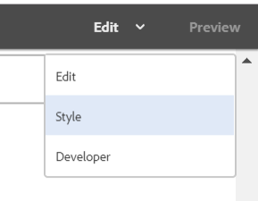

# Tutorial: Criar comunicação interativa {#tutorial-create-interactive-communication}

Este tutorial é uma etapa do [Criar sua primeira comunicação interativa](/help/forms/using/create-your-first-interactive-communication.md) série. É recomendável seguir a série em sequência cronológica para entender, executar e demonstrar o caso de uso tutorial completo.

Depois de criar todos os blocos de construção, como o modelo de dados de formulário, fragmentos de documento, modelos e temas para a versão da Web, você pode começar a criar uma Comunicação interativa.

As Comunicações interativas podem ser entregues por meio de dois canais: Imprimir e Web. Você também pode criar um canal de Comunicação interativa com impressão como o principal. A opção Imprimir como principal para canal da Web garante que o conteúdo, a herança e o vínculo de dados do canal da Web sejam derivados do canal Imprimir. Também garante que as alterações feitas no canal de Impressão sejam sincronizadas no canal da Web. Os autores de Comunicação interativa, no entanto, têm permissão para quebrar a herança de componentes específicos no canal da Web.

Este tutorial o orienta pelas etapas para criar comunicações interativas para canais de Impressão e Web. Ao final deste tutorial, você poderá:

* Criar comunicação interativa para o canal de impressão
* Criar comunicação interativa para o canal da Web
* Crie Comunicações Interativas da Web e Imprimir como Principal

## Criar Comunicações Interativas para Impressão e Web sem sincronização {#create-interactive-communications-for-print-and-web-with-no-synchronization}

### Criar comunicação interativa para canal de impressão {#create-interactive-communication-for-print-channel}

Esta é a lista de recursos que já foram criados neste tutorial e são necessários ao criar a Comunicação interativa para o canal Imprimir:

**Modelo de impressão:** [create_first_ic_print_template](../../forms/using/create-templates-print-web.md)

**Modelo de dados de formulário:** [FDM_Create_First_IC](../../forms/using/create-form-data-model0.md)

**Fragmentos do documento:** [bill_details_first_ic, customer_details_first_ic, bill_summary_first_ic, summary_charge_first_ic](../../forms/using/create-document-fragments.md)

**Fragmentos de layout:** [table_lf](../../forms/using/create-templates-print-web.md)

**Imagens:** PayNow e ValueAddedServices

1. Faça logon na instância do autor do AEM e navegue até **[!UICONTROL Adobe Experience Manager]** > **[!UICONTROL Forms]** > **[!UICONTROL Forms &amp; Documents]**.
1. Toque **Criar** e selecione **Comunicação interativa**. O **Criar comunicação interativa** é exibido.
1. Especificar **create_first_ic** no **Título** e **Nome** campo. Selecionar **FDM_Create_First_IC** como Modelo de dados de formulário e toque em **Próximo**.
1. No **Canais** assistente:

   1. Especificar **create_first_ic_print_template** como Modelo de impressão e toque em **Selecionar**. Certifique-se de que **Usar Imprimir como Principal para Canal da Web** caixa de seleção não está selecionada.

   1. Especificar **Create_First_IC_templates** pasta > **Create_First_IC_Web_Template** como o template web e toque em **Selecionar**.

   1. Toque **Criar**.

   Uma mensagem de confirmação é exibida informando que a Comunicação interativa foi criada com êxito.

1. Toque **Editar** para abrir a Comunicação interativa no painel direito.
1. Vá para o **Ativos** e aplique o filtro para exibir somente os fragmentos de documento no painel esquerdo.
1. Arraste e solte os seguintes fragmentos de documento em suas áreas de destino na Comunicação interativa:

   | Fragmento do documento | Área de destino |
   |---|---|
   | bill_details_first_ic | Detalhes da Lista |
   | customer_details_first_ic | Detalhes do cliente |
   | bill_summary_first_ic | Resumo da Lista |
   | summary_charge_first_interative_communication | Encargos |

   

1. Toque **Gráficos** área de destino e toque **+** para adicionar uma **Gráfico** componente.
1. Toque no componente Gráfico e selecione  (Configurar). As propriedades do gráfico são exibidas no painel esquerdo:

   1. Especifique um nome para o gráfico.
   1. Selecionar **Pizza** do **Tipo de gráfico** lista suspensa.
   1. Selecione o **calltype** propriedade do **chamadas** tipo de objeto de modelo de dados na **Eixo X** seção. Toque .
   1. Selecionar **Frequência** do **Função** lista suspensa.
   1. Selecione o **calltype** propriedade do **chamadas** tipo de objeto de modelo de dados na **Eixo Y** seção. Toque .
   1. Toque  para salvar as propriedades do gráfico.

1. Vá para o **Ativos** e aplique o filtro para exibir somente os fragmentos de layout no painel esquerdo. Arraste e solte a **table_lf** fragmento de layout para o **Chamadas discriminadas** área de destino.
1. Selecione o campo de texto na guia **Data** coluna e toque  (Configurar).
1. Selecionar **Objeto do Modelo de Dados** do **Tipo de vínculo** e selecione **chamadas** > **calldate**. Toque  duas vezes para salvar as propriedades.

   Da mesma forma, crie um vínculo com **calltime**, **callnumber**, **callduration** e **encargos** para campos de texto na **Hora**, **Número**, **Duração** e **Encargos** colunas, respectivamente.

1. Toque **PagarAgora** área de destino e toque **+** para adicionar uma **Imagem** componente.
1. Toque no componente de Imagem e selecione  (Configurar). As propriedades da imagem são exibidas no painel esquerdo:

   1. Especificar **PagarAgora** como o nome da imagem no **Nome** campo.
   1. Toque **Upload**, selecione a imagem salva no sistema de arquivos local e toque em **Abrir**.
   1. Toque  para salvar as propriedades da imagem.

1. Repita as etapas 13 e 14 para adicionar **ValueAddedServices** para a **ValueAddedServices** área de destino.

### Criar comunicação interativa para canal da Web {#create-interactive-communication-for-web-channel}

Esta é a lista de recursos que já foram criados neste tutorial e são necessários ao criar a Comunicação interativa para o canal da Web:

**Modelo da Web:** [Create_First_IC_Web_Template](../../forms/using/create-templates-print-web.md)

**Modelo de dados de formulário:** [FDM_Create_First_IC](../../forms/using/create-form-data-model0.md)

**Fragmentos do documento:** [bill_details_first_ic, customer_details_first_ic, bill_summary_first_ic, summary_charge_first_ic](../../forms/using/create-document-fragments.md)

**Imagens:** PayNowWeb e ValueAddedServicesWeb

1. Faça logon na instância do autor do AEM e navegue até **[!UICONTROL Adobe Experience Manager]** > **[!UICONTROL Forms]** > **[!UICONTROL Forms &amp; Documents]**.
1. Toque **Criar** e selecione **Comunicação interativa**. O **Criar comunicação interativa** é exibido.
1. Especificar **create_first_ic** no **Título** e **Nome** campo. Selecionar **FDM_Create_First_IC** como Modelo de dados de formulário e toque em **Próximo**.
1. No **Canais** assistente:

   1. Especificar **create_first_ic_print_template** como Modelo de impressão e toque em **Selecionar**. Certifique-se de que **Usar Imprimir como Principal para Canal da Web** caixa de seleção não está selecionada.

   1. Especificar **Create_First_IC_templates** pasta > **Create_First_IC_Web_Template** como o template web e toque em **Selecionar**.

   1. Toque **Criar**.

   Uma mensagem de confirmação é exibida informando que a Comunicação interativa foi criada com êxito.

1. Toque **Editar** para abrir a Comunicação interativa no painel direito.
1. Toque no **Canais** no painel esquerdo e toque em **Web**.
1. Vá para o **Ativos** e aplique o filtro para exibir somente os fragmentos de documento no painel esquerdo.
1. Arraste e solte os seguintes fragmentos de documento em suas áreas de destino na Comunicação interativa:

   | Fragmento do documento | Área de destino |
   |---|---|
   | bill_details_first_ic | Detalhes da Lista |
   | customer_details_first_ic | Detalhes do cliente |
   | bill_summary_first_ic | Resumo da Lista |
   | summary_charge_first_interative_communication | Encargos |

1. Toque **Resumo dos Encargos** área de destino e toque **+** para adicionar uma **Gráfico** componente.
1. Toque no componente Gráfico e selecione  (Configurar). As propriedades do gráfico são exibidas no painel esquerdo:

   1. Especifique um nome para o gráfico.
   1. Selecionar **Pizza** do **Tipo de gráfico** lista suspensa.

   1. Selecione o **calltype** propriedade do **chamadas** tipo de objeto de modelo de dados na **Eixo X** seção. Toque .

   1. Selecionar **Frequência** do **Função** lista suspensa.

   1. Selecione o **calltype** propriedade do **chamadas** tipo de objeto de modelo de dados na **Eixo Y** seção. Toque .

   1. Toque  para salvar as propriedades do gráfico.

1. Selecione o **Fontes de dados** no painel esquerdo e arraste e solte a guia **chamadas** objeto de modelo de dados para **Chamadas discriminadas** área de destino. Todas as propriedades na **chamadas** o objeto de modelo de dados é exibido como colunas de tabela no **Chamadas discriminadas** área de destino no painel direito.

   Com base no caso de uso, você precisa das colunas Data da chamada, Hora da chamada, Número da chamada, Duração da chamada e Encargos de chamada na tabela.

   

1. Selecionar **Mobilenum** título da coluna da tabela e selecione **Mais opções** > **Excluir coluna**. Da mesma forma, exclua o **Calltype** coluna.
1. Selecione o **Calldate** cabeçalho e toque na coluna da tabela  (Editar) para renomear o texto como **Data da chamada**. Da mesma forma, renomeie outros cabeçalhos de coluna na tabela.
1. Com base no caso de uso, insira um **Pagar Agora** no botão Interative Communication que fornece ao usuário uma opção para fazer o pagamento clicando no botão . Execute as seguintes etapas para inserir o botão:

   1. Toque **Pagar Agora** área de destino e toque **+** para adicionar uma **Texto** componente.

   1. Toque no componente de texto e toque em  (Editar).
   1. Renomeie o texto para **Pagar Agora**.
   1. Selecione o texto e toque no ícone Hiperlink.
   1. Especifique o URL de pagamento no **Caminho** campo.
   1. Selecionar **Nova guia** from **Target** lista suspensa.

   1. Toque  para salvar as propriedades do hiperlink.

1. Selecionar **Estilo** na lista suspensa ao lado do **Visualizar** opção.

   

1. Estilo do texto do hiperlink para exibi-lo como um botão na Comunicação interativa usando as seguintes etapas:

   1. Toque no componente de texto e selecione  (Editar).
   1. No **Borda** seção , especifique **1,5px** as **Largura da Borda**, selecione **Sólido** as **Estilo da borda** e especifique **46px** as **Raio da borda**.

   1. Selecione Vermelho como a cor de plano de fundo do botão **Histórico** seção.
   1. No **Margem** campo para **Dimension &amp; Posição** toque na seção **Editar simultaneamente** e defina o **Right** margem como **450px**. Os campos Superior, Inferior e Esquerdo são definidos como em branco.

   

1. Toque **Pagar Agora** área de destino e toque **+** para adicionar uma **Imagem** componente.
1. Toque no componente de Imagem e selecione  (Configurar). As propriedades da imagem são exibidas no painel esquerdo:

   1. Especificar **PagarAgora** como o nome da imagem no **Nome** campo.

   1. Toque **Upload**, selecione o **PayNowWeb** imagem salva no sistema de arquivos local e toque em **Abrir**.

   1. Toque  para salvar as propriedades da imagem.

1. Com base no caso de uso, insira um **Assinar** na Comunicação interativa , que fornece ao usuário uma opção para assinar os serviços de valor agregado clicando no botão .

   Repita as etapas 13 a 17 para adicionar um **Assinar** para **Serviços de valor agregado** área de destino e adicione o **ValueAddedServicesWeb** imagem.

## Criar Comunicações interativas para impressão e Web com sincronização automática {#create-interactive-communications-for-print-and-web-with-auto-synchronization}

Você também pode criar uma Comunicação interativa permitindo a sincronização automática entre os canais Imprimir e Web. Para ativar a sincronização automática, selecione a opção Imprimir como principal ao criar a Comunicação interativa. Selecionar a opção Imprimir como principal garante que o conteúdo, a herança e o vínculo de dados do canal da Web sejam derivados do canal Imprimir. Também garante que as alterações feitas no canal de Impressão sejam refletidas no canal da Web.

Execute as seguintes etapas para derivar o conteúdo do canal da Web usando o Canal de impressão:

1. Faça logon na instância do autor do AEM e navegue até **[!UICONTROL Adobe Experience Manager]** > **[!UICONTROL Forms]** > **[!UICONTROL Forms &amp; Documents]**.
1. Toque **Criar** e selecione **Comunicação interativa**. O **Criar comunicação interativa** é exibido.
1. Especificar **create_first_ic** no **Título** e **Nome** campo. Selecionar **FDM_Create_First_IC** como Modelo de dados de formulário e toque em **Próximo**.
1. No **Canais** assistente:

   1. Especificar **create_first_ic_print_template** como Modelo de impressão e toque em **Selecionar**.

   1. Selecione o **Usar Imprimir como Principal para Canal da Web** caixa de seleção.
   1. Especificar **Create_First_IC_templates** pasta > **Create_First_IC_Web_Template** como o template web e toque em **Selecionar**.

   1. Toque **Criar**.

   Uma mensagem de confirmação é exibida informando que a Comunicação interativa foi criada com êxito.

1. Toque **Editar** para abrir a Comunicação interativa no painel direito.
1. Execute as etapas 6 - 15 de [Criar comunicação interativa para canal de impressão](../../forms/using/create-interactive-communication0.md#create-interactive-communication-for-print-channel) seção.
1. Toque no **Canais** no painel esquerdo e toque em **Web** para gerar conteúdo automaticamente para o canal da Web a partir do canal Imprimir.
1. Como **Usar Imprimir como Principal para Canal da Web** for selecionada na etapa 4, o conteúdo e os vínculos serão gerados automaticamente para o canal da Web a partir do canal Imprimir.

   O conteúdo do canal de impressão é inserido abaixo do conteúdo do modelo de canal da Web. Para modificar o conteúdo do canal da Web que foi gerado automaticamente pelo canal de Impressão, você pode cancelar a herança para qualquer área de destino.

   Passe o mouse sobre a área de destino relevante no canal da Web e selecione  (Cancelar herança) e, em seguida, no **Cancelar herança** diálogo, toque em **Sim**.

   

   Se você cancelou a herança de um componente, é possível reativá-la. Para reativar a herança, passe o mouse sobre o limite da área de destino relevante, que inclui o componente, e toque em .

1. Selecione o **Conteúdo** no painel esquerdo.
1. Arraste e solte o conteúdo do canal da Web gerado automaticamente nos painéis existentes no modelo da Web usando a árvore de conteúdo. Esta é a lista de componentes que precisam ser reorganizados:

   * Componente Detalhes da Lista para o painel Detalhes da Lista
   * Componente Detalhes do cliente para o painel Detalhes do cliente
   * Componente Resumo da Lista para o painel Resumo da Lista
   * Resumo do componente Encargos para o painel Resumo de Encargos
   * Fragmento de layout (tabela) para o painel Chamadas discriminadas

   

1. Repita as etapas 13 a 18 de [Criar comunicação interativa para canal da Web](../../forms/using/create-interactive-communication0.md#create-interactive-communication-for-web-channel) para inserir o **Pagar Agora** e **Assinar** hiperlinks no canal da Web da Comunicação interativa.
