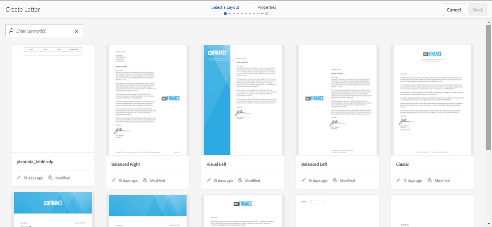

# Criar carta {#create-letter}

## Fluxo de trabalho do Gerenciamento de correspondência {#correspondence-management-workflow}

O fluxo de trabalho do Gerenciamento de correspondência consiste em quatro fases:

1. Criação de modelo
1. Criação do fragmento do documento
1. Criação de cartas
1. Pós-processamento

### Criação de modelo {#template-creation}

O gráfico a seguir mostra um fluxo de trabalho típico para criar um modelo de correspondência.

Neste fluxo de trabalho:

1. Os designers de formulário criam layouts e layouts de fragmento usando o Adobe Forms Designer e os carregam em um repositório CRX. Os layouts contêm campos de formulário típicos, recursos de layout, como um cabeçalho e rodapé, e &quot;áreas de público alvo&quot; vazias para o posicionamento do conteúdo. Posteriormente, os Application Specialists mapeiam o conteúdo necessário para essas áreas de público alvo. Mais informações sobre [criação de layout](/help/forms/using/layout-design-details.md).
1. Especialistas em assuntos de assunto dos departamentos Jurídico, Financeiro ou de Marketing, criam e carregam conteúdo, como cláusulas de texto, isenções de responsabilidade, termos e condições e imagens, como logotipos, que são reutilizados em vários modelos de correspondência.
1. Os especialistas em aplicativos criam modelos de correspondência. O especialista do aplicativo

   * Mapeia cláusulas de texto e imagens para áreas de público alvo nos modelos de layout
   * Define condições/regras para a inclusão de conteúdo
   * Vincula campos de layout e variáveis a modelos de dados subjacentes

1. O autor pré-visualização a carta e a envia para processamento posterior. Mais informações sobre o processamento [de](/help/forms/using/submit-letter-topostprocess.md)postagens.

#### Uso de modelos de carta fornecidos com o Gerenciamento de correspondência {#using-letter-templates-provided-with-correspondence-management}

Em vez de criar um modelo de layout do zero, você pode optar por modificar e reutilizar os modelos fornecidos pelo Gerenciamento de correspondência. Você pode usar o designer para modificar rapidamente a marca e os campos de dados e conteúdo dos modelos para atender às necessidades de sua organização. Para obter mais informações sobre os modelos de Gerenciamento de correspondência, consulte Modelos [de carta de](/help/forms/using/reference-cm-layout-templates.md)referência.

### Criação de fragmentos de documento {#document-fragment-creation}

Os fragmentos de documento são partes reutilizáveis\componentes de uma correspondência usando a qual você pode compor letras\correspondência.

Os fragmentos de documento são dos seguintes tipos:

#### Texto {#text}

Um ativo de texto é um conteúdo que consiste em um ou mais parágrafos de texto. Um parágrafo pode ser estático ou dinâmico. Um parágrafo dinâmico contém referências a elementos de dados, cujos valores são fornecidos em tempo de execução.

#### Lista {#list}

Lista é uma série de fragmentos de documento, incluindo texto, listas (a mesma lista não pode ser &quot;adicionada em si mesma&quot;), condições e imagens. A ordem dos elementos de lista pode ser fixa ou editável. Ao criar uma carta, você pode usar alguns ou todos os elementos da lista para replicar um padrão reutilizável de elementos.

#### Condição {#condition}

As condições permitem que você defina qual conteúdo será incluído no momento da criação da correspondência, com base nos dados fornecidos. A condição é descrita em termos de variáveis de controle. As variáveis podem ser um elemento de dicionário de dados ou um espaço reservado. Ao adicionar uma condição, você pode optar por incluir um ativo com base no valor que a variável de controle tem. As condições têm uma única saída com base em uma expressão. A primeira expressão é considerada verdadeira, com base na variável de condição atual. Seu valor se torna a saída da condição.

#### Layout fragment {#layout-fragment}

Um fragmento de layout é um layout que pode ser usado dentro de uma ou mais letras. Um fragmento de layout é usado para criar padrões repetíveis, especialmente tabelas dinâmicas. O layout pode conter campos de formulário típicos, como &quot;Endereço&quot; e &quot;Número de referência&quot;. Ele também contém subformulários vazios que indicam áreas de público alvo. Os layouts (XDPs) são criados no Designer e, em seguida, são [carregados no Forms e nos Documentos](/help/forms/using/get-xdp-pdf-documents-aem.md).

### Criação de cartas {#letter-creation}

Há duas maneiras de gerar a correspondência enviada aos clientes: controlado pelo usuário e pelo sistema.

#### Orientado pelo usuário {#user-driven}

Os funcionários voltados para o cliente, como os ajustadores de solicitações ou os trabalhadores de gabinete, podem criar correspondência personalizada. Usando uma interface de preenchimento de carta simples e intuitiva, os usuários comerciais podem adicionar texto opcional à correspondência, personalizar o conteúdo editável e, ao mesmo tempo, visualizar a correspondência em tempo real. Em seguida, eles podem enviar a correspondência personalizada para um processo back-end.

#### Orientado pelo sistema {#system-driven}

A geração de correspondência é automatizada, acionada por acionadores de eventos. Por exemplo, um aviso enviado a um cidadão solicitando o preenchimento antecipado de um imposto é gerado pela união do modelo predefinido com dados do cidadão. A carta final pode ser enviada por email, impressa, enviada por fax ou arquivada.

### Pós-processamento {#post-processing}

A correspondência final pode ser enviada para um processo back-end para pós-processamento. A correspondência pode ser:

1. Processado para impressão por email, fax ou lote ou colocado em uma pasta para impressão ou e-mail.
1. Enviado para revisão e aprovação.
1. Protegido pela aplicação de assinaturas digitais, certificação, criptografia ou gerenciamento de direitos.
1. Convertido em um documento PDF pesquisável que contém todos os metadados necessários para fins de arquivamento e auditoria.
1. Incluído em um Portfolio PDF que inclui mais documentos, como material de marketing. O Portfolio PDF pode ser enviado como a correspondência final.

### Arquitetura da solução Gerenciamento de correspondência {#correspondence-management-solution-architecture}

O gráfico a seguir fornece uma visão geral de uma arquitetura de exemplo da Solução Letters.

## Desconstrução de uma carta {#deconstructing-a-letter}

Este documento de Aviso de Cancelamento é um exemplo de uma correspondência típica:

<table> 
 <tbody> 
  <tr> 
   <td><strong>Elementos Carta</strong></td> 
   <td><strong>Descrição</strong></td> 
   <td><strong>Formado com</strong></td> 
  </tr> 
  <tr> 
   <td>Dados de sistemas empresariais back-end</td> 
   <td>Dados provenientes de sistemas de backend de empresas. Os dados são unidos dinamicamente com o modelo de correspondência.</td> 
   <td>O  arquivo de dados criado com base em um Dicionário de dados</td> 
  </tr> 
  <tr> 
   <td>Dados  Informados por Funcionário da linha de frente</td> 
   <td>Dados que podem ser fornecidos por um funcionário de linha frontal que está personalizando a carta antes de enviá-la.  </td> 
   <td>
Elementos  DD desprotegidos Parágrafos  de texto editáveis Variáveis/espaços reservados  
 </td> 
  </tr> 
  <tr> 
   <td>Parágrafos de texto pré-aprovados </td> 
   <td>Conteúdo de texto pré-aprovado. Especialistas em Assuntos legais, finanças ou uma linha de negócios que entendem o contexto comercial da carta, normalmente criam o conteúdo do texto. Conteúdo como cabeçalho, rodapé, isenção de responsabilidade e saudação seria comum à maioria das letras. No entanto, o conteúdo, como "motivo para rescisão", seria específico da carta em questão.</td> 
   <td>
Text\Lists\  do usuário\Layout
 
 
 </td> 
  </tr> 
  <tr> 
   <td>Dados  baseados na lógica personalizada?</td> 
   <td>Para algumas letras, como uma carta para solicitar mais informações sobre uma solicitação, usuários como o Ajustador de solicitações podem adicionar conteúdo de texto personalizado.</td> 
   <td>Fragmento do documento  do tipo Condição </td> 
  </tr> 
  <tr> 
   <td>Imagens armazenadas  do repositório central</td> 
   <td>Imagens como logotipos e imagens de assinatura. Imagens como logotipos corporativos apareceriam na maioria ou em toda a correspondência. As imagens de assinatura são específicas da carta e da pessoa em cujo nome a carta é enviada.</td> 
   <td>
Imagens armazenadas em ativos AEM (DAM)  
 
 
 </td> 
  </tr> 
 </tbody> 
</table>

## Analisar uma carta antes de construí-la {#analyze-a-letter-before-you-construct-it}

Analise cada letra para descobrir as várias partes que compõem a carta. O Application Specialist analisa as correspondências geradas.

* Quais partes da correspondência são estáticas e quais são dinâmicas. As variáveis que são preenchidas de fontes de dados de backend ou por usuários finais.
* A ordem em que os vários parágrafos de texto aparecem na correspondência, como se um usuário comercial pudesse alterar parágrafos durante a criação da correspondência.
* A correspondência é gerada pelo sistema ou exige que o usuário final edite a correspondência? Quantas correspondências são geradas pelo sistema e quantas exigem intervenção do usuário?
* Com que frequência o modelo de correspondência muda? Será atualizado anualmente, trimestralmente ou apenas quando uma determinada legislação mudar? Que tipo de mudanças são esperadas? É uma alteração para corrigir erros tipográficos, uma alteração no layout, adicionar mais campos, adicionar mais parágrafos e assim por diante.
* Ao planejar seus requisitos de correspondência, monte a lista de novos modelos de correspondência. Para cada modelo de correspondência, é necessário:

   * Cláusulas de texto, imagens e tabelas
   * Valores de dados de sistemas backend
   * O layout e os layouts de fragmento da correspondência
   * A ordem em que o conteúdo aparece na carta e as regras para inclusão e exclusão do conteúdo

* As condições em que os usuários corporativos, como ajustadores de solicitações ou trabalhadores de caixa, modificam o conteúdo ou partes da carta.
* Os cenários são narrativas que descrevem a experiência do usuário, os requisitos e os benefícios do uso da Solução Letters.
* Os cenários também fornecem:os conjuntos de habilidades e ferramentas necessários para o seu projeto.
* Práticas recomendadas para planejar sua implementação. &quot;Visão geral da implementação de alto nível.

## Benefícios da análise {#benefits-of-performing-the-analysis}

**Reutilização** de conteúdo Você tem uma lista consolidada de novo conteúdo necessário para gerar correspondência. Grande parte do conteúdo, como cabeçalhos, rodapés, textos de isenção de responsabilidade e introduções, é comum a muitas letras e pode ser reutilizada em várias letras. Todo esse conteúdo comum pode ser criado e aprovado por especialistas uma vez e reutilizado em muitos pedaços de correspondência.

**Criação do dicionário** de dados Haverá valores de dados, como &quot;ID do cliente&quot; e &quot;Nome do cliente&quot;, comuns a muitas letras. Você pode preparar uma lista consolidada de todos esses valores de dados. Normalmente, alguém da equipe de middleware da empresa é consultado ao planejar a estrutura. Essa é a base para a criação do Dicionário de dados.

**Fonte de dados de sistemas** de empresas de backend Você também conhecerá todos os valores de dados necessários e de onde os dados do sistema empresarial são obtidos. Você pode, então, arquitetar a implementação para extrair os dados do sistema corporativo e alimentar a solução Letters.

**Estimando a complexidade das cartas** É importante determinar quão complexo será criar uma determinada correspondência. Essa análise ajuda a determinar a quantidade de tempo e os conjuntos de habilidades necessários para criar os modelos de carta. Por sua vez, isso ajudará a estimar os recursos e os custos da implementação da solução &quot;Cartas&quot;.

## Complexidade da correspondência {#correspondence-complexity}

A complexidade da correspondência pode ser determinada pela análise dos seguintes parâmetros:

**Complexidade** do layout Quão complexo é o layout? Cartas como Aviso de cancelamento têm layouts simples. Enquanto letras como Confirmação de cobertura de solicitações têm um layout complexo com várias tabelas e mais de 60 campos de formulário. A criação de layouts complexos leva mais tempo e requer conjuntos avançados de habilidades de design de layout.

**Número de parágrafos e condições** de texto Um contrato de empréstimo pode ter 10 páginas e conter mais de 40 cláusulas de texto. Muitas destas cláusulas dependeriam de &quot;parâmetros de empréstimo&quot;. Com base nos termos e condições exatos, as cláusulas seriam incluídas ou excluídas do contrato. A criação dessas cartas requer um planeamento exaustivo e uma definição cuidadosa das condições complexas.

Esta tabela fornece algumas orientações que você pode usar para classificar suas letras:

<table> 
 <tbody> 
  <tr> 
   <td>
<strong>Nível de complexidade</strong>
 </td> 
   <td>
<strong>Complexidade de layout (subjetiva)</strong>
 </td> 
   <td>
<strong>Número de parágrafos de texto</strong>
 </td> 
   <td>
<strong>Número de textos ou imagens condicionais</strong>
 </td> 
   <td>
<strong>Perfil necessário</strong>
 </td> 
  </tr> 
  <tr> 
   <td>
Baixa complexidade
 </td> 
   <td>
Baixa. O layout tem poucos campos de formulário (&lt;15).
 
Normalmente, uma página.
 </td> 
   <td>
8
 </td> 
   <td>
1
 </td> 
   <td>
Habilidades de designer médio.
 </td> 
  </tr> 
  <tr> 
   <td>
Complexidade média
 </td> 
   <td>
Layout de média complexidade. Inclui estruturas como tabelas. Geralmente, mais de uma página.
 </td> 
   <td>
16
 </td> 
   <td>
2
 </td> 
   <td>
Habilidades de designer médio.
 
 
 
Capacidade de criar expressões complexas usando interfaces do usuário.
 </td> 
  </tr> 
  <tr> 
   <td>
Alta complexidade
 </td> 
   <td>
Layout complexo. Pode ser maior que três páginas. Contém tabelas e mais de 60 campos de formulário.
 </td> 
   <td>
40
 </td> 
   <td>
8
 </td> 
   <td>
Habilidades do Expert Designer.
 
 
 
Capacidade de criar expressões complexas usando interfaces do usuário.
 </td> 
  </tr> 
 </tbody> 
</table>

## Visão geral da criação de uma carta {#overview-of-creating-a-letter}

1. Selecione o layout apropriado que serve como a base da carta e crie uma carta.
1. Adicione módulos de dados ou fragmentos de layout à letra e configure-os.
1. Escolha para pré-visualização da correspondência.
1. Edite e configure os campos, variáveis, conteúdo e anexos.

### Pré-requisitos {#prerequisites}

Primeiro, você precisa dos seguintes itens para criar uma correspondência:

* [Pacote](compatibility-package.md)de compatibilidade. Instale o Pacote de compatibilidade para visualização da opção **Cartas** na página do **Forms** .
* A letra XDP ([layout](/help/forms/using/document-fragments.md)).
* Outros XDPs (fragmentos[de](document-fragments.md#document-fragments)layout) que formam partes da carta. Os XDPs\Layouts são criados no [Designer](https://help.adobe.com/en-US/AEMForms/6.1/DesignerHelp/).
* O dicionário [de](/help/forms/using/data-dictionary.md) dados relevante (opcional).
* Os módulos [de](/help/forms/using/document-fragments.md) dados que você deseja usar na correspondência.
* [Dados](/help/forms/using/data-dictionary.md#p-working-with-test-data-p) de teste é o arquivo XML com os dados de teste inseridos nele. Os dados de teste são necessários se você estiver usando um dicionário de dados.

## Criar um modelo de carta {#create-a-letter-template}

### Selecione um layout e insira as propriedades das letras {#select-a-layout-and-enter-the-letter-properties}

1. Selecione **Forms** > **Cartas**.

1. Selecione **Criar > Carta**. O Gerenciamento de correspondência exibe os layouts disponíveis (XDPs). Esses layouts vêm do Designer. Os layouts também incluem os modelos de carta que o Gerenciamento de correspondência fornece na caixa. Para obter mais informações sobre os modelos de Gerenciamento de correspondência, consulte Modelos [de carta de](/help/forms/using/reference-cm-layout-templates.md)referência. Para adicionar seus próprios layouts, crie arquivos XDP (layout) no Designer e, em seguida, [carregue-os no AEM Forms](/help/forms/using/get-xdp-pdf-documents-aem.md).

   

1. Selecione um layout tocando nele e toque em **Próximo**.

   

1. Insira as propriedades para a Correspondência e toque em **Salvar:**

   * **Título (opcional):** Insira o título da carta. O título não precisa ser exclusivo e pode ter caracteres especiais e caracteres diferentes do inglês.
   * **Nome:** O nome exclusivo da carta. Não podem existir duas letras em nenhum estado com o mesmo nome. No campo Nome, é possível digitar somente caracteres, números e hífens do idioma inglês. O campo Nome é preenchido automaticamente com base no campo Título. Os caracteres especiais, os espaços, os números e os caracteres que não estão em inglês inseridos no campo Título são substituídos por hífens no campo Nome. Embora o valor no campo Título seja copiado automaticamente para o Nome, é possível editar o valor.
   * **Descrição (Opcional):** Descreva a carta para sua referência.
   * **Dicionário de dados (opcional)**: O Dicionário de dados pode ser associado à correspondência. Os ativos que você inserir posteriormente nesta correspondência devem ter o mesmo dicionário de dados que você escolher para a correspondência aqui ou nenhum dicionário de dados.
   * **Tags (opcional):** Selecione as tags a serem aplicadas à correspondência. Você também pode digitar um nome de tag novo/personalizado e pressionar Enter para criá-lo.
   * **Processo de publicação (opcional):** Selecione o processo de publicação a ser aplicado ao modelo de carta. Há processos de postagem fora da caixa e aqueles que você criou usando AEM, como email e impressão.

   

1. O sistema exibe uma mensagem: &quot;Carta criada com êxito.&quot; (na mensagem de alerta) Toque em **Abrir** para configurar os módulos de dados e os fragmentos de layout nele contidos. Ou toque em **Concluído** para voltar à página anterior.

   

   **Próximo**: Quando você toca em **Abrir**, o Gerenciamento de correspondência exibe uma representação do layout com todos os componentes do layout (XDP) listados. Continue inserindo os Módulos de [dados e Fragmentos de layout e Configurando-os](/help/forms/using/create-letter.md#p-insert-data-modules-and-layout-fragments-in-a-letter-and-configure-them-p).

### Inserir módulos de dados e fragmentos de layout em uma letra e configurá-los {#insert-data-modules-and-layout-fragments-in-a-letter-and-configure-them}

Depois de criar uma correspondência, toque em Abrir, o Gerenciamento de correspondência exibe uma representação do layout com todas as áreas de subformulários/públicos alvos no layout (XDP) listado. Em cada uma das áreas de público alvo, você pode optar por inserir um Módulo de dados ou um Fragmento de layout (e, em seguida, módulos de dados no fragmento de layout).

>[!NOTE]
>
>Você também pode escolher tocar no ícone Editar para uma letra na página Letras para Inserir módulos de dados e fragmentos de layout em uma letra e configurá-los.

1. Toque em **Inserir** para cada um dos subformulários e selecione Módulos de dados ou um Fragmento de layout para inserir em cada um dos subformulários.

   

1. Selecione Módulo de dados ou Fragmento de layout para essas opções para cada um dos subformulários e escolha os Módulos de dados ou os Fragmentos de layout a serem inseridos. Um fragmento de layout permite inserir ainda mais módulos de dados ou fragmentos de layout nele de acordo com seu design (até quatro níveis).

   

1. Se um fragmento de layout for inserido, o nome desse fragmento aparecerá no subformulário. E, de acordo com o fragmento selecionado, subformulários aninhados aparecem no subformulário.
1. Depois que os Módulos de dados selecionados forem inseridos no layout, você poderá tocar no modo de configuração e definir o seguinte após tocar no ícone Editar para cada um dos módulos:

   1. **Editável**: Quando essa opção é selecionada, o conteúdo pode ser editado na interface do usuário Criar correspondência. Marque o conteúdo como editável somente se ele exigir que o usuário comercial (como um Ajustador de solicitações) o modifique.
   1. **Obrigatório**: Quando essa opção é selecionada, o conteúdo é necessário na interface do usuário Criar correspondência.
   1. **Selecionado**: Quando essa opção é selecionada, o conteúdo é selecionado por padrão na interface do usuário Criar correspondência.
   1. **Recuo**: Aumente ou diminua o recuo do módulo/conteúdo na letra. O recuo é especificado em termos de níveis, começando em 0. Cada nível recua 36 pontos. Para obter mais informações sobre como personalizar formulários, consulte Configurações **[!UICONTROL de gerenciamento de]** correspondência no fluxo de trabalho [do](submit-letter-topostprocess.md#formsworkflow)Forms.
   1. **Quebra de página antes**: Se você definir a opção Quebra de página antes como ativada, o conteúdo DESTE módulo sempre será exibido em uma nova página.
   1. **Quebra de página após**: Se você definir a opção Quebra de página depois como ativada para um módulo específico, o conteúdo do módulo AVANÇAR sempre será exibido em uma nova página.

   

1. Para editar um módulo, toque no ícone Editar ao lado dele. Depois de editar os módulos, toque em **Salvar**.

   Nesta página, você também pode fazer o seguinte para os subformulários:

   1. **Permitir texto** gratuito: Se Permitir texto livre estiver ativado, o usuário poderá adicionar texto em linha na visualização CCR. Na visualização CCR, uma ação &#39;T&#39; é ativada para as áreas de público alvo com Permitir texto livre ativado e quando o usuário toca nela, ela solicita o nome e a descrição do texto e, ao tocar em OK, abre o texto no modo de edição, onde o usuário pode adicionar texto. Portanto, isto funciona como outros módulos de texto
   1. **Bloquear pedido**: Bloqueia a ordem dos subformulários na letra. O autor não tem permissão para reordenar os subformulários/componentes ao criar a carta.

   Nesta página, você também pode fazer o seguinte para cada um dos ativos nos subformulários:

   1. **Altere a ordem dos ativos**: arraste e solte um ativo que contém o ícone de reordem de um ativo ( ).
   1. **Excluir ativos**: Toque no ícone Excluir ao lado de um ativo para excluí-lo.
   1. **Ativos** de pré-visualização: Toque no ícone de mostrar pré-visualização ( ) ao lado de um ativo.

1. Toque em **Avançar**.
1. A página Dados detalha como os campos de dados e as variáveis são usados no modelo. Os dados podem ser vinculados a fontes de dados, como um dicionário de dados ou uma entrada do usuário. Cada campo define as propriedades a partir das quais o dicionário de dados mapeia dados ou qual legenda é exibida para os campos de entrada do usuário.

   Ligação:

   * Os elementos de **campo** podem ser vinculados a um literal, a um elemento de dicionário de dados, a um ativo ou a um valor especificado pelo usuário. Também é possível ignorar um elemento de campo ao vinculá-lo à opção Ignorar.
   * Os elementos de **variável** podem ser vinculados a um literal, a um elemento de dicionário de dados, a um campo, a uma variável, a um ativo ou a um valor especificado pelo usuário.

   A seguir estão alguns campos principais no vínculo:

   * **Várias linhas**: Você pode especificar se a entrada de dados de um campo ou variável é de várias linhas. Se você selecionar essa opção, a caixa de entrada do campo ou da variável será exibida como uma caixa de entrada de várias linhas na Visualização de edição de dados. O campo ou variável também é exibido como várias linhas nas visualizações de dados e conteúdo na interface do usuário Criar correspondência. O campo de entrada de várias linhas é semelhante ao campo para inserir um comentário em um TextModule. A opção de várias linhas está disponível somente para campos e variáveis com o tipo de vínculo Usuário ou Elementos de dicionário de dados desprotegidos.
   * **Opcional**: Você pode especificar se o valor para campo ou variável é opcional ou não. A opção de campo opcional está disponível para campos e variáveis com o tipo de vínculo Usuário ou Elementos de dicionário de dados desprotegidos.

   * **Validação** de campo/variável: Para fornecer a validação aprimorada do valor de um campo ou variável, é possível atribuir um validador ao campo ou à variável. Essa opção está disponível somente para campos e variáveis com o tipo de vínculo Usuário ou Elementos de dicionário de dados desprotegidos.
   * **Legenda** e **dica** de ferramenta: Legenda é o rótulo do campo que aparece antes do campo na interface do usuário do CCR. Essa opção está disponível para campos e variáveis com o tipo de vínculo Usuário ou Elementos de dicionário de dados desprotegidos.

   Estes são os tipos de validação que você pode usar para os campos:

   * **Validador** de cadeia de caracteres: Use o Validador de string para especificar um comprimento mínimo e máximo da string inserida no campo ou na variável. Ao criar um validador de string, certifique-se de especificar parâmetros de validação válidos. Insira um comprimento válido para os valores mínimo e máximo. Para o validador de string, você pode especificar o comprimento mínimo e máximo do valor que pode ser inserido. Se o valor inserido não for de acordo com os valores mínimo e máximo especificados, o campo relevante na interface do usuário do CCR será marcado em cor vermelha.

   * **Validador** de número: Use o Validador de número para especificar o valor numérico mínimo e máximo inserido em um campo ou variável. Ao criar um Validador de número, certifique-se de especificar parâmetros de validação válidos. Insira valores numéricos para os valores mínimo e máximo.

   * **Validador** de Expressão regular: Use o Validador de Expressão regular para definir uma expressão regular usada para validar o valor de um campo ou variável. Além disso, você pode personalizar a mensagem de erro. Ao criar um Validador de Expressão regular, especifique uma expressão regular válida.
   >[!NOTE]
   >
   >Os validadores de campos e variáveis estão disponíveis somente em campos ou variáveis com o tipo de vínculo Usuário ou Elementos de dicionário de dados desprotegidos.

   

1. Depois de especificar o vínculo, toque em **Próximo**. O Gerenciamento de correspondência exibe a tela Anexos.

### Configurar os anexos {#set-up-the-attachments}

1. Selecione **Adicionar ativo**.
1. Na tela Selecionar ativo, toque nos ativos a serem anexados com a letra e toque em **Concluído**. É necessário primeiro fazer upload dos ativos para os Ativos. É recomendável anexar somente documentos PDF e do Microsoft Office, mas também pode anexar imagens. Para obter mais informações sobre como fazer upload de ativos no DAM, consulte [Fazer upload de ativos](/help/assets/manage-assets.md).
1. Para bloquear a ordem dos ativos na lista de modo que o Ajustador de solicitações não possa alterar a ordem, toque em **Bloquear pedido**. Se você não selecionar essa opção, o Ajustador de solicitações poderá alterar a ordem dos itens de lista.
1. Para alterar a ordem dos ativos, arraste e solte um ativo que contém o ícone de reordem de um ativo ( ).
1. Toque em **Editar** na frente de um anexo e especifique um anexo como Obrigatório se não quiser que o autor o exclua. Especifique um anexo como Selecionado se desejar que ele seja pré-selecionado na interface do CCR.
1. Selecione Acesso **à** biblioteca para conceder acesso à biblioteca. Se o Acesso à biblioteca estiver ativado, o Ajustador de solicitações poderá acessar a biblioteca de conteúdo ao criar uma carta e inserir anexos.
1. Selecione Configuração **de** anexos e especifique o número máximo de anexos.

1. Toque em **Salvar**. Sua correspondência é criada e listada na página Cartas.

Depois que um modelo de carta é criado no Gerenciamento de correspondência, o usuário final/agente/ajuste de solicitação pode abrir a carta na interface do usuário do CCR e criar uma correspondência inserindo dados, configurando o conteúdo e gerenciando anexos. Para obter mais informações, consulte [Criar correspondência](/help/forms/using/create-correspondence.md).

## Tipos de vínculo disponíveis para cada um dos campos {#types-of-linkage-available-for-each-of-the-fields}

A tabela a seguir descreve quais tipos de vínculos estão disponíveis para vários tipos de campos.

Os seguintes valores na tabela

* **Sim**: O tipo de campo na coluna mais à esquerda suporta esse tipo de mapeamento
* **Não**: O tipo de campo na coluna mais à esquerda não suporta esse tipo de mapeamento
* **N/D**: O tipo de campo na coluna mais à esquerda não é aplicável

<table> 
 <tbody> 
  <tr> 
   <td> </td> 
   <td><strong>Literal</strong></td> 
   <td><strong>Ativo</strong></td> 
   <td><strong>Dicionários de dados</strong></td> 
   <td><strong>Ignorar</strong></td> 
   <td><strong>Usuário</strong></td> 
   <td><strong>Texto</strong></td> 
   <td><strong>Variável</strong></td> 
  </tr> 
  <tr> 
   <td><strong>date</strong></td> 
   <td>Sim</td> 
   <td>Não</td> 
   <td>Sim</td> 
   <td>Sim</td> 
   <td>Sim</td> 
   <td>N/A</td> 
   <td>N/A</td> 
  </tr> 
  <tr> 
   <td><strong>time</strong></td> 
   <td>Sim</td> 
   <td>Não</td> 
   <td>Sim</td> 
   <td>Sim</td> 
   <td>Sim</td> 
   <td>N/A</td> 
   <td>N/A</td> 
  </tr> 
  <tr> 
   <td><strong>datetime</strong></td> 
   <td>Sim</td> 
   <td>Não</td> 
   <td>Sim</td> 
   <td>Sim</td> 
   <td>Sim</td> 
   <td>N/A</td> 
   <td>N/A</td> 
  </tr> 
  <tr> 
   <td><strong>integer</strong></td> 
   <td>Sim</td> 
   <td>Não</td> 
   <td>Sim</td> 
   <td>Sim</td> 
   <td>Sim  </td> 
   <td>N/A</td> 
   <td>N/A</td> 
  </tr> 
  <tr> 
   <td><strong>float</strong></td> 
   <td>Sim</td> 
   <td>Não</td> 
   <td>Sim</td> 
   <td>Sim</td> 
   <td>Sim  </td> 
   <td>N/A</td> 
   <td>N/A  </td> 
  </tr> 
  <tr> 
   <td><strong>richtext</strong></td> 
   <td>Sim</td> 
   <td>somente texto</td> 
   <td>Sim</td> 
   <td>Sim</td> 
   <td>Sim</td> 
   <td>N/A</td> 
   <td>N/A</td> 
  </tr> 
  <tr> 
   <td><strong>simples</strong> <strong>texto</strong></td> 
   <td>Sim</td> 
   <td>somente texto</td> 
   <td>Sim</td> 
   <td>Sim</td> 
   <td>Sim</td> 
   <td>N/A</td> 
   <td>N/A</td> 
  </tr> 
  <tr> 
   <td><strong>imagem</strong></td> 
   <td>Não</td> 
   <td>somente imagem</td> 
   <td>Não</td> 
   <td>Sim</td> 
   <td>Não</td> 
   <td>N/A</td> 
   <td>N/A</td> 
  </tr> 
  <tr> 
   <td><strong>signature</strong></td> 
   <td>Não</td> 
   <td>Não</td> 
   <td>Não  </td> 
   <td>Sim</td> 
   <td>Não</td> 
   <td>N/A</td> 
   <td>N/A  </td> 
  </tr> 
 </tbody> 
</table>

## Criar cópia de um modelo de carta {#createcopylettertemplate}

Você pode usar um modelo de carta existente para criar rapidamente um modelo de carta com propriedades, conteúdo e ativos herdados semelhantes, como fragmentos de documento e dicionário de dados. Para fazer isso, copie e cole uma carta.

1. Na página Letras, selecione uma ou mais letras. A interface do usuário exibe o ícone Copiar.
1. Toque em Copiar. A interface do usuário exibe o ícone Colar. Você também pode escolher entrar em uma pasta antes de colar. Pastas diferentes podem conter ativos com os mesmos nomes. Para obter mais informações sobre pastas, consulte [Pastas e organizar ativos](/help/forms/using/import-export-forms-templates.md#folders-and-organizing-assets).
1. Toque em Colar. A caixa de diálogo Colar é exibida. Se você estiver copiando e colando as letras no mesmo local, o sistema atribuirá automaticamente nomes e títulos às novas cópias de letras, mas você poderá editar os títulos e os nomes das letras.
1. Se necessário, edite o Título e o Nome com os quais deseja salvar a cópia da carta.
1. Toque em Colar. A cópia da carta é criada. Agora você pode fazer as alterações necessárias na carta recém-criada.

