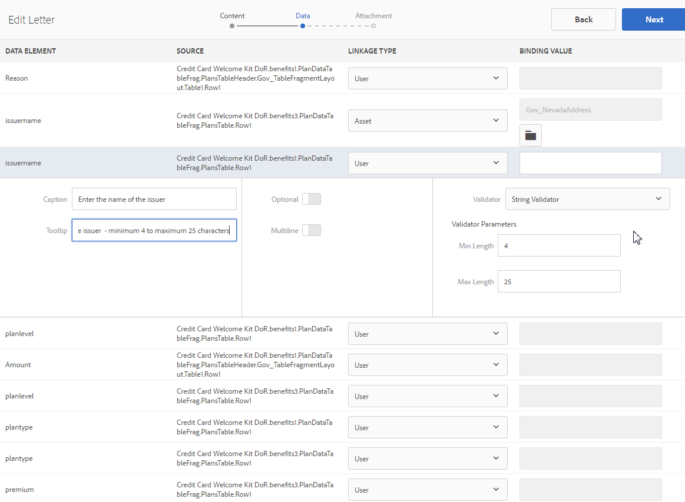

# Criar carta {#create-letter}

## Fluxo de trabalho do Gerenciamento de correspondência {#correspondence-management-workflow}

O fluxo de trabalho do Gerenciamento de correspondência consiste em quatro fases:

1. Criação do modelo
1. Criação de fragmento do documento
1. Criação de carta
1. Pós-processamento

### Criação do modelo {#template-creation}

O gráfico a seguir mostra um fluxo de trabalho típico para criar um modelo de correspondência.

Neste fluxo de trabalho:

1. Os designers de formulário criam layouts e layouts de fragmento usando o Adobe Forms Designer e os fazem upload para um repositório CRX. Os layouts contêm campos de formulário típicos, recursos de layout como cabeçalho e rodapé e &quot;áreas de destino&quot; vazias para a colocação de conteúdo. Posteriormente, os especialistas em aplicativos mapeiam o conteúdo necessário para essas áreas de destino. Mais informações sobre [design de layout](/help/forms/using/layout-design-details.md).
1. Especialistas no assunto dos departamentos jurídico, financeiro ou de marketing criam e fazem upload de conteúdo, como cláusulas de texto, isenções de responsabilidade, termos e condições e imagens, como logotipos, que são reutilizados em vários modelos de correspondência.
1. Especialistas em aplicativos criam modelos de correspondência. O especialista em aplicativos

   * Mapeia cláusulas de texto e imagens para áreas de destino nos modelos de layout
   * Define condições/regras para a inclusão de conteúdo
   * Vincula campos de layout e variáveis a modelos de dados subjacentes

1. O autor pré-visualiza a carta e a envia para pós-processamento. Mais informações sobre [pós-processamento](/help/forms/using/submit-letter-topostprocess.md).

#### Usar modelos de correspondência fornecidos com o Gerenciamento de correspondência {#using-letter-templates-provided-with-correspondence-management}

Em vez de criar um modelo de layout do zero, você pode optar por modificar e reutilizar os modelos fornecidos pelo Gerenciamento de correspondência. Você pode usar o designer para modificar rapidamente a identidade visual e os campos de dados e conteúdo dos modelos para atender às necessidades da sua organização. Para obter mais informações sobre modelos do Gerenciamento de correspondência, consulte [Modelos de carta de referência](/help/forms/using/reference-cm-layout-templates.md).

### Criação de fragmento de documento {#document-fragment-creation}

Os fragmentos de documento são partes reutilizáveis\componentes de uma correspondência usando o que você pode compor letras\correspondência.

Os fragmentos de documento são dos seguintes tipos:

#### Texto {#text}

Um ativo de texto é um conteúdo que consiste em um ou mais parágrafos de texto. Um parágrafo pode ser estático ou dinâmico. Um parágrafo dinâmico contém referências a elementos de dados, cujos valores são fornecidos em tempo de execução.

#### Lista {#list}

Lista é uma série de fragmentos de documento, incluindo texto, listas (a mesma lista não pode ser &quot;adicionada sozinha&quot;), condições e imagens. A ordem dos elementos da lista pode ser fixa ou editável. Ao criar uma correspondência, você pode usar alguns ou todos os elementos da lista para replicar um padrão reutilizável de elementos.

#### Condição {#condition}

As condições permitem definir qual conteúdo é incluído no momento da criação da correspondência, com base nos dados fornecidos. A condição é descrita em termos de variáveis de controle. As variáveis podem ser um elemento do dicionário de dados ou um espaço reservado. Ao adicionar uma condição, você pode optar por incluir um ativo com base no valor que a variável de controle tem. As condições têm uma única saída com base em uma expressão. A primeira expressão é verdadeira, com base na variável de condição atual. Seu valor se torna a saída da condição.

#### Fragmento de layout {#layout-fragment}

Um fragmento de layout é um layout que pode ser usado com uma ou mais letras. Um fragmento de layout é usado para criar padrões repetíveis, especialmente tabelas dinâmicas. O layout pode conter campos de formulário típicos, como &quot;Endereço&quot; e &quot;Número de referência&quot;. Também contém subformulários vazios que indicam áreas de destino. Os layouts (XDPs) são criados no Designer e depois são [carregado para Forms e Documentos](/help/forms/using/get-xdp-pdf-documents-aem.md).

### Criação de carta {#letter-creation}

Há duas maneiras de gerar a correspondência enviada para seus clientes: orientada pelo usuário e pelo sistema.

#### Orientado pelo usuário {#user-driven}

Funcionários voltados para o cliente, como ajustadores de solicitações ou trabalhadores de processos, podem criar correspondência personalizada. Usando uma interface simples e intuitiva de preenchimento de cartas, os usuários empresariais podem adicionar texto opcional à correspondência e personalizar o conteúdo editável, além de visualizar a correspondência em tempo real. Eles podem enviar a correspondência personalizada para um processo de back-end.

#### Orientado pelo sistema {#system-driven}

A geração de correspondência é automatizada, orientada por acionadores de eventos. Por exemplo, um aviso de lembrete enviado a um cidadão solicitando o arquivamento antecipado de impostos é gerado ao mesclar o modelo predefinido com os dados do cidadão. A carta final pode ser enviada por e-mail, impressa, enviada por fax ou arquivada.

### Pós-processamento {#post-processing}

A correspondência final pode ser enviada a um processo de back-end para pós-processamento. A correspondência pode ser:

1. Processado para impressão de e-mail, fax ou lote ou colocado em uma pasta para impressão ou e-mail.
1. Enviado para revisão e aprovação.
1. Protegido por assinatura digital, certificação, criptografia ou gerenciamento de direitos.
1. Convertido em um documento de PDF pesquisável que contém todos os metadados necessários para fins de arquivamento e auditoria.
1. Incluído em um Portfolio PDF que inclua mais documentos, como material de marketing. O Portfolio PDF pode então ser enviado como a correspondência final.

### Arquitetura da solução de gerenciamento de correspondência {#correspondence-management-solution-architecture}

O gráfico a seguir fornece uma visão geral de uma arquitetura de exemplo da Solução de cartas.

## Desconstrução de uma letra {#deconstructing-a-letter}

Este documento de Aviso de cancelamento é um exemplo de uma correspondência típica:

<table> 
 <tbody> 
  <tr> 
   <td><strong>Elementos de carta</strong></td> 
   <td><strong>Descrição</strong></td> 
   <td><strong>Formado com</strong></td> 
  </tr> 
  <tr> 
   <td>Dados de sistemas corporativos back-end</td> 
   <td>Dados originados de sistemas back-end corporativos. Os dados são mesclados dinamicamente com o modelo de correspondência.</td> 
   <td>A variável  Arquivo de dados criado com base em um dicionário de dados</td> 
  </tr> 
  <tr> 
   <td>Dados  Cadastrado pelo funcionário da linha de frente</td> 
   <td>Dados que podem ser fornecidos por um funcionário da linha de frente que está personalizando a carta antes de enviá-la.  </td> 
   <td>
Elementos de DD desprotegidos  Parágrafos de texto editáveis  Variáveis/espaços reservados  
 </td> 
  </tr> 
  <tr> 
   <td>Pré-Aprovado  Parágrafos de texto</td> 
   <td>Conteúdo de texto pré-aprovado. Especialistas em assuntos jurídicos, financeiros ou em uma linha de negócios que entendem o contexto comercial da carta, normalmente são autores do conteúdo do texto. Conteúdos como cabeçalho, rodapé, isenções de responsabilidade e saudação seriam comuns à maioria das cartas. No entanto, um conteúdo como "motivo para rescisão" seria específico à carta em questão.</td> 
   <td>
Texto\Listas\  Condições\Layout
 
 
 </td> 
  </tr> 
  <tr> 
   <td>Dados  Com base na lógica personalizada?</td> 
   <td>Para algumas cartas, como uma carta para solicitar mais informações sobre uma reclamação, os usuários como o Ajustador de reclamações podem adicionar conteúdo de texto personalizado.</td> 
   <td>Documento  Fragmento do tipo Condição </td> 
  </tr> 
  <tr> 
   <td>Armazenado  Imagens do repositório central</td> 
   <td>Imagens, como logotipos e imagens de assinatura. Imagens como logotipos corporativos apareceriam na maioria ou em toda a correspondência. As imagens de assinatura são específicas da carta e da pessoa em nome da qual a carta é enviada.</td> 
   <td>
Imagens armazenadas em ativos AEM (DAM)  
 
 
 </td> 
  </tr> 
 </tbody> 
</table>

## Analisar uma letra antes de construí-la {#analyze-a-letter-before-you-construct-it}

Analise cada letra para descobrir as várias partes que compõem a letra. O especialista em aplicativos analisa as correspondências geradas.

* Quais partes da correspondência são estáticas e quais são dinâmicas. As variáveis que são preenchidas de fontes de dados de back-end ou por usuários finais.
* A ordem em que os vários parágrafos de texto aparecem na correspondência, como se um usuário comercial pode alterar parágrafos durante a criação de correspondência.
* A correspondência é gerada pelo sistema ou requer que um usuário final edite a correspondência? Quantas correspondências são geradas pelo sistema e quantas exigem intervenção do usuário?
* Com que frequência o modelo de correspondência é alterado? Ele será atualizado anualmente, trimestralmente ou somente quando uma determinada legislação for alterada? Que tipo de alterações são esperadas? É uma alteração para corrigir erros tipográficos, uma alteração de layout, adicionar mais campos, adicionar parágrafos e assim por diante.
* Ao planejar suas necessidades de correspondência, monte a lista de novos modelos de correspondência. Para cada modelo de correspondência, você exige:

   * Cláusulas de texto, imagens e tabelas
   * Valores de dados de sistemas de back-end
   * O layout e os layouts de fragmento da correspondência
   * A ordem em que o conteúdo aparece na carta e as regras para inclusão e exclusão de conteúdo

* As condições sob as quais os usuários empresariais, como ajustadores de sinistros ou trabalhadores de processos, modificam o conteúdo ou partes na carta.
* Os cenários são narrativas que descrevem a experiência do usuário, os requisitos e os benefícios de usar a solução Letters.
* Os cenários também fornecem:Os conjuntos de habilidades e as ferramentas necessárias para o projeto.
* Práticas recomendadas para planejar sua implementação do. &quot;Visão geral da implementação de alto nível.

## Benefícios da execução da análise {#benefits-of-performing-the-analysis}

**Reutilização de conteúdo** Você tem uma lista consolidada do novo conteúdo necessário para gerar correspondência. A maior parte do conteúdo, como cabeçalhos, rodapés, avisos e introduções, é comum a muitas cartas e pode ser reutilizada em várias cartas. Todo esse conteúdo comum pode ser criado e aprovado por especialistas uma vez e depois reutilizado em muitas correspondências.

**Criação do dicionário de dados** Haverá valores de dados como &quot;ID do cliente&quot; e &quot;Nome do cliente&quot; que são comuns a muitas correspondências. Você pode preparar uma lista consolidada de todos esses valores de dados. Normalmente, alguém da equipe de middleware da empresa é consultado ao planejar a estrutura. Isso forma a base para a criação do dicionário de dados.

**Fornecimento de dados de sistemas back-end corporativos** Você também conhecerá todos os valores de dados necessários e de onde os dados do sistema empresarial são obtidos. Você pode arquitetar a implementação para extrair os dados do sistema corporativo e alimentar a solução Letters.

**Estimativa da complexidade das cartas** É importante determinar a complexidade de criar uma correspondência específica. Essa análise ajuda a determinar a quantidade de tempo e os conjuntos de habilidades necessários para criar os modelos de correspondência. Isso, por sua vez, ajudará na estimativa dos recursos e custos de implementação da solução Letters.

## Complexidade de correspondência {#correspondence-complexity}

A complexidade da correspondência pode ser determinada analisando os seguintes parâmetros:

**Complexidade de layout** Qual é a complexidade do layout? Cartas como Aviso de cancelamento têm layouts simples. Já as cartas como Confirmação de cobertura de reivindicações têm um layout complexo com várias tabelas e mais de 60 campos de formulário. A criação de layouts complexos leva mais tempo e requer conjuntos avançados de habilidades de design de layout.

**Número de parágrafos e condições de texto** Um contrato de empréstimo pode ter 10 páginas e conter mais de 40 cláusulas de texto. Muitas destas cláusulas dependeriam de &quot;parâmetros de empréstimo. Com base nos termos e condições exatos, as cláusulas seriam incluídas ou excluídas do contrato. A criação dessas cartas requer um planejamento minucioso e uma definição cuidadosa das condições complexas.

Esta tabela fornece algumas diretrizes que você pode usar para classificar suas correspondências:

<table> 
 <tbody> 
  <tr> 
   <td>
<strong>Nível de complexidade</strong>
 </td> 
   <td>
<strong>Complexidade de layout (subjetiva)</strong>
 </td> 
   <td>
<strong>Número de parágrafos de texto</strong>
 </td> 
   <td>
<strong>Número de textos ou imagens condicionais</strong>
 </td> 
   <td>
<strong>Conjunto de habilidades obrigatório</strong>
 </td> 
  </tr> 
  <tr> 
   <td>
Baixa complexidade
 </td> 
   <td>
Baixo. O layout tem poucos campos de formulário (&lt;15).
 
Normalmente, uma página.
 </td> 
   <td>
8
 </td> 
   <td>
1
 </td> 
   <td>
Habilidades de designer médias.
 </td> 
  </tr> 
  <tr> 
   <td>
Complexidade média
 </td> 
   <td>
Layout de complexidade média. Inclui estruturas como tabelas. Normalmente, tem mais de uma página.
 </td> 
   <td>
16
 </td> 
   <td>
2
 </td> 
   <td>
Habilidades de designer médias.
 
 
 
Capacidade de criar expressões complexas usando interfaces do usuário.
 </td> 
  </tr> 
  <tr> 
   <td>
Alta complexidade
 </td> 
   <td>
Layout complexo. Pode ter mais de três páginas. Contém tabelas e mais de 60 campos de formulário.
 </td> 
   <td>
40
 </td> 
   <td>
8
 </td> 
   <td>
Habilidades de Designer especialista.
 
 
 
Capacidade de criar expressões complexas usando interfaces do usuário.
 </td> 
  </tr> 
 </tbody> 
</table>

## Visão Geral da Criação de uma Carta {#overview-of-creating-a-letter}

1. Selecione o layout apropriado que serve de base para a correspondência e crie uma.
1. Adicione módulos de dados ou fragmentos de layout à correspondência e configure-os.
1. Escolha para visualizar a correspondência.
1. Edite e configure os campos, as variáveis, o conteúdo e os anexos.

### Pré-requisitos {#prerequisites}

Você precisa do seguinte em vigor primeiro para criar uma correspondência:

* [Pacote de compatibilidade](compatibility-package.md). Instale o pacote de compatibilidade para exibir a **Cartas** opção no **Forms** página.
* A letra XDP ([layout](/help/forms/using/document-fragments.md)).
* Outros XDPs ([fragmentos de layout](document-fragments.md#document-fragments)) que fazem parte da carta. Os XDPs\Layouts são criados em [Designer](https://www.adobe.com/go/learn_aemforms_designer_65_pt).
* As medidas [dicionário de dados](/help/forms/using/data-dictionary.md) (Opcional).
* A variável [módulos de dados](/help/forms/using/document-fragments.md) que você deseja usar na correspondência.
* [Dados de teste](/help/forms/using/data-dictionary.md#p-working-with-test-data-p) é o arquivo XML com os dados de teste portados nele. Os dados de teste são necessários se você estiver usando um dicionário de dados.

## Criar um modelo de carta {#create-a-letter-template}

### Selecione um layout e insira as propriedades da correspondência {#select-a-layout-and-enter-the-letter-properties}

1. Selecionar **Forms** > **Cartas**.

1. Selecionar **Criar > Carta**. O Gerenciamento de correspondência exibe os layouts disponíveis (XDPs). Esses layouts vêm do Designer. Os layouts também incluem os modelos de correspondência fornecidos pelo Gerenciamento de correspondência pronto para uso. Para obter mais informações sobre modelos do Gerenciamento de correspondência, consulte [Modelos de carta de referência](/help/forms/using/reference-cm-layout-templates.md). Para adicionar seus próprios layouts, crie arquivos XDP (layout) no Designer e [fazer upload deles para o AEM Forms](/help/forms/using/get-xdp-pdf-documents-aem.md).

   

1. Selecione um layout tocando nele e selecione **Próxima**.

   

1. Insira as propriedades para a correspondência e selecione **Salvar:**

   * **Título (opcional):** Insira o título da carta. O título não precisa ser exclusivo e pode ter caracteres especiais e caracteres que não estejam em inglês.
   * **Nome:** O nome exclusivo da carta. Não podem existir duas letras com o mesmo nome em nenhum estado. No campo Nome, você pode inserir apenas caracteres, números e hifens do idioma inglês. O campo Nome é preenchido automaticamente com base no campo Título. Os caracteres especiais, espaços, números e caracteres que não estão em inglês inseridos no campo Título são substituídos por hifens no campo Nome. Embora o valor no campo Título seja copiado automaticamente para o Nome, você pode editar o valor.
   * **Descrição (opcional):** Descreva a carta de referência.
   * **Dicionário de dados (opcional)**: O Dicionário de dados pode ser associado à correspondência. Os ativos inseridos posteriormente nesta correspondência devem ter o mesmo dicionário de dados que você escolheu para a correspondência aqui ou nenhum dicionário de dados.
   * **Tags (opcional):** Selecione as tags a serem aplicadas à correspondência. Você também pode digitar um nome de tag novo/personalizado e pressionar Enter para criá-lo.
   * **Pós-processamento (opcional):** Selecione o pós-processamento a ser aplicado ao modelo de carta. Existem processos de postagem prontos para uso e aqueles que você criou usando AEM, como email e impressão.

   

1. O sistema exibe a mensagem: &quot;Letter created successfully&quot; (Carta criada com êxito). (na mensagem de alerta) Selecione **Abertura** para configurar os módulos de dados e fragmentos de layout neles. Ou selecione **Concluído** para voltar à página anterior.

   

   **Próxima**: Ao selecionar **Abertura** No entanto, o Gerenciamento de correspondências exibe uma representação do layout com todos os componentes no layout (XDP) listado. Continue inserindo o [Módulos de dados e fragmentos de layout e sua configuração](/help/forms/using/create-letter.md#p-insert-data-modules-and-layout-fragments-in-a-letter-and-configure-them-p).

### Insira módulos de dados e fragmentos de layout em uma correspondência e configure-os {#insert-data-modules-and-layout-fragments-in-a-letter-and-configure-them}

Quando depois de criar uma correspondência, você seleciona Abrir, o Gerenciamento de correspondências exibe uma representação do layout com todas as áreas de subformulários/destino no layout (XDP) listadas. Em cada uma das áreas de destino, você pode optar por inserir um Módulo de dados ou um Fragmento de layout (e, em seguida, módulos de dados no fragmento de layout).

>[!NOTE]
>
>Você também pode optar por selecionar o ícone Editar de uma correspondência na página Cartas para Inserir módulos de dados e fragmentos de layout em uma correspondência e configurá-los.

1. Selecionar **Inserir** para cada um dos subformulários e selecione Módulos de dados ou um Fragmento de layout a ser inserido em cada um dos subformulários.

   

1. Selecione Módulo de dados ou Fragmento de layout para essas opções para cada um dos subformulários e escolha os Módulos de dados ou os Fragmentos de layout a serem inseridos. Um fragmento de layout permite inserir ainda mais módulos de dados ou fragmentos de layout nele, de acordo com o design (até quatro níveis).

   

1. Se você inserir um fragmento de layout, o nome do fragmento de layout aparecerá no subformulário. E de acordo com o fragmento selecionado, subformulários aninhados aparecem no subformulário.
1. Depois que os módulos de dados escolhidos forem inseridos no layout, você poderá selecionar o modo de configuração e definir o seguinte depois de tocar no ícone Editar para cada um dos módulos:

   1. **Editável**: quando essa opção é selecionada, o conteúdo pode ser editado na interface do usuário Criar correspondência. Marcar o conteúdo como editável somente se ele exigir que o usuário empresarial (como um Ajustador de solicitações) o modifique.
   1. **Obrigatório**: quando essa opção é selecionada, o conteúdo é necessário na interface do usuário Criar correspondência.
   1. **Selecionado**: Quando essa opção é selecionada, o conteúdo é selecionado por padrão na interface do usuário Criar correspondência.
   1. **Recuo**: aumente ou diminua o recuo do módulo/conteúdo na correspondência. O recuo é especificado em termos de níveis, começando em 0. Cada nível recua 36pts. Para obter mais informações sobre a personalização de formulários, consulte **[!UICONTROL Configurações do gerenciamento de correspondência]** in [Fluxo de trabalho do Forms](submit-letter-topostprocess.md#formsworkflow).
   1. **Quebra de página anterior**: se você definir a opção Quebra de página antes de como ativada, o conteúdo desse módulo sempre será exibido em uma nova página.
   1. **Quebra de página depois de**: se você definir a Quebra de página após como ativada para um módulo específico, o conteúdo do módulo NEXT sempre será exibido em uma nova página.

   

1. Para editar um módulo, selecione o ícone Edit ao lado dele. Após editar os módulos, selecione **Salvar**.

   Nesta página, você também pode fazer o seguinte para os subformulários:

   1. **Permitir texto livre**: Se a opção Permitir texto livre estiver ativada, o usuário poderá adicionar texto incorporado em cartas na exibição CCR. Na exibição CCR, uma ação &#39;T&#39; é ativada para as áreas de destino que têm a opção Permitir texto livre ativada e, quando o usuário a seleciona, ela solicita o nome e a descrição do texto e, ao tocar em ok, abre esse texto no modo de edição, onde o usuário pode adicionar texto. Portanto, isso funciona como outros módulos de texto
   1. **Bloquear ordem**: bloqueia a ordem dos subformulários na correspondência. O autor não tem permissão para reordenar os subformulários/componentes ao criar a correspondência.

   Nesta página, você também pode fazer o seguinte para cada um dos ativos nos subformulários:

   1. **Alterar a ordem dos ativos**: arraste e solte um ativo que contém o ícone reordenar de um ativo ( ).
   1. **Excluir ativos**: selecione o ícone Excluir ao lado de um ativo para excluí-lo.
   1. **Visualizar ativos**: Selecione o ícone Mostrar visualização ( ) ao lado de um ativo.

1. Selecione **Próximo**.
1. A página Dados detalha como os campos de dados e as variáveis são usados no modelo. Os dados podem ser vinculados a fontes de dados, como um dicionário de dados ou uma entrada do usuário. Cada campo define propriedades a partir das quais o dicionário de dados mapeia os dados ou qual legenda é exibida para os campos de entrada do usuário.

   Vínculo:

   * A variável **campo** os elementos podem ser vinculados a um literal, elemento do dicionário de dados, ativo ou valor especificado pelo usuário. Você também pode ignorar um elemento de campo vinculando-o à opção Ignorar.
   * A variável **variável** os elementos podem ser vinculados a um literal, elemento do dicionário de dados, um campo, uma variável, um ativo ou um valor especificado pelo usuário.

   A seguir estão alguns campos principais na vinculação:

   * **Várias linhas**: é possível especificar se a entrada de dados de um campo ou variável é de várias linhas. Se você selecionar essa opção, a caixa de entrada do campo ou variável será exibida como uma caixa de entrada de várias linhas na Exibição de edição de dados. O campo ou a variável também é exibido como multilinha nas visualizações de Dados e Conteúdo na interface do usuário Criar correspondência. O campo de entrada de várias linhas é semelhante ao campo para inserir um comentário em um TextModule. A opção de várias linhas está disponível somente para campos e variáveis com o tipo de vínculo Usuário ou Elementos de dicionário de dados desprotegidos.
   * **Opcional**: é possível especificar se o valor do campo ou da variável é opcional ou não. A opção de campo opcional está disponível para campos e variáveis com o tipo de vínculo Usuário ou Elementos de dicionário de dados desprotegidos.

   * **Validação de campo/variável**: para fornecer validação aprimorada do valor de um campo ou variável, é possível atribuir um validador ao campo ou variável. Essa opção está disponível somente para campos e variáveis com o tipo de vínculo Usuário ou Elementos do dicionário de dados desprotegidos.
   * **Legenda** e **Dica de ferramenta**: Legenda é o rótulo do campo que aparece antes do campo na interface do CCR. Essa opção está disponível para campos e variáveis com o tipo de vínculo Usuário ou Elementos do dicionário de dados desprotegidos.

   A seguir estão os tipos de validação que você pode usar para os campos:

   * **Validador de string**: use o Validador de cadeias de caracteres para especificar um comprimento mínimo e máximo da cadeia de caracteres inserida no campo ou na variável. Ao criar um Validador de string, certifique-se de especificar parâmetros de validação válidos. Insira um comprimento válido para os valores mínimo e máximo. Para o validador String, você pode especificar os comprimentos mínimo e máximo do valor que pode ser inserido. Se o valor inserido não estiver de acordo com os valores mínimo e máximo especificados, o campo relevante na interface do usuário do CCR será marcado em vermelho.

   * **Validador de número**: use o Validador de número para especificar o valor numérico mínimo e máximo inserido em um campo ou variável. Ao criar um Validador de número, certifique-se de especificar parâmetros de validação válidos. Insira valores numéricos para os valores mínimo e máximo.

   * **Validador de expressão regular**: use o Validador de expressões regulares para definir uma expressão regular usada para validar o valor de um campo ou variável. Além disso, você pode personalizar a mensagem de erro. Ao criar um Validador de expressão regular, certifique-se de especificar uma expressão regular válida.

   >[!NOTE]
   >
   >Os validadores de campo e variável só estão disponíveis em campos ou variáveis com o tipo de vínculo Usuário ou Elementos de dicionário de dados desprotegidos.

   

1. Depois de especificar a vinculação, selecione **Próxima**. O Gerenciamento de correspondência exibe a tela Anexos.

### Configurar os anexos {#set-up-the-attachments}

1. Selecionar **Adicionar ativo**.
1. Na tela Selecionar ativo, selecione os ativos a serem anexados à carta e selecione **Concluído**. Primeiro, é necessário carregar os ativos no Assets. É recomendável anexar somente documentos do PDF e do Microsoft Office, mas também imagens. Para obter mais informações sobre como fazer upload de ativos no DAM, consulte [Fazendo upload de ativos](/help/assets/manage-assets.md).
1. Para bloquear a ordem dos ativos na lista de forma que o Ajuste de Reivindicações não possa alterar a ordem, selecione **Bloquear ordem**. Se você não selecionar esta opção, o Ajuste de Reivindicações poderá alterar a ordem dos itens da lista.
1. Para alterar a ordem dos ativos, arraste e solte um ativo mantendo o ícone reordenar para um ativo ( ).
1. Selecionar **Editar** na frente de um anexo e especifique um anexo como Obrigatório se não quiser que o autor o exclua. Especifique um anexo como Selecionado se quiser que ele seja pré-selecionado na interface CCR.
1. Selecionar **Acesso à biblioteca** para conceder acesso à biblioteca. Se o Acesso à biblioteca estiver ativado, o Ajustador de solicitações poderá acessar a biblioteca de conteúdo ao criar uma correspondência e inserir anexos.
1. Selecionar **Configuração de anexos** e especifique o número máximo de anexos.

1. Selecionar **Salvar**. Sua correspondência é criada e listada na página Cartas.

Depois que um modelo de correspondência é criado no Gerenciamento de correspondências, o usuário final/agente/ajustador de reclamações pode abrir a correspondência na interface do usuário do CCR e criá-la inserindo dados, configurando conteúdo e gerenciando anexos. Para obter mais informações, consulte [Criar correspondência](/help/forms/using/create-correspondence.md).

## Tipos de vínculo disponíveis para cada um dos campos {#types-of-linkage-available-for-each-of-the-fields}

A tabela a seguir descreve quais tipos de vínculo estão disponíveis para vários tipos de campos.

Os seguintes valores na tabela

* **Sim**: O tipo de campo na coluna mais à esquerda é compatível com esse tipo de mapeamento
* **Não**: o tipo de campo na coluna mais à esquerda não é compatível com esse tipo de mapeamento
* **N/D**: o tipo de campo na coluna mais à esquerda não é aplicável

<table> 
 <tbody> 
  <tr> 
   <td> </td> 
   <td><strong>Literal</strong></td> 
   <td><strong>Ativo</strong></td> 
   <td><strong>Dicionários de dados</strong></td> 
   <td><strong>Ignorar</strong></td> 
   <td><strong>Usuário</strong></td> 
   <td><strong>Texto</strong></td> 
   <td><strong>Variável</strong></td> 
  </tr> 
  <tr> 
   <td><strong>data</strong></td> 
   <td>Sim</td> 
   <td>Não</td> 
   <td>Sim</td> 
   <td>Sim</td> 
   <td>Sim</td> 
   <td>N/A</td> 
   <td>N/A</td> 
  </tr> 
  <tr> 
   <td><strong>hora</strong></td> 
   <td>Sim</td> 
   <td>Não</td> 
   <td>Sim</td> 
   <td>Sim</td> 
   <td>Sim</td> 
   <td>N/A</td> 
   <td>N/A</td> 
  </tr> 
  <tr> 
   <td><strong>datetime</strong></td> 
   <td>Sim</td> 
   <td>Não</td> 
   <td>Sim</td> 
   <td>Sim</td> 
   <td>Sim</td> 
   <td>N/A</td> 
   <td>N/A</td> 
  </tr> 
  <tr> 
   <td><strong>inteiro</strong></td> 
   <td>Sim</td> 
   <td>Não</td> 
   <td>Sim</td> 
   <td>Sim</td> 
   <td>Sim  </td> 
   <td>N/A</td> 
   <td>N/A</td> 
  </tr> 
  <tr> 
   <td><strong>flutuante</strong></td> 
   <td>Sim</td> 
   <td>Não</td> 
   <td>Sim</td> 
   <td>Sim</td> 
   <td>Sim  </td> 
   <td>N/A</td> 
   <td>N/D  </td> 
  </tr> 
  <tr> 
   <td><strong>richtext</strong></td> 
   <td>Sim</td> 
   <td>somente texto</td> 
   <td>Sim</td> 
   <td>Sim</td> 
   <td>Sim</td> 
   <td>N/A</td> 
   <td>N/A</td> 
  </tr> 
  <tr> 
   <td><strong>simples</strong> <strong>texto</strong></td> 
   <td>Sim</td> 
   <td>somente texto</td> 
   <td>Sim</td> 
   <td>Sim</td> 
   <td>Sim</td> 
   <td>N/A</td> 
   <td>N/A</td> 
  </tr> 
  <tr> 
   <td><strong>imagem</strong></td> 
   <td>Não</td> 
   <td>somente imagem</td> 
   <td>Não</td> 
   <td>Sim</td> 
   <td>Não</td> 
   <td>N/A</td> 
   <td>N/A</td> 
  </tr> 
  <tr> 
   <td><strong>assinatura</strong></td> 
   <td>Não</td> 
   <td>Não</td> 
   <td>Não  </td> 
   <td>Sim</td> 
   <td>Não</td> 
   <td>N/A</td> 
   <td>N/D  </td> 
  </tr> 
 </tbody> 
</table>

## Criar cópia de um modelo de carta {#createcopylettertemplate}

Você pode usar um modelo de correspondência existente para criar rapidamente um modelo de correspondência com propriedades, conteúdo e ativos herdados semelhantes, como fragmentos de documento e dicionário de dados. Para fazer isso, copie e cole uma carta.

1. Na página Cartas, selecione uma ou mais letras. A interface do usuário do exibe o ícone Copiar.
1. Selecione Copiar. A interface exibe o ícone Colar. Você também pode optar por entrar em uma pasta antes de colar. Pastas diferentes podem conter ativos com os mesmos nomes. Para obter mais informações sobre pastas, consulte [Pastas e organização de ativos](/help/forms/using/import-export-forms-templates.md#folders-and-organizing-assets).
1. Selecione Colar. A caixa de diálogo Colar é exibida. Se você estiver copiando e colando as letras no mesmo local, o sistema atribuirá automaticamente nomes e títulos às novas cópias de letras, mas você poderá editar os títulos e nomes das letras.
1. Se necessário, edite o Título e o Nome com os quais deseja salvar a cópia da carta.
1. Selecione Colar. A cópia da carta é criada. Agora você pode fazer as alterações necessárias na carta recém-criada.
