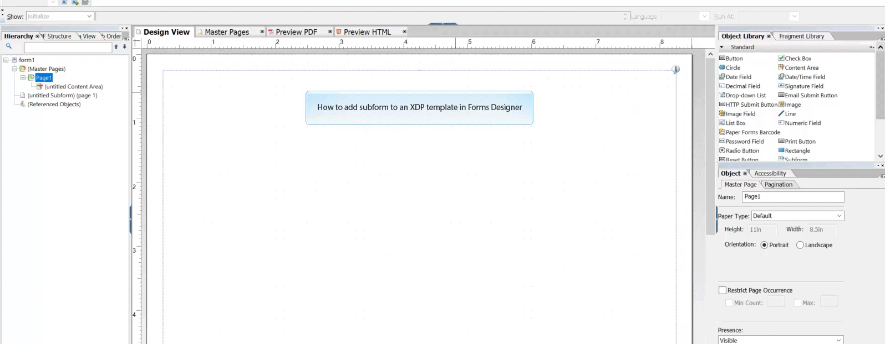
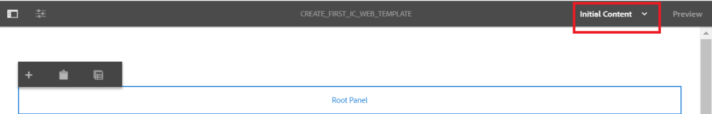

# Tutorial: Criar modelos{#tutorial-create-templates}

Este tutorial é uma etapa da série [Create your first Interative Communication](/help/forms/using/create-your-first-interactive-communication.md). É recomendável seguir a série em sequência cronológica para entender, executar e demonstrar o caso de uso tutorial completo.

Para criar uma Comunicação interativa, você deve ter modelos disponíveis no servidor de AEM para Canais de impressão e da Web.

Os modelos para o canal Imprimir são criados no Adobe Forms Designer e carregados no servidor AEM. Esses modelos ficam disponíveis para uso ao criar uma Comunicação interativa.

Os modelos para o canal Web são criados em AEM. Os autores e administradores de modelos podem criar, editar e ativar modelos da Web. Depois de criados e ativados, esses modelos estão disponíveis para uso ao criar uma Comunicação interativa.

Este tutorial o orienta pelas etapas para criar modelos para canais de Impressão e da Web para que eles estejam disponíveis para uso ao criar Comunicações interativas. Ao final deste tutorial, você poderá:

* Criar modelos XDP para canal de impressão usando o Adobe Forms Designer
* Fazer upload dos modelos XDP no servidor do AEM Forms
* Criar e ativar modelos para o canal Web

## Criar modelo para o Canal de impressão {#create-template-for-print-channel}

Crie e gerencie modelos para o Canal de impressão de comunicação interativa usando as seguintes tarefas:

* [Criar modelo XDP usando o Forms Designer](../../forms/using/create-templates-print-web.md#create-xdp-template-using-forms-designer)
* [Fazer upload do modelo XDP no servidor do AEM Forms](../../forms/using/create-templates-print-web.md#upload-xdp-template-to-the-aem-forms-server)
* [Criar modelo XDP para fragmentos de layout](../../forms/using/create-templates-print-web.md#create-xdp-template-for-layout-fragments)

### Criar modelo XDP usando o Forms Designer {#create-xdp-template-using-forms-designer}

Com base no [caso de uso](/help/forms/using/create-your-first-interactive-communication.md) e [anatomia](/help/forms/using/planning-interactive-communications.md), crie os seguintes subformulários no modelo XDP:

* Detalhes da Lista: Inclui um fragmento de documento
* Detalhes do cliente: Inclui um fragmento de documento
* Resumo da Lista: Inclui um fragmento de documento
* Resumo: Inclui um fragmento de documento (subformulário Encargos) e um gráfico (subformulário Gráficos)
* Chamadas discriminadas: Inclui uma tabela (fragmento de layout)
* Pagar Agora: Inclui uma imagem
* Serviços de valor agregado: Inclui uma imagem

Esses subformulários são exibidos como áreas de destino no modelo Imprimir depois de fazer upload do arquivo XDP no servidor do Forms. Todas as entidades, como fragmentos de documento, gráficos, fragmentos de layout e imagens, são adicionadas às áreas de destino ao criar a Comunicação interativa.

Execute as seguintes etapas para criar um modelo XDP para o canal de impressão:

1. Abra o Forms Designer, selecione **File** > **New** > **Use a blank form,** toque em **Next** e toque em **Finish** para abrir o formulário para criação de modelo.

   Certifique-se de que as opções **Biblioteca de objetos** e **Objeto** estejam selecionadas no menu **Janela**.

1. Arraste e solte o componente **Subform** da **Biblioteca de objetos** no formulário.
1. Selecione o subformulário para exibir as opções para o subformulário na janela **Object** no painel direito.
1. Selecione a guia **Subform** e selecione **Flowed** na lista suspensa **Content**. Arraste o ponto de extremidade esquerdo do subformulário para ajustar o comprimento.
1. Na guia **Bindings**:

   1. Especifique **BillDetails** no campo **Nome**.

   1. Selecione **No data binding** na lista suspensa **Data Binding**.

   

1. Da mesma forma, selecione o subformulário raiz, selecione a guia **Subform** e selecione **Flowed** na lista suspensa **Content**. Na guia **Bindings**:

   1. Especifique **TelecaBill** no campo **Nome**.

   1. Selecione **No data binding** na lista suspensa **Data Binding**.

   

1. Repita as etapas 2 a 5 para criar os seguintes subformulários:

   * Detalhes da Lista
   * Detalhes do cliente
   * Resumo da Lista
   * Resumo - Selecione a guia **Subformulário** e selecione **Posicionado** na lista suspensa **Conteúdo** para esse subformulário. Insira os seguintes subformulários no subformulário **Summary**.

      * Encargos
      * Gráficos
   * ItemizedCalls
   * PagarAgora
   * ValueAddedServices

   Para economizar tempo, também é possível copiar e colar subformulários existentes para criar novos subformulários.

   Para alternar o subformulário **Charts** para a direita do subformulário Charges, selecione o subformulário **Charts** no painel esquerdo, selecione a guia **Layout** e especifique um valor para o campo **AnchorX**. O valor deve ser maior que o valor do campo **Width** para o subformulário **Charges**. Selecione o subformulário **Charges** e selecione a guia **Layout** para exibir o valor do campo **Width**.

1. Arraste e solte o objeto **Text** da **Biblioteca de objetos** no formulário e digite o texto **Discar XXXX para assinar** na caixa.
1. Clique com o botão direito do mouse no objeto de texto no painel esquerdo, selecione **Renomear objeto** e insira o nome do objeto de texto como **Subscribe**.

   

1. Selecione **Arquivo** > **Salvar como** para salvar o arquivo no sistema de arquivos local:

   1. Navegue até o local para salvar o arquivo e especifique o nome como **create_first_ic_print_template**.
   1. Selecione **.xdp** na lista suspensa **Salvar como tipo**.

   1. Toque em **Salvar**.

### Fazer upload do modelo XDP no servidor do AEM Forms {#upload-xdp-template-to-the-aem-forms-server}

Depois de criar um modelo XDP usando o Forms Designer, você deve carregá-lo no servidor AEM Forms para que o modelo fique disponível para uso ao criar a Comunicação interativa.

1. Selecione **[!UICONTROL Forms]** > **[!UICONTROL Forms &amp; Documents]**.
1. Toque em **Criar** > **Carregamento de arquivo**.

   Navegue e selecione o modelo **create_first_ic_print_template** (XDP) e toque em **Open** para importar o modelo XDP para o servidor AEM Forms.

### Criar modelo XDP para fragmentos de layout {#create-xdp-template-for-layout-fragments}

Para criar um fragmento de layout para o canal Imprimir da Comunicação Interativa, crie um XDP usando o Forms Designer e faça upload dele para o servidor AEM Forms.

1. Abra o Forms Designer, selecione **File** > **New** > **Use a blank form,** toque em **Next** e toque em **Finish** para abrir o formulário para criação de modelo.

   Certifique-se de que as opções **Biblioteca de objetos** e **Objeto** estejam selecionadas no menu **Janela**.

1. Arraste e solte o componente **Tabela** da **Biblioteca de objetos** no formulário.
1. Na caixa de diálogo Inserir tabela:

   1. Especifique o número de colunas como **5**.
   1. Especifique o número de linhas de corpo como **1**.
   1. Marque a caixa de seleção **Incluir linha do cabeçalho na tabela** .
   1. Tabulação **OK**.

1. Toque em **+** no painel esquerdo ao lado de **Tabela** 1 e clique com o botão direito do mouse em **Célula1** e selecione **Renomear objeto** para **Data**.

   Da mesma forma, renomeie **Cell2**, **Cell3**, **Cell4** e **Cell5** para **Time**, **Number**, **Duration** e **Encargos** respectivamente.

1. Clique nos campos de texto Cabeçalho no **Exibição do Designer** e renomeie-os para **Tempo**, **Número**, **Duração** e **Encargos**.

   

1. Selecione **Linha 1** no painel esquerdo e selecione **Objeto** > **Vínculo** > **Repetir Linha para Cada Item de Dados**.

   

1. Arraste e solte o componente **Campo de texto** da **Biblioteca de objetos** para a **Exibição do Designer**.

   

   Da mesma forma, arraste e solte o componente **Campo de texto** nas linhas **Tempo**, **Número**, **Duração** e **Encargos**.

1. Selecione **Arquivo** > **Salvar como** para salvar o arquivo no sistema de arquivos local:

   1. Navegue até o local para salvar o arquivo e especifique o nome como **table_lf**.
   1. Selecione **.xdp** na lista suspensa **Salvar como tipo**.

   1. Toque em **Salvar**.
   Depois de criar um modelo XDP para o fragmento de layout usando o Forms Designer, você deve [carregá-lo](../../forms/using/create-templates-print-web.md#upload-xdp-template-to-the-aem-forms-server) no servidor do AEM Forms para que o modelo fique disponível para uso ao criar fragmentos de layout.

## Criar modelo para o canal Web {#create-template-for-web-channel}

Crie e gerencie modelos para o canal Web de Comunicação interativa usando as seguintes tarefas:

* [Criar pasta para modelos](../../forms/using/create-templates-print-web.md#create-folder-for-templates)
* [Criar o modelo](../../forms/using/create-templates-print-web.md#create-the-template)
* [Ativar o modelo](../../forms/using/create-templates-print-web.md#enable-the-template)
* [Ativação de botões em Comunicações interativas](../../forms/using/create-templates-print-web.md#enabling-buttons-in-interactive-communications)

### Criar pasta para modelos {#create-folder-for-templates}

Para criar um modelo de canal da Web, defina uma pasta onde possa salvar os modelos criados. Depois de criar um modelo dentro dessa pasta, ative o modelo para permitir que os usuários de formulários criem um canal da Web de uma Comunicação interativa com base no modelo.

Execute as seguintes etapas para criar uma pasta para os modelos editáveis:

1. Toque em **Ferramentas**  > **Navegador de configuração**.
   * Consulte a documentação do [Navegador de configuração](/help/sites-administering/configurations.md) para obter mais informações.
1. Na página Navegador de configuração, toque em **Criar**.
1. Na caixa de diálogo **Criar configuração**, especifique **Create_First_IC_templates** como o título da pasta, marque **Modelos editáveis** e toque em **Criar**.

   

   A pasta **Create_First_IC_templates** é criada e listada na página **Navegador de configuração**.

### Criar o modelo {#create-the-template}

Com base no [caso de uso](/help/forms/using/create-your-first-interactive-communication.md) e [anatomia](/help/forms/using/planning-interactive-communications.md), crie os seguintes painéis no template Web:

* Detalhes da Lista: Inclui um fragmento de documento
* Detalhes do cliente: Inclui um fragmento de documento
* Resumo da Lista: Inclui um fragmento de documento
* Resumo dos Encargos: Inclui um fragmento de documento e um gráfico (layout de duas colunas)
* Chamadas discriminadas: Inclui uma tabela
* Pagar Agora: Inclui um botão **Pagar Agora** e uma imagem
* Serviços de valor agregado: Inclui uma imagem e um botão **Subscribe**.

Todas as entidades, como fragmentos de documento, gráficos, tabelas, imagens e botões, são adicionadas ao criar a Comunicação interativa.

Execute as seguintes etapas para criar um modelo para o canal Web na pasta **Create_First_IC_templates**:

1. Navegue até a pasta de modelo apropriada selecionando **Ferramentas** > **Modelos** > **Criar_Primeiro_IC_templates**.
1. Toque em **Criar**.
1. No assistente de configuração **Escolha um Tipo de Modelo**, selecione **Comunicação Interativa - Canal Web** e toque em **Próximo**.
1. No assistente de configuração **Detalhes do Modelo**, especifique **Create_First_IC_Web_Template** como o título do modelo. Especifique uma descrição opcional e toque em **Criar**.

   Uma mensagem de confirmação de que o **Create_First_IC_Web_Template** é exibido.

1. Toque em **Abrir** para abrir o modelo no editor de modelo.
1. Selecione **Conteúdo inicial** na lista suspensa ao lado da opção **Visualizar**.

   

1. Toque em **Painel raiz** e toque em **+** para exibir a lista de componentes que podem ser adicionados ao modelo.
1. Selecione **Painel** na lista para adicionar um painel acima do **Painel raiz**.
1. Selecione a guia **Content** no painel esquerdo. O novo painel adicionado na etapa 8 é exibido sob o **Painel raiz** na árvore de conteúdo.

   

1. Selecione o painel e toque em  (Configurar).
1. No painel Propriedades:

   1. Especifique **billdetails** no campo Nome.
   1. Especifique **Detalhes da Lista** no campo Título.
   1. Selecione **1** na lista suspensa **Número de colunas**.

   1. Toque em  para salvar as propriedades.

   O nome do painel é atualizado para **Detalhes da Lista** na árvore de conteúdo.

1. Repita as etapas 7 a 11 para adicionar painéis com as seguintes propriedades ao modelo:

   | Nome | Título | Número de colunas |
   |---|---|---|
   | detalhes do cliente | Detalhes do cliente | 1 |
   | cédula | Resumo da Lista | 3 |
   | encargos sumariados | Resumo dos Encargos | 2 |
   | chamadas itemised | Chamadas discriminadas | 3 |
   | pagamento | Pagar Agora | 2 |
   | tela | Serviços de valor agregado | 3 |

   A imagem a seguir descreve a árvore de conteúdo após adicionar todos os painéis ao modelo:

   

### Ativar o modelo {#enable-the-template}

Depois de criar o template Web, você deve habilitá-lo para usar o template ao criar a Comunicação interativa.

Execute as seguintes etapas para habilitar o template Web:

1. Toque em **Ferramentas**  > **Modelos**.
1. Navegue até o modelo **Create_First_IC_Web_Template**, selecione-o e toque em **Ativar**.
1. Pressione **Ativar** novamente para confirmar.

   O modelo é ativado e seu status é exibido como Ativado. Você pode usar esse modelo ao criar a Comunicação interativa para o canal da Web.

### Ativação de botões em Comunicações interativas {#enabling-buttons-in-interactive-communications}

Com base no caso de uso, você deve incluir os botões **Pagar Agora** e **Assinar** (componentes de formulários adaptáveis) na Comunicação Interativa. Para habilitar o uso desses botões na Comunicação interativa, execute as seguintes etapas:

1. Selecione **Estrutura** na lista suspensa ao lado da opção **Visualizar**.
1. Selecione o painel raiz **Contêiner de documento** usando a árvore de conteúdo e toque em **Política** para selecionar os componentes permitidos para uso na Comunicação interativa.

   

1. Na guia **Componentes permitidos** da seção **Propriedades**, selecione **Botão** nos componentes **Formulário adaptável**.

   

1. Toque em  para salvar as propriedades.