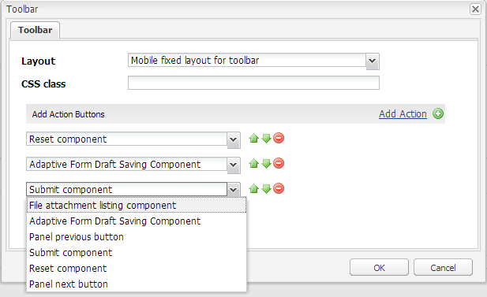

# Criação de uma ação personalizada da barra de ferramentas{#creating-a-custom-toolbar-action}

## Pré-requisitos {#prerequisite}

Antes de criar uma ação personalizada da barra de ferramentas, familiarize-se com [Usar bibliotecas do lado do cliente](/help/sites-developing/clientlibs.md) e [Desenvolvimento com o CRXDE Lite](/help/sites-developing/developing-with-crxde-lite.md).

## O que é uma ação {#what-is-an-action-br}

Um formulário adaptável fornece uma barra de ferramentas que permite ao autor do formulário configurar um conjunto de opções. Essas opções são definidas como ações para o formulário adaptável. Clique no botão Editar na Barra de ferramentas do Painel para definir as ações compatíveis com formulários adaptáveis.



Além do conjunto de ações fornecido por padrão, você pode criar ações personalizadas na barra de ferramentas. Por exemplo, é possível adicionar uma ação para permitir que o usuário revise todos os campos do formulário adaptável antes de enviar um formulário.

## Etapas para criar uma ação personalizada em formulários adaptáveis {#steps}

Para ilustrar a criação de uma ação personalizada da barra de ferramentas, as etapas a seguir ajudam a criar um botão para que os usuários finais revisem todos os campos do formulário adaptável antes de enviar um formulário preenchido.

1. Todas as ações padrão compatíveis com formulários adaptáveis estão presentes em `/libs/fd/af/components/actions` pasta. No CRXDE, copie a variável `fileattachmentlisting` nó a partir de `/libs/fd/af/components/actions/fileattachmentlisting` para `/apps/customaction`.

1. Depois de copiar o nó para `apps/customaction` , renomeie o nome do nó para `reviewbeforesubmit`. Além disso, altere a `jcr:title` e `jcr:description` propriedades do nó.

   O `jcr:title` contém o nome da ação exibida na caixa de diálogo da barra de ferramentas. O `jcr:description` contém mais informações que são exibidas quando um usuário passa o ponteiro sobre a ação.

   

1. Selecionar `cq:template` nó no `reviewbeforesubmit` nó . Certifique-se de que o valor de `guideNodeClass` a propriedade é `guideButton` e alterar `jcr:title` propriedade adequadamente.
1. Altere a propriedade do tipo no `cq:Template` nó . No exemplo atual, altere a propriedade type para o botão .

   O valor do tipo é adicionado como uma classe CSS no HTML gerado para o componente. Os usuários podem usar essa Classe CSS para criar um estilo em suas ações. O estilo padrão para dispositivos móveis e para desktop é fornecido para os valores do tipo botão, enviar, redefinir e salvar.

1. Selecione a ação personalizada na caixa de diálogo da barra de ferramentas de edição de formulário adaptável. Um botão Revisar é exibido na barra de ferramentas do painel.

    

1. Para fornecer funcionalidade ao botão Revisar, adicione algum código JavaScript e CSS e código do lado do servidor no arquivo init.jsp, presente no `reviewbeforesubmit` nó .

   Adicione o seguinte código em `init.jsp`.

   ```jsp
   <%@include file="/libs/fd/af/components/guidesglobal.jsp" %>
   <guide:initializeBean name="guideField" className="com.adobe.aemds.guide.common.GuideButton"/>
   
   <c:if test="${not isEditMode}">
           <cq:includeClientLib categories="reviewsubmitclientlibruntime" />
   </c:if>
   
   <%--- BootStrap Modal Dialog  --------------%>
   <div class="modal fade" id="reviewSubmit" tabindex="-1">
       <div class="modal-dialog">
           <div class="modal-content">
               <div class="modal-header">
                   <h3>Review the Form Fields</h3>
               </div>
               <div class="modal-body">
                   <div class="modal-list">
                       <table class="table table-bordered">
                           <tr class="name">
                               <td class="reviewlabel col-md-3 active">
                                   <label>Your Name is: </label>
                               </td>
                           </tr>
                           <tr class="pan">
                               <td class="reviewlabel col-md-3 active">
                                   <label>Your Pan Number is: </label>
                               </td>
                           </tr>
                           <tr class="dob">
                               <td class="reviewlabel col-md-3 active">
                                   <label>Your Date Of Birth is: </label>
                               </td>
                           </tr>
                           <tr class="80cdeclaration">
                               <td class="reviewlabel col-md-3 active">
                                   <label>Your Total 80C Declaration Amount is: </label>
                               </td>
                           </tr>
                           <tr class="rentpaid">
                               <td class="reviewlabel col-md-3 active">
                                   <label>Your Total HRA Amount is: </label>
                               </td>
                           </tr>
                       </table>
                   </div>
               </div><!-- /.modal-body -->
               <div class="modal-footer">
                   <div class="fileAttachmentListingCloseButton col-md-2 col-xs-2 col-sm-2">
                       <button data-dismiss="modal">Close</button>
                   </div>
               </div>
           </div><!-- /.modal-content -->
       </div><!-- /.modal-dialog -->
   </div><!-- /.modal -->
   ```

   Adicione o seguinte código no `ReviewBeforeSubmit.js` arquivo.

   ```javascript
   /*anonymous function to handle show of review before submit view */
   $(function () {
       if($("div.reviewbeforesubmit button[id*=reviewbeforesubmit]").length > 0) {
           $("div.reviewbeforesubmit button[id*=reviewbeforesubmit]").click(function(){
               // Create the options object to be passed to the getElementProperty API
               var options = {},
                   result = [];
               options.somExpressions = [];
               options.propertyName = "value";
               guideBridge.visit(function(model){
                   if(model.name === "name" || model.name === "pan" || model.name === "dateofbirth" || model.name === "total" || model.name === "totalmonthlyrent"){
                           options.somExpressions.push(model.somExpression);
                   }
               }, this);
               result = guideBridge.getElementProperty(options);
   
               $('#reviewSubmit .reviewlabel').each(function(index, item){
                   var data = ((result.data[index] == null) ? "No Data Filled" : result.data[index]);
                   if($(this).next().hasClass("reviewlabelvalue")){
                       $(this).next().html(data);
                   } else {
                       $(this).after($("<td></td>").addClass("reviewlabelvalue col-md-6 active").html(data));
                   }
               });
               // added because in mobile devices it was causing problem of backdrop
               $("#reviewSubmit").appendTo('body');
               $("#reviewSubmit").modal("show");
           });
       }
   });
   ```

   Adicione o seguinte código a `ReviewBeforeSubmit.css` arquivo.

   ```css
   .modal-list .reviewlabel {
       white-space: normal;
       text-align: right;
       padding:2px;
   }
   
   .modal-list .reviewlabelvalue {
       border: #cde0ec 1px solid;
       padding:2px;
   }
   
   /* Adding icon for this action in mobile devices */
   /* This is the glyphicon provided by bootstrap eye-open */
   /* .<type> .iconButton-icon */
   .reviewbeforesubmit .iconButton-icon {
       position: relative;
       top: -8px;
       font-family: 'Glyphicons Halflings';
       font-style: normal;
   }
   
   .reviewbeforesubmit .iconButton-icon:before {
       content: "\e105"
   }
   ```

1. Para verificar a funcionalidade da ação personalizada, abra o formulário adaptável no modo de Visualização e clique em Revisar na barra de ferramentas.

   >[!NOTE]
   >
   >O `GuideBridge` A biblioteca não é carregada no modo de criação. Portanto, essa ação personalizada não funciona no modo de criação.

   

## Amostras {#samples}

O arquivo a seguir contém um pacote de conteúdo. O pacote inclui um formulário adaptável relacionado à demonstração acima da ação personalizada da barra de ferramentas.

[Obter arquivo](assets/customtoolbaractiondemo.zip)
