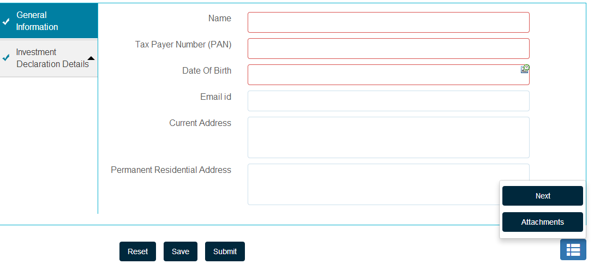

# Criação de layout personalizado da barra de ferramentas{#creating-custom-toolbar-layout}

## Layouts da barra de ferramentas {#layout}

Ao criar um formulário adaptável, é possível especificar um layout da barra de ferramentas para o formulário. O layout da barra de ferramentas define os comandos e o layout da barra de ferramentas no formulário.

O layout da barra de ferramentas usa muito o processamento no cliente, orientado por códigos complexos de JavaScript e CSS. Organizar e otimizar a entrega desse código pode ser um problema complicado. Para ajudar a lidar com esse problema, o AEM fornece Pastas de biblioteca do lado do cliente, que permitem armazenar o código do lado do cliente no repositório, organizá-lo no categoria e definir quando e como cada categoria de código deve ser fornecida ao cliente. O sistema de biblioteca do lado do cliente cuida de produzir os links corretos em sua página final para carregar o código correto. Para obter informações detalhadas, consulte [Como as bibliotecas do lado do cliente funcionam no AEM.](/help/sites-developing/clientlibs.md)


Layout de amostra da barra de ferramentas

Os formulários adaptativos fornecem um conjunto de layouts predefinidos:


Layouts da barra de ferramentas disponíveis prontamente

Além disso, é possível criar um layout personalizado da barra de ferramentas.

O procedimento a seguir detalha as etapas para criar uma barra de ferramentas personalizada que exibe três ações na barra de ferramentas e as outras ações em uma lista suspensa na barra de ferramentas.

O pacote de conteúdo anexado contém todo o código descrito abaixo. Depois de instalar o pacote de conteúdo, abra `/content/forms/af/CustomLayoutDemo.html` a visualização da demonstração de layout personalizada da barra de ferramentas.

CustomToolbarLayoutDemo.zip

[Obter layout personalizado da barra de ferramentas para](assets/customtoolbarlayoutdemo.zip)demonstração de arquivo

## Para criar um layout personalizado da barra de ferramentas {#layout-1}

1. Crie uma pasta para manter seus layouts personalizados da barra de ferramentas. Por exemplo:

   `/apps/customlayout/toolbar`.

   Para criar um layout personalizado, você pode usar (e personalizar) um dos layouts predefinidos da barra de ferramentas disponíveis na seguinte pasta:

   `/libs/fd/af/layouts/toolbar`

   Por exemplo, copie o `mobileFixedToolbarLayout` nó da `/libs/fd/af/layouts/toolbar` pasta para a `/apps/customlayout/toolbar` pasta.

   Além disso, copie a barra de ferramentas Common.jsp para a `/apps/customlayout/toolbar` pasta.

   >[!NOTE]
   >
   >A pasta que você cria para manter os layouts personalizados pode ser criada com a `apps` pasta.

1. Renomear o nó copiado, `mobileFixedToolbarLayout`, como `customToolbarLayout.`

   Além disso, forneça uma descrição relevante para o nó. Por exemplo, altere jcr:description do nó para o layout **Personalizado da barra de ferramentas**.

   A `guideComponentType` propriedade do nó determina o tipo de layout. Nesse caso, o tipo de layout é a barra de ferramentas e, portanto, aparece no menu suspenso de seleção de layout da barra de ferramentas.

   

   Um nó com descrição relevante

   O novo layout personalizado da barra de ferramentas é exibido na configuração da caixa de diálogo Barra de ferramentas **adaptável** .

   

   Lista dos layouts disponíveis da barra de ferramentas

   >[!NOTE]
   >
   >A descrição atualizada na etapa anterior é exibida na lista suspensa Layout.

1. Selecione esse layout personalizado da barra de ferramentas e clique em OK.

   Adicione clientlib (javascript e css) no `/etc/customlayout` nó e inclua a referência da clientlib no `customToolbarLayout.jsp`.

   

   Caminho do arquivo customToolbarLayout.css

   Amostra `customToolbarLayout.jsp`:

   ```jsp
   <%@include file="/libs/fd/af/components/guidesglobal.jsp" %>
   <cq:includeClientLib categories="customtoolbarlayout" />
   <c:if test="${isEditMode}">
           <cq:includeClientLib categories="customtoolbarlayoutauthor" />
   </c:if>
   <div class="guidetoolbar mobileToolbar mobilecustomToolbar" data-guide-position-class="guide-element-hide">
       <div data-guide-scroll-indicator="true"></div>
       <%@include file="../toolbarCommon.jsp" %>
   </div>
   ```

   >[!NOTE]
   >
   >Adicione a classe da barra de ferramentas de guia para o layout. O estilo predefinido da barra de ferramentas é definido em relação à classe da barra de ferramentas.

   Amostra `toolBarCommon.jsp`:

   ```jsp
   <%@taglib prefix="fn" uri="https://java.sun.com/jsp/jstl/functions"%>
   <%--------------------
   This code iterates over all the tool bar items using the guideToolbar bean.
   If the number of toolbar items are more than 3, then we create a dropdown menu using bootstrap for other actions present in the toolbar.
   In both desktop and mobile devices, the layout is different.
   ---------------------------------%>
   
   <c:forEach items="${guideToolbar.items}" var="toolbarItem" varStatus="loop">
       <c:choose>
         <c:when test="${loop.index gt 2}">
      <c:choose>
       <c:when test="${loop.index eq 3}">
                     <div class="btn-group dropdown">
                       <button type="button" class="btn btn-primary dropdown-toggle label" data-toggle="dropdown">Actions <span class="caret"></code></button>
                       <button type="button" class="btn btn-primary dropdown-toggle icon" data-toggle="dropdown"><span class="glyphicon glyphicon-th-list"></code></button>
             <ul class="dropdown-menu" role="menu">
                           <li>
                               <div id="${toolbarItem.id}_guide-item">
                                 <sling:include path="${toolbarItem.path}" resourceType="${toolbarItem.resourceType}"/>
                              </div>
                           </li>
                           <c:if test="${loop.index eq (fn:length(guideToolbar.items)-1)}">
                                </ul>
                                </div>
                           </c:if>
       </c:when>
       <c:when test="${loop.index eq (fn:length(guideToolbar.items)-1)}">
                          <li>
                                     <div id="${toolbarItem.id}_guide-item">
                                         <sling:include path="${toolbarItem.path}" resourceType="${toolbarItem.resourceType}"/>
                                     </div>
                           </li>
                       </ul>
                     </div>
   
       </c:when>
       <c:otherwise>
         <li>
          <div id="${toolbarItem.id}_guide-item">
           <sling:include path="${toolbarItem.path}" resourceType="${toolbarItem.resourceType}"/>
          </div>
         </li>
       </c:otherwise>
      </c:choose>
         </c:when>
         <c:otherwise>
     <div id="${toolbarItem.id}_guide-item">
           <sling:include path="${toolbarItem.path}" resourceType="${toolbarItem.resourceType}"/>
        </div>
         </c:otherwise>
    </c:choose>
   </c:forEach>
   ```

   O CSS presente no nó clientlib:

   ```css
   .mobilecustomToolbar .dropdown {
       display: inline-block;
   }
   
   .mobilecustomToolbar .dropdown {
       float: right;
   }
   
   .mobilecustomToolbar .dropdown > button {
      padding: 6px 12px;
   }
   
   .mobilecustomToolbar .dropdown .guideFieldWidget, .mobilecustomToolbar .dropdown .guideFieldWidget button {
       width: 100%;
   }
   
   .mobilecustomToolbar .dropdown .caret{
       border-bottom: 6px solid;
       border-right: 6px solid transparent;
       border-left: 6px solid transparent;
    border-top: transparent;
   }
   
   .mobilecustomToolbar .dropdown-menu{
    top: auto;
    bottom: 100%;
   }
   
   .mobilecustomToolbar .btn-group {
    vertical-align: super;
   }
   
   .mobilecustomToolbar .glyphicon {
    font-size: 24px;
   }
   
   @media (max-width: 767px){
   
    .mobilecustomToolbar .dropdown .guideButton .iconButton-icon {
      display: none;
       }
   
       .mobilecustomToolbar .dropdown .guideButton .iconButton-label {
      display: inline-block;
       }
   
       .mobilecustomToolbar .dropdown .guideButton button {
      background-color: #013853;
       }
   
    .mobilecustomToolbar .btn-group {
     vertical-align: top;
    }
   
   }
   ```

>[!NOTE]
>
>A descrição atualizada na etapa anterior é exibida na lista suspensa Layout.



visualização da área de trabalho da barra de ferramentas de layout personalizado

