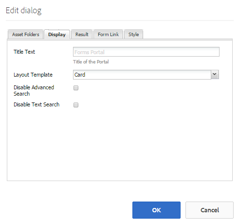

# Criação de uma página de portal de formulários{#creating-a-forms-portal-page}

Os componentes do portal do Forms equipam os desenvolvedores da Web com componentes para criar e personalizar um portal de formulários em sites criados usando o Adobe Experience Manager (AEM). Para obter uma visão geral rápida do portal de formulários, consulte [Introdução à publicação de formulários em um portal](../../forms/using/introduction-publishing-forms.md).

## Pré-requisitos {#prerequisites}

Os componentes do portal do Forms não estão disponíveis para uso por padrão. Certifique-se de que as seguintes categorias de componentes do portal de formulários estejam ativadas conforme descrito em [Ativar componentes do portal de formulários](/help/forms/using/enabling-forms-portal-components.md).

**Serviços** de documentoInclui componentes Pesquisa e lister, Link e Rascunhos e Envio.

**Os** Predicados dos serviços de documento incluem os componentes Predicado de data, Predicado de texto completo, Predicado de propriedades e Predicado de tags. Esses componentes são usados para configurar a pesquisa no componente Pesquisar e listar .

Quando estiverem ativados em uma página de sites de AEM, essas categorias de componentes estarão disponíveis para uso no navegador de componentes.

Categorias de componentes do portal do Forms

## Componente de pesquisa e lister {#search-amp-lister-component}

O componente Pesquisar e listar, disponível na categoria de componente Serviços de documento , é usado para listar formulários em uma página e implementar a pesquisa nos formulários listados. O componente inclui dois painéis:

* Painel de lista onde os formulários estão listados.
* Painel de pesquisa, onde você adiciona a funcionalidade de pesquisa.

Você pode arrastar e soltar o componente Pesquisar e listar da categoria de componente Serviços de documento no navegador de componentes na página. O componente, quando adicionado, é semelhante ao seguinte.

Componente de pesquisa e lister em uma página com layout de Grade

### Painel Lista {#list-pane}

O painel Lista é uma área onde seus formulários são listados. O componente Pesquisar e listar fornece várias opções de configuração que podem ser usadas para controlar a exibição de formulários no painel Lista.

Para configurar o painel Lista, toque no componente Pesquisa e Lister e toque em . A caixa de diálogo **[!UICONTROL Editar componente]** é aberta.

Painel Lista no modo de edição

A caixa de diálogo **Editar** inclui várias guias que fornecem opções de configuração descritas na tabela abaixo. Toque em **OK** para salvar a configuração, quando concluído.

<table>
 <tbody>
  <tr>
   <th>Guia</th>
   <th>Configuração</th>
   <th>Descrição</th>
  </tr>
  <tr>
   <td><strong>Pastas de ativos</strong></code></td>
   <td>Adicionar Item</td>
   <td>Configura as pastas onde os ativos são carregados usando a interface do usuário do AEM Forms. Por padrão, ela lista todos os ativos carregados. Para obter mais informações sobre a interface do usuário do AEM Forms, consulte <a href="../../forms/using/introduction-managing-forms.md" target="_blank">Introdução ao gerenciamento de formulários</a>.</td>
  </tr>
  <tr>
   <td>
<strong>Exibir</strong></code>
 </td>
   <td>Texto do título</td>
   <td>Título do componente Pesquisar e listar . O título padrão é <strong>Forms Portal.</strong></td>
  </tr>
  <tr>
   <td> </td>
   <td>Modelo de layout</td>
   <td>Layout dos ativos. </td>
  </tr>
  <tr>
   <td> </td>
   <td>Desativar Pesquisa Avançada</td>
   <td>Quando ativado, oculta o ícone de pesquisa avançada.</td>
  </tr>
  <tr>
   <td> </td>
   <td>Desativar Pesquisa de Texto</td>
   <td>Quando ativado, oculta a barra de pesquisa de texto completo.</td>
  </tr>
  <tr>
   <td><strong>Resultado</strong></code></td>
   <td>Número de resultados por página</td>
   <td>Configura o número máximo de formulários que você deseja exibir em uma página.</td>
  </tr>
  <tr>
   <td> </td>
   <td>Texto de resultados</td>
   <td>
Configura o texto dos resultados (por exemplo, 1-12 de 601 <strong>Results</strong>). O valor padrão é <strong>Results</strong>.
 
Por exemplo, se você especificar <strong>Forms </strong>neste campo e houver um total de 601 formulários, o texto do resultado será alterado para 1-12 de 601 <strong>Forms.</strong>
 </td>
  </tr>
  <tr>
   <td> </td>
   <td>Texto da página</td>
   <td>
Configura o texto da página (por exemplo, <strong>Página </strong>1 de 51). O valor padrão é <strong>Page</strong>.
 
Por exemplo, se você especificar <strong>Formulário de aplicativo </strong>neste campo e houver 51 páginas, o texto da página será alterado para <strong>Formulário de aplicativo </strong>1 de 51.
 </td>
  </tr>
  <tr>
   <td> </td>
   <td>Do Texto</td>
   <td>
Substitui a palavra <strong>de</strong> pelo texto especificado (Página 1 <strong>de </strong>51). O valor padrão é <strong>de</strong>.
 
Por exemplo, se você especificar <strong>de </strong>neste campo, o texto será alterado para Página 1 <strong>de </strong>51.
 </td>
  </tr>
  <tr>
   <td><strong>Link do formulário</strong></code></td>
   <td>Tipo de renderização</td>
   <td>Controla a listagem de formulários com base no tipo de renderização especificado. As opções disponíveis são PDF e HTML. Por exemplo, se você selecionar apenas HTML como tipo de renderização, as PDF forms serão filtradas.</td>
  </tr>
  <tr>
   <td> </td>
   <td>Perfil HTML</td>
   <td>Configura o perfil HTML a ser usado para renderização. Todos os perfis disponíveis estão listados na lista suspensa.</td>
  </tr>
  <tr>
   <td> </td>
   <td>Enviar URL</td>
   <td>
Configura um servlet onde os dados do formulário são enviados.
 
<strong>Observação:</strong> <em>o URL de envio de um formulário pode ser especificado em vários lugares e sua ordem de precedência é a seguinte:</em>

    <ol>
     <li><em>O URL de envio incorporado no formulário (no botão Enviar) tem a prioridade mais alta.</em></li>
     <li><em>O URL de envio mencionado na interface do usuário do AEM Forms tem a segunda prioridade mais alta.</em></li>
     <li><em>O URL de envio mencionado no portal de formulários tem a prioridade mais baixa.</em></li>
    </ol> </td>
  </tr>
  <tr>
   <td> </td>
   <td>Dica da ferramenta Ação de renderização HTML</td>
   <td>Configura o texto da dica de ferramenta, que é exibida ao passar o cursor do mouse sobre  (o ícone HTML5).</td>
  </tr>
  <tr>
   <td> </td>
   <td>Dica da ferramenta Ação de renderização do PDF</td>
   <td>Configura o texto da dica de ferramenta, que é exibida ao passar o cursor do mouse sobre  (o ícone PDF).</td>
  </tr>
  <tr>
   <td><strong>Estilo</strong></code></td>
   <td>Tipo de estilo</td>
   <td>Permite que você especifique <strong>Sem estilo, Estilo padrão</strong> ou <strong>Estilo personalizado </strong>para listar os formulários.</td>
  </tr>
  <tr>
   <td> </td>
   <td>Caminho de estilo personalizado</td>
   <td>Se você selecionou Personalizado como o Tipo de estilo, procure para especificar o caminho para o CSS personalizado, caso contrário, selecione Padrão.</td>
  </tr>
 </tbody>
</table>

### Painel de pesquisa {#search-pane}

O painel Pesquisar permite adicionar os componentes Predicado de data, Predicado de texto completo, Predicado de propriedades e Predicado de tags da categoria Predicados de serviços de documento AEM Sidekick. Esses componentes implementam a funcionalidade de pesquisa para que os usuários realizem a pesquisa nos formulários listados.

**Dica:** *é possível controlar a lista de formulários exibida no portal de formulários com base em um critério predefinido e ocultar a funcionalidade de pesquisa para usuários finais. Para controlar a lista de formulários, use os componentes Predicar para aplicar filtros de pesquisa. Você também pode especificar os valores de filtro padrão e desativar a pesquisa na guia Exibir da caixa de diálogo Editar componente.*

Painel de pesquisa com o Predicado de data, texto completo, propriedades e tags

#### Predicado de data {#date-predicate}

O componente Predicado de data, quando adicionado, ativa a pesquisa nos formulários listados que foram modificados durante uma duração especificada.

Para configurar o componente Predicado de data:

1. Toque no componente e toque em . A caixa de diálogo Editar é aberta.
1. Especifique o seguinte:

   * **Tipo:** a única opção disponível é Data da  **Última Modificação**

   * **Texto:** Rótulo ou legenda do Componente do predicado de data. O valor padrão é **Data da Última Modificação.**

   * **Rótulo da data inicial:** Rótulo ou legenda do campo da data inicial
   * **Rótulo da data final:** Rótulo ou legenda do campo de data final
   * **Ocultar:** Para aplicar o filtro de datas padrão a formulários de lista

1. Toque em **OK**

#### Predicado de texto completo {#full-text-predicate}

O componente Predicado de texto completo implementa a pesquisa de texto completo nos dados do formulário, como nome e descrição. Os usuários podem pesquisar qualquer string de texto para retornar formulários que contenham o texto em seu nome ou descrição.

Para configurar o componente Predicado de texto completo:

1. Toque no componente e toque em . A caixa de diálogo Editar é aberta.
1. Especifique o título no campo **Título principal**.
1. Toque em **Ok**

#### Predicado de propriedades {#properties-predicate}

O componente Predicado de propriedades implementa a pesquisa de formulários com base nas propriedades do formulário, como título, autor e descrição.

Para configurar o componente Predicado de propriedades:

1. Toque no componente e toque em . A caixa de diálogo Editar é aberta.
1. Na guia General , especifique o rótulo de pesquisa. O valor padrão é **Properties**

1. Na guia Opções, toque em **Adicionar item.**
1. Selecione uma propriedade na lista suspensa e especifique um rótulo de pesquisa para ela no campo abaixo da lista suspensa.
1. Repita a etapa 4 para adicionar mais propriedades. Também é possível especificar um valor de filtro padrão para listar formulários com base nos critérios especificados e ocultar a propriedade para pesquisa por usuários finais. Marque a caixa de seleção Ocultar para uma propriedade e especifique o valor de filtro padrão.
Por exemplo, se você deseja exibir formulários que contêm &quot;Viagem&quot; em seus títulos, selecione Ocultar ao lado da propriedade Título . Além disso, especifique Viagem na caixa de texto valor de filtro padrão.

1. Toque em **OK**

#### Predicado de tags {#tags-predicate}

O componente Predicado de tags implementa a pesquisa de formulários com base nas tags definidas no Forms Manager.

Para configurar o componente Predicado de tags :

1. Toque no componente e toque em . A caixa de diálogo Editar é aberta.
1. Toque no botão de seta para baixo ao lado do campo Tags .
1. Selecione as tags apropriadas
1. Toque em **OK**

As tags selecionadas aparecem no painel Pesquisa junto com as caixas de seleção. Os usuários agora podem restringir sua pesquisa com base nas tags.

## Listar formulários em uma página {#list-forms-on-a-page-br}

Para listar formulários em uma página, adicione o componente **[!UICONTROL Pesquisar e lister]** à página e configure o **[!UICONTROL Painel de lista]**. Para permitir que os usuários finais pesquisem formulários com data, texto e tags, adicione um componente **[!UICONTROL Painel de pesquisa]**.

Para vincular um formulário de qualquer lugar na página, use o componente Link . Para obter mais informações sobre o componente de link, consulte [Incorporando componente de link em uma página](../../forms/using/embedding-link-component-page.md).

Para listar os formulários que estão em um estado de rascunho e os formulários que já foram enviados, use o componente **[!UICONTROL Rascunhos e envios]**. Para obter mais informações, consulte [Personalizando componente Rascunhos e Envios](../../forms/using/draft-submission-component.md).

## Compatibilidade do dispositivo móvel {#mobile-device-friendliness}

O componente Pesquisa e Lister do Forms Portal é compatível com dispositivos móveis e se adapta de acordo. Todas as três exibições padrão: Os retornos em grade, placa e painel de acordo com o dispositivo no qual o site é aberto, são fornecidos com o fato de que a página da Web também se adapta. O fato simples é que o Search &amp; Lister é apenas um componente e não governa o estilo no nível da página.

A imagem a seguir descreve o componente Pesquisar e lister quando aberto em um dispositivo móvel:

Componente Pesquisar e listar

## Personalização de uma página do portal de formulários {#customizing-a-forms-portal-page-br}

Você pode personalizar uma página do portal de formulários para fornecer uma aparência distinta à página. Você também pode adicionar metadados para melhorar a experiência de pesquisa, alterar o layout da página e adicionar estilos CSS personalizados. Para obter mais informações, consulte [Personalizando modelos para componentes do Forms Portal](../../forms/using/customizing-templates-forms-portal-components.md).

A interface do usuário do AEM Forms permite adicionar metadados personalizados a formulários. Os metadados personalizados são úteis no fornecimento de uma experiência de listagem e pesquisa de formulários para os usuários finais. Para obter mais informações sobre metadados personalizados, consulte [Personalizando modelos para componentes do Portal Forms](../../forms/using/customizing-templates-forms-portal-components.md).

Pronto para uso, o portal de formulários fornece ações de renderização. Você pode personalizar o portal de formulários para adicionar mais ações. Para obter informações detalhadas, consulte [Adicionar ação personalizada aos itens do lister de formulários.](../../forms/using/add-custom-action-form-lister.md)

## Artigos relacionados

* [Ativar componentes do portal de formulários](/help/forms/using/enabling-forms-portal-components.md)
* [Criar página do portal de formulários](/help/forms/using/creating-form-portal-page.md)
* [Listar formulários em uma página da Web usando APIs](/help/forms/using/listing-forms-webpage-using-apis.md)
* [Usar componente Rascunhos e Envios](/help/forms/using/draft-submission-component.md)
* [Personalizar o armazenamento de rascunhos e formulários enviados](/help/forms/using/draft-submission-component.md)
* [Amostra para integrar o componente de rascunhos e envios ao banco de dados](/help/forms/using/integrate-draft-submission-database.md)
* [Personalização de modelos para componentes do portal de formulários](/help/forms/using/customizing-templates-forms-portal-components.md)
* [Introdução à publicação de formulários em um portal](/help/forms/using/introduction-publishing-forms.md)
