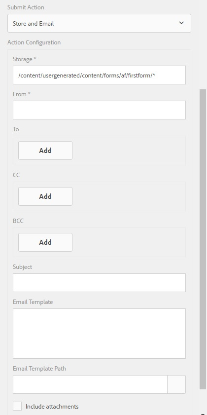

# Ação de gravação de envio personalizado para formulários adaptáveis{#writing-custom-submit-action-for-adaptive-forms}

Formulários adaptáveis exigem ações de envio para processar dados especificados pelo usuário. Uma ação Enviar determina a tarefa executada nos dados que você envia usando um formulário adaptável. O Adobe Experience Manager (AEM) inclui ações [de envio de](../../forms/using/configuring-submit-actions.md) OOTB que demonstram tarefas personalizadas que você pode executar usando os dados enviados pelo usuário. Por exemplo, você pode realizar tarefas, como enviar e-mail ou armazenar os dados.

## Fluxo de trabalho para uma ação Enviar {#workflow-for-a-submit-action}

O fluxograma descreve o fluxo de trabalho de uma ação Enviar que é acionada quando você clica no botão **[!UICONTROL Enviar]** em um formulário adaptável. Os arquivos no componente Anexo de arquivo são carregados no servidor e os dados do formulário são atualizados com os URLs dos arquivos carregados. No cliente, os dados são armazenados no formato JSON. O cliente envia uma solicitação Ajax para um servlet interno que massaja os dados especificados e os retorna no formato XML. O cliente cola esses dados com campos de ação. Ele envia os dados para o servlet final (servlet Guide Submit) por meio de uma ação de envio de formulário. Em seguida, o servlet encaminha o controle para a ação Enviar. A ação Enviar pode encaminhar a solicitação para um recurso de sling diferente ou redirecionar o navegador para outro URL.


### Formato de dados XML {#xml-data-format}

Os dados XML são enviados para o servlet usando o parâmetro **`jcr:data`** request. As ações de envio podem acessar o parâmetro para processar os dados. O código a seguir descreve o formato dos dados XML. Os campos vinculados ao modelo de formulário são exibidos na **`afBoundData`** seção. Campos não vinculados são exibidos na `afUnoundData`seção. Para obter mais informações sobre o formato do `data.xml` arquivo, consulte [Introdução ao preenchimento prévio dos campos](../../forms/using/prepopulate-adaptive-form-fields.md)adaptáveis.

```xml
<?xml ?>
<afData>
<afUnboundData>
<data>
<field1>value</field2>
<repeatablePanel>
    <field2>value</field2>
</repeatablePanel>
<repeatablePanel>
    <field2>value</field2>
</repeatablePanel>
</data>
</afUnboundData>
<afBoundData>
<!-- xml corresponding to the Form Model /XML Schema -->
</afBoundData>
</afData>
```

### Campos de ação {#action-fields}

Uma ação Enviar pode adicionar campos de entrada ocultos (usando a tag de [entrada](https://developer.mozilla.org/en/docs/Web/HTML/Element/Input) HTML) ao formulário renderizado HTML. Esses campos ocultos podem conter valores necessários durante o processamento do envio do formulário. Ao enviar o formulário, esses valores de campo são lançados de volta como parâmetros de solicitação que a ação Enviar pode usar durante a manipulação de envio. Os campos de entrada são chamados de campos de ação.

Por exemplo, uma ação Enviar que também captura o tempo gasto para preencher um formulário pode adicionar os campos de entrada ocultos `startTime` e `endTime`.

Um script pode fornecer os valores dos campos `startTime` e `endTime` quando o formulário é renderizado e antes do envio do formulário, respectivamente. O script de ação Enviar `post.jsp` pode então acessar esses campos usando parâmetros de solicitação e calcular o tempo total necessário para preencher o formulário.

### Anexos de arquivo {#file-attachments}

As ações de envio também podem usar os anexos de arquivo carregados usando o componente Anexo de arquivo. Os scripts de ação Submit podem acessar esses arquivos usando a API [sling](https://sling.apache.org/apidocs/sling5/org/apache/sling/api/request/RequestParameter.html)RequestParameter. O método [isFormField](https://sling.apache.org/apidocs/sling5/org/apache/sling/api/request/RequestParameter.html#isFormField()) da API ajuda a identificar se o parâmetro de solicitação é um arquivo ou um campo de formulário. É possível repetir os parâmetros de Solicitação em uma ação Enviar para identificar os parâmetros de Anexo de arquivo.

O código de amostra a seguir identifica os anexos de arquivo na solicitação. Em seguida, ele lê os dados no arquivo usando a [Get API](https://sling.apache.org/apidocs/sling5/org/apache/sling/api/request/RequestParameter.html#get()). Finalmente, cria um objeto de Documento usando os dados e o anexa a uma lista.

```java
RequestParameterMap requestParameterMap = slingRequest.getRequestParameterMap();
for (Map.Entry<String, RequestParameter[]> param : requestParameterMap.entrySet()) {
    RequestParameter rpm = param.getValue()[0];
    if(!rpm.isFormField()) {
        fileAttachments.add(new Document(rpm.get()));
    }
}
```

### Caminho de encaminhamento e URL de redirecionamento {#forward-path-and-redirect-url}

Depois de executar a ação necessária, o servlet Enviar encaminha a solicitação para o caminho de encaminhamento. Uma ação usa a API setForwardPath para definir o caminho de encaminhamento no servlet Guide Submit.

Se a ação não fornecer um caminho de encaminhamento, o servlet Enviar redirecionará o navegador usando o URL de redirecionamento. O autor configura o URL de redirecionamento usando a configuração da Página de agradecimento na caixa de diálogo Edição de formulário adaptável. Você também pode configurar o URL de redirecionamento por meio da ação Enviar ou da API setRedirectUrl no servlet Enviar guia. Você também pode configurar os parâmetros de Solicitação enviados para o URL de redirecionamento usando a API setRedirectParameters no servlet Guide Submit.

>[!NOTE]
>
>Um autor fornece o URL de redirecionamento (usando a Configuração da página de agradecimento). [As ações](../../forms/using/configuring-submit-actions.md) de envio de OTB usam o URL de redirecionamento para redirecionar o navegador do recurso ao qual o caminho de encaminhamento faz referência.
>
>Você pode gravar uma ação de Enviar personalizada que encaminha uma solicitação para um recurso ou servlet. A Adobe recomenda que o script que executa a manipulação de recursos para o caminho de encaminhamento redirecione a solicitação para o URL de redirecionamento quando o processamento for concluído.

## Submit action {#submit-action}

Uma ação Enviar é uma sling:Folder que inclui o seguinte:

* **addfields.jsp**: Esse script fornece os campos de ação adicionados ao arquivo HTML durante a execução. Use esse script para adicionar os parâmetros de entrada ocultos necessários durante a submissão no script post.POST.jsp.
* **dialog.xml**: Esse script é semelhante à caixa de diálogo Componente do CQ. Ele fornece informações de configuração que o autor personaliza. Os campos são exibidos na guia Enviar ações na caixa de diálogo Edição de formulário adaptável quando você seleciona a ação Enviar.
* **post.POST.jsp**: O servlet Enviar chama esse script com os dados que você envia e os dados adicionais nas seções anteriores. Qualquer menção à execução de uma ação nesta página implica a execução do script post.POST.jsp. Para registrar a ação Enviar com os formulários adaptáveis a serem exibidos na caixa de diálogo Edição de formulário adaptável, adicione essas propriedades à sling:Folder:

   * **guideComponentType** do tipo String e valor **fd/af/components/guidesubmittype**
   * **guideDataModel** do tipo String que especifica o tipo de formulário adaptável ao qual a ação Enviar é aplicável. **xfa** é suportado para formulários adaptativos baseados em XFA, enquanto **xsd** é suportado para formulários adaptativos baseados em XSD. **o Basic** é compatível com formulários adaptáveis que não usam XDP ou XSD. Para exibir a ação em vários tipos de formulários adaptáveis, adicione as strings correspondentes. Separe cada string por vírgula. Por exemplo, para tornar uma ação visível em formulários adaptativos baseados em XFA e XSD, especifique os valores **xfa** e **xsd** respectivamente.

   * **jcr:descrição** do tipo String. O valor dessa propriedade é exibido na lista de ação Enviar na guia Enviar ações da caixa de diálogo Edição de formulário adaptável. As ações OOTB estão presentes no repositório CRX no local **/libs/fd/af/components/guidesubmittype**.

## Criação de uma ação Enviar personalizada {#creating-a-custom-submit-action}

Execute as seguintes etapas para criar uma ação Enviar personalizada que salve os dados no repositório CRX e, em seguida, envie um email para você. O formulário adaptável contém a ação Enviar Conteúdo do Repositório de Ação OOTB (obsoleto) que salva os dados no repositório CRX. Além disso, o CQ fornece uma API de [email](https://docs.adobe.com/docs/en/cq/current/javadoc/com/day/cq/mailer/package-summary.html) que pode ser usada para enviar emails. Antes de usar a API de email, [configure](https://docs.adobe.com/docs/en/cq/current/administering/notification.html?wcmmode=disabled#Configuring o serviço de email) o serviço Day CQ Mail pelo console do sistema. Você pode reutilizar a ação Armazenar conteúdo (obsoleto) para armazenar os dados no repositório. A ação Armazenar conteúdo (obsoleto) está disponível no local /libs/fd/af/components/guidesubmittype/store no repositório CRX.

1. Faça logon no CRXDE Lite no URL https://&lt;servidor>:&lt;porta>/crx/de/index.jsp. Crie um nó com a propriedade sling:Folder e name store_and_mail na pasta /apps/custom_submit_action. Crie a pasta custom_submit_action se ela já não existir.

   

1. **Forneça os campos de configuração obrigatórios.**

   Adicione a configuração que a ação de Loja requer. Copie o nó **cq:dialog** da ação Loja de /libs/fd/af/components/guidesubmittype/store para a pasta de ação em /apps/custom_submit_action/store_and_email.

   

1. **Forneça campos de configuração para solicitar ao autor a configuração do email.**

   O formulário adaptável também fornece uma ação de Email que envia emails aos usuários. Personalize esta ação com base nas suas necessidades. Navegue até /libs/fd/af/components/guidesubmittype/email/dialog. Copie os nós no nó cq:dialog para cq:node da sua ação Enviar (/apps/custom_submit_action/store_and_email/dialog).

   

1. **Disponibilize a ação na caixa de diálogo Adaptive Form Edit (Edição de formulário adaptável).**

   Adicione as seguintes propriedades no nó store_and_email:

   * **guideComponentType** do tipo **String** e valor **fd/af/components/guidesubmittype**

   * **guideDataModel** do tipo **String** e valor **xfa, xsd, basic**

   * **jcr:descrição** do tipo **String** e valor **Store e ação de email**

1. Abra qualquer formulário adaptável. Clique no botão **Editar** ao lado de **Start** para abrir a caixa de diálogo **Editar** do container de formulário adaptável. A nova ação é exibida na guia **Enviar ações** . Selecionar a Ação **de** Armazenamento e Email exibe a configuração adicionada no nó de diálogo.

   

1. **Use a ação para concluir uma tarefa.**

   Adicione o script post.POST.jsp à sua ação. (/apps/custom_submit_action/store_and_mail/).

   Execute a ação da Loja OOTB (script post.POST.jsp). Use a API [FormsHelper.runAction](https://docs.adobe.com/docs/en/cq/current/javadoc/com/day/cq/wcm/foundation/forms/FormsHelper.html#runAction(java.lang.String, java.lang.String, org.apache.sling.api.resource, org.apache.sling.api.SlingHttpServletRequest, org.apache.sling.api.SlingHttpServletResponse) que o CQ fornece em seu código para executar a Loja ação. Adicione o seguinte código no arquivo JSP:

   `FormsHelper.runAction("/libs/fd/af/components/guidesubmittype/store", "post", resource, slingRequest, slingResponse);`

   Para enviar o e-mail, o código lê o endereço de e-mail do recipient na configuração. Para obter o valor de configuração no script da ação, leia as propriedades do recurso atual usando o código a seguir. Da mesma forma, você pode ler os outros arquivos de configuração.

   `ValueMap properties = ResourceUtil.getValueMap(resource);`

   `String mailTo = properties.get("mailTo");`

   Por fim, use a CQ Mail API para enviar o email. Use a classe [SimpleEmail](https://commons.apache.org/proper/commons-email/apidocs/org/apache/commons/mail/SimpleEmail.html) para criar o Objeto de e-mail, como mostrado abaixo:

   >[!NOTE]
   >
   >Verifique se o arquivo JSP tem o nome post.POST.jsp.

   ```java
   <%@include file="/libs/fd/af/components/guidesglobal.jsp" %>
   <%@page import="com.day.cq.wcm.foundation.forms.FormsHelper,
          org.apache.sling.api.resource.ResourceUtil,
          org.apache.sling.api.resource.ValueMap,
                   com.day.cq.mailer.MessageGatewayService,
     com.day.cq.mailer.MessageGateway,
     org.apache.commons.mail.Email,
                   org.apache.commons.mail.SimpleEmail" %>
   <%@taglib prefix="sling"
                   uri="https://sling.apache.org/taglibs/sling/1.0" %>
   <%@taglib prefix="cq"
                   uri="https://www.day.com/taglibs/cq/1.0"
   %>
   <cq:defineObjects/>
   <sling:defineObjects/>
   <%
           String storeContent =
                       "/libs/fd/af/components/guidesubmittype/store";
           FormsHelper.runAction(storeContent, "post", resource,
                                   slingRequest, slingResponse);
    ValueMap props = ResourceUtil.getValueMap(resource);
    Email email = new SimpleEmail();
    String[] mailTo = props.get("mailto", new String[0]);
    email.setFrom((String)props.get("from"));
           for (String toAddr : mailTo) {
               email.addTo(toAddr);
      }
    email.setMsg((String)props.get("template"));
    email.setSubject((String)props.get("subject"));
    MessageGatewayService messageGatewayService =
                       sling.getService(MessageGatewayService.class);
    MessageGateway messageGateway =
                   messageGatewayService.getGateway(SimpleEmail.class);
    messageGateway.send(email);
   %>
   ```

   Selecione a ação no formulário adaptável. A ação envia um email e armazena os dados.

