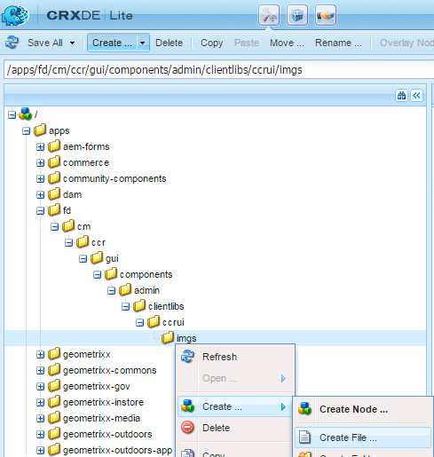

# Personalizar a criação da interface de usuário de correspondência{#customize-create-correspondence-ui}

## Visão geral {#overview}

O Gerenciamento de correspondência permite que você reclassifique seu modelo de solução para obter um melhor valor da marca e para seguir os padrões de marca de sua organização. A nova marca da interface do usuário inclui a alteração do logotipo da organização, que é exibido no canto superior esquerdo da interface Criar correspondência.

Você pode alterar o logotipo na interface do usuário Criar correspondência com o logotipo de sua organização.


O ícone personalizado na interface Criar correspondência

### Alteração do logotipo na interface do usuário Criar correspondência {#changing-the-logo-in-the-create-correspondence-ui}

Para configurar uma imagem de logotipo de sua escolha, faça o seguinte:

1. Crie a estrutura de [pastas apropriada no CRX](#creatingfolderstructure).
1. [Carregue o novo arquivo](#uploadlogo) de logotipo na pasta que você criou no CRX.

1. [Configure o CSS](#createcss) no CRX para se referir ao novo logotipo.
1. Limpe o histórico do navegador e [atualize a interface de usuário](#refreshccrui)Criar correspondência.

## Criação da estrutura de pastas necessária {#creatingfolderstructure}

Crie a estrutura de pastas, conforme explicado abaixo, para hospedar a imagem de logotipo personalizada e a folha de estilos. A nova estrutura de pastas com a pasta raiz /aplicativos é semelhante à estrutura da pasta /libs.

Para qualquer personalização, crie uma estrutura de pastas paralela, conforme explicado abaixo, na ramificação /apps.

A ramificação /apps (estrutura de pastas):

* Certifique-se de que seus arquivos estejam seguros no caso de uma atualização do sistema. No caso de atualização, pacote de recursos ou hot fix, a ramificação /libs é atualizada e, se você hospedar suas alterações na ramificação /libs, elas serão substituídas.
* Ajuda você a não perturbar o sistema/ramificação atual, que você possivelmente poderá desfazer por engano se usar os locais padrão para armazenar os arquivos personalizados.
* Ajuda seus recursos a terem prioridade mais alta quando o AEM pesquisa por recursos. O AEM é configurado para pesquisar primeiro a ramificação /apps e depois a ramificação /libs para localizar um recurso. Esse mecanismo significa que o sistema usa sua sobreposição (e as personalizações definidas ali).

Use as seguintes etapas para criar a estrutura de pastas necessária na ramificação /apps:

1. Vá para `https://'[server]:[port]'/[ContextPath]/crx/de` e faça logon como Administrador.
1. Na pasta apps, crie uma pasta nomeada `css` com caminho/estrutura semelhante à pasta css (localizada na pasta ccrui).

   Etapas para criar a pasta css:

   1. Clique com o botão direito do mouse na pasta **css** no seguinte caminho e selecione **Sobrepor nó**: `/libs/fd/cm/ccr/gui/components/admin/clientlibs/ccrui/css`

      

   1. Certifique-se de que a caixa de diálogo Sobrepor nó tenha os seguintes valores:

      **Caminho:** /libs/fd/cm/ccr/gui/components/admin/clientlibs/ccrui/css

      **Localização da sobreposição:** /apps/

      **Corresponder tipos de nós:** Verificado

      

      >[!NOTE]
      >
      >Não faça alterações na ramificação /libs. Quaisquer alterações feitas podem ser perdidas, pois essa ramificação está sujeita a alterações sempre que você:
      >
      >    
      >    
      >    * Atualizar na sua instância
      >    * Aplicar uma correção
      >    * Instalar um pacote de recursos


   1. Clique em **OK**. A pasta css é criada no caminho especificado.


1. Na pasta apps, crie uma pasta chamada `imgs` com caminho/estrutura semelhante à pasta imgs (localizada na pasta ccrui).

   1. Clique com o botão direito do mouse na pasta **de imagens** no seguinte caminho e selecione **Sobrepor nó**: `/libs/fd/cm/ccr/gui/components/admin/clientlibs/ccrui/imgs`
   1. Certifique-se de que a caixa de diálogo Sobrepor nó tenha os seguintes valores:

      **Caminho:** /libs/fd/cm/ccr/gui/components/admin/clientlibs/ccrui/imgs

      **Localização da sobreposição:** /apps/

      **Corresponder tipos de nós:** Verificado

   1. Clique em **OK**.

      >[!NOTE]
      >
      >Você também pode criar a estrutura de pastas na pasta /apps manualmente.

1. Clique em **Salvar tudo** para salvar as alterações no servidor.

## Carregar o novo logotipo no CRX {#uploadlogo}

Carregue seu arquivo de logotipo personalizado no CRX. As regras HTML padrão controlam a renderização do logotipo. Os formatos de arquivo de imagem suportados estão de acordo com o navegador que você está usando para acessar o AEM Forms. Todos os navegadores suportam JPEG, GIF e PNG. Para obter mais informações, consulte a documentação específica do navegador sobre os formatos de imagem suportados.

* As dimensões padrão da imagem do logotipo são 48 px * 48 px. Certifique-se de que sua imagem tenha esse tamanho ou seja maior que 48 px * 48 px.
* Se a altura da imagem do logotipo for superior a 50 px, a interface do usuário Criar correspondência reduzirá a imagem para uma altura máxima de 50 px, já que essa é a altura do cabeçalho. Ao dimensionar a imagem para baixo, a interface do usuário Criar correspondência mantém a proporção da imagem.
* A interface de usuário Criar correspondência não aumenta a escala da imagem se for pequena, portanto, certifique-se de usar uma imagem de logotipo com pelo menos 48 px de altura e largura suficiente para maior clareza.

Use as seguintes etapas para fazer upload do arquivo de logotipo personalizado para o CRX:

1. Ir para `https://'[server]:[port]'/[contextpath]/crx/de`. Se necessário, faça logon como Administrador.
1. No CRXDE, clique com o botão direito do mouse na pasta de **imagens** no seguinte caminho e selecione **Criar > Criar arquivo**:

   `/apps/fd/cm/ccr/gui/components/admin/clientlibs/ccrui/imgs/`

   

1. Na caixa de diálogo Criar arquivo, digite o nome do arquivo como CustomLogo.png (ou o nome do arquivo de logotipo).

   

1. Clique em **Salvar tudo**.

   No novo arquivo que você criou (aqui CustomLogo.png), a propriedade jcr:content é exibida.

1. Clique em jcr:content na estrutura de pastas.

   jcr:propriedades do conteúdo são exibidas.

   

1. Clique com o Duplo na propriedade **jcr:data** .

   A caixa de diálogo Editar jcr:data é exibida.

   Agora, clique na pasta newlogo.png, clique no duplo em jcr:content (opção dim) e defina o tipo nt:resource. Se não estiver presente, crie uma propriedade com o nome jcr:content.

1. Na caixa de diálogo Editar jcr:data, clique em **Procurar** e selecione o arquivo de imagem que deseja usar como logotipo (aqui CustomLogo.png).

   Os formatos de arquivo de imagem suportados estão de acordo com o navegador que você está usando para acessar o AEM Forms. Todos os navegadores suportam JPEG, GIF e PNG. Para obter mais informações, consulte a documentação específica do navegador sobre os formatos de imagem suportados.

   

   Exemplo: CustomLogo.png a ser usado como logotipo personalizado

1. Clique em **Salvar tudo**.

## Crie o CSS para integrar o logotipo à interface do usuário {#createcss}

A imagem do logotipo personalizado requer que uma folha de estilos adicional seja carregada no contexto do conteúdo.

Use as seguintes etapas para configurar a folha de estilos para renderizar o logotipo:

1. Ir para `https://'[server]:[port]'/[contextpath]/crx/de`. Se necessário, faça logon como Administrador.
1. Crie um arquivo chamado customcss.css (não é possível usar um nome de arquivo diferente) no seguinte local:

   `/apps/fd/cm/ccr/gui/components/admin/clientlibs/ccrui/css/`

   Etapas para criar o arquivo customcss.css:

   1. Clique com o botão direito do mouse na pasta **css** e selecione **Criar > Criar arquivo**.
   1. Na caixa de diálogo Novo arquivo, especifique o nome do CSS como `customcss.css`(não é possível usar um nome de arquivo diferente) e clique em **OK**.
   1. Adicione o seguinte código ao arquivo css recém-criado. Em content:url no código, especifique o nome da imagem que você carregou para a pasta de imagens no CRXDE.

      ```css
      .logo, .logo:after {
      content:url("../imgs/CustomLogo.png");
      }
      ```

   1. Clique em **Salvar tudo**.

## Atualize a interface de usuário Criar correspondência para ver o logotipo personalizado {#refreshccrui}

Limpe o cache do navegador e abra a instância Criar interface de usuário de correspondência em seu navegador. Você deve ver seu logotipo personalizado.


O ícone personalizado na interface Criar correspondência

