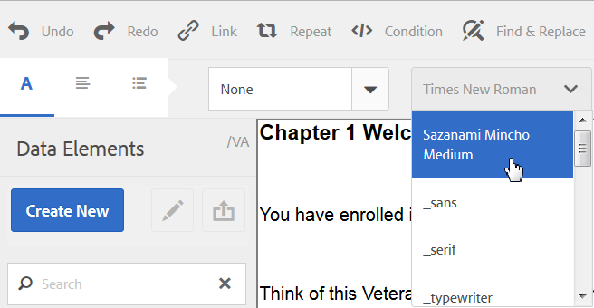

# Personalizar editor de texto{#customize-text-editor}

## Visão geral {#overview}

Você pode personalizar o editor de texto, em Gerenciar ativos e Criar interface de usuário de correspondência, para adicionar mais fontes e tamanhos de fontes. Essas fontes incluem fontes em inglês e não inglês, como japonês.

Você pode personalizar para alterar o seguinte nas configurações de fonte:

* Família e tamanho da fonte
* Propriedades como altura e espaçamento entre letras
* Valores padrão de família e tamanho de fonte, altura, espaçamento entre letras e formato de data
* Recuos com marcadores

Para fazer isso, é necessário:

1. [Personalize fontes editando o arquivo tbxeditor-config.xml no CRX](#customizefonts)
1. [Adicionar fontes personalizadas ao computador cliente](#addcustomfonts)

## Personalize fontes editando o arquivo tbxeditor-config.xml no CRX {#customizefonts}

Para personalizar fontes editando o arquivo tbxeditor-config.xml, faça o seguinte:

1. Vá para `https://'[server]:[port]'/[ContextPath]/crx/de` e faça logon como Administrador.
1. Na pasta apps, crie uma pasta chamada config com caminho/estrutura semelhante à pasta config, que está em libs/fd/cm/config, usando as seguintes etapas:

   1. Clique com o botão direito do mouse na pasta de itens no seguinte caminho e selecione **Sobrepor nó**:

      `/libs/fd/cm/config`

      

   1. Certifique-se de que a caixa de diálogo Sobrepor nó tenha os seguintes valores:

      **Caminho:** /libs/fd/cm/config

      **Localização:** /apps/

      **Corresponder tipos de nós:** Selecionado

      

   1. Clique em **OK**. A estrutura de pastas é criada na pasta de aplicativos.

   1. Clique em **Salvar tudo**.

1. Crie uma cópia do arquivo tbxeditor-config.xml na pasta de configuração recém-criada, usando as seguintes etapas:

   1. Clique com o botão direito do mouse no arquivo tbxeditor-config.xml em libs/fd/cm/config e selecione **Copiar**.
   1. Clique com o botão direito do mouse na seguinte pasta e selecione **Colar:**

      `apps/fd/cm/config`

   1. O nome do arquivo colado, por padrão, é `copy of tbxeditor-config.xml.` Renomear o arquivo para `tbxeditor-config.xml` e clique em **Salvar tudo**.

1. Abra o arquivo tbxeditor-config.xml em apps/fd/cm/config e faça as alterações necessárias.

   1. Duplo clique no arquivo tbxeditor-config.xml em apps/fd/cm/config. O arquivo é aberto.

      ```xml
      <editorConfig>
         <bulletIndent>0.25in</bulletIndent>
      
         <defaultDateFormat>DD-MM-YYYY</defaultDateFormat>
      
         <fonts>
            <default>Times New Roman</default>
            <font>_sans</font>
            <font>_serif</font>
            <font>_typewriter</font>
            <font>Arial</font>
            <font>Courier</font>
            <font>Courier New</font>
            <font>Geneva</font>
            <font>Georgia</font>
            <font>Helvetica</font>
            <font>Tahoma</font>
            <font>Times New Roman</font>
            <font>Times</font>
            <font>Verdana</font>
         </fonts>
      
         <fontSizes>
            <default>12</default>
            <fontSize>8</fontSize>
            <fontSize>9</fontSize>
            <fontSize>10</fontSize>
            <fontSize>11</fontSize>
            <fontSize>12</fontSize>
            <fontSize>14</fontSize>
            <fontSize>16</fontSize>
            <fontSize>18</fontSize>
            <fontSize>20</fontSize>
            <fontSize>22</fontSize>
            <fontSize>24</fontSize>
            <fontSize>26</fontSize>
            <fontSize>28</fontSize>
            <fontSize>36</fontSize>
            <fontSize>48</fontSize>
            <fontSize>72</fontSize>
         </fontSizes>
      
         <lineHeights>
            <default>2</default>     
            <lineHeight>2</lineHeight>
            <lineHeight>3</lineHeight>
            <lineHeight>4</lineHeight>
            <lineHeight>5</lineHeight>
            <lineHeight>6</lineHeight>
            <lineHeight>7</lineHeight>
            <lineHeight>8</lineHeight>
            <lineHeight>9</lineHeight>
            <lineHeight>10</lineHeight>
            <lineHeight>11</lineHeight>
            <lineHeight>12</lineHeight>
            <lineHeight>13</lineHeight>
            <lineHeight>14</lineHeight>
            <lineHeight>15</lineHeight>
            <lineHeight>16</lineHeight>
         </lineHeights>
      
         <letterSpacings>
            <default>0</default>
            <letterSpacing>0</letterSpacing>
            <letterSpacing>1</letterSpacing>
            <letterSpacing>2</letterSpacing>
            <letterSpacing>3</letterSpacing>
            <letterSpacing>4</letterSpacing>
            <letterSpacing>5</letterSpacing>
            <letterSpacing>6</letterSpacing>
            <letterSpacing>7</letterSpacing>
            <letterSpacing>8</letterSpacing>
            <letterSpacing>9</letterSpacing>
            <letterSpacing>10</letterSpacing>
            <letterSpacing>11</letterSpacing>
            <letterSpacing>12</letterSpacing>
            <letterSpacing>13</letterSpacing>
            <letterSpacing>14</letterSpacing>
            <letterSpacing>15</letterSpacing>
            <letterSpacing>16</letterSpacing>
         </letterSpacings>
      </editorConfig>
      ```

   1. Faça as alterações necessárias no arquivo para alterar o seguinte nas configurações de fonte:

      * Adicionar ou remover família e tamanho de fontes
      * Propriedades como altura e espaçamento entre letras
      * Valores padrão de família e tamanho de fonte, altura, espaçamento entre letras e formato de data
      * Recuos com marcadores
      Por exemplo, para adicionar uma fonte japonesa chamada Sazanami Mincho Medium, é necessário inserir a seguinte entrada no arquivo XML: `<font>Sazanami Mincho Medium</font>`. Também é necessário ter essa fonte instalada no computador cliente usada para acessar e trabalhar com a personalização da fonte. Para obter mais informações, consulte [Adicionar fontes personalizadas ao computador](#addcustomfonts)cliente.

      Você também pode alterar os padrões de vários aspectos do texto e, ao remover as entradas, remover as fontes do editor de texto.

   1. Clique em **Salvar tudo**.


## Adicionar fontes personalizadas ao computador cliente {#addcustomfonts}

Quando você acessa uma fonte no editor de texto do Gerenciamento de correspondência, ela precisa estar presente no computador cliente que você está usando para acessar o Gerenciamento de correspondência. Para poder usar uma fonte personalizada no editor de texto, primeiro é necessário instalar a mesma fonte no computador cliente.

Para obter mais informações sobre como instalar fontes, consulte o seguinte:

* [Instalar ou desinstalar fontes no Windows](https://windows.microsoft.com/en-us/windows-vista/install-or-uninstall-fonts)
* [Noções básicas sobre Mac: Livro de fontes](https://support.apple.com/en-us/HT201749)

## Acessar personalizações de fontes {#access-font-customizations}

Depois de alterar as fontes no arquivo tbxeditor-config.xml no CRX e instalar as fontes necessárias no computador cliente usadas para acessar o AEM Forms, as alterações serão exibidas no editor de texto.

Por exemplo, a fonte Sazanami Mincho Medium adicionada em [Personalizar fontes editando o arquivo tbxeditor-config.xml no procedimento CRX](#customizefonts) aparece na interface do editor de texto da seguinte forma:



>[!NOTE]
>
>Para ver o texto em japonês, primeiro é necessário digitar o texto com caracteres japoneses. A aplicação de uma fonte japonesa personalizada formata o texto somente de uma certa maneira. A aplicação de uma fonte japonesa personalizada não altera caracteres em inglês ou outros caracteres para caracteres japoneses.

