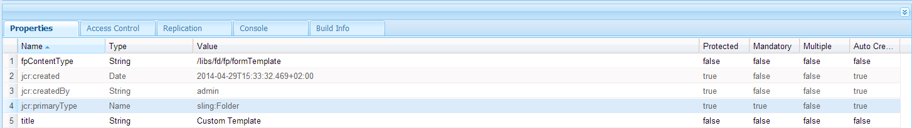
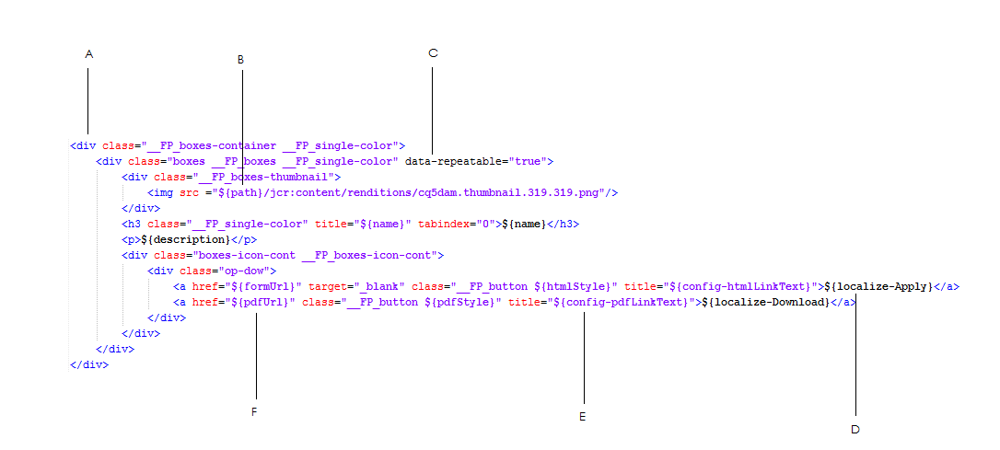

# Personalização de modelos para componentes do portal de formulários{#customizing-templates-for-forms-portal-components}

## Pré-requisitos {#prerequisites}

[Gerenciamento de metadados de formulário](../../forms/using/manage-form-metadata.md)

Conhecimento prático de HTML e CSS

## Visão geral {#overview}

A interface do usuário do AEM Forms permite que você adicione metadados a qualquer formulário. Os metadados personalizados podem melhorar a experiência do usuário ao listar e pesquisar formulários de sua organização.

O Forms Portal permite que você use metadados personalizados em listagens de formulário. Ao criar modelos personalizados para ativos, você pode modificar seu layout e usar metadados personalizados com seu conjunto de estilos CSS.

Execute as seguintes etapas para criar um modelo personalizado para vários componentes do Forms Portal.

## Creating a custom template {#creating-a-nbsp-custom-template}

1. Criar um nó sling:Folder em /apps

   Adicione uma propriedade &quot;fpContentType&quot;. Especifique os valores apropriados para a propriedade, dependendo do componente para o qual você está definindo o modelo personalizado.

   * Componente de pesquisa e lister: &quot;/libs/fd/fp/formTemplate&quot;
   * Componente Rascunhos e envios:

      * Seção de rascunhos: /libs/fd/fp/rascunhosModelo
      * Seção de submissões: /libs/fd/fp/submitTemplate
   * Componente do link: /libs/fd/fp/linkTemplate

   Adicione um título que você deseja que seja exibido ao selecionar modelos de layout.

   >[!NOTE]
   >
   >O título pode ser diferente do nome do nó sling:Folder criado.

   A imagem a seguir descreve a configuração do componente de Pesquisa e Lister.
   

1. Crie um arquivo template.html nesta pasta para servir como modelo personalizado.
1. Grave o modelo personalizado e use metadados personalizados, conforme descrito abaixo.

## Exemplo de trabalho {#working-example}

A seguir está uma amostra da implementação de um modelo personalizado em que o Forms Portal adquire um layout personalizado de cartão Gov para o componente de Pesquisa e Lister.

```html
<div class="__FP_boxes-container __FP_single-color">
    <div class="boxes __FP_boxes __FP_single-color" data-repeatable="true">
 <div class="__FP_boxes-thumbnail">
     
        </div>
        <h3 class="__FP_single-color" title="${name}" tabindex="0">${name}</h3>
        <p>${description}</p>
        <div class="boxes-icon-cont __FP_boxes-icon-cont">
            <div class="op-dow">
                <a href="${formUrl}" target="_blank" class="__FP_button ${htmlStyle}" title="${config-htmlLinkText}">${localize-Apply}</a>
                <a href="${pdfUrl}" class="__FP_button ${pdfStyle}" title="${config-pdfLinkText}">${localize-Download}</a>
            </div>
        </div>
    </div>
</div>
```

## Especificações técnicas para modelos personalizados {#technical-specifications-for-custom-templates}

Um modelo personalizado para qualquer componente do Forms Portal inclui entradas repetíveis e não repetíveis. As entradas repetidas são entidades básicas para listagem. Exemplos de entradas repetíveis são o Search &amp; Lister, os Rascunhos &amp; Submissões e os componentes do Link.

O Forms Portal fornece uma sintaxe para que os usuários individuais exibam metadados personalizados/OOTB. Os espaços reservados são preenchidos após a exibição dos resultados de formulários, rascunhos ou envios.

Para incluir uma entrada repetível, configure o valor do atributo com **dados repetitivos** como **verdadeiro**.

*No exemplo discutido, dois elementos Div estão presentes na parte superior do modelo personalizado. A primeira, com a classe CSS &quot;__FP_boxes-container&quot;, funciona como um elemento de container para os formulários listados. O segundo, com a classe CSS &quot;__FP_boxes&quot;, é um modelo para as entidades básicas, neste caso um Formulário. O atributo de **dados repetíveis**presente no elemento Div tem o valor **true**.*

Cada espaço reservado tem um conjunto exclusivo de metadados OTB. Para exibir metadados personalizados em um local específico no formulário, adicione a propriedade **** ${metadata_prop} no local.

*No exemplo, a propriedade metadata é usada em várias instâncias. Por exemplo, ele é usado na **descrição**,**nome**,**formUrl**,**htmlStyle**,**pdfUrl**********, pdfStyle, e no caminho prescrito.*

## Metadados prontos para uso {#out-of-the-box-metadata}

Vários componentes do Forms Portal fornecem conjuntos exclusivos de metadados OOTB que podem ser usados para listagem.

### Componente de pesquisa e lister {#search-amp-lister-component}

* **Título:** Título do formulário
* **name**: Nome do formulário (na maioria, é o mesmo que o título)
* **descrição**: Descrição do formulário
* **formUrl**: URL para renderizar o formulário como HTML
* **pdfUrl**: URL para renderizar o formulário como PDF
* **assetType**: Tipo do ativo. Os valores válidos incluem **Formulário**, Formulário **** PDF, Formulário **** impresso e Formulário **adaptável**

* **htmlStyle**&amp; **pdfStyle**: Estilo de exibição para ícones HTML e PDF usados respectivamente para renderização. Os valores válidos são &quot;**__FP_display_none**&quot; ou em branco.

>[!NOTE]
>
>Lembre-se de usar a classe __FP_display_none na sua folha de estilos personalizada.

* **downloadUrl**: URL para baixar um ativo.

Suporte para localização, classificação e uso das propriedades de configuração na interface do usuário (somente Search &amp; Lister):

1. **Suporte** a Localizações: Para localizar qualquer texto estático, use o atributo `${localize-YOUR_TEXT}` e disponibilize o valor localizado, caso ainda não exista.
   *No exemplo discutido, os atributos`${localize-Apply}`e`${localize-Download}`são usados para localizar o texto Aplicar e Baixar.*

1. **Suporte para classificação**: Clique no elemento HTML para classificar os resultados da pesquisa. Para implementar a classificação em um layout tabulado, adicione o atributo &quot;data-sortKey&quot; no cabeçalho da tabela específica. Além disso, adicione seu valor como os metadados para os quais você deseja classificar.
Por exemplo, para o cabeçalho &quot;Título&quot; na visualização de grade, o valor do cabeçalho &quot;data-sortKey&quot; é &quot;título&quot;. Clique no cabeçalho para classificar os valores em uma coluna específica.

1. **Uso das propriedades** de configuração: O componente de Pesquisa e Lister tem várias configurações que podem ser usadas na interface do usuário. Por exemplo, para exibir o texto da Dica de ferramenta HTML salvo pela caixa de diálogo de edição, use o `${config-htmlLinkText}` atributo. **Da mesma forma, para o texto da dica de ferramenta do PDF, use o** `${config-pdfLinkText}` atributo.

### Componente do link {#link-component}

* **Título:** Título do formulário
* **formUrl**: URL para renderizar o formulário como HTML
* **público alvo**: Atributo de Público alvo do link. Os valores válidos são &quot;_blank&quot; e &quot;_self.&quot;
* **linkText**: Legenda do link

### Componente Rascunhos e envios {#drafts-amp-submissions-component}

* **Caminho**: Caminho do nó de metadados de rascunho/envios. Use-o com a extensão .HTML como um URL para abrir um rascunho ou envio.
* **contextPath**: Caminho de contexto da instância AEM
* **firstLetter**: A primeira letra (maiúscula) do título do formulário adaptável, que foi salva como Rascunho ou enviada.
* **formName**: O título do formulário adaptável, que foi salvo como Rascunho ou submetido.
* **draftID**: ID do rascunho listado (Use apenas no modelo para a seção Rascunho).
* **submitID**: ID para o envio que está listado (Use apenas no modelo para a seção Envio).
* **status**: Status do formulário enviado. (Use apenas no modelo para a seção Envio).
* **descrição**: Descrição do formulário adaptativo associado ao rascunho ou ao envio.
* **diffTime**: Diferença entre a hora atual e a última ação de salvar do rascunho. Como alternativa, a diferença entre a hora atual e a última ação de envio para a submissão.
* **iconClass**: Classe CSS usada para exibir a primeira letra do rascunho/envio. O Forms Portal inclui as seguintes classes, que fornecem vários planos de fundo coloridos.
* **proprietário**: Usuário que criou o rascunho/envio.
* **Hoje**: Data de criação do rascunho ou envio no formato DD:MM:AAAA.
* **TimeNow**: Hora de criação do rascunho ou envio no formato HH:MM:SS de 24 horas

*Nota:*

1. Para a opção de exclusão na seção Rascunhos sob o componente Rascunhos e submissões, nomeie a classe CSS &quot;__FP_deleteDraft.&quot; Além disso, inclua o atributo &quot;draftID&quot; com o valor **${draftID}**, que é a id de rascunho do rascunho correspondente.

1. Ao criar links para rascunhos abertos e envios, você pode especificar **${path}.html** como o valor do atributo **href** para a tag âncora.



**A**. elemento Container

**B.** Metadados de &quot;caminho&quot; com uma hierarquia fixa para obter a miniatura armazenada para cada formulário.

**C.** Atributo repetível de dados usado para a seção do modelo para cada formulário

**D.** Para localizar a string &quot;Apply&quot;

**E.** Uso da propriedade de configuração pdfLinkText

**F.** Uso dos metadados &quot;pdfUrl&quot;

## Dicas, truques e problemas conhecidos {#tips-tricks-and-known-issues}

1. Não use aspas simples (&#39;) em nenhum modelo personalizado.
1. Para metadados personalizados, armazene essa propriedade somente no nó **jcr:content/metadata** . Se você armazená-lo em qualquer outro lugar, o Forms Portal não poderá exibir os metadados.
1. Certifique-se de que o nome de metadados personalizados ou existentes não incluam dois pontos ( : ). Se isso acontecer, você não poderá exibi-lo na interface do usuário.
1. **a repetição** de dados não tem importância para um componente **Link** . O Adobe recomenda que você evite usar essa propriedade no modelo para um componente de Link.

## Artigos relacionados

* [Ativar componentes do portal de formulários](/help/forms/using/enabling-forms-portal-components.md)
* [Criar página do portal de formulários](/help/forms/using/creating-form-portal-page.md)
* [Lista de formulários em uma página da Web usando APIs](/help/forms/using/listing-forms-webpage-using-apis.md)
* [Usar componente Rascunhos e envios](/help/forms/using/draft-submission-component.md)
* [Personalizar o armazenamento de rascunhos e formulários enviados](/help/forms/using/draft-submission-component.md)
* [Amostra para integrar o componente de rascunhos e envios ao banco de dados](/help/forms/using/integrate-draft-submission-database.md)
* [Personalização de modelos para componentes do portal de formulários](/help/forms/using/customizing-templates-forms-portal-components.md)
* [Introdução à publicação de formulários em um portal](/help/forms/using/introduction-publishing-forms.md)