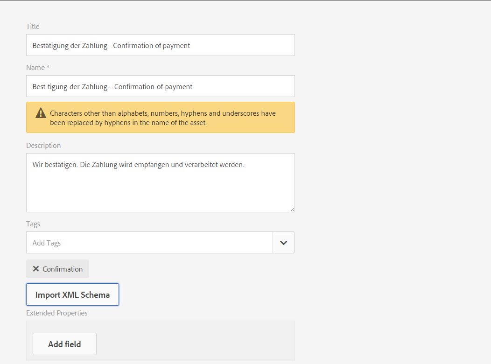
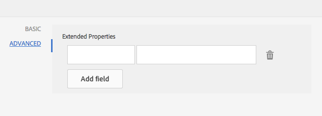

# Dicionário de dados{#data-dictionary}

## Introdução {#introduction}

Um dicionário de dados permite que os usuários corporativos usem informações de fontes de dados back-end sem conhecer detalhes técnicos sobre seus modelos de dados subjacentes. Um dicionário de dados é composto de elementos de dicionário de dados (DDEs). Esses elementos de dados são usados para integrar dados back-end às letras como entrada para uso em uma correspondência do cliente.

Um dicionário de dados é uma representação independente de metadados que descreve as estruturas de dados subjacentes e seus atributos associados. Um dicionário de dados é criado usando o vocabulário comercial. Pode ser mapeado para um ou mais modelos de dados subjacentes.

O dicionário de dados é composto de elementos de três tipos: Elementos simples, compostos e coleção. DDEs simples são elementos primitivos, como sequências de caracteres, números, datas e valores booleanos que contêm informações como um nome de cidade. Um DDE composto contém outros DDEs, que podem ser do tipo primitivo, composto ou coleção. Por exemplo, um endereço, que consiste em um endereço, cidade, província, país e código postal. Uma coleção é uma lista de DDEs simples ou compostos semelhantes. Por exemplo, um cliente com vários locais ou endereços de faturamento e envio diferentes.

O Gerenciamento de correspondência usa os dados de back-end, cliente ou destinatário específicos armazenados de acordo com a estrutura do dicionário de dados para criar correspondência destinada a clientes diferentes. Por exemplo, um documento pode ser criado com nomes amigáveis, como &quot;Prezado(a) {Nome(a)}&quot;,&quot;Sr. {Sobrenome}&quot;.

Normalmente, os usuários corporativos não exigem conhecimento de representações de metadados, como XSD (esquema XML) e classes Java. No entanto, eles geralmente exigem acesso a essas estruturas de dados e atributos para criar soluções.

### Fluxo de trabalho do Dicionário de dados {#data-dictionary-workflow}

1. Um Autor [cria o Dicionário](#createdatadictionary) de dados carregando um esquema ou do zero.
1. O autor cria cartas e comunicações interativas com base no dicionário de dados e associa elementos do dicionário de dados em cartas e comunicações interativas, sempre que necessário.
1. Um autor pode baixar arquivos XML de dados de amostra, que se baseiam no esquema de um dicionário de dados. O autor pode modificar o arquivo XML de dados de amostra, que pode ser associado como dados de teste com o dicionário de dados. O mesmo é usado durante a visualização da carta.
1. Ao [visualizar uma carta](../../forms/using/create-letter.md#p-types-of-linkage-available-for-each-of-the-fields-p), um autor escolhe visualizar a carta com dados (Visualização personalizada). A carta é aberta pré-preenchida com os dados fornecidos pelo Autor. Isso é aberto na interface de criação de correspondência. O agente que está visualizando esta carta pode modificar o conteúdo, os dados e os anexos desta carta e pode enviar a carta final. Para obter mais informações sobre como criar cartas, consulte [Criar correspondência](../../forms/using/create-letter.md).

## Pré-requisitos {#prerequisite}

Instale o Pacote [de](compatibility-package.md) compatibilidade para exibir a opção **Dicionários** de dados na página **Formulários** .

## Criar um dicionário de dados {#createdatadictionary}

Use o Editor de dicionário de dados para criar um dicionário de dados ou faça upload de um arquivo de esquema XSD para criar um dicionário de dados baseado nele. Você pode estender o dicionário de dados adicionando mais informações necessárias, incluindo campos. Independentemente de como o dicionário de dados foi criado, o proprietário do processo de negócios não precisa de conhecimento dos sistemas de back-end. O proprietário do processo de negócios só precisa de conhecimento dos objetos do domínio, e suas definições, para o seu processo.

>[!NOTE]
>
>Para várias letras que exigem elementos semelhantes, é possível criar um dicionário de dados comum. Entretanto, um grande dicionário de dados com um grande número de elementos pode causar problemas de desempenho ao usar o dicionário de dados e carregar os elementos, como em letras e fragmentos de documento. Se tiver problemas de desempenho, tente criar dicionários de dados separados para letras diferentes.

1. Selecione **Formulários** > Dicionários **de dados**.
1. Toque em **Criar dicionário** de dados.
1. Na tela Propriedades, adicione o seguinte:

   * **** Título: (Opcional) Insira o título do dicionário de dados. O título não precisa ser exclusivo e pode ter caracteres especiais e caracteres diferentes do inglês. Cartas e outros fragmentos de documento são referenciados com seu título (quando disponíveis), como em miniaturas e propriedades de ativos. Os dicionários de dados são referenciados com seus nomes e não com títulos.
   * **** Nome: O nome exclusivo do dicionário de dados. No campo Nome, é possível digitar somente caracteres, números e hífens em inglês. O campo Nome é automaticamente preenchido com base no campo Título e os caracteres especiais, espaços, números e caracteres que não sejam em inglês inseridos no campo Título são substituídos por hífens. Embora o valor no campo Título seja copiado automaticamente para o Nome, é possível editar o valor.

   * **Descrição**: (Opcional) Descrição do dicionário de dados.
   * **** Tags: (Opcional) Para criar uma tag personalizada, insira o valor no campo de texto e pressione Enter. Você pode ver sua tag abaixo do campo de texto das tags. Quando você salva esse texto, as tags recém-adicionadas também são criadas.
   * **Propriedades** estendidas: (Opcional) Toque em **Adicionar campo** para especificar atributos de metadados para o dicionário de dados. Na coluna Nome da propriedade, digite um nome de propriedade exclusivo. Na coluna Valor, insira um valor a ser associado à propriedade.
   

1. (Opcional) Para carregar uma definição de esquema XSD para o dicionário de dados, no painel Estrutura do dicionário de dados, toque em **Carregar esquema** XML. Navegue até o arquivo XSD, selecione-o e toque em **Abrir**. Um Dicionário de dados é criado com base no esquema XML carregado. É necessário ajustar os nomes de exibição e as descrições dos elementos no dicionário de dados. Para fazer isso, selecione os nomes dos elementos tocando neles e edite suas descrições, nomes de exibição e outros detalhes nos campos no painel direito.

   Para obter mais informações sobre os Elementos computados do dicionário, consulte Elementos [do dicionário de dados](#computedddelements)calculados.

   >[!NOTE]
   >
   >Você pode ignorar o upload do arquivo de esquema e criar o dicionário de dados do zero usando a interface do usuário. Para fazer isso, pule esta etapa e continue com as próximas etapas.

1. Toque em **Avançar**.
1. Na tela Adicionar propriedades, adicione os elementos ao dicionário de dados. Você também pode adicionar/excluir elementos e editar seus detalhes se tiver carregado um esquema para obter uma estrutura básica do dicionário de dados.

   Você pode tocar nos três pontos no lado direito de um elemento e adicionar um elemento à estrutura do dicionário de dados.

   

   Selecione Elemento composto, Elemento de coleção ou Elemento primitivo.

   * Um DDE composto contém outros DDEs, que podem ser do tipo primitivo, composto ou coleção. Por exemplo, um endereço, que consiste em um endereço, cidade, província, país e código postal.
   * DDEs primitivos são elementos como sequências de caracteres, números, datas e valores booleanos que contêm informações como um nome de cidade.
   * Uma coleção é uma lista de DDEs simples ou compostos semelhantes. Por exemplo, um cliente com vários locais ou endereços de faturamento e envio diferentes.
   Veja a seguir algumas regras para criar um dicionário de dados:

   * Somente o tipo composto é permitido como DDE de nível superior em um dicionário de dados.
   * Nome, nome de referência e tipo de elemento são campos obrigatórios para um dicionário de dados e DDEs.
   * O nome de referência deve ser exclusivo.
   * Um DDE pai (composto) não pode ter dois filhos com o mesmo nome.
   * As enumerações contêm apenas tipos de String primitiva.
   Para obter mais informações sobre elementos Compostos, Coleção e Primitivos e como trabalhar com elementos do dicionário de dados, consulte [Mapeamento de elementos do dicionário de dados para o esquema](#mappingddetoschema)XML.

   Para obter informações sobre validações no Dicionário de dados, consulte Validações [do Editor do dicionário de](#ddvalidations)dados.

   

1. (Opcional) Após selecionar um elemento, na guia Avançado, é possível adicionar propriedades (atributos). Você também pode tocar em **Adicionar campo** e estender as propriedades de um elemento DD.

   

1. (Opcional) É possível remover qualquer elemento tocando nos três pontos no lado direito de um elemento e selecionando **Excluir**.

   

   >[!NOTE]
   >
   >A exclusão de um elemento composto/coleção com nós filhos também exclui os nós filhos.

1. (Opcional) Selecione um elemento no painel Estrutura do dicionário de dados e no painel Campo e Lista de variáveis. Altere ou adicione quaisquer atributos necessários associados ao elemento.
1. Toque em **Salvar**.

### Criar cópias de um ou mais dicionários de dados {#create-copies-of-one-or-more-data-dictionary}

Para criar rapidamente um ou mais dicionários de dados com propriedades e elementos semelhantes aos dicionários de dados existentes, é possível copiá-los e colá-los.

1. Na lista de dicionários de dados, selecione os dicionários de dados apropriados. A interface do usuário exibe o ícone Copiar.
1. Toque em Copiar. A interface do usuário exibe o ícone Colar.
1. Toque em Colar. A caixa de diálogo Colar é exibida. O sistema atribui automaticamente nomes e títulos aos novos dicionários de dados.
1. Se necessário, edite o Título e o Nome com os quais deseja salvar a cópia do dicionário de dados.
1. Toque em Colar. A cópia do dicionário de dados é criada. Agora você pode fazer as alterações necessárias no dicionário de dados recém-criado.

## Consulte os fragmentos do documento ou documentos que fazem referência a um elemento do Dicionário de dados {#see-the-document-fragments-or-documents-that-refer-to-a-data-dictionary-element}

Ao editar ou exibir um dicionário de dados, você pode ver quais elementos no dicionário de dados são referenciados em quais Textos, Condições, Cartas e Comunicações interativas.

1. Execute um dos procedimentos a seguir para editar o dicionário de dados:

   * Passe o mouse sobre um dicionário de dados e toque em Editar.
   * Selecione um dicionário de dados e toque em Editar no cabeçalho.
   * Passe o mouse sobre um dicionário de dados e toque em Selecionar. Em seguida, toque em Editar no cabeçalho.
   Ou toque em um dicionário de dados para exibi-lo.

1. No dicionário de dados, toque em um elemento simples para selecioná-lo. Os elementos de composição e coleção não têm referências.

   Junto com as propriedades Básicas e Avançadas do elemento, o Conteúdo emprestado também é exibido.

1. Toque em Conteúdo emprestado.

   A guia Conteúdo emprestado é exibida com o seguinte: Textos, condições, letras e comunicações interativas. Cada um desses cabeçalhos também exibe o número de referências ao elemento selecionado.

1. Toque em um cabeçalho para ver o nome dos ativos que se referem ao elemento.

   

1. Para exibir o conteúdo emprestado de outro elemento, toque no elemento.
1. Para exibir um ativo que se refere ao elemento, toque em seu nome. O navegador exibe o ativo, a letra ou a Comunicação interativa.

## Trabalhar com dados de teste {#working-with-test-data}

1. Na página Dicionários de dados, toque em **Selecionar**.
1. Toque em um dicionário de dados para o qual deseja baixar dados de teste e toque em **Baixar dados** XML de amostra.
1. Toque em **OK** na mensagem de alerta. Um arquivo XML é baixado.
1. Abra o arquivo XML com o Bloco de notas ou outro editor XML. O arquivo XML tem a mesma estrutura que o dicionário de dados e as strings de espaço reservado nos elementos. Substitua as strings de espaço reservado pelos dados com os quais você deseja testar uma letra.

   ```xml
   <?xml version="1.0" encoding="UTF-8" standalone="no"?>
   <Company>
   <Name>string</Name>
   <Type>string</Type>
   <HeadOfficeAddress>
   <Street>string</Street>
   <City>string</City>
   <State>string</State>
   <Zip>string</Zip>
   </HeadOfficeAddress>
   <SalesOfficeAddress>
   <Street>string</Street>
   <City>string</City>
   <State>string</State>
   <Zip>string</Zip>
   </SalesOfficeAddress>
   <HeadCount>1.0</HeadCount>
   <CEO>
   <PersonName>
   <FirstName>string</FirstName>
   <MiddleName>string</MiddleName>
   <LastName>string</LastName>
   </PersonName>
   <DOB>string</DOB>
   <CurrAddress>
   <Street>string</Street>
   <City>string</City>
   <State>string</State>
   <Zip>string</Zip>
   </CurrAddress>
   <DOJ>14-04-1973</DOJ>
   <Phone>1.0</Phone>
   </CEO>
   </Company>
   ```

   >[!NOTE]
   >
   >Neste exemplo, o XML cria espaço para três valores para um elemento de coleção, mas o número de valores pode ser aumentado/diminuído conforme o requisito.

1. Depois de fazer as entradas de dados, você pode usar esse arquivo XML ao visualizar uma carta com dados de teste.

   Você pode adicionar esses dados de teste com DD (Selecione DD e toque em Fazer upload de dados de teste e fazer upload desse arquivo xml). Assim, depois disso, ao visualizar a carta normalmente (não personalizada), esses dados XML são usados na carta. Você também pode tocar em Personalizado e fazer upload desse XML.

## Amostras {#samples}

As amostras de código a seguir mostram detalhes de implementação do Dicionário de dados.

### Esquema de amostra que pode ser carregado no Dicionário de dados {#sample-schema-that-can-be-uploaded-to-the-data-dictionary}

```xml
<?xml version="1.0" encoding="utf-8"?>
<xs:schema xmlns="DCT" targetNamespace="DCT" xmlns:xs="https://www.w3.org/2001/XMLSchema"
  elementFormDefault="qualified" attributeFormDefault="unqualified">
  <xs:element name="Company">
    <xs:complexType>
      <xs:sequence>
        <xs:element name="Name" type="xs:string"/>
        <xs:element name="Type" type="xs:anySimpleType"/>
        <xs:element name="HeadOfficeAddress" type="Address"/>
        <xs:element name="SalesOfficeAddress" type="Address" minOccurs="0"/>
        <xs:element name="HeadCount" type="xs:integer"/>
        <xs:element name="CEO" type="Employee"/>
        <xs:element name="Workers" type="Employee" maxOccurs="unbounded"/>
      </xs:sequence>
    </xs:complexType>
  </xs:element>
  <xs:complexType name="Employee">
    <xs:complexContent>
      <xs:extension  base="Person">
        <xs:sequence>
          <xs:element name="CurrAddress" type="Address"/>
          <xs:element name="DOJ" type="xs:date"/>
          <xs:element name="Phone" type="xs:integer"/>
        </xs:sequence>
      </xs:extension>
    </xs:complexContent>
  </xs:complexType>
  <xs:complexType name="Person">
    <xs:sequence>
      <xs:element name="PersonName" type="Name"/>
      <xs:element name="DOB" type="xs:dateTime"/>
    </xs:sequence>
  </xs:complexType>
  <xs:complexType name="Name">
    <xs:sequence>
      <xs:element name="FirstName" type="xs:string"/>
      <xs:element name="MiddleName" type="xs:string"/>
      <xs:element name="LastName" type="xs:string"/>
    </xs:sequence>
  </xs:complexType>
  <xs:complexType name="Address">
    <xs:sequence>
      <xs:element name="Street" type="xs:string"/>
      <xs:element name="City" type="xs:string"/>
      <xs:element name="State" type="xs:string"/>
      <xs:element name="Zip" type="xs:string"/>
    </xs:sequence>
  </xs:complexType>
</xs:schema>
```

## Atributos comuns associados a um DDE {#common-attributes-associated-with-a-dde}

A tabela a seguir detalha os atributos comuns associados a um DDE:

<table>
 <tbody>
  <tr>
   <td><strong>Atributo</strong></td>
   <td><strong>Tipo</strong></td>
   <td><strong>Descrição</strong></td>
  </tr>
  <tr>
   <td>Nome</td>
   <td>Sequência de caracteres</td>
   <td>Obrigatório.<br /> Nome do DDE. Deve ser único.</td>
  </tr>
  <tr>
   <td>Reference<br /> Name</td>
   <td>Sequência de caracteres</td>
   <td>Obrigatório. Nome de referência exclusiva para o DDE, permitindo referências ao DDE que não dependem de alterações na hierarquia ou estrutura do dicionário de dados. Os módulos de texto são mapeados usando esse nome</td>
  </tr>
  <tr>
   <td>display name</td>
   <td>Sequência de caracteres</td>
   <td>Um nome opcional fácil de usar do DDE.</td>
  </tr>
  <tr>
   <td>descrição</td>
   <td>Sequência de caracteres</td>
   <td>Descrição do DDE.</td>
  </tr>
  <tr>
   <td>elementType</td>
   <td>Sequência de caracteres</td>
   <td>Obrigatório. O tipo de DDE: STRING, NUMBER, DATE, Booleano, COMPOSTO, COLEÇÃO.</td>
  </tr>
  <tr>
   <td>elementSubType</td>
   <td>Sequência de caracteres</td>
   <td>O subtipo para DDE: ENUM. Somente permitido para STRING e NUMBER elementType.</td>
  </tr>
  <tr>
   <td>Chave</td>
   <td>Booleano</td>
   <td>Um campo Booliano para indicar se um DDE é um elemento chave.</td>
  </tr>
  <tr>
   <td>Computado</td>
   <td>Booleano</td>
   <td>Um campo Booliano para indicar se um DDE é calculado. Um valor DDE calculado é uma função de outros valores DDE. Por padrão, as expressões jsp são suportadas.</td>
  </tr>
  <tr>
   <td>expressão</td>
   <td>Sequência de caracteres</td>
   <td>A expressão para o DDE "calculado". O serviço de avaliação de expressão fornecido por padrão suporta expressões JSP EL. É possível substituir o serviço de expressão por uma implementação personalizada.</td>
  </tr>
  <tr>
   <td>valueSet</td>
   <td>Lista</td>
   <td>Um conjunto de valores permitidos para um tipo Enum DDE. Por exemplo, o tipo de conta pode ter apenas valores (Salvar, Atual).</td>
  </tr>
  <tr>
   <td>ExtendedProperties</td>
   <td>Objeto</td>
   <td>Um mapa de propriedades personalizadas adicionado ao DDE (interface do usuário específica ou qualquer outra informação).</td>
  </tr>
  <tr>
   <td>Obrigatório</td>
   <td>Booleano</td>
   <td>O sinalizador indica que a fonte de dados de instância correspondente ao dicionário de dados deve conter o valor desse DDE específico.</td>
  </tr>
  <tr>
   <td>Vínculo</td>
   <td>BindingElement</td>
   <td>O vínculo XML ou Java do elemento.</td>
  </tr>
 </tbody>
</table>

### Elementos do dicionário de dados calculados {#computedddelements}

Um dicionário de dados também pode incluir elementos calculados. Um elemento de dicionário de dados calculado está sempre associado a uma expressão. Essa expressão é avaliada para obter o valor de um elemento de dicionário de dados em tempo de execução. Um valor DDE calculado é uma função de outros valores DDE ou literais. Por padrão, expressões JSP Expression Language (EL) são suportadas. As expressões EL usam os caracteres ${ } e as expressões válidas podem incluir literais, operadores, variáveis (referências de elementos de dicionário de dados) e chamadas de função. Ao referenciar um elemento de dicionário de dados na expressão, o nome de referência do DDE é usado. O nome de referência é exclusivo para cada elemento do dicionário de dados em um dicionário de dados.

Um DDE PersonFullName calculado pode ser associado a uma expressão de concatenação EL, como ${PersonFirstName} ${PersonLastName}.

## Mapeamento de tipo de dados entre XSD e dicionário de dados {#data-type-mapping-between-xsd-and-data-dictionary-br}

A exportação de um XSD requer mapeamento de dados específicos, que é detalhado na tabela a seguir. A coluna DDI indica o tipo do valor DDE, conforme disponível no DDI.

<table>
 <tbody>
  <tr>
   <td>XSD <br /> </td>
   <td><p>Dicionário de dados <br /> </p> </td>
   <td>DDI (Tipo de Dados de Valor de Instância)<br /> </p> </td>
  </tr>
  <tr>
   <td><p>xs:elemento do tipo - Tipo composto<br /> </p> </td>
   <td>DDE do tipo - COMPOSTO<br /> </p> </td>
   <td>java.util.Map<br /> </td>
  </tr>
  <tr>
   <td><p>xs:element onde maxOcorre &gt; 1<br /> </p> </td>
   <td>DDE do tipo - COLLECTION-<br /> Um nó DDE é criado ao lado do DDE COLLECTION, que captura informações do nó COLLECTION pai. O mesmo é criado para a coleção de tipos de dados simples/compostos. Sempre que você tiver uma COLEÇÃO do tipo composto, a árvore do Dicionário de dados captura os campos constituintes nos filhos do DDE criados para capturar informações de tipo.<br /> - DDE (COLLECTION)<br /> - DDE(COMPOSITE para informações de tipo)<br /> - campo<br /> DDE(STRING) - campo<br /> DDE(STRING) <br /> </p> </td>
   <td>java.util.List<br /> </td>
  </tr>
  <tr>
   <td>Atributo do tipo - xs:id <br /> </p> </td>
   <td>DDE do tipo - STRING <br /> </td>
   <td>java.lang.String<br /> </td>
  </tr>
  <tr>
   <td>xs:attribute /xs:elemento do tipo - xs:string</p> </td>
   <td>DDE do tipo - STRING<br /> </td>
   <td>java.lang.String<br /> </td>
  </tr>
  <tr>
   <td>xs:attribute /xs:elemento do tipo - xs: booleano <br /> </td>
   <td>DDE do tipo - Booleano <br /> </td>
   <td>java.lang.Boolean<br /> </td>
  </tr>
  <tr>
   <td>xs:attribute /xs:elemento do tipo - xs:date </td>
   <td>DDE do tipo - DATA </td>
   <td>java.lang.String</td>
  </tr>
  <tr>
   <td>xs:attribute /xs:elemento do tipo - xs:integer </td>
   <td>DDE do tipo - NUMBER </td>
   <td>java.lang.Double</td>
  </tr>
  <tr>
   <td>xs:attribute /xs:elemento do tipo - xs:long</td>
   <td>DDE do tipo - NUMBER </td>
   <td>java.lang.Double</td>
  </tr>
  <tr>
   <td>xs:attribute /xs:elemento do tipo - xs:double</td>
   <td>DDE do tipo - NUMBER </td>
   <td>java.lang.Double</td>
  </tr>
  <tr>
   <td>Elemento do tipo enum e baseType - xs:string</td>
   <td>DDE<br /> do tipo - subtipo STRING<br /> - ENUM<br /> valueSet - os valores permitidos para ENUM<br /> </td>
   <td>java.lang.String</td>
  </tr>
 </tbody>
</table>

## Baixar um arquivo de dados de amostra de um dicionário de dados {#download-a-sample-data-file-from-a-data-dictionary}

Depois de criar um dicionário de dados, é possível baixá-lo como um arquivo de dados de amostra XML para fazer entradas de texto nele.

1. Na página Dicionários de dados, toque em **Selecionar** e em um dicionário de dados para selecioná-lo.
1. Select **Download Sample XML Data**.
1. Toque em **OK** na mensagem de alerta.

   O Gerenciamento de correspondência cria um arquivo XML com base na estrutura do dicionário de dados selecionado e o baixa no computador com o nome &lt;data-dictionary-name>-SampleData. Agora você pode editar esse arquivo em um editor de texto ou XML para fazer entradas de dados ao [criar uma carta](../../forms/using/create-letter.md).

## Internacionalização de metadados {#internationalization-of-meta-data}

Quando quiser enviar a mesma carta em idiomas diferentes para seus clientes, localize o nome de exibição, a descrição e os conjuntos de valores enum do Dicionário de dados e dos Elementos do dicionário de dados.

### Localizar dicionário de dados {#localize-data-dictionary}

1. Na página Dicionários de dados, toque em **Selecionar** e em um dicionário de dados para selecioná-lo.
1. Toque em **Baixar dados** de localização.
1. Toque em **OK** no alerta. O Gerenciamento de correspondência baixa um arquivo zip em seu computador com o nome DataDictionary-&lt;Nome>.zip.
1. O arquivo Zip contém um arquivo .properties. Esse arquivo define o dicionário de dados baixado. O conteúdo do arquivo de propriedade é semelhante ao seguinte:

   ```
   #Wed May 20 16:06:23 BST 2015
   DataDictionary.EmployeeDD.description=
   DataDictionary.EmployeeDD.displayName=EmployeeDataDictionary
   DataDictionaryElement.name.description=
   DataDictionaryElement.name.displayName=name
   DataDictionaryElement.person.description=
   DataDictionaryElement.person.displayName=person
   ```

   A estrutura do arquivo de propriedades define uma linha cada para a descrição e o nome de exibição para o dicionário de dados e cada elemento do dicionário de dados no dicionário de dados. Além disso, o arquivo de propriedades define uma linha para um valor enum definido para cada elemento do dicionário de dados. Como ocorre com um dicionário de dados, o arquivo de propriedades correspondente pode ter várias definições de elementos do dicionário de dados. Além disso, o arquivo pode conter as definições de um ou mais conjuntos de valores enum.

1. Para atualizar o arquivo .properties em uma localidade diferente, atualize o nome de exibição e os valores de descrição no arquivo. Crie mais instâncias do arquivo para cada idioma no qual você deseja localizar. Somente os idiomas francês, alemão, japonês e inglês são suportados.

1. Salve os diferentes arquivos de propriedades atualizados com os seguintes nomes:

   _fr_FR.properties Francês

   _de_DE.properties Alemão

   _ja_JA.properties Japonês

   _en_EN.properties Inglês

1. Arquive o arquivo .properties (ou arquivos para várias localidades) em um único arquivo .zip.

1. Na página Dicionários de dados, selecione **Mais** > **Carregar dados** de localização e selecione o arquivo zip com arquivos de propriedades localizados.
1. Para exibir as alterações de localização, altere a localidade do navegador.

## Validações do dicionário de dados {#ddvalidations}

O Editor do dicionário de dados impõe as seguintes validações ao criar ou atualizar um dicionário de dados.

* Somente o tipo composto é permitido como Elemento de nível superior em um dicionário de dados.
* Elementos compostos e de coleção não são permitidos no nível da folha. Somente elementos primitivos (String, Date, Number, Boolean) são permitidos no nível da folha. Essa validação garante que não haja nenhum elemento composto e de coleção sem um DDE filho.
* Ao carregar um arquivo XSD para criar um dicionário de dados, o Editor do dicionário de dados solicita que um elemento de nível superior, se houver vários, crie o dicionário de dados.
* O nome é o único parâmetro necessário para um dicionário de dados.
* Um DDE pai (composto) não pode ter dois filhos com o mesmo nome
* Garante que um DDE seja marcado como calculado, somente se não for um parâmetro obrigatório. Um elemento obrigatório não pode ser calculado e um elemento calculado não pode ser necessário. Além disso, Coleção e Elemento composto não podem ser elementos computados.
* Garante que um DDE seja marcado como obrigatório, somente quando não for calculado. Ela também garante que não seja o &quot;collectionElement&quot; que denota o tipo de Coleção (que são os únicos filhos de um Elemento de coleção).
* Chaves vazias ou chaves duplicadas não são permitidas em ExtendedProperties para um dicionário de dados ou DDE.
* Não use os caracteres de dois pontos (:) ou barra vertical(|) dentro da chave ou do valor de uma propriedade estendida. Não há validação para o uso desses caracteres proibidos.

Validações aplicadas no nível do dicionário de dados

* O nome do Dicionário de dados não deve ser nulo.
* O nome do Dicionário de dados deve conter apenas caracteres alfanuméricos.
* A lista de elementos filho no Dicionário de dados não deve ser nula ou vazia.
* O Dicionário de dados não deve conter mais de um elemento de dicionário de dados de nível superior.
* Somente o tipo composto é permitido como Elemento de nível superior em um Dicionário de dados.

Validações que são aplicadas no Nível de elemento do dicionário de dados.

* Todos os nomes DDE não devem ser nulos e não devem conter espaços.
* Todos os DDEs devem ter um tipo de elemento &quot;não nulo/não nulo&quot;.
* Todos os nomes de referência DDE não devem ser nulos.
* Todos os nomes de referência DDE devem ser exclusivos.
* Todas as referências de DDE devem conter apenas caracteres alfanuméricos e &quot;_&quot;.
* Todos os nomes para exibição de DDE devem conter apenas caracteres alfanuméricos e &quot;_&quot;.
* Elementos compostos e de coleção não são permitidos no nível da folha. Somente elementos primitivos (String, Date, Number, Boolean) são permitidos no nível da folha. Essa validação garante que não haja nenhum elemento composto e de coleção sem um DDE filho.
* Um DDE pai composto não deve ter dois elementos filho com o mesmo nome.
* O subtipo ENUM é usado apenas para elementos String e Number.
* Não é possível calcular elementos de coleção e composto.
* Um DDE não pode ser calculado e obrigatório.
* Os DDEs calculados devem conter uma expressão válida.
* Os DDEs calculados não devem ter vínculo XML.
* Um DDE que indica o tipo para um DDE de coleção não pode ser calculado ou obrigatório.
* Os DDEs do subtipo ENUM não devem conter conjuntos de valores nulos ou vazios.
* O vínculo XML de um DDE de coleção não deve mapear para um atributo.
* A sintaxe de vínculo XML deve ser válida, como, por exemplo, apenas um @ aparece, o @ só é permitido quando seguido por um nome de atributo.

## Mapeamento de elementos do dicionário de dados para o esquema XML {#mappingddetoschema}

Você pode criar um dicionário de dados a partir de um Esquema XML ou criá-lo usando a interface do usuário do Dicionário de dados. Todos os Elementos do dicionário de dados (DDEs) em um dicionário de dados têm um campo Vínculo XML para armazenar o vínculo do DDE a um elemento no esquema XML. O vínculo em cada DDE é relativo ao DDE pai.

Os detalhes a seguir mostram exemplos de modelos e exemplos de código que mostram detalhes de implementação do Dicionário de dados.

## Mapeamento de elementos simples (primitivos) {#mapping-simple-primitive-elements}

Um DDE primitivo representa um campo ou atributo que é de natureza atômica. DDEs primitivos definidos fora do escopo de um tipo complexo (DDE composto) ou de um elemento repetitivo (DDE coleção) podem ser armazenados em qualquer local dentro do Esquema XML. A localização dos dados correspondentes a um DDE primitivo não depende do mapeamento do DDE pai. O DDE primitivo usa as informações de mapeamento do campo Vínculo XML para determinar seu valor e os mapeamentos são traduzidos em um dos seguintes:

* um atributo
* um elemento
* um contexto de texto
* nada (um DDE ignorado)

O exemplo a seguir mostra um esquema simples.

```xml
<?xml version="1.0" encoding="UTF-8"?>
<xs:schema xmlns:xs="https://www.w3.org/2001/XMLSchema">
  <xs:element name='age' type='integer'/>
  <xs:element name='price' type='decimal'/>
</xs:schema>
```

| **Elemento do dicionário de dados** | **Vínculo XML padrão** |
|---|---|
| age | /age |
| preço | /preço |

### Mapeamento de elementos compostos {#mapping-composite-elements}

O vínculo não é compatível com elementos Compostos, se o vínculo for fornecido, ele será ignorado. A ligação para todos os DDEs filhos constituintes de tipo primitivo deve ser absoluta. Permitir o mapeamento absoluto de elementos filho de um DDE composto proporciona mais flexibilidade em termos de Vínculo XPath. O mapeamento de um DDE composto para um elemento de tipo complexo no esquema XML limita o escopo do vínculo para seus elementos filho.

O exemplo a seguir mostra o esquema de uma observação.

```xml
<xs:element name="note">
    <xs:complexType>
        <xs:sequence>
            <xs:element name="to" type="xs:string"/>
            <xs:element name="from" type="xs:string"/>
            <xs:element name="heading" type="xs:string"/>
            <xs:element name="body" type="xs:string"/>
        </xs:sequence>
    </xs:complexType>
</xs:element>
```

<table>
 <tbody>
  <tr>
   <td><strong>Elemento do dicionário de dados</strong></td>
   <td><strong>Vínculo XML padrão</strong></td>
  </tr>
  <tr>
   <td>nota</td>
   <td>empty(null)<br /> </td>
  </tr>
  <tr>
   <td>para</td>
   <td>/note/to</td>
  </tr>
  <tr>
   <td>from</td>
   <td>/note/from</td>
  </tr>
  <tr>
   <td>cabeçalho</td>
   <td>/nota/cabeçalho</td>
  </tr>
  <tr>
   <td>corpo</td>
   <td>/note/body</td>
  </tr>
 </tbody>
</table>

### Mapeamento de elementos de coleção {#mapping-collection-elements}

Um elemento de coleção só é mapeado para outro elemento de coleção que tem cardinalidade > 1. Os DDEs filho de uma coleção DDE têm vínculo XML relativo(local) em relação ao vínculo XML do pai. Como os DDEs filhos de um elemento de coleção devem ter a mesma cardinalidade que os pais, a vinculação relativa é obrigatória para garantir a restrição de cardinalidade para que os DDEs filhos não apontem para um elemento Esquema XML não repetitivo. No exemplo abaixo, a cardinalidade de &quot;TokenID&quot; deve ser igual a &quot;Tokens&quot;, que é a DDE da coleção pai.

Ao mapear um DDE de coleção para um elemento de Esquema XML:

* o vínculo para o DDE correspondente ao elemento Collection deve ser o XPath absoluto

* Não forneça nenhum vínculo para o DDE que representa o tipo de elemento Collection. Se fornecido, o vínculo será ignorado.

* O vínculo para todos os DDEs filhos do elemento Collection deve ser relativo ao elemento Collection pai.

O Esquema XML abaixo declara um elemento com o nome Tokens e um atributo maxOccurs de &quot;unbounded&quot;. Portanto, Tokens é um elemento de coleção.

```xml
<?xml version="1.0" encoding="utf-8"?>
<Root>
  <Tokens>
    <TokenID>string</TokenID>
    <TokenText>
      <TextHeading>string</TextHeading>
      <TextBody>string</TextBody>
    </TokenText>
  </Tokens>
  <Tokens>
    <TokenID>string</TokenID>
    <TokenText>
      <TextHeading>string</TextHeading>
      <TextBody>string</TextBody>
    </TokenText>
  </Tokens>
  <Tokens>
    <TokenID>string</TokenID>
    <TokenText>
      <TextHeading>string</TextHeading>
      <TextBody>string</TextBody>
    </TokenText>
  </Tokens>
</Root>
```

O Token.xsd associado a esta amostra seria:

```xml
<xs:element name="Root">
  <xs:complexType>
    <xs:sequence>
      <xs:element name="Tokens" type="TokenType" maxOccurs="unbounded"/>
    </xs:sequence>
  </xs:complexType>
</xs:element>

<xs:complexType name="TokenType">
  <xs:sequence>
    <xs:element name="TokenID" type="xs:string"/>
    <xs:element name="TokenText">
      <xs:complexType>
        <xs:sequence>
          <xs:element name="TextHeading" type="xs:string"/>
          <xs:element name="TextBody" type="xs:string"/>
        </xs:sequence>
      </xs:complexType>
    </xs:element>
  </xs:sequence>
</xs:complexType>
```

| **Elemento do dicionário de dados** | **Vínculo XML padrão** |
|---|---|
| Raiz | empty(null) |
| Tokens | /Raiz/Tokens |
| Composto | empty(null) |
| TokenID | TokenID |
| TokenText | empty(null) |
| TokenTitle | TokenText/TextTitle |
| TokenBody | TokenText/TextBody |

