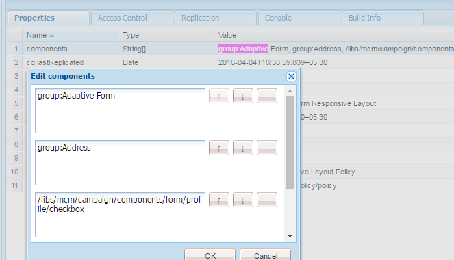

# Exibição de componentes com base no modelo usado{#displaying-components-based-on-the-template-used}

Quando um autor de formulário cria um formulário adaptável usando uma [modelo](../../forms/using/template-editor.md), o autor do formulário pode ver e usar componentes específicos com base na política do modelo. Você pode especificar uma política de conteúdo de modelo que permita escolher um grupo de componentes que o autor do formulário vê no momento da criação do formulário.

## Alteração da política de conteúdo de um modelo {#changing-the-content-policy-of-a-template}

Ao criar um modelo, ele é criado em `/conf` no repositório de conteúdo. Com base nas pastas criadas no `/conf` diretório, o caminho para o modelo é: `/conf/<your-folder>/settings/wcm/templates/<your-template>`.

Execute as seguintes etapas para mostrar os componentes na barra lateral com base na política de conteúdo de um modelo:

1. Abra o CRXDE lite.\
   URL: `https://<server>:<port>/crx/de/index.jsp`
1. No CRXDE, navegue até a pasta em que o modelo é criado.

   Por exemplo: `/conf/<your-folder>/`

1. No CRXDE, acesse: `/conf/<your-folder>/settings/wcm/policies/fd/af/layouts/gridFluidLayout/`

   Para selecionar um grupo de componentes, é necessária uma nova política de conteúdo. Para criar uma política, copie e cole a política padrão e renomeie-a.

   O caminho para a política de conteúdo padrão é: `/conf/<your-folder>/settings/wcm/policies/fd/af/layouts/gridFluidLayout/default`

   No `gridFluidLayout` , copie e cole a política padrão e renomeie-a. Por exemplo, `myPolicy`.

   

1. Selecione a nova política que você criar e selecione o **componentes** propriedade no painel direito com tipo `string[]`.

   Ao selecionar e abrir a propriedade componentes, você verá a caixa de diálogo Editar componentes. A caixa de diálogo Editar componentes permite adicionar ou remover grupos de componentes usando o **+** e **-** botões. Você pode adicionar grupos de componentes que incluem componentes que o formulário deseja que os autores usem.

   

   Depois de adicionar um grupo de componentes, clique em **OK** para atualizar a lista e clique em **Salvar tudo** acima da barra de endereços CRXDE e atualize.

1. No modelo, altere a política de conteúdo padrão para a nova política criada. ( `myPolicy` neste exemplo.)

   Para alterar a política, no CRXDE, acesse `/conf/<your-folder>/settings/wcm/templates/<your-template>/policies/jcr:content/guideContainer/rootPanel/items`.

   No `cq:policy` propriedade, alterar `default` ao novo nome da política ( `myPolicy`).

   

   Ao criar um formulário usando o modelo, você pode ver os componentes adicionados na barra lateral.
