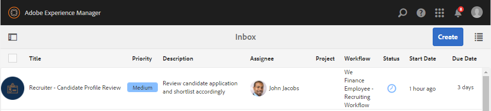
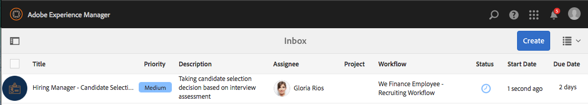
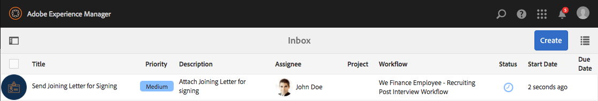
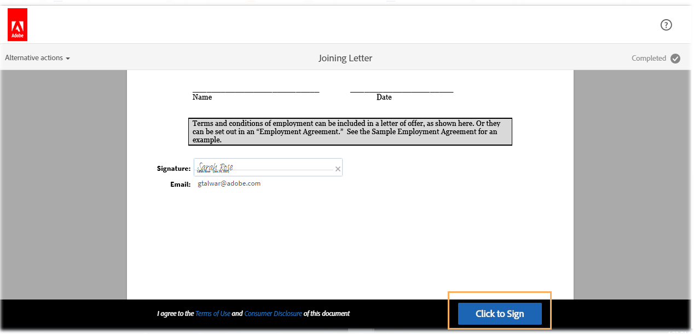

# Apresentação do site de referência de recrutamento de funcionários {#employee-recruitment-reference-site-walkthrough}

## Visão geral {#overview}

We.Finance é uma organização que permite que os candidatos se candidatem ao emprego por meio do portal do site de referência. A organização também usa o portal para gerenciar o agendamento de entrevistas, a pré-listagem e a comunicação interna dos candidatos. O site gerencia o seguinte:

* Candidatos que procuram e se candidatam a empregos
* Rastreio e pré-seleção dos candidatos
* Processo de entrevista
* Recolha dos dados relativos aos candidatos
* Verificação em segundo plano do candidato
* Ofertas de implantação para candidatos selecionados

>[!NOTE]
>
>Os casos de uso de recrutamento de funcionários estão disponíveis nos sites de referência We.Finance e We.Gov. Os exemplos, imagens e descrições usados nas orientações usam o site de referência We.Finance. No entanto, você pode executar esses casos de uso e revisar artefatos usando We.Gov também. Para fazer isso, substitua **we-finance** por **we-gov** nos URLs mencionados.

### Modelos de fluxo de trabalho envolvidos {#workflow-models-involved}

O caso de uso de recrutamento de funcionários envolve dois workflows:

* Antes da entrevista - Fluxo de trabalho de Recrutamento de Funcionário do We Finance
* Após a entrevista - Fluxo de trabalho da Pós-entrevista para Recrutamento de Funcionário Financeiro

Esses workflows são criados em AEM e podem ser encontrados em:

`https://[authorHost]:[authorPort]/libs/cq/workflow/admin/console/content/models.html/etc/workflow/models/`

#### Fluxo de trabalho de Recrutamento de Funcionário Financeiro {#we-finance-employee-recruiting-workflow}

Veja a seguir o modelo do fluxo de trabalho de Recrutamento de Funcionário do We Finance seguido neste documento.

#### Nós financiamos o fluxo de trabalho de Recrutamento de Funcionário Após Entrevista {#we-finance-employee-recruiting-post-interview-workflow}

Este é o modelo do fluxo de trabalho de Recrutamento de Post Entrevista de Funcionário do We Finance seguido neste documento.

### Personas {#personas}

O cenário envolve as seguintes personas:

* Sarah Rose, candidata a emprego na organização
* John Jacobs, o recrutador
* Gloria Rios, gerente de contratação
* John Doe, o cara do HR

## Sarah se inscreve para um emprego {#sarah-applies-for-a-job}

Sarah Rose está procurando uma oportunidade de emprego na organização. Ela visita seu portal na web e explora as vagas de emprego listadas na página Carreira. Ela encontra uma lista de empregos correspondente e se candidata a ela.

Home page We.Finance

Página de carreira do We.Finance

Sarah clica em Aplicar em uma publicação de trabalho. O formulário de solicitação de emprego é aberto. A recorrente preenche todos os detalhes da petição e submete-a.

### Como funciona {#how-it-works}

O home page We.Finance e a página de carreira são páginas do AEM Sites. A página de carreira incorpora um formulário adaptável, que usa um painel repetível para buscar as aberturas de emprego usando um serviço e as lista na página. Você pode consultar o formulário adaptável em `https://[authorHost]:[authorPort]/editor.html/content/forms/af/we-finance/employee/recruitment/jobs.html`.

### Veja você mesmo {#see-it-yourself}

Vá para `https://[publishHost]:[publishPort]/content/we-finance/global/en.html` e clique em **[!UICONTROL Carreira]**. Clique em **[!UICONTROL Pesquisar]** para preencher a lista de trabalho e clique em **[!UICONTROL Aplicar]** para um trabalho. Preencha os detalhes no formulário e envie o pedido.

Certifique-se de especificar uma ID de email válida no aplicativo, pois qualquer comunicação por meio dessa apresentação será enviada para a ID de email especificada.

## John Jacobs lista o perfil de Sarah Rose para o exame do gerente de contratação {#john-jacobs-shortlists-sarah-rose-s-profile-for-the-hiring-manager-s-screening}

A organização recebe o pedido de emprego enviado pela Sarah. John Jacobs, um recrutador, recebe a tarefa para rever o perfil da Sarah. Ele revisa a tarefa em sua Caixa de entrada de AEM, encontra o perfil que corresponde ao requisito de trabalho e clica em Lista de atalhos. O perfil de Sarah é encaminhado para Gloria Rios, a gerente de contratação, para sua aprovação.

Caixa de entrada de AEM do John

John Jacobs lista o perfil de Sarah Rose para o exame do gerente de contratação

**Como funciona**

A ação de envio no formulário de solicitação de emprego aciona um fluxo de trabalho que cria uma tarefa na caixa de entrada de John Jacob para filtrar o aplicativo. Quando John, revisa e lista o aplicativo, o fluxo de trabalho cria uma tarefa na caixa de entrada da Gloria.

### Veja você mesmo {#see-it-yourself-1}

Acesse `https://[publishHost]:[publishPort]/content/we-finance/global/en/login.html?resource=/aem/inbox.html`e faça logon usando jjacobs/password como nome de usuário/senha para John Jacobs. Abra a tarefa de Revisão de Perfil do Candidato e liste o candidato como um atalho.

## Gloria revê o pedido e aprova a recorrente para uma entrevista {#gloria-reviews-the-application-and-approves-the-applicant-for-an-interview}

Gloria, gerente de contratação, recebe o perfil da lista como tarefa em sua Caixa de entrada AEM. Ela revisa e aprova a candidata, Sarah Rose, para a entrevista.

Caixa de entrada AEM Gloria

Gloria aprova Sarah Rose para entrevista

**Como funciona**

Quando Gloria aprova o candidato para uma entrevista, o fluxo de trabalho cria uma tarefa na Caixa de entrada AEM de John Doe, que é um recrutador para We.Finance.

### Veja você mesmo {#see-it-yourself-2}

Vá para `https://[publishHost]:[publishPort]/content/we-finance/global/en/login.html?resource=/aem/inbox.html` e faça logon usando jjacobs/password como nome de usuário/senha para John Jacobs. Abra a tarefa de Revisão de Perfil do Candidato e liste o candidato como um atalho.

Acesse `https://[publishHost]:[publishPort]/content/we-finance/global/en/login.html?resource=/aem/inbox.html` e faça logon usando grios/password como nome de usuário/senha para Gloria Rios. Abra a tarefa de Revisão de Perfil do Candidato e clique em Agendar entrevista.

## John Doe agenda uma entrevista {#john-doe-schedules-an-interview}

John Doe recebe a tarefa de agendar uma entrevista em sua caixa de entrada. John Doe seleciona e abre a tarefa e fixa a data e hora da entrevista, o local e a pessoa HR responsável pela entrevista como John Jacob. John Doe clica em Enviar e-mail de convite. Um e-mail é enviado para Sarah e uma tarefa é atribuída a Gloria, a gerente de contratação, para entrevistar Sarah.

Caixa de entrada AEM de John Doe

John Doe agenda a entrevista e envia os detalhes para Sarah Rose

## Sarah Rose recebe o email com o cronograma de entrevistas {#sarah-rose-receives-the-email-with-interview-schedule}

Sarah Rose recebe o email com agendamento de entrevista, local e outros detalhes. Ela clica em Aceitar para significar que está bem com o horário e local da entrevista. Como guiada pela informação precisa, Sarah chega às entrevistas.

Sarah Rose recebe o cronograma da entrevista

## Depois das entrevistas, a Gerente de Contratação lista Sarah Rose {#after-the-interviews-the-hiring-manager-shortlists-sarah-rose}

Depois que Sarah Rose passar pelas entrevistas e limpá-las, Gloria Rios, a Gerente de Contratação, abre a tarefa Seleção de Candidatos de sua caixa de entrada e clica em Selecionar. A decisão de Gloria Rios é transmitida ao HR, John Doe, para posterior processamento.

Caixa de entrada AEM Gloria

Gloria Rios seleciona Sarah Rose depois das entrevistas

## John Doe solicita mais informações {#john-doe-requests-more-information}

Antes de pedir a um candidato que se junte à organização, é necessário verificar o seu passado. John Doe abre e revisa os detalhes da candidata selecionada e descobre que alguns de seus detalhes de emprego e educação ainda não estão preenchidos. Os cliques de John Doe Precisam De Mais Informação.

 

John Doe solicita mais informações de Sarah Rose sobre sua formação e experiência de trabalho

## Sarah Rose recebe um email solicitando mais informações {#sarah-rose-receives-an-email-requesting-further-information}

Sarah Rose recebe um e-mail notificando-a de que são necessárias mais informações para processar seu pedido de emprego. O email inclui um link para o formulário para preencher as informações necessárias.

Sarah Rose recebe um e-mail notificando que informações adicionais são necessárias para o processamento de seu pedido de emprego

Sarah clica no link Fornecer detalhes no email. Um formulário é exibido. Sarah preenche os detalhes de educação e emprego necessários, conforme solicitado por John Doe e clica em Enviar.

Sarah abre o formulário de informações adicionais clicando no link no e-mail

Sarah preenche informações adicionais conforme solicitado por John Doe e clica em Enviar

## John Doe analisa o perfil candidato selecionado para obter as informações adicionais fornecidas {#john-doe-reviews-the-selected-candidate-profile-for-the-additional-information-provided}

John Doe seleciona a solicitação de revisão do candidato e a abre. John Doe acha que Sarah encheu toda a informação conforme necessário. Depois de revisar o aplicativo, John Doe clica em Aprovar. Com a aprovação de John Doe, o pedido para fazer uma verificação de antecedentes de Sarah Rose é encaminhado para John Jacobs.

Caixa de entrada de AEM de John Doe

John Doe revisa as informações adicionais fornecidas por Sarah e as aprova

## John Jacobs recebe um pedido de verificação de antecedentes {#john-jacobs-receives-a-background-check-request}

John Jacobs vê a solicitação de verificação de fundo em sua caixa de entrada. John Jacobs abre a tarefa e revisa as informações fornecidas por Sarah Rose. Depois de fazer uma verificação em segundo plano, John Jacobs clica em Avançar para indicar que a verificação em segundo plano foi bem-sucedida.

Caixa AEM de entrada de John Jacobs

Depois de fazer a verificação de fundo, John Jacobs clica em Avançar

## John Doe envia a carta de junção para Sarah Rose {#john-doe-sends-out-the-joining-letter-to-sarah-rose}

John Doe recebe uma solicitação em sua caixa de entrada AEM para enviar a carta de entrada. John abre a solicitação e visualização os detalhes. John Doe anexa a carta de junção PDF e clica em Anexar e enviar carta de junção.

Caixa de entrada AEM de John Doe

John Doe envia a carta de entrada para assinatura

## Sarah Rose recebe e assina a carta de junção {#sarah-rose-receives-and-signs-the-joining-letter}

Sarah Rose recebe a carta de entrada por assinatura. Sarah clica Em Clique Aqui Para Rever E Assinar A Carta De Aderência. A letra de junção PDF é aberta com um campo para assinar o documento.

Sarah Rose recebe a carta de entrada por assinar

Sarah pode escolher digitar, usar o recurso de desenhar à mão, inserir uma imagem de assinatura ou usar a tela sensível ao toque de seu celular para desenhar sua assinatura. Sarah digita o nome, clica em Clicar para assinar e descarrega a cópia assinada da carta de junção.

Sarah digita em seu nome para assinar a carta de entrada

Sarah clica em Clicar para assinar para concluir a assinatura da carta de junção

