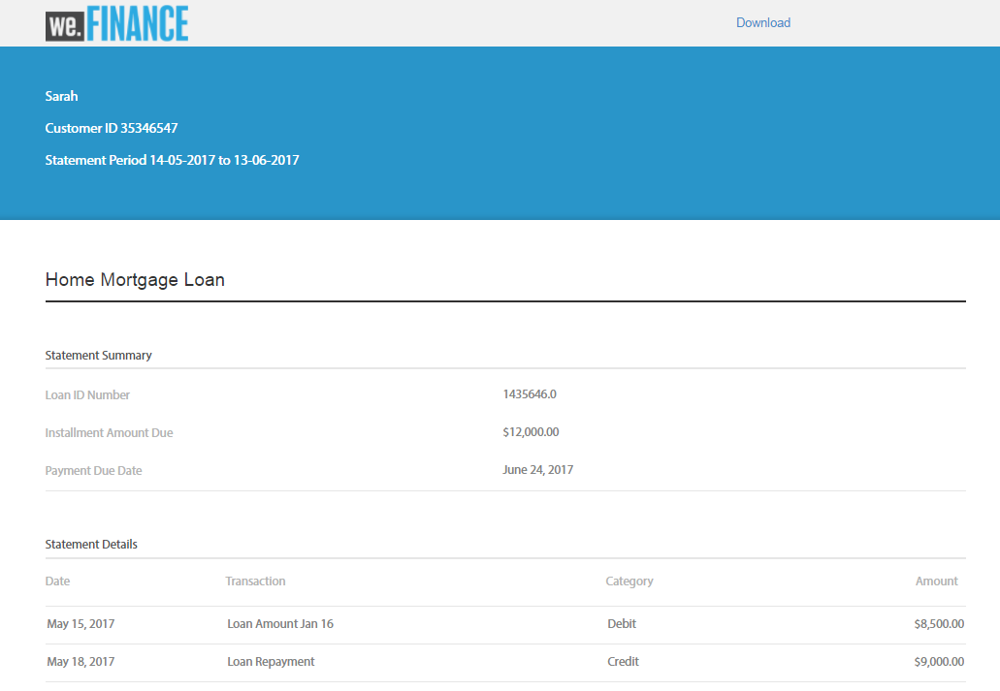
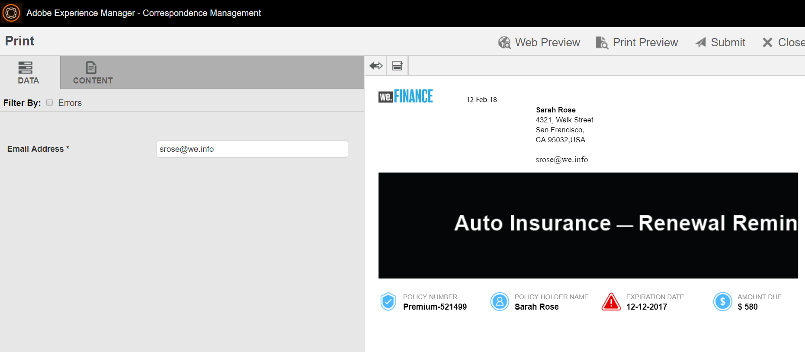

# Apresentação do site de referência do We.Finance{#we-finance-reference-site-walkthrough}

## Pré-requisitos {#pre-requisites}

Configure os sites de referência conforme descrito em [Configurar e configurar os sites](../../forms/using/setup-reference-sites.md)de referência do AEM Forms.

## Cenários do site de referência do We.Finance {#we-finance-reference-site-scenarios}

We.Finance é uma organização líder no domínio de Serviços Financeiros que oferta soluções financeiras abrangentes e personalizadas para atender às necessidades de diversos perfis de clientes. Eles ofertas cartões de crédito, hipotecas domésticas e serviços de seguros domésticos.

O seu objetivo é alcançar os clientes atuais e potenciais no dispositivo que lhes for preferido, explicar os benefícios dos seus serviços e ajudá-los a se inscreverem nos seus serviços. Além disso, eles estão procurando produtos financeiros como placas adicionais que os clientes possam achar interessantes.

Leia para obter orientações detalhadas de casos de uso do We.Finance e saiba como o AEM Forms ajuda as organizações financeiras a atingir seus objetivos. As seguintes orientações são abordadas:

* [Passagem do aplicativo de cartão de crédito](#credit-card-application-walkthrough)
* [Apresentação do pedido de hipoteca em casa](#home-mortgage-application-walkthrough)
* [Apresentação do aplicativo Home Mortgage com o Microsoft Dynamics](#home-mortgage-application-walkthrough-with-microsoft-dynamics)
* [Apresentação da aplicação de seguro doméstico](#home-insurance-application-walkthrough)
* [Apresentação do gerenciamento de riqueza](#wealthmanagementwalkthrough)
* [Apresentação da aplicação de seguro automático](#autoinsuranceapplicationwalkthrough)

## Passagem do aplicativo de cartão de crédito {#credit-card-application-walkthrough}

O cenário do aplicativo de cartão de crédito We.Finance envolve as seguintes pessoas:

* Sarah Rose, uma cliente We.Finance
* Gloria Rios, Chefe do Cartão de Crédito e da Hipoteca, We.Finance

O infográfico a seguir descreve o fluxo de trabalho passo a passo do aplicativo de cartão de crédito.

Analisemos detalhadamente o cenário do site de referência para entender como o AEM Forms ajuda o We.Finance a atingir seus objetivos.

### Sarah recebe um boletim informativo do We.Finance e se inscreve para um cartão de crédito {#sarah-receives-a-newsletter-from-we-finance-and-applies-for-a-credit-card}

Sarah Rose é uma cliente existente do We.Finance. Ela recebe uma newsletter da We.Finance sobre novos cartões de crédito na oferta. Ela acha as ofertas empolgantes e decide se candidatar a um cartão de crédito. Ela clica no botão Aplicar agora na newsletter, que a leva para o aplicativo de cartão de crédito no portal We.Finance.

#### Como funciona {#how-it-works}

A newsletter enviada à Sarah é uma implementação personalizada que aciona um email para a ID de email especificada. O botão Aplicar agora no email está vinculado ao aplicativo de cartão de crédito, que é um formulário adaptável em uma instância de publicação.

#### Veja você mesmo {#see-it-yourself}

Abra o URL a seguir na instância de publicação para disparar um email de newsletter. Certifique-se de substituir `[emailID]` por uma conta de email válida para receber o boletim informativo. Abra o boletim informativo e clique em **[!UICONTROL Aplicar agora]** para acessar o aplicativo de cartão de crédito.

`https://[publishServer]:[publsihPort]/content/campaigns/we-finance/start.html?app=cc&email=[emailID]&givenName=Sarah&familyName=Rose`

### Sarah acha a oferta interessante e escolhe aplicar {#sarah-finds-the-offer-interesting-and-chooses-to-apply}

Sarah decide se inscrever no cartão de crédito e toca no botão **Aplicar agora** no email. Leva a Sarah ao aplicativo de cartão de crédito no portal We.Finance. O formulário de aplicativo é organizado em seções usando um layout de cartão.

Sarah seleciona um cartão de crédito das opções disponíveis e clica em **[!UICONTROL Continuar]**.

Na página Informações pessoais, conforme Sarah fornece o Número de seguridade social, ela recebe um prompt para fazer logon com suas credenciais.

Sarah é uma cliente existente do We.Finance. Ela faz logon com suas credenciais de conta We.Finance e seus detalhes pessoais são preenchidos automaticamente no formulário. Sarah continua preenchendo o formulário de inscrição e é quando um lembrete aparece para uma reunião em que ela deve participar. Ela clica em **[!UICONTROL Salvar meu progresso]** no formulário do aplicativo. Salva todas as informações que Sarah preencheu até agora e uma caixa de diálogo será exibida para confirmar se ela gostaria de receber um email com um link para o seu rascunho de aplicativo para ser concluída posteriormente.

Sarah clica em **[!UICONTROL Enviar e-mail]**. Ela recebe um e-mail com um link para retomar seu aplicativo de cartão de crédito.

**Sarah acessa o aplicativo de cartão de crédito de seu dispositivo móvel**

Se Sarah estiver acessando o aplicativo de cartão de crédito de seu dispositivo móvel, o aplicativo responsivo será aberto em uma visualização otimizada para dispositivos móveis. Nessa visualização, o formulário de aplicativo é renderizado como uma seção de cada vez. Permite que Sarah faça visualizações e forneça informações progressivamente enquanto ela navega no aplicativo.

**Como funciona**

O botão **Aplicar agora** direciona Sarah para o aplicativo de cartão de crédito. O aplicativo é um formulário adaptável, que pode ser visto nas instâncias de criação em `https://[host]:'port'/editor.html/content/forms/af/we-finance/cc-app.html`.

Alguns dos principais recursos que você pode revisar no formulário adaptável são:

* É baseado em um schema XSD.
* Ele foi criado usando o Tema A do We Finance para estilização e o modelo We.Finance para o layout. Além disso, ele usa Layout sem títulos de painel no layout do cabeçalho do formulário para navegação móvel. Ele exibe um layout móvel progressivo quando aberto a partir de um dispositivo móvel. Você pode revisar o modelo em `https://[host]:'port'/libs/wcm/core/content/sites/templates.html/conf/we-finance` e o tema em `https://[host]:'port'/editor.html/content/dam/formsanddocuments-themes/we-finance/we-finance-theme-a/jcr:content`.
* Ele inclui regras de formulário adaptáveis para chamar os serviços de Modelo de dados de formulário para preencher previamente os detalhes do usuário conectado. Ele também chama os serviços para preencher antecipadamente as informações por número de segurança social ou endereço de email fornecido no formulário. Você pode revisar os Modelos de dados de formulário e seus serviços em `https://[host]:'port'/aem/forms.html/content/dam/formsanddocuments-fdm`.
* Ele usa vários componentes de formulário adaptáveis para capturar entradas e adaptá-las às respostas do usuário. Ele também usa componentes como Email que suportam tipos de entrada HTML5.
* Ele usa o componente Etapa de assinatura para exibir o formulário preenchido e permite a assinatura eletrônica no formulário.
* O botão Salvar meu progresso gera uma ID exclusiva para o usuário e salva o aplicativo parcialmente preenchido como um rascunho em um nó no repositório do AEM. Além disso, exibe uma caixa de diálogo solicitando permissão para enviar um email com um link para o nó que contém o aplicativo de rascunho. O botão Enviar e-mail na caixa de diálogo de confirmação aciona um e-mail com um link para o nó que contém o rascunho.
* Ele usa a ação de envio Chamar fluxo de trabalho do AEM para acionar o fluxo de trabalho de aprovação do cartão de crédito. Você pode revisar o fluxo de trabalho usado neste formulário em `https://[host]:'port'/editor.html/conf/global/settings/workflow/models/we-finance-credit-card-workflow.html`

É recomendável revisar o formulário para entender o schema, os componentes, as regras, os Modelos de dados do formulário, o fluxo de trabalho dos formulários e a ação de envio usada para criar o formulário.

Consulte também a documentação a seguir para obter mais informações sobre os recursos usados no formulário adaptável do aplicativo de cartão de crédito:

* [Introdução à criação de formulários adaptativos](../../forms/using/introduction-forms-authoring.md)
* [Criação de formulários adaptáveis usando o Schema XML](../../forms/using/adaptive-form-xml-schema-form-model.md)
* [Editor de regras](../../forms/using/rule-editor.md)
* [Temas](../../forms/using/themes.md)
* [Integração de dados](../../forms/using/data-integration.md)
* [Uso do Adobe Sign em formulários adaptáveis](../../forms/using/working-with-adobe-sign.md)
* [Fluxo de trabalho centrado em formulários no OSGi](../../forms/using/aem-forms-workflow.md)

**Veja você mesmo**

Quando conectado como Sarah Rose, clique no botão **Aplicar agora** no aplicativo de cartão de crédito. Preencha alguns detalhes, explore vários componentes de formulário adaptáveis e clique em **Salvar meu progresso** para receber um email com um botão **Retomar** que se vincula ao aplicativo de rascunho. Certifique-se de especificar sua ID de email no formulário do aplicativo para receber o email.

Revise o Tema We.Finance disponível em:

`https://<host>:<AuthorPort>/editor.html/content/dam/formsanddocuments-themes/we-Finance/we-Finance-Theme-A/jcr:content`

Você pode revisar o Modelo We.Finance em:

`https://<host>:<AuthorPort>/editor.html/conf/we-finance/settings/wcm/templates/we-finance-template/structure.html`

### Sarah retoma e submete a candidatura {#sarah-resumes-and-submits-the-application}

Sarah volta mais tarde e encontra um email do We.Finance. Ela clica no botão **Retomar** no e-mail que a leva até o rascunho do cartão de crédito. As informações que ela preencheu anteriormente vêm pré-preenchidas. Preenche o formulário de candidatura restante, assina o pedido e submete-o.

Como alternativa, ela pode acessar seu rascunho de aplicativo em **Meus formulários** no home page We.Finance.

#### Como funciona {#how-it-works-1}

O botão Retomar no email redireciona a Sarah para o nó que contém o aplicativo de rascunho.

#### Veja você mesmo {#see-it-yourself-1}

Você deve ter recebido um e-mail com um link para o aplicativo de rascunho na sua ID de e-mail especificada ao preencher o formulário de aplicativo. Vá em frente, preencha as seções restantes no aplicativo e envie-o.

### We.Finance recebe e aprova a aplicação {#approving-the-application}

We.Finance recebe o pedido de cartão de crédito enviado pela Sarah. Uma tarefa é atribuída a Gloria Rios. Ela revisa a tarefa em sua Caixa de entrada do AEM e a aprova.

#### Como funciona {#how-it-works-2}

Quando Sarah preenche e envia o aplicativo de cartão de crédito, um Fluxo de trabalho do Forms é acionado e uma tarefa é criada na caixa de entrada do AEM de Gloria.

O AEM Forms no OSGi fornece workflows centrados em formulários que permitem a criação de workflows adaptáveis baseados em formulários. Esses workflows podem ser usados para revisão e aprovações, fluxos de processos de negócios, para serviços de documentos de start, integração com o fluxo de trabalho de assinatura do Adobe Sign e assim por diante. Para obter mais informações, consulte Fluxo de trabalho centrado em [formulários no OSGi](../../forms/using/aem-forms-workflow.md).

A imagem a seguir descreve o fluxo de trabalho do AEM que processa o aplicativo de cartão de crédito e gera uma saída PDF do aplicativo.

#### Veja você mesmo {#see-it-yourself-2}

Você pode acessar a caixa de entrada do AEM para o site we.finance em https://&lt;nome do *host*>:&lt;*PublishPort*>/content/we-finance/global/en.html. Na página, toque em **Fazer logon**, marque a caixa de seleção **Fazer logon como representante** , faça logon na caixa de entrada do AEM usando `grios/password` como nome de usuário/senha para Gloria Rios e aprove o aplicativo de cartão de crédito. Para obter informações sobre como usar a Caixa de entrada do AEM para tarefas de fluxo de trabalho centradas em formulários, consulte [Gerenciar aplicativos de formulários e tarefas na Caixa de entrada](../../forms/using/manage-applications-inbox.md)do AEM.

Quando você aprova o aplicativo, Sarah recebe um email com o kit de boas-vindas.

### Sarah recebe o kit de boas-vindas e se aplica a um cartão complementar {#sarah-receives-the-welcome-kit-and-applies-for-an-add-on-card}

À medida que o aplicativo de cartão de crédito da Sarah é aprovado, ela recebe um email com um link para o kit de boas-vindas. Ela abre o kit de boas-vindas, que inclui os detalhes da conta do cartão de crédito. O kit de boas-vindas também exibe ofertas promocionais personalizadas para Sarah. Conforme ela rola para baixo, o kit de boas-vindas contém um formulário incorporado para solicitar um cartão complementar. Sarah rapidamente preencheu os detalhes necessários no kit de boas-vindas e se inscreveu no cartão complementar. Uma caixa de diálogo de confirmação para o aplicativo de cartão complementar é exibida.

O kit de boas-vindas é personalizado para Sarah e mostra informações relevantes para ela. Ele oferece a ela a opção de baixar uma versão em PDF do kit de boas-vindas.

O kit de boas-vindas inclui outro formulário de aplicativo que Sarah pode preencher e enviar para solicitar um cartão complementar de dentro do kit de boas-vindas sem visitar o portal We.Finance.

#### Como funciona {#how-it-works-3}

O kit de boas-vindas é uma comunicação interativa incluída no `cq-we-finance-content-pkg.zip` pacote. Os cartões interativos na versão para desktop para mostrar os benefícios do cartão de crédito no kit de boas-vindas são um layout personalizado criado usando o layout padrão do cartão de um fragmento de documento.

O aplicativo de placa complementar é um formulário adaptável incorporado na comunicação interativa do kit de boas-vindas.

#### Veja você mesmo {#see-it-yourself-3}

Clique no botão Retomar no email recebido na etapa anterior. Abre o rascunho do pedido. Preencha todos os detalhes e envie o pedido. Você receberá então um kit de boas-vindas. Revise o kit de boas-vindas.

Você também pode visualização o kit de boas-vindas no seguinte URL:

https://&lt;*host*> : &lt;*port*>/content/aemforms-refsite/doclink.html?documento=/content/forms/af/we-finance/credit-card/creditcardwelcomekit&amp;customerId=197&amp;canal=web

Você pode acessá-lo nas instâncias de autor e publicação.

### Sarah recebe um cartão de crédito {#sarah-receives-a-credit-card-statement}

À medida que Sarah começa a usar o cartão de crédito, ela recebe outro email do We.Finance que inclui sua declaração de cartão de crédito. As imagens a seguir mostram o email com um link para a declaração do cartão de crédito em dispositivos móveis.

Sarah clica em Declaração de Visualização no e-mail para visualização da declaração do cartão de crédito. A declaração é uma comunicação interativa. Ele tem versões de Web e Impressão (PDF). A declaração integra-se ao Forms Data Model para recuperar dados específicos do cliente do banco de dados. A declaração interativa constitui vários elementos:

* Resumo do demonstrativo
* Relatório detalhado de despesas
* análise de despesas gráficas
* Opção para fazer um pagamento pela quantia devida dentro do demonstrativo
* Download do recibo de pagamento

Sarah não precisa acessar o portal ou procurar por e-mails a versão PDF da declaração do cartão de crédito para arquivamento offline. Ela simplesmente clica no Download Statement para baixar uma versão PDF da declaração.

A declaração detalhada é apresentada em uma tabela responsiva. O demonstrativo também fornece a opção de pagar uma parte ou a quantia total devida dentro do demonstrativo.

Sarah agendou pagamento de dentro do extrato. Sarah também pode usar a opção Pagamento Flexi para dividir o pagamento em partes iguais.

#### Como funciona {#how-it-works-4}

A declaração do cartão de crédito é uma comunicação interativa. A tabela de despesas detalhada na declaração é uma tabela responsiva. O gráfico para a análise de despesas é um componente de gráfico, que lê a tabela de despesas e gera o gráfico de pizza.

#### Veja você mesmo {#see-it-yourself-4}

Você pode revisar a declaração de cartão de crédito interativo no seguinte URL:

https://&lt;nome do *host*>:&lt;*porta*>/content/aemforms-refsite/doclink.html?documento=/content/forms/af/we-finance/credit-card/credit-card-Statement&amp;customerId=197&amp;canal=web

Você pode acessá-lo nas instâncias de autor e publicação.

O demonstrativo do cartão de crédito exibe ofertas promocionais no final do demonstrativo. Você pode integrar o Público alvo da Adobe com o AEM Forms Interative Communication para fornecer ofertas promocionais direcionadas com base em segmentos específicos do cliente. Para configurar sua comunicação interativa para usar o Público alvo da Adobe para ofertas personalizadas e direcionadas, consulte [criar experiências](/help/forms/using/experience-targeting-forms.md)direcionadas.

### We.Finance analisa o desempenho do aplicativo de cartão de crédito {#we-finance-analyzes-the-performance-of-the-credit-card-application}

A We.Finance, de tempos em tempos, analisa o desempenho de seus aplicativos de cartão de crédito para verificar se os clientes estão enfrentando problemas. Eles usam essa análise para tomar decisões informadas sobre as alterações necessárias na aplicação do cartão de crédito para melhorar a experiência do usuário, reduzir a taxa de abandono de formulários e, assim, melhorar a conversão. Eles aproveitam a integração do AEM Forms com o Adobe Analytics para sua análise. A imagem a seguir descreve o painel de análise.

Para obter mais informações sobre como interpretar o painel do Analytics, consulte [Visualização e compreensão dos relatórios](../../forms/using/view-understand-aem-forms-analytics-reports.md)de análise do AEM Forms.

#### Como funciona {#how-it-works-5}

As métricas de desempenho do formulário de aplicativo de cartão de crédito são rastreadas com o Adobe Analytics. Para obter mais informações sobre como configurar o Adobe Analytics e exibir relatórios, consulte [Configurar análises para formulários e documentos](../../forms/using/configure-analytics-forms-documents.md).

#### Veja você mesmo {#see-it-yourself-br}

Para que você possa visualização e explorar o relatório de análise, estamos fornecendo dados semente para o aplicativo de cartão de crédito no site de referência. Antes de usar dados semente, consulte [Configurar o Analytics](../../forms/using/setup-reference-sites.md#configureanalytics). Execute as seguintes etapas na instância do autor para visualização o relatório aos dados semente:

1. Vá para a interface do usuário do **Forms &amp; Documentos** em https://&lt;*nome do host*>:&lt;*AuthorPort*>/aem/forms.html/content/dam/formsanddocuments.

1. Clique para abrir a pasta **We.Finance** .
1. Selecione **Aplicativo para cartão** de crédito e, na barra de ferramentas, clique em **[!UICONTROL Ativar o Analytics]**.

1. Selecione o formulário adaptável novamente e clique em Relatório **** do Analytics na barra de ferramentas para gerar o relatório. Inicialmente, você verá um relatório em branco.

Para gerar um relatório de análise com dados semente:

1. No navegador de endereços da lista CRXDE, digite: `/apps/we-finance/demo-artifacts/analyticsTestData/Credit card Analytics Test Data`
1. Os dados de teste são selecionados na estrutura do diretório do lado esquerdo.
1. Duplo clique no arquivo selecionado para abrir seu conteúdo no painel direito.
1. Copie todo o conteúdo no arquivo de dados semente.
1. No CRXDE, navegue até: `/content/dam/formsanddocuments/we-finance/cc-app/jcr:content/analyticsdatanode/lastsevendays`
1. No campo **[!UICONTROL analytics data]** em **[!UICONTROL Propriedades]**, cole o conteúdo copiado do arquivo de dados semente.

1. Selecione **Aplicativo para cartão** de crédito e clique em Relatório **[!UICONTROL de]** análise na barra de ferramentas para gerar o relatório com dados semente.

**Teste A/B do pedido de cartão de crédito**

Além de analisar o desempenho do aplicativo de cartão de crédito e aprimorá-lo constantemente, o We.Finance aproveita a integração do AEM Forms com o Público alvo para criar testes A/B. Isso permite que eles atendam a diferentes experiências do formulário de aplicativo de cartão de crédito e identifiquem a experiência que causa melhor taxa de conversão em termos de preenchimento e envio do formulário.

Para configurar o Público alvo no servidor do AEM Forms, consulte [Configurar e integrar o Público alvo no AEM Forms](../../forms/using/ab-testing-adaptive-forms.md#set%20up%20and%20integrate%20target%20in%20aem%20forms).

Execute as seguintes etapas para experimentar a criação do teste A/B para o formulário de aplicativo de cartão de crédito We.Finance:

1. Vá para **Formulários e Documentos** em https://&lt;*nome do host*>:&lt;*AuthorPort*>/aem/forms.html/content/dam/formsanddocuments.

1. Clique para abrir a pasta **We.Finance** .
1. Selecione **Aplicativo para o formulário adaptável Cartão** de crédito.
1. Clique em **Mais** na barra de ferramentas e selecione **Configurar teste** A/B. A página Configurar teste A/B é aberta.

1. Especifique um nome de **Atividade**.
1. Na lista suspensa Audiência, selecione uma audiência para a qual deseja fornecer experiências diferentes do formulário. Por exemplo, **Visitantes Usando o Chrome**.
1. Nos campos **Distribuição** de experiência para as experiências A e B, especifique a distribuição, em termos de porcentagem, para determinar a distribuição de experiências entre a audiência total. Por exemplo, se você especificar 40, 60 para as experiências A e B, respectivamente, a experiência A será servida para 40% da audiência e os 60% restantes verão a experiência B.
1. Clique em **Configurar**. Uma caixa de diálogo é exibida para confirmar a criação do teste A/B.
1. Clique em **Concluído**.
1. Selecione o formulário **Aplicativo para Cartão** de Crédito e clique em **Editar**. Dá a opção de abrir uma das experiências. Clique em **Experiência B**. O formulário é aberto no modo de edição.

1. Modifique o formulário conforme desejado para criar uma experiência diferente da experiência padrão A.
1. Vá para a interface do usuário de formulários e Documentos, selecione o formulário, clique em **Mais** e selecione Teste **A/B** do Start.
1. Agora, abra o formulário no navegador do cromo várias vezes usando o seguinte URL:

   `https://&lt;*hostname*&gt;:&lt;*port*&gt;/content/dam/formsanddocuments/we-finance/cc-app/jcr:content?wcmmode=disabled`

   >[!NOTE] Observação: Remova o cookie com o nome **mbox** da persistência de cookies do navegador antes de abrir o formulário na próxima vez. As experiências A e B do formulário serão exibidas aleatoriamente.

1. Selecione o formulário, clique em **Mais** e clique em Relatório **de teste** A/B. Você não encontrará muitos dados no relatório, pois acabou de iniciar os testes. Agora, vamos fornecer alguns dados semente para ver a aparência do relatório de teste A/B.
1. Abra o CRXDE Lite e faça um backup do seguinte arquivo: /libs/fd/fmaddon/gui/components/admin/targetreport/clientlibs/targetreport/js/targetreport.js
1. Substitua a definição de função `onReportLoadSuccess` no arquivo mencionado acima pela definição de função no arquivo a seguir: /apps/we-finance/demo-artifacts/targetreport.js

   Observação: Essas mudanças são apenas para fins de demonstração. Certifique-se de restaurar o conteúdo do arquivo após concluir este procedimento.

1. Atualize o relatório gerado e você verá algo como o seguinte. Revise o painel do relatórios.

Para encerrar o teste A/B, clique no botão **Encerrar teste** A/B no painel do relatórios. No momento, uma caixa de diálogo solicita que você declare uma experiência. Escolha um vencedor e confirme para encerrar o teste A/B.

Se você escolher a experiência A como vencedora, o teste A/B será finalizado e, para frente, somente a Experiência A será fornecida a todas as audiências, incluindo as do Chrome.

## Apresentação do pedido de hipoteca em casa {#home-mortgage-application-walkthrough}

O cenário de hipoteca imobiliária We.Finance envolve as seguintes pessoas:

* Sarah Rose, uma cliente We.Finance
* Gloria Rios, Chefe do Cartão de Crédito e da Hipoteca, We.Finance
* John Doe, Representante do Atendimento ao Cliente, We.Finance

O infográfico a seguir descreve o fluxo de trabalho passo a passo de um aplicativo hipotecário residencial.

Agora vamos analisar detalhadamente as etapas no cenário do site de referência para ver como o AEM Forms ajuda a We.Finance a atingir seus objetivos.

### Sarah visita site We.Finance e se aplica a hipoteca domiciliar {#sarah-visits-we-finance-website-and-applies-for-home-mortgage}

Sarah Rose está planejando comprar uma casa e procurar planos de hipoteca. Ela é uma cliente We.Finance e, portanto, visita o portal We.Finance para explorar ofertas hipotecárias domésticas. Ela vai à seção Loans e encontra uma calculadora de hipotecas no portal. Ela preenche os detalhes e clica em Calcular minha hipoteca, que retorna um plano hipotecário.

 

Calculadora hipotecária

Resultado do calculador de hipotecas

#### Como funciona {#how-it-works-6}

A calculadora de hipotecas residencial na página Empréstimos é um formulário adaptado incorporado na página Sites do AEM. Você pode revisar a página Empréstimos no modo de edição em `https://[authorHost]:[authorPort]/editor.html/content/we-finance/global/en/loan-landing-page.html`.

A calculadora de hipotecas incorporada, que é uma forma adaptativa, utiliza regras para calcular o montante do IME com base nos detalhes do empréstimo fornecidos nos campos da calculadora. Você pode consultar o formulário adaptável em `https://[authorHost]:[authorPort]/editor.html/content/forms/af/we-finance/hm-calc.html`.

#### Veja você mesmo {#see-it-yourself-5}

Vá para o portal We.Finance em `https://<publishHost>:<publishPort>/content/we-finance/global/en.html` e clique em **[!UICONTROL Empréstimos]**. Forneça detalhes na calculadora de hipotecas e veja os resultados.

### Sarah acha a oferta interessante e escolhe aplicar {#sarah-finds-the-offer-interesting-and-chooses-to-apply-1}

Sarah opta por se candidatar à hipoteca domiciliar e clica em **[!UICONTROL Aplicar agora]** nos resultados da calculadora de hipoteca domiciliar. Abre-se o pedido de hipoteca.

Se Sarah estiver acessando o aplicativo hipotecário residencial a partir de seu dispositivo móvel, o formulário do aplicativo será aberto em uma visualização otimizada para exibição em um dispositivo móvel. Nessa visualização, o formulário do aplicativo renderiza uma seção de cada vez. Permite que Sarah faça visualizações e forneça informações progressivamente enquanto navega no formulário de inscrição.

As imagens a seguir mostram o fluxo de trabalho enquanto Sarah navega pelo aplicativo de hipoteca residencial em seu dispositivo móvel.

Se Sarah clicar em **Aplicar agora** em seu desktop, o formulário do aplicativo hipotecário será aberto da seguinte maneira. A informação fornecida pela Sarah na calculadora de hipotecas é pré-preenchida no formulário de candidatura. Sarah preenche os detalhes restantes e clica em **Continuar**.

Com base na informação que Sarah encheu na calculadora de hipotecas, ela recebeu alguns planos de hipoteca. Ela escolhe o plano que atende às suas necessidades e continua preenchendo a solicitação. Por fim, assina e submete a candidatura.

O pedido enviado vai para a We.Finance para aprovação.

#### Como funciona {#how-it-works-7}

O botão **Aplicar agora** direciona Sarah para o aplicativo de hipoteca. O aplicativo é um formulário adaptável, que pode ser visto nas instâncias de criação em `https://[host]:'port'/editor.html/content/forms/af/we-finance/hm-app.html`.

Alguns dos principais recursos que você pode revisar no formulário adaptável são:

* É baseado em um schema XSD, `homeMortgageApplication.xsd`.
* Ele foi criado usando o Tema B do We Finance para estilizar e o modelo We.Finance para o layout. Além disso, ele usa Layout sem títulos de painel no layout do cabeçalho do formulário para navegação móvel. Ele exibe um layout móvel progressivo quando aberto a partir de um dispositivo móvel. Você pode revisar o modelo e o tema usados no formulário adaptável nos seguintes locais na sua instância do autor de AEM:

   * `https://[host]:'port'/libs/wcm/core/content/sites/templates.html/conf/we-finance`
   * `https://[host]:'port'/editor.html/content/dam/formsanddocuments-themes/we-finance/we-finance-theme-b/jcr:content`

* A primeira guia, Introdução, no aplicativo é uma calculadora de hipoteca dinâmica que exibe opções com base na seleção do usuário. Por exemplo, os campos e valores são diferentes para opções de Compra e Refinanciamento. Essa funcionalidade é alcançada usando regras de mostrar. Além disso, quando você clica em Continuar e a guia Planos é inicializada, ela chama um serviço da Web configurado em um Modelo de dados de formulário para buscar e exibir planos de hipoteca. Você pode revisar os Modelos de dados de formulário e os serviços configurados em `https://[host]:'port'/aem/forms.html/content/dam/formsanddocuments-fdm`.
* Ele usa vários componentes de formulário adaptáveis para capturar entradas e adaptá-las às respostas do usuário. Ele também usa componentes como Email que suportam tipos de entrada HTML5.
* Ele usa o componente Etapa de assinatura para exibir o formulário preenchido e permite a assinatura eletrônica no formulário.
* Ele usa a ação de envio Chamar fluxo de trabalho do AEM para acionar o fluxo de trabalho do AEM de hipoteca inicial do We Finance. Você pode revisar o fluxo de trabalho usado neste formulário em `https://[host]:'port'/editor.html/conf/global/settings/workflow/models/we-finance-home-mortgage-workflow.html`

É recomendável revisar o formulário para entender o schema, os componentes, as regras, os Modelos de dados do formulário, o fluxo de trabalho dos formulários e a ação de envio usada para criar o formulário.

Consulte também a documentação a seguir para obter mais informações sobre os recursos usados no formulário adaptável do aplicativo hipotecário residencial:

* [Introdução à criação de formulários adaptativos](../../forms/using/introduction-forms-authoring.md)
* [Criação de formulários adaptáveis usando o Schema XML](../../forms/using/adaptive-form-xml-schema-form-model.md)
* [Editor de regras](../../forms/using/rule-editor.md)
* [Temas](../../forms/using/themes.md)
* [Integração de dados](../../forms/using/data-integration.md)
* [Uso do Adobe Sign em formulários adaptáveis](../../forms/using/working-with-adobe-sign.md)
* [Fluxo de trabalho centrado em formulários no OSGi](../../forms/using/aem-forms-workflow.md)

#### Veja você mesmo {#see-it-yourself-6}

Vá para `https://'[server]:[port]'/content/we-finance/global/en/all-forms.html` e clique no botão **Aplicar agora** em Aplicativo Hipotecário Inicial. Preencha os detalhes na guia Introdução, tente opções diferentes e envie o aplicativo.

Certifique-se de especificar uma ID de e-mail válida no aplicativo para receber um e-mail de confirmação na sua caixa de entrada.

### We.Finance recebe o aplicativo {#approving_the_application-1}

We.Finance recebe o pedido de hipoteca enviado pela Sarah. A tarefa de aprovação ou rejeição do pedido é atribuída à Gloria Rios. Ela revisa o aplicativo e descobre que a ID do governo de Sarah está faltando.

Gloria abre a tarefa e clica em Precisa de mais informações e faz um comentário sobre a falta de uma ID do governo.

A tarefa agora é atribuída a John Doe, um representante de atendimento ao cliente da We.Finance. Ele abre a tarefa e revisa o comentário de Gloria. Ele entra em contato com a Sarah e pede que ela envie uma cópia da sua identificação. Depois de receber uma cópia da ID de Sarah, ele a anexa à tarefa e submete o pedido de reavaliação.

A tarefa é reatribuída a Gloria. Ela revisa a ID anexada e aprova o aplicativo.

#### Como funciona {#how-it-works-8}

Quando Sarah preenche e envia o aplicativo de hipoteca residencial, um Fluxo de trabalho do Forms aciona e uma tarefa é criada na caixa de entrada do AEM de Gloria. À medida que Gloria revisa o aplicativo e pede mais informações, a tarefa é atribuída a John Doe. Quando John Doe anexa a ID e reenvia o aplicativo, ele é atribuído a Gloria. Isso é definido no fluxo de trabalho do AEM associado ao aplicativo de hipoteca.

O AEM Forms no OSGi fornece workflows centrados em formulários que permitem a criação de workflows adaptáveis baseados em formulários. Esses workflows podem ser usados para revisão e aprovações, fluxos de processos de negócios, para serviços de documentos de start, integração com o fluxo de trabalho de assinatura do Adobe Sign e assim por diante. Para obter mais informações, consulte Fluxo de trabalho centrado em [formulários no OSGi](../../forms/using/aem-forms-workflow.md).

A imagem a seguir descreve o fluxo de trabalho do AEM associado ao aplicativo de hipoteca.

#### Veja você mesmo {#see-it-yourself-7}

Você pode acessar a caixa de entrada do AEM em `https://<hostname>:<AuthorPort>/content/we-finance/global/en/login.html?resource=/aem/inbox.html`. Faça logon na caixa de entrada do AEM usando `grios/password` como nome de usuário/senha para Gloria Rios e `jdoe/jdoe` para John Doe, e explore o fluxo de trabalho do aplicativo hipotecário residencial.

Para obter informações sobre como usar a Caixa de entrada do AEM para tarefas de fluxo de trabalho centradas em formulários, consulte [Gerenciar aplicativos de formulários e tarefas na Caixa de entrada](../../forms/using/manage-applications-inbox.md)do AEM.

### Sarah recebe o kit de boas-vindas {#sarah-receives-the-welcome-kit}

À medida que o pedido de hipoteca da Sarah é aprovado, ela recebe um e-mail com um link para o kit de boas-vindas. Ela abre o kit de boas-vindas, que inclui um carrossel que exibe ofertas promocionais personalizadas para Sarah.

O kit de boas-vindas é personalizado para Sarah e mostra informações relevantes para ela. Ele oferece a ela a opção de baixar uma versão em PDF do kit de boas-vindas. O botão de seta na parte inferior permite que Sarah role para baixo e navegue por outras seções no kit de boas-vindas.

#### Como funciona {#how-it-works-9}

O kit de boas-vindas é uma comunicação interativa incluída no `cq-we-finance-content-pkg.zip` pacote. As ofertas promocionais no kit de boas-vindas são fornecidas pelo servidor do Público alvo da Adobe. As ofertas são personalizadas e direcionadas para segmentos específicos de clientes. O kit de boas-vindas obtém ofertas de um servidor de Públicos alvos da Adobe pré-configurado para um segmento audiência de clientes do sexo feminino.

Os cartões interativos na versão para desktop do kit de boas-vindas usam um layout personalizado criado usando o layout padrão do cartão de um fragmento de documento.

#### Veja você mesmo {#see-it-yourself-8}

Se você forneceu sua ID de e-mail ao preencher o aplicativo de hipoteca, você deve ter recebido um e-mail contendo um link para o kit de boas-vindas. Verifique sua caixa de entrada e reveja o kit de boas-vindas.

Você pode visualização-la na instância de publicação do AEM no seguinte URL:

`https://[host]:'port'/content/forms/af/we-finance/mortgage-loan-welcome-kit.html`

### Sarah recebe um extrato de conta {#sarah-receives-an-account-statement}

Como Sarah vale o empréstimo e os start pagam as prestações, ela recebe outro e-mail da We.Finance que inclui seu extrato de conta mensal.

Sarah clica em Declaração de Visualização no e-mail para visualização do extrato da conta de hipoteca. A declaração interativa constitui vários elementos:

* Resumo do demonstrativo
* Detalhes da declaração

A imagem a seguir mostra uma parte diferente do demonstrativo da conta na área de trabalho.

A declaração detalhada é apresentada em uma tabela responsiva e fornece a opção de pagar uma parte ou a totalidade do montante devido dentro da declaração.

#### Como funciona {#how-it-works-10}

A declaração hipotecária é uma comunicação interativa. É gerado usando o processo de agrupamento JSON. A tabela de despesas detalhada na declaração é uma tabela responsiva.

#### Veja você mesmo {#see-it-yourself-9}

Você pode revisar o demonstrativo da conta hipotecária interativa no seguinte URL:

https://&lt;nome *do host*>:&lt;*porta*>/content/forms/af/we-finance/mortgage-account-statement.html?wcmmode=disabled

Você pode acessá-lo nas instâncias de autor e publicação.

### We.Finance analisa o desempenho do aplicativo de hipoteca {#we-finance-analyzes-the-performance-of-the-mortgage-application}

A We.Finance, de tempos em tempos, analisa o desempenho do aplicativo de hipoteca para verificar se há problemas que os clientes possam estar enfrentando. Eles usam essa análise para tomar decisões informadas sobre as mudanças necessárias no aplicativo de hipoteca para melhorar a experiência do usuário, reduzir a taxa de abandono de formulários e, assim, melhorar a conversão. Eles aproveitam a integração do AEM Forms com o Adobe Analytics para sua análise. A imagem a seguir descreve o painel de análise.

Para obter mais informações sobre como interpretar o painel do Analytics, consulte [Visualização e compreensão dos relatórios](../../forms/using/view-understand-aem-forms-analytics-reports.md)de análise do AEM Forms.

#### Como funciona {#how-it-works-11}

As métricas de desempenho do formulário de aplicativo de hipoteca são rastreadas com o Adobe Analytics. Para obter mais informações sobre como configurar o Adobe Analytics e exibir relatórios, consulte [Configurar análises para formulários e documentos](../../forms/using/configure-analytics-forms-documents.md).

#### Veja você mesmo {#see-it-yourself-br-1}

Para que você possa visualização e explorar o relatório de análise, estamos fornecendo dados semente para o aplicativo de hipoteca no site de referência. Antes de usar dados semente, consulte [Configurar o Analytics](../../forms/using/setup-reference-sites.md#configureanalytics). Execute as seguintes etapas na instância do autor para visualização o relatório aos dados semente:

1. Vá para a interface do usuário do **Forms &amp; Documentos** em https://&lt;*nome do host*>:&lt;*AuthorPort*>/aem/forms.html/content/dam/formsanddocuments.

1. Clique para abrir a pasta **we-finance** .
1. Selecione **[!UICONTROL Aplicativo para o formulário]** adaptável do medidor inicial e, na barra de ferramentas, clique em **[!UICONTROL Ativar o Analytics]**.

1. Selecione o formulário novamente e clique em Relatório **** do Analytics na barra de ferramentas para gerar o relatório. Inicialmente, você verá um relatório em branco.

Para gerar um relatório de análise com dados semente:

1. No navegador de endereços da lista CRXDE, digite o seguinte: `/apps/we-finance/demo-artifacts/analyticsTestData/HomeMortgageAnalyticsTestData`
1. Os dados de teste são selecionados na estrutura do diretório do lado esquerdo.
1. Clique com o Duplo do mouse no arquivo selecionado para abrir seu conteúdo no painel direito.
1. Copie todo o conteúdo no arquivo de dados semente.
1. No CRXDE, navegue até: `/content/dam/formsanddocuments/we-finance/hm-app/jcr:content/analyticsdatanode/lastsevendays`
1. No campo analytics data em Propriedades, cole o conteúdo copiado do arquivo de dados semente.
1. Agora, gere o relatório analítico novamente para o Formulário de aplicativo Hipotecário Inicial. Você verá o relatório com dados semente.

**Teste A/B do pedido de hipoteca**

Além de analisar o desempenho do aplicativo hipotecário e aprimorá-lo constantemente, o We.Finance aproveita a integração do AEM Forms com o Público alvo para criar testes A/B. Isso permite que eles atendam a diferentes experiências do formulário de aplicativo e identifiquem a experiência que causa melhor taxa de conversão em termos de preenchimento e envio do formulário.

Para configurar o Público alvo no servidor do AEM Forms, consulte [Configurar e integrar o Público alvo no AEM Forms](../../forms/using/ab-testing-adaptive-forms.md#set%20up%20and%20integrate%20target%20in%20aem%20forms).

Execute as seguintes etapas na instância do autor para experimentar a criação do teste A/B para o formulário do aplicativo hipotecário We.Finance:

1. Vá para **Formulários e Documentos** em https://&lt;*nome do host*>:&lt;*AuthorPort*>/aem/forms.html/content/dam/formsanddocuments.

1. Clique para abrir a pasta **We.Finance** .
1. Selecione **Aplicativo para o formulário** adaptável do Hipotecário Inicial.
1. Clique em **Mais** na barra de ferramentas e selecione **Configurar teste** A/B. A página Configurar teste A/B é aberta.

1. Especifique um nome de **Atividade**.
1. Na lista suspensa Audiência, selecione uma audiência para a qual deseja fornecer experiências diferentes do formulário. Por exemplo, **Visitantes Usando o Chrome**.
1. Nos campos **Distribuição** de experiência para as experiências A e B, especifique a distribuição, em termos de porcentagem, para determinar a distribuição de experiências entre a audiência total. Por exemplo, se você especificar 40, 60 para as experiências A e B, respectivamente, a experiência A será servida para 40% da audiência e os 60% restantes verão a experiência B.
1. Clique em **Configurar**. Uma caixa de diálogo é exibida para confirmar a criação do teste A/B.
1. Clique em **Concluído**.
1. Selecione o formulário adaptável **Application for Home Mortgage** e clique em **Edit (Editar**). Dá a opção de abrir uma das experiências. Clique em **Experiência B**. O formulário é aberto no modo de edição.
1. Modifique o formulário conforme desejado para criar uma experiência diferente da experiência padrão A.
1. Vá para a interface do usuário de formulários e Documentos, selecione o formulário, clique em **Mais** e selecione Teste **A/B** do Start.
1. Agora, abra o formulário no navegador do cromo várias vezes usando o seguinte URL:
   `https://&lt;hostname&gt;:&lt;port&gt;/content/dam/formsanddocuments/we-finance/hm-app/jcr:content?wcmmode=disabled`

   >[!NOTE]
   > Remova o cookie com o nome **mbox** da persistência de cookies do navegador antes de abrir o formulário na próxima vez. As experiências A e B do formulário serão exibidas aleatoriamente.

1. Selecione o formulário, clique em **Mais** e clique em Relatório **de teste** A/B. Você não encontrará muitos dados no relatório, pois acabou de iniciar os testes. Agora, vamos fornecer alguns dados semente para ver a aparência do relatório de teste A/B.
1. Abra o CRXDE Lite e faça um backup do seguinte arquivo: /libs/fd/fmaddon/gui/components/admin/targetreport/clientlibs/targetreport/js/targetreport.js
1. Substitua a definição da `onReportLoadSuccess` função no arquivo mencionado acima pela definição da função no arquivo a seguir: /apps/we-finance/demo-artifacts/targetreport.js

   Observação: Essas mudanças são apenas para fins de demonstração. Certifique-se de restaurar o conteúdo do arquivo após concluir este procedimento.

1. Atualize o relatório gerado e você verá algo como o seguinte. Revise o painel do relatórios.

Para encerrar o teste A/B, clique no botão **Encerrar teste** A/B no painel do relatórios. No momento, uma caixa de diálogo solicita que você declare uma experiência. Escolha um vencedor e confirme para encerrar o teste A/B.

Se você escolher a experiência A como vencedora, o teste A/B será finalizado e, para frente, somente a Experiência A será fornecida a todas as audiências, incluindo as do Chrome.

## Apresentação do aplicativo Home Mortgage com o Microsoft Dynamics {#home-mortgage-application-walkthrough-with-microsoft-dynamics}

A hipoteca inicial We.Finance com o Microsoft Dynamics cenário envolve as seguintes personas:

* Sarah Rose, uma cliente We.Finance
* O Administrador da instância We.Finance Microsoft Dynamics

A apresentação do aplicativo Home Mortgage com o Microsoft Dynamics demonstra como um cliente We.Finance pode usar o site para solicitar uma hipoteca quando o site de referência usa o Microsoft Dynamics para integração de dados. A apresentação termina com os dados preenchidos pelo usuário que está sendo recebido pelo Microsoft Dynamics. Antes de prosseguir com este cenário, é necessário concluir a configuração do [Microsoft Dynamics 365 para o fluxo de trabalho de hipoteca residencial do site](/help/forms/using/ms-dynamics-configuration-home-mortgage.md)de referência We.Finance.

### Sarah visita site We.Finance e se aplica a hipoteca domiciliar {#sarah-visits-we-finance-website-and-applies-for-home-mortgage-1}

Sarah Rose está planejando comprar uma casa e procurar planos de hipoteca. Ela é uma cliente We.Finance e, portanto, visita o portal We.Finance para explorar ofertas hipotecárias domésticas. Ela vai à seção Loans e encontra uma calculadora de hipotecas no portal. Ela preenche os detalhes e clica em Calcular minha hipoteca, que retorna um plano hipotecário.

 

Calculadora hipotecária

Resultado do calculador de hipotecas

#### Como funciona {#how-it-works-12}

A calculadora de hipotecas residencial na página Empréstimos é um formulário adaptado incorporado na página Sites do AEM. Você pode revisar a página Empréstimos no modo de edição em `https://[authorHost]:[authorPort]/editor.html/content/we-finance/global/en/loan-landing-page.html`.

A calculadora de hipotecas incorporada, que é uma forma adaptativa, utiliza regras para calcular o montante do IME com base nos detalhes do empréstimo fornecidos nos campos da calculadora. Você pode consultar o formulário adaptável em `https://[authorHost]:[authorPort]/editor.html/content/forms/af/we-finance/ms-dynamics/home-mortgage-calculator.html`.

#### Veja você mesmo {#see-it-yourself-10}

Vá para o portal We.Finance em `https://<publishHost>:<publishPort>/content/we-finance/global/en.html` e clique em **[!UICONTROL Empréstimos]**. Forneça detalhes na calculadora de hipotecas e veja os resultados.

### Sarah acha a oferta interessante e escolhe aplicar {#sarah-finds-the-offer-interesting-and-chooses-to-apply-2}

Sarah opta por se candidatar à hipoteca domiciliar e clica em **[!UICONTROL Aplicar agora]** nos resultados da calculadora de hipoteca domiciliar. Abre-se o pedido de hipoteca.

Se Sarah estiver acessando o aplicativo hipotecário residencial a partir de seu dispositivo móvel, o formulário do aplicativo será aberto em uma visualização otimizada para exibição em um dispositivo móvel. Nessa visualização, o formulário do aplicativo renderiza uma seção de cada vez. Permite que Sarah faça visualizações e forneça informações progressivamente enquanto navega no formulário de inscrição.

As imagens a seguir mostram o fluxo de trabalho enquanto Sarah navega pelo aplicativo de hipoteca residencial em seu dispositivo móvel.

Se Sarah clicar em **Aplicar agora** em seu desktop, o formulário do aplicativo hipotecário será aberto da seguinte maneira. A informação fornecida pela Sarah na calculadora de hipotecas é pré-preenchida no formulário de candidatura. Sarah preenche os detalhes restantes e clica em **Continuar**.

Com base na informação que Sarah encheu na calculadora de hipotecas, ela recebeu alguns planos de hipoteca. Ela escolhe o plano que atende às suas necessidades e continua preenchendo a solicitação. Por fim, assina e submete a candidatura.

O pedido enviado vai para a We.Finance para aprovação.

#### Como funciona {#how-it-works-13}

O botão **Aplicar agora** direciona Sarah para o aplicativo de hipoteca. O aplicativo é um formulário adaptável, que pode ser visto nas instâncias de criação em `https://[host]:'port'/editor.html/content/forms/af/we-finance/ms-dynamics/application-for-home-mortgage.html`.

Alguns dos principais recursos que você pode revisar no formulário adaptável são:

* É baseado em um schema XSD, `homeMortgageApplication.xsd`.
* Ele foi criado usando o Tema B do We Finance para estilizar e o modelo We.Finance para o layout. Além disso, ele usa Layout sem títulos de painel no layout do cabeçalho do formulário para navegação móvel. Ele exibe um layout móvel progressivo quando aberto a partir de um dispositivo móvel. Você pode revisar o modelo e o tema usados no formulário adaptável nos seguintes locais na sua instância do autor de AEM:

   * `https://[host]:'port'/libs/wcm/core/content/sites/templates.html/conf/we-finance`
   * `https://[host]:'port'/editor.html/content/dam/formsanddocuments-themes/we-finance/we-finance-theme-b/jcr:content`

* A primeira guia, Introdução, no aplicativo é uma calculadora de hipoteca dinâmica que exibe opções com base na seleção do usuário. Por exemplo, os campos e valores são diferentes para opções de Compra e Refinanciamento. Essa funcionalidade é alcançada usando regras de mostrar. Além disso, quando você clica em Continuar e a guia Planos é inicializada, ela chama um serviço da Web configurado em um Modelo de dados de formulário para buscar e exibir planos de hipoteca. Você pode revisar os Modelos de dados de formulário e os serviços configurados em `https://[host]:'port'/aem/forms.html/content/dam/formsanddocuments-fdm`.
* Ele usa vários componentes de formulário adaptáveis para capturar entradas e adaptá-las às respostas do usuário. Ele também usa componentes como Email que suportam tipos de entrada HTML5.
* Ele usa o componente Etapa de assinatura para exibir o formulário preenchido e permite a assinatura eletrônica no formulário.

É recomendável revisar o formulário para entender o schema, os componentes, as regras, os Modelos de dados do formulário, o fluxo de trabalho dos formulários e a ação de envio usada para criar o formulário.

### O administrador visualização os dados enviados na instância do Microsoft Dynamics {#the-administrator-views-the-submitted-data-in-the-microsoft-dynamics-instance}

We.Finance recebe o pedido de hipoteca enviado pela Sarah na instância do Microsoft Dynamics. O administrador toca na entrada na coluna de cliente potencial para ir para o registro de cliente potencial criado para Sarah Rose.

## Apresentação da aplicação de seguro doméstico {#home-insurance-application-walkthrough}

O cenário de seguro residencial We.Finance envolve as seguintes pessoas:

* Sarah Rose, uma cliente We.Finance
* Gloria Rios, Chefe do Cartão de Crédito e da Hipoteca, We.Finance
* Frank De Costa, Agente De Seguros, We.Finance

O infográfico a seguir descreve o fluxo de trabalho passo a passo de um cenário de aplicativo de seguro doméstico.

Agora vamos analisar detalhadamente as etapas no cenário do site de referência para ver como o AEM Forms ajuda a We.Finance a atingir seus objetivos.

### Sarah recebe uma newsletter da We.Finance e se inscreve para seguro residencial {#sarah-receives-a-newsletter-from-we-finance-and-applies-for-home-insurance}

Sarah Rose é uma cliente de hipoteca da We.Finance e está procurando um bom negócio para seguro de casa. Ela visita o portal We.Finance e explora planos de seguro residencial. We.Finance a identificou como cliente existente e a envia um boletim informativo direcionado por email. A newsletter contém ofertas de seguro residencial.

#### Como funciona {#how-it-works-14}

A newsletter enviada à Sarah é uma implementação personalizada que aciona um email para a ID de email especificada. O botão Aplicar agora na newsletter é vinculado ao aplicativo de seguro residencial, que é um formulário adaptável em uma instância de publicação.

#### Veja você mesmo {#see-it-yourself-11}

Abra o URL a seguir para acionar um email de newsletter. Certifique-se de substituir `[emailID]` por uma conta de email válida para receber o boletim informativo. Abra o boletim informativo e clique em **[!UICONTROL Aplicar agora]** para acessar o aplicativo de seguro residencial.

`https://[authorServer]:[authorPort]/content/campaigns/we-finance/start.html?app=ins&email=[emailID]&givenName=Sarah&familyName=Rose`

### Sarah acha a oferta de seguro de casa interessante e escolhe se inscrever {#sarah-finds-the-home-insurance-offer-interesting-and-chooses-to-apply}

Sarah gosta do plano de seguro da casa na newsletter e decide se inscrever para isso. Ela clica em Aplicar agora na newsletter, que abre a aplicação de seguro doméstico no portal We.Finance. O formulário de aplicativo é organizado em seções usando um layout de cartão.

Na página Informações pessoais, conforme Sarah fornece o Número de seguridade social, ela recebe um prompt para fazer logon com suas credenciais.

Sarah é uma cliente existente do We.Finance. Ela faz logon com suas credenciais de conta We.Finance e seus detalhes pessoais são preenchidos automaticamente no formulário. Ela continua preenchendo e submetendo o pedido.

Se Sarah submetesse o pedido a um dispositivo móvel, ela passaria pelas seguintes telas.

#### Como funciona {#how-it-works-15}

O botão **Aplicar Agora** na newsletter direciona Sarah para o aplicativo de seguro doméstico no portal We.Finance. O aplicativo é um formulário adaptável, que pode ser visto na instância de criação em `https://[host]:'port'/editor.html/content/forms/af/we-finance/insurance/application-for-insurance.html`.

Alguns dos principais recursos que você pode revisar no formulário adaptável são:

* É baseado em um schema XSD, `insurance.xsd`.
* Ele é criado usando o tema Seguro para estilização e usa Layout sem títulos de painel no layout do cabeçalho do formulário para navegação móvel. Ele exibe um layout móvel progressivo quando aberto a partir de um dispositivo móvel. Você pode revisar o modelo em `https://[host]:'port'/libs/wcm/core/content/sites/templates.html/conf/we-finance` e o tema em `https://[host]:'port'/editor.html/content/dam/formsanddocuments-themes/we-finance/insurance/jcr:content`.

* Ele inclui regras de formulário adaptáveis para chamar os serviços de Modelo de dados de formulário para preencher previamente os detalhes do usuário conectado. Ele também chama os serviços para preencher antecipadamente as informações por número de segurança social ou endereço de email fornecido no formulário. Você pode revisar os Modelos de dados de formulário e seus serviços em `https://[host]:'port'/aem/forms.html/content/dam/formsanddocuments-fdm`.
* Ele usa vários componentes de formulário adaptáveis para capturar entradas e adaptá-las às respostas do usuário. Ele também usa componentes como Email que suportam tipos de entrada HTML5.
* O botão Salvar meu progresso gera uma ID exclusiva para o usuário e salva o aplicativo parcialmente preenchido como um rascunho em um nó no repositório do AEM. Além disso, exibe uma caixa de diálogo solicitando permissão para enviar um email com um link para o nó que contém o aplicativo de rascunho. O botão Enviar e-mail na caixa de diálogo de confirmação aciona um e-mail com um link para o nó que contém o rascunho.
* Ele usa a ação de envio Chamar fluxo de trabalho AEM para acionar o fluxo de trabalho de aprovação do seguro doméstico. Você pode revisar o fluxo de trabalho usado neste formulário em `https://[host]:'port'/editor.html/conf/global/settings/workflow/models/we-finance-insurance-workflow.html`

É recomendável revisar o formulário para entender o schema, os componentes, as regras, os Modelos de dados do formulário, o fluxo de trabalho dos formulários e a ação de envio usada para criar o formulário.

Consulte também a documentação a seguir para obter mais informações sobre os recursos usados no formulário adaptável do aplicativo de seguro residencial:

* [Introdução à criação de formulários adaptativos](../../forms/using/introduction-forms-authoring.md)
* [Criação de formulários adaptáveis usando o Schema XML](../../forms/using/adaptive-form-xml-schema-form-model.md)
* [Editor de regras](../../forms/using/rule-editor.md)
* [Temas](../../forms/using/themes.md)
* [Integração de dados](../../forms/using/data-integration.md)
* [Uso do Adobe Sign em formulários adaptáveis](../../forms/using/working-with-adobe-sign.md)
* [Fluxo de trabalho centrado em formulários no OSGi](../../forms/using/aem-forms-workflow.md)

#### Veja você mesmo {#see-it-yourself-12}

Clique no botão **Aplicar agora** no boletim informativo que você teria recebido em seu email. Como alternativa, vá para `https://[publishHost]:[publishPort]/content/we-finance/global/en/all-forms.html` e clique em **[!UICONTROL Aplicar]** no aplicativo de seguro. Especifique `123456789` no campo Número do Seguro Social. Quando solicitado, faça logon usando `srose/srose` o nome de usuário/senha.

Preencha os detalhes, explore vários componentes de formulário adaptáveis e envie o aplicativo. Você pode consultar o formulário adaptável em `https://[authorHost]:[authorPort]/editor.html/content/forms/af/we-finance/insurance/application-for-insurance.html`.

### We.Finance aprova a solicitação e um contrato é assinado {#we-finance-approves-the-application-and-a-contract-is-signed}

We.Finance recebe o pedido de seguro doméstico enviado pela Sarah. Uma tarefa é atribuída a Gloria Rios. Ela revisa o aplicativo em sua Caixa de entrada do AEM e o aprova.

Como Gloria aprova o pedido de seguro da casa de Sarah, uma tarefa é criada na AEM Inbox de Frank De Costa. Frank revisa a tarefa. Ele prepara um contrato de seguro de casa para Sarah, anexa o contrato a seu pedido, e o envia para Sarah para assinar o contrato. O contrato, exibido abaixo na interface do usuário do agente, é a versão impressa da comunicação interativa.

Sarah recebe um e-mail com um link para o contrato de seguro da residência para assinatura. Sarah revisa e assina o contrato.

#### Como funciona {#how-it-works-16}

Quando Sarah envia o aplicativo de seguro residencial, um Fluxo de trabalho do Forms aciona e uma tarefa é criada na caixa de entrada do AEM de Gloria. Enquanto Gloria revisa o pedido e o aprova, a tarefa é atribuída a Frank De Costa. O fluxo de tarefas de uma pessoa para outra é definido no fluxo de trabalho do AEM associado ao aplicativo de seguro. Para obter mais informações sobre workflows, consulte Fluxo de trabalho centrado em [formulários no OSGi](../../forms/using/aem-forms-workflow.md).

A imagem a seguir descreve o fluxo de trabalho do AEM associado ao aplicativo de seguro.

Frank usa a gerência de correspondência para preparar um contrato de seguro de residência. Ele baixa o PDF do contrato e o anexa ao aplicativo da Sarah e clica em Enviar contrato. O fluxo de trabalho aciona um email para Sarah com contrato de seguro doméstico para assinatura.

#### Veja você mesmo {#see-it-yourself-13}

Faça o seguinte:

1. Vá para Caixa de entrada do AEM `https://[publishHost]:[publishPort]/content/we-finance/global/en/login.html?resource=/aem/inbox.html`e faça logon com `grios/grios` a senha de nome de usuário para a persona de Gloria. Aprove a tarefa do seguro da casa da Sarah.

1. Em seguida, faça logon na Caixa de entrada do AEM com `fdcosta/password` a senha de nome de usuário para a persona do Frank. Visualização a tarefa.
1. Agora, vá para `https://[authorHost]:[authorPort]/aem/forms.html/content/dam/formsanddocuments/we-finance/insurance` e pré-visualização o modelo de carta para HomeInsuranceWelcomeKit.
1. Especifique as informações no painel Dados. Clique em **[!UICONTROL Pré-visualização]** e baixe o PDF no sistema de arquivos local. Certifique-se de que o arquivo PDF esteja salvo com o nome de arquivo contratual.pdf.
1. Vá para a Caixa de entrada do AEM do Frank, abra a tarefa, anexe o PDF do contrato baixado e clique em **[!UICONTROL Enviar contrato]**.
1. Abra o e-mail com contrato e assine o documento.

### Sarah recebe um kit de boas-vindas {#sarah-receives-a-welcome-kit}

Como Sarah assina o contrato de seguro de casa, ela recebe um email com detalhes da apólice.

Em breve, ela receberá outro email da We.Finance com um kit de boas-vindas para sua apólice de seguro. Do kit de boas-vindas, Sarah pode acessar seus documentos políticos e declarações visualizações.

#### Veja você mesmo {#see-it-yourself-14}

Se você especificou sua ID de email no aplicativo, você receberia um email com um link para o kit de boas-vindas. Clique em **[!UICONTROL Meu kit]** de boas-vindas para abrir o kit de boas-vindas.

## Apresentação de prospetos de gestão da riqueza {#wealth-management-prospectus-walkthrough}

O cenário de Gerenciamento de Riqueza We.Finance envolve a seguinte pessoa:

* Sarah Rose, uma cliente We.Finance

A apresentação do Gerenciamento de Riqueza demonstra como um cliente We.Finance pode usar o site para saber mais sobre um fundo mútuo, o Fundo de Crescimento do Chip Azul. O site de referência usa uma comunicação interativa para exibir informações sobre o fundo. As informações estão disponíveis nos formatos da Web e PDF. A apresentação termina com o cliente enviando a versão PDF das informações por email para o irmão.

A imagem a seguir exibe o fluxo de trabalho da apresentação de gerenciamento de patrimônio:

### Sarah visita o website We.Finance e abre o prospecto do Blue Chip Growth Fund {#sarah-visits-we-finance-website-and-opens-the-blue-chip-growth-fund-prospectus}

Sarah Rose está planejando investir em um fundo mutualista. Ela é uma cliente existente do We.Finance e, portanto, visita o portal We.Finance para explorar os fundos mútuos disponíveis. Ela vai para a seção Gerenciamento de Riqueza e abre a página do Fundo de Crescimento de Chip Azul do We.Finance. A página contém links para prospetos que contêm detalhes sobre os preços atuais e históricos, desempenho mensal, diversificação setorial, despesas, taxas, impostos e mais informações sobre os fundos.

#### Como funciona {#how-it-works-17}

O prospecto do Blue Chip Growth Fund é uma comunicação interativa. Ele usa textos, imagens, gráficos e componentes de tabela (fragmentos de documento) para exibir resumo do produto, estilo do estoque, desempenho do fundo, detalhes do fundo e outras informações relacionadas. Você pode revisar a comunicação interativa no modo de edição em `https://[authorHost]:[ authorPort]/editor.html/content/forms/af/we-finance/wealth-management/wealth-management/channels/web.html`

Os gráficos e tabelas recuperam dados de um modelo de dados de formulário. O modelo de dados de formulário se conecta às fontes de dados configuradas, um banco de dados nessa apresentação, para recuperar informações específicas do fundo. Você pode revisar o modelo de dados de formulário em `https://[authorHost]:[authorPort]/aem/fdm/editor.html/content/dam/formsanddocuments-fdm/we-finance/wealth-management`

#### Veja você mesmo {#see-it-yourself-15}

Vá para o portal We.Finance em `https://[publishHost]:[publishPort]/wefinance`, toque em Gerenciamento de Riqueza, expanda Fundos por Classe de Ativo e toque em We.Finance Blue Chip Growth Fund. O prospecto do Fundo de Crescimento do Chip Azul We.Finance é aberto.

### Sarah explora o prospecto do Blue Chip Growth Fund para saber mais sobre o fundo {#sarah-explores-the-blue-chip-growth-fund-prospectus-to-learn-about-the-fund}

Sarah explora as guias Visão Geral, Preço e Desempenho, Gerenciamento de Portfólio, Taxas e Mínimo e Impostos e Pagamento do prospecto para saber os preços atuais e históricos, o crescimento histórico, a comparação com o índice S&amp;P 500, a diversificação setorial, as pessoas que gerem o fundo e as despesas relacionadas ao fundo. As informações relacionadas são segregadas em guias diferentes. O prospecto é uma comunicação interativa. As comunicações interativas têm um design responsivo. Ela pode abrir a comunicação interativa em um dispositivo de qualquer tamanho de tela e a comunicação interativa reflui o design para se adequar ao dispositivo subjacente.

#### Como funciona {#how-it-works-18}

A comunicação interativa do Fundo de crescimento do chip azul usa painéis pai e filho para separar informações relacionadas em diferentes seções. O painel pai organiza todos os painéis filho em guias.

O layout da guia pai está definido como Guias em cima para converter todos os painéis filhos em guias. Você pode revisar os painéis da comunicação interativa no modo de edição em `https://[authorHost]:[ authorPort]/editor.html/content/forms/af/we-finance/wealth-management/wealth-management/channels/web.html`.

#### Veja você mesmo {#see-it-yourself-16}

Vá para a comunicação interativa do Fundo de crescimento do Blue Chip em `https://[publishHost]:[ publishPort]/content/forms/af/we-finance/wealth-management/wealth-management/channels/web.html?wcmmode=disabled`. Explore todas as guias.

### Sarah visualização e envia por email a versão PDF da página Blue Chip Growth Fund {#sarah-views-and-emails-the-pdf-version-of-the-blue-chip-growth-fund-page}

Sarah está viajando para o interior no fim de semana. Ela planeja discutir o Fundo de Crescimento do Chip Azul com seu irmão mais velho. Seu irmão mais velho trabalha com um banco e a ajuda em decisões relacionadas ao financiamento. Sarah baixa uma cópia da versão PDF da página do Fundo de crescimento do chip azul em seu laptop para leitura offline. Ela também envia uma cópia da versão PDF por email para o irmão.

#### Como funciona {#how-it-works-19}

O prospecto do Blue Chip Growth Fund é uma comunicação interativa. Ele tem um canal da Web e PDF. A comunicação interativa se integra aos Workflows AEM para enviar a versão PDF por email. Você pode revisar o modelo de fluxo de trabalho em `https://[authorHost]:[ authorPort]/editor.html/conf/global/settings/workflow/models/wealthmanagement.html`.

#### Veja você mesmo {#see-it-yourself-17}

Para baixar a versão em PDF, vá para a comunicação interativa do Fundo de crescimento do chip azul `https://[publishHost]:[ publishPort]/content/forms/af/we-finance/wealth-management/wealth-management/channels/web.html`, toque em Download em PDF.

Para enviar PDF por email, vá para a comunicação interativa do Fundo de crescimento do chip azul `https://[publishHost]:[ publishPort]/content/forms/af/we-finance/wealth-management/wealth-management/channels/web.html`, toque em Enviar PDF por email. Especifique Nome **** completo e Endereço **de** email. Clique em **Enviar email**.

## Apresentação da aplicação de seguro automático {#auto-insurance-application-walkthrough}

O cenário de aplicação de seguro automático We.Finance envolve a seguinte pessoa:

* Sarah Rose, uma cliente We.Finance
* Conrad Simms, Agente de Seguros, We.Finance

Sarah Rose é uma cliente existente da We.Finance e comprou uma apólice de seguro de automóveis. Agora é a hora do ano para renovar sua apólice de seguro. Conrad Simms, Agente de Seguros, We.Finance envia um lembrete para Sarah sobre a renovação de sua apólice. O email do lembrete contém um PDF que contém detalhes de renovação de política e um link para a versão da Web da comunicação interativa. As comunicações interativas têm um design móvel fácil e responsivo. Ela pode abrir a comunicação interativa em qualquer dispositivo e a comunicação interativa reflui para se adequar ao tamanho da tela do dispositivo subjacente. A versão PDF da comunicação interativa, anexada ao email, é útil para leitura offline.

Sarah segue as instruções fornecidas no email e renova com êxito o processo. A imagem a seguir exibe o fluxo de trabalho da apresentação do aplicativo de seguro automático:  aplicação de seguro 

### Conrad envia uma comunicação de renovação da apólice de seguro do We.Finance {#conrad-sends-an-insurance-policy-renewal-communication-from-we-finance}

O Conrad entra na instância do AEM, abre o painel de Seguro Automático especifica a ID **do** cliente de Sarah e clica em **Renovar política**. A interface do usuário **do** agente é aberta com detalhes da política de Sarah Rose já preenchidos. Conrad especificado endereço de email da Sarah e clique em **Enviar**. Sarah recebe um email com o assunto **Sua renovação** do seguro automático.

#### Como funciona {#how-it-works-20}

A comunicação de renovação da apólice de seguros é uma comunicação interativa. Conrad Simms usa a interface do agente para enviar a comunicação de renovação da apólice de seguro para Sarah. A comunicação inclui Impressão (PDF) e link para o canal da Web da comunicação interativa. A comunicação interativa usa o fluxo de trabalho do AEM para enviar o email. Você pode ver o fluxo de trabalho em `https://[authorHost]:[ authorPort]/editor.html/conf/global/settings/workflow/models/we-finance-auto-insurance-renewal.html`

#### Veja você mesmo {#see-it-yourself-18}

Faça logon no Painel **We.Finance Auto Insurance** como Conrad Simms (csimms/password). O URL é `https://[publishhost]:[publishport]/content/we-finance/global/en/login.html?resource=/content/we-finance/ccdashboard.html`. Especifique a ID **do** cliente. A ID do cliente de Sarah Rose é 900001. Clique em **Renovar política**. A comunicação interativa é aberta na interface do usuário do agente. Na interface do usuário do agente, digite um endereço de email válido para enviar o email com o documento de política anexado e clique em **Enviar**. Uma mensagem, Submission Initiated (Envio iniciado), é exibida na tela e, em alguns segundos, outra mensagem, Submetido com êxito, é exibida. Um email com o assunto **Sua renovação** de seguro automático e enviado no endereço de email especificado. A política oferecida à Sarah Rose é uma política de prêmios.

A passagem do seguro automóvel também contém outro cliente, Alison Jones. A ID do cliente de Alison Jones é 900002. Quando você envia a comunicação interativa para Alison Jones, uma política padrão é enviada. A diferença entre a política padrão e a política de prêmios é:

* A política premium tem uma imagem de banner e a política padrão tem apenas texto abaixo do bloco de endereços.
* A política normal custa menos do que a política de prêmios.
* A política premium tem recompensa anti-roubo e a política padrão tem recompensa de viagem inteligente

Ambas as políticas usam a mesma comunicação interativa. As seções na política são alteradas ou ocultas com base na condição de tipo de política. Você pode acessar e revisar a comunicação interativa de renovação do seguro automático diretamente de `https://[authorHost]: authorPort]/aem/formdetails.html/content/dam/formsanddocuments/we-finance/autoinsurance/auto-insurance-renewal`

**Uso do Microsoft Dynamics como fonte de dados**

O site de referência também fornece uma comunicação interativa que usa o Microsoft Dynamics como fonte de dados para o modelo de dados do formulário. Execute as seguintes etapas para configurar a comunicação interativa para a apresentação do seguro automático:

1. Log in to `https://[author]:'port'/crx/de as an administrator`.
1. Open the `/apps/we-finance/components/ccrui/ccrui.jsp`file.
1. Defina o valor de `FormFieldRequestParameter`para `/content/dam/formsanddocuments/we-finance/autoinsurance/auto-insurance-renewal-dynamics`
1. Toque em **Salvar tudo**. O site de referência está configurado para usar a comunicação interativa que usa o MS Dynamics como fonte de dados.

Agora, faça logon no Painel **We.Finance Auto Insurance** como Conrad Simms (csimms/password). O URL é `https://[publishhost]:[publishport]/content/we-finance/global/en/login.html?resource=/content/we-finance/ccdashboard.html`. Especifique a ID **do** cliente. A ID do cliente de Sarah Rose é 900001. Clique em **Renovar política**. A comunicação interativa é aberta na interface do usuário do agente. Na interface do usuário do agente, digite um endereço de email válido para enviar o email com o documento de política anexado e clique em **Enviar**. Uma mensagem, Submission Initiated (Envio iniciado), é exibida na tela e, em alguns segundos, outra mensagem, Submetido com êxito, é exibida. Um email com o assunto **Sua renovação** de seguro automático é enviado no endereço de email especificado.

>[!NOTE]
>
>Quando você usa a comunicação interativa que usa o Microsoft Dynamics como fonte de dados, os links nos emails enviados para Sarah apontam para uma comunicação interativa que não usa o Microsoft Dynamics. Para corrigir o problema, altere manualmente os links em modelos de e-mail.

### Sarah recebe uma comunicação de renovação da apólice de seguro da We.Finance e decide renovar {#sarah-receives-an-insurance-policy-renewal-communication-from-we-finance-and-decides-to-renew}

Sarah recebe um e-mail com um anexo do We.Finance que a lembra que sua apólice de seguro automóvel está prestes a expirar. O anexo é a versão impressa dos detalhes de renovação da apólice de seguro automático.

Sarah clica em **Renove Now (Renovar agora** ) e é direcionada para a versão da web de sua carta de seguro automático. Além desta carta, Sarah encontra alguns dias para sua política expirar. A página fornece a Sarah uma visão geral de seus detalhes de apólices de seguro, como Número da Política, Quantia Devida e outras informações, como ofertas de desconto e recompensas por fidelidade. Sarah clica novamente em **Renovar agora** na parte inferior da política.

#### Como funciona {#how-it-works-21}

As saídas da Web e de impressão da sua carta de seguro automático são criadas usando os recursos de vários canais do Interative Communications. **O botão Renovar agora** no email está vinculado ao aplicativo de renovação do seguro automático, que é uma comunicação interativa em uma instância de publicação.

#### Veja você mesmo {#see-it-yourself-19}

Você deve ter recebido um email com um PDF anexado. O PDF é uma versão impressa da carta de seguro automático. Clique em **Renovar agora** para acessar a versão da Web da política. Verifique suas informações pessoais e detalhes de política e clique em **Renovar agora**. Leva você a um formulário adaptável para pagamento.

O botão **Renovar agora** no email direciona Sarah para a versão da Web da política. Você pode visitar o seguinte URL:

`https://[publishServer]:[publishPort]/content/document.html?schema=fdm&documentId=/content/forms/af/we-finance/autoinsurance/auto-insurance-renewal/channels/web.html&customerId=900001`

Você pode verificar o resumo detalhado da renovação do seguro automático e clicar em **Renovar agora** na parte inferior da página.

### Sarah abre a página de pagamento e faz o pagamento e conclui o processo {#sarah-opens-the-payment-page-and-makes-the-payment-and-completes-the-process}

Quando Sarah clicar em **Renovar agora** na versão da Web da comunicação interativa, a página de pagamentos será aberta. Sarah reverifica o número da política e a data de expiração com seus registros. No lado direito da página, ela verifica o Resumo do Pagamento de sua renovação com 10% de desconto no valor total. Sarah preenche os detalhes do Cartão de Crédito e clica em **Fazer Pagamento**.

#### Como funciona {#how-it-works-22}

O botão Renovar agora direciona a Sarah para a página de pagamento. A página de pagamento é um formulário adaptável. Sarah preenche os detalhes do cartão de crédito e clica em **Enviar**. O pagamento do cartão de crédito é processado e uma mensagem de agradecimento configurada no formulário adaptável é exibida na tela.

#### Veja você mesmo {#see-it-yourself-20}

Clique em **Renovar agora** para acessar a página Pagamento. Preencha as informações do Cartão de crédito e clique em **Efetuar pagamento**. Você pode acessar a página de pagamento na instância de criação em:

`https://[authorServer]:[authorPort]/content/document.html?documentId=/content/forms/af/we-finance/credit-card/ccbillpayment.html&schema=fdm&customerId=900001`

A mensagem de agradecimento é exibida depois que o botão Efetuar pagamento é clicado.
