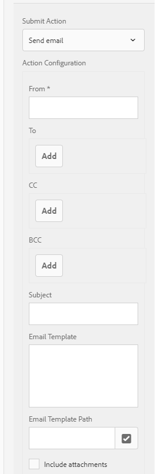

# Envio de uma confirmação de envio de formulário por email {#sending-a-form-submission-acknowledgement-via-email}

## Envio de dados do formulário adaptável {#adaptive-form-data-submission}

Os formulários adaptativos fornecem vários workflows [enviar ações](../../forms/using/configuring-submit-actions.md) prontos para uso para enviar os dados do formulário para diferentes pontos de extremidade.

Por exemplo, a ação **[!UICONTROL Enviar e-mail]** enviar envia um e-mail após o envio bem-sucedido de um formulário adaptável. Também pode ser configurado para enviar os dados do formulário e o PDF no email.

Este artigo detalha as etapas para habilitar a ação Email em um formulário adaptável e em diferentes configurações fornecidas.

>[!NOTE]
>
>Você também pode usar a opção **[!UICONTROL Enviar PDF por email]** para enviar o formulário preenchido por email como um anexo PDF. As opções de configuração disponíveis para esta ação são as mesmas opções disponíveis para a ação **[!UICONTROL Enviar email]**. A ação PDF por email está disponível somente para formulários adaptáveis baseados em XFA

## Enviar ação por email {#email-action}

A ação Enviar email permite que um autor envie emails automaticamente para um ou mais recipient no envio bem-sucedido de um formulário adaptável.

>[!NOTE]
>
>Para usar a ação Enviar email, é necessário configurar o serviço de email AEM conforme descrito em [Configuração do serviço de email](/help/sites-administering/notification.md#configuring-the-mail-service).

### Ativando a ação Enviar email em um formulário adaptável {#enabling-email-action-on-an-adaptive-form}

1. Abra um formulário adaptável no modo **[!UICONTROL edit]**.

1. Na guia **[!UICONTROL Conteúdo]**, toque em **[!UICONTROL Container de formulário]** e toque em  para visualização das propriedades de formulário adaptáveis.

1. Na seção **[!UICONTROL Enviar]**, selecione **[!UICONTROL Enviar email]** na lista suspensa **[!UICONTROL Enviar ação]**.

   

1. Especifique IDs de email válidas nos campos **[!UICONTROL To]**, **[!UICONTROL CC]** e **[!UICONTROL BCC]**.

   Especifique o assunto e o corpo do email nos campos **[!UICONTROL Assunto]** e **[!UICONTROL Modelo de Email]**, respectivamente.

   Também é possível especificar espaços reservados variáveis nos campos, caso em que os valores dos campos são processados quando o formulário é enviado com êxito por um usuário final. Para obter mais informações, consulte [Usar nomes de campos de formulário adaptáveis para criar dinamicamente conteúdo de email](../../forms/using/form-submission-receipt-via-email.md#p-using-adaptive-form-field-names-to-dynamically-create-email-content-p).

   Selecione **[!UICONTROL Incluir anexos]** se o formulário incluir anexos de arquivo e você quiser anexar esses arquivos no email.

   >[!NOTE]
   >
   >Se você escolher a opção **[!UICONTROL Enviar PDF por email]**, deverá selecionar a opção Incluir anexos.

1. Clique em  para salvar as alterações.

### Uso de nomes de campos de formulário adaptáveis para criar dinamicamente conteúdo de email {#using-adaptive-form-field-names-to-dynamically-create-email-content}

Os nomes de campo em um formulário adaptável são chamados de espaços reservados que são substituídos pelo valor desse campo depois que o usuário envia o formulário.

Na ação **[!UICONTROL Enviar email]**, você pode usar espaços reservados que são processados quando a ação é executada. Isso implica que os cabeçalhos do email (como **[!UICONTROL To]**, **[!UICONTROL CC]**, **[!UICONTROL BCC]**, **[!UICONTROL Subject]**) sejam gerados quando o usuário enviar o formulário.

Para definir um espaço reservado, especifique `${<field name>}` em um campo depois de selecionar **[!UICONTROL Enviar email]** como a Ação de envio.

Por exemplo, se o formulário contiver o campo **[!UICONTROL Endereço de email]**, chamado `email_addr`, para capturar a ID de email de um usuário, você poderá especificar o seguinte nos campos **[!UICONTROL To]**, **[!UICONTROL CC]** ou **[!UICONTROL BCC]**.

`${email_addr}`

Quando um usuário envia o formulário, um email é enviado para a ID de email inserida no campo `email_addr` do formulário.

>[!NOTE]
>
>Você pode encontrar o nome de um campo na caixa de diálogo **[!UICONTROL Editar]** do campo.

Os espaços reservados de variáveis também podem ser usados nos campos **[!UICONTROL Assunto]** e **[!UICONTROL Modelo de email]**.

Por exemplo:

`Hi ${first_name} ${last_name},`

`Your form has been received by our department. It usually takes ten business days to process the request.`

`Regards`

`Administrator`

>[!NOTE]
>
>Campos em painéis repetíveis não podem ser usados como espaços reservados para variáveis.

