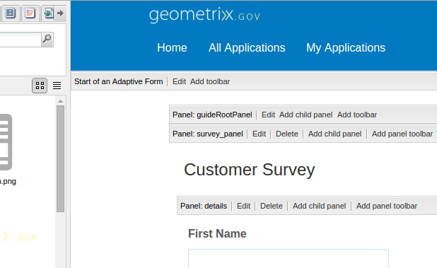

# Envio de uma confirmação de envio de formulário por email{#sending-a-form-submission-acknowledgement-via-email}

## Submissão de dados do formulário adaptável {#adaptive-form-data-submission}

Os formulários adaptativos fornecem vários workflows de ações [de](../../forms/using/configuring-submit-actions.md) envio prontos para uso para enviar os dados do formulário para diferentes pontos de extremidade.

Por exemplo, a ação de envio de ação **de** email envia um email sobre o envio bem-sucedido de um formulário adaptável. Também pode ser configurado para enviar os dados do formulário e o PDF no email.

Este artigo detalha as etapas para habilitar a ação Email em um formulário adaptável e em diferentes configurações fornecidas.

>[!NOTE]
>
>Também é possível usar a ação **Enviar PDF por** email para enviar o formulário preenchido como um anexo PDF. As opções de configuração disponíveis para esta ação são as mesmas opções disponíveis para a ação Email. A ação PDF por email está disponível somente para formulários adaptáveis baseados em XFA

## Email action {#email-action}

A ação Email permite que um autor envie emails automaticamente para um ou mais recipient no envio bem-sucedido de um formulário adaptável.

>[!NOTE]
>
>Para usar a ação Email, é necessário configurar o serviço de email AEM conforme descrito em [Configuração do serviço](/help/sites-administering/notification.md#configuring-the-mail-service)de email.

### Ativação da ação Email em um formulário adaptável {#enabling-email-action-on-an-adaptive-form}

1. Abra um formulário adaptável no modo de edição.

1. Clique em **Editar** ao lado do **Start da barra de ferramentas Formulário** adaptável.

   A caixa de diálogo Editar componente é aberta.

   

1. Selecione a guia **Enviar ações** e escolha Ação **de** email na lista suspensa Enviar ação.

   A guia exibe as opções para configurar a ação Email para o formulário atual.

   

1. Especifique IDs de email válidas nos campos Mailto, CC e Cco.

   Especifique o assunto e o corpo do email nos campos Assunto e Modelo de email, respectivamente.

   Também é possível especificar espaços reservados variáveis nos campos, caso em que os valores dos campos são processados quando o formulário é enviado com êxito por um usuário final. Para obter mais informações, consulte [Uso de nomes de campos de formulário adaptáveis para criar dinamicamente conteúdo](../../forms/using/form-submission-receipt-via-email.md#p-using-adaptive-form-field-names-to-dynamically-create-email-content-p)de email.

   Selecione Incluir anexos se o formulário incluir anexos de arquivo e você quiser anexar esses arquivos no email.

   >[!NOTE]
   >
   >Se você escolher a ação **Enviar PDF por** email, deverá selecionar a opção Incluir anexos.

1. Clique em **OK** para salvar as alterações.

### Uso de nomes de campos de formulário adaptáveis para criar dinamicamente conteúdo de email {#using-adaptive-form-field-names-to-dynamically-create-email-content}

Os nomes de campo em um formulário adaptável são chamados de espaços reservados que são substituídos pelo valor desse campo depois que o usuário envia o formulário.

Na guia Ação de email, você pode usar espaços reservados que são processados quando a ação é executada. Isso implica que os cabeçalhos do email (como Mailto, CC, BCC, assunto) sejam gerados quando o usuário enviar o formulário.

Para definir um espaço reservado, especifique `${<field name>}` em um campo na guia Enviar ações.

Por exemplo, se o formulário contiver o campo Endereço **de** email, nomeado `email_addr`, para capturar a ID de email de um usuário, você poderá especificar o seguinte nos campos Mailto, CC ou Cco.

`${email_addr}`

Quando um usuário envia o formulário, um email é enviado para a ID de email inserida no `email_addr` campo do formulário.

>[!NOTE]
>
>Você pode encontrar o nome de um campo na caixa de diálogo **Editar** do campo.

Os espaços reservados para variáveis também podem ser usados nos campos **Assunto** e modelo **de** email.

Por exemplo:

`Hi ${first_name} ${last_name},`

`Your form has been received by our department. It usually takes ten business days to process the request.`

`Regards`

`Administrator`

>[!NOTE]
>
>Campos em painéis repetíveis não podem ser usados como espaços reservados para variáveis.

