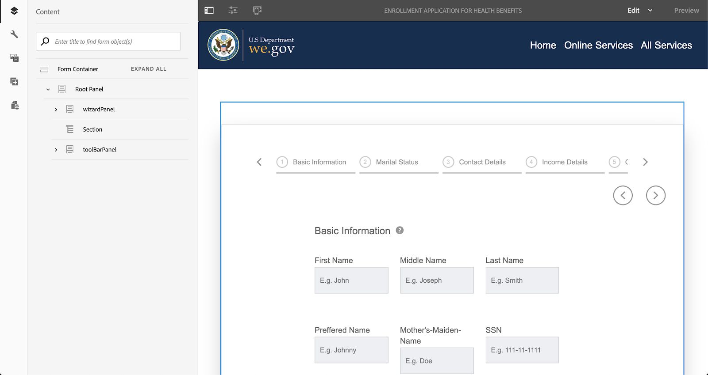

# Apresentação do site de referência We.Gov e We.Finance {#we-gov-reference-site-walkthrough}

## Pré-requisitos {#pre-requisites}

Configure o site de referência conforme descrito em [Configurar e configure o site](../../forms/using/forms-install-configure-gov-reference-site.md)de referência We.Gov e We.Finance.

## História do usuário {#user-story}

* Formulários AEM

   * Conversão automática dos formulários
   * Criação  
   * Modelos de dados de formulário/Fontes de dados

* Formulários AEM

   * Captura de dados
   * (Opcional) Integração de dados (MS Dynamics)
   * (Opcional) Adobe Sign

* Fluxo de trabalho
* Notificações por email
* (Opcional) Comunicações do cliente

   * Canal de impressão
   * Canal da Web

* Adobe Analytics
* Integrações de fonte de dados

### Fictitious users and groups {#fictitious-users-and-groups}

O pacote demo We.Gov vem com os seguintes usuários fictícios incorporados:

* **Aya Tan**: Cidadão elegível para um serviço de uma agência governamental


* **George Lang**: Analista de negócios da agência We.Gov


* **Camila Santos**: Chefe do We.Gov Agency CX


Os seguintes grupos também estão incluídos:

* **Usuários do We.Gov Forms**

   * George Lang (membro)
   * Camila Santos (membro)

* **Usuários do We.Gov**

   * George Lang (membro)
   * Camila Santos (membro)
   * Aya Tan (membro)

### Legenda dos termos de visão geral da demonstração {#demo-overview-terms-legend}

1. **Representar**: Definidos usuários e grupos em AEM demonstração.
1. **Botão**: Retângulo colorido ou seta circulada para navegação.
1. **Clique**: Para executar uma ação na história do usuário.
1. **Links**: Localizado na parte superior do menu principal no site We.Gov.
1. **Instruções** do usuário: Um conjunto de etapas numéricas a serem seguidas ao navegar pela história do usuário.
1. **Portal** Forms: *https://&lt;aemserver>:&lt;porta>/content/we-gov/formsportal.html*
1. **Visualização** móvel: usuário We.Gov para replicar uma visualização móvel com um navegador redimensionado.
1. **Visualização** da área de trabalho: Usuário do We.gov para demonstração de visualização em um laptop ou desktop.
1. **Formulário** de pré-filtragem: Formulário no Home page do site We.Gov.
1. **Formulário** adaptável: Formulário de aplicativo de inscrição para demonstração We.gov.

   *https://&lt;aemserver>:&lt;porta>/content/forms/af/adobe-gov-forms/enrollment-application-for-health-benefits.html*

1. **Site** Adobe We.Gov: *https://&lt;aemserver>:&lt;porta>/content/we-gov/home.html*
1. **Caixa de entrada** Adobe: Localizado o ícone [Bell da barra de menus superior](assets/bell.svg) no backend AEM.

   *https://&lt;aemserver>:&lt;porta>/aem/start.html*

1. **Cliente** de email: Maneira preferencial de visualização de e-mails (Gmail, Outlook)
1. **CTA**: Chamada à ação
1. **Navegar**: Para localizar um ponto de referência específico na página do navegador.
1. **AFC**: Conversão automatizada do Forms

## Conversão automatizada do Forms (Camila) {#automated-forms-conversion}

**Esta seção**: Camila o cliente potencial CX possui um formulário com base em PDF existente que foi usado como parte de um processo com base em papel. Como parte de um esforço de modernização, ela deseja usar este formulário PDF para criar automaticamente um novo Forms adaptativo moderno.

### Conversão automatizada do Forms - We.Gov (Camila) {#automated-forms-conversion-wegov}

1. Navegue até *https://&lt;aemserver>:&lt;porta>/aem/start.html*

1. Faça logon com:
   * **Usuário**: camila.santos
   * **Senha**: password
1. Na página principal, selecione Forms > Forms e Documentos > AEM Forms We.gov Forms > AFC.
1. Camila carrega o PDF no AEM Forms.

   

1. Em seguida, Camilla seleciona o formulário PDF e clica em **Start de conversão** automatizada para start do processo de conversão. Talvez seja necessário clicar em **Substituir conversão** se você tiver convertido o formulário.

   >[!NOTE]
   >
   >Observe que as configurações no AFC são pré-definidas para o usuário final, o que significa que elas não devem ser alteradas.

   * **Opcional**: Se você quiser usar o tema Ultramarine Acessível, basta clicar no tema Especificar um formulário adaptável e selecionar o tema Accessible-Ultramarine exibido na lista de opções.

   

   

   O status de porcentagem concluída é exibido durante a conversão. Quando o status exibir **Convertido**, clique na pasta de **saída** , selecione o formulário adaptável e clique em **Editar** para abrir o formulário convertido.

1. Camilla então revisa o formulário e garante que todos os campos estejam presentes

   

1. Camilla start para editar o formulário. Ela seleciona Painel raiz > Editar (a chave de fenda) > seleciona Guias na parte superior no menu suspenso Layout do painel > seleciona a caixa de seleção.

   

1. Camilla acrescenta então todas as alterações de campo e CSS necessárias para produzir o produto final.

   

### Modelo de dados de formulário e fontes de dados (Camila) {#data-sources}

**Esta seção**: Depois que o documento é convertido e produzido um Formulário adaptável, Camila precisa conectar o Formulário adaptável a uma fonte de dados.

1. Camila abre as Propriedades no formulário que foi convertido em [Automated Forms Conversion - We.Gov](#automated-forms-conversion-wegov).

1. Camila, em seguida, seleciona Modelo de formulário > Seleciona o modelo de dados de formulário na lista suspensa Selecionar de > Seleciona o FDM de inscrição We.gov na lista da opção.

1. Clique no botão Salvar e fechar.

   

1. Camila clica na pasta de **saída** , seleciona o formulário adaptável e clica em **Editar** para abrir o formulário We.Gov concluído.
1. Camila seleciona um campo de formulário adaptável e clica no ícone . Ela cria vínculos com as entidades do modelo de dados de formulário usando o campo **Vincular referência** . Ela repete essa etapa para todos os campos na forma adaptativa.

### Teste de acessibilidade do formulário (Camila) {#form-accessibility-testing}

Camila também valida que o conteúdo criado é criado correta e totalmente acessível de acordo com os padrões corporativos.

1. Camila clica na pasta de **saída** , seleciona o formulário adaptável e clica em **Pré-visualização** para abrir o formulário We.Gov concluído.

1. Abre a guia Auditoria na ferramenta para desenvolvedores do Chrome.

1. Realiza uma verificação de acessibilidade para validar o formulário adaptável.

   

## Demonstração Da Visualização De Formulário Móvel Adaptável (Aya) {#mobile-view-demo}

**Esta seção deve ser realizada antes da manifestação.**

**Instruções do usuário:**

1. Navegue até: *https://&lt;aemserver>:&lt;porta>/content/we-gov/home.html*
1. Faça logon com:

   1. **Usuário**: aya.tan
   1. **Senha**: password

1. Redimensione a janela do navegador ou use o emulador do navegador para replicar um tamanho de dispositivo móvel.

### Site We.Gov (Aya) {#aya-user-story-we-gov-website}


**Esta seção**: Aya é um cidadão. Ela ouve de uma amiga que pode ser qualificada para receber um Serviço de uma agência governamental. Aya navega até o website We.Gov de seu celular para saber mais sobre os serviços para os quais ela está qualificada.

### Pré-filtragem We.Gov (Aya) {#aya-user-story-we-gov-pre-screener}

Aya responde a algumas perguntas para confirmar sua qualificação preenchendo um pequeno formulário adaptativo em seu celular.

**Instruções do usuário:**

1. Faça uma seleção em cada campo suspenso.

   >[!NOTE]
   >
   >Se o usuário ganhar mais de US$ 200.000/ano, ele não será elegível.

1. Clique em &quot;**Sou elegível?**” botão.
1. Clique no botão &quot;**Aplicar agora**&quot; para continuar.

   

### Formulário Adaptável We.Gov (Aya) {#aya-user-story-we-gov-adaptive-form}

Aya descobre que ela é qualificada e começa a preencher seu pedido para solicitar serviço em seu dispositivo móvel.

Qualquer pessoa precisa revisar alguns documentos em casa antes de poder concluir a solicitação de serviço. Ela salva e sai do aplicativo de seu dispositivo móvel.

**Instruções do usuário:**

1. Preencha os campos Informações básicas; os campos a seguir são obrigatórios e os menus suspensos:

   1. Informações básicas

      1. Nome
      1. Sobrenome
      1. DOB
      1. E-mail

1. Use a seguinte lógica **** dinâmica para demonstrar o recurso dinâmico usando a lista suspensa Status **da** família:

   1. **Único**: Mostrar próximo ao painel de parentes
   1. **Casado**: Mostrar painel dependente do casamento
   1. **Divorciado**: Mostrar próximo ao painel de parentes
   1. **Viúvo**: Mostrar próximo ao painel de parentes
   1. **Você tem filhos?**: Botão de opção (Sim/Não) para mostrar o painel dependente do filho.

      1. (Adicionar/Remover) para adicionar/remover vários painéis dependentes.

1. Clique na seta para a direita na barra de menus cinza.
1. Clique no botão Salvar na parte inferior.

   

## Demonstração do desktop {#desktop-demo}

**Esta seção:** Em casa, Aya encontrou as informações de que precisava e retirou o aplicativo do desktop. Aya navega até o portal de formulários online para retomar seu aplicativo. Com uma simples personalização, as agências também podem gerar e enviar automaticamente por email um link para retomar o aplicativo.

### Formulário Adaptável Continuado (Aya) {#aya-user-story-continued-adaptive-form}

**Instruções do usuário:**

1. Navegue até *https://&lt;aemserver>:&lt;porta>/content/we-gov/home.html*
1. Na barra de navegação, selecione clique em &quot;Serviços **** online&quot;.
1. No painel &quot;Forms de rascunho&quot;, selecione o &quot;Aplicativo de inscrição para benefícios de saúde&quot; existente.

   

   A aparência é a mesma, e ela não precisa reinserir nenhum dado.

   **Instruções do usuário:**

1. Clique à direita em Círculo CTA para ir para a próxima seção.

   

   O formulário é preenchido até o ponto da última entrada do Aya. Aya inseriu todas as suas informações e está pronta para enviar.

   

   >[!NOTE]
   >
   >Quando Aya preenche o campo de número de telefone, deve preenchê-lo como um número contínuo de 11 dígitos sem traços, espaços ou hífens.

   Depois de enviar a página de agradecimento, Aya recebe. Opcionalmente, ela também receberá um email que poderá abrir para assinar o documento de registro eletronicamente com a Adobe Sign.

### Opcional: Adobe Sign (Aya) {#adobe-sign}

**Instruções do usuário:**

1. Navegue até o seu Cliente de e-mail e localize o e-mail da Adobe Sign.
1. Clique no link para Adobe Sign.

   

**Instruções do usuário:**

1. Marque a caixa &quot;**Concordo**&quot;.
1. Clique em &quot;**Aceitar**&quot;.
1. Role até a parte inferior do documento revisado.
1. Clique na guia amarela realçada para assinar a documento.

    

## Agente governamental (George) {#government-agent-george}


**Esta seção:** George é um analista de negócios da agência governamental Aya está solicitando um serviço. George tem um único painel onde ele pode ver todas as solicitações de serviço que lhe foram atribuídas para revisão.

### Caixa de entrada AEM (George) {#george-user-story-aem-inbox}

**Instruções do usuário:**

1. Navegue até *https://&lt;aemserver>:&lt;porta>/aem/start.html*
1. Clique no ícone do usuário (canto superior direito) e use a opção de menu &quot;**Sair**&quot; ou &quot;**Representar como**&quot; se estiver conectado a um usuário administrativo.

   1. Faça logon com:

      1. **Usuário:** george.lang
      1. **Senha:** password
   1. Ou Representar:

      1. Digite &quot;**George**&quot; no campo &quot;**Representar como**&quot;.

      1. Clique em OK para representar.


1. No canto superior direito, clique no ícone Notificação (sino).
1. Clique em &quot;**Visualização tudo**&quot; para navegar até a Caixa de entrada.
1. Na Caixa de entrada, abra a tarefa mais recente &quot;Análise **do aplicativo de benefícios de** saúde&quot;.

   

### Opcional: Caixa de entrada AEM e Microsoft Dynamics (George) {#george-user-story-aem-inbox-and-ms-dynamics}

Graças às integrações de dados e aos workflows automatizados, o aplicativo Aya é exibido, juntamente com um registro CRM que foi gerado automaticamente quando os dados foram enviados.

**Instruções do usuário:**

1. Abra e inspecione o formulário adaptativo somente leitura.
1. Clique no botão &quot;**Abrir o MS Dynamics**&quot; para abrir o registro do MS Dynamics em uma nova janela.
1. No CRM, é possível visualizar todas as informações que podem ser atualizadas

   1. Opcionalmente, adicione algumas notas de revisão diretamente no Dynamics.

1. Feche e volte para AEM Caixa de entrada.

   

### Voltar para AEM Caixa de Entrada (George) {#george-user-story-back-to-aem-inbox}

George aprova o aplicativo de Aya e, graças a um fluxo de trabalho automatizado existente, um email de confirmação também é enviado para Aya.

**Instruções do usuário:**

1. Navegue até o canto superior esquerdo e clique em &quot;**Aprovar**&quot; para aprovar o aplicativo.
1. No modal, você pode deixar uma mensagem para o cliente potencial CX.
1. Clique em Concluído.
1. (Função de cidadão) Abra seu cliente de e-mail para visualização do e-mail enviado para Aya.

   

## Chumbo CX (Camila) {#cx-lead-camila}


**Esta seção:** Camila, a líder do CX, faz uma chamada telefônica bem-vinda com a Aya para explicar como usar os serviços governamentais para os quais ela foi aprovada.

### (Opcional) Caixa de entrada AEM e Microsoft Dynamics {#camila-user-story-aem-inbox-ms-dynamics}

**Instruções do usuário:**

1. Navegue até *https://&lt;aemserver>:&lt;porta>/aem/start.html*
1. Clique no ícone do usuário (canto superior direito) e use a opção de menu &quot;**Sair**&quot; ou &quot;**Representar como**&quot; se estiver conectado a um usuário administrativo.

   1. Faça logon com:

      1. **Usuário**: camila.santos
      1. **Senha**: password
   1. Ou Representar:

      1. Digite &quot;**Camila**&quot; no campo &quot;**Representar como**&quot;.

      1. Clique em OK para representar.


1. No canto superior direito, clique no ícone Notificação (sino).
1. Clique em &quot;**Visualização tudo**&quot; para navegar até a Caixa de entrada.
1. Na Caixa de entrada, abra a tarefa &quot;**Nova aprovação** de contato&quot; mais recente.


**(Opcional) Instruções do usuário:**

1. Abra e inspecione o formulário adaptativo somente leitura.
1. Clique no botão &quot;**Abrir o MS Dynamics**&quot; para abrir o registro do MS Dynamics em uma nova janela.
1. No CRM, é possível visualizar todas as informações que podem ser atualizadas

   1. Como opção, adicione uma nova atividade de chamada diretamente no Dynamics.
   1. Abra a seção &quot;**Atividade**&quot;.
   1. Clique na opção &quot;**Nova chamada** telefônica&quot;.
   1. Adicione detalhes de chamada telefônica.
   1. Salve e feche a janela.

1. De volta à AEM, navegue até o canto superior esquerdo e clique em &quot;**Enviar**&quot; para enviar o aplicativo.
1. No modal, você pode deixar uma mensagem.
1. Clique em Concluído.

    Atividade 

## (Opcional) Kit De Boas-Vindas Cidadão (Aya) {#welcome-kit-citizen-aya}

**Esta seção:** Qualquer usuário recebe um email com um link para uma comunicação interativa que resume seus benefícios e também inclui campos de formulário para preenchimento. Com a declaração de benefícios do PDF anexada e um link para a carta de comunicação interativa no email (com o mesmo tema/marca da comunicação interativa).

### Notificação De Cliente De Email (Aya) {#aya-user-story-email-client}

**Instruções do usuário:**

1. Localize e abra o e-mail do kit de boas-vindas.
1. Role até o anexo PDF na parte inferior da página.
1. Clique para abrir o anexo PDF.
1. Role de volta para o seu cliente de e-mail e clique em &quot;Kit de boas-vindas **Visualização online**&quot;.

   1. Isso abrirá a versão do canal da Web do mesmo documento.

1. Para obter uma referência rápida ao PDF diretamente:

   *https://&lt;aemserver>:&lt;porta>/aem/formdetails.html/content/dam/formsanddocuments/adobe-gov-forms/welcome-handbook/we-gov-welcome-handbook*

1. Para uma referência rápida ao IC diretamente:

   *https://&lt;aemserver>:&lt;porta>/content/dam/formsanddocuments/adobe-gov-forms/welcome-handbook/we-gov-welcome-handbook/jcr:content?canal=web&amp;mode=pré-visualização&amp;wcmmode=disabled*

    Interativa do Manual 

## Renewal Lembrete (Aya) {#renewal-reminder-citizen-aya}

**Esta seção:** Camila também agenda um lembrete de comunicação, então um ano depois. (Etapa do fluxo de trabalho que automatiza/executa e-mail).

### Notificação De Cliente De Email (Aya) {#aya-user-story-email-client-updated}

**Instruções do usuário:**

1. Navegue até seu cliente de email.
1. Localize e abra o e-mail Renewal Lembrete.
1. Clique no botão &quot;**Enviar um novo aplicativo**&quot; para abrir o formulário adaptável.

   1. Esta seção é intencionalmente deixada vazia para suportar o pré-preenchimento de dados na fase 2.

   

## (Opcional) Modelo de dados de formulário (Camila) {#form-data-model}

**Esta seção**: Camila navega até Integrações de dados da AEM Forms onde pode executar um teste rápido para verificar se as informações enviadas para a fonte externa de dados por meio da integração com o Modelo de dados de formulário estão realmente presentes.

### Modelo de dados de formulário (Camila) {#form-data-model-camila}

**Esta seção**: Camila navega até a página Fontes de Dados para validar os dados que o servidor replicou dentro do banco de dados Derby.

1. Quando a experiência do usuário for concluída e o envio do usuário for concluído, Camila navegará até a guia Fontes de dados no AEM Forms (**Forms** > Integrações **de** dados)

1. Camila então seleciona AEM Forms **We.gov FDM** e edita o FDM **de inscrição** We.gov.

1. Camila, em seguida, seleciona **Entrar em contato** > **Ler serviço** a ser testado.

   

1. Camila, em seguida, fornece ao serviço de teste uma ID de contato e, em seguida, clica no botão Testar. Por exemplo, 1 ou 2, se você enviou o formulário. Se você não tiver enviado o formulário, nenhum dado será retornado.

   

1. Camila pode então validar se os dados foram inseridos com êxito na fonte de dados.

   * Os dados no Derby DS são semelhantes ao seguinte formato:

   ```xml
      [
         {
         "ADDRESS_COUNTRY": "USA",
         "LAST_NAME": "Tan",
         "ADDRESS_CITY": "New York",
         "FIRST_NAME": "Aya",
         "ADDRESS_STATE": "AL",
         "ADDRESS_LINE1": "123 Street crescent",
         "GENDER_CODE": "2",
         "ADDRESS_LINE2": "123 Street crescent",
         "ADDRESS_POSTAL_CODE": "90210",
         "BIRTH_DATE": "1991-12-12",
         "CONTACT_ID": 1,
         "MIDDLE_NAME": "M",
         "HAS_CHILDREN_CODE": "0"
         }
   ]
   ```

## (Opcional) Analytics (Camila) {#analytics-cx-lead-camila}

**Esta seção:** Camila navega até um painel onde ela pode ver em todo o KPI da agência, como % dos cidadãos que start preenchem um formulário de solicitação de serviço e abandonam, o tempo médio desde a submissão de solicitação até a resposta de aprovação/negação, e estatísticas de envolvimento para os manuais de benefícios que ela enviou aos cidadãos.

### relatórios Adobe Analytics Sites (Camila) {#camila-reviews-sites-reporting-we-gov-adobe-analytics}

1. Navegue até *https://&lt;aemserver>:&lt;porta>/sites.html/content*
1. Selecione &quot;Site **We.Gov** AEM Forms&quot; para visualização das páginas do site.
1. Selecione uma da página do site (por exemplo, Início) e escolha &quot;**Analytics &amp; Recommendations**&quot;.

   

1. Nesta página, você verá informações obtidas do Adobe Analytics que pertencem à página do AEM Sites (OBSERVAÇÃO: por padrão, essas informações são atualizadas periodicamente da Adobe Analytics e não são exibidas em tempo real).

   

1. De volta à página de visualização da página (acessada na etapa 3.), você também pode visualização as informações de visualização da página alterando a configuração de exibição para itens de visualização na &quot;Visualização **de** Lista&quot;.
1. Localize o menu suspenso &quot;**Visualização**&quot; e selecione &quot;Visualização **de** Lista&quot;.

   

1. No mesmo menu, selecione &quot;Configuração **de** Visualização&quot; e selecione as colunas que deseja exibir na seção &quot;**Analytics**&quot;.

   

1. Clique em &quot;**Atualizar**&quot; para disponibilizar as novas colunas.

   

### relatórios Adobe Analytics Forms (Camila) {#camila-reviews-forms-reporting-we-gov-adobe-analytics}

1. Vá até

   *https://&lt;aemserver>:&lt;porta>/aem/forms.html/content/dam/formsanddocuments/adobe-gov-forms*

1. Selecione o formulário adaptativo &quot;Aplicativo de **inscrição para benefícios** de saúde&quot; e selecione a opção &quot;Relatório **do** Analytics&quot;.

   

1. Aguarde a página ser carregada e visualização nos dados do relatório do Analytics.

   

