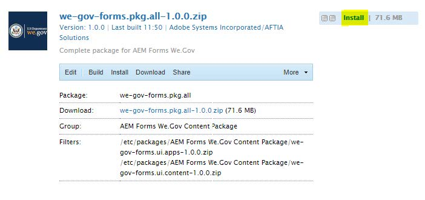
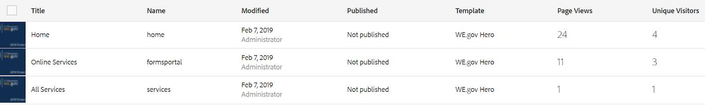
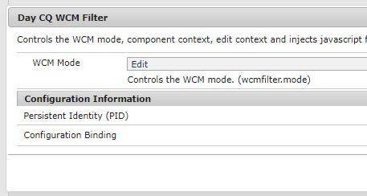

# Configurar e configurar o site de referência We.Gov{#set-up-and-configure-we-gov-reference-site}

## Detalhes do pacote de demonstração {#demo-package-details}

### Pré-requisitos de instalação {#installation-prerequisites}

Este pacote foi criado para o autor **OSGI do** AEM Forms 6.4, foi testado e, portanto, é suportado nas seguintes versões da plataforma:

| VERSÃO DO AEM | VERSÃO DO PACOTE DO AEM FORMS | STATUS |
|---|---|---|
| 6.4 | 5.0.86 | **Suportado** |
| 6,5 | 6.0.80 | **Suportado** |

Este pacote contém a configuração em nuvem que suporta as seguintes versões de plataforma:

| PROVEDOR DE NUVEM | VERSÃO DE SERVIÇO | STATUS |
|---|---|---|
| Adobe Sign | API v5 | **Suportado** |
| Microsoft Dynamics 365 | 1710 (9.1.0.3020) | **Suportado** |

**Considerações sobre a instalação do pacote:**

* Espera-se que o pacote seja instalado em um servidor limpo, livre de outros pacotes de demonstração ou versões mais antigas do pacote de demonstração
* Espera-se que o pacote esteja instalado em um servidor OSGI, em execução no modo Autor

### O que este pacote inclui {#what-does-this-package-include}

O pacote de demonstração We.Gov do AEM Forms ( **we-gov-forms.pkg.all-&lt;version>.zip **) é fornecido como um pacote que inclui vários outros subpacotes e serviços. O pacote inclui os seguintes módulos:

* **we-gov-forms.pkg.all-&lt;versão>.zip** -* Pacote demo completo*

   * **we-gov-forms.ui.apps-&lt;versão>.zip** *- contém todos os componentes, bibliotecas clientes, usuários de amostras, modelos de fluxo de trabalho etc.*

      * **we-gov-forms.core-&lt;versão>.jar*** - Contém todos os serviços OSGI, implementação de etapas de fluxo de trabalho personalizadas etc.*

      * **core.wcm.components.all-2.0.4.zip** - *Coleção de componentes WCM de amostra*

      * **grid-aem.ui.apps-1.0-SNAPSHOT.zip** - pacote de layout Grade de sites *AEM para controle de coluna da página Sites*
   * **we-gov-forms.ui.content-&lt;versão>.zip*** - contém todo o conteúdo, páginas, imagens, *formulários, ativos de comunicação interativos etc.

   * **we-gov-forms.config.public-&lt;version>.zip** - *Contém todos os nós de configuração padrão, incluindo configurações de nuvem de espaço reservado para ajudar a evitar problemas de modelo de dados de formulários e de vínculo de serviço.*

Os ativos incluídos neste pacote incluem:

* Páginas do site do AEM com modelos editáveis
* Formulários AEM Adaptive
* Comunicações interativas do AEM Forms (Impressão e Canal da Web)
* Documento XDP do AEM Forms
* Modelo de dados do AEM Forms MS Dynamics
* Integração do Adobe Sign
* Modelo de fluxo de trabalho AEM
* Imagens de amostra do AEM Assets

## Opções de configuração {#configuration-options}

Esta seção inclui detalhes sobre as opções de configuração. Neste momento, esta seção está intencionalmente vazia.

## Instalação do pacote de demonstração {#demo-package-installation}

Esta seção contém informações sobre como instalar o pacote de demonstração.

### Do compartilhamento de pacotes {#from-package-share}

1. Navegue até *https://&lt;aemserver>:&lt;porta>/crx/packageshare/*

   Ou no AEM, clique em Implantação e navegue até o ícone Compartilhamento de pacotes.

   

1. Faça logon usando sua Adobe ID.
1. Pesquise e localize o pacote **we-gov-forms.pkg.all-&lt;versão>** .
1. Selecione a opção &quot;Download&quot; e aceite os Termos e Condições.
1. Depois de baixado, selecione a opção &quot;Baixado&quot; para localizar o pacote no Gerenciador de pacotes.
1. Selecione a opção &quot;Instalar&quot; para instalar o pacote.

   

1. Permita a conclusão do processo de instalação.
1. Navegue até *https://&lt;aemserver>:&lt;port>/content/we-gov/home.html?wcmmode=disabled* para garantir que a instalação foi bem-sucedida.

### De um arquivo ZIP local {#from-a-local-zip-file}

1. Baixe e localize o arquivo **we-gov-forms.pkg.all-&lt;versão>.zip** .
1. Navegue até *https://&lt;aemserver>:&lt;port>/crx/packmgr/index.jsp*.
1. Selecione a opção &quot;Carregar pacote&quot;.

   

1. Use o navegador de arquivos para navegar e selecionar o arquivo ZIP baixado.
1. Clique em &quot;Abrir&quot; para fazer upload.
1. Depois de carregado, selecione a opção &quot;Instalar&quot; para instalar o pacote.

   

1. Permita a conclusão do processo de instalação.
1. Navegue até *https://&lt;aemserver>:&lt;port>/content/we-gov/home.html?wcmmode=disabled* para garantir que a instalação foi bem-sucedida.

### Instalação de novas versões de pacote {#installing-new-package-versions}

Para instalar a nova versão do pacote, siga as etapas definidas em 4.1 e 4.2. É possível instalar uma versão mais recente do pacote enquanto outro pacote mais antigo já estiver instalado, mas recomenda-se desinstalar a versão mais antiga do pacote primeiro. Para isso, siga as etapas abaixo.

1. Navegue até *https://&lt;aemserver>:&lt;porta>/crx/packmgr/index.jsp*
1. Localize o arquivo **we-gov-forms.pkg.all-&lt;versão>.zip** antigo.
1. Selecione a opção &quot;Mais&quot;.
1. Na lista suspensa, selecione a opção &quot;Desinstalar&quot;.

   

1. Na confirmação, selecione &quot;Desinstalar&quot; novamente e permita que o processo de desinstalação seja concluído.

## Configuração do pacote de demonstração {#demo-package-configuration}

Esta seção contém detalhes e instruções sobre a configuração pós-implantação do pacote de demonstração antes da apresentação.

### Configuração fictícia do usuário {#fictional-user-configuration}

1. Navegue até *https://&lt;aemserver>:&lt;porta>/libs/granite/security/content/groupadmin.html*
1. Procure &quot;**workflow**&quot;.
1. Selecione o grupo &quot;**workflow-users**&quot; e clique em &quot;Propriedades&quot;.
1. Navegue até a guia &quot;Membros&quot;.
1. Digite **wegov** no campo &quot;Selecionar usuário ou grupo&quot;.
1. Selecione na lista suspensa &quot;Usuários **de formulário** We.Gov&quot;.

   

1. Clique em &quot;Salvar e fechar&quot; na barra de menus.
1. Repita as etapas de 2 a 7 pesquisando por &quot;**analytics**&quot;, selecionando o grupo &quot;Administradores **do** Analytics&quot; e adicionando o grupo &quot;Usuários **de formulário** We.Gov&quot; como membro.
1. Repita as etapas de 2 a 7 pesquisando &quot;usuários **de** formulários&quot;, selecionando o grupo &quot;**formulários-usuários** avançados&quot; e adicionando o grupo &quot;Usuários **de formulário** We.Gov&quot; como membro.
1. Repita as etapas de 2 a 7 procurando por &quot;usuários **de** formulários&quot;, selecionando o grupo &quot;**usuários** de formulários&quot; e, desta vez, adicionando o grupo &quot;*** Usuários We.Gov**&quot; como membro.

### Configuração do servidor de email {#email-server-configuration}

1. Revisar a documentação de configuração [Configurando notificação por email](/help/sites-administering/notification.md)

1. Navegue até *https://&lt;aemserver>:&lt;porta>/system/console/configMgr*
1. Localize e clique no **Serviço de e-mail do Day CQ **serviço para configurar.

   

1. Configure o serviço para se conectar ao servidor SMTP de sua escolha:

   1. **Nome do host** do Servidor SMTP: por exemplo (smtp.gmail.com)
   1. **Porta** do servidor: por exemplo (465) para o gmail que usa SSL
   1. **** Usuário SMTP: demo@ &lt;nome da empresa> .com
   1. **Endereço**&quot;De&quot;: aemformsdemo@adobe.com
   

1. Clique em &quot;Salvar&quot; para salvar a configuração.

### Configuração SSL do AEM {#aemsslconfig}

Esta seção contém detalhes sobre como configurar o SSL na instância do AEM para poder configurar a configuração da Adobe Sign Cloud.

**Referências:**

1. [SSL por padrão](/help/sites-administering/ssl-by-default.md)

**Notas:**

1. Navegue até https://&lt;aemserver>:&lt;port>/aem/inbox onde você poderá concluir o processo explicado no link de documentação de referência acima.
1. O pacote **we-gov-forms.pkg.all-&lt;versão>.zip** inclui uma chave SSL de amostra e um certificado que podem ser acessados extraindo a pasta **we-gov-forms.pkg.all-&lt;versão>.zip/ssl** que faz parte do pacote.

1. Certificado SSL e detalhes da chave:

   1. emitido para &quot;CN=localhost&quot;
   1. Validade de 10 anos
   1. valor da senha de &quot;password&quot;

### Adobe Sign cloud configuration {#adobe-sign-cloud-configuration}

Esta seção contém detalhes e instruções sobre a Configuração da Adobe Sign Cloud.

**Referências:**

1. [Integrar o Adobe Sign ao AEM Forms](adobe-sign-integration-adaptive-forms.md)

#### Cloud configuration {#cloud-configuration}

1. **Revise os pré-requisitos. Consulte Configuração[SSL do](../../forms/using/forms-install-configure-gov-reference-site.md#aemsslconfig)AEM para obter a configuração SSL necessária.**
1. Vá até:

   *https://&lt;aemserver>:&lt;porta>/libs/adobesign/cloudservices/adobesign.html/conf/we-gov*

   >[!NOTE]
   >
   >O URL usado para acessar o servidor AEM deve corresponder ao URL configurado no URI de redirecionamento OAuth do Adobe Sign para evitar problemas de configuração (por exemplo, *https://&lt;aemserver>:&lt;porta>/mnt/overlay/adobesign/cloudservices/adobesign/properties.html*)

1. Selecione a configuração &quot;We.gov Adobe Sign&quot;.
1. Clique em &quot;Propriedades&quot;.
1. Navegue até a guia &quot;Configurações&quot;.
1. Insira o URL do oAuth, por exemplo: [https://secure.na1.echosign.com/public/oauth](https://secure.na1.echosign.com/public/oauth)
1. Forneça a ID do cliente e o segredo do cliente configurados a partir da instância configurada do Adobe Sign.
1. Clique em &quot;Conectar-se ao Adobe Sign&quot;.
1. Após a conexão bem-sucedida, clique em &quot;Salvar e fechar&quot; para concluir a integração.

### Configuração da nuvem do MS Dynamics {#ms-dynamics-cloud-configuration}

Esta seção contém detalhes e instruções sobre a Configuração do MS Dynamics Cloud.

**Referências:**

1. [Configuração do Microsoft Dynamics OData](https://docs.adobe.com/content/help/en/experience-manager-64/forms/form-data-model/ms-dynamics-odata-configuration.html)
1. [Configuração do Microsoft Dynamics para AEM Forms](https://helpx.adobe.com/experience-manager/kt/forms/using/config-dynamics-for-aem-forms.html)

#### Serviço em nuvem do MS Dynamics OData {#ms-dynamics-odata-cloud-service}

1. Vá até:

   https://&lt;aemserver>:&lt;porta>/libs/fd/fdm/gui/components/admin/fdmcloudservice/fdm.html/conf/we-gov

   1. Verifique se você está acessando o servidor usando o mesmo URL de redirecionamento configurado no registro do aplicativo do MS Dynamics.

1. Selecione a configuração &quot;Serviço Microsoft Dynamics OData Cloud&quot;.
1. Clique em &quot;Propriedades&quot;.

   

1. Navegue até a guia &quot;Configurações de autenticação&quot;.
1. Digite os seguintes detalhes:

   1. **** Raiz do serviço: por exemplo, https://msdynamicsserver.api.crm3.dynamics.com/api/data/v9.1/
   1. **** Tipo de autenticação: OAuth 2.0
   1. **Configurações** de autenticação (consulte Configurações [da nuvem do](../../forms/using/forms-install-configure-gov-reference-site.md#dynamicsconfig) MS Dynamics para coletar essas informações):

      1. ID do cliente - também conhecido como ID do aplicativo
      1. Client Secret
      1. URL OAuth - por exemplo, [https://login.windows.net/common/oauth2/authorize](https://login.windows.net/common/oauth2/authorize)
      1. Atualizar URL do token - por exemplo, [https://login.windows.net/common/oauth2/token](https://login.windows.net/common/oauth2/token)
      1. URL do token de acesso - por exemplo, [https://login.windows.net/common/oauth2/token](https://login.windows.net/common/oauth2/token)
      1. Âmbito de autorização - **open**
      1. Cabeçalho de autenticação - Portador de **autorização**
      1. Recurso - por exemplo, [https://msdynamicsserver.api.crm3.dynamics.com](https://msdynamicsserver.api.crm3.dynamics.com)
   1. Clique em &quot;Conectar-se ao OAuth&quot;.

1. Após a autenticação bem-sucedida, clique em &quot;Salvar e fechar&quot; para concluir a integração.

#### Configurações de nuvem do MS Dynamics {#dynamicsconfig}

As etapas detalhadas nesta seção são incluídas para ajudá-lo a localizar a ID do cliente, o Segredo do cliente e os detalhes da sua instância do MS Dynamics Cloud.

1. Navegue até [https://portal.azure.com/](https://portal.azure.com/) e faça logon.
1. No menu esquerdo, selecione &quot;Todos os serviços&quot;.
1. Procure ou navegue até &quot;App Registration&quot;.
1. Crie ou selecione um registro de aplicativo existente.
1. Copie a ID **do** aplicativo a ser usada como a Id **do** cliente OAuth na configuração da nuvem do AEM
1. Clique em &quot;Configurações&quot; ou &quot;Manifesto&quot; para configurar os URLs de **resposta.**

   1. Esse URL deve corresponder ao URL usado para acessar o servidor AEM ao configurar o serviço OData.

1. Na exibição Configuração, clique em &quot;Teclas&quot; para exibir criar uma nova chave (isso é usado como o Segredo do cliente no AEM ).

   1. Certifique-se de manter uma cópia da chave, pois não poderá visualizá-la mais tarde no Azure ou no AEM.

1. Para localizar o URL do recurso/URL raiz do serviço, navegue até o painel da instância do MS Dynamics.
1. Na barra de navegação superior, clique em &quot;Vendas&quot; ou no seu próprio tipo de instância e em &quot;Selecionar configurações&quot;.
1. Clique em &quot;Personalizações&quot; e &quot;Recursos do desenvolvedor&quot;, perto da parte inferior direita.
1. Lá você encontrará o URL raiz do serviço: por exemplo

* [https://msdynamicsserver.api.crm3.dynamics.com/api/data/v9.1/](https://msdynamicsserver.api.crm3.dynamics.com/api/data/v9.1/)*

1. Detalhes sobre o URL do token de atualização e acesso estão disponíveis aqui:

* [https://docs.microsoft.com/en-us/rest/api/datacatalog/authenticate-a-client-app](https://docs.microsoft.com/en-us/rest/api/datacatalog/authenticate-a-client-app)*

#### Teste do modelo de dados de formulário {#testing-the-form-data-model}

Quando a configuração da nuvem estiver concluída, talvez você queira testar o modelo de dados do formulário.

1. Vá até

   *https://&lt;aemserver>:&lt;porta>/aem/forms.html/content/dam/formsanddocuments-fdm/we-gov*

1. Selecione &quot;We.gov Microsoft Dynamics CRM FDM&quot; e selecione &quot;Propriedades&quot;.

   

1. Navegue até a guia &quot;Atualizar fonte&quot;.
1. Verifique se a &quot;Configuração sensível ao contexto&quot; está definida como &quot;/conf/we-gov&quot; e se a fonte de dados configurada é &quot;ms-dynamics-odata-cloud-service&quot;.

   

1. Edite o Modelo de dados de formulário.

   >[!NOTE]
   Certifique-se de clicar em **Cancelar** em vez de **Salvar e fechar** para evitar problemas que exijam reinstalação.

1. Teste os serviços para garantir que eles se conectem com êxito à Fonte de Dados configurada.

   >[!NOTE]
   Foi relatado que era necessário reiniciar o servidor AEM para que a fonte de dados se vinculasse com êxito ao FDM.

### Adobe Analytics configuration {#adobe-analytics-configuration}

Esta seção contém detalhes e instruções sobre a Configuração da Adobe Analytics Cloud.

**Referências:**

* [Integração ao Adobe Analytics](../../sites-administering/adobeanalytics.md)

* [Conexão com o Adobe Analytics e criação de estruturas](../../sites-administering/adobeanalytics-connect.md)

* [Visualizar dados de análise de página](../../sites-authoring/pa-using.md)

* [Configuração de análises e relatórios](configure-analytics-forms-documents.md)

* [Exibir e entender relatórios de análise do AEM Forms](view-understand-aem-forms-analytics-reports.md)

### Configuração do serviço em nuvem do Adobe Analytics {#adobe-analytics-cloud-service-configuration}

Este pacote vem pré-configurado para se conectar ao Adobe Analytics. As etapas abaixo são fornecidas para permitir que essa configuração seja atualizada.

1. Navegue até *https://&lt;aemserver>:&lt;porta>/libs/cq/core/content/tools/cloudservices.html*
1. Localize a seção Adobe Analytics e selecione o link &quot;Mostrar configurações&quot;.
1. Selecione a configuração &quot;We.Gov Adobe Analytics (Analytics Configuration)&quot;.

   

1. Clique no botão &quot;Editar&quot; para atualizar a configuração do Adobe Analytics (será necessário fornecer o Segredo compartilhado). Clique em &quot;Conectar-se ao Analytics&quot; para se conectar e em &quot;OK&quot; para concluir.

   

1. Na mesma página, clique em &quot;We.Gov Adobe Analytics Framework (Analytics Framework)&quot; se desejar atualizar as configurações da estrutura (consulte [Ativar a criação](../../forms/using/forms-install-configure-gov-reference-site.md#enableauthoring) do AEM para ativar a criação).

### Relatórios do Adobe Analytics {#adobe-analytics-reporting}

#### Exibir relatórios de sites do Adobe Analytics {#view-adobe-analytics-sites-reporting}

1. Navegue até *https://&lt;aemserver>:&lt;porta>/sites.html/content*
1. Selecione &quot;Site We.Gov do AEM Forms&quot; para exibir as páginas do site.
1. Selecione uma da página do site (por exemplo, Início) e escolha &quot;Analytics &amp; Recommendations&quot;.

   

1. Nesta página, você verá informações obtidas do Adobe Analytics que pertencem à página Sites do AEM (observação: por padrão, essas informações são atualizadas periodicamente do Adobe Analytics e não são exibidas em tempo real).

   

1. De volta à página de visualização de página (acessada na etapa 3.), você também pode exibir as informações de visualização de página alterando a configuração de exibição para exibir itens na &quot;Exibição de lista&quot;.
1. Localize o menu suspenso &quot;Exibir&quot; e selecione &quot;Exibição de lista&quot;.

   

1. No mesmo menu, selecione &quot;Configuração de exibição&quot; e selecione as colunas que deseja exibir na seção &quot;Analytics&quot;.

   

1. Clique em &quot;Atualizar&quot; para disponibilizar as novas colunas.

   

#### Exibir relatórios de formulários do Adobe Analytics {#view-adobe-analytics-forms-reporting}

1. Vá até

   *https://&lt;aemserver>:&lt;porta>/aem/forms.html/content/dam/formsanddocuments/adobe-gov-forms*

1. Selecione o formulário adaptativo &quot;Aplicativo de inscrição para benefícios de saúde&quot; e selecione a opção &quot;Relatório do Analytics&quot;.

   

1. Aguarde até que a página seja carregada e exiba os dados do Analytics Report.

   

#### Exibir relatórios do Adobe Analytics {#view-adobe-analytics-reporting}

Como opção, você pode navegar para o Adobe Analytics diretamente para ver os dados de análise.

1. Navegue até [https://my.omniture.com/login/](https://my.omniture.com/login/)
1. Faça logon usando suas credenciais:

   1. **** Empresa: Demonstração do AEM Forms
   1. **** Usuário: &lt;disponível mediante solicitação>
   1. **** Senha: &lt;disponível mediante solicitação>

1. Selecione &quot;Site de referência We.Gov&quot; nos Report Suites.

   

1. Selecione um dos relatórios disponíveis para exibir os dados de análise desse relatório.

   

## Personalizações do pacote de demonstração {#demo-package-customizations}

Esta seção inclui instruções sobre a personalização da demonstração.

### Ativar a criação do AEM {#enableauthoring}

Este pacote de demonstração inclui um arquivo de configuração de serviço OSGI que controla o comportamento do serviço de Filtro WCM no servidor do Autor de destino. Essa configuração faz o servidor operar em um modo de autor desativado (equivalente a ?wcmmode=disabled) para permitir a demonstração. Para atualizar essa configuração e ativar a criação, execute as seguintes etapas:

1. Navegue até *https://&lt;aemserver>:&lt;porta>/system/console/configMgr*
1. Localize e clique no **Filtro CQ Dia WCM **Serviço a ser configurado.

   

1. Defina o valor de &quot;Modo **** WCM&quot; para &quot;**Editar**&quot;.
1. Clique em &quot;**Salvar**&quot; para aplicar a configuração.

### Personalização de modelos {#templates-customization}

Modelos editáveis podem ser encontrados no seguinte local:

*https://&lt;aemserver>:&lt;porta>/libs/wcm/core/content/sites/templates.html/conf/we-gov*

Esses modelos incluem os modelos AEM Site, Adaptive Form e Interative Communications, criados e montados com componentes que podem ser encontrados em:

*https://&lt;aemserver>:&lt;porta>/crx/de/index.jsp#/apps/we-gov/components*

#### Style system {#customizetemplates}

Este site também possui bibliotecas de clientes, uma das quais importa o Bootstrap 4 ( [https://getbootstrap.com/](https://getbootstrap.com/) ). Esta biblioteca de cliente está disponível em

*https://&lt;aemserver>:&lt;porta>/crx/de/index.jsp#/apps/we-gov/clientlibs/clientlib-base/css/bootstrap*

Os modelos editáveis incluídos neste pacote também vêm pré-configurados com políticas de modelo/página que usam as classes CSS Bootstrap 4 para paginação, estilo etc. Nem todas as classes foram adicionadas às políticas de modelo, mas qualquer classe suportada pelo Bootstrap 4 pode ser adicionada às políticas. Consulte a página de introdução para obter uma lista das classes disponíveis:

[https://getbootstrap.com/docs/4.1/getting-started/introduction/](https://getbootstrap.com/docs/4.1/getting-started/introduction/)

Os modelos incluídos neste pacote também suportam o Sistema de estilo:

[Sistema de estilos](../../sites-authoring/style-system.md)

#### Logotipos modelo {#template-logos}

Os ativos DAM do projeto também incluem logotipos e imagens We.Gov. Esses ativos estão disponíveis em:

*https://&lt;aemserver>:&lt;porta>/assets.html/content/dam/we-gov*

Ao editar a página e os modelos de formulário, é possível optar por atualizar os logotipos de marca ao editar os componentes de Navegação e Rodapé. Esses componentes oferecem uma caixa de diálogo configurável de marca e logotipo que pode ser usada para atualizar logotipos:

Consulte Edição do conteúdo da página para obter mais informações:

[Editar conteúdo da página](../../sites-authoring/editing-content.md)

### Personalização de páginas de sites {#sites-pages-customization}

Todas as páginas do site estão disponíveis em: *https://&lt;aemserver>:&lt;porta>/sites.html/content/we-gov*

Essas páginas do site também usam o pacote Grade AEM para controlar o layout de alguns componentes.

#### Style system {#style-system}

As páginas incluídas neste pacote também suportam o Sistema de estilo:

[Sistema de estilos](../../sites-authoring/style-system.md)

Você também pode consultar o sistema [de estilo de personalização de](../../forms/using/forms-install-configure-gov-reference-site.md#customizetemplates) Modelos para obter a documentação sobre estilos suportados.

### Personalização de formulários adaptáveis {#adaptive-forms-customization}

Todos os formulários adaptáveis estão disponíveis em:

*https://&lt;aemserver>:&lt;porta>/aem/forms.html/content/dam/formsanddocuments/adobe-gov-forms*

Esses formulários podem ser personalizados para se ajustarem a determinados casos de uso. Observe que determinados campos e a lógica de envio não devem ser modificados para garantir que o formulário continue a funcionar corretamente. Isso inclui:

**Aplicativo De Inscrição Para Benefícios De Integridade:**

* contact_id - campo oculto usado para receber a ID de contato do MS Dynamics durante o envio
* Enviar - A lógica do botão Enviar requer personalização para suportar retornos de chamada. A personalização está documentada, mas um script grande era necessário para enviar o formulário e, ao mesmo tempo, executar uma operação POST e GET para o MS Dynamics por meio do Modelo de dados de formulários.
* Painel raiz - o evento Initialize é usado para adicionar um botão do MS Dynamics à Caixa de entrada do AEM da forma menos intrusiva possível, pois todos os componentes da interface de usuário do AEM Inbox Granite não podem ser modificados.

#### Estilo de formulário adaptável {#adaptive-form-styling}

Os formulários adaptáveis também podem ser estilizados usando o Editor de estilos ou o Editor de temas:

* [Estilo em linha de componentes de formulário adaptáveis](inline-style-adaptive-forms.md)
* [Criação e uso de temas](themes.md)

### Personalização do fluxo de trabalho {#workflow-customization}

O Formulário adaptável de inscrição é enviado para um fluxo de trabalho OSGI para processamento. Este fluxo de trabalho pode ser encontrado em https://&lt;aemserver>:&lt;porta>/conf/we-gov/settings/models/we-gov-process.html*.

Devido a certas limitações, esse fluxo de trabalho contém vários scripts e etapas personalizadas do processo de fluxo de trabalho OSGI. Essas etapas do fluxo de trabalho foram criadas como etapas genéricas e não foram criadas com caixas de diálogo de configuração. No momento, a configuração das etapas do fluxo de trabalho depende de argumentos do processo.

Todo o código Java da etapa do fluxo de trabalho está contido no pacote **we-gov-forms.core-&lt;versão>.jar** .

## Considerações de demonstração e problemas conhecidos {#demo-considerations-and-known-issues}

Esta seção contém informações sobre recursos de demonstração e decisões de design que podem exigir considerações especiais durante o processo de demonstração.

### Considerações de demonstração {#demo-considerations}

* Conforme o AGRS-159, verifique se o nome (primeiro, meio e último) do contato usado no Formulário adaptável de inscrição é único.
* O formulário adaptável de inscrição enviará o email do Adobe Sign para o email especificado no campo de email do formulário. Esse endereço de email não pode ser o mesmo endereço de email usado para configurar a configuração da nuvem do Adobe Sign.
* Por padrão, o pacote de demonstração inclui várias configurações de serviço OSGI para controlar o comportamento geral do servidor de destino que hospeda a demonstração. Essas configurações incluem uma configuração de serviço de Filtro WCM que, por padrão, faz com que o servidor opere em um modo de autor **** desativado (equivalente a ?wcmmode=disabled). Consulte [Ativar a criação](../../forms/using/forms-install-configure-gov-reference-site.md#enableauthoring) do AEM para permitir a criação de páginas.

### Problemas conhecidos {#known-issues}

* (AGRS-120) No momento, o componente de Navegação do site não suporta páginas secundárias aninhadas com mais de 2 níveis de profundidade.
* (AGRS-159) O FDM atual do MS Dynamics precisa executar duas operações para, primeiro, executar o POST dos dados do Formulário adaptável de inscrição no Dynamics e, em seguida, buscar o registro do usuário para recuperar a ID de contato. No estado atual, a busca da ID de contato falhará se mais de dois usuários com o mesmo nome estiverem presentes no Dynamics, o que não permitirá o envio do Formulário adaptável de inscrição.

## Próximas etapas {#next-steps}

Agora todos estão prontos para explorar o site de referência We.Gov. Para obter mais informações sobre o fluxo de trabalho e as etapas do site de referência We.Gov, consulte Passo a passo do site de referência [We.Gov](../../forms/using/forms-gov-reference-site-user-demo.md).
