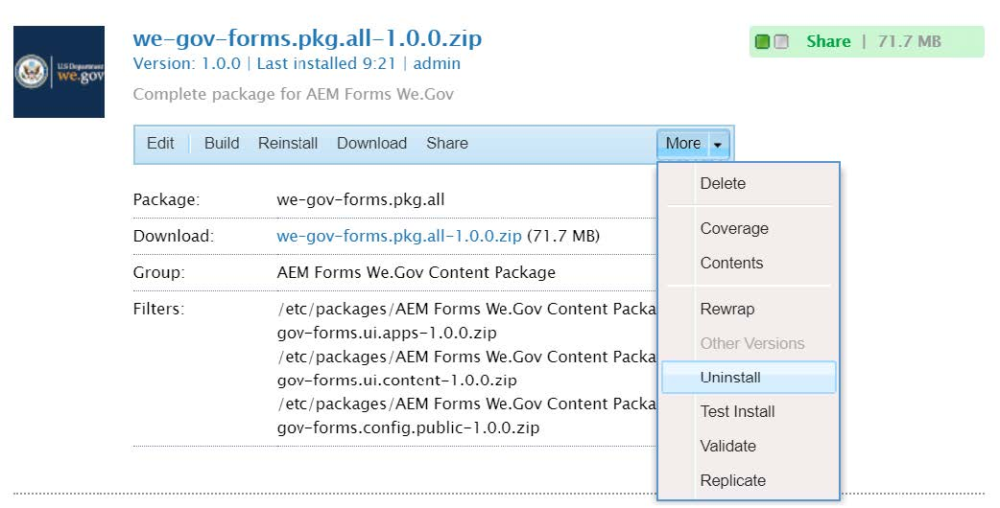
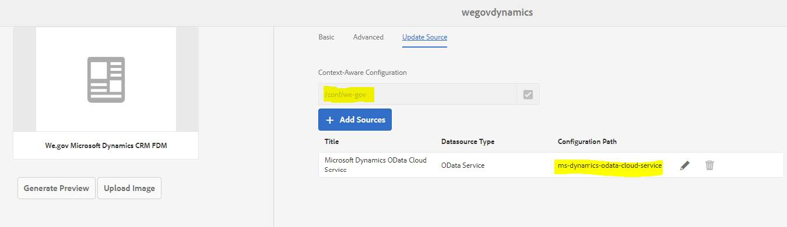
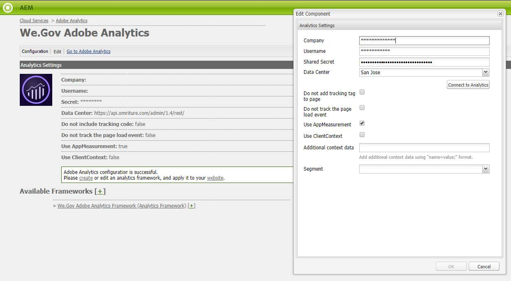

# Configurar o site de referência We.Gov e We.Finance {#set-up-and-configure-we-gov-reference-site}

## Detalhes do pacote de demonstração {#demo-package-details}

### Pré-requisitos de instalação {#installation-prerequisites}

Este pacote foi criado para **Autor do AEM Forms 6.4 OSGI**, foi testado e, portanto, é compatível com as seguintes versões de plataforma:

| VERSÃO DO AEM | VERSÃO DO PACOTE DO AEM FORMS | STATUS |
|---|---|---|
| 6.4 | 5.0.86 | **Compatível** |
| 6,5 | 6.0.80 | **Compatível** |
| 6.5.3 | 6.0.122 | **Compatível** |

Este pacote contém a configuração de nuvem compatível com as seguintes versões de plataforma:

| PROVEDOR DE NUVEM | VERSÃO DO SERVIÇO | STATUS |
|---|---|---|
| Adobe Sign | API v5 | **Compatível** |
| Microsoft® Dynamics 365 | 1710 (9.1.0.3020) | **Compatível** |
| Adobe Analytics | API Rest v1.4 | **Compatível** |
**Considerações sobre a instalação de pacotes:**

* Instale o pacote em um servidor limpo, livre de outros pacotes de demonstração ou versões mais antigas de pacotes de demonstração.
* Instale o pacote em um servidor OSGI, executado no modo Autor.

### O que este pacote inclui {#what-does-this-package-include}

A variável [Pacote de demonstração do AEM Forms We.Gov](https://experience.adobe.com/#/downloads/content/software-distribution/en/aem.html?package=/content/software-distribution/en/details.html/content/dam/aem/public/adobe/packages/cq650/featurepack/we-gov-forms.pkg.all-2.0.2.zip) (**we-gov-forms.pkg.all-&lt;version>.zip**) vem como um pacote que inclui vários outros subpacotes e serviços. O pacote inclui os seguintes módulos:

* **we-gov-forms.pkg.all-&lt;version>.zip** - *Pacote completo de demonstração*

   * **we-gov-forms.ui.apps-&lt;version>.zip** *- Contém todos os componentes, bibliotecas de clientes, exemplos de usuários, modelos de fluxo de trabalho e assim por diante.*

      * **we-gov-forms.core-&lt;version>.jar** - *Contém todos os serviços OSGI, implementação de etapa de fluxo de trabalho personalizada e assim por diante.*

      * **we-gov-forms.derby&lt;version>.jar** - *Contém todos os serviços OSGI, esquema de banco de dados e assim por diante.*

      * **core.wcm.components.all-2.0.4.zip** - *Coleção de componentes WCM de amostra*

      * **grid-aem.ui.apps-1.0-SNAPSHOT.zip** - *Pacote de layout de grade do AEM Sites para controle de coluna da página Sites*

   * **we-gov-forms.ui.content-&lt;version>.zip** - *Contém todo o conteúdo, páginas, imagens, formulários, ativos de comunicação interativa e assim por diante.*

   * **we-gov-forms.ui.analytics-&lt;version>.zip** - *Contém todos os dados do We.Gov Forms Analytics a serem armazenados no repositório.*

   * **we-gov-forms.config.public-&lt;version>.zip** - *Contém todos os nós de configuração padrão, incluindo configurações de nuvem de espaço reservado para ajudar a evitar problemas de modelo de dados de formulários e de associação de serviço.*

Os ativos incluídos neste pacote incluem:

* Páginas do site AEM com modelos editáveis
* AEM Forms Adaptive Forms
* Comunicações interativas da AEM Forms (canal da Web e impresso)
* Documento de registro XDP do AEM Forms
* Modelo de dados do AEM Forms MS® Dynamics Forms
* Integração do Adobe Sign
* Modelo de fluxo de trabalho do AEM
* Imagens de exemplo do AEM Assets
* Amostra do banco de dados Apache Derby (na memória)
* Fonte de dados Apache Derby (para uso com o Modelo de dados de formulário)

## Instalação do pacote de demonstração {#demo-package-installation}

Esta seção contém informações sobre a instalação do pacote de demonstração.

### Da Distribuição de software {#from-software-distribution}

1. Abra a [Distribuição de softwares](https://experience.adobe.com/downloads). Você precisa de uma Adobe ID para fazer logon na Distribuição de softwares.
1. Selecionar **[!UICONTROL Adobe Experience Manager]** disponível no menu de cabeçalho.
1. No **[!UICONTROL Filtros]** seção:
   1. Selecionar **[!UICONTROL Forms]** do **[!UICONTROL Solução]** lista suspensa.
   2. Selecione a versão e o tipo do pacote. Você também pode usar a variável **[!UICONTROL Pesquisar downloads]** para filtrar os resultados.
1. Selecione o **we-gov-forms.pkg.all-&lt;version>.zip** nome do pacote, selecione **[!UICONTROL Aceitar termos do EULA]** e selecione **[!UICONTROL Baixar]**.
1. Abertura [Gerenciador de pacotes](https://experienceleague.adobe.com/docs/experience-manager-65/administering/contentmanagement/package-manager.html)  e clique em **[!UICONTROL Fazer upload do pacote]** para carregar o pacote.
1. Selecione o pacote e clique em **[!UICONTROL Instalar]**.

   

1. Permitir que o processo de instalação seja concluído.
1. Navegue até *https://&lt;aemserver>:&lt;port>/content/we-gov/home.html?wcmmode=disabled* para garantir que a instalação foi bem-sucedida.

### De um arquivo ZIP local {#from-a-local-zip-file}

1. Baixe e localize o **we-gov-forms.pkg.all-&lt;version>.zip** arquivo.
1. Navegue até *https://&lt;aemserver>:&lt;port>/crx/packmgr/index.jsp*.
1. Selecione a opção &quot;Fazer upload do pacote&quot;.

   

1. Use o navegador de arquivos para navegar até o arquivo ZIP baixado e selecioná-lo.
1. Clique em &quot;Abrir&quot; para fazer upload.
1. Após feito o upload, selecione a opção &quot;Install&quot; para instalar o pacote.

   

1. Permitir que o processo de instalação seja concluído.
1. Navegue até *https://&lt;aemserver>:&lt;port>/content/we-gov/home.html?wcmmode=disabled* para garantir que a instalação foi bem-sucedida.

### Instalação de novas versões de pacotes {#installing-new-package-versions}

Para instalar uma nova versão do pacote, siga as etapas definidas em 4.1 e 4.2. É possível instalar uma versão de pacote mais recente enquanto outro pacote mais antigo já estiver instalado, mas é recomendável desinstalar a versão de pacote mais antiga primeiro. Para fazer isso, siga as etapas abaixo.

1. Navegue até *https://&lt;aemserver>:&lt;port>/crx/packmgr/index.jsp*
1. Localizar a pasta **we-gov-forms.pkg.all-&lt;version>.zip** arquivo.
1. Selecione a opção &quot;Mais&quot;.
1. Na lista suspensa, selecione a opção &quot;Desinstalar&quot;.

   

1. Na confirmação, selecione &quot;Desinstalar&quot; novamente e permita que o processo de desinstalação seja concluído.

## Configuração do pacote de demonstração {#demo-package-configuration}

Esta seção contém detalhes e instruções sobre a configuração pós-implantação do pacote de demonstração antes da apresentação.

### Configuração fictícia do usuário {#fictional-user-configuration}

1. Navegue até *https://&lt;aemserver>:&lt;port>/libs/granite/security/content/groupadmin.html*
1. Faça logon como administrador para executar as tarefas abaixo.
1. Role para baixo até o final da página para carregar todos os grupos de usuários.
1. Pesquisar por &quot;**fluxo de trabalho**&quot;.
1. Selecione o &quot;**workflow-users**&quot; e clique em &quot;Propriedades&quot;.
1. Navegue até a guia &quot;Membros&quot;.
1. Digitar **wegov** no campo &quot;Selecionar usuário ou grupo&quot;.
1. Selecione na lista suspensa &quot;**Usuários do Forms We.Gov**&quot;.

   

1. Clique em &quot;Salvar e fechar&quot; na barra de menus.
1. Repita as etapas de 2 a 7 procurando por &quot;**analytics**&quot;, selecionando o &quot;**Administradores do Analytics**&quot; e adicionando o &quot;**Usuários do Forms We.Gov**&quot; como membro.
1. Repita as etapas de 2 a 7 procurando por &quot;**usuários de formulários**&quot;, selecionando o &quot;**forms-power-users**&quot; e adicionando o &quot;**Usuários do Forms We.Gov**&quot; como membro.
1. Repita as etapas de 2 a 7 procurando por &quot;**forms-users**&quot;, selecionando o &quot;**forms-users**&quot; e, dessa vez, adicionar o &quot;**Usuários do We.Gov**&quot; como membro.

### Configuração do servidor de email {#email-server-configuration}

1. Revisar a documentação de configuração [Configuração da notificação por e-mail](/help/sites-administering/notification.md)
1. Faça logon como administrador para executar esta tarefa.
1. Navegue até *https://&lt;aemserver>:&lt;port>/system/console/configMgr*
1. Localize e clique no link **Serviço de email Day CQ** serviço a ser configurado.

   

1. Configure o serviço para se conectar ao servidor SMTP de sua escolha:

   1. **Nome de host do servidor SMTP**: por exemplo (smtp.gmail.com)
   1. **Porta do servidor**: por exemplo (465) para gmail usando SSL
   1. **Usuário SMTP:** demo@ &lt;companyname> .com
   1. **Endereço &quot;De&quot;**: aemformsdemo@adobe.com

   

1. Clique em &quot;Salvar&quot; para salvar a configuração.

### (Opcional) Configuração do AEM SSL {#aemsslconfig}

Esta seção contém detalhes sobre como configurar o SSL na instância do AEM para poder definir a configuração da Adobe Sign Cloud.

**Referências:**

1. [SSL por padrão](/help/sites-administering/ssl-by-default.md)

**Notas:**

1. Navegue até https://&lt;aemserver>:&lt;port>/aem/inbox onde você pode concluir o processo explicado no link da documentação de referência acima.
1. A variável `we-gov-forms.pkg.all-[version].zip` inclui um exemplo de chave SSL e certificado que pode ser acessado extraindo o `we-gov-forms.pkg.all-[version].zip/ssl` pasta que faz parte do pacote.

1. Certificado SSL e detalhes da chave:

   1. emitido para &quot;CN=localhost&quot;
   1. Validade de 10 anos
   1. valor de senha de &quot;senha&quot;
1. A chave privada é a *localhostprivate.der*.
1. O certificado é o *localhost.crt*.
1. Clique em Avançar.
1. O nome de host HTTPS deve ser definido como *localhost*.
1. A porta deve ser definida como uma porta que o sistema tenha exposto.

### (Opcional) Configuração em nuvem do Adobe Sign {#adobe-sign-cloud-configuration}

Esta seção contém detalhes e instruções sobre a Configuração da nuvem do Adobe Sign.

**Referências:**

1. [Integrar o Adobe Sign com o AEM Forms](adobe-sign-integration-adaptive-forms.md)

#### Configuração na nuvem {#cloud-configuration}

1. Revise os pré-requisitos. Consulte [Configuração SSL do AEM](../../forms/using/forms-install-configure-gov-reference-site.md#aemsslconfig) para a configuração SSL necessária.
1. Vá até:

   *https://&lt;aemserver>:&lt;port>/libs/adobesign/cloudservices/adobesign.html/conf/we-gov*

   >[!NOTE]
   >
   >O URL usado para acessar o servidor AEM deve corresponder ao URL configurado no URI de redirecionamento OAuth do Adobe Sign para evitar problemas de configuração (por exemplo, *https://&lt;aemserver>:&lt;port>/mnt/overlay/adobesign/cloudservices/adobesign/properties.html*)

1. Selecione a configuração &quot;We.gov Adobe Sign&quot;.
1. Clique em &quot;Propriedades&quot;.
1. Navegue até a guia &quot;Configurações&quot;.
1. Insira o URL de oAuth, por exemplo: [https://secure.na1.echosign.com/public/oauth](https://secure.na1.echosign.com/public/oauth)
1. Forneça a ID do cliente configurada e o Segredo do cliente da instância do Adobe Sign configurada.
1. Clique em &quot;Conectar ao Adobe Sign&quot;.
1. Após a conexão bem-sucedida, clique em &quot;Salvar e fechar&quot; para concluir a integração.

### (Opcional) Configuração na nuvem do MS® Dynamics {#ms-dynamics-cloud-configuration}

Esta seção contém detalhes e instruções sobre a configuração do MS® Dynamics Cloud.

**Referências:**

1. [Microsoft](/help/forms/using/ms-dynamics-odata-configuration.md)
1. [Configuração do Microsoft® Dynamics para AEM Forms](https://experienceleague.adobe.com/docs/experience-manager-learn/forms/adaptive-forms/using-ms-dynamics-with-aem-forms.html)

#### Serviço de nuvem OData do MS® Dynamics {#ms-dynamics-odata-cloud-service}

1. Vá até:

   https://&lt;aemserver>:&lt;port>/libs/fd/fdm/gui/components/admin/fdmcloudservice/fdm.html/conf/we-gov

   1. Verifique se você está acessando o servidor usando o mesmo URL de redirecionamento configurado no registro do aplicativo MS® Dynamics.

1. Selecione a configuração &quot;Cloud Service OData do Microsoft® Dynamics&quot;.
1. Clique em &quot;Propriedades&quot;.

   

1. Navegue até a guia &quot;Configurações de autenticação&quot;.
1. Insira os seguintes detalhes:

   1. **Raiz do serviço:** por exemplo, `https://msdynamicsserver.api.crm3.dynamics.com/api/data/v9.1/`
   1. **Tipo de autenticação:** OAuth 2.0
   1. **Configurações de autenticação** (consulte [Definições de configuração da nuvem do MS® Dynamics](../../forms/using/forms-install-configure-gov-reference-site.md#dynamicsconfig) para coletar essas informações):

      1. ID do cliente - também chamada de ID da aplicação
      1. Senha do cliente
      1. URL do OAuth - por exemplo, [https://login.microsoftonline.com/common/oauth2/authorize](https://login.microsoftonline.com/common/oauth2/authorize)
      1. URL do token de atualização - por exemplo, [https://login.windows.net/common/oauth2/token](https://login.windows.net/common/oauth2/token)
      1. URL do token de acesso - por exemplo, [https://login.windows.net/common/oauth2/token](https://login.windows.net/common/oauth2/token)
      1. Escopo da autorização - **openid**
      1. Cabeçalho de autenticação - **Portador da autorização**
      1. Recurso - por exemplo, `https://msdynamicsserver.api.crm3.dynamics.com`

   1. Clique em &quot;Conectar ao OAuth&quot;.

1. Após a autenticação bem-sucedida, clique em &quot;Salvar e fechar&quot; para concluir a integração.

#### Definições de configuração da nuvem do MS® Dynamics {#dynamicsconfig}

As etapas detalhadas nesta seção estão incluídas para ajudá-lo a localizar a ID do cliente, o segredo do cliente e os detalhes da sua instância do MS® Dynamics Cloud.

1. Navegue até [https://portal.azure.com/](https://portal.azure.com/) e faça logon.
1. No menu à esquerda, selecione &quot;Todos os serviços&quot;.
1. Procure por ou navegue até &quot;Registro de aplicativo&quot;.
1. Crie ou selecione um registro de aplicativo existente.
1. Copie o **ID do aplicativo** para ser usado como OAuth **ID do cliente** na configuração de nuvem do AEM
1. Clique em &quot;Configurações&quot; ou &quot;Manifesto&quot; para configurar o **URLs de resposta.**

   1. Este URL deve corresponder ao URL usado para acessar o servidor AEM ao configurar o serviço OData.

1. Na exibição Configuração, clique em &quot;Chaves&quot; para exibir a nova chave (usada como o Segredo do cliente no AEM ).

   1. Guarde uma cópia da chave, pois não será possível visualizá-la posteriormente no Azure ou no AEM.

1. Para localizar o URL do recurso/URL raiz do serviço, navegue até o painel de instâncias do MS® Dynamics.
1. Na barra de navegação superior, clique em &quot;Vendas&quot; ou no seu próprio tipo de instância e em &quot;Selecionar configurações&quot;.
1. Clique em &quot;Personalizações&quot; e &quot;Recursos do desenvolvedor&quot; próximo ao canto inferior direito.
1. Lá você encontra o URL da raiz de serviço: por exemplo,

   *`https://msdynamicsserver.api.crm3.dynamics.com/api/data/v9.1/`

1. Detalhes sobre o URL do token de atualização e acesso estão disponíveis aqui:

   *[https://learn.microsoft.com/en-us/rest/api/datacatalog/authenticate-a-client-app](https://learn.microsoft.com/en-us/rest/api/datacatalog/authenticate-a-client-app)*

#### Teste do modelo de dados do Forms (Dynamics) {#testing-the-form-data-model}

Depois que a configuração da nuvem for concluída, talvez você queira testar o modelo de dados do formulário.

1. Navegue até

   *https://&lt;aemserver>:&lt;port>/aem/forms.html/content/dam/formsanddocuments-fdm/we-gov*

1. Selecione o &quot;We.gov Microsoft® Dynamics CRM FDM&quot; e selecione &quot;Propriedades&quot;.

   

1. Navegue até a guia &quot;Atualizar origem&quot;.
1. Verifique se a &quot;Configuração com reconhecimento de contexto&quot; está definida como &quot;/conf/we-gov&quot; e se a fonte de dados configurada é &quot;ms-dynamics-odata-cloud-service&quot;.

   

1. Editar o modelo de dados do formulário.

1. Teste os serviços para garantir que eles se conectem com êxito à Fonte de dados configurada.

   >[!NOTE]
   >
   Após testar os serviços, clique em **Cancelar** para garantir que as alterações involuntárias não sejam propagadas para o Modelo de dados do formulário.

   >[!NOTE]
   >
   Foi relatado que uma reinicialização do Servidor AEM era necessária para que a Fonte de Dados se vinculasse com êxito ao FDM.

   >[!NOTE]
   >
   É recomendável usar o comando &quot;Ctrl + C&quot; para reiniciar o SDK. Reiniciar o SDK do AEM usando métodos alternativos, por exemplo, parar processos Java, pode levar a inconsistências no ambiente de desenvolvimento do AEM.

#### Teste do modelo de dados do Forms (Derby) {#test-fdm-derby}

Depois que a configuração da nuvem for concluída, talvez você queira testar o modelo de dados de formulários.

1. Navegue até *https://&lt;aemserver>:&lt;port>/aem/forms.html/content/dam/formsanddocuments-fdm/we-gov*

1. Selecione o **FDM de inscrição do We.gov** e selecione **Propriedades**.

   

1. Navegue até a **Atualizar fonte** guia.

1. Certifique-se de que o **Configuração sensível ao contexto** está definida como `/conf/we-gov` e que a fonte de dados configurada é **We.Gov Derby DS**.

   

1. Clique em **Salvar e fechar**.

1. [Testar os serviços](work-with-form-data-model.md#test-data-model-objects-and-services) para garantir que eles se conectem com êxito à Fonte de dados configurada

   * Para testar a conexão, selecione a variável **HOMEMORTGAGEACCOUNT** e oferecer um serviço get. Teste o serviço e os administradores do sistema podem ver os dados que estão sendo recuperados.

### Configuração do Adobe Analytics (opcional) {#adobe-analytics-configuration}

Esta seção contém detalhes e instruções sobre a Configuração do Adobe Analytics Cloud.

**Referências:**

* [Integração ao Adobe Analytics](../../sites-administering/adobeanalytics.md)

* [Conexão com o Adobe Analytics e criação de estruturas](../../sites-administering/adobeanalytics-connect.md)

* [Visualização de dados de análise de página](../../sites-authoring/pa-using.md)

* [Configuração de análises e relatórios](configure-analytics-forms-documents.md)

* [Visualizar e entender os relatórios do AEM Forms Analytics](view-understand-aem-forms-analytics-reports.md)

### Configuração do serviço Adobe Analytics Cloud {#adobe-analytics-cloud-service-configuration}

Este pacote vem pré-configurado para se conectar ao Adobe Analytics. As etapas abaixo são fornecidas para permitir que essa configuração seja atualizada.

1. Navegue até *https://&lt;aemserver>:&lt;port>/libs/cq/core/content/tools/cloudservices.html*
1. Localize a seção Adobe Analytics e selecione o link &quot;Mostrar configurações&quot;.
1. Selecione a configuração &quot;We.Gov Adobe Analytics (Analytics Configuration)&quot;.

   

1. Clique no botão &quot;Editar&quot; para atualizar a configuração do Adobe Analytics (você deve fornecer o Segredo compartilhado). Clique em &quot;Conectar ao Analytics&quot; para conectar e em &quot;OK&quot; para concluir.

   

1. Na mesma página, clique em &quot;We.Gov Adobe Analytics Framework (Analytics Framework)&quot; se desejar atualizar as configurações da estrutura (consulte [Ativar criação no AEM](../../forms/using/forms-install-configure-gov-reference-site.md#enableauthoring) para ativar a Criação).

#### Adobe Analytics Localizando credenciais de usuário {#analytics-locating-user-credentials}

Para localizar as credenciais de usuário de uma conta do Adobe Analytics, execute as tarefas a seguir pelo administrador da conta.

1. Navegue até o portal Adobe Experience Cloud.
   * Faça logon com suas credenciais de administrador
1. Selecione o ícone do Adobe Analytics no painel principal.
   
1. Navegue até a guia Administrador e selecione o item Gerenciamento de usuários (Herdado)
   
1. Selecione o **Usuários** guia.
   
1. Selecione o usuário desejado na lista de usuários.
1. Role para a parte inferior da página e as informações de autenticação dos usuários serão exibidas na parte inferior da página.
   
1. As informações de nome de usuário e segredo compartilhado são exibidas no lado direito da caixa de permissões.
1. O nome de usuário tem dois-pontos no nome, todas as informações à esquerda dos dois-pontos são o nome de usuário e todas as informações à direita dos dois-pontos serão o nome da empresa.
   * Veja um exemplo disso: *nome de usuário : nome da empresa*

#### Configurar autenticação de usuário no Adobe Analytics {#setup-user-authentication}

Os administradores podem fornecer aos usuários permissões de análise de AEM executando as seguintes ações.

1. Navegue até o Adobe Admin Console.

1. Clique na instância do Analytics exposta ao Admin Console.

   * Está localizado na página principal da página de administração.

1. Selecione Acesso completo de administrador do Analytics.

1. Adicione um usuário ao Perfil.

   

1. Clique na guia permissões depois que a ID do usuário for mapeada no perfil.

1. Verifique se todas as permissões estão mapeadas para o perfil.

   

1. Depois que as permissões forem mapeadas, a capacidade de um usuário fazer logon pode levar algumas horas.

### Relatórios do Adobe Analytics {#adobe-analytics-reporting}

#### Exibir relatórios de sites do Adobe Analytics {#view-adobe-analytics-sites-reporting}

>[!NOTE]
>
Os dados do AEM Forms Analytics estão disponíveis offline ou sem uma configuração do Adobe Analytics Cloud se o `we-gov-forms.ui.analytics-<version>.zip` o pacote está instalado, mas os dados do AEM Sites exigem uma configuração de nuvem ativa.

1. Navegue até *https://&lt;aemserver>:&lt;port>/sites.html/content*
1. Selecione o &quot;Site AEM Forms We.Gov&quot; para exibir as páginas do site.
1. Selecione uma das páginas do site (por exemplo, Página inicial) e escolha &quot;Analytics &amp; Recommendations&quot;.

   

1. Nesta página, você verá informações buscadas no Adobe Analytics que pertencem à página do AEM Sites (observação: por design, essas informações são atualizadas periodicamente do Adobe Analytics e não são exibidas em tempo real).

   

1. De volta à página de exibição de página (acessada na etapa 3.), você também pode visualizar as informações de exibição de página alterando a configuração de exibição para visualizar itens na &quot;Exibição em lista&quot;.
1. Localize o menu suspenso &quot;Exibir&quot; e selecione &quot;Exibição em lista&quot;.

   

1. No mesmo menu, selecione &quot;Configuração de exibição&quot; e selecione as colunas que deseja exibir na seção &quot;Analytics&quot;.

   

1. Clique em &quot;Atualizar&quot; para disponibilizar as novas colunas.

   

#### Exibir relatórios de formulários do Adobe Analytics {#view-adobe-analytics-forms-reporting}

>[!NOTE]
>
Os dados do AEM Forms Analytics estão disponíveis offline ou sem uma configuração do Adobe Analytics Cloud se o `we-gov-forms.ui.analytics-<version>.zip` o pacote está instalado, mas os dados do AEM Sites exigem uma configuração de nuvem ativa.

1. Navegue até

   *https://&lt;aemserver>:&lt;port>/aem/forms.html/content/dam/formsanddocuments/adobe-gov-forms*

1. Selecione o formulário adaptável &quot;Inscrição no aplicativo para benefícios de saúde&quot; e selecione a opção &quot;Relatório do Analytics&quot;.

   

1. Aguarde o carregamento da página e visualize os dados do Relatório do Analytics.

   

### Ativação da configuração de Forms automatizada do Adobe {#automated-forms-enablement}

Para instalar e configurar o AEM Forms com o Adobe Forms, os usuários da Ferramenta de conversão devem ter o seguinte.

1. Acesso ao Adobe Developer.

1. Permissão para criar uma integração com o serviço de Conversão do Adobe Forms.

1. Adobe AEM 6.5 service pack mais recente em execução como autor.

Analise o seguinte antes de ler mais instruções:

* [Configurar o serviço de conversão automática de formulários](https://experienceleague.adobe.com/docs/aem-forms-automated-conversion-service/using/configure-service.html?lang=pt-br)

#### Criação de uma configuração IMS - Parte 1 {#creating-ims-config}

Para configurar o serviço para se comunicar corretamente com a ferramenta de conversão de formulários, os usuários devem configurar o serviço Identity Management System (IMS) para poderem se registrar no Adobe I/O.

1. Navegue até https://&lt;aemserver>:&lt;port> > Clique em Adobe Experience Manager no canto superior esquerdo > Ferramentas > Segurança > Configuração do Adobe IMS.

1. Clique em Criar.

1. Execute as ações na imagem abaixo.

   

1. Certifique-se de baixar o certificado.

1. Não continue com o restante da configuração - revise a seção [Criação de integração no Adobe I/O](#create-integration-adobeio)

>[!NOTE]
>
O certificado criado nesta seção será usado para criar o serviço de integração no Adobe I/O. Depois que os usuários criam no serviço de integração, os usuários podem usar essas informações do Adobe I/O para concluir a configuração.

#### Criação de integração no Adobe I/O {#create-integration-adobeio}

Certifique-se de ter a capacidade de criar uma integração no domínio Adobe se não entrar em contato com o administrador do sistema.

1. Navegue até a [Console do Adobe Developer](https://developer.adobe.com/console/).

1. Clique em Criar integração.

1. Selecione Acessar uma API.

1. Verifique se você está no grupo correto (lista suspensa no canto superior direito).

1. Na seção Experience Cloud, selecione a Ferramenta de conversão do Forms.

1. Clique em Continuar.

1. Insira o nome e a descrição da integração.

1. Usar a Chave pública da Seção 2.1 o coloca na integração da chave.

1. Selecione um perfil para o seu automated forms conversion.

   

#### Criação da configuração IMS, parte 2 {#create-ims-config-part-next}

Agora que você criou uma integração, vamos concluir a instalação da configuração do IMS.

1. Clique na integração no Adobe I/O para expor os detalhes da conexão.

1. Navegue até a configuração IMS no AEM (Ferramentas > Segurança > IMS)

1. Clique em Next (Avançar) na tela IMS Configuration (Configuração IMS).

1. Insira o servidor de autorização (valor exibido na captura de tela).

1. Insira a chave da API.

1. Insira o segredo do cliente (é necessário clicar em expor na integração no Adobe I/O para que ela seja revelada).

1. Clique na guia JWT no Adobe I/O para obter a carga JWT e colá-la na carga da configuração IMS.

   

1. Depois de criada, clique na configuração do IMS e selecione Verificação de integridade, os usuários devem ver o resultado a seguir.

   

#### Configurar a configuração na nuvem (We.Gov AFC Production) {#configure-cloud-configuration}

Quando a configuração IMS estiver concluída, você poderá prosseguir para revisar a configuração da nuvem no AEM. Se a configuração não existir, use as seguintes etapas para criar a configuração na nuvem no AEM:

1. Abra o navegador e navegue até o URL do sistema https://&lt;domain_name>:&lt;system_port>

1. Clique em Adobe Experience Manager no canto superior esquerdo da tela > Ferramentas > Cloud Service > Configuração do Automated Forms Conversation.

1. Selecione a pasta de configuração na qual você deseja colocar a configuração.

1. Clique em Criar.

1. Insira as informações na captura de tela abaixo.

   

1. Forneça um Título e um Nome à configuração.

1. O URL de serviço do sistema está definido como https://aemformsconversion.adobe.io/.

1. URL do modelo */conf/we-gov/settings/wcm/templates/we-gov-flamingo-template*.

1. URL do tema: */content/dam/formsanddocuments-themes/adobe-gov-forms-themes/we-gov-theme*

1. Clique em Avançar.

1. Para essa configuração, deixamos os dois valores da caixa de seleção vazios.

   * Para saber mais sobre essas opções, consulte [Configurar o serviço em nuvem](https://experienceleague.adobe.com/docs/aem-forms-automated-conversion-service/using/configure-service.html#configure-the-cloud-service).

#### Configurar a configuração na nuvem (We.Finance AFC Production) {#configure-cloud-configuration-wefinance}

Quando a configuração IMS estiver concluída, poderemos continuar a criar a configuração da nuvem no AEM.

1. Abra o navegador e navegue até o URL do sistema https://&lt;domain_name>:&lt;system_port>

1. Clique em Adobe Experience Manager no canto superior esquerdo da tela > Ferramentas > Cloud Service > Configuração do Automated Forms Conversation.

1. Selecione a pasta de configuração na qual você deseja colocar a configuração.

1. Clique em Criar.

1. Insira as informações na captura de tela abaixo.

   

1. Forneça um Título e um Nome à configuração.

1. O URL de serviço do sistema está definido como https://aemformsconversion.adobe.io/

1. URL do modelo: */conf/we-finance/settings/wcm/templates/we-finance-adaptive-form*

1. URL do tema: */content/dam/formsanddocuments-themes/adobe-finance-forms-themes/we-finance-theme*

1. Clique em Avançar.

1. Para essa configuração, deixamos os dois valores da caixa de seleção vazios.

   * Para saber mais sobre essas opções, consulte [Configurar o serviço em nuvem](https://experienceleague.adobe.com/docs/aem-forms-automated-conversion-service/using/configure-service.html#configure-the-cloud-service).

#### Teste da conversão de formulários (aplicação de inscrição We.Gov) {#test-forms-conversion}

Depois que a configuração for definida, os usuários poderão testá-la fazendo upload de um documento PDF.

1. Navegue até o sistema AEM https://&lt;domain_name>:&lt;system_port>

1. Clique em Forms > Forms &amp; Documents > AEM Forms We.gov Forms > AFC.

1. Selecione o PDF do aplicativo de registro We.Gov.

1. Clique em **Iniciar conversão automática** no canto superior direito.

1. Os usuários devem poder ver a opção como mostrado abaixo.

   

1. Após selecionar o botão, os usuários receberão as seguintes opções

   * Certifique-se de que os usuários selecionem o *Produção da AFC We.Gov* configuração

   

   

1. Selecione Iniciar conversão depois de configurar todas as opções que deseja usar.

1. Quando o processo de conversão começar, os usuários deverão ver a seguinte tela:

   

1. Quando a conversão for concluída, os usuários verão a seguinte tela:

   

   Clique em **Output** pasta para exibir o formulário adaptável gerado.

#### Problemas conhecidos e observações {#known-issues-notes}

O serviço Automated forms conversion inclui determinados [práticas recomendadas, padrões complexos conhecidos](https://experienceleague.adobe.com/docs/aem-forms-automated-conversion-service/using/styles-and-pattern-considerations-and-best-practices.html), e [problemas conhecidos](https://experienceleague.adobe.com/docs/aem-forms-automated-conversion-service/using/known-issues.html). Revise-os antes de começar a usar o serviço AEM Forms Automated forms conversion.

1. Gere o formulário com a opção Gerar formulários adaptáveis sem vínculos de dados habilitada caso deseje vincular o formulário a um FDM após a conversão.

1. Verifique se a pasta de modelo tem a permissão jcr:read para todos ativada, caso contrário, o usuário do serviço não poderá ler o modelo no repositório e a conversão falhará.

## Personalizações do pacote de demonstração {#demo-package-customizations}

Esta seção inclui instruções sobre a personalização da demonstração.

### Personalização de modelos {#templates-customization}

Os modelos editáveis podem ser encontrados no seguinte local:

*https://&lt;aemserver>:&lt;port>/libs/wcm/core/content/sites/templates.html/conf/we-gov*

Esses modelos incluem o site AEM, o formulário adaptável e os modelos de comunicações interativas, criados e montados com componentes que podem ser encontrados em:

*https://&lt;aemserver>:&lt;port>/crx/de/index.jsp#/apps/we-gov/components*

#### Sistema de estilo {#customizetemplates}

Esse site também apresenta bibliotecas de clientes, uma das quais importa o Bootstrap 4 ( [https://getbootstrap.com/](https://getbootstrap.com/) ). Esta biblioteca do cliente está disponível em

*https://&lt;aemserver>:&lt;port>/crx/de/index.jsp#/apps/we-gov/clientlibs/clientlib-base/css/bootstrap*

Os modelos editáveis incluídos neste pacote também vêm pré-configurados com políticas de modelo/página que usam as classes CSS do Bootstrap 4 para paginação, estilo e assim por diante. Nem todas as classes foram adicionadas às políticas do modelo, mas qualquer classe que seja suportada pelo Bootstrap 4 pode ser adicionada às políticas. Consulte a página de introdução para obter uma lista de classes disponíveis:

[https://getbootstrap.com/docs/4.1/getting-started/introduction/](https://getbootstrap.com/docs/4.1/getting-started/introduction/)

Os modelos incluídos neste pacote também são compatíveis com o Sistema de Estilos:

[Sistema de estilos](../../sites-authoring/style-system.md)

#### Logotipos de modelo {#template-logos}

Os ativos do projeto DAM também incluem logotipos e imagens da We.Gov. Esses ativos estão disponíveis em:

*https://&lt;aemserver>:&lt;port>/assets.html/content/dam/we-gov*

Ao editar os Modelos de página e formulário, é possível optar por atualizar os logotipos de marca editando os componentes Navegação e Rodapé. Estes componentes oferecem uma caixa de diálogo de marca e logotipo configurável que pode ser usada para atualizar logotipos:

Consulte Editar conteúdo da página para obter mais informações:

[Editar conteúdo da página](../../sites-authoring/editing-content.md)

### Personalização de páginas do Sites {#sites-pages-customization}

Todas as páginas do site estão disponíveis em: *https://&lt;aemserver>:&lt;port>/sites.html/content/we-gov*

Essas páginas do site também usam o pacote de grade AEM para controlar o layout de alguns componentes.

#### Sistema de estilo {#style-system}

As páginas incluídas neste pacote também são compatíveis com o Sistema de Estilos:

[Sistema de estilos](../../sites-authoring/style-system.md)

Você também pode ver [Sistema de estilos de personalização de modelos](../../forms/using/forms-install-configure-gov-reference-site.md#customizetemplates) para obter a documentação sobre estilos compatíveis.

### Personalização de formulários adaptáveis {#adaptive-forms-customization}

Todos os formulários adaptáveis estão disponíveis em:

*https://&lt;aemserver>:&lt;port>/aem/forms.html/content/dam/formsanddocuments/adobe-gov-forms*

Esses formulários podem ser personalizados para se ajustarem a determinados casos de uso. Determinados campos e a lógica de envio não devem ser modificados para garantir que o formulário continue a funcionar corretamente. Isso inclui:

**Solicitação de Inscrição para Benefícios de Saúde:**

* contact_id - Campo oculto usado para receber a ID de contato do MS® Dynamics durante o envio
* Enviar - Enviar a lógica do botão e a personalização necessária para oferecer suporte a retornos de chamada. A personalização está documentada, mas um script grande foi necessário para enviar o formulário enquanto executava uma operação POST e GET para o MS® Dynamics por meio do Modelo de dados do Forms.
* Painel raiz - O evento Inicializar é usado para adicionar um botão MS® Dynamics à Caixa de entrada AEM da maneira menos intrusiva possível, pois todos os componentes da interface do usuário AEM Inbox Granite não são modificáveis.

#### Estilo adaptável do formulário {#adaptive-form-styling}

Os formulários adaptáveis também podem ser estilizados usando o Editor de estilos ou o Editor de temas:

* [Estilo em linha de componentes de formulário adaptáveis](inline-style-adaptive-forms.md)
* [Criação e uso de temas](themes.md)

### Personalização do fluxo de trabalho {#workflow-customization}

O formulário adaptável de inscrição envia para um fluxo de trabalho OSGI para processamento. Esse workflow pode ser encontrado em *https://&lt;aemserver>:&lt;port>/conf/we-gov/settings/models/we-gov-process.html*.

Devido a determinadas limitações, esse fluxo de trabalho contém vários scripts e etapas personalizadas do processo de fluxo de trabalho OSGI. Essas etapas de fluxo de trabalho foram criadas como etapas genéricas e não foram criadas com caixas de diálogo de configuração. Atualmente, a configuração das etapas do fluxo de trabalho depende de argumentos de processo.

Todo o código Java™ da etapa do fluxo de trabalho está contido no **we-gov-forms.core-&lt;version>.jar** pacote.

## Considerações sobre a demonstração e problemas conhecidos {#demo-considerations-and-known-issues}

Esta seção contém informações sobre os recursos de demonstração e as decisões de design que podem exigir considerações especiais durante o processo de demonstração.

### Considerações sobre a demonstração {#demo-considerations}

* De acordo com o AGRS-159, verifique se o nome (nome, meio e último) do contato usado no Formulário adaptável de inscrição é exclusivo.
* O formulário adaptável de inscrição enviará o email do Adobe Sign para o email especificado no campo de email do formulário. Esse endereço de email não pode ser igual ao email usado para definir a configuração da nuvem do Adobe Sign.

### Problemas conhecidos {#known-issues}

* (AGRS-120) No momento, o componente de Navegação de site não é compatível com páginas secundárias aninhadas com mais de dois níveis de profundidade.
* (AGRS-159) O MS® Dynamics FDM atual precisa executar duas operações para primeiro, POST os dados do Formulário adaptável de inscrição para o Dynamics e, em seguida, buscar o registro do usuário para recuperar a ID de contato. No estado atual, a busca da ID de contato falhará se mais de dois usuários com o mesmo nome estiverem presentes no Dynamics, o que não permitirá o envio do Formulário adaptável de inscrição.

## Configuração do teste de acessibilidade {#configure-accessibility-testing}

### Ativação de teste de acessibilidade no complemento do Chrome {#enable-chrome-add-on}

Para executar testes de acessibilidade, instale o plug-in do Chrome encontrado aqui em `https://chrome.google.com/webstore/detail/accessibility-developer-t/fpkknkljclfencbdbgkenhalefipecmb?hl=en`. <!-- This URL is a 404. As such, fix and update this entire topic. We ought not to be writing about third-party software that we have no control over to avoid these 404s. Consider making this topic entirely generic and leaving it up to the user to choose their own Accessibility Testing add-on. -->

Após a instalação, carregue a página que deseja testar no navegador Chrome (Observação: abrir várias guias pode afetar a pontuação. É preferível abrir apenas uma guia). Quando a página for carregada, **clique com o botão direito do mouse** na página e selecione **Auditorias** guia. Lá, os desenvolvedores podem selecionar o tipo de auditoria a ser executada pelo plug-in de acessibilidade. Depois que todas as opções desejadas forem selecionadas, o usuário poderá clicar no botão Gerar relatório. Isso gera um documento PDF que mostra a classificação geral de acessibilidade e o que pode ser usado para aumentar a classificação geral de acessibilidade.

Após a execução do relatório, os usuários podem esperar ver o seguinte:

O número exibido na frente dos usuários é a classificação geral de acessibilidade que eles adquiriram. Há também uma descrição de como isso foi calculado após a pontuação.

Se os usuários quiserem exportar isso, podem clicar nos três botões à direita da tela e selecionar entre as outras opções que o plug-in oferece.

### Tema ultramarino {#ultramarine-theme}

O tema ultramarino publicamente disponível mantido pelo Adobe é integrado no
`we-gov-forms.pkg.all-<version>.zip` arquivo ZIP instalável. Depois que esse pacote for instalado usando o CRX.

Gerenciador de pacotes, os usuários podem acessar o tema ultramarino no AEM Forms navegando até **Forms** > **Temas** > **Temas de referência** > **Acessível por ultramarinos**.

## Opções de configuração {#configuration-options}

Os usuários podem configurar várias opções de serviço de fluxo de trabalho, que incluem:

1. Entrada do Microsoft® Dynamics
1. Adobe Sign
1. Gerenciamento de comunicação personalizada do AEM
1. Adobe Analytics

Para configurá-los para serem ativados no fluxo de trabalho, os usuários devem executar as seguintes tarefas.

1. Navegue até https://&#39;[server]:[porta]&#39;/system/console/configMgr.

1. Localize o *Configurações do WeGov*.

1. Abra a definição do serviço e habilite os serviços selecionados a serem chamados no fluxo de trabalho.

   >[!NOTE]
   >
   Apenas porque um usuário habilita o serviço na página do Configuration Manager, os usuários ainda precisam definir uma configuração de serviço para se comunicar com os serviços externos solicitados.

   

1. Depois de concluído, clique em Save para salvar as configurações.

## Próximas etapas {#next-steps}

Agora você está pronto para explorar o site de referência We.Gov. Para obter mais informações sobre o fluxo de trabalho e as etapas do site de referência We.Gov, consulte [Apresentação do site de referência do We.Gov](../../forms/using/forms-gov-reference-site-user-demo.md).
