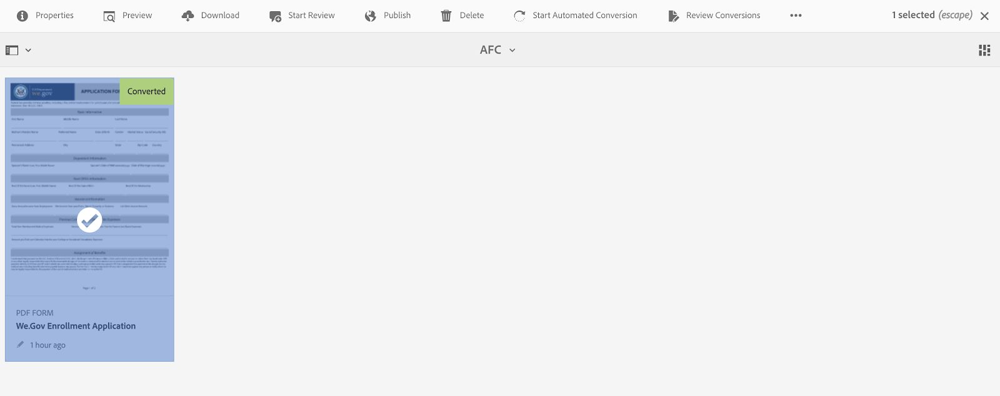
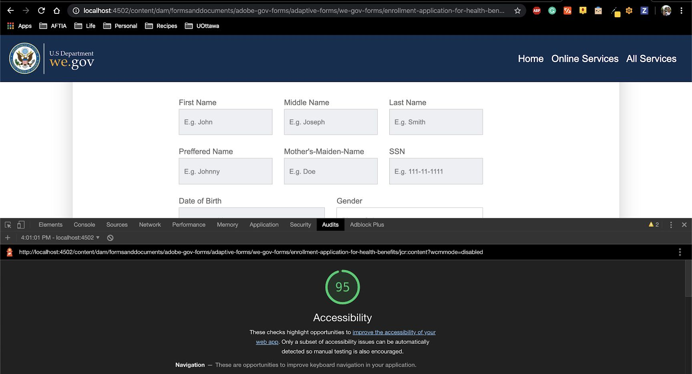

# Configurar e configurar o site de referência We.Gov e We.Finance {#set-up-and-configure-we-gov-reference-site}

## Detalhes do pacote de demonstração {#demo-package-details}

### Pré-requisitos de instalação {#installation-prerequisites}

Este pacote foi criado para o autor **OSGI** AEM Forms 6.4, foi testado e, portanto, é suportado nas seguintes versões da plataforma:

| VERSÃO AEM | VERSÃO DO PACOTE AEM Forms | STATUS |
|---|---|---|
| 6.4 | 5.0.86 | **Compatível** |
| 6,5 | 6.0.80 | **Compatível** |
| 6.5.3 | 6.0.122 | **Compatível** |

Este pacote contém a configuração em nuvem que suporta as seguintes versões de plataforma:

| PROVEDOR DE NUVEM | VERSÃO DE SERVIÇO | STATUS |
|---|---|---|
| Adobe Sign | API v5 | **Compatível** |
| Microsoft Dynamics 365 | 1710 (9.1.0.3020) | **Compatível** |
| Adobe Analytics | v1.4 Rest API | **Compatível** |
**Considerações sobre a instalação do pacote:**

* Espera-se que o pacote seja instalado em um servidor limpo, livre de outros pacotes de demonstração ou versões mais antigas do pacote de demonstração
* Espera-se que o pacote esteja instalado em um servidor OSGI, em execução no modo Autor

### O que este pacote inclui {#what-does-this-package-include}

O pacote [de demonstração](https://experience.adobe.com/#/downloads/content/software-distribution/en/aem.html?package=/content/software-distribution/en/details.html/content/dam/aem/public/adobe/packages/cq650/featurepack/we-gov-forms.pkg.all-2.0.2.zip) AEM Forms We.Gov (**we-gov-forms.pkg.all-&lt;version>.zip**) é fornecido como um pacote que inclui vários outros subpacotes e serviços. O pacote inclui os seguintes módulos:

* **we-gov-forms.pkg.all-&lt;versão>.zip** - Pacote de demonstração *completo*

   * **we-gov-forms.ui.apps-&lt;versão>.zip** *- contém todos os componentes, bibliotecas clientes, usuários de amostras, modelos de fluxo de trabalho etc.*

      * **we-gov-forms.core-&lt;version>.jar** - *Contém todos os serviços OSGI, implementação de etapa de fluxo de trabalho personalizada etc.*

      * **we-gov-forms.derby&lt;version>.jar** - *Contém todos os serviços OSGI, schema de banco de dados etc.*

      * **core.wcm.components.all-2.0.4.zip** - *Coleção de componentes WCM de amostra*

      * **grid-aem.ui.apps-1.0-SNAPSHOT.zip** - pacote de layout Grade da *AEM Sites para controle de coluna da página Sites*
   * **we-gov-forms.ui.content-&lt;versão>.zip** - *Contém todo o conteúdo, páginas, imagens, formulários, ativos de comunicação interativos etc.*

   * **we-gov-forms.ui.analytics-&lt;versão>.zip** - *Contém todos os dados do We.Gov Forms Analytics a serem armazenados no repositório.*

   * **we-gov-forms.config.public-&lt;version>.zip** - *Contém todos os nós de configuração padrão, incluindo configurações de nuvem de espaço reservado para ajudar a evitar problemas de modelo de dados de formulários e de vínculo de serviço.*

Os ativos incluídos neste pacote incluem:

* AEM páginas do site com modelos editáveis
* Forms adaptável AEM Forms
* AEM Forms Interative Communications (Canal da Web e Impressão)
* documento de registro AEM Forms XDP
* AEM Forms MS Dynamics Forms Data Model
* Integração Adobe Sign
* Modelo de Fluxo de Trabalho AEM
* Imagens de exemplo do AEM Assets
* Amostra (em memória) Apache Derby Database
* Fonte de Dados Derby Apache (para uso com o Modelo de Dados de Formulário)

## Instalação do pacote de demonstração {#demo-package-installation}

Esta seção contém informações sobre como instalar o pacote de demonstração.

### Da distribuição de software {#from-software-distribution}

1. Distribuição [de](https://experience.adobe.com/downloads)software aberta. Você precisa de uma Adobe ID para fazer logon na Software Distribution (Distribuição de software).
1. Toque em **[!UICONTROL Adobe Experience Manager]** disponível no menu de cabeçalho.
1. Na seção **[!UICONTROL Filtros]** :
   1. Selecione **[!UICONTROL Forms]** na lista suspensa **[!UICONTROL Solução]** .
   2. Selecione a versão e o tipo do pacote. Você também pode usar a opção **[!UICONTROL Pesquisar downloads]** para filtrar os resultados.
1. Toque no nome do pacote **we-gov-forms.pkg.all-&lt;versão>.zip** , selecione **[!UICONTROL Aceitar termos]** EULA e toque em **[!UICONTROL Download]**.
1. Abra o Gerenciador [de](https://docs.adobe.com/content/help/en/experience-manager-65/administering/contentmanagement/package-manager.html) pacotes e clique em **[!UICONTROL Carregar pacote]** para fazer upload do pacote.
1. Select the package and click **[!UICONTROL Install]**.

   

1. Permita a conclusão do processo de instalação.
1. Navegue até *https://&lt;aemserver>:&lt;port>/content/we-gov/home.html?wcmmode=disabled* para garantir que a instalação foi bem-sucedida.

### De um arquivo ZIP local {#from-a-local-zip-file}

1. Baixe e localize o arquivo **we-gov-forms.pkg.all-&lt;versão>.zip** .
1. Navegue até *https://&lt;aemserver>:&lt;port>/crx/packmgr/index.jsp*.
1. Selecione a opção &quot;Carregar pacote&quot;.

   

1. Use o navegador de arquivos para navegar até o arquivo ZIP baixado e selecioná-lo.
1. Clique em &quot;Abrir&quot; para fazer upload.
1. Depois de carregado, selecione a opção &quot;Instalar&quot; para instalar o pacote.

   

1. Permita a conclusão do processo de instalação.
1. Navegue até *https://&lt;aemserver>:&lt;port>/content/we-gov/home.html?wcmmode=disabled* para garantir que a instalação foi bem-sucedida.

### Instalação de novas versões de pacote {#installing-new-package-versions}

Para instalar a nova versão do pacote, siga as etapas definidas em 4.1 e 4.2. É possível instalar uma versão mais recente do pacote enquanto outro pacote mais antigo já estiver instalado, mas recomenda-se desinstalar a versão mais antiga do pacote primeiro. Para isso, siga as etapas abaixo.

1. Navegue até *https://&lt;aemserver>:&lt;porta>/crx/packmgr/index.jsp*
1. Localize o arquivo **we-gov-forms.pkg.all-&lt;versão>.zip** antigo.
1. Selecione a opção &quot;Mais&quot;.
1. Na lista suspensa, selecione a opção &quot;Desinstalar&quot;.

   

1. Na confirmação, selecione &quot;Desinstalar&quot; novamente e permita que o processo de desinstalação seja concluído.

## Configuração do pacote de demonstração {#demo-package-configuration}

Esta seção contém detalhes e instruções sobre a configuração pós-implantação do pacote de demonstração antes da apresentação.

### Configuração fictícia do usuário {#fictional-user-configuration}

1. Navegue até *https://&lt;aemserver>:&lt;porta>/libs/granite/security/content/groupadmin.html*
1. Faça logon como administrador para executar as tarefas abaixo.
1. Role até o final da página para carregar todos os grupos de usuários.
1. Procure por &quot;**fluxo de trabalho**&quot;.
1. Selecione o grupo &quot;**workflow-users**&quot; e clique em &quot;Propriedades&quot;.
1. Navegue até a guia &quot;Membros&quot;.
1. Digite **wegov** no campo &quot;Selecionar usuário ou grupo&quot;.
1. Selecione na lista suspensa &quot;Usuários **do Forms** We.Gov&quot;.

   

1. Clique em &quot;Salvar e fechar&quot; na barra de menus.
1. Repita as etapas de 2 a 7 pesquisando por &quot;**analytics**&quot;, selecionando o grupo &quot;Administradores **do** Analytics&quot; e adicionando o grupo &quot;Usuários **do** We.Gov Forms&quot; como membro.
1. Repita as etapas de 2 a 7 pesquisando &quot;usuários **de** formulários&quot;, selecionando o grupo &quot;**formulários-usuários** avançados&quot; e adicionando o grupo &quot;Usuários **do** We.Gov Forms&quot; como membro.
1. Repita as etapas de 2 a 7 pesquisando &quot;**formulários-usuários**&quot;, selecionando o grupo &quot;**formulários-usuários**&quot; e, dessa vez, adicionando o grupo &quot;Usuários **** We.Gov&quot; como membro.

### Configuração do servidor de email {#email-server-configuration}

1. Revisar a documentação de configuração [Configurando notificação por email](/help/sites-administering/notification.md)
1. Faça logon como administrador para executar esta tarefa.
1. Navegue até *https://&lt;aemserver>:&lt;porta>/system/console/configMgr*
1. Localize e clique no serviço **Day CQ Mail Service** para configurar.

   

1. Configure o serviço para se conectar ao servidor SMTP de sua escolha:

   1. **Nome do host** do Servidor SMTP: por exemplo (smtp.gmail.com)
   1. **Porta** do servidor: por exemplo (465) para o gmail que usa SSL
   1. **Usuário SMTP:** demo@ &lt;nome da empresa> .com
   1. **Endereço**&quot;De&quot;: aemformsdemo@adobe.com

   

1. Clique em &quot;Salvar&quot; para salvar a configuração.

### (Opcional) AEM Configuração SSL {#aemsslconfig}

Esta seção contém detalhes sobre como configurar o SSL na instância AEM para poder configurar a configuração da Adobe Sign Cloud.

**Referências:**

1. [SSL por padrão](/help/sites-administering/ssl-by-default.md)

**Notas:**

1. Navegue até https://&lt;aemserver>:&lt;port>/aem/inbox onde você poderá concluir o processo explicado no link de documentação de referência acima.
1. O `we-gov-forms.pkg.all-[version].zip` pacote inclui uma chave SSL de amostra e um certificado que podem ser acessados extraindo a `we-gov-forms.pkg.all-[version].zip/ssl` pasta que faz parte do pacote.

1. Certificado SSL e detalhes da chave:

   1. emitido para &quot;CN=localhost&quot;
   1. Validade de 10 anos
   1. valor da senha de &quot;password&quot;
1. A chave privada é *localhostprivate.der*.
1. O certificado é o *localhost.crt*.
1. Clique em Avançar.
1. O nome do host HTTPS deve ser definido como *localhost*.
1. A porta deve ser definida como uma porta exposta pelo sistema.

### (Optional) Adobe Sign cloud configuration {#adobe-sign-cloud-configuration}

Esta seção contém detalhes e instruções sobre a Configuração da Adobe Sign Cloud.

**Referências:**

1. [Integrar o Adobe Sign ao AEM Forms](adobe-sign-integration-adaptive-forms.md)

#### Cloud configuration {#cloud-configuration}

1. Revise os pré-requisitos. Consulte [AEM Configuração](../../forms/using/forms-install-configure-gov-reference-site.md#aemsslconfig) SSL para obter a configuração SSL necessária.
1. Vá até:

   *https://&lt;aemserver>:&lt;porta>/libs/adobesign/cloudservices/adobesign.html/conf/we-gov*

   >[!NOTE]
   >
   >O URL usado para acessar o servidor AEM deve corresponder ao URL configurado no URI de redirecionamento OAuth da Adobe Sign para evitar problemas de configuração (por exemplo, *https://&lt;aemserver>:&lt;porta>/mnt/overlay/adobesign/cloudservices/adobesign/properties.html*)

1. Selecione a configuração &quot;We.gov Adobe Sign&quot;.
1. Clique em &quot;Propriedades&quot;.
1. Navegue até a guia &quot;Configurações&quot;.
1. Insira o URL do oAuth, por exemplo: [https://secure.na1.echosign.com/public/oauth](https://secure.na1.echosign.com/public/oauth)
1. Forneça a ID do cliente e o segredo do cliente configurados da instância do Adobe Sign configurada.
1. Clique em &quot;Conectar-se ao Adobe Sign&quot;.
1. Após a conexão bem-sucedida, clique em &quot;Salvar e fechar&quot; para concluir a integração.

### (Opcional) Configuração da nuvem do MS Dynamics {#ms-dynamics-cloud-configuration}

Esta seção contém detalhes e instruções sobre a Configuração do MS Dynamics Cloud.

**Referências:**

1. [Configuração do Microsoft Dynamics OData](https://docs.adobe.com/content/help/en/experience-manager-64/forms/form-data-model/ms-dynamics-odata-configuration.html)
1. [Configuração do Microsoft Dynamics para AEM Forms](https://helpx.adobe.com/experience-manager/kt/forms/using/config-dynamics-for-aem-forms.html)

#### Serviço em nuvem do MS Dynamics OData {#ms-dynamics-odata-cloud-service}

1. Vá até:

   https://&lt;aemserver>:&lt;porta>/libs/fd/fdm/gui/components/admin/fdmcloudservice/fdm.html/conf/we-gov

   1. Verifique se você está acessando o servidor usando o mesmo URL de redirecionamento configurado no registro do aplicativo do MS Dynamics.

1. Selecione a configuração &quot;Cloud Service OData do Microsoft Dynamics&quot;.
1. Clique em &quot;Propriedades&quot;.

   

1. Navegue até a guia &quot;Configurações de autenticação&quot;.
1. Digite os seguintes detalhes:

   1. **Raiz do serviço:** por exemplo, https://msdynamicsserver.api.crm3.dynamics.com/api/data/v9.1/
   1. **Tipo de autenticação:** OAuth 2.0
   1. **Configurações** de autenticação (consulte Configurações [de configuração da nuvem do](../../forms/using/forms-install-configure-gov-reference-site.md#dynamicsconfig) MS Dynamics para coletar essas informações):

      1. ID do cliente - também conhecido como ID da aplicação
      1. Client Secret
      1. URL OAuth - por exemplo, [https://login.windows.net/common/oauth2/authorize](https://login.windows.net/common/oauth2/authorize)
      1. Atualizar URL do token - por exemplo, [https://login.windows.net/common/oauth2/token](https://login.windows.net/common/oauth2/token)
      1. URL do token de acesso - por exemplo, [https://login.windows.net/common/oauth2/token](https://login.windows.net/common/oauth2/token)
      1. Âmbito de autorização - **open**
      1. Cabeçalho de autenticação - Portador de **autorização**
      1. Recurso - por exemplo, [https://msdynamicsserver.api.crm3.dynamics.com](https://msdynamicsserver.api.crm3.dynamics.com)
   1. Clique em &quot;Conectar-se ao OAuth&quot;.

1. Após a autenticação bem-sucedida, clique em &quot;Salvar e fechar&quot; para concluir a integração.

#### Configurações de nuvem do MS Dynamics {#dynamicsconfig}

As etapas detalhadas nesta seção são incluídas para ajudá-lo a localizar a ID do cliente, o Segredo do cliente e os detalhes da sua instância do MS Dynamics Cloud.

1. Navegue até [https://portal.azure.com/](https://portal.azure.com/) e faça logon.
1. No menu esquerdo, selecione &quot;Todos os serviços&quot;.
1. Procure ou navegue até &quot;App Registration&quot;.
1. Crie ou selecione um registro de aplicativo existente.
1. Copie o **ID da aplicação** a ser usado como a Id **do** cliente OAuth na configuração da nuvem AEM
1. Clique em &quot;Configurações&quot; ou &quot;Manifesto&quot; para configurar os URLs de **resposta.**

   1. Esse URL deve corresponder ao URL usado para acessar o servidor AEM ao configurar o serviço OData.

1. Na visualização Setting (Configuração), clique em &quot;Keys&quot; (Teclas) para que a visualização crie uma nova chave (isso é usado como o Segredo do cliente no AEM ).

   1. Certifique-se de manter uma cópia da chave, pois não será possível visualização mais tarde no Azure ou no AEM.

1. Para localizar o URL do recurso/URL raiz do serviço, navegue até o painel da instância do MS Dynamics.
1. Na barra de navegação superior, clique em &quot;Vendas&quot; ou no seu próprio tipo de instância e em &quot;Selecionar configurações&quot;.
1. Clique em &quot;Personalizações&quot; e &quot;Recursos do desenvolvedor&quot;, perto da parte inferior direita.
1. Lá você encontrará o URL raiz do serviço: por exemplo

   *[https://msdynamicsserver.api.crm3.dynamics.com/api/data/v9.1/](https://msdynamicsserver.api.crm3.dynamics.com/api/data/v9.1/)*

1. Detalhes sobre o URL de atualização e Token de acesso estão disponíveis aqui:

   *[https://docs.microsoft.com/en-us/rest/api/datacatalog/authenticate-a-client-app](https://docs.microsoft.com/en-us/rest/api/datacatalog/authenticate-a-client-app)*

#### Teste do Forms Data Model (Dinâmico) {#testing-the-form-data-model}

Quando a configuração em nuvem estiver concluída, talvez você queira testar o modelo de dados do formulário.

1. Vá até

   *https://&lt;aemserver>:&lt;porta>/aem/forms.html/content/dam/formsanddocuments-fdm/we-gov*

1. Selecione &quot;We.gov Microsoft Dynamics CRM FDM&quot; e selecione &quot;Propriedades&quot;.

   

1. Navegue até a guia &quot;Atualizar fonte&quot;.
1. Verifique se a &quot;Configuração sensível ao contexto&quot; está definida como &quot;/conf/we-gov&quot; e se a fonte de dados configurada é &quot;ms-dynamics-odata-cloud-service&quot;.

   

1. Edite o Modelo de dados de formulário.

1. Teste os serviços para garantir que eles se conectem com êxito à Fonte de Dados configurada.

   >[!NOTE]
   Depois de testar os serviços, clique em **Cancelar** para garantir que as alterações involuntárias não sejam propagadas para o Modelo de dados de formulário.

   >[!NOTE]
   Foi relatado que era necessário reiniciar o Servidor AEM para que a Fonte de Dados se vinculasse com êxito ao FDM.

#### Teste do Forms Data Model (Derby) {#test-fdm-derby}

Quando a configuração em nuvem estiver concluída, talvez você queira testar o modelo de dados de formulários.

1. Navegue até *https://&lt;aemserver>:&lt;porta>/aem/forms.html/content/dam/formsanddocuments-fdm/we-gov*

1. Selecione o FDM **de inscrição** We.gov e selecione **Propriedades**.

   

1. Navegue até a guia **Atualizar origem** .

1. Verifique se a Configuração **sensível ao** contexto está definida como `/conf/we-gov` e se a fonte de dados configurada é **We.Gov Derby DS**.

   

1. Click on **Save and Close**.

1. [Teste os serviços](work-with-form-data-model.md#test-data-model-objects-and-services) para garantir que eles se conectem com êxito à Fonte de Dados configurada

   * Para testar a conexão, selecione a conta **HOMEMORTGAGEACCOUNT** e forneça um serviço get. Teste o serviço e os administradores do sistema podem ver os dados sendo recuperados.

### Configuração do Adobe Analytics (opcional) {#adobe-analytics-configuration}

Esta seção contém detalhes e instruções sobre a Configuração Adobe Analytics Cloud.

**Referências:**

* [Integração ao Adobe Analytics](../../sites-administering/adobeanalytics.md)

* [Conectando-se ao Adobe Analytics e criando estruturas](../../sites-administering/adobeanalytics-connect.md)

* [Visualizar dados de análise de página](../../sites-authoring/pa-using.md)

* [Configuração de análises e relatórios](configure-analytics-forms-documents.md)

* [Visualização e compreensão dos relatórios de análise da AEM Forms](view-understand-aem-forms-analytics-reports.md)

### Configuração do serviço em nuvem da Adobe Analytics {#adobe-analytics-cloud-service-configuration}

Este pacote vem pré-configurado para se conectar ao Adobe Analytics. As etapas abaixo são fornecidas para permitir que essa configuração seja atualizada.

1. Navegue até *https://&lt;aemserver>:&lt;porta>/libs/cq/core/content/tools/cloudservices.html*
1. Localize a seção Adobe Analytics e selecione o link &quot;Mostrar configurações&quot;.
1. Selecione a configuração &quot;We.Gov Adobe Analytics (Analytics Configuration)&quot;.

   

1. Clique no botão &quot;Editar&quot; para atualizar a configuração do Adobe Analytics (será necessário fornecer o Segredo compartilhado). Clique em &quot;Conectar-se ao Analytics&quot; para se conectar e em &quot;OK&quot; para concluir.

   

1. Na mesma página, clique em &quot;We.Gov Adobe Analytics Framework (Analytics Framework)&quot; se desejar atualizar as configurações da estrutura (consulte [Ativar criação](../../forms/using/forms-install-configure-gov-reference-site.md#enableauthoring) AEM para ativar a criação).

#### Adobe Analytics Localizando credenciais do usuário {#analytics-locating-user-credentials}

Para localizar as credenciais de usuário para uma conta Adobe Analytics, o administrador da conta deve executar as seguintes tarefas.

1. Navegue até o portal da Adobe Experience Cloud.
   * Faça logon com suas credenciais de administrador
1. Selecione o ícone Adobe Analytics no painel principal.
   
1. Navegue até a guia Administrador e selecione o item Gerenciamento de usuários (Herdado)
   
1. Select the **Users** tab.
   
1. Selecione o usuário desejado na lista de usuários.
1. Role até a parte inferior da página e as informações de autenticação dos usuários aparecerão na parte inferior da página.
   
1. O nome de usuário e as informações de segredo compartilhado serão exibidos no lado direito da caixa de permissões.
1. Observe que o nome de usuário terá dois pontos dentro do nome e todas as informações à esquerda do dois pontos serão o nome de usuário, e todas as informações à direita do dois pontos serão o nome da empresa.
   * Veja um exemplo disso: *nome de usuário: Nome da empresa*

#### Configurar autenticação de usuário no Adobe Analytics {#setup-user-authentication}

Os administradores podem fornecer aos usuários permissões de análise AEM executando as seguintes ações.

1. Navegue até o Adobe Admin Console.

1. Clique na instância do Analytics exposta ao Admin Console.

   * Isso está localizado na página principal da página do administrador.

1. Selecione Acesso completo ao administrador do Analytics.

1. Adicione um usuário ao Perfil.

   

1. Clique na guia Permissões depois que a ID do usuário tiver sido mapeada para o perfil.

1. Verifique se todas as permissões estão mapeadas para o perfil.

   

1. Observe que, uma vez que as permissões tenham sido mapeadas sobre a capacidade de um usuário fazer logon, isso pode levar algumas horas.

### relatórios Adobe Analytics {#adobe-analytics-reporting}

#### Relatórios de sites Visualização Adobe Analytics {#view-adobe-analytics-sites-reporting}

>[!NOTE]
Os dados do AEM Forms Analytics estão disponíveis offline ou sem uma configuração de nuvem do Adobe Analytics se o `we-gov-forms.ui.analytics-<version>.zip` pacote estiver instalado, mas os dados do AEM Sites exigem uma configuração de nuvem ativa.

1. Navegue até *https://&lt;aemserver>:&lt;porta>/sites.html/content*
1. Selecione &quot;Site do AEM Forms We.Gov&quot; para visualização das páginas do site.
1. Selecione uma da página do site (por exemplo, Início) e escolha &quot;Analytics &amp; Recommendations&quot;.

   

1. Nesta página, você verá informações obtidas do Adobe Analytics que pertencem à página do AEM Sites (observação: por padrão, essas informações são atualizadas periodicamente da Adobe Analytics e não são exibidas em tempo real).

   

1. De volta à página de visualização da página (acessada na etapa 3.), você também pode visualização as informações de visualização da página alterando a configuração de exibição para itens de visualização na &quot;Visualização de Lista&quot;.
1. Localize o menu suspenso &quot;Visualização&quot; e selecione &quot;Visualização da Lista&quot;.

   

1. No mesmo menu, selecione &quot;Configuração de Visualização&quot; e selecione as colunas que deseja exibir na seção &quot;Analytics&quot;.

   

1. Clique em &quot;Atualizar&quot; para disponibilizar as novas colunas.

   

#### Relatórios de formulários Visualização Adobe Analytics {#view-adobe-analytics-forms-reporting}

>[!NOTE]
Os dados do AEM Forms Analytics estão disponíveis offline ou sem uma configuração de nuvem do Adobe Analytics se o `we-gov-forms.ui.analytics-<version>.zip` pacote estiver instalado, mas os dados do AEM Sites exigem uma configuração de nuvem ativa.

1. Vá até

   *https://&lt;aemserver>:&lt;porta>/aem/forms.html/content/dam/formsanddocuments/adobe-gov-forms*

1. Selecione o formulário adaptativo &quot;Aplicativo de inscrição para benefícios de saúde&quot; e selecione a opção &quot;Relatório do Analytics&quot;.

   

1. Aguarde a página ser carregada e visualização nos dados do Analytics Report.

   

### Ativação da configuração do Adobe Automated Forms {#automated-forms-enablement}

Para instalar e configurar o AEM Forms com o Adobe Forms, os usuários da ferramenta de conversão devem ter o seguinte:

1. Acesso ao Adobe IO.

1. Permissão para criar uma integração com o serviço Adobe Forms Conversion.

1. Adobe AEM 6.5 o service pack mais recente em execução como um Autor.

Leia o seguinte antes de ler mais instruções:

* [Configurar o serviço de conversão automática de formulários](https://docs.adobe.com/content/help/en/aem-forms-automated-conversion-service/using/configure-service.html)

#### Criando uma configuração IMS Parte 1 {#creating-ims-config}

Para configurar o serviço para se comunicar corretamente com a ferramenta de conversão de formulários, os usuários devem configurar o serviço Identity Management System (IMS) para se registrarem com E/S de Adobe.

1. Navegue até https://&lt;aemserver>:&lt;porta> > Clique em Adobe Experience Manager na parte superior esquerda > Ferramentas > Segurança > Configuração do Adobe IMS.

1. Clique em Criar.

1. Execute as ações na imagem abaixo.

   

1. Certifique-se de baixar o certificado.

1. Não continue com o restante da seção de configuração - revisão [Criação de integração na E/S do Adobe](#create-integration-adobeio)

>[!NOTE]
O certificado criado nesta seção será usado para criar o serviço de integração em E/S de Adobe. Depois que os usuários criarem no serviço de integração, os usuários poderão usar essas informações da E/S do Adobe para concluir a configuração.

#### Criando integração em E/S de Adobe {#create-integration-adobeio}

Certifique-se de que você tenha a capacidade de criar uma integração dentro do domínio do Adobe se não entrar em contato com o administrador do sistema para fazer isso.

1. Navegue até o Console [de E/S do](https://console.adobe.io/)Adobe.

1. Clique em Criar integração.

1. Selecione Acessar uma API.

1. Verifique se você está no grupo correto (lista suspensa superior direito).

1. Na seção Experience Cloud, selecione Forms Conversion Tool.

1. Clique em Continuar.

1. Insira o nome e a descrição da sua integração.

1. Usar a chave pública na Seção 2.1 coloca-a dentro da integração da chave.

1. Selecione um perfil para a conversão automática de formulários.

   

#### Criando Configuração IMS Parte 2 {#create-ims-config-part-next}

Agora que você criou uma integração, conclua a instalação da configuração do IMS.

1. Clique em sua integração dentro da E/S do Adobe para expor os detalhes da conexão.

1. Navegue até a configuração do IMS em AEM (Ferramentas > Segurança > IMS)

1. Clique em Next (Avançar) na tela IMS Configuration (Configuração IMS).

1. Digite o servidor de autorização (valor exibido na captura de tela).

1. Insira a chave da API.

1. Digite o segredo do cliente (é necessário clicar em expor na integração na I/O do Adobe para que ela seja revelada).

1. Clique na guia JWT em E/S de Adobe para obter a carga JWT e colá-la na carga da configuração IMS.

   

1. Depois de criados, clique em Configuração IMS e selecione Verificação de integridade, os usuários devem ver o seguinte resultado.

   

#### Configuração da Configuração da Nuvem (Produção AFC We.Gov) {#configure-cloud-configuration}

Quando a configuração do IMS estiver concluída, poderemos continuar a revisar a configuração da nuvem no AEM. Se a configuração não existir, use as seguintes etapas para criar a configuração de nuvem no AEM:

1. Abra o navegador e navegue até o URL do sistema https://&lt;nome_do_domínio>:&lt;porta_do_sistema>

1. Clique em Adobe Experience Manager no canto superior esquerdo da tela > Ferramentas > Cloud Services > Configuração automatizada da conversa Forms.

1. Selecione a pasta de configuração na qual deseja colocar a configuração.

1. Clique em Criar.

1. Digite as informações na captura de tela abaixo.

   

1. Forneça à configuração um Título e um Nome.

1. O URL de serviço do sistema está definido como https://aemformsconversion.adobe.io/.

1. URL do modelo */conf/we-gov/settings/wcm/models/we-gov-flamingo-template*.

1. URL do tema: */content/dam/formsanddocuments-temas/adobe-gov-forms-temas/we-gov-topics*

1. Clique em Avançar.

1. Para essa configuração, deixamos os dois valores de caixa de seleção vazios.

   * Para saber mais sobre essas opções, consulte [Configurar o serviço](https://docs.adobe.com/content/help/en/aem-forms-automated-conversion-service/using/configure-service.html#configure-the-cloud-service)em nuvem.

#### Configuração da Configuração da Nuvem (Produção AFC We.Finance) {#configure-cloud-configuration-wefinance}

Quando a configuração do IMS estiver concluída, poderemos continuar a criar a configuração da nuvem no AEM.

1. Abra o navegador e navegue até o URL do sistema https://&lt;nome_do_domínio>:&lt;porta_do_sistema>

1. Clique em Adobe Experience Manager no canto superior esquerdo da tela > Ferramentas > Cloud Services > Configuração automatizada da conversa Forms.

1. Selecione a pasta de configuração na qual deseja colocar a configuração.

1. Clique em Criar.

1. Digite as informações na captura de tela abaixo.

   

1. Forneça à configuração um Título e um Nome.

1. O URL de serviço do sistema está definido como https://aemformsconversion.adobe.io/

1. URL do modelo: */conf/we-finance/settings/wcm/models/we-finance-adaptive-form*

1. URL do tema: */content/dam/formsanddocuments-temas/adobe-finance-forms-temas/we-finance-theme*

1. Clique em Avançar.

1. Para essa configuração, deixamos os dois valores de caixa de seleção vazios.

   * Para saber mais sobre essas opções, consulte [Configurar o serviço](https://docs.adobe.com/content/help/en/aem-forms-automated-conversion-service/using/configure-service.html#configure-the-cloud-service)em nuvem.

#### Testando a conversão de formulários (Aplicativo de inscrição We.Gov) {#test-forms-conversion}

Depois que a configuração for configurada, os usuários poderão testá-la fazendo upload de um documento PDF.

1. Navegue até o sistema AEM https://&lt;nome_do_domínio>:&lt;porta_do_sistema>

1. Clique em Forms > Forms e Documentos > AEM Forms We.gov Forms > AFC.

1. Selecione o PDF Aplicativo de inscrição We.Gov.

1. Clique no botão Conversão **automatizada do** Start no canto superior direito.

1. Os usuários devem poder ver a opção como mostrado abaixo.

   

1. Depois que o botão for selecionado, os usuários receberão as seguintes opções

   * Certifique-se de que os usuários selecionem a configuração de produção *AFC* We.Gov

   

   

1. Selecione a conversão de start depois de configurar todas as opções que você gostaria de usar.

1. À medida que o processo de conversão é iniciado, os usuários devem ver a seguinte tela:

   

1. Quando a conversão for concluída, os usuários verão a seguinte tela:

   

   Clique na pasta **Saída** para visualização do formulário adaptativo gerado.

#### Problemas conhecidos e notas {#known-issues-notes}

O serviço de conversão automatizada da Forms inclui certas práticas [recomendadas, padrões](https://docs.adobe.com/content/help/en/aem-forms-automated-conversion-service/using/styles-and-pattern-considerations-and-best-practices.html)complexos conhecidos e problemas conhecidos. Revise esses itens antes de começar a usar o serviço de Conversão Forms Automatizada da AEM Forms.

1. Gerar o formulário com Gerar formulários adaptativos sem vínculos de dados ativados se você deseja vincular o formulário a um FDM após a conversão.

1. Certifique-se de que a pasta de modelo tenha a permissão jcr:read para todos ativada ou de que o usuário do serviço não consiga ler o modelo a partir do repositório e a conversão falhará.

## Personalizações do pacote de demonstração {#demo-package-customizations}

Esta seção inclui instruções sobre a personalização da demonstração.

### Personalização de modelos {#templates-customization}

Modelos editáveis podem ser encontrados no seguinte local:

*https://&lt;aemserver>:&lt;porta>/libs/wcm/core/content/sites/templates.html/conf/we-gov*

Esses modelos incluem os modelos Site AEM, Formulário adaptativo e Comunicações interativas, criados e montados com componentes que podem ser encontrados em:

*https://&lt;aemserver>:&lt;porta>/crx/de/index.jsp#/apps/we-gov/components*

#### Style system {#customizetemplates}

Este site também possui bibliotecas de clientes, uma das quais importa o Bootstrap 4 ( [https://getbootstrap.com/](https://getbootstrap.com/) ). Esta biblioteca de cliente está disponível em

*https://&lt;aemserver>:&lt;porta>/crx/de/index.jsp#/apps/we-gov/clientlibs/clientlib-base/css/bootstrap*

Os modelos editáveis incluídos neste pacote também vêm pré-configurados com políticas de modelo/página que usam as classes CSS do Bootstrap 4 para paginação, estilo etc. Nem todas as classes foram adicionadas às políticas de modelo, mas qualquer classe suportada pelo Bootstrap 4 pode ser adicionada às políticas. Consulte a página de introdução para obter uma lista das classes disponíveis:

[https://getbootstrap.com/docs/4.1/getting-started/introduction/](https://getbootstrap.com/docs/4.1/getting-started/introduction/)

Os modelos incluídos neste pacote também suportam o Sistema de estilo:

[Sistema de estilos](../../sites-authoring/style-system.md)

#### Logotipos para modelos {#template-logos}

Os ativos DAM do projeto também incluem logotipos e imagens We.Gov. Esses ativos estão disponíveis em:

*https://&lt;aemserver>:&lt;porta>/assets.html/content/dam/we-gov*

Ao editar a página e os modelos de formulário, é possível optar por atualizar os logotipos de marca ao editar os componentes de Navegação e Rodapé. Esses componentes ofertas uma caixa de diálogo configurável de marca e logotipo que pode ser usada para atualizar logotipos:

Consulte Edição do conteúdo da página para obter mais informações:

[Editar conteúdo da página](../../sites-authoring/editing-content.md)

### Personalização de páginas de sites {#sites-pages-customization}

Todas as páginas do site estão disponíveis em: *https://&lt;aemserver>:&lt;porta>/sites.html/content/we-gov*

Essas páginas do site também usam o pacote Grade AEM para controlar o layout de alguns componentes.

#### Style system {#style-system}

As páginas incluídas neste pacote também suportam o Sistema de estilo:

[Sistema de estilos](../../sites-authoring/style-system.md)

Você também pode consultar o sistema [de estilo de personalização de](../../forms/using/forms-install-configure-gov-reference-site.md#customizetemplates) Modelos para obter a documentação sobre estilos suportados.

### Personalização de formulários adaptáveis {#adaptive-forms-customization}

Todos os formulários adaptáveis estão disponíveis em:

*https://&lt;aemserver>:&lt;porta>/aem/forms.html/content/dam/formsanddocuments/adobe-gov-forms*

Esses formulários podem ser personalizados para se ajustarem a determinados casos de uso. Observe que determinados campos e a lógica de envio não devem ser modificados para garantir que o formulário continue a funcionar corretamente. Isso inclui:

**Aplicativo De Inscrição Para Benefícios De Integridade:**

* contact_id - campo oculto usado para receber a ID de contato do MS Dynamics durante o envio
* Enviar - A lógica do botão Enviar requer personalização para suportar retornos de chamada. A personalização está documentada, mas um script grande foi necessário para enviar o formulário e, ao mesmo tempo, executar uma operação de POST e GET para o MS Dynamics por meio do Forms Data Model.
* Painel raiz - Inicializar evento é usado para adicionar um botão do MS Dynamics à Caixa de entrada AEM da maneira menos intrusiva possível, pois todos os componentes da interface de usuário AEM Inbox Granite não podem ser modificados.

#### Estilo de formulário adaptável {#adaptive-form-styling}

Os formulários adaptáveis também podem ser estilizados usando o Editor de estilos ou o Editor de temas:

* [Estilo em linha de componentes de formulário adaptáveis](inline-style-adaptive-forms.md)
* [Criação e uso de temas](themes.md)

### Personalização do fluxo de trabalho {#workflow-customization}

O Formulário adaptável de inscrição é enviado para um fluxo de trabalho OSGI para processamento. Este fluxo de trabalho pode ser encontrado em *https://&lt;aemserver>:&lt;porta>/conf/we-gov/settings/models/we-gov-process.html*.

Devido a certas limitações, esse fluxo de trabalho contém vários scripts e etapas personalizadas do processo de fluxo de trabalho OSGI. Essas etapas do fluxo de trabalho foram criadas como etapas genéricas e não foram criadas com caixas de diálogo de configuração. No momento, a configuração das etapas do fluxo de trabalho depende de argumentos do processo.

Todo o código Java da etapa do fluxo de trabalho está contido no pacote **we-gov-forms.core-&lt;versão>.jar** .

## Considerações de demonstração e problemas conhecidos {#demo-considerations-and-known-issues}

Esta seção contém informações sobre recursos de demonstração e decisões de design que podem exigir considerações especiais durante o processo de demonstração.

### Considerações de demonstração {#demo-considerations}

* Conforme o AGRS-159, verifique se o nome (primeiro, meio e último) do contato usado no Formulário adaptável de inscrição é único.
* O formulário adaptável de inscrição enviará o email da Adobe Sign para o email especificado no campo de email do formulário. Esse endereço de email não pode ser o mesmo endereço de email usado para configurar a configuração da nuvem do Adobe Sign.

### Problemas conhecidos {#known-issues}

* (AGRS-120) No momento, o componente de Navegação do site não suporta páginas secundárias aninhadas com mais de 2 níveis de profundidade.
* (AGRS-159) O FDM atual do MS Dynamics precisa executar duas operações primeiro, POST os dados do Formulário adaptável de inscrição para o Dynamics e, em seguida, buscar o registro do usuário para recuperar a ID de contato. No estado atual, a busca da ID de contato falhará se mais de dois usuários com o mesmo nome estiverem presentes no Dynamics, o que não permitirá o envio do Formulário adaptável de inscrição.

## Configuração do teste de acessibilidade {#configure-accessibility-testing}

### Ativando o Acessibilidade Testando o Chrome Add On {#enable-chrome-add-on}

Para executar o teste de acessibilidade primeiro, é necessário instalar o plug-in do Chrome, isso pode ser encontrado [aqui](https://chrome.google.com/webstore/detail/accessibility-developer-t/fpkknkljclfencbdbgkenhalefipecmb?hl=en).

Depois de instalada, carregue a página que deseja testar no Chrome Browser (Observação: Ter várias guias abertas pode afetar sua pontuação, é preferível ter apenas uma guia aberta). Quando a página for carregada **, clique** com o botão direito do mouse na página e selecione a guia **Auditorias** . Lá os desenvolvedores podem selecionar o tipo de auditoria a ser realizada pelo plug-in Acessibilidade. Depois que todas as opções desejadas forem selecionadas, o usuário poderá selecionar o botão Gerar relatório. Isso gerará um documento PDF que mostra a classificação geral de acessibilidade e o que pode ser usado para aumentar a classificação geral de acessibilidade.

Após a execução do relatório, os usuários podem esperar o seguinte:

O número exibido na frente dos usuários é a classificação geral de acessibilidade que eles adquiriram. Há também uma descrição de como isso foi calculado após a pontuação.

Se os usuários desejarem exportar isso, poderão clicar nos três botões à direita da tela e selecionar entre as outras opções que o plug-in oferta.

### Tema Ultramarino {#ultramarine-theme}

O tema do Ultramarine publicamente disponível mantido pelo Adobe é incorporado ao`we-gov-forms.pkg.all-<version>.zip` arquivo ZIP instalável. Depois que este pacote for instalado usando o CRX.

Gerenciador de pacotes, os usuários podem acessar o tema do Ultramarine no AEM Forms navegando até **Forms** > **Temas** > Temas **de** referência > **Ultramarine-Accessible**.

## Opções de configuração {#configuration-options}

Os usuários podem configurar várias opções de serviço de fluxo de trabalho que incluem:

1. Entrada do Microsoft Dynamics
1. Adobe Sign
1. Gerenciamento de comunicações personalizadas AEM
1. Adobe Analytics

Para configurá-los para serem ativados no Fluxo de trabalho, os usuários precisam executar as seguintes tarefas.

1. Navegue até https://&#39;[server]:[port]&#39;/system/console/configMgr.

1. Localize as Configurações *WeGov*.

1. Abra a definição do serviço e permita que os serviços selecionados sejam chamados dentro do fluxo de trabalho.

>[!NOTE]
Como um usuário ativa o serviço na página do Configuration Manager, os usuários ainda precisam configurar uma configuração de serviço para se comunicar com os serviços externos solicitados.

1. Depois de concluído, clique no botão Salvar para salvar as configurações.

## Próximas etapas {#next-steps}

Agora todos estão prontos para explorar o site de referência We.Gov. Para obter mais informações sobre o fluxo de trabalho e as etapas do site de referência We.Gov, consulte Passo a passo do site de referência [We.Gov](../../forms/using/forms-gov-reference-site-user-demo.md).
