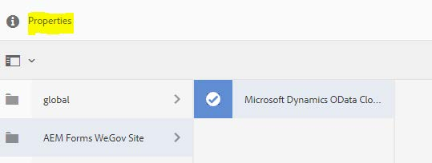
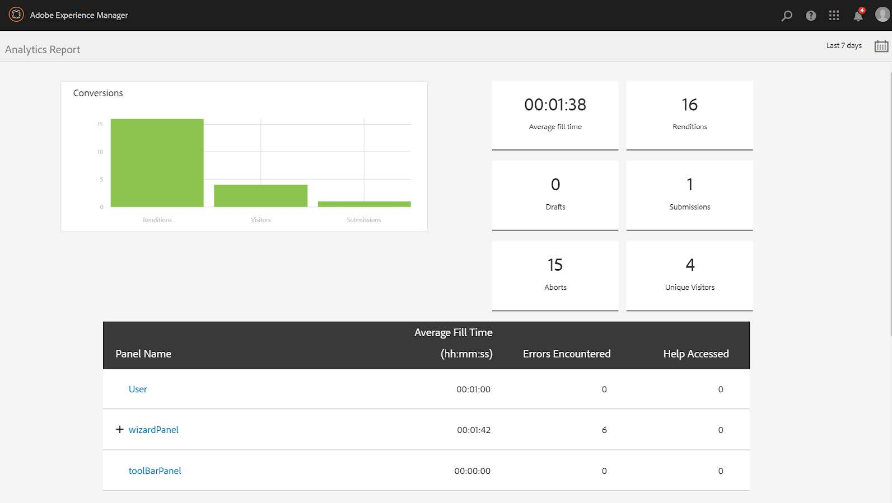
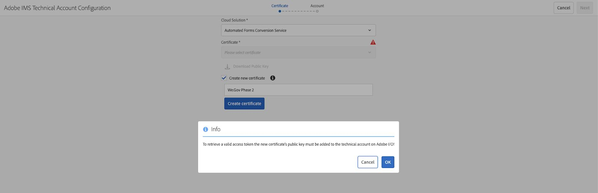
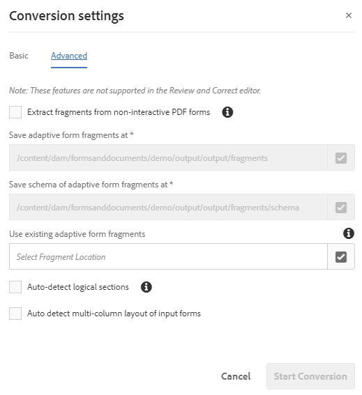

# Configurar e configurar o site de referência do We.Gov e do We.Finance {#set-up-and-configure-we-gov-reference-site}

## Detalhes do pacote de demonstração {#demo-package-details}

### Pré-requisitos de instalação {#installation-prerequisites}

Este pacote foi criado para **Autor do OSGI do AEM Forms 6.4**, foi testada e, portanto, é compatível com as seguintes versões da plataforma:

| VERSÃO AEM | VERSÃO DO PACOTE AEM Forms | STATUS |
|---|---|---|
| 6.4 | 5.0.86 | **Compatível** |
| 6,5 | 6.0.80 | **Compatível** |
| 6.5.3 | 6.0.122 | **Compatível** |

Este pacote contém a configuração de nuvem que suporta as seguintes versões de plataforma:

| PROVEDOR DE NUVEM | VERSÃO DO SERVIÇO | STATUS |
|---|---|---|
| Adobe Sign | API v5 | **Compatível** |
| Microsoft Dynamics 365 | 1710 (9.1.0.3020) | **Compatível** |
| Adobe Analytics | v1.4 Rest API | **Compatível** |
**Considerações sobre a instalação do pacote:**

* Espera-se que o pacote seja instalado em um servidor limpo, livre de outros pacotes de demonstração ou versões mais antigas do pacote de demonstração
* Espera-se que o pacote seja instalado em um servidor OSGI, em execução no modo Autor

### O que este pacote inclui {#what-does-this-package-include}

O [Pacote de demonstração We.Gov do AEM Forms](https://experience.adobe.com/#/downloads/content/software-distribution/en/aem.html?package=/content/software-distribution/en/details.html/content/dam/aem/public/adobe/packages/cq650/featurepack/we-gov-forms.pkg.all-2.0.2.zip) (**we-gov-forms.pkg.all-&lt;version>.zip**) vem como um pacote que inclui vários outros subpacotes e serviços. O pacote inclui os seguintes módulos:

* **we-gov-forms.pkg.all-&lt;version>.zip** - *Pacote de demonstração completo*

   * **we-gov-forms.ui.apps-&lt;version>.zip** *- Contém todos os componentes, bibliotecas de clientes, usuários de exemplo, modelos de fluxo de trabalho, etc.*

      * **we-gov-forms.core-&lt;version>.jar** - *Contém todos os serviços OSGI, implementação de etapas do fluxo de trabalho personalizado etc.*

      * **we-gov-forms.derby&lt;version>.jar** - *Contém todos os serviços OSGI, schema de banco de dados etc.*

      * **core.wcm.components.all-2.0.4.zip** - *Coleta de componentes WCM de amostra*

      * **grid-aem.ui.apps-1.0-SNAPSHOT.zip** - *Pacote de layout de Grade do AEM Sites para o controle de coluna da página Sites*
   * **we-gov-forms.ui.content-&lt;version>.zip** - *Contém todo o conteúdo, páginas, imagens, formulários, ativos de comunicação interativa etc.*

   * **we-gov-forms.ui.analytics -&lt;version>.zip** - *Contém todos os dados do We.Gov Forms Analytics a serem armazenados no repositório.*

   * **we-gov-forms.config.public-&lt;version>.zip** - *Contém todos os nós de configuração padrão, incluindo configurações de nuvem de espaço reservado para ajudar a evitar formulários de modelo de dados e problemas de vínculo de serviço.*

Os ativos incluídos neste pacote incluem:

* AEM páginas do site com modelos editáveis
* AEM Forms Adaptive Forms
* Comunicações interativas do AEM Forms (canal da Web e impressão)
* Documento de registro AEM Forms XDP
* AEM Forms MS Dynamics Forms Data Model
* Integração do Adobe Sign
* Modelo de fluxo de trabalho AEM
* Exemplos de imagens do AEM Assets
* Amostra (Em Memória) Banco de Dados Derby do Apache
* Fonte de dados do Apache Derby (para uso com o Modelo de dados de formulário)

## Instalação do pacote de demonstração {#demo-package-installation}

Esta seção contém informações sobre a instalação do pacote de demonstração.

### Da Distribuição de software {#from-software-distribution}

1. Abra a [Distribuição de softwares](https://experience.adobe.com/downloads). Você precisa de uma Adobe ID para fazer logon na Distribuição de softwares.
1. Clique em **[!UICONTROL Adobe Experience Manager]** disponível no menu de cabeçalho.
1. No **[!UICONTROL Filtros]** seção:
   1. Selecionar **[!UICONTROL Forms]** do **[!UICONTROL Solução]** lista suspensa.
   2. Selecione a versão e o tipo do pacote. Também é possível usar a variável **[!UICONTROL Pesquisar downloads]** para filtrar os resultados.
1. Toque no **we-gov-forms.pkg.all-&lt;version>.zip** nome do pacote, selecione **[!UICONTROL Aceitar termos do EULA]** e toque em **[!UICONTROL Baixar]**.
1. Abra [Gerenciador de pacotes](https://experienceleague.adobe.com/docs/experience-manager-65/administering/contentmanagement/package-manager.html?lang=pt-BR) e clique em **[!UICONTROL Fazer upload de pacote]** para fazer upload do pacote.
1. Selecione o pacote e clique em **[!UICONTROL Instalar]**.

   

1. Permitir a conclusão do processo de instalação.
1. Navegar para *https://&lt;aemserver>:&lt;port>/content/we-gov/home.html?wcmmode=disabled* para garantir que a instalação foi bem-sucedida.

### A partir de um arquivo ZIP local {#from-a-local-zip-file}

1. Baixe e localize a **we-gov-forms.pkg.all-&lt;version>.zip** arquivo.
1. Navegar para *https://&lt;aemserver>:&lt;port>/crx/packmgr/index.jsp*.
1. Selecione a opção &quot;Fazer upload do pacote&quot;.

   

1. Use o navegador de arquivos para navegar e selecionar o arquivo ZIP baixado.
1. Clique em &quot;Abrir&quot; para fazer upload.
1. Após o upload, selecione a opção &quot;Instalar&quot; para instalar o pacote.

   

1. Permitir a conclusão do processo de instalação.
1. Navegar para *https://&lt;aemserver>:&lt;port>/content/we-gov/home.html?wcmmode=disabled* para garantir que a instalação foi bem-sucedida.

### Instalação de novas versões de pacote {#installing-new-package-versions}

Para instalar a nova versão do pacote, siga as etapas definidas em 4.1 e 4.2. É possível instalar uma versão mais recente do pacote enquanto outro já estiver instalado, mas é recomendável desinstalar a versão mais antiga do pacote primeiro. Para fazer isso, siga as etapas abaixo.

1. Navegar para *https://&lt;aemserver>:&lt;port>/crx/packmgr/index.jsp*
1. Localize a pasta **we-gov-forms.pkg.all-&lt;version>.zip** arquivo.
1. Selecione a opção &quot;Mais&quot;.
1. Na lista suspensa, selecione a opção &quot;Desinstalar&quot;.

   

1. Ao confirmar, selecione &quot;Desinstalar&quot; novamente e permita que o processo de desinstalação seja concluído.

## Configuração do pacote de demonstração {#demo-package-configuration}

Esta seção contém detalhes e instruções sobre a configuração pós-implantação do pacote de demonstração antes da apresentação.

### Configuração fictícia do usuário {#fictional-user-configuration}

1. Navegar para *https://&lt;aemserver>:&lt;port>/libs/granite/security/content/groupadmin.html*
1. Faça logon como administrador para executar as tarefas abaixo.
1. Role para baixo até o final da página para carregar todos os grupos de usuários.
1. Pesquisar por &quot;**workflow**&quot;.
1. Selecione o &quot;**usuários de fluxo de trabalho**&quot; e clique em &quot;Propriedades&quot;.
1. Navegue até a guia &quot;Membros&quot;.
1. Digite **wegov** no campo &quot;Selecionar usuário ou grupo&quot;.
1. Selecione na lista suspensa &quot;**Usuários do We.Gov Forms**&quot;.

   

1. Clique em &quot;Salvar e fechar&quot; na barra de menus.
1. Repita as etapas 2 a 7 pesquisando por &quot;**analytics**&quot;, selecionando o &quot;**Administradores do Analytics**&quot; e adicionar o &quot;**Usuários do We.Gov Forms**&quot; como membro.
1. Repita as etapas 2 a 7 pesquisando por &quot;**usuários de formulários**&quot;, selecionando o &quot;**usuários avançados de formulários**&quot; e adicionar o &quot;**Usuários do We.Gov Forms**&quot; como membro.
1. Repita as etapas 2 a 7 pesquisando por &quot;**usuários de formulários**&quot;, selecionando o &quot;**usuários de formulários**&quot; e, desta vez, adicionando o &quot;**Usuários do We.Gov**&quot; como membro.

### Configuração do servidor de email {#email-server-configuration}

1. Revisar documentação de configuração [Configuração de notificação por email](/help/sites-administering/notification.md)
1. Faça logon como administrador para executar essa tarefa.
1. Navegar para *https://&lt;aemserver>:&lt;port>/system/console/configMgr*
1. Localize e clique no botão **Day CQ Mail Service** para configurar.

   

1. Configure o serviço para se conectar ao servidor SMTP de sua escolha:

   1. **Nome do host do servidor SMTP**: por exemplo (smtp.gmail.com)
   1. **Porta do servidor**: por exemplo (465) para gmail usando SSL
   1. **Usuário SMTP:** demo@ &lt;companyname> .com
   1. **Endereço &quot;De&quot;**: aemformsdemo@adobe.com

   

1. Clique em &quot;Salvar&quot; para salvar a configuração.

### (Opcional) AEM configuração SSL {#aemsslconfig}

Esta seção contém detalhes sobre a configuração do SSL na instância de AEM para poder configurar a configuração da Adobe Sign Cloud.

**Referências:**

1. [SSL por padrão](/help/sites-administering/ssl-by-default.md)

**Notas:**

1. Navegue até https://&lt;aemserver>:&lt;port>/aem/inbox onde você poderá concluir o processo explicado no link de documentação de referência acima.
1. O `we-gov-forms.pkg.all-[version].zip` O pacote inclui uma chave SSL de amostra e um certificado que podem ser acessados ao extrair o `we-gov-forms.pkg.all-[version].zip/ssl` que faz parte do pacote.

1. Certificado SSL e detalhes da chave:

   1. emitido para &quot;CN=localhost&quot;
   1. Validade de 10 anos
   1. valor da senha de &quot;senha&quot;
1. A chave privada é a *localhostprivate.der*.
1. O certificado é o *localhost.crt*.
1. Clique em Avançar.
1. O nome do host HTTPS deve ser definido como *localhost*.
1. A porta deve ser definida como uma porta exposta pelo sistema.

### (Opcional) Configuração da nuvem do Adobe Sign {#adobe-sign-cloud-configuration}

Esta seção contém detalhes e instruções sobre a configuração da Adobe Sign Cloud.

**Referências:**

1. [Integrar o Adobe Sign ao AEM Forms](adobe-sign-integration-adaptive-forms.md)

#### Configuração na nuvem {#cloud-configuration}

1. Revise os pré-requisitos. Consulte [Configuração AEM SSL](../../forms/using/forms-install-configure-gov-reference-site.md#aemsslconfig) para obter a configuração SSL necessária.
1. Vá até:

   *https://&lt;aemserver>:&lt;port>/libs/adobesign/cloudservices/adobesign.html/conf/we-gov*

   >[!NOTE]
   >
   >O URL usado para acessar o servidor AEM deve corresponder ao URL configurado no URI de redirecionamento do Adobe Sign OAuth para evitar problemas de configuração (por exemplo, *https://&lt;aemserver>:&lt;port>/mnt/overlay/adobesign/cloudservices/adobesign/properties.html*)

1. Selecione a configuração &quot;We.gov Adobe Sign&quot;.
1. Clique em &quot;Propriedades&quot;.
1. Navegue até a guia &quot;Configurações&quot;.
1. Insira a URL de oAuth, por exemplo: [https://secure.na1.echosign.com/public/oauth](https://secure.na1.echosign.com/public/oauth)
1. Forneça a ID do cliente e o Segredo do cliente configurados na instância do Adobe Sign configurada.
1. Clique em &quot;Conectar-se ao Adobe Sign&quot;.
1. Após a conexão bem-sucedida, clique em &quot;Salvar e fechar&quot; para concluir a integração.

### (Opcional) Configuração da nuvem do MS Dynamics {#ms-dynamics-cloud-configuration}

Esta seção contém detalhes e instruções sobre a configuração da MS Dynamics Cloud.

**Referências:**

1. [Configuração do Microsoft Dynamics OData](https://experienceleague.adobe.com/docs/experience-manager-64/forms/form-data-model/ms-dynamics-odata-configuration.html)
1. [Configuração do Microsoft Dynamics para AEM Forms](https://helpx.adobe.com/experience-manager/kt/forms/using/config-dynamics-for-aem-forms.html)

#### Serviço em nuvem MS Dynamics OData {#ms-dynamics-odata-cloud-service}

1. Vá até:

   https://&lt;aemserver>:&lt;port>/libs/fd/fdm/gui/components/admin/fdmcloudservice/fdm.html/conf/we-gov

   1. Certifique-se de que você está acessando o servidor usando o mesmo URL de redirecionamento configurado no registro do aplicativo do MS Dynamics.

1. Selecione a configuração &quot;Microsoft Dynamics OData Cloud Service&quot;.
1. Clique em &quot;Propriedades&quot;.

   

1. Navegue até a guia &quot;Configurações de autenticação&quot;.
1. Insira os seguintes detalhes:

   1. **Raiz do serviço:** por exemplo `https://msdynamicsserver.api.crm3.dynamics.com/api/data/v9.1/`
   1. **Tipo de autenticação:** OAuth 2.0
   1. **Configurações de autenticação** (consulte [Configurações da nuvem do MS Dynamics](../../forms/using/forms-install-configure-gov-reference-site.md#dynamicsconfig) para coletar essas informações):

      1. ID do cliente - também conhecido como ID do aplicativo
      1. Client Secret
      1. URL OAuth - por exemplo [https://login.windows.net/common/oauth2/authorize](https://login.windows.net/common/oauth2/authorize)
      1. Atualizar URL do token - por exemplo [https://login.windows.net/common/oauth2/token](https://login.windows.net/common/oauth2/token)
      1. URL do token de acesso - por exemplo [https://login.windows.net/common/oauth2/token](https://login.windows.net/common/oauth2/token)
      1. Escopo da Autorização - **openid**
      1. Cabeçalho de autenticação - **Portador da Autorização**
      1. Recurso - por exemplo `https://msdynamicsserver.api.crm3.dynamics.com`
   1. Clique em &quot;Conectar-se ao OAuth&quot;.

1. Após a autenticação bem-sucedida, clique em &quot;Salvar e fechar&quot; para concluir a integração.

#### Configurações da nuvem do MS Dynamics {#dynamicsconfig}

As etapas detalhadas nesta seção são incluídas para ajudar a localizar a ID do cliente, o Segredo do cliente e os detalhes da instância da MS Dynamics Cloud.

1. Navegar para [https://portal.azure.com/](https://portal.azure.com/) e fazer logon.
1. No menu esquerdo, selecione &quot;Todos os serviços&quot;.
1. Procure ou navegue até &quot;Registro do aplicativo&quot;.
1. Crie ou selecione um registro de aplicativo existente.
1. Copie o **ID do aplicativo** a utilizar como OAuth **ID do cliente** na configuração da nuvem AEM
1. Clique em &quot;Configurações&quot; ou &quot;Manifesto&quot; para configurar a variável **URLs de resposta.**

   1. Esse URL deve corresponder ao URL usado para acessar o servidor AEM ao configurar o serviço OData.

1. Na exibição Configuração, clique em &quot;Chaves&quot; para exibir e criar nova chave (isso é usado como Segredo do cliente no AEM ).

   1. Certifique-se de manter uma cópia da chave, pois não poderá exibi-la posteriormente no Azure ou no AEM.

1. Para localizar o URL do recurso/URL raiz do serviço, navegue até o painel de instâncias do MS Dynamics.
1. Na barra de navegação superior, clique em &quot;Vendas&quot; ou seu próprio tipo de instância e em &quot;Selecionar configurações&quot;.
1. Clique em &quot;Personalizações&quot; e &quot;Recursos do desenvolvedor&quot;, perto da parte inferior direita.
1. Lá você encontrará o URL raiz do serviço: por exemplo

   *`https://msdynamicsserver.api.crm3.dynamics.com/api/data/v9.1/`

1. Detalhes sobre o URL do token de atualização e acesso estão disponíveis aqui:

   *[https://docs.microsoft.com/en-us/rest/api/datacatalog/authenticate-a-client-app](https://docs.microsoft.com/en-us/rest/api/datacatalog/authenticate-a-client-app)*

#### Teste do Forms Data Model (Dynamics) {#testing-the-form-data-model}

Quando a configuração da nuvem for concluída, talvez você queira testar o modelo de dados do formulário.

1. Vá até

   *https://&lt;aemserver>:&lt;port>/aem/forms.html/content/dam/formsanddocuments-fdm/we-gov*

1. Selecione &quot;We.gov Microsoft Dynamics CRM FDM&quot; e selecione &quot;Properties&quot;.

   

1. Navegue até a guia &quot;Atualizar Origem&quot;.
1. Certifique-se de que a &quot;Configuração sensível ao contexto&quot; esteja definida como &quot;/conf/we-gov&quot; e que a fonte de dados configurada seja &quot;ms-dynamics-odata-cloud-service&quot;.

   

1. Edite o Modelo de dados de formulário.

1. Teste os serviços para garantir que eles se conectem com êxito à Fonte de Dados configurada.

   >[!NOTE]
   Após testar os serviços, clique em **Cancelar** para garantir que as alterações involuntárias não sejam propagadas para o Modelo de dados de formulário.

   >[!NOTE]
   Foi reportado que era necessário reiniciar o Servidor AEM para que a Fonte de Dados se vinculasse com êxito ao FDM.

#### Teste do Forms Data Model (Derby) {#test-fdm-derby}

Quando a configuração da nuvem for concluída, talvez você queira testar o modelo de dados de formulários.

1. Navegar para *https://&lt;aemserver>:&lt;port>/aem/forms.html/content/dam/formsanddocuments-fdm/we-gov*

1. Selecione o **FDM de Inscrição We.gov** e selecione **Propriedades**.

   

1. Navegue até o **Atualizar origem** guia .

1. Certifique-se de que **Configuração sensível ao contexto** está definida como `/conf/we-gov` e que a fonte de dados configurada é **We.Gov Derby DS**.

   

1. Clique em **Salvar e fechar**.

1. [Testar os serviços](work-with-form-data-model.md#test-data-model-objects-and-services) para garantir que eles se conectem com êxito à Fonte de Dados configurada

   * Para testar a conexão, selecione o **HOMEMORTGAGEACCOUNT** e dê-lhe um serviço de busca. Teste o serviço e os administradores do sistema podem ver os dados sendo recuperados.

### Configuração do Adobe Analytics (opcional) {#adobe-analytics-configuration}

Esta seção contém detalhes e instruções sobre a configuração do Adobe Analytics Cloud.

**Referências:**

* [Integração ao Adobe Analytics](../../sites-administering/adobeanalytics.md)

* [Conectar ao Adobe Analytics e Criar Frameworks](../../sites-administering/adobeanalytics-connect.md)

* [Visualizar dados de análise de página](../../sites-authoring/pa-using.md)

* [Configuração de análises e relatórios](configure-analytics-forms-documents.md)

* [Visualizar e entender os relatórios de análise do AEM Forms](view-understand-aem-forms-analytics-reports.md)

### Configuração do serviço em nuvem Adobe Analytics {#adobe-analytics-cloud-service-configuration}

Este pacote vem pré-configurado para se conectar ao Adobe Analytics. As etapas abaixo são fornecidas para permitir que essa configuração seja atualizada.

1. Navegar para *https://&lt;aemserver>:&lt;port>/libs/cq/core/content/tools/cloudservices.html*
1. Localize a seção Adobe Analytics e selecione o link &quot;Mostrar configurações&quot;.
1. Selecione a configuração &quot;We.Gov Adobe Analytics (Analytics Configuration)&quot;.

   

1. Clique no botão &quot;Editar&quot; para atualizar a configuração do Adobe Analytics (você precisará fornecer o Segredo compartilhado). Clique em &quot;Conectar-se ao Analytics&quot; para se conectar e em &quot;OK&quot; para concluir.

   

1. Na mesma página, clique em &quot;We.Gov Adobe Analytics Framework (Analytics Framework)&quot; se desejar atualizar as configurações da estrutura (consulte [Ativar a criação de AEM](../../forms/using/forms-install-configure-gov-reference-site.md#enableauthoring) para ativar a Criação).

#### Adobe Analytics Localizando credenciais de usuário {#analytics-locating-user-credentials}

Para localizar as credenciais do usuário para uma conta do Adobe Analytics, o administrador da conta deve executar as seguintes tarefas.

1. Navegue até o portal do Adobe Experience Cloud.
   * Faça logon com as credenciais de administrador
1. Selecione o ícone Adobe Analytics no painel principal.
   
1. Navegue até a guia Admin e selecione o item Gerenciamento de Usuário (Herdado)
   
1. Selecione o **Usuários** guia .
   
1. Selecione o usuário desejado na lista de usuários.
1. Role até a parte inferior da página e as informações de autenticação dos usuários serão exibidas na parte inferior da página.
   
1. O nome de usuário e as informações secretas compartilhadas serão exibidos no lado direito da caixa de permissões.
1. Observe que o nome de usuário terá dois pontos no nome e todas as informações à esquerda da dois pontos são o nome de usuário, e todas as informações à direita da dois pontos serão o nome da empresa.
   * Veja um exemplo disso: *nome de usuário : nome da empresa*

#### Configurar autenticação de usuário no Adobe Analytics {#setup-user-authentication}

Os administradores podem fornecer aos usuários permissões de análise AEM executando as seguintes ações.

1. Navegue até a Adobe Admin Console.

1. Clique na instância do Analytics exposta ao Admin Console.

   * Ela está localizada na página principal da página do administrador.

1. Selecione Acesso completo de administrador do Analytics.

1. Adicione um usuário ao Perfil.

   

1. Clique na guia permissões depois que a ID do usuário tiver sido mapeada no perfil.

1. Certifique-se de que todas as permissões estejam mapeadas para o perfil.

   

1. Observe que, uma vez que as permissões tenham sido mapeadas sobre a capacidade de um usuário fazer logon, pode levar algumas horas.

### Relatórios do Adobe Analytics {#adobe-analytics-reporting}

#### Exibir relatórios de sites do Adobe Analytics {#view-adobe-analytics-sites-reporting}

>[!NOTE]
Os dados do AEM Forms Analytics estão disponíveis offline ou sem uma configuração de nuvem do Adobe Analytics se a variável `we-gov-forms.ui.analytics-<version>.zip` O pacote está instalado, mas os dados do AEM Sites exigem uma configuração de nuvem ativa.

1. Navegar para *https://&lt;aemserver>:&lt;port>/sites.html/content*
1. Selecione o &quot;Site do AEM Forms We.Gov&quot; para visualizar as páginas do site.
1. Selecione uma das páginas do site (por exemplo, Início) e escolha &quot;Analytics &amp; Recommendations&quot;.

   

1. Nesta página, você verá informações buscadas no Adobe Analytics que pertencem à página do AEM Sites (observação: por design, essas informações são atualizadas periodicamente da Adobe Analytics e não são exibidas em tempo real).

   

1. De volta à página de visualização (acessada na etapa 3.), você também pode visualizar as informações de visualização da página alterando a configuração de exibição para exibir itens na &quot;Exibição em lista&quot;.
1. Localize o menu suspenso &quot;Exibir&quot; e selecione &quot;Exibição em lista&quot;.

   

1. No mesmo menu, selecione &quot;Exibir configuração&quot; e selecione as colunas que deseja exibir na seção &quot;Analytics&quot;.

   

1. Clique em &quot;Atualizar&quot; para disponibilizar as novas colunas.

   

#### Exibir relatórios do Adobe Analytics forms {#view-adobe-analytics-forms-reporting}

>[!NOTE]
Os dados do AEM Forms Analytics estão disponíveis offline ou sem uma configuração de nuvem do Adobe Analytics se a variável `we-gov-forms.ui.analytics-<version>.zip` O pacote está instalado, mas os dados do AEM Sites exigem uma configuração de nuvem ativa.

1. Vá até

   *https://&lt;aemserver>:&lt;port>/aem/forms.html/content/dam/formsanddocuments/adobe-gov-forms*

1. Selecione o formulário adaptável &quot;Aplicativo de Inscrição para Benefícios de Saúde&quot; e selecione a opção &quot;Relatório do Analytics&quot;.

   

1. Aguarde até que a página seja carregada e exiba os dados do Relatório de análise.

   

### Ativação de configuração automatizada do Adobe Forms {#automated-forms-enablement}

Para instalar e configurar o AEM Forms com o Adobe Forms, os usuários da ferramenta de conversão devem ter o seguinte.

1. Acesso ao Adobe I/O.

1. Permissão para criar uma integração com o serviço de conversão do Adobe Forms.

1. Adobe AEM 6.5 último service pack em execução como um Autor.

Consulte o seguinte antes de ler mais instruções:

* [Configurar o serviço de conversão automática de formulários](https://experienceleague.adobe.com/docs/aem-forms-automated-conversion-service/using/configure-service.html)

#### Criação de uma configuração IMS Parte 1 {#creating-ims-config}

Para configurar o serviço para se comunicar corretamente com a ferramenta de conversão de formulários, os usuários devem configurar o serviço Identity Management System (IMS) para se registrarem no Adobe I/O.

1. Navegue até https://&lt;aemserver>:&lt;port> > Clique em Adobe Experience Manager no canto superior esquerdo > Ferramentas > Segurança > Configuração do Adobe IMS.

1. Clique em Criar.

1. Execute as ações na imagem abaixo.

   

1. Faça o download do certificado.

1. Não continue com o restante da seção configuração - revisão [Criar integração no Adobe I/O](#create-integration-adobeio)

>[!NOTE]
O certificado criado nesta seção será usado para criar o serviço de integração no Adobe I/O. Depois que os usuários criarem no serviço de integração, os usuários poderão usar essas informações do Adobe I/O para concluir a configuração.

#### Criar integração no Adobe I/O {#create-integration-adobeio}

Certifique-se de ter a capacidade de criar uma integração dentro do domínio do Adobe se não entrar em contato com o administrador do sistema para fazer isso.

1. Navegue até o [Console Adobe I/O](https://console.adobe.io/).

1. Clique em Criar integração.

1. Selecione Acessar uma API.

1. Verifique se você está no grupo correto (lista suspensa no canto superior direito).

1. Na seção Experience Cloud, selecione a ferramenta Forms Conversion.

1. Clique em Continuar.

1. Insira o nome e a descrição da integração.

1. Usar a chave pública da seção 2.1 a coloca na integração da chave.

1. Selecione um perfil para o seu automated forms conversion.

   

#### Criação da configuração IMS Parte 2 {#create-ims-config-part-next}

Agora que você criou uma integração, conclua a instalação da configuração IMS.

1. Clique na integração no Adobe I/O para expor os detalhes da conexão.

1. Navegue até a configuração IMS no AEM (Ferramentas > Segurança > IMS)

1. Clique em Avançar na tela Configuração IMS.

1. Insira o servidor de Autorização (valor exibido na captura de tela).

1. Insira a chave da API.

1. Insira o Segredo do cliente (clique em expor na Integração no Adobe I/O para que seja revelado).

1. Clique na guia JWT no Adobe I/O para obter a carga JWT e colá-la na carga da configuração IMS.

   

1. Depois de criados, clique na Configuração IMS e selecione Verificação de integridade, os usuários devem ver o seguinte resultado.

   

#### Configurar a configuração da nuvem (produção AFC We.Gov) {#configure-cloud-configuration}

Quando a configuração IMS for concluída, poderemos continuar a revisar a configuração da nuvem no AEM. Se a configuração não existir, use as seguintes etapas para criar a configuração de nuvem no AEM:

1. Abra o navegador e navegue até o URL do sistema https://&lt;domain_name>:&lt;system_port>

1. Clique em Adobe Experience Manager no canto superior esquerdo da tela > Ferramentas > Cloud Services > Configuração automatizada da conversação do Forms.

1. Selecione a pasta de configuração na qual deseja colocar a configuração.

1. Clique em Criar.

1. Insira as informações na captura de tela abaixo.

   

1. Forneça a configuração com um Título e um Nome.

1. O URL de serviço do sistema é definido como https://aemformsconversion.adobe.io/.

1. URL do modelo */conf/we-gov/settings/wcm/templates/we-gov-flamingo-template*.

1. URL do tema: */content/dam/formsanddocuments-themes/adobe-gov-forms-themes/we-gov-theme*

1. Clique em Avançar.

1. Para essa configuração, deixamos os dois valores de caixa de seleção vazios.

   * Para entender mais sobre essas opções, consulte [Configurar o serviço em nuvem](https://experienceleague.adobe.com/docs/aem-forms-automated-conversion-service/using/configure-service.html#configure-the-cloud-service).

#### Configurar a configuração da nuvem (produção AFC do We.Finance) {#configure-cloud-configuration-wefinance}

Quando a configuração IMS for concluída, poderemos continuar a criar a configuração da nuvem no AEM.

1. Abra o navegador e navegue até o URL do sistema https://&lt;domain_name>:&lt;system_port>

1. Clique em Adobe Experience Manager no canto superior esquerdo da tela > Ferramentas > Cloud Services > Configuração automatizada da conversação do Forms.

1. Selecione a pasta de configuração na qual deseja colocar a configuração.

1. Clique em Criar.

1. Insira as informações na captura de tela abaixo.

   

1. Forneça a configuração com um Título e um Nome.

1. O URL de serviço do sistema é definido como https://aemformsconversion.adobe.io/

1. URL do modelo: */conf/we-finance/settings/wcm/templates/we-finance-adaptive-form*

1. URL do tema: */content/dam/formsanddocuments-themes/adobe-finance-forms-themes/we-finance-theme*

1. Clique em Avançar.

1. Para essa configuração, deixamos os dois valores de caixa de seleção vazios.

   * Para entender mais sobre essas opções, consulte [Configurar o serviço em nuvem](https://experienceleague.adobe.com/docs/aem-forms-automated-conversion-service/using/configure-service.html#configure-the-cloud-service).

#### Testando a conversão de formulários (Aplicativo de Inscrição We.Gov) {#test-forms-conversion}

Depois que a configuração é configurada, os usuários podem testá-la carregando um documento PDF.

1. Navegue até o sistema de AEM https://&lt;domain_name>:&lt;system_port>

1. Clique em Forms > Forms &amp; Documents > AEM Forms We.gov Forms > AFC.

1. Selecione o PDF do Aplicativo de Inscrição We.Gov.

1. Clique no botão **Iniciar Conversão Automatizada** no canto superior direito.

1. Os usuários devem conseguir ver a opção conforme mostrado abaixo.

   

1. Depois que o botão for selecionado, os usuários receberão as seguintes opções

   * Certifique-se de que os usuários selecionem a variável *Produção de AFC We.Gov* configuração

   

   

1. Selecione Iniciar conversão depois de configurar todas as opções que deseja usar.

1. À medida que o processo de conversão começa, os usuários devem ver a seguinte tela:

   

1. Quando a conversão for concluída, os usuários verão a seguinte tela:

   

   Clique no botão **Saída** pasta para exibir o formulário adaptável gerado.

#### Problemas conhecidos e notas {#known-issues-notes}

O serviço Automated forms conversion inclui determinados [práticas recomendadas, padrões complexos conhecidos](https://experienceleague.adobe.com/docs/aem-forms-automated-conversion-service/using/styles-and-pattern-considerations-and-best-practices.html)e [problemas conhecidos](https://experienceleague.adobe.com/docs/aem-forms-automated-conversion-service/using/known-issues.html). Revise-os antes de começar a usar o serviço AEM Forms Automated forms conversion.

1. Gere o Formulário com Gerar formulário(s) adaptável(s) sem vínculos de dados ativados se desejar vincular o formulário a um FDM após a conversão.

1. Certifique-se de que a pasta de modelo tenha a permissão jcr:read para todos ativada, caso contrário, o usuário do serviço não poderá ler o modelo do repositório e a conversão falhará.

## Personalizações do pacote de demonstração {#demo-package-customizations}

Esta seção inclui instruções sobre a personalização da demonstração.

### Personalização de modelos {#templates-customization}

Modelos editáveis podem ser encontrados no seguinte local:

*https://&lt;aemserver>:&lt;port>/libs/wcm/core/content/sites/templates.html/conf/we-gov*

Esses modelos incluem o AEM Site, o Adaptive Form e os modelos de Comunicações interativas, criados e montados com componentes que podem ser encontrados em:

*https://&lt;aemserver>:&lt;port>/crx/de/index.jsp#/apps/we-gov/components*

#### Sistema de estilos {#customizetemplates}

Este site também apresenta bibliotecas de clientes, uma das quais importa o Bootstrap 4 ( [https://getbootstrap.com/](https://getbootstrap.com/) ). Esta biblioteca do cliente está disponível em

*https://&lt;aemserver>:&lt;port>/crx/de/index.jsp#/apps/we-gov/clientlibs/clientlib-base/css/bootstrap*

Os modelos editáveis incluídos neste pacote também vêm pré-configurados com políticas de modelo/página que usam as classes CSS do Bootstrap 4 para paginação, estilo, etc. Nem todas as classes foram adicionadas às políticas do modelo, mas qualquer classe suportada pelo Bootstrap 4 pode ser adicionada às políticas. Consulte a página de introdução para obter uma lista de classes disponíveis:

[https://getbootstrap.com/docs/4.1/getting-started/introduction/](https://getbootstrap.com/docs/4.1/getting-started/introduction/)

Os modelos incluídos neste pacote também são compatíveis com o Sistema de estilos:

[Sistema de estilos](../../sites-authoring/style-system.md)

#### Logotipos para modelos {#template-logos}

Os Ativos DAM do projeto também incluem logotipos e imagens We.Gov. Esses ativos estão disponíveis em:

*https://&lt;aemserver>:&lt;port>/assets.html/content/dam/we-gov*

Ao editar a Página e os Modelos de formulário, é possível optar por atualizar os logotipos de marcas editando os componentes Navegação e Rodapé. Esses componentes oferecem uma caixa de diálogo configurável de marca e logotipo que pode ser usada para atualizar logotipos:

Consulte Editar conteúdo da página para obter mais informações:

[Editar conteúdo da página](../../sites-authoring/editing-content.md)

### Personalização de páginas de sites {#sites-pages-customization}

Todas as páginas do site estão disponíveis em: *https://&lt;aemserver>:&lt;port>/sites.html/content/we-gov*

Essas páginas do site também usam o pacote Grade de AEM para controlar o layout de alguns componentes.

#### Sistema de estilos {#style-system}

As páginas incluídas neste pacote também suportam o Sistema de estilos:

[Sistema de estilos](../../sites-authoring/style-system.md)

Também é possível fazer referência a [Sistema de estilos de personalização de modelos](../../forms/using/forms-install-configure-gov-reference-site.md#customizetemplates) para obter a documentação sobre estilos compatíveis.

### Personalização de formulários adaptáveis {#adaptive-forms-customization}

Todos os formulários adaptáveis estão disponíveis em:

*https://&lt;aemserver>:&lt;port>/aem/forms.html/content/dam/formsanddocuments/adobe-gov-forms*

Esses formulários podem ser personalizados para atender a determinados casos de uso. Observe que determinados campos e a lógica de envio não devem ser modificados para garantir que o formulário continue a funcionar corretamente. Isso inclui:

**Aplicativo de Inscrição para Benefícios de Integridade:**

* contact_id - campo oculto usado para receber a ID de contato do MS Dynamics durante o envio
* Enviar - A lógica do botão Enviar requer personalização para suportar retornos de chamada. A personalização está documentada, mas um script grande era necessário para enviar o formulário enquanto realizava uma operação POST e GET para o MS Dynamics por meio do Forms Data Model.
* Painel raiz - O evento Inicializar é usado para adicionar um botão MS Dynamics à Caixa de entrada de AEM da maneira menos intrusiva possível, pois todos os componentes da interface de usuário AEM Caixa de entrada Granite não são modificáveis.

#### Estilo de formulário adaptável {#adaptive-form-styling}

Os formulários adaptáveis também podem ser estilizados usando o Editor de estilos ou o Editor de temas:

* [Estilo em linha de componentes de formulário adaptáveis](inline-style-adaptive-forms.md)
* [Criação e uso de temas](themes.md)

### Personalização de fluxo de trabalho {#workflow-customization}

O Formulário adaptável de inscrição é enviado para um fluxo de trabalho OSGI para processamento. Esse workflow pode ser encontrado em *https://&lt;aemserver>:&lt;port>/conf/we-gov/settings/models/we-gov-process.html*.

Devido a determinadas limitações, esse workflow contém vários scripts e etapas personalizadas do processo do workflow OSGI. Essas etapas do fluxo de trabalho foram criadas como etapas genéricas e não foram criadas com caixas de diálogo de configuração. No momento, a configuração das etapas do fluxo de trabalho depende de argumentos do processo.

Todo o código Java da etapa do fluxo de trabalho está contido na variável **we-gov-forms.core-&lt;version>.jar** pacote.

## Considerações de demonstração e problemas conhecidos {#demo-considerations-and-known-issues}

Esta seção contém informações sobre recursos de demonstração e decisões de projeto que podem exigir considerações especiais durante o processo de demonstração.

### Considerações de demonstração {#demo-considerations}

* De acordo com o AGRS-159, verifique se o nome (primeiro, meio e último) do contato usado no Formulário adaptável de inscrição é exclusivo.
* O formulário adaptável de inscrição enviará o email do Adobe Sign para o email especificado no campo de email do formulário. Esse endereço de email não pode ser o mesmo do email usado para configurar a configuração da nuvem do Adobe Sign.

### Problemas conhecidos {#known-issues}

* (AGRS-120) No momento, o componente Navegação do site não suporta páginas filhas aninhadas com mais de 2 níveis de profundidade.
* (AGRS-159) O FDM atual do MS Dynamics precisa executar duas operações para primeiro, POST os dados do Formulário adaptável de inscrição para o Dynamics e buscar o registro do usuário para recuperar a ID do contato. Em seu estado atual, a busca da ID do contato falhará se mais de dois usuários com o mesmo nome estiverem presentes no Dynamics, o que não permitirá que o Formulário adaptativo de inscrição envie.

## Configuração de testes de acessibilidade {#configure-accessibility-testing}

### Ativação do complemento Chrome para teste de acessibilidade {#enable-chrome-add-on}

Para executar o teste de acessibilidade primeiro, é necessário instalar o plug-in do Chrome, isso pode ser encontrado [here](https://chrome.google.com/webstore/detail/accessibility-developer-t/fpkknkljclfencbdbgkenhalefipecmb?hl=en).

Depois de instalá-la, carregue a página que deseja testar no Chrome Browser (Observação: Ter várias guias abertas pode afetar sua pontuação, é preferível ter apenas uma guia aberta). Depois que a página é carregada
**clique com o botão direito** na página e selecione **Auditorias** guia . Lá os desenvolvedores podem selecionar o tipo de auditoria a ser executada pelo plug-in de Acessibilidade. Depois que todas as opções desejadas forem selecionadas, o usuário poderá selecionar o botão Gerar relatório . Isso gerará um documento PDF que mostra a classificação de acessibilidade geral e o que pode ser usado para aumentar a classificação de acessibilidade em geral.

Depois que o relatório for executado, os usuários poderão esperar o seguinte:

O número exibido na frente dos usuários é a classificação geral de acessibilidade que eles adquiriram. Também há uma descrição de como isso foi calculado após a pontuação.

Se os usuários desejarem exportar isso, poderão clicar nos três botões à direita da tela e selecionar entre as outras opções que o plug-in oferece.

### Tema Ultramarino {#ultramarine-theme}

O tema do Ultramarine, publicamente disponível e mantido pelo Adobe, está integrado ao
`we-gov-forms.pkg.all-<version>.zip` arquivo ZIP instalável. Depois que este pacote for instalado usando o CRX.

Gerenciador de pacotes, os usuários podem acessar o tema do Ultramarine no AEM Forms navegando até **Forms** > **Temas** > **Temas de Referência** > **Ultramarine-acessível**.

## Opções de configuração {#configuration-options}

Os usuários podem configurar várias opções do serviço de workflow, incluindo o seguinte:

1. Entrada do Microsoft Dynamics
1. Adobe Sign
1. Gerenciamento de comunicações personalizadas AEM
1. Adobe Analytics

Para configurá-los para serem habilitados no Workflow, os usuários precisam executar as seguintes tarefas.

1. Navegue até https://&#39;[server]:[porta]&#39;/system/console/configMgr.

1. Localize a variável *Configurações do WeGov*.

1. Abra a definição de serviço e habilite a chamada dos serviços selecionados no workflow .

   >[!NOTE]
   Só porque um usuário habilita o serviço na página do Configuration Manager, os usuários ainda são solicitados a configurar uma configuração de serviço para se comunicar com os serviços externos solicitados.

   

1. Depois de concluído, clique no botão Save para salvar as configurações.

## Próximas etapas {#next-steps}

Agora você está preparado para explorar o site de referência We.Gov . Para obter mais informações sobre o fluxo de trabalho e as etapas do site de referência We.Gov , consulte [Apresentação do site de referência We.Gov](../../forms/using/forms-gov-reference-site-user-demo.md).
