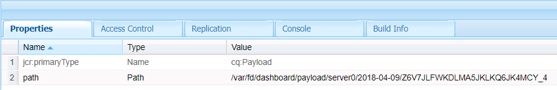

# Fluxos de trabalho centrados na Forms no OSGi | Tratamento de dados do usuário {#forms-centric-workflows-on-osgi-handling-user-data}

Os fluxos de trabalho de AEM centrados no Forms permitem automatizar processos de negócios centrados no Forms. Os workflows consistem em uma série de etapas executadas em uma ordem especificada no modelo de workflow associado. Cada etapa executa uma ação específica, como atribuir uma tarefa a um usuário ou enviar uma mensagem de email. Os workflows podem interagir com ativos no repositório, contas de usuário e serviços. Portanto, os workflows podem coordenar atividades complicadas que envolvem qualquer aspecto do Experience Manager.

Um fluxo de trabalho centrado em formulários pode ser acionado ou iniciado por meio de qualquer um dos seguintes métodos:

* Envio de um aplicativo AEM Caixa de entrada
* Envio de um aplicativo AEM aplicativo [!DNL Forms]
* Envio de um formulário adaptável
* Uso de uma pasta assistida
* Envio de uma comunicação interativa ou uma carta

Para obter mais informações sobre fluxos de trabalho e recursos de AEM centrados no Forms, consulte [Fluxo de trabalho centrado no Forms em OSGi](/help/forms/using/aem-forms-workflow.md).

## Os dados e armazenamentos de dados do usuário {#user-data-and-data-stores}

Quando um workflow é acionado, uma carga é gerada automaticamente para a instância do workflow. Cada instância do fluxo de trabalho recebe uma ID de instância exclusiva e uma ID de carga associada. A carga contém os locais do repositório para dados de usuário e formulário associados a uma instância de fluxo de trabalho. Além disso, rascunhos e dados históricos de uma instância de workflow também são armazenados no repositório AEM.

Os locais padrão do repositório onde reside a carga, os rascunhos e o histórico de uma instância de fluxo de trabalho são os seguintes:

>[!NOTE]
>
>Você pode configurar diferentes locais para armazenar dados de carga, rascunho e histórico ao criar um fluxo de trabalho ou aplicativo. Para identificar os locais onde um fluxo de trabalho ou aplicativo armazena dados, revise o fluxo de trabalho.

<table>
 <tbody>
  <tr>
   <td> </td>
   <td><b>AEM 6.4 [!DNL Forms]</b></td>
   <td><b>AEM 6.3 [!DNL Forms]</b></td>
  </tr>
  <tr>
   <td><strong>Instância   do fluxo de trabalho</strong></td>
   <td>/var/workflow/instances/[server_id]/&lt;date&gt;/[workflow-instance]/</td>
   <td>/etc/workflow/instances/[server_id]/[date]/[workflow-instance]/</td>
  </tr>
  <tr>
   <td><strong>Carga</strong></td>
   <td>/var/fd/dashboard/payload/[server_id]/[date]/  [payload-id]/</td>
   <td>/etc/fd/dashboard/payload/[server_id]/[date]/  [payload-id]/</td>
  </tr>
  <tr>
   <td><strong>Rascunhos</strong></td>
   <td>/var/fd/dashboard/instances/[server_id]/  [data]/[workflow-instance]/rascunho/[workitem]/</td>
   <td>/etc/fd/dashboard/instances/[server_id]/  [data]/[workflow-instance]/rascunho/[workitem]/</td>
  </tr>
  <tr>
   <td><strong>História</strong></td>
   <td>/var/fd/dashboard/instances/[server_id]/  [data]/[workflow_instance]/history/</td>
   <td>/etc/fd/dashboard/instances/[server_id]/  [date]/[workflow_instance]/history/</td>
  </tr>
 </tbody>
</table>

## Acessar e excluir dados do usuário {#access-and-delete-user-data}

Você pode acessar e excluir dados do usuário de uma instância de workflow no repositório. Para isso, você deve saber a ID da instância da instância do fluxo de trabalho associada ao usuário. Você pode encontrar a ID da instância de uma instância de fluxo de trabalho usando o nome de usuário do usuário que iniciou a instância do fluxo de trabalho ou que é o destinatário atual da instância do fluxo de trabalho.

No entanto, você não pode identificar ou os resultados podem ser ambíguos ao identificar workflows associados a um iniciador nos seguintes cenários:

* **O fluxo de trabalho é acionado por meio de uma pasta** monitorada: Uma instância de workflow não pode ser identificada usando seu iniciador se o workflow for acionado por uma pasta monitorada. Nesse caso, as informações do usuário são codificadas nos dados armazenados.
* **Fluxo de trabalho iniciado da instância** de publicação AEM: Todas as instâncias de fluxo de trabalho são criadas usando um usuário de serviço quando formulários adaptáveis, comunicações interativas ou cartas são enviadas AEM instância de publicação. Nesses casos, o nome de usuário do usuário conectado não é capturado nos dados da instância do fluxo de trabalho.

### Acessar dados do usuário {#access}

Para identificar e acessar os dados do usuário armazenados para uma instância de workflow, execute as seguintes etapas:

1. Em AEM instância do autor, vá para `https://'[server]:[port]'/crx/de` e navegue até **[!UICONTROL Ferramentas > Consulta]**.

   Selecione **[!UICONTROL SQL2]** no menu suspenso **[!UICONTROL Type]**.

1. Dependendo das informações disponíveis, execute uma das seguintes consultas:

   * Execute o seguinte se o iniciador do workflow for conhecido:

   `SELECT &ast; FROM [cq:Workflow] AS s WHERE ISDESCENDANTNODE([path-to-workflow-instances]) and s.[initiator]='*initiator-ID*'`

   * Execute o seguinte se o usuário cujos dados você está encontrando for o destinatário do fluxo de trabalho atual:

   `SELECT &ast; FROM [cq:WorkItem] AS s WHERE ISDESCENDANTNODE([path-to-workflow-instances]) and s.[assignee]='*assignee-id*'`

   A query retorna o local de todas as instâncias de fluxo de trabalho para o iniciador do fluxo de trabalho especificado ou o destinatário do fluxo de trabalho atual.

   Por exemplo, a consulta a seguir retorna dois caminhos de instâncias de fluxo de trabalho do nó `/var/workflow/instances` cujo iniciador do fluxo de trabalho é `srose`.

   

1. Vá para um caminho de instância de workflow retornado pela query. A propriedade status exibe o status atual da instância do fluxo de trabalho.

   

1. No nó da instância do fluxo de trabalho, navegue até `data/payload/`. A propriedade `path` armazena o caminho para a carga da instância do fluxo de trabalho. Você pode navegar até o caminho para acessar dados armazenados no payload.

   

1. Navegue até os locais para rascunhos e histórico da instância do workflow.

   Por exemplo:

   `/var/fd/dashboard/instances/server0/2018-04-09/_var_workflow_instances_server0_2018-04-09_basicmodel_54/draft/`

   `/var/fd/dashboard/instances/server0/2018-04-09/_var_workflow_instances_server0_2018-04-09_basicmodel_54/history/`

1. Repita as etapas 3 a 5 para todas as instâncias de fluxo de trabalho retornadas pela consulta na etapa 2.

   >[!NOTE]
   >
   >AEM aplicativo [!DNL Forms] também armazena dados no modo offline. É possível que os dados de uma instância de workflow sejam armazenados localmente em dispositivos individuais e sejam enviados ao servidor [!DNL Forms] quando o aplicativo é sincronizado com o servidor.

### Excluir dados do usuário {#delete-user-data}

Você deve ser um administrador AEM para excluir dados do usuário das instâncias do fluxo de trabalho, executando as seguintes etapas:

1. Siga as instruções em [Acessar dados do usuário](/help/forms/using/forms-workflow-osgi-handling-user-data.md#access) e anote o seguinte:

   * Caminhos para instâncias de fluxo de trabalho associadas ao usuário
   * Status das instâncias de fluxo de trabalho
   * Caminhos para cargas das instâncias do fluxo de trabalho
   * Caminhos para rascunhos e histórico das instâncias do fluxo de trabalho

1. Execute esta etapa para instâncias de fluxo de trabalho em **EXECUTANDO**, **SUSPENDIDO** ou **ESCALA** status:

   1. Vá para `https://'[server]:[port]'/aem/start.html` e faça logon com credenciais de administrador.
   1. Navegue até **[!UICONTROL Ferramentas > Fluxo de trabalho> Instâncias]**.
   1. Selecione as instâncias de fluxo de trabalho relevantes para o usuário e toque em **[!UICONTROL Encerrar]** para encerrar as instâncias em execução.

      Para obter mais informações sobre como trabalhar com instâncias de fluxo de trabalho, consulte [Administração de instâncias de fluxo de trabalho](/help/sites-administering/workflows-administering.md).

1. Vá para o console [!DNL CRXDE Lite], navegue até o caminho de carga de uma instância de fluxo de trabalho e exclua o nó `payload`.
1. Navegue até o caminho de rascunhos de uma instância de fluxo de trabalho e exclua o nó `draft`.
1. Navegue até o caminho do histórico para uma instância de workflow e exclua o nó `history`.
1. Navegue até o caminho da instância do fluxo de trabalho para uma instância do fluxo de trabalho e exclua o nó `[workflow-instance-ID]` do fluxo de trabalho.

   >[!NOTE]
   >
   >A exclusão do nó da instância do fluxo de trabalho removerá a instância do fluxo de trabalho para todos os participantes do fluxo de trabalho.

1. Repita as etapas 2 a 6 para todas as instâncias de fluxo de trabalho identificadas para um usuário.
1. Identifique e exclua dados de rascunho e envio offline da caixa de saída do aplicativo [!DNL Forms] dos participantes do fluxo de trabalho para evitar qualquer envio para o servidor.

Também é possível usar APIs para acessar e remover nós e propriedades. Consulte os documentos a seguir para obter mais informações.

* [Como acessar programaticamente o JCR AEM](/help/sites-developing/access-jcr.md)
* [Remover nós e propriedades](https://docs.adobe.com/docs/en/spec/jcr/2.0/10_Writing.html#10.9%20Removing%20Nodes%20and%20Properties)
* [Referência da API](https://helpx.adobe.com/experience-manager/6-3/sites-developing/reference-materials/javadoc/overview-summary.html)

