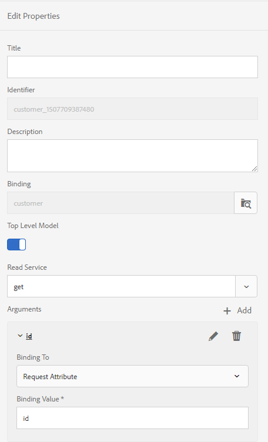

# Gerar várias comunicações interativas usando a API de lote {#use-batch-api-to-generate-multiple-ic}

Você pode usar a API de lote para produzir várias comunicações interativas de um modelo. O modelo é uma comunicação interativa sem dados. A API de lote combina dados com um modelo para produzir uma comunicação interativa. A API é útil na produção em massa de comunicações interativas. Por exemplo, contas telefônicas, declarações de cartão de crédito para vários clientes.

A API em lote aceita registros (dados) no formato JSON e de um Modelo de dados de formulário. O número de comunicações interativas produzidas é igual aos registros especificados no arquivo JSON de entrada no Modelo de dados de formulário configurado. Você pode usar a API para produzir as saídas Imprimir e Web. A opção IMPRIMIR produz um documento PDF e a opção WEB produz dados no formato JSON para cada registro individual.

## Uso da API de lote {#using-the-batch-api}

Você pode usar a API de lote juntamente com Pastas monitoradas ou como uma API de repouso independente. Você configura um modelo, tipo de saída (HTML, IMPRESSÃO ou Ambos), localidade, serviço de preenchimento prévio e nome das comunicações interativas geradas para usar a API em lote.

Você combina um registro com um modelo de comunicação interativa para produzir uma comunicação interativa. As APIs em lote podem ler registros (dados para modelos de comunicação interativos) diretamente de um arquivo JSON ou de uma fonte de dados externa acessada por meio do modelo de dados de formulário. Você pode manter cada registro em um arquivo JSON separado ou criar uma matriz JSON para manter todos os registros em um único arquivo.

**Um único registro em um arquivo JSON**

```JSON
{
   "employee": {
       "name": "Sara",
       "id": 3,
       "mobileNo": 9871996463,
       "age": 37
   }
}
```

**Vários registros em um arquivo JSON**

```JSON
[{
   "employee": {
       "name": "John",
       "id": 1,
       "mobileNo": 9871996461,
       "age": 39
   }
},{
   "employee": {
       "name": "Jacob",
       "id": 2,
       "mobileNo": 9871996462,
       "age": 38
   }
},{
   "employee": {
       "name": "Sara",
       "id": 3,
       "mobileNo": 9871996463,
       "age": 37
   }
}]
```

### Uso da API de lote com pastas monitoradas {#using-the-batch-api-watched-folders}

Para facilitar a experiência da API, o AEM Forms fornece um serviço de Pasta assistida configurado para usar a API em lote, pronto para uso. Você pode acessar o serviço por meio da interface do usuário do AEM Forms para gerar várias comunicações interativas. Você também pode criar serviços personalizados de acordo com suas necessidades. Você pode usar os métodos listados abaixo para usar a API de lote com a pasta Monitorada:

* Especificar dados de entrada (registros) no formato de arquivo JSON para produzir uma comunicação interativa
* Usar dados de entrada (registros) salvos em uma fonte externa de dados e acessados por meio de um modelo de dados de formulário para produzir uma comunicação interativa

#### Especificar registros de dados de entrada no formato de arquivo JSON para produzir uma comunicação interativa {#specify-input-data-in-JSON-file-format}

Você combina um registro com um modelo de comunicação interativa para produzir uma comunicação interativa. Você pode criar um arquivo JSON separado para cada registro ou criar uma matriz JSON para manter todos os registros em um único arquivo:

Para criar comunicação interativa a partir de registros salvos em um arquivo JSON:

1. Crie uma pasta [](https://docs.adobe.com/content/help/en/experience-manager-64/forms/publish-process-aem-forms/creating-configure-watched-folder.html) assistida e configure-a para usar a API em lote:
   1. Faça logon na instância do autor do AEM Forms.
   1. Navegue até **[!UICONTROL Ferramentas]** > **[!UICONTROL Formulários]** > **[!UICONTROL Configurar pasta]** assistida. Toque em **[!UICONTROL Novo]**.
   1. Especifique o **[!UICONTROL Nome]** e o **[!UICONTROL Caminho]** físico da pasta. Por exemplo, `c:\batchprocessing`.
   1. Selecione a opção **[!UICONTROL Serviço]** no campo **[!UICONTROL Processar arquivo usando]** .
   1. Selecione o serviço **[!UICONTROL com.adobe.fd.ccm.multichannel.batch.impl.service.InterativeCommunicationBatchServiceImpl]** no campo Nome **[!UICONTROL do]** serviço.
   1. Especifique um padrão **[!UICONTROL de arquivo de saída]**. Por exemplo, o [padrão](https://helpx.adobe.com/experience-manager/6-5/forms/using/admin-help/configuring-watched-folder-endpoints.html#about_file_patterns) %F/ especifica que a Pasta monitorada pode encontrar arquivos de entrada em uma subpasta da pasta Pasta monitorada\entrada.
1. Configurar parâmetros avançados:
   1. Abra a guia **[!UICONTROL Avançado]** e adicione as seguintes propriedades personalizadas:

      | Propriedade | Tipo | Descrição |
      |--- |--- |--- |
      | templatePath | Sequência de caracteres | Especifique o caminho do modelo de comunicação interativa a ser usado. Por exemplo, /content/dam/formsanddocuments/testsample/mediumic. É uma propriedade obrigatória. |
      | recordPath | Sequência de caracteres | O valor do campo recordPath ajuda a definir o nome de uma comunicação interativa. É possível definir o caminho de um campo de um registro como valor do campo recordPath. Por exemplo, se você especificar /funcionário/Id, o valor do campo de id se tornará o nome da comunicação interativa correspondente. O valor padrão é um UUID [aleatório e](https://docs.oracle.com/javase/7/docs/api/java/util/UUID.html#randomUUID())aleatório. |
      | usePrefillService | Booleano | Defina o valor como False. Você pode usar o parâmetro usePrefillService para pré-preencher a comunicação interativa com dados obtidos do serviço de pré-preenchimento configurado para a comunicação interativa correspondente. Quando usePrefillService é definido como true, os dados JSON de entrada (para cada registro) são tratados como Argumentos FDM. O valor padrão é false. |
      | batchType | Sequência de caracteres | Defina o valor como PRINT, WEB ou WEB_AND_PRINT. O valor padrão é WEB_AND_PRINT. |
      | locale | Sequência de caracteres | Especifique a localidade da comunicação interativa de saída. O serviço predefinido não utiliza a opção de localidade, mas é possível criar um serviço personalizado para gerar comunicações interativas localizadas. O valor padrão é en_US |

   1. Toque em **[!UICONTROL Criar]** A pasta assistida é criada.
1. Use a pasta assistida para gerar comunicação interativa:
   1. Abra a pasta assistida. Navegue até a pasta de entrada.
   1. Crie uma pasta na pasta de entrada e coloque o arquivo JSON na pasta recém-criada.
   1. Aguarde a Pasta assistida processar o arquivo. Quando o processamento é iniciado, o arquivo de entrada e a subpasta que contém o arquivo são movidos para a pasta de preparo.
   1. Abra a pasta de saída para exibir a saída:
      * Quando você especifica a opção IMPRIMIR em Configuração de pasta assistida, a saída PDF para a comunicação interativa é gerada.
      * Quando você especifica a opção WEB em Configuração de pasta assistida, um arquivo JSON por registro é gerado. Você pode usar o arquivo JSON para [preencher previamente um modelo](#web-template)da Web.
      * Quando você especifica as opções IMPRIMIR e WEB, os documentos PDF e um arquivo JSON por registro são gerados.

#### Use dados de entrada salvos em uma fonte de dados externa e acessados por meio do modelo de dados de formulário para produzir uma comunicação interativa {#use-fdm-as-data-source}

Você combina dados (registros) salvos em uma fonte de dados externa com um modelo de comunicação interativa para produzir uma comunicação interativa. Ao criar uma comunicação interativa, você a conecta a uma fonte de dados externa por meio de um Modelo de dados de formulário (FDM) para acessar os dados. Você pode configurar o serviço de processamento em lote de Pastas Monitoradas para buscar dados usando o mesmo Modelo de Dados de Formulário de uma fonte de dados externa. Para [criar uma comunicação interativa a partir de registros salvos em uma fonte](https://docs.adobe.com/content/help/en/experience-manager-64/forms/form-data-model/work-with-form-data-model.html)externa de dados:

1. Configure o Modelo de dados de formulário do modelo:
   1. Abra o Modelo de dados de formulário associado ao modelo de comunicação interativa.
   1. Selecione o OBJETO MODELO DE NÍVEL SUPERIOR e toque em Editar propriedades.
   1. Selecione o serviço de busca ou obtenção no campo Serviço de leitura no painel Editar propriedades.
   1. Toque no ícone de lápis do argumento de serviço de leitura para vincular o argumento a um Atributo de solicitação e especifique o valor de vínculo. Ele vincula o argumento de serviço ao atributo de vínculo especificado ou ao valor literal, que é transmitido ao serviço como um argumento para buscar detalhes associados ao valor especificado na fonte de dados.

      <br>
        Neste exemplo, o argumento id pega o valor do atributo id do perfil do usuário e o transmite como um argumento para o serviço de leitura. Ele lerá e retornará valores de propriedades associadas do objeto de modelo de dados de funcionário para a id especificada. Portanto, se você especificar 00250 no campo id no formulário, o serviço de leitura lerá detalhes do funcionário com a ID do funcionário 00250.
        <br>

      

   1. Salve as propriedades e o Modelo de dados de formulário.
1. Configurar valor para Atributo de solicitação:
   1. Crie um arquivo .json no seu sistema de arquivos e abra-o para edição.
   1. Crie uma matriz JSON e especifique o atributo principal para buscar dados do Modelo de dados de formulário. Por exemplo, o JSON a seguir solicita ao FDM que envie dados de registros, onde id é 27126 ou 27127:

      ```json
          [
              {
                  "id": 27126
              },
              {
                  "id": 27127
              }
          ]
      ```

   1. Salve e feche o arquivo.

1. Crie uma pasta [](https://docs.adobe.com/content/help/en/experience-manager-64/forms/publish-process-aem-forms/creating-configure-watched-folder.html) assistida e configure-a para usar o serviço de API em lote:
   1. Faça logon na instância do autor do AEM Forms.
   1. Navegue até **[!UICONTROL Ferramentas]** > **[!UICONTROL Formulários]** > **[!UICONTROL Configurar pasta]** assistida. Toque em **[!UICONTROL Novo]**.
   1. Especifique o **[!UICONTROL Nome]** e o **[!UICONTROL Caminho]** físico da pasta. Por exemplo, `c:\batchprocessing`.
   1. Selecione a opção **[!UICONTROL Serviço]** no campo **[!UICONTROL Processar arquivo usando]** .
   1. Selecione o serviço **[!UICONTROL com.adobe.fd.ccm.multichannel.batch.impl.service.InterativeCommunicationBatchServiceImpl]** no campo Nome **[!UICONTROL do]** serviço.
   1. Especifique um padrão **[!UICONTROL de arquivo de saída]**. Por exemplo, o [padrão](https://helpx.adobe.com/experience-manager/6-5/forms/using/admin-help/configuring-watched-folder-endpoints.html#about_file_patterns) %F/ especifica que a Pasta monitorada pode encontrar arquivos de entrada em uma subpasta da pasta Pasta monitorada\entrada.
1. Configurar parâmetros avançados:
   1. Abra a guia **[!UICONTROL Avançado]** e adicione as seguintes propriedades personalizadas:

      | Propriedade | Tipo | Descrição |
      |--- |--- |--- |
      | templatePath | Sequência de caracteres | Especifique o caminho do modelo de comunicação interativa a ser usado. Por exemplo, /content/dam/formsanddocuments/testsample/mediumic. É uma propriedade obrigatória. |
      | recordPath | Sequência de caracteres | O valor do campo recordPath ajuda a definir o nome de uma comunicação interativa. É possível definir o caminho de um campo de um registro como valor do campo recordPath. Por exemplo, se você especificar /funcionário/Id, o valor do campo de id se tornará o nome da comunicação interativa correspondente. O valor padrão é um UUID [aleatório e](https://docs.oracle.com/javase/7/docs/api/java/util/UUID.html#randomUUID())aleatório. |  |
      | usePrefillService | Booleano | Defina o valor como True. O valor padrão é false.  Quando o valor é definido como true, a API em lote lê os dados do Modelo de dados de formulário configurado e os preenche para a comunicação interativa. Quando usePrefillService é definido como true, os dados JSON de entrada (para cada registro) são tratados como Argumentos FDM. |
      | batchType | Sequência de caracteres | Defina o valor como PRINT, WEB ou WEB_AND_PRINT. O valor padrão é WEB_AND_PRINT. |
      | locale | Sequência de caracteres | Especifique a localidade da comunicação interativa de saída. O serviço predefinido não utiliza a opção de localidade, mas é possível criar um serviço personalizado para gerar comunicações interativas localizadas. O valor padrão é en_US. |

   1. Toque em **[!UICONTROL Criar]** A pasta assistida é criada.
1. Use a pasta assistida para gerar comunicação interativa:
   1. Abra a pasta assistida. Navegue até a pasta de entrada.
   1. Crie uma pasta na pasta de entrada. Coloque o arquivo JSON criado na Etapa 2 na pasta recém-criada.
   1. Aguarde a Pasta assistida processar o arquivo. Quando o processamento é iniciado, o arquivo de entrada e a subpasta que contém o arquivo são movidos para a pasta de preparo.
   1. Abra a pasta de saída para exibir a saída:
      * Quando você especifica a opção IMPRIMIR em Configuração de pasta assistida, a saída PDF para a comunicação interativa é gerada.
      * Quando você especifica a opção WEB em Configuração de pasta assistida, um arquivo JSON por registro é gerado. Você pode usar o arquivo JSON para [preencher previamente um modelo](#web-template)da Web.
      * Quando você especifica as opções IMPRIMIR e WEB, os documentos PDF e um arquivo JSON por registro são gerados.

## Chamar a API de lote usando solicitações REST

Você pode chamar [a API](https://helpx.adobe.com/experience-manager/6-5/forms/javadocs/index.html) em lote por meio de solicitações de transferência de estado de representação (REST). Ele permite que você forneça um terminal REST a outros usuários para acessar a API e configurar seus próprios métodos de processamento, armazenamento e personalização da comunicação interativa. Você pode desenvolver seu próprio servlet Java personalizado para implantar a API na sua instância do AEM.

Antes de implantar o servlet Java, verifique se você tem uma comunicação interativa e se os arquivos de dados correspondentes estão prontos. Execute as seguintes etapas para criar e implantar o servlet Java:

1. Faça logon na instância do AEM e crie uma Comunicação interativa. Para usar a comunicação interativa mencionada no código de amostra fornecido abaixo, [clique aqui](assets/SimpleMediumIC.zip).
1. [Crie e implante um projeto AEM usando o Apache Maven](https://helpx.adobe.com/experience-manager/using/maven_arch13.html) na sua instância do AEM.
1. Adicione o SDK do cliente do [AEM Forms versão 6.0.12](https://repo.adobe.com/nexus/content/repositories/public/com/adobe/aemfd/aemfd-client-sdk/) ou posterior e o mais recente Jar [do](https://docs.adobe.com/content/help/en/experience-manager-65/release-notes/service-pack/sp-release-notes.html#uber-jar) AEM Uber na lista de dependências do arquivo POm do seu projeto AEM. Por exemplo,

   ```XML
       <dependency>
           <groupId>com.adobe.aemfd</groupId>
           <artifactId>aemfd-client-sdk</artifactId>
           <version>6.0.122</version>
       </dependency>
       <dependency>
          <groupId>com.adobe.aem</groupId>
          <artifactId>uber-jar</artifactId>
          <version>6.5.0</version>
          <classifier>apis</classifier>
          <scope>provided</scope>
       </dependency>
   ```
1. Abra o projeto Java e crie um arquivo .java, por exemplo CCMBatchServlet.java. Adicione o seguinte código ao arquivo:

   ```java
           package com.adobe.fd.ccm.multichannel.batch.integration;
   
           import java.io.File;
           import java.io.FileInputStream;
           import java.io.FileOutputStream;
           import java.io.IOException;
           import java.io.InputStream;
           import java.io.OutputStream;
           import java.io.PrintWriter;
           import java.util.List;
           import java.util.logging.FileHandler;
           import java.util.logging.Logger;
           import java.util.logging.SimpleFormatter;
   
           import javax.servlet.Servlet;
           import javax.servlet.ServletContext;
   
           import com.adobe.aemfd.watchfolder.service.api.ContentProcessor;
   
           import org.apache.commons.io.IOUtils;
           import org.apache.sling.api.SlingHttpServletRequest;
           import org.apache.sling.api.SlingHttpServletResponse;
           import org.apache.sling.api.servlets.SlingAllMethodsServlet;
           import org.json.JSONArray;
           import org.json.JSONObject;
           import org.osgi.service.component.annotations.Component;
           import org.osgi.service.component.annotations.Reference;
   
           import com.adobe.aemfd.docmanager.Document;
           import com.adobe.aemfd.docmanager.passivation.DocumentPassivationHandler;
           import com.adobe.fd.ccm.multichannel.batch.api.factory.BatchComponentBuilderFactory;
           import com.adobe.fd.ccm.multichannel.batch.api.model.BatchConfig;
           import com.adobe.fd.ccm.multichannel.batch.api.model.BatchInput;
           import com.adobe.fd.ccm.multichannel.batch.api.model.BatchResult;
           import com.adobe.fd.ccm.multichannel.batch.api.model.BatchType;
           import com.adobe.fd.ccm.multichannel.batch.api.model.RecordResult;
           import com.adobe.fd.ccm.multichannel.batch.api.model.RenditionResult;
           import com.adobe.fd.ccm.multichannel.batch.api.service.BatchGeneratorService;
           import com.adobe.fd.ccm.multichannel.batch.util.BatchConstants;
           import com.adobe.icc.render.obj.Content;
   
           import javax.annotation.PostConstruct;
           import javax.inject.Inject;
           import javax.inject.Named;
   
           import org.apache.sling.api.resource.Resource;
           import org.apache.sling.models.annotations.Default;
           import org.apache.sling.models.annotations.Model;
           import org.apache.sling.settings.SlingSettingsService;
           import org.apache.sling.api.resource.ResourceUtil;
   
   
           import org.slf4j.*;
           import java.util.Date;
   
           @Component(service=Servlet.class,
           property={
                   "sling.servlet.methods=GET",
                   "sling.servlet.paths="+ "/bin/batchServlet"
           })
           public class CCMBatchServlet extends SlingAllMethodsServlet {
   
               @Reference
               private BatchGeneratorService batchGeneratorService;
               @Reference
               private BatchComponentBuilderFactory batchBuilderFactory;
               public void doGet(SlingHttpServletRequest req, SlingHttpServletResponse resp) {
                   try {
                       executeBatch(req,resp);
                   } catch (Exception e) {
                       e.printStackTrace();
                   }
               }
               private void executeBatch(SlingHttpServletRequest req, SlingHttpServletResponse resp) throws Exception {
                   int count = 0;
                   JSONArray inputJSONArray = new JSONArray();
                   String filePath = req.getParameter("filePath");
                   InputStream is = new FileInputStream(filePath);
                   String data = IOUtils.toString(is);
                   try {
                       // If input file is json object, then create json object and add in json array, if not then try for json array
                       JSONObject inputJSON = new JSONObject(data);
                       inputJSONArray.put(inputJSON);
                   } catch (Exception e) {
                       try {
                           // If input file is json array, then iterate and add all objects into inputJsonArray otherwise throw exception
                           JSONArray inputArray = new JSONArray(data);
                           for(int i=0;i<inputArray.length();i++) {
                               inputJSONArray.put(inputArray.getJSONObject(i));
                           }
                       } catch (Exception ex) {
                           throw new Exception("Invalid JSON Data. File name : " + filePath, ex);
                       }
                   }
                   BatchInput batchInput = batchBuilderFactory.getBatchInputBuilder().setData(inputJSONArray).setTemplatePath("/content/dam/formsanddocuments/[path of the interactive communcation]").build();
                   BatchConfig batchConfig = batchBuilderFactory.getBatchConfigBuilder().setBatchType(BatchType.WEB_AND_PRINT).build();
                   BatchResult batchResult = batchGeneratorService.generateBatch(batchInput, batchConfig);
                   List<RecordResult> recordList = batchResult.getRecordResults();
                   JSONObject result = new JSONObject();
                   for (RecordResult recordResult : recordList) {
                       String recordId = recordResult.getRecordID();
                       for (RenditionResult renditionResult : recordResult.getRenditionResults()) {
                           if (renditionResult.isRecordPassed()) {
                               InputStream output = renditionResult.getDocumentStream().getInputStream();
                               result.put(recordId +"_"+renditionResult.getContentType(), output);
   
                               Date date= new Date();
                               long time = date.getTime();
   
                               // Print output
                               if(getFileExtension(renditionResult.getContentType()).equalsIgnoreCase(".json")) {
                                   File file = new File(time + getFileExtension(renditionResult.getContentType()));
                                   copyInputStreamToFile(output, file);
                               } else
                               {
                                   File file = new File(time + getFileExtension(renditionResult.getContentType()));
                                   copyInputStreamToFile(output, file);
                               }
                           }
                       }
                   }
                   PrintWriter writer = resp.getWriter();
                   JSONObject resultObj = new JSONObject();
                   resultObj.put("result", result);
                   writer.write(resultObj.toString());
               }
   
   
               private static void copyInputStreamToFile(InputStream inputStream, File file)
                       throws IOException {
   
                       try (FileOutputStream outputStream = new FileOutputStream(file)) {
   
                           int read;
                           byte[] bytes = new byte[1024];
   
                           while ((read = inputStream.read(bytes)) != -1) {
                               outputStream.write(bytes, 0, read);
                           }
   
                       }
   
                   }
   
   
               private String getFileExtension(String contentType) {
                   if (contentType.endsWith(BatchConstants.JSON)) {
                       return ".json";
                   } else return ".pdf";
               }
   
   
           }
   ```

1. No código acima, substitua o caminho do modelo (setTemplatePath) pelo caminho do modelo e defina o valor da API setBatchType:
   * Quando você especifica a saída PDF da opção IMPRIMIR para a comunicação interativa é gerada.
   * Quando você especifica a opção WEB, um arquivo JSON por registro é gerado. Você pode usar o arquivo JSON para [preencher previamente um modelo](#web-template)da Web.
   * Quando você especifica as opções IMPRIMIR e WEB, os documentos PDF e um arquivo JSON por registro são gerados.

1. [Use o maven para implantar o código atualizado na sua instância](https://helpx.adobe.com/experience-manager/using/maven_arch13.html#BuildtheOSGibundleusingMaven)do AEM.
1. Chame a API de lote para gerar a comunicação interativa. A API em lote imprime um fluxo de arquivos PDF e .json dependendo do número de registros. Você pode usar o arquivo JSON para [preencher previamente um modelo](#web-template)da Web. Se você usar o código acima, a API será implantada em `http://localhost:4502/bin/batchServlet`. O código imprime e retorna um fluxo de arquivos PDF e JSON.

### Preencher previamente um modelo da Web {#web-template}

Quando você define o batchType para renderizar o Canal da Web, a API gera um arquivo JSON para cada registro de dados. Você pode usar a seguinte sintaxe para unir o arquivo JSON ao canal da Web correspondente para gerar uma comunicação interativa:

**Sintaxe**`http://host:port/<template-path>/jcr:content?channel=web&mode=preview&guideMergedJsonPath=<guide-merged-json-path>`

**Exemplo** Se seu arquivo JSON estiver no e você usar o modelo de comunicação interativa abaixo `C:\batch\mergedJsonPath.json` : `http://host:port/content/dam/formsanddocuments/testsample/mediumic/jcr:content?channel=web`

Em seguida, o seguinte URL no nó de publicação exibe o Canal da Web da comunicação interativa`http://host:port/<path-to-ic>/jcr:content?channel=web&mode=preview&guideMergedJsonPath=file:///C:/batch/mergedJsonData.json`

Além de salvar os dados no sistema de arquivos, você armazena arquivos JSON no repositório CRX, no sistema de arquivos, no servidor da Web ou pode acessar dados por meio do serviço de preenchimento prévio OSGI. Sintaxe para unir dados usando vários protocolos são:

* **Protocolo CRX**
   `http://host:port/<path-to-ic>/jcr:content?channel=web&mode=preview&guideMergedJsonPath=crx:///tmp/fd/af/mergedJsonData.json`

* **Protocolo de arquivo**
   `http://host:port/<path-to-ic>/jcr:content?channel=web&mode=preview&guideMergedJsonPath=file:///C:/Users/af/mergedJsonData.json`

* **Protocolo de Serviço de Pré-preenchimento**
   `http://host:port/<path-to-ic>/jcr:content?channel=web&mode=preview&guideMergedJsonPath=service://[SERVICE_NAME]/[IDENTIFIER]`

   SERVICE_NAME refere-se ao nome do serviço de pré-preenchimento OSGI. Consulte Criar e executar um serviço de preenchimento prévio.

   IDENTIFIER refere-se a quaisquer metadados exigidos pelo serviço de preenchimento prévio OSGI para buscar os dados de preenchimento prévio. Um identificador do usuário conectado é um exemplo de metadados que podem ser usados.

* **Protocolo HTTP**
   `http://host:port/<path-to-ic>/jcr:content?channel=web&mode=preview&guideMergedJsonPath=http://localhost:8000/somesamplexmlfile.xml`

>[!NOTE]
> Somente o protocolo CRX é ativado por padrão. Para ativar outros protocolos suportados, consulte [Configuração do serviço de preenchimento prévio usando o Configuration Manager](https://helpx.adobe.com/experience-manager/6-5/forms/using/prepopulate-adaptive-form-fields.html#ConfiguringprefillserviceusingConfigurationManager).
