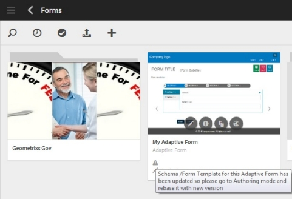

# Obter documentos XDP e PDF no AEM Forms{#getting-xdp-and-pdf-documents-in-aem-forms}

## Visão geral {#overview}

É possível importar seus formulários do sistema de arquivos local para o repositório CRX, fazendo upload para o AEM Forms. A operação de upload é compatível com os seguintes tipos de ativos:

* Modelos de formulário (formulários XFA)
* Formulários PDF
* Documento (documentos PDF simples)

Você pode fazer upload dos tipos de ativos suportados individualmente ou como um arquivo ZIP. Você pode fazer upload de um ativo do tipo `Resource`, somente ao lado de um formulário XFA em um arquivo ZIP.

>[!NOTE]
>
>Certifique-se de que você é um membro do `form-power-users` grupo para poder carregar arquivos XDP. Entre em contato com o administrador para se tornar um membro do grupo.

## Carregar formulários {#uploading-forms}

1. Faça logon na interface do usuário do AEM Forms acessando `https://'[server]:[port]'/aem/forms.html`.
1. Navegue até a pasta onde deseja carregar o formulário ou a pasta que contém os formulários.
1. Na barra de ferramentas de ações, toque em **Criar > Upload** de arquivo.

   

1. A caixa de diálogo Carregar formulário(s) ou pacote permite que você navegue e escolha o arquivo que deseja carregar. O navegador de arquivos exibe apenas os formatos de arquivo suportados (ZIP, XDP e PDF).

   >[!NOTE]
   >
   >Um nome de arquivo só pode conter caracteres alfanuméricos, hífen ou sublinhado.

1. Clique em Carregar após a seleção do arquivo para fazer upload dos arquivos ou clique em &#39;Cancelar&#39; para cancelar o upload. Um pop-up lista os ativos adicionados e os ativos que são atualizados no local atual.

   >[!NOTE]
   >
   >Para um arquivo ZIP, os caminhos relativos de todos os ativos suportados são exibidos. Os ativos não suportados dentro do ZIP são ignorados e não listados. No entanto, se o arquivo ZIP contiver apenas os ativos não suportados, uma mensagem de erro será exibida em vez da caixa de diálogo pop-up.

   

1. Se um ou mais ativos tiverem um nome de arquivo inválido, um erro será exibido. Corrija os nomes de arquivo realçados em vermelho e carregue novamente.

   

Quando o upload for concluído, um fluxo de trabalho em segundo plano gerará miniaturas para cada ativo, com base na pré-visualização do ativo. As versões mais recentes dos ativos, se carregados, substituem os ativos existentes.

### Modo protegido {#protected-mode}

O servidor do AEM Forms permite executar código JavaScript. Um código JavaScript mal-intencionado pode prejudicar um ambiente do AEM Forms. O modo protegido restringe o AEM Forms a executar arquivos XDP somente de ativos e locais confiáveis. Todos os XDP disponíveis na interface do usuário do AEM Forms são considerados ativos confiáveis.

O modo protegido está ativado, por padrão. Se necessário, você pode desativar o modo protegido:

1. Faça logon no console da Web do AEM como administrador. O URL é https://&#39;[server]:[port]&#39;/system/console/configMgr
1. Abra Configurações de formulários móveis para edição.
1. Desmarque a opção Modo protegido e clique em **Salvar**. O modo protegido está desativado.

## Atualização de formulários XFA referenciados {#updating-referenced-xfa-forms}

No AEM Forms, um modelo de formulário XFA pode ser referenciado por um formulário adaptável ou outro modelo de formulário XFA. Além disso, um modelo pode fazer referência a um recurso ou outro modelo XFA.

Um formulário adaptável referente a um XFA tem seus campos vinculados aos campos disponíveis no XFA. Ao atualizar um modelo de formulário, o formulário adaptativo associado tenta sincronizar com o XFA. Para obter mais detalhes, consulte [Sincronizar formulários adaptáveis com o XFA](../../forms/using/synchronizing-adaptive-forms-xfa.md)associado.

Remover um modelo de formulário corrompe o formulário ou modelo de formulário adaptativo dependente. Um formulário tão adaptativo às vezes é chamado informalmente de formulário sujo. Na interface do usuário do AEM Forms, você pode encontrar os formulários sujos das duas maneiras a seguir.

* Um ícone de aviso é exibido na miniatura do formulário adaptável na lista de ativos e a seguinte mensagem é exibida quando você passa o ponteiro do mouse sobre o ícone de aviso.\
   `Schema/Form Template for this adaptive form has been updated so please go to Authoring mode and rebase it with new version.`

Um sinalizador é mantido para indicar se um formulário adaptável está sujo. Essas informações estão disponíveis na página de propriedades do formulário, juntamente com os metadados do formulário. Somente para formulários adaptativos sujos, uma propriedade de metadados `Model Refresh` exibe o `Recommended` valor.

