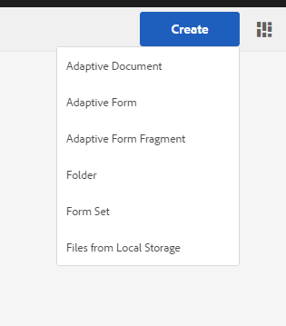

# Obtenção de documentos XDP e PDF no AEM Forms{#getting-xdp-and-pdf-documents-in-aem-forms}

## Visão geral {#overview}

Você pode importar seus formulários do sistema de arquivos local para o repositório CRX fazendo upload no AEM Forms. A operação de upload é compatível com os seguintes tipos de ativos:

* Modelos de formulário (formulários XFA)
* PDF forms
* Documento (documentos de PDF simples)

Você pode fazer upload dos tipos de ativos compatíveis individualmente ou como um arquivo ZIP. É possível fazer upload de um ativo do tipo `Resource`, somente com um formulário XFA em um arquivo ZIP.

>[!NOTE]
>
>Certifique-se de que você é membro do `form-power-users` para poder carregar arquivos XDP. Entre em contato com o administrador para se tornar um membro do grupo.

## Fazendo upload de formulários {#uploading-forms}

1. Faça logon na interface do usuário do AEM Forms acessando `https://'[server]:[port]'/aem/forms.html`.
1. Navegue até a pasta na qual deseja fazer upload do formulário ou até a pasta que contém os formulários.
1. Na barra de ferramentas de ações, selecione **Criar > Upload de arquivo**.

   

1. A caixa de diálogo Fazer upload de formulários ou pacotes permite navegar e escolher o arquivo que deseja fazer upload. O navegador de arquivos exibe apenas os formatos de arquivo compatíveis (ZIP, XDP e PDF).

   >[!NOTE]
   >
   >Um nome de arquivo só pode conter caracteres alfanuméricos, hífen ou sublinhado.

1. Clique em Carregar após a seleção do arquivo para carregar os arquivos ou clique em &quot;Cancelar&quot; para cancelar o carregamento. Uma janela pop-up lista os ativos que são adicionados e os ativos que são atualizados no local atual.

   >[!NOTE]
   >
   >Para um arquivo ZIP, os caminhos relativos de todos os ativos compatíveis são exibidos. Os ativos incompatíveis dentro do ZIP são ignorados e não são listados. No entanto, se o arquivo ZIP contiver somente os ativos incompatíveis, uma mensagem de erro será exibida em vez da caixa de diálogo pop-up.

   

1. Se um ou mais ativos tiverem um nome de arquivo inválido, um erro será exibido. Corrija os nomes de arquivo realçados em vermelho e carregue novamente.

   

Quando o upload estiver concluído, um fluxo de trabalho em segundo plano gerará miniaturas para cada ativo, com base na visualização do ativo. As versões mais recentes dos ativos, se carregadas, substituem os ativos existentes.

### Modo protegido {#protected-mode}

O servidor do AEM Forms permite executar o código JavaScript. Um código JavaScript mal-intencionado pode prejudicar um ambiente AEM Forms. O modo protegido restringe o AEM Forms a executar arquivos XDP somente de ativos e locais confiáveis. Todos os XDP disponíveis na interface do usuário do AEM Forms são considerados ativos confiáveis.

O modo protegido está ativado, por padrão. Se necessário, é possível desativar o modo protegido:

1. Faça logon no AEM Web Console como administrador. O URL é https://&#39;[server]:[porta]&#39;/system/console/configMgr
1. Abra Configurações do Mobile Forms para edição.
1. Desmarque a opção Modo protegido e clique em **Salvar**. O modo protegido está desativado.

## Atualização de formulários XFA referenciados {#updating-referenced-xfa-forms}

No AEM Forms, um modelo de formulário XFA pode ser referenciado por um formulário adaptável ou outro modelo de formulário XFA. Além disso, um modelo pode se referir a um recurso ou outro modelo XFA.

Um formulário adaptável que faz referência a um XFA tem seus campos vinculados aos campos disponíveis no XFA. Ao atualizar um modelo de formulário, o formulário adaptável associado tenta sincronizar com o XFA. Para obter mais detalhes, consulte [Sincronização de formulários adaptáveis com o XFA associado](../../forms/using/synchronizing-adaptive-forms-xfa.md).

A remoção de um modelo de formulário corrompe o formulário adaptável dependente ou o modelo de formulário. Esse formulário adaptável às vezes é chamado informalmente de formulário sujo. Na interface do usuário do AEM Forms, você pode encontrar os formulários sujos das duas formas a seguir.

* Um ícone de aviso é exibido na miniatura do formulário adaptável na lista de ativos e a seguinte mensagem é exibida ao passar o ponteiro sobre o ícone de aviso.\
  `Schema/Form Template for this adaptive form has been updated so go to Authoring mode and rebase it with new version.`

Um sinalizador é mantido para indicar se um formulário adaptável está sujo. Essas informações estão disponíveis na página de propriedades do formulário, junto com os metadados do formulário. Somente para formulários adaptáveis sujos, uma propriedade de metadados `Model Refresh` exibições `Recommended` valor.

