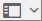
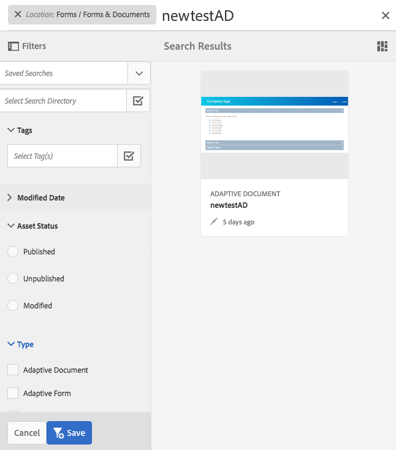

# Importação e exportação de ativos para o AEM Forms{#importing-and-exporting-assets-to-aem-forms}

Você pode mover formulários e ativos relacionados, temas, dicionários de dados, fragmentos de documento e letras entre diferentes instâncias do AEM Forms. Esse movimento é necessário ao migrar sistemas ou mover formulários de um servidor de estágio para um servidor de produção. Para os ativos para os quais há suporte para upload e importação por meio da interface do usuário do AEM Forms, usar a interface do usuário do Forms é a maneira recomendada para exportar ou importar. Não é recomendável usar o Gerenciador de pacote AEM para exportar ou importar esses ativos.

>[!NOTE]
>
>* No AEM 6.4 Forms, a estrutura e os caminhos do crx-repository foram alterados. Se você importar ativos de uma versão anterior para o AEM 6.4 Forms e o formulário tiver algumas dependências na estrutura mais antiga, é necessário exportar manualmente as dependências. Para obter detalhes sobre alterações na estrutura e caminhos do repositório, consulte Reestruturação [do repositório no AEM](/help/sites-deploying/repository-restructuring.md).
>

## Baixar ou fazer upload de ativos do Forms &amp; Documents {#download-or-upload-forms-amp-documents-assets}

A interface do usuário do AEM Forms permite exportar ativos de uma instância do AEM baixando-os como um pacote do AEM CRX ou arquivos binários. Em seguida, você pode importar o pacote AEM CRX baixado ou o arquivo binário para outra instância do AEM.

Exportar e importar por meio da interface do usuário do AEM Forms é suportado para todos os ativos, exceto para modelos de formulário adaptável e políticas de conteúdo de formulário adaptável. Portanto, ao exportar um formulário adaptável da interface do usuário do AEM Forms, o modelo de formulário adaptável relacionado e as políticas de conteúdo não são exportados automaticamente como outros ativos relacionados.

Para esses tipos de ativos, você deve usar o Gerenciador de pacotes AEM para criar um pacote CRX no servidor AEM de origem e instalar o pacote no servidor de destino. Para obter informações sobre como criar e instalar pacotes, consulte [Trabalhar com pacotes](/help/sites-administering/package-manager.md).

### Baixar ativos de Formulários e Documentos {#download-forms-amp-documents-assets}

Para baixar ativos do Forms &amp; Documents:

1. Faça logon na instância do AEM Forms.
1. Toque no ícone do Experience Manager  > ícone de  de navegação > Formulários > Formulários e documentos.
1. Selecione os ativos de formulários e toque no ícone **Download** .
1. Em Baixar ativos, escolha uma das opções a seguir e toque em **Baixar**.

   * **Baixar como Pacote CRX:** Use a opção para baixar e mover todos os ativos selecionados e as dependências relacionadas de uma instância do AEM Forms para outra. Ele baixa todos os ativos e pastas como pacote crx. Qualquer ativo(s) de formulário, incluindo os formulários criados no AEM (formulários adaptáveis, Comunicações interativas e fragmentos de formulário adaptáveis), conjuntos de formulários, modelos de formulários, documentos PDF e recursos (XSDs, XFS, imagens) podem ser baixados como pacote da interface do usuário do AEM Forms.
A vantagem de baixar ativos como pacote é que ele também baixa ativos que foram usados pelo ativo selecionado para download. Por exemplo, se você tiver um formulário adaptável que usa um modelo de formulário, XSD e uma imagem. Quando você seleciona este formulário adaptável e o baixa como pacote, o pacote baixado também contém o modelo de formulário, XSD e a imagem. Todas as propriedades de metadados (incluindo propriedades personalizadas) associadas ao ativo também são baixadas.

   * **Baixar ativos como arquivos binários:** Use a opção para baixar somente modelos de formulário (XDP), formulários PDF (PDF), documento (PDF) e recursos (imagens, esquemas, folhas de estilo). É possível editar esses ativos com aplicativos externos. Ele baixa os ativos de formulários que têm binários, como XSDs, XDPs, imagens, PDFs e XDPs como um arquivo .zip.
Não é possível baixar formulários adaptáveis, Comunicações interativas, fragmentos de formulário adaptáveis, temas e conjuntos de formulários com a opção **Baixar ativos como arquivos** binários. Para baixar esses ativos, você deve usar a opção **Baixar como Pacote** CRX.
   Os ativos selecionados são baixados como um arquivo morto (arquivo .zip).

   >[!NOTE]
   >
   >O pacote AEM e os arquivos binários são baixados como um arquivo (arquivo .zip). Os modelos dos ativos não são baixados junto com os ativos. É necessário exportar os modelos de ativos separadamente.

### Carregar ativos de Formulários e Documentos {#upload-forms-amp-documents-assets}

Para fazer upload de ativos de Formulários e Documentos:

>[!VIDEO](https://vimeo.com/)

1. Faça logon na instância do AEM Forms.
1. Toque no ícone do Experience Manager  > ícone de  de navegação > Formulários > Formulários e documentos.
1. Toque em **Criar** > Carregamento **de arquivo**. Uma caixa de diálogo carregar formulários ou pacote é exibida.
1. Na caixa de diálogo, procure e selecione o pacote ou o arquivo a ser importado. Você também pode selecionar documentos PDF, XSDs, imagens, folhas de estilo e formulários XDP. Toque em **Abrir**. A pasta ou o nome do arquivo selecionado não deve incluir caracteres especiais.

   Na caixa de diálogo, verifique os detalhes dos ativos que estão sendo carregados e toque em **Carregar**.

   Caso você carregue um ativo de formulários existente, o ativo será atualizado.

   >[!NOTE]
   >
   >Carregar um pacote não substitui a hierarquia de pastas existente. Por exemplo, se você tiver um formulário adaptável chamado &#39;Treinamento&#39; no local /content/dam/formsanddocuments em um servidor. Faça o download do formulário adaptável e faça o upload do formulário em outro servidor. O segundo servidor também tem uma pasta com o nome &quot;Training&quot; (Treinamento) no mesmo local /content/dam/formsanddocuments. Falha no carregamento.

## Download ou upload de um tema {#downloading-or-uploading-a-theme}

Com o AEM Forms, você pode criar, baixar ou carregar temas. Um tema é criado como outros ativos, como formulários, documentos e letras. Você pode criar um tema, baixá-lo e carregá-lo em uma instância separada para reutilizá-lo. Para obter mais informações sobre temas, consulte [Temas no AEM Forms](../../forms/using/themes.md).

### Download de um tema {#downloading-a-theme}

É possível exportar temas no AEM Forms que podem ser usados em outros projetos ou instâncias. O AEM permite baixar o tema como um arquivo zip, que você pode carregar na instância.

Para baixar um tema:

1. Faça logon na instância do AEM Forms.
1. Toque no ícone do Experience Manager  > ícone de  de navegação > Formulários > Temas.
1. Selecione o tema e toque em **Download**. O tema é baixado como um arquivo morto (arquivo .zip).

### Fazer upload de um tema {#uploading-a-theme}

Você pode usar temas criados com predefinições de estilização em seu projeto. Você pode importar pacotes de temas que outras pessoas criarem fazendo upload deles no seu projeto.

Para carregar um tema:

1. No Experience Manager, navegue até **Formulários > Temas**.
1. Na página Temas, clique em **Criar > Upload** de arquivo.
1. No prompt Upload de arquivo, navegue e selecione um pacote de tema no computador e clique em **Carregar**.
O tema carregado está disponível na página de temas.

1. Faça logon na instância do AEM Forms.
1. Toque no ícone do Experience Manager  > ícone de  de navegação > Formulários > Temas.
1. clique em **Criar** > Upload **de arquivo**. No prompt Upload de arquivo, navegue e selecione um pacote de tema no computador e clique em **Carregar**. O tema é carregado.

## Importar e exportar ativos no Gerenciamento de correspondência {#import-and-export-assets-in-correspondence-management}

Para compartilhar ativos, como dicionários de dados, letras e fragmentos de documento, entre duas implementações diferentes do Gerenciamento de correspondência, você pode criar e compartilhar arquivos .cmp. Um arquivo .cmp pode incluir um ou mais dicionários de dados, letras, fragmentos de documento e formulários.

### Exportar fragmentos de documento, letras e/ou dicionários de dados {#export-document-fragments-letters-and-or-data-dictionaries}

1. Em letras, fragmentos de documento ou páginas de dicionário de dados, toque e selecione os ativos que deseja exportar para um único pacote e, em seguida, toque em Fila para download. Os ativos são alinhados para exportação.
1. Conforme necessário, repita a etapa acima para adicionar letras, fragmentos de documento e dicionários de dados.
1. Toque em **Download**.
1. O Gerenciamento de correspondência exibe a caixa de diálogo Baixar ativos com uma lista de ativos na lista de exportação.

   

1. Para exibir as dependências que são exportadas, toque em Resolver. Ou pule para a próxima etapa. Mesmo se você não tocar em resolver, as dependências ainda serão exportadas.
1. Para baixar o arquivo .cmp, toque em **OK**.
1. O Gerenciamento de correspondência baixa um arquivo .cmp em seu computador.

   O arquivo .cmp inclui os ativos exportados. Você pode compartilhar o arquivo .cmp com outras pessoas. Outros usuários podem importar o arquivo .cmp em um servidor diferente para obter todos os ativos no novo servidor.

### Exportar todos os ativos do Gerenciamento de correspondência como um pacote {#export-all-the-correspondence-management-assets-as-a-package}

Use essa opção para baixar todos os ativos do Gerenciamento de correspondência e as dependências relacionadas como um pacote de uma instância de formulários do AEM.

Por exemplo, se o Gerenciamento de correspondência tiver uma carta que usa uma imagem e um texto, o pacote baixado também conterá a imagem e o texto relacionado à carta. Todas as propriedades de metadados (incluindo propriedades personalizadas) associadas ao ativo também são baixadas. Depois de baixar o pacote (.cmp), você pode [importar o pacote para uma instância](../../forms/using/import-export-forms-templates.md#p-upload-forms-documents-assets-p)do AEM Forms diferente.

Para baixar todos os ativos do Gerenciamento de correspondência e as dependências relacionadas como um pacote, execute as seguintes etapas:

1. Faça logon no servidor AEM Forms como um usuário de formulários.
1. Toque em **Adobe Experience Manager** na barra Navegação global.
1. Toque em ferramentas ( ) e, em seguida, toque em **Formulários**.
1. Tap **Export Correspondence Management Assets**.

   

   ( &quot;A página Exportar todos os ativos de gerenciamento de correspondência é exibida e exibe as informações sobre a última vez que o processo de exportação foi tentado e um link para baixar o último pacote exportado com êxito.

   

1. Toque em **Exportar** e, na mensagem de confirmação, toque em **OK**.

   Após a conclusão de um processo em lote, os detalhes da última execução e o link para baixar o pacote serão atualizados. Isso inclui informações como o logon do Administrador e se o lote foi executado com êxito ou com falha. Os ativos são exportados para um pacote e o link Baixar pacote exportado é exibido.

   >[!NOTE]
   >
   >O processo Exportar todos os ativos não pode ser cancelado depois de iniciado. Além disso, enquanto a operação exportar todos estiver em andamento, não crie, exclua, modifique ou publique quaisquer ativos ou inicie o processo Publicar todos os ativos.a

1. Toque no link **Download de pacote** exportado para baixar o arquivo de pacote.

   Para adicionar os ativos no pacote a outra instância do Gerenciamento de correspondência, [importe o pacote para uma instância](../../forms/using/import-export-forms-templates.md#p-upload-forms-documents-assets-p)do AEM Forms.

### Importar fragmentos de documento, letras e/ou dicionários de dados para o Gerenciamento de correspondência {#import-document-fragments-letters-and-or-data-dictionaries-into-correspondence-management}

Você pode importar ativos que são exportados para um arquivo .cmp. Um arquivo .cmp pode ter uma ou mais letras, dicionários de dados, fragmentos de documento e ativos dependentes.

>[!NOTE]
>
>Ao importar ativos antigos do Gerenciamento de correspondência para migração, faça logon usando uma conta de administrador. Para obter mais informações sobre como migrar ativos antigos do Gerenciamento de correspondência, consulte [Migrar ativos do Gerenciamento de correspondência para formulários](/help/forms/using/migration-utility.md)AEM 6.1.

1. Na página de dicionário de dados, letras ou fragmentos de documento, toque em **Criar > Upload** de arquivo e selecione o arquivo .cmp.
1. O Gerenciamento de correspondência exibe a caixa de diálogo Importar ativos com a lista de ativos importados. Toque em **Importar**.

   Após a importação dos ativos, as seguintes propriedades dos ativos são atualizadas enquanto as outras propriedades permanecem as mesmas:

   * Autor: Exibe a ID do usuário que importou o ativo para o servidor
   * Modificado: A hora em que o ativo foi importado para o servidor
   >[!NOTE]
   >
   >Para que você possa carregar XDPs (como parte do arquivo cmp ou de outra forma), é necessário fazer parte do grupo de usuários avançados dos formulários. Para obter direitos de acesso, entre em contato com o administrador.

## Exportar um aplicativo de fluxo de trabalho {#export-a-workflow-application}

Você pode usar o gerenciador de pacote AEM para exportar aplicativos de fluxo de trabalho. O procedimento é o seguinte:

1. Abra o gerenciador de pacote do AEM Forms. O URL do gerenciador de pacotes é https://&lt;servidor>:&lt;porta>/crx/packmgr.
1. Clique em **[!UICONTROL Criar pacote]**. The **[!UICONTROL New Package]** dialog box appears.
1. Especifique o nome, a versão e o grupo do pacote. Clique em **[!UICONTROL OK]**.
1. Clique em **[!UICONTROL Editar]** e abra a guia **[!UICONTROL Filtros]** . Clique em **[!UICONTROL Adicionar filtro]**. Especifique o caminho do aplicativo de fluxo de trabalho. Por exemplo, /etc/fd/dashboard/startpoints/homemortgage. Clique em **[!UICONTROL Adicionar regra]**.

1. Abra a guia **[!UICONTROL Avançado.]** Selecione **[!UICONTROL Mesclar]** ou **[!UICONTROL Substituir]** no campo Manuseio de ACL. Clique em **[!UICONTROL Salvar]**.
1. Clique em **[!UICONTROL Criar]** para criar o pacote.

   Depois que o pacote for criado, você poderá baixá-lo e importá-lo para o outro servidor. O aplicativo de fluxo de trabalho é exibido no servidor onde o pacote é carregado.

   >[!NOTE]
   >
   >Para que o aplicativo de fluxo de trabalho funcione corretamente, também exporte o formulário adaptável e o modelo de fluxo de trabalho correspondentes com o aplicativo de trabalho.

## Pastas e organização de ativos {#folders-and-organizing-assets}

A interface do usuário do AEM Forms usa pastas para organizar ativos. Essas pastas são usadas para organizar ativos criados na interface do usuário do AEM Forms. Você pode renomear, criar subpastas e armazenar ativos e documentos nessas pastas. Organizar documentos e ativos em uma pasta permite agrupar os arquivos para facilitar o gerenciamento. Você pode selecionar uma pasta e optar por baixá-la ou excluí-la.

Para criar uma pasta, conclua as seguintes etapas:

### Criar uma pasta {#create-a-folder}

1. Faça logon na interface do usuário do AEM Forms em `https://<server>:<port>/aem/forms.html`.
1. Navegue até o local sob o qual você deseja criar uma pasta.
1. Toque em Criar > Pasta.
1. Digite os seguintes detalhes:

   * **Título:** Nome de exibição da pasta
   * **Nome:** *(Obrigatório)* O nome do nó sob o qual você deseja armazenar a pasta no repositório
   >[!NOTE]
   >
   >Por padrão, o valor do campo de nome é automaticamente preenchido a partir do título. O nome só pode conter caracteres alfanuméricos ou os caracteres especiais hífen (-) e underscore (_). Quaisquer outros caracteres especiais inseridos no título serão automaticamente substituídos por um hífen e você será solicitado a confirmar o novo nome. Você pode optar por continuar com o nome sugerido ou editá-lo posteriormente.

1. Uma nova pasta com o título definido é exibida no local atual na lista de ativos.

   Se existir uma pasta com o nome especificado, o envio falhará com um erro. É possível exibir a mensagem de erro passando o mouse sobre o ícone error  que aparece ao lado do campo de nome.

   Você pode tocar na pasta recém-criada para entrar na pasta e criar ativos ou pastas dentro dela. Além disso, você pode selecionar uma pasta e escolher colocá-la na fila para download, excluí-la ou editar seu nome.

   

### Criar cópias de um ou mais ativos ou letras {#create-copies-of-one-or-more-assets-or-letters}

Você pode usar ativos e letras existentes para criar rapidamente ativos e letras com propriedades, conteúdo e ativos herdados semelhantes. Você pode copiar e colar dicionários de dados, fragmentos de documento e letras.

Complete as etapas a seguir para criar cópias de ativos e cartas:

1. Na página Ativos ou Cartas relevante, selecione um ou mais ativos/letras. A interface do usuário exibe o ícone Copiar.
1. Toque em Copiar. A interface do usuário exibe o ícone Colar. Você também pode optar por ir/navegar dentro de uma pasta antes de colar. Pastas diferentes podem conter ativos com os mesmos nomes. Para obter mais informações sobre pastas, consulte [Pastas e organizar ativos](#folders-and-organizing-assets).
1. Toque em Colar. A caixa de diálogo Colar é exibida. O sistema gera automaticamente nomes e títulos para as novas cópias de ativos/letras, mas você pode editar os títulos e os nomes dos ativos/letras.

   Se você estiver copiando e colando os ativos/letras no mesmo local, um sufixo &quot;-CopyXX&quot; será adicionado ao nome existente do ativo/carta. Se não existir um título para o ativo/carta copiada, o campo de título gerado automaticamente permanecerá em branco.

1. Se necessário, edite o Título e o Nome com os quais deseja salvar a cópia do ativo/carta.
1. Toque em Colar. Novas cópias dos ativos copiados são criadas.

## Pesquisar {#search-forms}

A interface do usuário do AEM Forms permite pesquisar seu conteúdo. Usando a barra superior, você pode tocar em Pesquisar **[A]** para pesquisar seu conteúdo em busca de recursos, como ativos e documentos.

Quando você pesquisa ativos, o AEM Forms exibe o painel lateral. Você também pode tocar em  conteúdo > Filtrar **[B]** para chamar o painel lateral. Usando os vários filtros no painel lateral, você pode restringir sua pesquisa. O painel lateral também permite salvar suas pesquisas.

**A.** Procure **B.** Filtro

Painel lateral - Filtros

No painel lateral, você pode usar o seguinte para restringir os resultados da pesquisa:

* Diretório de pesquisa
* Tags
* Critérios de pesquisa; por exemplo, datas modificadas, status de publicação, status da Live Copy. 

O painel lateral também permite salvar as configurações de pesquisa com os nomes de sua escolha.

Para obter mais informações e instruções sobre como usar pesquisa, filtros, pesquisa salva e painel lateral, consulte [Pesquisar](/help/sites-authoring/search.md).
