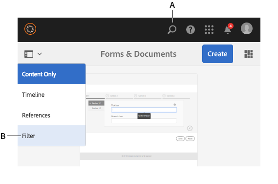

# Importação e exportação de ativos para o AEM Forms{#importing-and-exporting-assets-to-aem-forms}

Você pode mover formulários e ativos relacionados, temas, dicionários de dados, fragmentos de documentos e cartas entre diferentes instâncias do AEM Forms. Esse movimento é necessário ao migrar sistemas ou mover formulários de um servidor de preparo para um servidor de produção. Para os ativos para os quais há suporte para upload e importação pela interface do AEM Forms, o uso da interface do Forms é a maneira recomendada para exportar ou importar. Não é recomendado usar o Gerenciador de pacotes AEM para exportar ou importar esses ativos.

>[!NOTE]
>
>* No AEM 6.4 Forms, a estrutura e os caminhos do repositório crx foram alterados. Se você importar ativos de uma versão anterior para o AEM 6.4 Forms e o formulário tiver algumas dependências na estrutura mais antiga, será necessário exportar as dependências manualmente. Para obter detalhes sobre as alterações na estrutura e nos caminhos do repositório, consulte [Reestruturação do repositório no AEM](/help/sites-deploying/repository-restructuring.md).
>

## Baixar ou carregar ativos da Forms e de documentos {#download-or-upload-forms-amp-documents-assets}

A interface do usuário do AEM Forms permite exportar ativos de uma instância AEM baixando-os como um pacote CRX AEM ou arquivos binários. Você pode importar o pacote AEM CRX baixado ou o arquivo binário para outra instância do AEM.

Todos os ativos são compatíveis com a exportação e importação pela interface do usuário do AEM Forms, exceto os modelos de Formulário adaptável e as políticas de conteúdo do Formulário adaptável. Portanto, ao exportar um formulário adaptável da interface do usuário do AEM Forms, o modelo de formulário adaptável relacionado e as políticas de conteúdo não são exportados automaticamente como outros ativos relacionados.

Para esses tipos de ativos, você deve usar o Gerenciador de pacotes AEM para criar um pacote do CRX no servidor AEM de origem e instalar o pacote no servidor de destino. Para obter informações sobre como criar e instalar pacotes, consulte [Trabalho com pacotes](/help/sites-administering/package-manager.md).

### Baixar ativos da Forms e de documentos {#download-forms-amp-documents-assets}

Para baixar os ativos do Forms e do Documents:

1. Faça logon na instância do AEM Forms.
1. Selecione o ícone do Experience Manager  > ícone da navegação > Forms > Forms e Documentos.
1. Selecione os ativos de formulários e selecione o ícone **Baixar**.
1. Em Baixar ativos, escolha uma das opções a seguir e selecione **Baixar**.

   * **Baixar como Pacote do CRX:** use a opção para baixar e mover todos os ativos selecionados e as dependências relacionadas de uma instância do AEM Forms para outra. Ele baixa todos os ativos e pastas como pacote crx. Todos os ativos de formulário, incluindo os formulários criados no AEM (formulários adaptáveis, comunicações interativas e fragmentos de formulário adaptáveis), conjuntos de formulários, modelos de formulário, documentos PDF e recursos (XSDs, XFS, imagens) podem ser baixados como pacotes na interface do usuário do AEM Forms.
A vantagem de baixar ativos como pacote é que ele também baixa ativos que foram usados pelo ativo selecionado para download. Por exemplo, se você tiver um formulário adaptável que usa um modelo de formulário, XSD e uma imagem. Ao selecionar esse formulário adaptável e baixá-lo como pacote, o pacote baixado também contém o modelo de formulário, o XSD e a imagem. Todas as propriedades de metadados (incluindo propriedades personalizadas) associadas ao ativo também são baixadas.

   * **Baixar ativo(s) como arquivos binários:** Use a opção para baixar somente modelos de formulário (XDP), PDF forms (PDF), documento (PDF) e recursos (imagens, esquemas, folhas de estilos). É possível editar esses ativos com aplicativos externos. Ele baixa os ativos de formulários que têm binários, como XSDs, XDPs, imagens, PDF e XDPs como um arquivo .zip.
Não é possível baixar formulários adaptáveis, Comunicações interativas, fragmentos de formulários adaptáveis, temas e conjuntos de formulários com a opção **Baixar ativos como arquivos binários**. Para baixar esses ativos, você deve usar a opção **Baixar como Pacote do CRX**.

   Os ativos selecionados são baixados como um arquivo (arquivo .zip).

   >[!NOTE]
   >
   >O pacote AEM e os arquivos binários são baixados como um arquivo (arquivo .zip). Os modelos dos ativos não são baixados junto com os ativos. É necessário exportar os modelos de ativos separadamente.

### Fazer upload de ativos do Forms e de documentos {#upload-forms-amp-documents-assets}

Para fazer upload de ativos do Forms e do Documents:

<!--[!VIDEO](https://vimeo.com/)-->

1. Faça logon na instância do AEM Forms.
1. Selecione o ícone do Experience Manager  > ícone da navegação > Forms> Forms e Documentos.
1. Selecione **Criar** >**Carregar Arquivo**. Uma caixa de diálogo Carregar formulários ou pacote é exibida.
1. Na caixa de diálogo, navegue e selecione o pacote ou o arquivo a ser importado. Você também pode selecionar o documento PDF, XSDs, imagens, folhas de estilos e formulários XDP. Selecione **Abrir**. A pasta ou o nome de arquivo selecionado não deve incluir caracteres especiais.

   Na caixa de diálogo, verifique os detalhes dos ativos sendo carregados e selecione **Carregar**.

   Caso você carregue um ativo de formulários existente, o ativo é atualizado.

   >[!NOTE]
   >
   >O carregamento de um pacote não substitui a hierarquia de pastas existente. Por exemplo, se você tiver um formulário adaptável chamado &quot;Treinamento&quot; no local /content/dam/formsanddocuments em um servidor. Você baixou o formulário adaptável e carregou o formulário em outro servidor. O segundo servidor também tem uma pasta com o nome &#39;Training&#39; no mesmo local /content/dam/formsanddocuments. Falha no upload.

## Download ou upload de um tema {#downloading-or-uploading-a-theme}

Com o AEM Forms, você pode criar, baixar ou fazer upload de temas. Um tema é criado como outros ativos, como formulários, documentos e cartas. É possível criar um tema, baixá-lo e carregá-lo em uma instância separada para reutilizá-lo. Para obter mais informações sobre temas, consulte [Temas no AEM Forms](../../forms/using/themes.md).

### Download de um tema {#downloading-a-theme}

É possível exportar temas no AEM Forms que você pode usar em outros projetos ou instâncias. O AEM permite baixar temas como um arquivo zip, que você pode carregar na instância.

Para baixar um tema:

1. Faça logon na instância do AEM Forms.
1. Selecione Experience Manager  > navegação > Forms> Temas.
1. Selecione o tema e selecione **Baixar**. O tema é baixado como um arquivo (arquivo .zip).

### Carregamento de um tema {#uploading-a-theme}

Você pode usar temas criados com predefinições de estilo em seu projeto. Você pode importar pacotes de temas que outras pessoas criam carregando-os no seu projeto.

Para fazer upload de um tema:

1. No Experience Manager, navegue até **Forms > Temas**.
1. Na página Temas, clique em **Criar > Carregar Arquivo**.
1. No prompt Upload de arquivo, procure e selecione um pacote de tema no computador e clique em **Upload**.
O tema carregado está disponível na página de temas.

1. Faça logon na instância do AEM Forms.
1. Selecione Experience Manager  > navegação > Forms> Temas.
1. clique em **Criar** > **Carregar arquivo**. No prompt Upload de arquivo, procure e selecione um pacote de tema no computador e clique em **Upload**. O tema é carregado.

## Importar e exportar ativos no Gerenciamento de correspondência {#import-and-export-assets-in-correspondence-management}

Para compartilhar ativos, como dicionários de dados, cartas e fragmentos de documentos, entre duas implementações diferentes do Gerenciamento de correspondências, você pode criar e compartilhar arquivos .cmp. Um arquivo .cmp pode incluir um ou mais dicionários de dados, cartas, fragmentos de documentos e formulários.

### Exportar fragmentos de documento, cartas e/ou dicionários de dados {#export-document-fragments-letters-and-or-data-dictionaries}

1. Nas páginas de cartas, fragmentos de documentos ou dicionários de dados, selecione e selecione os ativos que deseja exportar para um único pacote e selecione Fila para download. Os ativos são alinhados para exportação.
1. Conforme necessário, repita a etapa acima para adicionar letras, fragmentos de documento e dicionários de dados.
1. Selecione **Baixar**.
1. O Gerenciamento de correspondências exibe a caixa de diálogo Baixar ativo(s) com uma lista de ativos na lista de exportação.

   

1. Para exibir as dependências exportadas, selecione Resolver. Ou pule para a próxima etapa. Mesmo que você não selecione resolver, as dependências ainda serão exportadas.
1. Para baixar o arquivo .cmp, selecione **OK**.
1. O Gerenciamento de correspondência baixa um arquivo .cmp para o computador.

   O arquivo .cmp inclui os ativos exportados. Você pode compartilhar o arquivo .cmp com outras pessoas. Outros usuários podem importar o arquivo .cmp em um servidor diferente para obter todos os ativos no novo servidor.

### Exportar todos os ativos do Gerenciamento de correspondência como um pacote {#export-all-the-correspondence-management-assets-as-a-package}

Use essa opção para baixar todos os ativos do Gerenciamento de correspondências e dependências relacionadas como um pacote de uma instância de formulários AEM.

Por exemplo, se o Gerenciamento de correspondências tiver uma correspondência que use uma imagem e texto, o pacote baixado também conterá a imagem e o texto relacionado à correspondência. Todas as propriedades de metadados (incluindo propriedades personalizadas) associadas ao ativo também são baixadas. Depois de baixar o pacote (.cmp), você pode [importar o pacote para outra instância do AEM Forms](../../forms/using/import-export-forms-templates.md#p-upload-forms-documents-assets-p).

Para baixar todos os ativos do Gerenciamento de correspondências e dependências relacionadas como um pacote, siga estas etapas:

1. Faça logon no servidor do AEM Forms como um usuário de formulários.
1. Selecione **Adobe Experience Manager** na barra de Navegação Global.
1. Selecione as ferramentas ( ) e selecione **Forms**.
1. Selecione **Exportar Assets do Gerenciamento de Correspondências**.

   

   ( &quot;A página Exportar todas as correspondências do Assets é exibida e mostra as informações sobre a última tentativa do processo de Exportação e um link para baixar o último pacote exportado com sucesso.

   

1. Selecione **Exportar** e na mensagem de confirmação selecione **OK**.

   Após a conclusão de um processo em lote, os detalhes da última execução e o link para baixar o pacote são atualizados. Isso inclui informações como o logon do Administrador e se a execução do lote foi bem-sucedida ou falhou. Os ativos são exportados para um pacote e o link Baixar pacote exportado é exibido.

   >[!NOTE]
   >
   >O processo Exportar tudo do Assets não pode ser cancelado depois de iniciado. Além disso, enquanto a operação exportar tudo estiver em andamento, não crie, exclua, modifique ou publique quaisquer ativos ou inicie o processo Publish All Assets.

1. Selecione o link **Baixar Pacote Exportado** para baixar o arquivo de pacote.

   Para adicionar os ativos do pacote a outra instância do Gerenciamento de Correspondências, [importe o pacote para uma instância do AEM Forms](../../forms/using/import-export-forms-templates.md#p-upload-forms-documents-assets-p).

### Importar fragmentos de documento, cartas e/ou dicionários de dados para o gerenciamento de correspondência {#import-document-fragments-letters-and-or-data-dictionaries-into-correspondence-management}

Você pode importar ativos exportados para um arquivo .cmp. Um arquivo .cmp pode ter uma ou mais letras, dicionários de dados, fragmentos de documentos e ativos dependentes.

>[!NOTE]
>
>Ao importar ativos antigos do Gerenciamento de correspondências para migração, faça logon usando uma conta de Administrador. Para obter mais informações sobre como Migrar ativos antigos do Gerenciamento de Correspondências, consulte [Migrar ativos do Gerenciamento de Correspondências para formulários AEM 6.1](/help/forms/using/migration-utility.md).

1. Na página do dicionário de dados, cartas ou fragmentos de documento, selecione **Criar > Carregar arquivo** e selecione o arquivo .cmp.
1. O Gerenciamento de correspondências exibe a caixa de diálogo Importar Assets com a lista de ativos importados. Selecione **Importar**.

   Após importar os ativos, as seguintes propriedades dos ativos são atualizadas, enquanto as outras propriedades permanecem as mesmas:

   * Autor: exibe a ID do usuário que importou o ativo para o servidor
   * Modificado: a hora em que o ativo foi importado para o servidor

   >[!NOTE]
   >
   >Para carregar XDPs (como parte do arquivo cmp ou de outra forma), você precisa fazer parte do grupo forms-power-users. Para obter direitos de acesso, entre em contato com o administrador.

## Exportar um aplicativo de fluxo de trabalho {#export-a-workflow-application}

Você pode usar o gerenciador de pacotes AEM para exportar aplicativos de workflow. O procedimento é conforme listado abaixo:

1. Abra o gerenciador de pacotes do AEM Forms. O URL do gerenciador de pacotes é https://&lt;server>:&lt;port>/crx/packmgr.
1. Clique em **[!UICONTROL Criar Pacote]**. A caixa de diálogo **[!UICONTROL Novo Pacote]** é exibida.
1. Especifique o nome, a versão e o grupo do pacote. Clique em **[!UICONTROL OK]**.
1. Clique em **[!UICONTROL Editar]** e abra a guia **[!UICONTROL Filtros]**. Clique em **[!UICONTROL Adicionar filtro]**. Especifique o caminho do aplicativo de workflow. Por exemplo, /etc/fd/dashboard/startpoints/homemortgage. Clique em **[!UICONTROL Adicionar regra]**.

1. Abra a guia **[!UICONTROL Avançado]**. Selecione **[!UICONTROL Mesclar]** ou **[!UICONTROL Substituir]** no campo Manuseio de ACL. Clique em **[!UICONTROL Salvar]**.
1. Clique em **[!UICONTROL Build]** para criar o pacote.

   Depois que o pacote for criado, é possível baixá-lo e importá-lo para o outro servidor. O aplicativo de workflow aparece no servidor onde o pacote é carregado.

   >[!NOTE]
   >
   >Para que o aplicativo de fluxo de trabalho funcione corretamente, exporte também o formulário adaptável correspondente e o modelo de fluxo de trabalho com o aplicativo de trabalho.

## Pastas e organização de ativos {#folders-and-organizing-assets}

A interface do usuário do AEM Forms usa pastas para organizar ativos. Essas pastas são usadas para organizar ativos criados na interface do usuário do AEM Forms. Você pode renomear, criar subpastas e armazenar ativos e documentos nessas pastas. Organizar documentos e ativos em uma pasta permite agrupar os arquivos para facilitar o gerenciamento. Você pode selecionar uma pasta e escolher baixá-la ou excluí-la.

Para criar uma pasta, conclua as seguintes etapas:

### Criar uma pasta {#create-a-folder}

1. Faça logon na interface do usuário do AEM Forms em `https://<server>:<port>/aem/forms.html`.
1. Navegue até o local em que deseja criar uma pasta.
1. Selecione Criar > Pasta.
1. Insira os seguintes detalhes:

   * **Título:** Nome para exibição da pasta
   * **Nome:** *(Obrigatório)* O nome do nó no qual você deseja armazenar a pasta no repositório

   >[!NOTE]
   >
   >Por padrão, o valor do campo de nome é preenchido automaticamente a partir do título. O nome só pode conter caracteres alfanuméricos ou os caracteres especiais de hífen (-) e sublinhado (_). Quaisquer outros caracteres especiais inseridos no título são substituídos automaticamente por um hífen e você será solicitado a confirmar o novo nome. Você pode optar por continuar com o nome sugerido ou fazer mais edições.

1. Uma nova pasta com o título definido é exibida no local atual na lista de ativos.

   Se existir uma pasta com o nome especificado, o envio falha com um erro. Você pode exibir a mensagem de erro passando o cursor do mouse sobre o ícone de erro  que aparece ao lado do campo de nome.

   Você pode selecionar a pasta recém-criada para entrar na pasta e criar ativos ou pastas dentro dela. Além disso, você pode selecionar uma pasta e optar por colocá-la na fila para download, excluí-la ou editar seu nome.

   

### Criar cópias de um ou mais ativos ou cartas {#create-copies-of-one-or-more-assets-or-letters}

Você pode usar ativos e cartas existentes para criar rapidamente ativos e cartas com propriedades, conteúdo e ativos herdados semelhantes. Você pode copiar e colar dicionários de dados, fragmentos de documentos e cartas.

Conclua as seguintes etapas para criar cópias de ativos e cartas:

1. Na página relevante do Assets ou Cartas, selecione um ou mais ativos/cartas. A interface do usuário do exibe o ícone Copiar.
1. Selecione Copiar. A interface exibe o ícone Colar. Você também pode escolher ir/navegar dentro de uma pasta antes de colar. Pastas diferentes podem conter ativos com os mesmos nomes. Para obter mais informações sobre pastas, consulte [Pastas e organização de ativos](#folders-and-organizing-assets).
1. Selecione Colar. A caixa de diálogo Colar é exibida. O sistema gera automaticamente nomes e títulos para as novas cópias de ativos/cartas, mas você pode editar os títulos e nomes dos ativos/cartas.

   Se você estiver copiando e colando os ativos/cartas no mesmo local, um sufixo &quot;-CopyXX&quot; será adicionado ao nome existente do ativo/carta. Se não houver título para o ativo/carta copiado, o campo de título gerado automaticamente permanecerá em branco.

1. Se necessário, edite o Título e o Nome com os quais deseja salvar a cópia do ativo/carta.
1. Selecione Colar. Novas cópias dos ativos copiados são criadas.

## Pesquisar {#search-forms}

A interface do usuário do AEM Forms permite pesquisar seu conteúdo. Usando a barra superior, você pode selecionar Pesquisar **[A]** para pesquisar o conteúdo de recursos como ativos e documentos.

Quando você pesquisa por ativos, o AEM Forms exibe o painel lateral. Você também pode selecionar  > Filtro **[B]** para invocar o painel lateral. Usando os vários filtros no painel lateral, é possível restringir a pesquisa. O painel lateral também permite salvar as pesquisas.

**A.** Pesquisar **B.** Filtro

Painel lateral - Filtros

No painel lateral, você pode usar o seguinte para restringir os resultados da pesquisa:

* Diretório de pesquisa
* Tags
* Critérios de pesquisa; por exemplo, Datas modificadas, Status do Publish, Status da Live Copy.

O painel lateral também permite salvar as configurações de pesquisa com os nomes de sua escolha.

Para obter mais informações e instruções sobre como usar a pesquisa, os filtros, a pesquisa salva e o painel lateral, consulte [Pesquisa](/help/sites-authoring/search.md).
