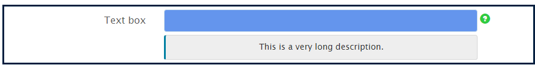

# Estilo em linha de componentes de formulário adaptáveis {#inline-styling-of-adaptive-form-components}

É possível definir a aparência geral e o estilo de um formulário adaptável especificando estilos usando o editor [de](../../forms/using/themes.md)temas. Além disso, é possível aplicar estilos CSS em linha a componentes de formulário adaptáveis individuais e visualizar as alterações dinamicamente. Os estilos incorporados substituem o estilo fornecido no tema.

## Aplicar propriedades CSS em linha {#apply-inline-css-properties}

Para adicionar estilos incorporados a um componente:

1. Abra o formulário no editor de formulários e altere o modo para o modo de estilização. Para alterar o modo para o modo de estilização, na barra de ferramentas da página, toque em  > **Estilo**.
1. Selecione um componente na página e toque no botão editar, botão . As propriedades de estilo são abertas na barra lateral.

   Também é possível selecionar componentes da árvore de hierarquia do formulário na barra lateral. A árvore da hierarquia do formulário está disponível como Objetos de formulário na barra lateral.

   Você também pode selecionar um componente na barra lateral. No modo Estilo, é possível ver os componentes listados em Objetos de formulário. Entretanto, a lista Objetos de formulário na barra lateral lista componentes como campos e painéis. Campos e painéis são componentes genéricos que podem conter componentes como caixa de texto e botões de opção.

   Ao selecionar um componente na barra lateral, você verá todos os subcomponentes listados e as propriedades do componente selecionado. Você pode selecionar um subcomponente específico e estilizá-lo.

1. Clique em uma guia na barra lateral para especificar as propriedades CSS. Você pode especificar propriedades como:

   * Dimensões e posição (configuração de exibição, preenchimento, altura, largura, margem, posição, índice z, flutuante, claro, sobrefluxo)
   * Texto (família da fonte, peso, cor, tamanho, altura da linha e alinhamento)
   * Plano de fundo (imagem e gradiente, cor do plano de fundo)
   * Borda (Largura, estilo, cor, raio)
   * Efeitos (sombra, opacidade)
   * Avançado (permite gravar CSS personalizado para o componente)

1. Da mesma forma, você pode aplicar estilos para outras partes de um componente, como Widget, Legenda e Ajuda.
1. Toque em **Concluído** para confirmar as alterações ou em **Cancelar** para descartar as alterações.

## Exemplo: estilos incorporados para um componente de campo {#example-inline-styles-for-a-field-component}

As imagens a seguir representam um campo de texto antes e depois da aplicação de estilos incorporados a ele.

Componente da caixa de texto antes de aplicar propriedades de estilo em linha

Observe a alteração no estilo da caixa de texto como mostrado na imagem a seguir após aplicar as seguintes propriedades de CSS.

<table>
 <tbody>
  <tr>
   <td>
Seletor
 </td>
   <td>
Propriedade CSS
 </td>
   <td>
Valor
 </td>
   <td>
Efeito
 </td>
  </tr>
  <tr>
   <td>
Texto
 </td>
   <td>
border
 </td>
   <td>
Largura da borda = 2px
 
Estilo de borda=Sólido
 
Cor da borda=#1111
 </td>
   <td>
Cria uma borda preta com largura de 2x ao redor do campo
 </td>
  </tr>
  <tr>
   <td>
Caixa de texto
 </td>
   <td>
background-color
 </td>
   <td>
#6495ED
 </td>
   <td>
Altera a cor de fundo para CornflorBlue (#6495ED)
 
Observação: Você pode especificar um nome de cor ou seu código hexadecimal no campo de valor.
 </td>
  </tr>
  <tr>
   <td>
Etiqueta
 </td>
   <td>
Dimensões e posição &gt; largura
 </td>
   <td>
100px
 </td>
   <td>
Corrige a largura como 100px para o rótulo
 </td>
  </tr>
  <tr>
   <td>Ícone da ajuda do campo</td>
   <td>Texto &gt; Cor da fonte</td>
   <td>#2ECC40</td>
   <td>Altera a cor da face do ícone de ajuda.</td>
  </tr>
  <tr>
   <td>
Descrição longa
 </td>
   <td>
text-align
 </td>
   <td>
center
 </td>
   <td>
Alinha a descrição longa da ajuda ao centro
 </td>
  </tr>
 </tbody>
</table>

Componente da caixa de texto após aplicar propriedades de estilo em linha

Siga as etapas acima para selecionar e criar um estilo para outros componentes, como painéis, botões de envio e botões de opção.

>[!NOTE]
>
>As propriedades de estilo variam com base no componente selecionado.

