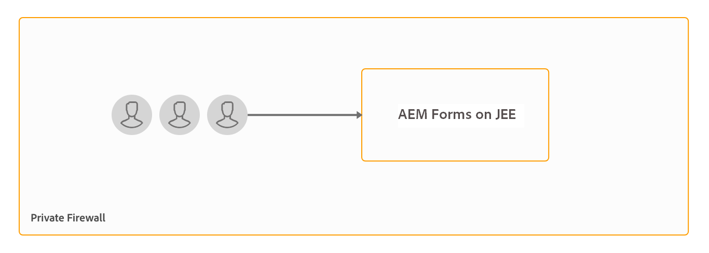

# Instalar e configurar o servidor de segurança de documentos {#installing-and-configuring-the-document-security-server}

Use a segurança do documento para distribuir com segurança todas as informações salvas em um formato compatível. Somente usuários autorizados podem acessar documentos protegidos.

A segurança de documentos da Adobe Experience Manager Forms garante que somente usuários autorizados possam usar seus documentos. Usando a segurança de documentos, você pode distribuir com segurança todas as informações salvas em um formato compatível. Os formatos de arquivo suportados incluem Adobe Portable Document Format (PDF) e arquivos do Microsoft Word, Excel e PowerPoint.

Você pode proteger documentos usando políticas. As configurações de confidencialidade especificadas em uma política determinam como um destinatário pode usar um documento ao qual você aplica a política. Por exemplo, você pode especificar se os destinatários podem imprimir ou copiar texto, editar texto ou adicionar assinaturas e comentários a documentos protegidos.

As políticas são armazenadas no servidor de segurança de documentos; aplique as políticas aos documentos por meio do aplicativo cliente. Quando você aplica uma política a um documento, as configurações de confidencialidade especificadas na política protegem as informações que o documento contém. Você pode distribuir o documento protegido por política para recipients autorizados pela política.

A segurança de documentos também fornece clientes, visualizadores e indexadores para proteger documentos, visualizar documentos protegidos e documentos protegidos por índice. Para obter informações detalhadas sobre a segurança do documento, consulte [sobre a segurança do documento](/help/forms/using/admin-help/document-security.md).

## Topologia de implantação {#deployment-topology}

O recurso de segurança de documento está disponível somente no AEM Forms no JEE. Você precisa de uma única instância do AEM Forms no JEE. Você também pode criar um cluster ou farm de servidores da AEM Forms, se necessário. A topologia a seguir é uma topologia indicativa para executar a capacidade de segurança do documento. Para obter informações detalhadas sobre a topologia, consulte [Topologias de arquitetura e implantação para AEM Forms](aem-forms-architecture-deployment.md).

<!--fix above link-->

O diagrama a seguir mostra a arquitetura típica da Segurança de documentos do AEM Forms:

## Instalação do AEM Forms no JEE {#installing-aem-forms-on-jee}

Execute as seguintes etapas para instalar e configurar o AEM Forms no JEE:

1. Baixe o instalador do AEM 6.5 Forms em JEE no [Adobe Licensing Website (LWS)](https://licensing.adobe.com/). Você precisa de um contrato válido de Manutenção e Suporte para baixar o instalador.
1. Leia o documento [AEM Forms on JEE Supported Platforms ](/help/forms/using/aem-forms-jee-supported-platforms.md) e verifique se o software, o hardware, os sistemas operacionais, o servidor de aplicativos, os bancos de dados, os JDKs e outras infraestruturas estão prontos para instalar o AEM Forms no JEE.
1. (Somente instalações de Non-Turnkey) Leia o [Preparando para instalar o AEM Forms single server](https://www.adobe.com/go/learn_aemforms_prepareInstallsingle_64) ou [Preparando para instalar o cluster de servidores AEM Forms](https://www.adobe.com/go/learn_aemforms_prepareInstallcluster_64) e prepare seu ambiente para instalar e configurar o AEM Forms no JEE.
1. Dependendo do seu ambiente e servidor de aplicativos, escolha um dos seguintes documentos e siga as instruções para concluir a instalação

   * [Instalação e implantação do AEM Forms no JEE usando o turnkey do JBoss](https://www.adobe.com/go/learn_aemforms_installTurnkey_64)
   * [Instalação e implantação do AEM Forms no JEE para JBoss](https://www.adobe.com/go/learn_aemforms_installJBoss_64)
   * [Instalação e implantação do AEM Forms no JEE para WebLogic](https://www.adobe.com/go/learn_aemforms_installWebLogic_64)
   * [Instalação e implantação do AEM Forms no JEE para WebSphere](https://www.adobe.com/go/learn_aemforms_installWebSphere_64)
   * [Configuração do AEM Forms no JEE no cluster JBoss](https://www.adobe.com/go/learn_aemforms_clusterJBoss_64)
   * [Configuração do AEM Forms no JEE no cluster WebLogic](https://www.adobe.com/go/learn_aemforms_clusterWebLogic_64)
   * [Configurando o AEM Forms no JEE no cluster do WebSphere](https://www.adobe.com/go/learn_aemforms_clusterWebSphere_64)

   >[!NOTE]
   >
   >Na tela de seleção Módulo do AEM Forms no gerenciador de configuração JEE, selecione a opção Segurança de documento. A opção Segurança de documento não requer que nenhum outro módulo seja selecionado.

## Próximas etapas {#next-steps}

* [Configurar opções do cliente e do servidor](/help/forms/using/admin-help/configuring-client-server-options.md)
* [Criar e gerenciar políticas](/help/forms/using/admin-help/creating-policies.md)
* [Criar e gerenciar conjuntos de políticas](/help/forms/using/admin-help/creating-policy-sets.md)
