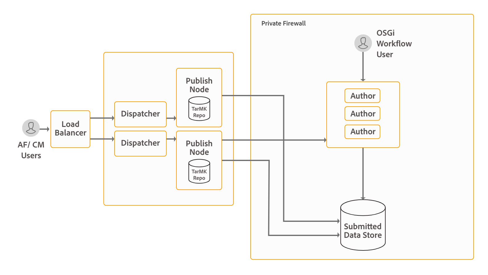

# Instalação e configuração do fluxo de trabalho centrado no Forms no OSGi{#installing-and-configuring-forms-centric-workflow-on-osgi}

## Introdução {#introduction}

As empresas coletam e processam dados de vários formulários, sistemas back-end e outras fontes de dados. O processamento de dados envolve procedimentos de revisão e aprovação, tarefas repetitivas e arquivamento de dados. Por exemplo, revisar um formulário e convertê-lo em um documento do PDF. Quando feitas manualmente, as tarefas repetitivas podem levar muito tempo e vários recursos.

Você pode usar o [fluxo de trabalho centrado no Forms no OSGi](../../forms/using/aem-forms-workflow.md) para criar rapidamente fluxos de trabalho baseados em formulários adaptáveis. Esses workflows podem ajudá-lo a automatizar workflows de revisão e aprovação, workflows de processo de negócios e outras tarefas repetitivas. Esses workflows também ajudam a processar documentos (criar, montar, distribuir e arquivar documentos do PDF, adicionar assinaturas digitais para limitar o acesso a documentos, decodificar formulários com código de barras e muito mais) e usar o fluxo de trabalho de assinatura do Adobe Sign com formulários e documentos.

Após configurados, esses workflows podem ser acionados manualmente para concluir um processo definido ou executar de forma programática quando os usuários enviam um formulário ou uma comunicação interativa. O recurso está incluído no pacote complementar do AEM Forms.

O AEM Forms é uma plataforma poderosa de nível empresarial. O fluxo de trabalho centrado no Forms no OSGi é apenas um dos recursos do AEM Forms. Para obter a lista completa de recursos, consulte [Introdução ao AEM Forms](introduction-aem-forms.md).

>[!NOTE]
>
>Com um fluxo de trabalho centrado na Forms no OSGi, você pode criar e implantar rapidamente fluxos de trabalho para várias tarefas na pilha do OSGi, sem precisar instalar o recurso completo de Gerenciamento de processos na pilha do JEE. Veja uma [comparação](capabilities-osgi-jee-workflows.md) dos fluxos de trabalho do AEM centrados na Forms no OSGi e no Gerenciamento de processos no JEE para saber mais sobre a diferença e as semelhanças nos recursos.
>
>Após a comparação, Se você optar por instalar o recurso Gerenciamento do Processo na pilha do JEE, consulte [Instalar ou Atualizar o AEM Forms no JEE](/help/forms/using/introduction-aem-forms.md) para obter informações detalhadas sobre como instalar e configurar a pilha do JEE e os recursos de Gerenciamento do Processo.

## Topologia de implantação {#deployment-topology}

O pacote complementar do AEM Forms é um aplicativo implantado no AEM. Você precisa de, no mínimo, um autor ou instância de processamento do AEM (autor de produção) para executar o fluxo de trabalho centrado no Forms no recurso OSGi. Uma instância de processamento é uma instância de [AEM Author](/help/forms/using/hardening-securing-aem-forms-environment.md) avançada. Não execute nenhuma criação real, como a criação de fluxos de trabalho ou formulários adaptáveis, no autor de produção.

A topologia a seguir é uma topologia indicativa para executar as Comunicações interativas da AEM Forms, o Gerenciamento de correspondência, a captura de dados da AEM Forms e o fluxo de trabalho centrado na Forms em recursos OSGi. Para obter informações detalhadas sobre a topologia, consulte [Arquitetura e topologias de implantação do AEM Forms](/help/forms/using/aem-forms-architecture-deployment.md).



O fluxo de trabalho centrado no Forms do AEM Forms no OSGi executa a Caixa de entrada do AEM e a interface de criação do modelo de fluxo de trabalho do AEM nas instâncias de Autor do AEM Forms.

## Requisitos do sistema {#system-requirements}

>[!NOTE]
>
>Pule para a seção [Próximas etapas](../../forms/using/installing-configuring-forms-centric-workflow-on-osgi.md#next-steps) do documento, se você já tiver instalado o AEM Forms no OSGi conforme explicado no artigo [instalar e configurar recursos de captura de dados](../../forms/using/installing-configuring-aem-forms-osgi.md).

Antes de começar a instalar e configurar o fluxo de trabalho centrado no Forms no OSGi, verifique se:

* A infraestrutura de hardware e software está em vigor. Para obter uma lista detalhada de hardware e software com suporte, consulte [requisitos técnicos](/help/sites-deploying/technical-requirements.md).

* O caminho de instalação da instância do AEM não contém espaços em branco.
* Uma instância do AEM está em execução. Na terminologia do AEM, uma &quot;instância&quot; é uma cópia do AEM executada em um servidor no modo de criação ou publicação. Você precisa de pelo menos uma instância do AEM (Autor ou Processamento) para executar o fluxo de trabalho centrado no Forms no OSGi:

  * **Autor**: uma instância do AEM usada para criar, carregar, editar conteúdo e administrar o site. Quando o conteúdo estiver pronto para entrar em funcionamento, ele será replicado para a instância de publicação.
  * **Processando:** uma instância de processamento é uma instância de [AEM Author](/help/forms/using/hardening-securing-aem-forms-environment.md) avançada. Você pode configurar uma instância de Autor e fortalecê-la após executar a instalação.

  * **Publicar**: uma instância do AEM que fornece o conteúdo publicado ao público pela Internet ou por uma rede interna.

* Os requisitos de memória são atendidos. O pacote complementar do AEM Forms exige:

  * 15 GB de espaço temporário para instalações baseadas no Microsoft Windows.
  * 6 GB de espaço temporário para instalações baseadas em UNIX.

* Requisitos adicionais para sistemas baseados em UNIX: Se você estiver usando o sistema operacional baseado em UNIX, instale os seguintes pacotes da mídia de instalação do respectivo sistema operacional.

<table>
 <tbody>
  <tr>
   <td>expat</td>
   <td>libxcb</td>
   <td>freetype</td>
   <td>libXau</td>
  </tr>
  <tr>
   <td>libSM</td>
   <td>zlib</td>
   <td>libICE</td>
   <td>libuuid</td>
  </tr>
  <tr>
   <td>glibc</td>
   <td>libXext</td>
   <td><p>nss-softoken-freebl</p> </td>
   <td>fontconfig</td>
  </tr>
  <tr>
   <td>libX11</td>
   <td>libXrender</td>
   <td>libXrandr</td>
   <td>libXinerama</td>
  </tr>
 </tbody>
</table>

## Instalar pacote complementar do AEM Forms {#install-aem-forms-add-on-package}

O pacote complementar do AEM Forms é um aplicativo implantado no AEM. O pacote contém fluxo de trabalho centrado no Forms no OSGi e outros recursos. Execute as seguintes etapas para instalar o pacote complementar:

1. Abra a [Distribuição de softwares](https://experience.adobe.com/downloads). Você precisa de uma Adobe ID para fazer logon na Distribuição de softwares.
1. Selecione **[!UICONTROL Adobe Experience Manager]**, disponível no menu de cabeçalho.
1. Na seção **[!UICONTROL Filtros]**:
   1. Selecione **[!UICONTROL Forms]** na lista suspensa **[!UICONTROL Solução]**.
   2. Selecione a versão e o tipo do pacote. Você também pode usar a opção **[!UICONTROL Downloads de Pesquisa]** para filtrar os resultados.
1. Selecione o nome do pacote aplicável ao seu sistema operacional, selecione **[!UICONTROL Aceitar termos do EULA]** e selecione **[!UICONTROL Baixar]**.
1. Abra o [Gerenciador de Pacotes](https://experienceleague.adobe.com/docs/experience-manager-65/administering/contentmanagement/package-manager.html?lang=pt-BR) e clique em **[!UICONTROL Carregar Pacote]** para carregar o pacote.
1. Selecione o pacote e clique em **[!UICONTROL Instalar]**.

   Você também pode baixar o pacote através do link direto listado no artigo [versões do AEM Forms](https://helpx.adobe.com/br/aem-forms/kb/aem-forms-releases.html).

1. Depois que o pacote for instalado, você será solicitado a reiniciar a instância do AEM. **Não reinicie o servidor imediatamente.** Antes de parar o servidor do AEM Forms, aguarde até que as mensagens ServiceEvent REGISTERED e ServiceEvent UNREGISTERED parem de aparecer no arquivo [AEM-Installation-Diretory]/crx-quickstart/logs/error.log e o log fique estável.

   >[!NOTE]
   >
   > É recomendável usar o comando &#39;Ctrl + C&#39; para reiniciar o SDK. Reiniciar o AEM SDK usando métodos alternativos, por exemplo, parar processos Java, pode levar a inconsistências no ambiente de desenvolvimento do AEM.

1. Repita as etapas de 1 a 7 em todas as instâncias de Autor e Publicação.

## Configurações pós-instalação {#post-installation-configurations}

O AEM Forms tem algumas configurações obrigatórias e opcionais. As configurações obrigatórias incluem a configuração de bibliotecas BouncyCastle e o agente de serialização. As configurações opcionais incluem a configuração do dispatcher e do Adobe Target.

### Configurações obrigatórias pós-instalação {#mandatory-post-installation-configurations}

#### Configurar bibliotecas RSA e BouncyCastle  {#configure-rsa-and-bouncycastle-libraries}

Execute as seguintes etapas em todas as instâncias Autor e Publicar para inicializar, delegar as bibliotecas:

1. Pare a instância subjacente do AEM.
1. Abra o [diretório de instalação do AEM]\crx-quickstart\conf\sling.properties para edição.

   Se você usou o [diretório de instalação do AEM]\crx-quickstart\bin\start.bat para iniciar o AEM, edite o sling.properties localizado em [AEM_root]\crx-quickstart\.

1. Adicione as seguintes propriedades ao arquivo sling.properties:

   ```shell
   sling.bootdelegation.class.com.rsa.jsafe.provider.JsafeJCE=com.rsa.*  
   ```

1. Salve e feche o arquivo e inicie a instância do AEM.
1. Repita as etapas 1 a 4 em todas as instâncias de Autor e Publicação.

#### Configurar o agente de serialização {#configure-the-serialization-agent}

Execute as seguintes etapas em todas as instâncias de Autor e Publicação para adicionar o pacote ao incluo na lista de permissões:

1. Abra o AEM Configuration Manager em uma janela do navegador. A URL padrão é https://&#39;[server]:[port]&#39;/system/console/configMgr.
1. Pesquise e abra a **Configuração do Firewall de Desserialização**.
1. Adicione o pacote **sun.util.calendar** ao campo **incluo na lista de permissões**. Clique em Salvar.
1. Repita as etapas 1 a 3 em todas as instâncias de Autor e Publicação.

### Configurações pós-instalação opcionais {#optional-post-installation-configurations}

#### Configurar o Dispatcher {#configure-dispatcher}

O Dispatcher é uma ferramenta de balanceamento de carga e cache para o AEM. O AEM Dispatcher também ajuda a proteger o servidor AEM contra ataques. Você pode aumentar a segurança da sua instância do AEM usando o Dispatcher em conjunto com um servidor Web de classe empresarial. Se você usa o [Dispatcher](https://helpx.adobe.com/pt/experience-manager/dispatcher/using/dispatcher-configuration.html), execute as seguintes configurações para o AEM Forms:

1. Configure o acesso para o AEM Forms:

   Abra o arquivo dispatcher.any para edição. Navegue até a seção de filtro e adicione o seguinte filtro à seção de filtro:

   `/0025 { /type "allow" /glob "* /bin/xfaforms/submitaction*" } # to enable AEM Forms submission`

   Salve e feche o arquivo. Para obter informações detalhadas sobre filtros, consulte a [documentação do Dispatcher](https://helpx.adobe.com/pt/experience-manager/dispatcher/using/dispatcher-configuration.html).

1. Configure o serviço de filtro referenciador:

   Faça logon no gerenciador de configurações Apache Felix como administrador. A URL padrão do gerenciador de configurações é https://&#39;server&#39;:[port_number]/system/console/configMgr. No menu **Configurações**, selecione a opção **Filtro de referenciador Apache Sling**. No campo Permitir hosts, digite o nome de host do dispatcher para permitir isso como um referenciador e clique em **Salvar**. O formato da entrada é `https://'[server]:[port]'`.

#### Configurar cache {#configure-cache}

O cache é um mecanismo para reduzir os tempos de acesso aos dados, reduzir a latência e melhorar as velocidades de entrada/saída (E/S). O cache de formulários adaptáveis armazena somente o conteúdo do HTML e a estrutura JSON de um formulário adaptável sem salvar os dados preenchidos previamente. Ajuda a reduzir o tempo necessário para renderizar um formulário adaptável.

* Ao usar o cache de formulários adaptáveis, use o [AEM Dispatcher](https://helpx.adobe.com/pt/experience-manager/dispatcher/using/dispatcher-configuration.html) para armazenar em cache bibliotecas de clientes (CSS e JavaScript) de um formulário adaptável.
* Ao desenvolver componentes personalizados, mantenha o cache de formulários adaptáveis desativado no servidor usado para desenvolvimento.

Execute as seguintes etapas para configurar o cache de formulários adaptáveis:

1. Vá para o gerenciador de configurações do console da Web do AEM em `https://'[server]:[port]'/system/console/configMgr`.
1. Clique em **[!UICONTROL Configuração do canal da Web do formulário adaptável e da comunicação interativa]** para editar seus valores de configuração. Na caixa de diálogo Editar valores de configuração, especifique o número máximo de formulários ou documentos que uma instância do servidor do AEM Forms pode armazenar em cache no campo **Número de Forms Adaptável**. O valor padrão é 100. Clique em **Salvar**.

   >[!NOTE]
   >
   >Para desabilitar o cache, defina o valor no campo Número de Forms Adaptáveis como **0**. O cache é redefinido e todos os formulários e documentos são removidos do cache quando você desativa ou altera a configuração do cache.

#### Configurar Adobe Sign {#configure-adobe-sign}

O Adobe Sign habilita workflows de assinatura eletrônica para formulários adaptáveis. As assinaturas eletrônicas melhoram os fluxos de trabalho para processar documentos para áreas jurídicas, de vendas, de folha de pagamento, de gerenciamento de recursos humanos e muito mais.

Em um fluxo de trabalho típico do Adobe Sign e centrado no Forms em um cenário OSGi, um usuário preenche um formulário adaptável para **solicitar um serviço**. Por exemplo, um aplicativo de cartão de crédito e um formulário de benefícios para o cidadão. Quando um usuário preenche, envia e assina o formulário de inscrição, um fluxo de trabalho de aprovação/rejeição é iniciado. O provedor de serviços revisa o aplicativo na Caixa de entrada do AEM e usa o Adobe Sign para assinar eletronicamente o aplicativo. Para habilitar fluxos de trabalho de assinatura eletrônica semelhantes, é possível integrar o Adobe Sign ao AEM Forms.

Para usar o Adobe Sign com o AEM Forms, [Integre o Adobe Sign com o AEM Forms](../../forms/using/adobe-sign-integration-adaptive-forms.md).

## Próximas etapas {#next-steps}

Você configurou um ambiente para usar o fluxo de trabalho centrado no Forms em recursos OSGi. Agora, as etapas para usar o recurso são:

* [Uso de fluxo de trabalho centrado no Forms no OSGi](../../forms/using/aem-forms-workflow.md)
* [Referência da Etapa do fluxo de trabalho](/help/sites-developing/workflows-step-ref.md)
* [Pós-processamento de cartas e comunicações interativas](../../forms/using/submit-letter-topostprocess.md)
