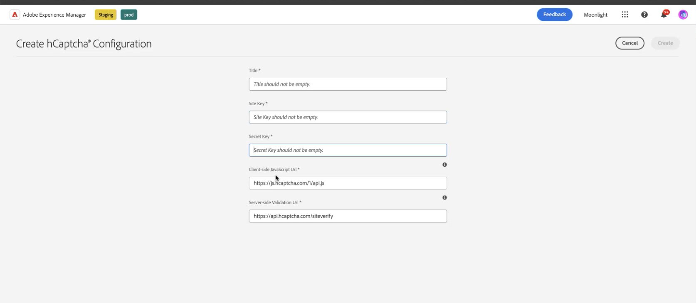

# Conecte seu ambiente AEM Forms com o hCaptcha® {#connect-your-forms-environment-with-hcaptcha-service}

Este recurso é baseado na identificação de alternância de recurso `FT_FORMS-12407`. Para habilitar o recurso, siga as etapas fornecidas no artigo [Habilitar alternância de recurso](/help/forms/using/enable-feature-toggle.md). 

O CAPTCHA (um teste de Turing público e completamente automatizado para diferenciar computadores e humanos) é um programa comumente usado em transações online para distinguir entre humanos e programas ou bots automatizados. O recurso apresenta um desafio e avalia a resposta do usuário para determinar se é um humano ou um bot interagindo com o site. O CAPTCHA impede que o usuário prossiga se o teste falhar e ajuda a tornar as transações online seguras, evitando que bots publiquem spam ou outro conteúdo mal-intencionado.

Além do hCaptcha®, o AEM Forms 6.5 é compatível com as seguintes soluções CAPTCHA:

* [Google reCAPTCHA](/help/forms/using/captcha-adaptive-forms.md)
* [Cilindro de nuvens](/help/forms/using/integrate-adaptive-forms-turnstile.md)

## Integrar o ambiente AEM Forms com o hCaptcha®

O serviço hCaptcha® protege seus formulários contra bots, spam e abuso automatizado. O recurso representa um desafio de dispositivo de caixa de seleção e avalia a resposta do usuário para determinar se um humano ou um bot está interagindo com o formulário. Ele impede que o usuário prossiga se o teste falhar e ajuda a tornar as transações online seguras, evitando que os bots publiquem spam ou atividades mal-intencionadas.

AEM 6.5 Suporte adaptável Forms hCaptcha&amp;reg. Você pode usá-lo para apresentar um desafio de widget de caixa de seleção no envio do formulário.

<!-- -->

### Pré-requisitos para integrar o ambiente do AEM Forms com o Captcha® {#prerequisite}

Para configurar o hCaptcha® com o AEM Forms, você precisa obter a [chave do site do hCaptcha® e a chave secreta](https://docs.hcaptcha.com/switch/#get-your-hcaptcha-sitekey-and-secret-key) do site do hCaptcha®.

### Configurar o hCaptcha® {#steps-to-configure-hcaptcha}

Para integrar o AEM Forms com o serviço hCaptcha®, execute as seguintes etapas:

1. Crie um Contêiner de configuração em seu ambiente AEM Forms, que contém as Configurações de nuvem usadas para conectar o AEM a serviços externos. Para criar um Contêiner de configuração:
   1. Abra o ambiente do AEM Forms.
   1. Vá para **[!UICONTROL Ferramentas > Geral > Navegador de Configuração]**.
   1. No Navegador de configuração, você pode selecionar uma pasta existente ou criar uma nova pasta:
      * Para criar uma nova pasta e ativar as Configurações de nuvem:
         1. No Navegador de Configuração, clique em **[!UICONTROL Criar]**.
         1. Na caixa de diálogo Criar configuração, especifique um nome, título e verifique as **[!UICONTROL Configurações de nuvem]**.
         1. Clique em **[!UICONTROL Criar]**.
      * Para ativar a Configuração na nuvem para uma pasta existente:
         1. No Navegador de Configuração, selecione a pasta e selecione **[!UICONTROL Propriedades]**.
         1. Na caixa de diálogo Propriedades de Configuração, habilite **[!UICONTROL Configurações de Nuvem]**.
         1. Clique em **[!UICONTROL Salvar e fechar]** para salvar a configuração e sair da caixa de diálogo.

1. Configurar os Cloud Service:
   1. Na instância do autor do AEM, vá para  > **[!UICONTROL Cloud Service]** e clique em **[!UICONTROL hCaptcha®]**.
      
   1. Selecione um Contêiner de configuração, criado ou atualizado, conforme descrito na seção anterior. Selecione **[!UICONTROL Criar]**.
      
   1. Especificar **[!UICONTROL Título]**, <!--**[!UICONTROL Name]**--> **[!UICONTROL Chave do Site]** e **[!UICONTROL Chave Secreta]** do serviço hCaptcha® [obtidas no Pré-requisito](#prerequisite).
   1. Clique em **[!UICONTROL Criar]**.

      

   >[!NOTE]
   > Os usuários não precisam modificar a [URL de validação do JavaScript do lado do cliente](https://docs.hcaptcha.com/#add-the-hcaptcha-widget-to-your-webpage) e a [URL de validação do lado do servidor](https://docs.hcaptcha.com/#verify-the-user-response-server-side), pois já estão pré-preenchidos para validação do hCaptcha®.

   Depois que o serviço hCAPTCHA é configurado, ele é disponibilizado para uso no formulário adaptável.

## Usar o hCaptcha® em um Forms adaptável {#using-hCaptcha-in-aem-6.5}

1. Abra o ambiente do AEM Forms.
1. Ir para **[!UICONTROL Forms]** > **[!UICONTROL Forms e Documentos]**.
1. Selecione um formulário adaptável e clique em **[!UICONTROL Propriedades]**.
1. No **[!UICONTROL Contêiner de configuração]**, selecione a configuração de nuvem do hCaptcha®.
1. Clique em **[!UICONTROL Salvar e fechar]**.

   Se você não tiver um Contêiner de configuração como esse, consulte a seção [Conecte seu ambiente AEM Forms com o hCaptcha®](#connect-your-forms-environment-with-hcaptcha-service) para entender como criar um Contêiner de configuração.

   

1. Selecione um formulário adaptável e clique em **[!UICONTROL Editar]** para abrir o formulário no editor.
1. No navegador de componentes, arraste e solte o componente **[!UICONTROL Captcha]** no Formulário adaptável.
1. Selecione o componente **[!UICONTROL Captcha®]** do formulário adaptável e clique no ícone  das propriedades para abrir a caixa de diálogo de propriedades. Especifique as seguintes propriedades:

   

   * **[!UICONTROL Título]:** Especifique o título para o componente Captcha.
   * **[!UICONTROL Mensagem de Validação]:** Forneça uma mensagem de validação para a validação de Captcha no envio do formulário ou em uma ação do usuário.
   * **[!UICONTROL Serviço de Captcha]:** Selecione o Serviço de CAPTCHA para envio de formulário, aqui você seleciona hCaptcha®.
   * **[!UICONTROL Configurações]:** Selecione a Configuração na Nuvem configurada para hCaptcha®.
     >[!NOTE]
     >Você pode ter várias configurações de nuvem no seu ambiente para uma finalidade semelhante. Então, escolha o serviço com cuidado. Se nenhum serviço estiver listado, consulte [Conectar seu ambiente AEM Forms com o hCaptcha®](#connect-your-forms-environment-with-hcaptcha-service) para saber como criar um Cloud Service que conecta seu ambiente AEM Forms com o serviço hCaptcha®.
   * **Mensagem de Erro:** Forneça a mensagem de erro a ser exibida ao usuário quando o envio do Captcha falhar.
   * **Tamanho do Captcha:** Você pode selecionar o tamanho de exibição da caixa de diálogo de desafio do hCaptcha®. Use a opção **[!UICONTROL Compactar]** para exibir um hCaptcha® de tamanho pequeno e o **[!UICONTROL Normal]** para exibir uma caixa de diálogo de desafio de hCaptcha® de tamanho relativamente grande ou **[!UICONTROL Invisível]** para validar o hCaptcha® sem renderizar explicitamente o widget caixa de seleção na interface do usuário.

1. Selecione **[!UICONTROL Concluído]**.

Agora, somente formulários legítimos, nos quais o preenchimento do formulário apaga com êxito o desafio imposto pelo serviço hCaptcha®, são permitidos no envio do formulário. hCaptcha®

**hCaptcha® é uma marca registrada da Intuition Machines, Inc.**

## Perguntas frequentes

* **P: Posso usar mais de um componente Captcha em um Formulário adaptável?**
* **Ans:** Não há suporte para o uso de mais de um componente Captcha em um Formulário adaptável. Além disso, não é recomendável usar um componente Captcha em um fragmento ou painel marcado para carregamento lento.

## Consulte também: {#see-also}

* [Uso de CAPTCHA em formulários adaptáveis](/help/forms/using/captcha-adaptive-forms.md)
* [Uso do Captcha com estrutura de rotação em formulários adaptáveis](/help/forms/using/integrate-adaptive-forms-turnstile.md)
