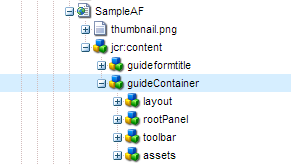

# Introduction to authoring adaptive forms {#introduction-to-authoring-adaptive-forms}

## Visão geral {#overview}

Formulários adaptáveis permitem criar formulários envolventes, responsivos, dinâmicos e adaptativos. A AEM Forms oferece uma interface de usuário intuitiva e componentes prontos para uso para criar e trabalhar com formulários adaptáveis. É possível optar por criar um formulário adaptável com base em um modelo de formulário ou schema ou sem um modelo de formulário. É importante escolher cuidadosamente o modelo de formulário que atende não apenas às suas necessidades, mas amplia seus investimentos e ativos de infraestrutura existentes. Você pode escolher entre as seguintes opções para criar um formulário adaptável:

* **Uso de um modelo de dados de formulário**
   [A integração](../../forms/using/data-integration.md) de dados permite integrar entidades e serviços de fontes de dados diferentes em um modelo de dados de formulário que pode ser usado para criar formulários adaptáveis. Escolha o modelo de dados do formulário se o formulário adaptativo que você está criando envolver a busca e a gravação de dados de e para várias fontes de dados.

* **Usando um modelo** de formulário XDP É um modelo de formulário ideal se você tiver investimentos em formulários XFA ou XDP. Ele fornece uma maneira direta de converter seus formulários baseados em XFA em formulários adaptáveis. Quaisquer regras XFA existentes são mantidas nos formulários adaptativos associados. Os formulários adaptativos resultantes suportam construções XFA, como validações, eventos, propriedades e padrões.

* **Usar uma Definição de Schema XML (XSD) ou schemas JSON** XML e JSON representam a estrutura na qual os dados são produzidos ou consumidos pelo sistema de back-end em sua organização. É possível associar o schema a um formulário adaptável e usar seus elementos para adicionar conteúdo dinâmico ao formulário adaptável. Os elementos do schema estarão disponíveis para uso na guia Objetos do modelo de dados do navegador Conteúdo ao criar formulários adaptáveis.

* **Usando nenhum modelo de formulário ou sem um modelo** Os formulários adaptáveis criados com essa opção não usam nenhum modelo de formulário. O XML de dados gerado desses formulários tem uma estrutura simples com campos e valores correspondentes.

Para obter mais informações sobre como criar um formulário adaptável, consulte [Criar um formulário](../../forms/using/creating-adaptive-form.md)adaptável.

## Interface adaptável de criação de formulário {#adaptive-form-authoring-ui}

A interface otimizada ao toque para a criação de formulários adaptáveis é intuitiva e fornece:

* Funcionalidade de arrastar e soltar
* Componentes de formulário padrão
* Repositório integrado para ativos

Ao criar um formulário novo ou editar um formulário adaptável existente, você usa os seguintes elementos da interface do usuário:

* [Barra lateral](#sidebar)
* [Barra de ferramentas da página](#page-toolbar)
* [Barra de ferramentas Componente](#component-toolbar)
* [Página de formulário adaptável](#af-page)

**A.** Barra lateral **B.** Barra de ferramentas da página **C.** Página do formulário adaptável

### Barra lateral {#sidebar}

A barra lateral permite

* Consulte o conteúdo do formulário, como painéis, componentes, campos e layout.
* Editar propriedades do componente.
* Pesquise, visualização e use ativos em seu repositório AEM Digital Asset Management (DAM).
* Adicione componentes ao formulário.

**A.** Navegador de conteúdo **B.** Navegador de propriedades **C.** Assets navegador **D.** Navegador de componentes

<!--Click to enlarge

](assets/sidebar-comps-1.png) -->

A barra lateral inclui os seguintes navegadores:

* **Navegador** de conteúdo No navegador de conteúdo, você pode ver

   * **Objetos de formulário** Mostra a hierarquia de objetos do formulário. O autor pode navegar até um componente de formulário específico tocando nesse elemento na Árvore de objetos de formulário. O autor pode pesquisar objetos e reorganizá-los a partir dessa árvore.

   * **Objetos**do modelo de dadosPermite visualizar a hierarquia do modelo de formulário.
Isso permite arrastar e soltar elementos de modelo de formulário no formulário adaptável. Os elementos adicionados são convertidos automaticamente em componentes de formulário enquanto mantêm suas propriedades originais. É possível ver objetos de modelo de dados quando o formulário usa schema XML, schema JSON ou modelo XDP.

* **Navegador de propriedades**

   Permite editar as propriedades de um componente. As propriedades mudam de acordo com um componente. Para ver as propriedades do container de formulário adaptável:

   Selecione um componente, toque em nível  campo > Container **[!UICONTROL de formulário]** adaptável e, em seguida, toque em .

* **Navegador de ativos**

   Segrega tipos diferentes de conteúdo, como imagens, documentos, páginas, filmes e assim por diante.

* **Navegador de componentes**

   Inclui componentes que podem ser usados para criar um formulário adaptável. Você pode arrastar os componentes para o formulário adaptável para adicionar elementos de formulário e configurar elementos adicionados de acordo com os requisitos. A tabela a seguir descreve os componentes listados no navegador de componentes.

<table>
 <tbody>
  <tr>
   <th><strong>Componente</strong></th>
   <th><strong>Funcionalidade</strong></th>
  </tr>
  <tr>
   <td>Bloco do Adobe Sign</td>
   <td>Adiciona um bloco de texto com espaços reservados para os campos a serem preenchidos durante a assinatura usando o Adobe Sign.</td>
  </tr>
  <tr>
   <td>Botão</td>
   <td>Adiciona um botão, que pode ser configurado para executar ações, como salvar, redefinir, seguir, ir anterior e assim por diante.</td>
  </tr>
  <tr>
   <td>Captcha</td>
   <td>Adiciona a validação CAPTCHA usando o serviço Google reCAPTCHA. Para obter detalhes, consulte <a href="../../forms/using/captcha-adaptive-forms.md" target="_blank">Uso do CAPTCHA em formulários</a>adaptáveis.</td>
  </tr>
  <tr>
   <td>Gráfico</td>
   <td>Adiciona um gráfico que pode ser usado em formulários e documentos adaptáveis para representação visual de dados bidimensionais em painéis repetitivos e linhas de tabela.</td>
  </tr>
  <tr>
   <td>Caixa de seleção</td>
   <td>Adiciona uma caixa de seleção.</td>
  </tr>
  <tr>
   <td>Campo de Entrada de Data</td>
   <td>Use o componente Campo de entrada de data no formulário para permitir que os clientes preencham o dia, o mês e o ano separadamente em três caixas. Você pode personalizar a aparência do componente e alterar o formato de data. Por exemplo, você pode permitir que seus clientes insiram datas no formato MM/DD/AAAA ou DD/MM/AAAA.</td>
  </tr>
  <tr>
   <td>Seletor de data</td>
   <td>Adiciona um campo de calendário para selecionar uma data.</td>
  </tr>
  <tr>
   <td>Fragmento do documento</td>
   <td>Permite adicionar componentes reutilizáveis de uma correspondência.</td>
  </tr>
  <tr>
   <td>Grupo de fragmento de documento</td>
   <td>Permite adicionar um grupo de fragmentos de documento relacionados que você pode usar em um modelo de carta como uma única unidade.</td>
  </tr>
  <tr>
   <td>Lista suspensa</td>
   <td>Adiciona uma lista suspensa - seleção única ou múltipla</td>
  </tr>
  <tr>
   <td>E-mail</td>
   <td>
Adiciona um campo para capturar o endereço de email. O componente Email, por padrão, valida endereços de email usando a seguinte expressão regular.
 
<code>^[a-zA-Z0-9.!#$%&amp;’*+/=?^_`{|}~-]+@[a-zA-Z0-9-]+(?:.[a-zA-Z0-9-]+)*$</code>
 </td>
  </tr>
  <tr>
   <td>Anexo de arquivo</td>
   <td>
Adiciona um botão que permite aos usuários navegar e anexar documentos de suporte a um formulário. É possível anexar vários arquivos a um componente de anexo Arquivo.
 
<strong> Nota: </strong><ul> <li> O componente não suporta anexar arquivos com nome de arquivo começando com caracteres (.), contendo caracteres \ / : * ? " &lt; &gt; | ; % $, ou que contenha nomes de arquivo especiais reservados para o sistema operacional Windows como nul, prn, con, lpt ou com. </li> <li> Para anexar vários arquivos a um componente de anexo de arquivo aberto no navegador Apple Safari, selecione e anexe os arquivos um a um. Não é possível selecionar e anexar vários arquivos de uma só vez.</li> <li>O componente Anexo de arquivo suporta um conjunto predefinido de formatos de arquivo em formulários adaptáveis habilitados para Adobe Sign. Para obter mais informações, consulte Formatos <a href="https://helpx.adobe.com/document-cloud/help/supported-file-formats-fill-sign.html#main-pars_text">de arquivo</a>suportados. </li> </ul>
 </td>
  </tr>
  <tr>
   <td>Lista de anexos de arquivo</td>
   <td>Adiciona um campo que lista todos os anexos carregados usando o componente Anexo de arquivo.</td>
  </tr>
  <tr>
   <td>Rodapé  </td>
   <td>Adiciona o cabeçalho da página que normalmente inclui o logotipo de uma empresa, o título do formulário e o resumo.  </td>
  </tr>
  <tr>
   <td>Cabeçalho</td>
   <td>Adiciona o rodapé da página que normalmente inclui informações de direitos autorais e links para outras páginas. </td>
  </tr>
  <tr>
   <td>Imagem</td>
   <td>Permite inserir uma imagem.</td>
  </tr>
  <tr>
   <td>Opção de Imagem</td>
   <td>Permite que seus clientes selecionem uma imagem para fornecer informações. Você pode usar as informações para fornecer serviços personalizados aos seus clientes.</td>
  </tr>
  <tr>
   <td>Próximo botão</td>
   <td>Adiciona um botão para navegar até o próximo painel em um formulário.</td>
  </tr>
  <tr>
   <td>Caixa numérica</td>
   <td>Adiciona um campo para capturar valores numéricos</td>
  </tr>
  <tr>
   <td>Escalonador Numérico</td>
   <td>Use o Numeric Stepper no formulário para permitir que seus clientes insiram um valor numérico, que pode aumentar ou diminuir com base em uma etapa predefinida.</td>
  </tr>
  <tr>
   <td>Painel</td>
   <td>
Adiciona um painel ou subpainel.
 
Você também pode adicionar um componente de painel da barra de ferramentas do painel pai usando o botão Adicionar painel</code> filho. Da mesma forma, é possível adicionar uma barra de ferramentas específica do painel usando o botão Adicionar barra de ferramentas</code> do painel. É possível configurar a posição da barra de ferramentas do painel usando a caixa de diálogo Editar painel.</code></code>
 </td>
  </tr>
  <tr>
   <td>Caixa de senha</td>
   <td>Adiciona um campo para capturar uma senha.</td>
  </tr>
  <tr>
   <td>Botão Anterior</td>
   <td>Adiciona um botão que os usuários precisam para voltar para a página ou painel anterior.</td>
  </tr>
  <tr>
   <td>Botão de opção</td>
   <td>Adiciona botões de opção.</td>
  </tr>
  <tr>
   <td>Botão de redefinição</td>
   <td>Adiciona um botão para redefinir campos de formulário.</td>
  </tr>
  <tr>
   <td>Botão salvar</td>
   <td>Adiciona um botão para salvar os dados do formulário.</td>
  </tr>
  <tr>
   <td>Assinatura</td>
   <td>Adiciona um campo para capturar assinaturas de script.</td>
  </tr>
  <tr>
   <td>Separador</td>
   <td>Permite a segregação visual de painéis em seu formulário.</td>
  </tr>
  <tr>
   <td>Etapa de assinatura</td>
   <td>Exibe as informações fornecidas no formulário e os campos de assinatura para que o usuário verifique e assine o formulário.</td>
  </tr>
  <tr>
   <td>Texto</td>
   <td>Permite que você especifique um texto estático.</td>
  </tr>
  <tr>
   <td>Botão enviar</td>
   <td>Adiciona um botão Enviar para enviar o formulário para a ação de envio configurada.</td>
  </tr>
  <tr>
   <td>Etapa de resumo</td>
   <td>Envia o formulário e exibe o texto resumido que os autores especificam após o envio do formulário. </td>
  </tr>
  <tr>
   <td>Alternar</td>
   <td>Adiciona um switch que executa uma ação de alternância ou ativação/desativação. Não é possível adicionar mais de duas opções no componente Switch. Como um switch pode ter apenas dois valores: Ligado ou desligado, obrigatório não é aplicável. Pelo menos um valor é salvo independentemente da entrada do usuário.   </td>
  </tr>
  <tr>
   <td>Tabela</td>
   <td>Adiciona uma tabela que permite organizar dados em linhas e colunas. </td>
  </tr>
  <tr>
   <td>Telefone</td>
   <td>
Adiciona um campo para capturar o número de telefone. O componente Telephone permite que os autores configurem um dos seguintes tipos de números de telefone. Cada tipo está associado a uma expressão regular padrão para validação.

    <ul>
     <li>O Tipo Internacional é validado por <code>^[+][0-9]{0,14}$</code>.</li>
     <li>Digite USPhoneNumber é validado por <code>{'+1 ('999') '999-9999}</code>.</li>
     <li>O tipo UKPhoneNumber é validado por <code>text{'+'99 999 999 9999}</code>.</li>
     <li>Tipo Personalizado não fornece um padrão de validação padrão. Obtém o valor do último tipo de número de telefone selecionado. Você também pode especificar seu próprio padrão de validação personalizado.</li>
    </ul> </td>
  </tr>
  <tr>
   <td>Termos e condições  </td>
   <td>Adiciona um campo que os autores podem usar para especificar os termos e condições que os usuários devem revisar antes de preencher o formulário.</td>
  </tr>
  <tr>
   <td>Caixa de texto </td>
   <td>
Adiciona uma caixa de texto na qual o usuário pode especificar as informações necessárias. 
 
Por padrão, o componente Caixa de texto aceita somente texto sem formatação. Você pode ativar um componente de Caixa de texto para aceitar Texto formatado. Um componente de texto habilitado para Rich Text fornece opções para adicionar cabeçalhos, alterar estilos de caractere (negrito, itálico, sublinhar os caracteres), criar listas ordenadas e não ordenadas, alterar o plano de fundo do texto e a cor do texto e adicionar hiperlinks. Para ativar rich text para uma caixa de texto, ative a opção<strong> Permitir Rich Text</strong> nas propriedades do componente.
 </td>
  </tr>
  <tr>
   <td>Título</td>
   <td>Especifica um título para o formulário adaptável.</td>
  </tr>
  <tr>
   <td>Etapa de verificação</td>
   <td>
Adiciona um espaço reservado para exibir o formulário preenchido para verificação pelo usuário.
 
<strong>Observação</strong>: O formulário adaptável que contém o componente Verify não suporta usuários anônimos. Além disso, não é recomendável usar o componente Verify em um fragmento de formulário adaptável.
 </td>
  </tr>
 </tbody>
</table>

#### Práticas recomendadas para trabalhar com componentes {#best-practices}

Algumas práticas recomendadas e pontos importantes a serem lembrados ao trabalhar com componentes de formulário adaptáveis são os seguintes:

* Cada componente tem propriedades associadas que controlam sua aparência e funcionalidade. Para configurar as propriedades de um componente, toque no componente e em  para abrir as propriedades do componente no navegador Propriedades.
* Um componente é identificado com seu nome de elemento. Ao tocar em , é possível alterar o nome do componente alterando o valor do campo Nome **[!UICONTROL do]** elemento no navegador de propriedades. O campo Nome do elemento aceita somente letras, números, hífens (-) e sublinhados (_). Outros caracteres especiais não são permitidos e o nome do elemento deve começar com uma letra.

* É possível modificar a propriedade Título de um componente de formulário adaptável em linha no editor de formulário sem abrir o navegador Propriedades, desde que o título esteja visível no formulário. Para isso:

   1. Toque para selecionar um componente que tenha uma propriedade **[!UICONTROL Title]** e cuja propriedade **[!UICONTROL Ocultar título]** esteja desativada.

   1. Toque em  para tornar o título editável.

   1. Modifique o título e toque na tecla Return ou toque em qualquer lugar fora do componente para salvar as alterações. Toque na tecla Esc para descartar as alterações.

* Alguns componentes de formulário adaptáveis, como Email e Telefone, incluem padrões de validação prontos para uso. No entanto, você pode especificar a validação personalizada atualizando o campo Padrão **[!UICONTROL de]** validação sob a opção Padrões nas propriedades do componente. Consulte as descrições de componentes na tabela acima para obter mais informações sobre validações padrão.

* Campos de formulários adaptáveis, como Caixa numérica e Email, podem ser configurados para incluir tipos de entrada HTML5 especializados. Quando esses campos estão em foco em dispositivos móveis e tablets, o teclado exibe um alfabeto, números e caracteres específicos na frente que são comumente usados para inserir informações nos campos. Ajuda os usuários a inserir informações rapidamente sem precisar alternar entre conjuntos de caracteres no teclado. Para permitir entrada especializada para um componente, ative a caixa de seleção **[!UICONTROL Usar número]** de tipo HTML em suas propriedades de componente.

* Você pode ativar um componente de Caixa de texto para aceitar Texto formatado. Para ativar rich text para uma caixa de texto, ative a caixa de seleção **[!UICONTROL Permitir Rich Text]** nas propriedades do componente.

* Você pode ativar os componentes Caixa de texto, Email e Telefone para preencher automaticamente valores de campos como nome, endereço, cartão de crédito, telefone e email a partir das informações armazenadas nas configurações de preenchimento automático do navegador. Para ativar esse recurso, selecione **[!UICONTROL Ativar preenchimento]** automático nas propriedades do componente e selecione um Atributo **[!UICONTROL de preenchimento]** automático. Quando um usuário preenche um formulário adaptável, os valores são sugeridos do perfil de preenchimento automático no navegador ou com base nos valores preenchidos anteriormente pelo usuário. Observe que o preenchimento automático funciona se as configurações de preenchimento automático no navegador do usuário estiverem ativadas.

* Especifique valores para itens de Botão de opção e Caixa de seleção no `{value}={text}` formato nas propriedades do componente.
* O componente de anexo Arquivo, por padrão, permite que um usuário anexe apenas um arquivo. No entanto, é possível configurar as propriedades do componente para suportar vários anexos. Além disso, se um usuário anexar vários arquivos com o mesmo nome de arquivo, os anexos podem causar alguns problemas. Portanto, é recomendável associar um identificador exclusivo para cada anexo enviado no envio do formulário. Para isso:

   1. No servidor AEM Forms, navegue até **[!UICONTROL Adobe Experience Manager]** > **[!UICONTROL Ferramentas]** > **[!UICONTROL Operações]** > Console **[!UICONTROL da Web]**.
   1. Localize e toque em Serviço **[!UICONTROL de configuração]** adaptável Forms.
   1. Na caixa de diálogo Adaptive Forms Configuration Service, ative **[!UICONTROL Tornar nomes de arquivos únicos]**. Por padrão, ele é desativado.

* Para permitir que os usuários anexem um PDF usando o navegador Safari, verifique se o **aplicativo/pdf** foi adicionado à propriedade Tipos de arquivo suportados do componente de anexo Arquivo. Formulários adaptáveis criados com a versão anterior do AEM Forms podem conter **.pdf** em vez de **application/pdf** na propriedade Tipos de arquivo suportados.

Para obter mais práticas recomendadas sobre formulários adaptáveis, consulte [Práticas recomendadas para trabalhar com formulários](/help/forms/using/adaptive-forms-best-practices.md)adaptáveis.

>[!NOTE]
>
>Os componentes de formulário adaptáveis não suportam os idiomas da direita para a esquerda (RTL). Por exemplo, hebraico.

### Barra de ferramentas da página {#page-toolbar}

A barra de ferramentas da página na parte superior fornece opções que permitem que você pré-visualização o formulário, altere as propriedades do formulário e edite o layout do formulário. É possível pré-visualização o formulário ao criá-lo e fazer alterações de acordo. Na barra de ferramentas da página, você verá:

* **Alternar painel** lateral : Permite mostrar ou ocultar a barra lateral.

* **Opções** de da página: Permite que você visualização as propriedades da página, publique/despublique um formulário, start um fluxo de trabalho de formulário e abra o formulário na interface clássica.

* **Emulador** : Permite que você emule a aparência do formulário para tamanhos de exibição diferentes, como tablets e telefones.

* **Editar**: Permite selecionar outros modos, como: **[!UICONTROL Editar]**, **[!UICONTROL Estilo]**, **[!UICONTROL Desenvolvedor]** e **[!UICONTROL Design]**.

   * **Editar**: Permite editar as propriedades do formulário e de seus componentes. Por exemplo, adicionar um componente, soltar uma imagem e especificar campos obrigatórios.
   * **Estilo**: Permite estilizar a aparência dos componentes do formulário. Por exemplo, no modo de estilo, é possível selecionar um painel e especificar sua cor de plano de fundo.

   * **Desenvolvedor**: Permite que um desenvolvedor:

      * Descubra de quais formulários são compostos.
      * Depurar o que está acontecendo onde e quando, o que por sua vez ajuda a resolver problemas.
   * **Design**. Permite ativar ou desativar componentes personalizados ou componentes prontos para uso que não estejam listados na barra lateral.

* **Pré-visualização**: Permite que você pré-visualização a aparência do formulário ao publicá-lo.

### Component toolbar {#component-toolbar}

Ao selecionar um componente, você verá uma barra de ferramentas que permite que você trabalhe nele. Você obtém opções para recortar, colar, mover e especificar propriedades dos componentes. Suas opções são:

A.**Configurar**: Quando você toca em **[!UICONTROL Configurar]**, as propriedades do componente ficam visíveis na barra lateral. A configuração dessas propriedades permite personalizar a experiência de captura de dados. Você pode alterar o nome do elemento do componente, especificar o texto do rótulo no campo Título do componente. O nome do elemento permite capturar valores inseridos pelos usuários usando o componente. Nas propriedades do componente, especifique o comportamento do componente e gerencie a entrada do usuário. Configure as propriedades na barra lateral para capturar os dados do usuário e usá-los para processamento adicional. As propriedades do container de formulário adaptável permitem especificar as bibliotecas do cliente, os layouts, os Temas, as configurações do Documento de registro, as configurações de salvamento, as configurações de envio e as configurações de metadados.

B.**Copiar**: É possível usar a opção de cópia para copiar um componente e colá-lo em outros locais no formulário. Quando você cola um componente, o componente colado recebe um novo nome de elemento, mas retém as propriedades do componente copiado.

C.**Cortar**: Use a opção de corte para mover um componente de um lugar para outro no formulário adaptável.

D. **Excluir**: Permite excluir o componente do formulário.

E. **Inserir**: Permite inserir um componente acima do componente selecionado.

F. **Colar**: Permite colar o componente que você recortou ou copiou usando as opções descritas acima.

G. **Editar regras**: Permite abrir o editor de regras. Para obter mais informações, consulte Editor [de](../../forms/using/rule-editor.md)regras.

H. **Grupo**: Permite selecionar vários componentes se você deseja recortar, copiar ou colar mais de um componente juntos.

Eu. **Pai**: Permite selecionar o pai de um componente. Por exemplo, um campo de texto está em uma subseção, que reside em uma seção. A seção fica no painel raiz guia e o container de formulário adaptável é o pai de um painel raiz guia. Para um componente, você pode ver todas as opções com os fundos classificados na hierarquia.

Por exemplo, se você tocar em **[!UICONTROL Pai]** para uma caixa de texto, poderá ver:

* Subseção
* Seção
* guideRootPanel
* Container de formulário adaptável

J. **Outros**: Fornece mais opções para trabalhar com o componente selecionado.

* Expressão SOM visualização
* Salvar um painel como fragmento (somente para painéis)
* Adicionar painel filho (somente para painéis)
* Adicionar barra de ferramentas do painel (somente para painéis)
* Substituir (não para painéis)

### Adaptive form page {#af-page}

A página de formulário adaptável é o formulário real. É como qualquer outra página WCM modelada como o componente WCM `cq:Page` . A imagem a seguir mostra a estrutura de conteúdo de um formulário adaptável típico.

A estrutura de conteúdo normalmente contém os seguintes componentes principais:

* **guideContainer**: A raiz de um formulário adaptável, que é marcada como **[!UICONTROL Start de forma]** adaptável na interface de usuário do formulário adaptável. Neste componente, você pode especificar:

   * *Layout móvel do formulário* adaptável: Define a aparência do formulário em dispositivos móveis.
   * *Página* de agradecimento: Define a página na qual o usuário é redirecionado após o envio do formulário.
   * *Ação* Enviar: Define como o formulário é processado no servidor depois que o usuário envia o formulário.
   * *Estilo*: Especifica o caminho para o arquivo CSS usado para personalizar a aparência do formulário.

* **rootPanel:** O painel raiz de um formulário adaptável. Ele pode conter subpainéis sob o nó itens. Cada painel, incluindo o painel raiz, pode ter um layout associado a ele. O layout do painel determina como o formulário é posicionado. Por exemplo, no layout Acordeão, seus itens são posicionados como etapas Acordeão.

* **barra de ferramentas:** Um container de formulário adaptável tem uma barra de ferramentas global associada, que é global ao formulário. Essa barra de ferramentas pode ser adicionada usando a ação **[!UICONTROL Adicionar barra de ferramentas]** na barra de edição, que permite aos autores adicionar ações, como Enviar, Salvar, Redefinir etc.

* **ativos:** Esse nó contém informações adicionais usadas para a criação de formulários. Por exemplo, detalhes do modelo de formulário, detalhes da localização e assim por diante).

