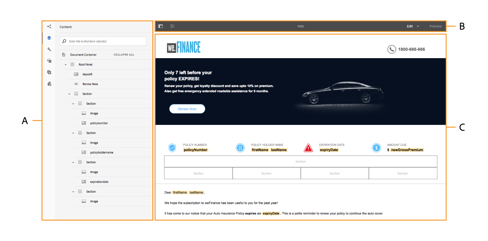
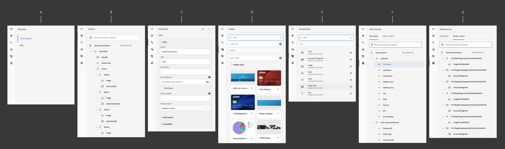
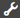
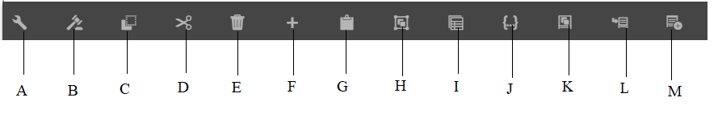
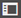
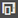

# Introdução à interface de criação da comunicação interativa{#introduction-to-interactive-communication-authoring-ui}

A interface de usuário para criação da [Comunicação Interativa](/help/forms/using/interactive-communications-overview.md) é intuitiva e fornece o seguinte para criação de canais de impressão e da Web da Comunicação Interativa:

* editor de documentos de arrastar e soltar do WYSIWYG
* Repositório integrado para ativos - os ativos carregados e criados no servidor estão disponíveis no navegador de ativos da interface de criação da Comunicação interativa

Ao [criar ou editar uma Comunicação Interativa existente](../../forms/using/create-interactive-communication.md), use os seguintes elementos de interface do usuário:

* [Barra lateral](#sidebar)
* [Barra de ferramentas da página](#page-toolbar)
* [Barra de ferramentas Componente](#component-toolbar)
* Área de conteúdo

**A.** Barra lateral **B.** Barra de ferramentas de página **C.** Área de conteúdo

## Barra lateral {#sidebar}

**A.** Navegador de canal **B.** Navegador de conteúdo **C.** Navegador de propriedades **D.** Navegador de ativos **E.** Navegador de componentes **F.** Navegador de Fontes de Dados - Modelo de Dados **G.** Navegador de Fontes de Dados - Conteúdo Principal

<!--
Click to enlarge

-->

A barra lateral inclui o seguinte:

* **Navegador do canal**

O navegador Canal ajuda a alternar entre os canais de impressão e da Web da Comunicação interativa. Com base no canal selecionado no navegador do canal, os navegadores, como Conteúdo e Componentes, exibem as opções.

* **Navegador de conteúdo**
No navegador de conteúdo, é possível ver a hierarquia de objetos do documento para o canal selecionado. O autor pode navegar até um componente específico tocando nesse elemento na Árvore de objetos de documento. O autor pode pesquisar objetos no canal da Web e reorganizá-los a partir dessa árvore.

* **Navegador de propriedades**

  Permite editar as propriedades de um componente. As propriedades mudam de acordo com o componente. Por exemplo, para ver as propriedades do contêiner de documento:
Selecione um componente, selecione  > **Contêiner de Documentos** e selecione .

* **Navegador Assets**
Segrega diferentes tipos de conteúdo, como fragmentos de layout, imagens, documentos, páginas e vídeos. O autor pode arrastar e soltar ativos na Comunicação interativa.

* **Navegador de componentes**
Includes components that you can use to build the print and web channels of a document. You can drag components to the Interactive Communication to add elements, and configure added element as per the requirements. The following table describes the components listed in Components browser for print and web channels:

| **Componente** | **Print Channel** | **Web Channel** | **Functionality** |
|---|---|---|---|
| Gráfico | ✓ | ✓ | Adds a chart that you can use in an Interactive Communication for visual representation of two-dimensional data retrieved from a form data model collection item. |
| Fragmento do documento | ✓ | ✓ | Lets you add a reusable component, text, list, or condition, to an Interactive Communication. The reusable component you add to an Interactive Communication could be either form data model-based or without a form data model. |
| Imagem | ✓ | ✓ | Lets you insert an image. |
| Painel | - | ✓ | The Panel component is a placeholder for grouping other components together and controls how a group of components are laid out in an Interactive Communication. A panel component also lets you make a group of components repeatable for the end user, such as in multiple entries required for filling in educational credentials. It is also a good practice to use a panel each for a tab of an Interactive Communication with multiple tabs. |
| Tabela | &#42; | ✓ | Adiciona uma tabela que permite organizar dados em linhas e colunas. |
| Área de destino | &#42;&#42; | ✓ | Inserts a target area in a web channel to organize the web-channel-specific components. |
| Texto | - | ✓ | Adds text to the web channel of an Interactive Communication. Text can use form data model objects to make the content dynamic. |

&#42; Use Layout Fragments in the Print channel to add tables.

&#42;&#42; In the Print channel, target areas are predefined in the XDP/print template. You cannot add new target areas using the Interactive Communication authoring UI.

* **Data Sources Browser**
Data Sources Browser displays the available data sources in the form data model you selected while creating the Interactive Communication.

### Key points for working with components {#key-points-for-working-with-components}

Key points when working with interactive communication components are as follows:

* Each component has associated properties that control its appearance and functionality. To configure the properties of a component, select the component and select  to open the component properties in the Properties browser.
* Um componente é identificado com seu nome de elemento. Ao selecionar , você pode alterar o nome do componente alterando o valor do campo Nome do Elemento no navegador de propriedades. O campo Nome do elemento aceita somente letras, números, hifens (-) e sublinhados (_). Outros caracteres especiais não são permitidos e o nome do elemento deve começar com uma letra.
* Você pode modificar a propriedade Title de um componente de Comunicação interativa em linha no editor sem abrir o navegador Propriedades, desde que o título esteja visível na Comunicação interativa. Para fazer isso:

   1. Selecione para selecionar um componente que tenha uma propriedade Title e cuja propriedade Hide title esteja desativada.
   1. Selecione  para tornar o título editável.

   1. Modifique o título e selecione a tecla Return ou selecione qualquer lugar fora do componente para salvar as alterações. Selecione a tecla Esc para descartar as alterações.

## Barra de ferramentas Componente {#component-toolbar}

Ao selecionar um componente, você vê uma barra de ferramentas que permite trabalhar com ele. Há opções para recortar, colar, mover e especificar as propriedades dos componentes. As opções são:

A.**Configurar**: ao selecionar **Configurar**, as propriedades do componente ficam visíveis na barra lateral.

B.**Editar Regras**: quando você seleciona Editar Regras, o Editor de Regras é exibido no qual você pode editar e criar regras para o componente selecionado. No Editor de regras, você também pode selecionar outros objetos de formulário (componentes) e editar/criar regras para esses objetos de formulário.

C.**Copy**: você pode usar a opção de cópia para copiar um componente e colá-lo em outros locais na Comunicação Interativa.

D.**Cut**: é possível usar a opção de recortar para mover um componente de um local para outro na Comunicação Interativa.

E. **Excluir**: permite excluir o componente da Comunicação Interativa.

F. **Inserir componente**: Permite inserir um componente acima do componente selecionado.

G. **Colar**: permite colar o componente recortado ou copiado usando as opções descritas acima.

H. **Grupo**: permite selecionar vários componentes se você deseja cortar, copiar ou colar mais de um componente.

I. **Página principal**: permite selecionar a página principal de um componente.

J. **Exibir expressão SOM:** Permite exibir a [expressão SOM](../../forms/using/using-som-expressions-adaptive-forms.md) do componente.

K: **Agrupar objetos no Painel:** Permite agrupar os componentes em um painel para poder executar operações nesses componentes simultaneamente. Para obter detalhes, consulte [Agrupar objetos no Painel](create-interactive-communication.md#groupobjectspanel).

L. **Adicionar Painel Filho** (somente para painéis): permite adicionar um painel filho ao painel.

M: **Adicionar a Barra de Ferramentas do Painel** (somente para painéis):Lets você adiciona a Barra de Ferramentas do componente Painel. Em seguida, você poderá executar outras ações na barra de ferramentas.

Além disso, a opção **Substituir** da barra de ferramentas permite substituir o componente existente por um componente alternativo. A opção não está disponível para o componente Painel.

## Barra de ferramentas da página {#page-toolbar}

A barra de ferramentas Página na parte superior fornece opções que permitem visualizar a Comunicação interativa e alterar suas propriedades. Você pode visualizar a comunicação interativa ao criá-la e fazer as alterações apropriadas. Na barra de ferramentas da página, você observa:

* Alternar painel lateral : permite mostrar ou ocultar a barra lateral.
* Informações da página : permite exibir as propriedades da página.
* Emulador : permite que você emule a aparência da sua Comunicação Interativa para diferentes tamanhos de exibição, como tablets e telefones.
* Editar: permite selecionar outros modos, como Editar, Estilo, Desenvolvedor e Design.

   * Editar: permite editar as propriedades da Comunicação interativa e seus componentes. Por exemplo, adicionar um componente, soltar uma imagem e especificar campos obrigatórios.
   * Estilo: permite estilizar a aparência dos componentes da sua Comunicação interativa. Por exemplo, no modo de estilo, é possível selecionar um painel e especificar a cor do plano de fundo.
   * Desenvolvedor: permite que um desenvolvedor:

      * Descubra o que a comunicação interativa é composta.
      * Depure onde e quando está acontecendo, o que, por vezes, ajuda a resolver problemas.

   * Target: permite ativar ou desativar componentes personalizados ou componentes prontos para uso que não estão listados na Barra lateral.

* Visualização: permite que você visualize a aparência da comunicação interativa ao publicá-la.
