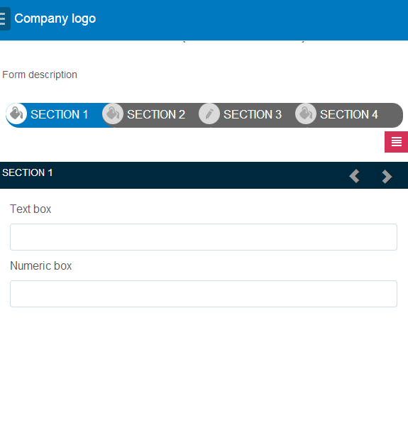

# Recursos de layout de formulários adaptáveis{#layout-capabilities-of-adaptive-forms}

O Adobe Experience Manager (AEM) permite que você crie formulários adaptativos fáceis de usar que oferta experiências dinâmicas para os usuários finais. O layout do formulário controla como os itens ou componentes são exibidos em um formulário adaptável.

## Conhecimento pré-requisito {#prerequisite-knowledge}

Antes de saber mais sobre os diferentes recursos de layout de formulários adaptáveis, leia os artigos a seguir para saber mais sobre formulários adaptáveis.

[Introdução aos AEM Forms](../../forms/using/introduction-aem-forms.md)

[Introdução à criação de formulários](../../forms/using/introduction-forms-authoring.md)

## Tipos de layouts {#types-of-layouts}

Um formulário adaptável fornece os seguintes tipos de layouts:

**Layout** do painel Controla como os itens ou componentes dentro de um painel são exibidos em um dispositivo.

**Layout** móvel Controla a navegação de um formulário em um dispositivo móvel. Se a largura do dispositivo for de 768 pixels ou mais, o layout será considerado um layout móvel e otimizado para um dispositivo móvel.

**Layout** da barra de ferramentas Controla a posição dos botões de Ação na barra de ferramentas ou na barra de ferramentas do painel em um formulário.

Todos esses layouts de painel são definidos no seguinte local:

`/libs/fd/af/layouts`.

>[!NOTE]
>
>Para alterar o layout de um formulário adaptável, use o Modo de criação no AEM.


## Layout do painel {#panel-layout}

Um autor de formulário pode associar um layout a cada painel de um formulário adaptável, incluindo o painel raiz.

Os layouts do Painel estão disponíveis no `/libs/fd/af/layouts/panel` local.


Lista de layouts de painel em formulários adaptáveis

### Responsive - everything on one page without navigation {#responsive-everything-on-one-page-without-navigation-br}

Use esse layout de painel para criar um layout responsivo que se ajuste ao tamanho da tela do seu dispositivo sem precisar de navegação especializada.

Usando esse layout, é possível colocar vários componentes de formulário **[!UICONTROL adaptáveis do]** painel, um após o outro dentro do painel.


Um formulário usando layout responsivo, como visto em uma tela pequena


Um formulário que usa layout responsivo como visto em uma tela grande

### Assistente - um formulário em várias etapas mostrando uma etapa por vez {#wizard-a-multi-step-form-showing-one-step-at-a-time}

Use esse layout de painel para fornecer navegação guiada dentro de um formulário. Por exemplo, use esse layout quando quiser capturar informações obrigatórias em um formulário, ao mesmo tempo que orienta os usuários passo a passo.

Use o `Panel adaptive form` componente para fornecer navegação passo a passo dentro de um painel. Quando você usa esse layout, um usuário move para a próxima etapa somente após a conclusão da etapa atual

```javascript
window.guideBridge.validate([], this.panel.navigationContext.currentItem.somExpression)
```


expressão de conclusão de etapas no layout Assistente para um formulário em várias etapas


Um formulário usando o Assistente

### Layout para design acordeão {#layout-for-accordion-design}

Usando esse layout, você pode colocar o `Panel adaptive form` componente em um painel com a navegação no estilo acordeão. Usando esse layout, também é possível criar painéis repetíveis. Painéis repetidos permitem adicionar ou remover dinamicamente painéis, conforme necessário. É possível definir o número mínimo e máximo de vezes que um painel se repete. Além disso, o título do painel pode ser determinado dinamicamente, com base nas informações fornecidas nos itens do painel.

A expressão de resumo pode ser usada para mostrar os valores fornecidos pelo usuário final no título do painel minimizado.


Painéis repetidos criados com o layout Acordeão

### Layout com guias - as guias são exibidas à esquerda {#tabbed-layout-tabs-appear-on-the-left}

Usando esse layout, você pode colocar o `Panel adaptive form` componente em um painel com navegação por guias. As guias são colocadas à esquerda do conteúdo do painel.


Guias que aparecem à esquerda de um painel

### Layout com guias - as guias são exibidas na parte superior {#tabbed-layout-tabs-appear-on-the-top}

Usando esse layout, você pode colocar o Componente em um painel com a navegação por guias. `Panel adaptive form` As guias são colocadas na parte superior do conteúdo do painel.


Guias que aparecem na parte superior de um painel

## Layouts móveis {#mobile-layouts}

Os layouts móveis permitem uma navegação fácil de usar nos dispositivos móveis com telas relativamente menores. Os layouts móveis usam estilos de guias ou de assistente para navegação de formulário. Aplicar um layout móvel fornece um único layout para o formulário inteiro.

Esse layout controla a navegação usando uma barra de navegação e um menu de navegação. A barra de navegação mostra o ícone **&lt;** e **>** para indicar as etapas de navegação **seguintes** e **anteriores** no formulário.

Os Layouts móveis estão disponíveis no `/libs/fd/af/layouts/mobile/` local. Os seguintes layouts para dispositivos móveis estão disponíveis em formulários adaptáveis, por padrão.


Lista de layouts móveis em formulários adaptáveis

Ao usar um layout móvel, o menu de formulário, para acessar vários painéis de formulário, fica disponível tocando no ícone  .

### Layout com títulos de painel no cabeçalho do formulário {#layout-with-panel-titles-in-the-form-header}

Esse layout, como o nome sugere, mostra os títulos do painel junto com o menu de navegação e a barra de navegação. Esse layout também fornece ícones Próximo e Anterior para navegação.



Layouts móveis com títulos de painel nos cabeçalhos de formulário

### Layout sem títulos de painel no cabeçalho do formulário {#layout-without-panel-titles-in-the-form-header}

Esse layout, como o nome sugere, mostra apenas o menu de navegação e a barra de navegação sem títulos do painel. Esse layout também fornece ícones Próximo e Anterior para navegação.


Layouts móveis sem títulos de painel nos cabeçalhos do formulário

## Layouts da barra de ferramentas {#toolbar-layouts}

O Layout da barra de ferramentas controla o posicionamento e a exibição de todos os botões de ação adicionados aos formulários adaptáveis. O layout pode ser adicionado no nível do formulário ou no nível do painel.


Uma lista de layouts da barra de ferramentas em formulários adaptáveis

Os layouts da barra de ferramentas estão disponíveis no `/libs/fd/af/layouts/toolbar` local. por padrão, os formulários adaptáveis fornecem os seguintes Layouts da barra de ferramentas.

### Layout padrão da barra de ferramentas {#default-layout-for-toolbar}

Esse layout é selecionado como o layout padrão quando você adiciona qualquer botão de ação em um formulário adaptável. Selecionar esse layout exibe o mesmo layout para dispositivos móveis e desktop.

Além disso, você pode adicionar várias barras de ferramentas que contêm botões de ação configurados com esse layout. Um botão de ação está associado a um controle de formulário. É possível configurar as barras de ferramentas para serem anteriores ou posteriores a um painel.


visualização padrão da barra de ferramentas

### Layout móvel fixo para a barra de ferramentas {#mobile-fixed-layout-for-toolbar}

Selecione este layout para fornecer layouts alternativos para dispositivos móveis e desktop.

Para o layout da área de trabalho, é possível adicionar botões de ação usando alguns rótulos específicos. Somente uma barra de ferramentas pode ser configurada com este layout. Se mais de uma barra de ferramentas estiver configurada com esse layout, há uma sobreposição para dispositivos móveis e apenas uma barra de ferramentas estará visível. Por exemplo, é possível ter uma barra de ferramentas na parte inferior ou superior do formulário ou, depois ou antes dos painéis do formulário.

Para o layout móvel, é possível adicionar botões de ação usando ícones.


Layout móvel fixo para a barra de ferramentas

