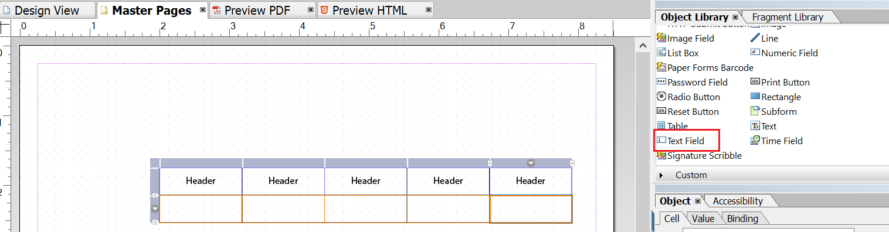

# Design de layout{#layout-design}

Os modelos de formulário XFA ou XDPs são os modelos para:

* [Cartas](/help/forms/using/create-letter.md)
* [Imprimir canal](/help/forms/using/web-channel-print-channel.md#printchannel) de Comunicações [Interativas](/help/forms/using/interactive-communications-overview.md)

* Fragmentos de layout

Um XDP foi projetado no Adobe Forms Designer. Este artigo fornece detalhes sobre como projetar seus XDPs para criar correspondências eficazes/Comunicações interativas, como onde usar campos de formulário ou áreas de público alvo e quando usar fragmentos de layout.

## Criação de um layout para letras ou para o canal de impressão do Interative Communications {#creating-a-layout-for-letters-or-for-interactive-communications-print-channel}

Um layout define o layout gráfico de um canal de letra/impressão de uma Comunicação interativa. O layout pode conter campos de formulário típicos, como &quot;Endereço&quot; e &quot;Número de referência&quot;. Ele também contém subformulários vazios que indicam áreas de público alvo. Crie o layout no designer de formulários e, quando concluído, o Application Specialist o carregará para o servidor AEM. A partir daí, você pode selecionar o layout ao criar um modelo de correspondência ou imprimir um canal de uma Comunicação interativa.

Siga estas etapas para criar layouts para letras/imprimir canal de Comunicações interativas:

1. Analise o layout e determine o conteúdo que está sendo repetido em todas as páginas; normalmente, o cabeçalho e o rodapé da página se encaixam nessa categoria. Esse conteúdo é colocado nas páginas mestre do layout. O conteúdo restante vai para as páginas de corpo do layout. Em um conjunto de políticas, o logotipo e o endereço da empresa podem ser adicionados ao cabeçalho e rodapé da página mestre. Por exemplo, Aviso de cancelamento usa o mesmo layout.
1. Ao projetar páginas de corpo, divida o conteúdo da página em seções. Cada seção é projetada como um subformulário incorporado no próprio layout ou como um layout de fragmento. Se a seção contiver tabela, modele a seção como um fragmento de layout.
1. Um Layout pode ser projetado da seguinte maneira:

   1. Crie cada seção como um subformulário separado contendo todos os elementos da seção.
   1. Torne cada subformulário de seção filho do mesmo subformulário pai. O layout do subformulário pai está definido para continuar, permitindo que as seções se alternem para baixo no caso de dados grandes serem unidos em seções anteriores.
   1. Seção A residência principal também pode ser reutilizada em outros layouts. Crie-o como um layout de fragmento.
   1. Seção Detalhes de interesse adicionais contêm apenas dois elementos colocados um abaixo do outro, podem conter dados grandes e são projetados como continuados.
   1. Outras seções contêm elementos em posições específicas para que sejam projetadas como layout posicionado.
   1. Divida uma seção em subformulários se ela contiver elementos em posições específicas e esses elementos contiverem grandes quantidades de dados. Em seguida, organize os subformulários para alcançar o comportamento desejado.
   1. Para a seção Residência primária, adicione uma área de público alvo de espaço reservado. Esse espaço reservado está vinculado ao fragmento Residência primária no momento do design de letra/Comunicação interativa.
   1. Carregue o layout (e o fragmento, se houver, que usa o layout) no servidor de formulários AEM.

### Usar subformulário em um modelo XDP {#usesubformxdp}

Depois de analisar o layout necessário para criar a Comunicação interativa, você pode criar subformulários no modelo XDP usando o Forms Designer. Os componentes de subformulário em branco usados no modelo XDP resultam na exibição de áreas de público alvo no canal Imprimir da Comunicação Interativa.

>[!NOTE]
>
>Adicione conteúdo ao canal Imprimir da Comunicação interativa em vez de adicionar conteúdo ao componente de subformulário no modelo XDP. Adicione conteúdo às áreas de público alvo no canal Imprimir usando fragmentos de [documento, gráficos, imagens](create-interactive-communication.md#step2)e fragmentos de layout.

Execute as seguintes etapas para usar o subformulário em um modelo XDP:

1. Abra o Designer de Formulários, selecione **Arquivo** > **Novo** > **Usar um formulário** em branco, toque em **Avançar** e em **Concluir** para abrir o formulário para a criação do modelo.

   Verifique se as opções Biblioteca **de** objetos e **Objeto** estão selecionadas no menu **Janela** .

1. Arraste e solte o componente **Subformulário** da Biblioteca **de** objetos para o formulário.

   

1. Selecione o subformulário para exibir as opções do subformulário na janela **Objeto** no painel direito.
1. Selecione a guia **Subformulário** e selecione **Fluxo** na lista suspensa **Conteúdo** . Arraste o ponto de extremidade esquerdo do subformulário para ajustar o comprimento.

   

1. Na guia **Vínculo** :

   1. Especifique um nome para o subformulário no campo **Nome** .
   1. Selecione **Nenhum vínculo** de dados na lista suspensa Vínculo **de** dados.

1. Da mesma forma, selecione o subformulário raiz no painel esquerdo.

   

1. Selecione a guia **Subformulário** e selecione **Fluxo** na lista suspensa **Conteúdo** . Na guia **Vínculos** :

   1. Especifique um nome para o subformulário no campo **Nome** .
   1. Selecione **Nenhum vínculo** de dados na lista suspensa Vínculo **de** dados.
   Repita as etapas de 2 a 5 para adicionar mais subformulários ao modelo XDP. Adicione [texto, fragmentos de documento, imagens e gráficos](create-interactive-communication.md#step2) às áreas de público alvo somente durante a criação da Comunicação interativa.

1. Selecione **Arquivo** > **Salvar como** para salvar o arquivo no sistema de arquivos local:

   1. Navegue até o local para salvar o arquivo e especifique um nome para o modelo XDP.
   1. Selecione **.xdp** na lista suspensa **Salvar como tipo** .

   1. Toque em **Salvar**.

### Usar o componente Campo de imagem em um modelo XDP {#use-image-field-component-in-an-xdp-template}

Use o componente Campo de imagem ou Subformulário no modelo XDP e adicione uma imagem ao criar a Comunicação interativa.

>[!NOTE]
>
>Adicione imagem ao canal Imprimir da Comunicação interativa em vez de adicionar imagem ao componente Campo de imagem ou Subformulário no modelo XDP. Para obter mais informações, consulte [Adicionar conteúdo à comunicação](../../forms/using/create-interactive-communication.md#step2)interativa.

Execute as seguintes etapas para usar o componente Campo de imagem em um modelo XDP:

1. Arraste e solte o componente Campo **de** imagem da Biblioteca **de** objetos para o formulário.
1. Selecione o subformulário para exibir as opções do subformulário na janela **Objeto** no painel direito.
1. Na guia **Vínculo** :

   1. Especifique um nome para o campo de imagem no campo **Nome** .
   1. Selecione **Nenhum vínculo** de dados na lista suspensa Vínculo **de** dados.

### Criar modelo XDP para fragmentos de layout {#xdplayoutfragments}

Use o componente Tabela no Forms Designer para criar fragmentos de layout e, em seguida, usá-los para criar tabelas durante a criação do canal Imprimir de comunicação interativa. O uso de fragmentos de layout para criar tabelas garante que o conteúdo da tabela mantenha a estrutura quando o canal da Web for gerado automaticamente usando o canal de impressão.

>[!NOTE]
>
>Insira texto nas células da tabela ou [crie vínculos com os objetos](create-interactive-communication.md#step2) do modelo de dados de formulário somente durante a criação da Comunicação interativa.

Execute as seguintes etapas para usar o componente Tabela no modelo XDP usando o Forms Designer:

1. Arraste e solte o componente **Tabela** da Biblioteca **de** objetos para o formulário.
1. Na caixa de diálogo **Inserir tabela** :

   1. Especifique o número de linhas e colunas da tabela.
   1. Marque a caixa de seleção **Incluir linha do cabeçalho na tabela** para incluir uma linha para o cabeçalho da tabela.
   1. Toque em **OK**.

1. Toque em **+** no painel esquerdo ao lado do nome da tabela, clique com o botão direito do mouse nos nomes das células incluídas no cabeçalho e em outras linhas e selecione **Renomear objeto** para renomear as células da tabela.
1. Clique nos campos de texto do cabeçalho da tabela na Visualização **** Design e renomeie-os.
1. Arraste e solte o componente Campo **de** texto da Biblioteca **de** objetos para cada célula da tabela na Visualização **** Design. Execute essa etapa para poder vincular células de tabela aos objetos de modelo de dados de formulário durante a criação da Comunicação interativa.

   

1. Selecione o nome da linha no painel esquerdo e selecione **Objeto** > **Vínculo** > **Repetir linha para cada item** de dados. Execute essa etapa para garantir que, se um vínculo for criado entre as células de tabela dessa linha com objetos de modelo de dados de formulário do tipo de coleta, a linha de tabela será repetida automaticamente para cada item de dados disponível no banco de dados.

   Insira texto nas células da tabela ou [crie vínculos com os objetos](create-interactive-communication.md#step2) do modelo de dados de formulário somente durante a criação da Comunicação interativa.

1. Selecione **Arquivo** > **Salvar como** para salvar o arquivo no sistema de arquivos local:

   1. Navegue até o local para salvar o arquivo e especifique o nome para o modelo XDP.
   1. Selecione **.xdp** na lista suspensa **Salvar como tipo** .

   1. Toque em **Salvar**.

### Carregar modelo XDP no servidor de formulários AEM {#uploadxdptemplate}

Depois de criar um modelo XDP usando o Designer de Formulários, você deve carregá-lo no servidor de Formulários AEM para que o modelo esteja disponível para uso ao criar a Comunicação Interativa.

1. Selecione **Formulários** > **Formulários e Documentos**.
1. Toque em **Criar** > Upload **de arquivo**.
1. Navegue até o local do modelo XDP no sistema de arquivos local e toque em **Abrir** para importar o modelo XDP para o servidor de formulários AEM.

## Uso do schema {#using-schema}

Você pode usar um schema em um fragmento de layout ou layout, mas ele não é necessário. Se você usar um schema, verifique o seguinte:

1. O layout e todos os layouts de fragmento usados em uma carta/comunicação interativa usam o mesmo schema que a letra/comunicação interativa.
1. Todos os campos necessários para serem preenchidos com dados são vinculados ao schema.

## Criação de campos relacionados {#creating-relatable-fields}

Por padrão, todos os campos são considerados relacionados a várias outras fontes de dados. Se o seu layout contém campos que não podem ser relacionados a uma fonte de dados, nomeie o campo com um sufixo &quot;_int&quot; (interno); por exemplo, pageCount_int.

Um campo relativo deve:

* ser um XFA &lt;field> ou &lt;exclGroup>
* tem uma referência de vínculo XFA
* se for um &lt;exclGroup>, deve ter pelo menos um campo de botão de opção filho; caso contrário, seu tipo de valor não pode ser determinado

Um campo relativo deve:

* tem um nome

Um campo relativo não deve:

* Incluir um sufixo &quot;_int&quot; em seu nome
* têm vínculo definido como &quot;nenhum&quot;
* ser filho de um elemento &lt;exclGroup>

Desde que um campo relacionado atenda aos critérios descritos acima, ele pode estar em qualquer local e em qualquer profundidade de aninhamento no layout. É possível usar campos relacionados em páginas mestre.

Os campos são mais flexíveis em sua configuração de layout do que os subformulários de área de público alvo; no entanto, eles estão vinculados a um único tipo de valor. É possível tornar um campo grande ou defini-lo com uma largura e altura fixas e assim por diante. O módulo ou resultado da regra resolvido é empurrado para o campo.

## Decidir quando usar subformulários e campos de texto {#deciding-when-to-use-subforms-and-text-nbsp-fields}

Use um subformulário se desejar capturar vários conteúdos de módulo em um layout de fluxo vertical superior (vários parágrafos ou imagens). Seu layout deve tratar do fato de que o subformulário cresce em altura para acomodar seu conteúdo. Se não for possível ter certeza de que o comprimento do conteúdo associado ao subformulário/público alvo nunca excede o espaço reservado para o subformulário no layout, crie o subformulário como filho dentro de um container de subformulário continuado. Esse processo garante que os objetos de layout abaixo do subformulário fluam para baixo à medida que o subformulário cresce.

Use um campo se desejar capturar os dados do módulo ou os dados do elemento do dicionário de dados no schema do layout (porque os campos estão vinculados aos dados) ou exibir o conteúdo do módulo em uma página mestre. Lembre-se de que o conteúdo de uma página mestre não pode fluir com o conteúdo da página de corpo, portanto, você deve garantir que o campo de imagem seja usado como um logotipo de cabeçalho. Esta tabela fornece mais critérios para decidir quando usar um subformulário ou um campo em um layout.

<table>
 <tbody>
  <tr>
   <td>
<strong>Usar um subformulário quando</strong>
 </td>
   <td>
<strong>Usar um campo de texto ao</strong>
 </td>
  </tr>
  <tr>
   <td>
Ele contém uma combinação de elementos, como Sobrenome e Nome
 </td>
   <td>
Ele contém um único elemento, como um Número de política.
 </td>
  </tr>
  <tr>
   <td>
Inclui vários parágrafos
 </td>
   <td>
O texto é encapsulado e justificado
 </td>
  </tr>
  <tr>
   <td>
Grupos de dados repetitivos, opcionais e condicionais são vinculados a subformulários, para reduzir o risco de erros de design que podem ocorrer se scripts forem usados para obter os mesmos resultados
 </td>
   <td>
Elementos como o logotipo e o endereço de sua organização aparecem em todas as páginas de uma carta/comunicação interativa. Nesse caso, crie campos de formulário para esses elementos e os coloque na página mestre. Se você definir o vínculo de campo como "Sem vínculo de dados", nenhum campo aparecerá como campos relacionados no Editor de letras/comunicações interativas. Se você deseja relacionar algum tipo de conteúdo a esses campos, eles devem ter vínculo.
 
Se o seu endereço de empresa contiver mais de uma linha de dados, use o campo de texto com a opção "Permitir linhas múltiplas" para representar o endereço no layout.
 
Se o tipo de dados de um campo de texto estiver definido como texto sem formatação, a versão em texto sem formatação da saída do módulo será usada em vez da versão em rich text (toda a formatação será descartada). Para preservar a formatação, defina o tipo de dados do campo de texto como Rich Text.
 </td>
  </tr>
  <tr>
   <td>
O texto é continuado
 </td>
   <td>
Campos de texto e campos de imagem são usados em páginas mestre. As páginas mestre não podem usar subformulários como áreas de público alvo.
 </td>
  </tr>
  <tr>
   <td>
Os objetos são agrupados e organizados sem vincular o subformulário a um elemento de dados
 </td>
   <td>
 
 </td>
  </tr>
  <tr>
   <td>
Há um campo de texto dentro do subformulário. O subformulário pode crescer e não substituir outros objetos abaixo dele no layout.
 </td>
   <td>
Você precisa de acesso fácil aos dados no processo de publicação.
 </td>
  </tr>
 </tbody>
</table>

## Configuração de elementos repetitivos {#setting-up-repetitive-elements}

Quando elementos como o logotipo e o endereço de sua organização forem exibidos em todas as páginas de uma carta/comunicação interativa, crie campos de formulário para esses elementos e os coloque na página mestre. Use o vínculo Nome (Nome do campo) para esses campos.

## Especificar o formato de renderização do servidor {#specify-the-server-nbsp-render-format}

Use o formato de renderização do servidor do layout para Formulário XML dinâmico; caso contrário, as letras/Comunicações interativas baseadas neste layout não poderão ser renderizadas corretamente. Por padrão, o formato de renderização do servidor no Forms Designer é definido como Formulário XML dinâmico. Para garantir que você esteja usando o formato correto:

* No Designer, clique em **Arquivo** > Propriedades **do** formulário > **Padrões** e verifique se a configuração Renderização/Formato do PDF está definida como Formulário XML dinâmico.

