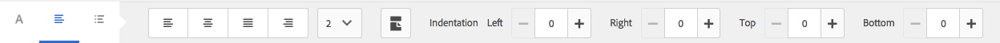
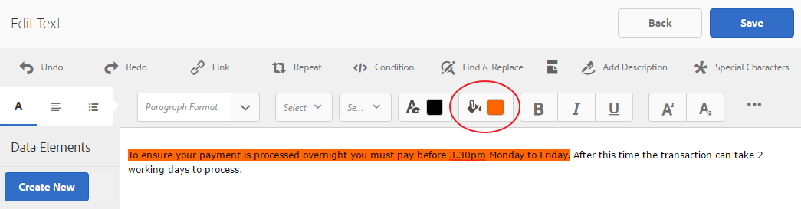
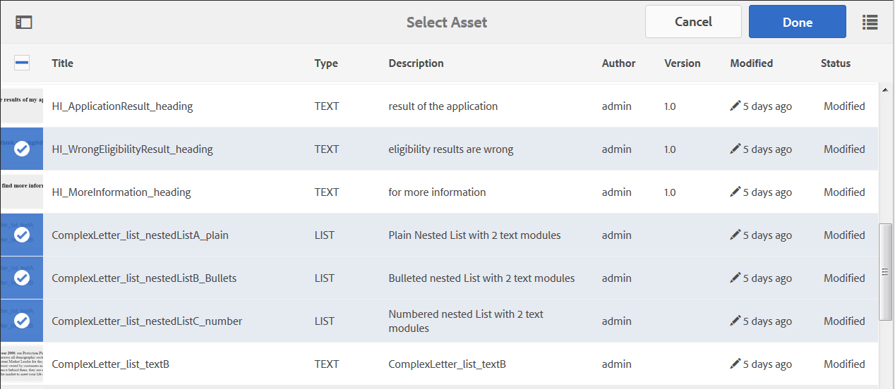

# Fragmentos do documento{#document-fragments}

## Fragmentos do documento {#document-fragments-1}

Os fragmentos de Documento são partes/componentes reutilizáveis de uma correspondência que pode ser usada para compor letras/correspondência. Os fragmentos de documento são dos seguintes tipos:

* **Texto**: Um ativo de texto é um conteúdo que consiste em um ou mais parágrafos de texto. Um parágrafo pode ser estático ou dinâmico.
* **Lista**: Lista é um grupo de fragmentos de documento, incluindo texto, listas, condições e imagens. A ordem dos elementos de lista pode ser fixa ou editável. Ao criar uma carta, você pode usar alguns ou todos os elementos da lista para replicar um padrão reutilizável de elementos.
* **Condição**: As condições permitem que você defina qual conteúdo será incluído no momento da criação da correspondência, com base nos dados fornecidos. A condição é descrita em termos de variáveis de controle. Uma variável de controle pode ser um elemento de dicionário de dados ou um espaço reservado.
* **Fragmento** de layout: Um fragmento de layout é um layout que pode ser usado dentro de uma ou mais letras. Um fragmento de layout é usado para criar padrões repetíveis, especialmente tabelas dinâmicas. O layout pode conter campos de formulário típicos, como &quot;Endereço&quot; e &quot;Número de referência&quot;. Ele também contém subformulários vazios que indicam áreas de público alvo. Os layouts (XDPs) são criados no Designer e carregados no AEM Forms.

## Texto {#text}

Um ativo de texto é um conteúdo que consiste em um ou mais parágrafos de texto. Um parágrafo pode ser estático ou dinâmico. Um parágrafo dinâmico contém referências a elementos de dados, cujos valores são fornecidos em tempo de execução. Por exemplo, o nome do cliente em uma saudação de carta pode ser um elemento de dados dinâmico, com seu valor disponibilizado em tempo de execução. Ao alterar esses valores, o mesmo modelo de carta pode ser usado para gerar letras para clientes diferentes.

A Solução de gerenciamento de correspondência oferece suporte a dois tipos para itens de dados dinâmicos (dados variáveis):

* **Elementos** do dicionário de dados: Esses elementos estão vinculados ao dicionário de dados e obtêm seus valores da fonte de dados fornecida. Uma variável de dicionário de dados pode ser protegida ou desprotegida. Durante a criação de correspondência, o usuário pode modificar o valor padrão das variáveis de dicionário de dados desprotegidas, mas não pode modificar as protegidas.
* **Marcadores de posição**: Essas são variáveis que não estão vinculadas a uma fonte de dados back-end. Eles exigem que o usuário preencha um valor durante a criação da correspondência. Os espaços reservados estão desprotegidos por padrão.

>[!NOTE]
>
>Os modelos de Gerenciamento de correspondência não o forçam a criar nomes exclusivos ao criar espaços reservados. Se você criar dois espaços reservados com o mesmo nome, como um texto e uma condição, e usá-los em um modelo de carta, os valores do espaço reservado inserido pela última vez serão usados para ambos os espaços reservados. Se dois espaços reservados tiverem o mesmo nome, seus tipos serão comparados. Se os tipos forem diferentes, seu tipo se tornará String. No entanto, em um módulo, não é possível criar vários espaços reservados com o mesmo nome.

### Create text {#create-text}

1. Selecione **Formulários** > Fragmentos **de** Documento.
1. Toque em **Criar** > **Texto** Ou selecione um ativo de texto e toque em **Editar**.
1. Especifique as seguintes informações para o texto:

   * **Título: (Opcional)** Insira o título do ativo de texto. Os títulos não precisam ser exclusivos e podem ter caracteres especiais e caracteres não ingleses. Os textos são referenciados por seus títulos (quando disponíveis), como em miniaturas e propriedades de ativos.
   * **Nome:** O nome exclusivo do ativo de texto. Não podem existir dois ativos (texto, condição ou lista) em qualquer estado com o mesmo nome. No campo Nome, é possível digitar somente caracteres, números e hífens do idioma inglês. O campo Nome é preenchido automaticamente com base no campo Título. Os caracteres especiais, os espaços, os números e os caracteres que não estão em inglês inseridos no campo Título são substituídos por hífens no campo Nome. Embora o valor no campo Título seja copiado automaticamente para o Nome, é possível editar o valor.
   * **Descrição**: Digite uma descrição do ativo.
   * **Dicionário** de dados: Como opção, selecione o dicionário de dados no qual deseja mapear. Esse atributo permite que você adicione referências aos elementos do dicionário de dados no ativo de texto.
   * **Tags**: Como opção, para criar uma tag personalizada insira um valor no campo de texto e pressione Enter. Você pode ver sua tag abaixo do campo de texto das tags. Quando você salva esse texto, as tags recém-adicionadas também são criadas.

1. Toque em **Avançar**. O Gerenciamento de correspondência exibe a página Editor, na qual você pode adicionar parágrafos de texto e elementos de dados ao texto.

   O verificador ortográfico padrão em seu navegador verifica a ortografia no Editor de texto. Para gerenciar a ortografia e a verificação gramatical, edite as configurações do verificador ortográfico do seu navegador ou instale plug-ins/suplementos do navegador para verificar a ortografia e a gramática.

   Você também pode usar os vários atalhos de teclado no editor de texto para gerenciar, editar e formatar o texto. Para obter mais informações sobre atalhos de teclado do Editor [de](/help/forms/using/keyboard-shortcuts.md#p-formatting-p) texto em Atalhos de teclado do Gerenciamento de correspondência.

1. Um editor de texto é aberto e insere o texto. Use a barra de ferramentas na parte superior da página para formatar o texto, inserir condições, links e quebras de página.

   [ 

   * **Link**: Inserir link de [hipertexto](#insert-hyperlink) no texto.
   * **Repetir**: Repetir imprime o elemento de coleta no Dicionário de dados usando um delimitador.
   * **Condição**: Toque em para inserir uma condição. Inserir texto com base na condição. Se a condição for verdadeira, o texto estará visível na letra, caso contrário não.
   * **Adicionar descrição**: Adicione uma anotação a um texto. Esses são metadados visíveis para o autor, mas não são parte da carta criada.
   * **Quebra** de página: Se você definir o atributo de quebra de página de um módulo de texto como falso, o módulo de texto não será quebrado nas páginas.
   Um editor de texto é aberto. Enter the text. A barra de ferramentas muda dependendo do tipo de edições que você escolher fazer: Parágrafo, Alinhamento ou Listagem:

   

   Selecione o tipo de barra de ferramentas: Parágrafo, Alinhamento ou Listagem

   

   Barra de ferramentas Parágrafo
   [ Barra ](assets/paragrapheditingtoolbar-1.png)AlinhamentoBarra de ferramentas Alinhamento

   

   Barra de ferramentas de listagem (clique para abrir uma imagem em tamanho real)

1. Para reutilizar um ou mais parágrafos de texto existentes em outro aplicativo, como em páginas do MS Word ou HTML, copie e cole o texto no editor de texto. A formatação do texto copiado é retida no editor de texto.

   É possível copiar e colar um ou mais parágrafos de texto em um módulo de texto editável. Por exemplo, você pode ter um documento do MS Word com uma lista com marcadores de provas de residência aceitáveis como:

   

   Você pode copiar e colar diretamente o texto do documento do MS Word em um módulo de texto editável. A formatação, como lista com marcadores, fonte e cor do texto, é retida no módulo de texto.

   

   >[!NOTE]
   >
   >Entretanto, a formatação do texto colado tem algumas [limitações](https://helpx.adobe.com/aem-forms/kb/cm-copy-paste-text-limitations.html).

1. Se necessário, insira caracteres especiais no fragmento do documento. Por exemplo, é possível usar a paleta Caracteres especiais para inserir:

   * Símbolos monetários como €, ¥ e £
   * Símbolos matemáticos como ∑, √,  e ^
   * Símbolos de pontuação como ‟ e&quot;
   

   O Gerenciamento de correspondência tem suporte integrado para 210 caracteres especiais. O administrador pode [adicionar suporte para caracteres especiais mais/personalizados por personalização](/help/forms/using/custom-special-characters.md).

1. Para realçar\enfatizar partes de texto em um módulo incorporado editável, selecione o texto e toque em Realçar cor.

   

   Você pode tocar diretamente em uma cor básica `**[A]**` presente na paleta Cores básicas ou tocar em **Selecionar** depois de usar o controle deslizante `**[B]**` para escolher o tom apropriado da cor.

   Opcionalmente, você também pode ir para a guia Avançado para selecionar a Matiz, a Luminosidade e a Saturação apropriadas `**[C]**` para criar a cor precisa e, em seguida, tocar em Selecionar `**[D]**` para aplicar a cor para realçar o texto.

   

1. No painel de dados, arraste e solte os elementos do dicionário de dados e do espaço reservado para o texto.

   Para:

   * Adicione um elemento de dicionário de dados no texto, selecione um elemento de dados da lista e toque em Inserir ( ). Se você selecionar Protegido, o elemento do dicionário de dados será somente leitura e aparecerá no editor de letras, mas não na interface de usuário Criar correspondência ou no Criador de correspondência.
   * Adicione um elemento de espaço reservado no texto, no painel Elementos de dados, toque em Criar novo, insira os detalhes do novo Elemento de dados e toque em Criar para adicionar o novo elemento à lista. O novo espaço reservado pode ser inserido no texto da mesma forma que o elemento de dicionário de dados. Para editar um espaço reservado, selecione um espaço reservado e toque em Editar.
   

   Elementos de espaço reservado conforme especificado no arquivo de dados de amostra de um Dicionário de dados

   

   Valores do elemento de espaço reservado na visualização CCR preenchidos a partir das variáveis do Dicionário de dados, conforme especificado no arquivo de dados de amostra

   Você também pode usar o símbolo @ para pesquisar e adicionar dicionário de dados e elementos de espaço reservado ao editor de texto. Posicione o cursor no local em que deseja inserir o elemento. Digite @ seguido pela string de pesquisa. O editor de texto realiza a operação de pesquisa em todos os elementos de dicionário de dados e espaço reservado disponíveis no fragmento do documento de texto. A operação de pesquisa recupera e exibe os elementos que contêm a string de pesquisa como uma lista suspensa. Navegue pelos resultados da pesquisa e clique no elemento que deseja inserir no local do cursor. Pressione Esc para ocultar os resultados da pesquisa.

1. Você pode usar condições embutidas e repetir para tornar sua carta altamente contextual e bem estruturada. Para obter mais informações sobre a condição em linha e repetir, consulte Condições em [linha e repetir em letras](/help/forms/using/cm-inline-condition.md).
1. Toque em **Salvar**.

#### Inserir hiperlink em um texto {#insert-hyperlink}

Execute as seguintes etapas para criar um hiperlink em um ativo de texto:

1. Selecione o texto ou o objeto de modelo de dados no editor de texto.

2. Toque em **[!UICONTROL Link]**. Toque no campo Texto **** alternativo para remover o texto ou o nome do objeto do modelo de dados existente.

3. Especifique o URL e toque em .

#### Como pesquisar e substituir texto {#searching-and-replacing-text}

Ao trabalhar com elementos de texto que contêm um grande corpo de texto, é necessário pesquisar por uma string de texto específica. Você também pode precisar substituir uma string específica de texto por uma string alternativa.

O recurso Localizar e substituir permite que você procure (e substitua) qualquer string de texto em um elemento de texto. O recurso também inclui uma pesquisa de expressão regular avançada.

#### Para pesquisar texto em um módulo de texto {#to-search-text-in-a-text-module}

1. Abra o módulo de texto no editor de texto.

1. Toque em Localizar e substituir.
1. Digite o texto a ser pesquisado na caixa de texto Localizar e pressione Localizar. O texto de pesquisa é realçado no módulo de texto.
1. Para procurar a próxima instância do texto, pressione Localizar novamente.

   Se você continuar pressionando o botão Localizar, a pesquisa continuará para baixo na página. Após a última instância do texto ser encontrada, a mensagem **Alcançado o fim do módulo** indica que não foram encontrados mais resultados de pesquisa.

   No entanto, se nenhuma instância do texto de pesquisa for encontrada no módulo de texto, a mensagem exibida será: **Correspondência Não Encontrada**.

1. Se você pressionar Localizar novamente, a pesquisa continuará na parte superior da página.

#### Opções de pesquisa {#search-options}

**Caso de correspondência:** A pesquisa retorna os resultados somente com a mesma letra maiúscula.

**Palavra inteira:** A pesquisa retorna somente palavras inteiras.

**Observação:** Se você inserir caracteres especiais na caixa de texto Localizar, a opção Palavra inteira será desativada.

**Reg ex:** Pesquise usando expressões regulares. Por exemplo, a expressão regular a seguir procura endereços de email em um módulo de texto:

`[a-zA-Z0-9._%+-]+@[a-zA-Z0-9.-]+\.[a-zA-Z]{2,4}`

#### Para pesquisar e substituir texto em um módulo de texto {#to-search-and-replace-text-in-a-text-module}

1. Abra o módulo de texto no editor de texto.
1. Toque em Localizar e substituir.
1. Digite o texto a ser pesquisado na caixa de texto Localizar e o texto a ser substituído pelo texto localizado e pressione Substituir.
1. Se o texto de pesquisa for encontrado, ele será substituído pelo texto Substituir.

   * Se outra instância do texto de pesquisa for encontrada, essa instância será realçada no módulo de texto. Se você pressionar Substituir novamente, a instância realçada será substituída e o cursor avançará, se uma terceira instância for encontrada.
   * Se outra instância não for encontrada, o cursor será interrompido na última instância substituída.

1. Se você pressionar Localizar novamente, a pesquisa continuará na parte superior da página.

   Use a opção Substituir tudo para substituir todas as instâncias de um texto no módulo de texto. Quando você usa &quot;, o número de substituições é exibido como uma mensagem na caixa de diálogo Localizar e substituir.

#### Práticas recomendadas/dicas e truques para módulos de texto {#best-practices-tips-and-tricks-for-text-modules}

* Use uma convenção de nomenclatura consistente para evitar a duplicação.
* Use o vínculo de dicionário de dados apropriado em módulos de texto.
* As seguintes regras se aplicam ao usar o Editor de texto ao alterar um ativo de texto:

   * **Adição da variável:** Permitido
   * **Remoção da variável:** Permitido
   * **Atualização das propriedades:** Permitido
   * **Alteração do dicionário de dados:** Permitido até que o elemento do dicionário de dados não seja usado. Não é possível alterar o dicionário de dados ao atualizar.

## Lista {#list}

Uma lista é um grupo de fragmentos de documento, incluindo texto, (outras) listas, condições e imagens. A ordem dos elementos de lista pode ser fixa ou editável. Ao criar uma carta, você pode usar alguns ou todos os elementos da lista para replicar um padrão reutilizável de elementos. As Listas se comportam basicamente como públicos alvos que podem ser aninhados dentro de outros públicos alvos.

### Implementando listas {#implementing-lists}

A implementação de listas consiste em duas etapas:

1. Definição de propriedades principais, como nome, descrição e dicionário de dados.
1. Seção do conteúdo que faz parte da lista e, em seguida, definição de propriedades como ordem de bloqueio e acesso à biblioteca para a lista.

### Criar uma lista {#create-a-list}

Uma lista é um grupo de conteúdo relacionado que pode ser usado em um modelo de carta como uma única unidade. Qualquer tipo de conteúdo pode ser adicionado a uma lista. Listas também podem ser aninhadas. Os módulos de Lista podem ser especificados como:

* **PEDIDO**: A ordem não pode ser alterada no tempo de execução Criar correspondência.
* **Acesso**&#x200B;à biblioteca: Os usuários podem adicionar módulos à lista. Esse sinalizador especifica se o acesso à biblioteca está ativado. Se ativado (aberto), o usuário pode adicionar módulos à lista ao visualizar a carta.
* Ao criar uma lista, você pode especificar um tipo, como:
* **Simples**: Nenhuma formatação de estilo adicional é aplicada à lista.
* **Com marcadores**: Uma lista formatada com um marcador simples.
* **Numerado**: Uma lista numérica com a opção Padrão (1,2,...), Superior romano (I, II, ...) e Inferior romano (i, ii,...).
* **Carta**: Uma lista alfabética com a escolha de letras minúsculas (a,b,...) e maiúsculas (A,B,...).
* **Personalizado**: Você pode criar qualquer tipo numerado/alfabetizado e valores de prefixo e sufixo de sua escolha.

1. Selecione **Formulários** > Fragmentos **de** Documento.

1. Selecione **Criar** > **Lista**.

1. Especifique as seguintes informações para a lista:

   * **Título (opcional): Insira** o título da lista. O título não precisa ser exclusivo e pode ter caracteres especiais e caracteres diferentes do inglês. As Listas são referenciadas por seus títulos (quando disponíveis), como em miniaturas e propriedades de ativos.
   * **Nome:** O nome exclusivo da lista. Não podem existir dois ativos (texto, condição ou lista) em qualquer estado com o mesmo nome. No campo Nome, é possível digitar somente caracteres, números e hífens do idioma inglês. O campo Nome é automaticamente preenchido com o valor no campo Título. Os caracteres especiais, os espaços, os números e os caracteres que não estão em inglês inseridos no campo Título são substituídos por hífens no campo Nome. Embora o valor no campo Título seja copiado automaticamente para o Nome, é possível editar o valor.
   * **Descrição (Opcional)**: Digite uma descrição do ativo.
   * **Dicionário de dados (opcional)**: Como opção, selecione o dicionário de dados ao qual deseja se conectar. Somente ativos que usam o mesmo dicionário de dados que a lista, ou ativos sem dicionário de dados atribuído, podem ser adicionados à lista. Atribuir um dicionário de dados a uma lista facilita que a pessoa que cria um modelo de carta localize a lista apropriada.
   * **Tags (opcional)**: Selecione as tags a serem aplicadas. Você também pode digitar o nome de uma nova tag e criá-la. (A nova tag é criada quando você toca em **Salvar**.)

1. Toque em **Avançar**.
1. Toque em **Adicionar ativo**.
1. Para adicionar ativos à lista, selecione-os na página Selecionar ativos e toque em **Concluído**.

   

1. Os ativos são adicionados à página Itens de Lista.
Para alterar a ordem dos ativos na lista, toque e segure o ícone de setas (  ) e arraste e solte. Quando o usuário abre um modelo de carta na interface do usuário Criar correspondência, o conteúdo é montado na ordem definida aqui.

   

1. Você pode selecionar as seguintes opções para especificar como a lista se comporta na interface do usuário do CCR:

   * **Acesso**&#x200B;à biblioteca: Para habilitar o acesso à biblioteca para adicionar ativos, toque em Acesso à biblioteca. Quando o Acesso à biblioteca está ativado, o ajustador de solicitações pode adicionar mais conteúdo à lista. Caso contrário, o Ajustador de solicitações estará limitado ao conteúdo definido para a lista.
   * **Bloquear pedido**: Para bloquear a ordem dos ativos na lista de modo que o Ajustador de solicitações não possa alterar a ordem, toque em Bloquear pedido. Se você não selecionar essa opção, o Ajustador de solicitações poderá alterar a ordem dos itens de lista.

   * **Adicionar marcadores**: Use essa opção para aplicar um estilo de marcador ou numeração ao módulo. Você pode usar um estilo de lista pré-projetado ou personalizado. Você também pode especificar o texto a ser exibido antes e depois de cada um dos itens de lista.
   * **Quebra** de página: Selecione essa opção ( ) para adicionar uma quebra de página entre o conteúdo da lista. Quando essa opção não está selecionada ( ), se o conteúdo da lista estiver sendo expandido para a próxima página, a lista inteira será deslocada para a próxima página em vez de ser quebrada na página entre a lista.

   * **Configuração** da atribuição: Use essa opção para especificar o número mínimo e máximo de ativos que podem ser adicionados à lista.

1. Você pode selecionar as seguintes opções para especificar como cada ativo na lista se comporta em tempo de execução:

   * **Editável:** Quando essa opção é selecionada, o conteúdo pode ser editado na interface do usuário Criar correspondência. (Essa opção não está disponível para módulos de Lista e imagem.)
   * **Obrigatória:** Quando essa opção é selecionada, o conteúdo é necessário na interface do usuário Criar correspondência.
   * **Selecionado:** Quando essa opção é selecionada, o conteúdo é pré-selecionado na interface do usuário Criar correspondência.
   * **Ignorar estilo:** Quando essa opção é selecionada, o conteúdo ignora marcadores e numeração na interface do usuário Criar correspondência. (Essa opção não está disponível para módulos de imagem. Além disso, entre Ignorar estilo, Composto e Ignorar estilo de Lista, somente uma das opções pode ser aplicada a um módulo. Uma dessas opções pode ser usada para um módulo quando você seleciona Adicionar marcadores para um módulo.)
   * **Recuo:** Você pode alterar o nível de recuo de cada módulo/conteúdo selecionado como parte da Lista. O recuo é especificado em termos de Níveis (começando com zero), de forma que cada nível de recuo corresponda a um preenchimento de 36 pontos.
   * **Composto:** Quando selecionada, a numeração composta é aplicada como uma combinação do estilo de Lista externo (pai) e seu próprio estilo. A numeração composta nessa Lista aninhada é baseada na ordem em que essa Lista aninhada aparece na Lista externa.
   * **Ignorar estilo de lista:** Se a opção Numeração composta estiver desmarcada, a opção Ignorar estilo de Lista estará ativada. Essa seleção ignora o estilo próprio da Lista aninhada e a numeração continua a partir da Lista externa. Portanto, os módulos da lista aninhada são tratados como parte da própria lista externa, ignorando quaisquer estilos especificados na Lista aninhada. Se a opção Ignorar estilo de Lista estiver desmarcada para uma Lista aninhada, os módulos que fazem parte dessa Lista aninhada terão seu próprio estilo de numeração.
   * **Manter com o próximo:** Define a quebra de página para os ativos contidos em uma lista. Se você definir a propriedade Manter com o próximo de um ativo de uma lista como **Ligado**, esse ativo e o próximo ativo permanecerão na mesma página. Isso implica que o conteúdo do ativo selecionado e do ativo seguinte não se dividirão nas páginas.

1. Toque em **Salvar**.

### Práticas recomendadas/dicas e truques {#best-practices-tips-and-tricks}

* Use uma convenção de nomenclatura consistente para evitar a duplicação.
* Usar vínculo de dicionário de dados apropriado
* As seguintes regras se aplicam ao usar o Editor de Listas para alterar uma lista:

   * Atualização das propriedades: Permitido
   * **Alteração do dicionário de dados:** Permitido até que nenhum item que usa o dicionário de dados esteja associado a ele. Não é possível alterar o dicionário de dados ao atualizar.

## Condições {#conditions}

As condições permitem que você defina qual conteúdo será incluído na hora de criação da correspondência/carta, com base nos dados fornecidos. A condição é descrita em termos de variáveis de controle. Ao adicionar uma condição, você pode optar por incluir um ativo com base no valor que a variável de controle tem.

Com base nas opções escolhidas, somente a primeira expressão que for encontrada como verdadeira, com base na variável de condição atual, será avaliada ou todas as condições. Ao preencher a letra em Criar correspondência (CCR), as condições se comportam como &quot;caixas brancas&quot;. Se uma condição resultar em uma lista, todos os itens obrigatórios e pré-selecionados da lista serão gerados. Se qualquer um desses itens for condições ou listas, seu conteúdo resultante também será exibido, em ordem de cima para baixo e de profundidade como uma lista simples de texto e conteúdo de imagem. Os resultados da condição podem ser de qualquer tipo (texto, lista, condição ou imagem).

### Condições de execução {#implementing-conditions}

O Editor de condições vem com uma interface de usuário do Construtor de [Expressões](/help/forms/using/expression-builder.md) que suporta a criação de expressões usando vários espaços reservados e elementos do Dicionário de dados. Você pode usar operandos comuns e funções locais/globais nessas expressões. Cada expressão pode ser associada a algum conteúdo e, opcionalmente, pode haver uma seção padrão se nenhuma das expressões for avaliada como true. Todas as expressões são avaliadas na sequência em que são definidas e as primeiras expressões que retornam true são selecionadas e seu conteúdo associado é retornado por esse módulo condicional.

Por exemplo, se os termos e condições de uma letra forem diferentes, dependendo do estado em que o cliente está, e o dicionário de dados contiver um elemento chamado &quot;estado&quot;, você poderá adicionar a condição da seguinte maneira:
・ state = NY, selecione T&amp;C_NY parágrafo de texto ・ estado = NC, selecione T&amp;C_NC parágrafo de texto

O Editor de condições permite que você especifique uma condição padrão. Se o valor das variáveis de controle não corresponder a nenhuma das condições, o conteúdo associado à condição padrão será usado. A seguir ao exemplo anterior, é possível adicionar esta linha de condição:
・ Padrão, selecione T&amp;C_Rest

### Criar uma condição {#create-a-condition}

1. Selecione **Formulários** > Fragmentos **de** Documento.
1. Selecione **Criar > Condição**.
1. Especifique as seguintes informações para a lista:

   * **Título (opcional):** Insira o título da condição. O título não precisa ser exclusivo e pode ter caracteres especiais e caracteres diferentes do inglês. As condições são referenciadas por seus títulos (quando disponíveis), como em miniaturas e propriedades de ativos.
   * **Nome:** O nome exclusivo da condição. Não podem existir dois ativos (texto, condição ou lista) em qualquer estado com o mesmo nome. No campo Nome, é possível digitar somente caracteres, números e hífens do idioma inglês. O campo Nome é preenchido automaticamente com base no campo Título. Os caracteres especiais, os espaços, os números e os caracteres que não estão em inglês inseridos no campo Título são substituídos por hífens no campo Nome. Embora o valor no campo Título seja copiado automaticamente para o Nome, é possível editar o valor.
   * **Descrição (Opcional)** Digite uma descrição da condição.
   * **Dicionário de dados (opcional)**: Como opção, selecione o dicionário de dados ao qual deseja se conectar. Somente ativos que usam o mesmo dicionário de dados da condição, ou ativos sem dicionário de dados atribuído, podem ser adicionados à lista. Atribuir um dicionário de dados a uma lista facilita que a pessoa que cria um modelo de carta localize a condição apropriada.
   * **Tags (opcional)**: Como opção, selecione as tags a serem aplicadas. Você também pode digitar o nome de uma nova tag e criá-la. (A nova tag é criada quando você toca em **Salvar**.)

1. Toque em **Avançar**.
1. Toque em **Adicionar ativo**.
1. Para adicionar um ativo à Condição, selecione-o na página Selecionar ativos e toque em **Concluído**. Os ativos são adicionados ao painel de Expressão.
1. Você pode selecionar as seguintes opções para especificar como a condição se comporta no tempo de execução:

   * **Desabilitar Avaliação de Vários Resultados\Habilitar Avaliação** de Vários Resultados: Quando essa opção está ativada (aparece como &quot;Ativar várias...&quot;), todas as condições são avaliadas e o resultado é a soma de todas as condições verdadeiras. Se essa opção estiver desabilitada (aparece como &quot;Desabilitar vários...&quot;), somente a primeira condição que for encontrada como verdadeira será avaliada e se tornará a saída da condição.
   * **Quebra** de página: Selecione essa opção ( ) para adicionar uma quebra de página entre os módulos das condições. Quando essa opção não está selecionada ( ), se uma condição estiver sobrecarregando para a próxima página, toda a condição será deslocada para a próxima página em vez de quebrar a página entre a condição.

1. Para alterar a ordem dos ativos dentro da condição, toque e mantenha pressionado o ícone de setas (  ) e arraste e solte. Quando o usuário abre um modelo de carta na interface do usuário Criar correspondência, o conteúdo é montado na ordem definida aqui.
1. Toque em **Excluir** para excluir a linha. Se você tocar em Excluir para a linha padrão, apaga apenas as informações do ativo.
1. Toque em **Copiar** para duplicado de uma linha.
1. Toque em **Editar** para alterar o ativo ou editar a expressão.

   Mais:

   * Para atualizar o ativo, toque no ícone de pasta na coluna Ativo.
   * Para abrir o Construtor de Expressões para inserir uma expressão, toque no ícone de pasta na coluna Expressão. Para obter mais informações sobre o Construtor de Expressões, consulte Construtor [de](/help/forms/using/expression-builder.md)Expressões.

### Práticas recomendadas/dicas e truques {#best-practices-tips-and-tricks-1}

* Use uma convenção de nomenclatura consistente para facilitar a pesquisa e evitar a duplicação.
* As condições se comportam como declarações de caso, então a ordem das condições é importante. A primeira correspondência é retornada.
* Usar vínculo de dicionário de dados apropriado
* As seguintes regras se aplicam ao usar o Editor de condições para editar uma condição:

   * **Adição da variável:** Permitido
   * **Remoção da variável:** Permitido
   * **Atualização das propriedades:** Permitido
   * **Alteração do dicionário de dados:** Permitido até que o elemento do dicionário de dados não seja usado.

## Fragmentos de layout {#layoutfragments}

Um fragmento de layout é baseado em XDPs criados no Designer. Para criar fragmentos de layout, é necessário criar os XDPs e [carregá-los no AEM Forms](/help/forms/using/import-export-forms-templates.md).

Um ou mais fragmentos de layout podem formar partes de uma letra e definir o layout gráfico dessas partes. Um fragmento de layout pode conter campos de formulário típicos, como Endereço e Número de referência, e subformulários vazios que indicam áreas de público alvo. Além disso, os fragmentos de layout permitem criar tabelas e inseri-las em letras.

Um caso de uso comum é localizar padrões de layout reutilizáveis em Cartas e criar fragmentos de layout para eles. Por exemplo, a saudação, o endereço e a parte do assunto da letra, que aparece na mesma ordem com várias letras. Outro exemplo pode ser um número de linhas e colunas semelhante a uma tabela usado em várias letras.

Você pode criar um fragmento de layout com base em um XDP existente. Um fragmento de layout pode ser composto de campos e áreas de público alvo ou uma ou mais tabelas. As tabelas em um layout podem ser estáticas ou dinâmicas. Um XDP é criado no Designer e [carregado no AEM Forms](/help/forms/using/import-export-forms-templates.md). Um XDP pode formar a estrutura de um fragmento de layout ou de uma letra. Mais informações sobre o design [de layout](/help/forms/using/layout-design-details.md).

O uso de fragmentos vinculados a áreas de público alvo permite que a letra seja alterada no momento da criação. O fragmento de layout com diferentes dimensões pode ser criado e o fragmento apropriado pode ser vinculado à área do público alvo. Os fragmentos de layout também permitem personalizar algumas propriedades da tabela:

1. É possível aumentar a contagem de linhas e colunas.
1. É possível especificar o texto do cabeçalho e do rodapé para mais linhas e colunas.
1. É possível definir a proporção da largura da coluna da tabela. Em tempo de execução, as colunas da tabela são redimensionadas de acordo com a proporção definida e o espaço disponível. A soma da relação de largura deve ser 100. Caso contrário, não será aplicável.
1. Se uma tabela for um espaço reservado (contiver apenas uma única célula em branco), você poderá definir o tipo (área/campo do público alvo) de novas colunas.
1. É possível ocultar linhas de cabeçalho e rodapé.

Antes de executar esse procedimento, crie um fragmento XFA usando o Designer. O fragmento pode conter tabelas para organizar campos e áreas de público alvo. O Designer permite a criação de dois tipos de tabelas: estático e dinâmico. As tabelas estáticas contêm um número fixo de linhas. Tabelas estáticas podem conter áreas e campos de público alvo. A área e os campos do público alvo não podem ser vinculados a DDEs repetitivos. Uma tabela dinâmica também pode ter uma única linha. Os dados vinculados às células da tabela determinam o número de linhas para tabelas dinâmicas. Uma tabela dinâmica pode conter apenas campos. Os DDEs podem ser repetidos ou não repetitivos.

Considere os seguintes pontos ao projetar tabelas:

1. Tabelas podem ser personalizadas no momento da criação do fragmento de layout. No entanto, a opção personalizar só é ativada quando o subformulário pai da tabela é continuado.
1. Para tabelas dinâmicas, todos os campos, linhas e tabelas repetíveis usam o vínculo &quot;use name&quot; para que os dados sejam unidos corretamente.
1. Para tabelas dinâmicas, todos os DDEs repetitivos vinculados aos campos da tabela fazem parte da mesma hierarquia. Para os DDEs não repetitivos, não existe tal restrição.
1. No momento em que o fragmento do layout é unido às tabelas da área do público alvo pai é redimensionado de acordo com o espaço disponível, no entanto, o redimensionamento ocorre somente quando o fragmento do layout não contém nenhuma área do público alvo ou campo diretamente no subformulário de nível superior. A área do Público alvo e os campos dentro da tabela são permitidos.
1. É possível criar tabelas de espaço reservado. As tabelas de espaço reservado têm apenas uma única célula em branco.

* Para tabelas de espaço reservado, você pode personalizar as seguintes propriedades no momento da criação do fragmento.

   * contagem de linhas
   * contagem de colunas
   * cabeçalho e rodapé para cada coluna
   * tipo (área/campo do público alvo) de cada coluna
   * relação largura para cada coluna

* Para uma tabela sem espaço reservado, você pode personalizar as seguintes propriedades:

   * contagem de linhas
   * contagem de colunas
   * cabeçalho e rodapé para coluna adicional
   * relação largura para cada coluna

É possível aninhar fragmentos em uma carta. Isso significa que é possível adicionar um fragmento em um fragmento. A solução Gerenciamento de correspondência suporta até quatro níveis de aninhamento em uma carta: **Carta**->**Fragmento**->**Fragmento**->**Fragmento**->**Fragmento.**

Para obter um exemplo detalhado de como usar tabelas estáticas e dinâmicas em fragmentos de layout, consulte [Exemplo com arquivos de amostra: usando tabelas estáticas e dinâmicas em uma letra](#examplewithsamplefiles).

### Criação de um fragmento de layout {#creating-a-layout-fragment}

1. Selecione **Criar** > Fragmento **de layout**.
1. O Gerenciamento de correspondência exibe os XDPs disponíveis. Selecione o XDP no qual deseja basear o fragmento do layout e toque em **Próximo**.
1. Especifique as seguintes informações para o layout:

   * **Título (opcional):** Insira o título do fragmento do layout. O título não precisa ser exclusivo e pode ter caracteres especiais e caracteres diferentes do inglês. Os fragmentos de layout são referenciados por seus títulos (quando disponíveis), como em miniaturas e propriedades de ativos.
   * **Nome:** O nome exclusivo do fragmento de layout. Não podem existir dois ativos (texto, condição ou lista) em qualquer estado com o mesmo nome. No campo Nome, é possível digitar somente caracteres, números e hífens do idioma inglês. O campo Nome é preenchido automaticamente com base no campo Título. Os caracteres especiais, os espaços, os números e os caracteres que não estão em inglês inseridos no campo Título são substituídos por hífens no campo Nome. Embora o valor no campo Título seja copiado automaticamente para o Nome, é possível editar o valor. Esse nome aparece na lista na interface do usuário Gerenciar ativos.
   * **Descrição (Opcional)**: Descrição que aparece na lista na interface do usuário Gerenciar ativos.
   * **Tags (opcional)**: Como opção, selecione as tags a serem aplicadas à condição. Você também pode digitar o nome de uma nova tag e criá-la.

1. Toque na guia **Tabela** e especifique as seguintes informações para o layout:

   * **Configuração para**: Selecione a tabela que está sendo configurada.Como um sufixo para o nome da tabela na lista suspensa é (Estático) se a tabela for estática ou (Dinâmica) se a tabela for dinâmica. As tabelas estáticas contêm um número fixo de linhas. Tabelas estáticas podem conter áreas e campos de público alvo. A área e os campos do público alvo não podem ser vinculados a DDEs repetitivos. Os dados vinculados às células da tabela determinam o número de linhas para tabelas dinâmicas.

   * **Linhas**: Selecione o número de linhas para o layout. A contagem de linhas configuradas deve ser maior ou igual à contagem de linhas original.
   * **Colunas**: selecione o número de colunas para o layout. A contagem de colunas configurada deve ser maior ou igual à contagem de colunas original.
   Para cada coluna são necessários os seguintes detalhes:

   * **Cabeçalho**: texto a ser exibido para o cabeçalho
   * **Rodapé**: texto a ser exibido para o rodapé
   * **Tipo**: tipo de coluna adicional. Área do campo ou do Público alvo. O tipo é ativado para tabelas de espaço reservado estáticas. O tipo pode ser definido no nível da coluna e não no nível da célula. Todas as células em uma coluna estendida seriam do mesmo tipo. Para uma tabela dinâmica, todas as colunas são do tipo Campo. Para tabelas sem espaço reservado, não é possível definir o tipo de colunas adicionais. Neste caso, o tipo de células adicionais na coluna alargada é igual ao tipo da última coluna dessa linha; e o tipo de célula em linha adicional é o mesmo que o tipo da última célula nessa coluna.
   * **Taxa de largura:** proporção das larguras de coluna da tabela.
   Para obter um exemplo detalhado de como usar tabelas estáticas e dinâmicas em fragmentos de layout, consulte [Exemplo com arquivos de amostra: usando tabelas estáticas e dinâmicas em uma letra](#examplewithsamplefiles).

1. Toque em **Salvar**.

### Fazer upload de um XDP para o Gerenciamento de correspondência {#upload-an-xdp-to-correspondence-management}

Para obter instruções sobre como carregar/importar um XDP para o Gerenciamento de correspondência, consulte [Importar e exportar ativos para o AEM Forms](/help/forms/using/import-export-forms-templates.md).

### Práticas recomendadas/dicas e truques {#best-practices-tips-and-tricks-2}

#### Definir o vínculo de subformulário padrão {#set-the-default-subform-binding}

Ao criar áreas de público alvo no Designer, ajuda a definir o vínculo padrão para todos os novos subformulários como &quot;nenhum&quot;.

Para definir o vínculo padrão:

1. No Designer, toque em **Ferramentas** > **Opções** > Vínculos **** de dados > Vínculo **de subformulário**.

1. Na lista Vínculo padrão para novos subformulários, selecione **Sem vínculo** de dados.

Isso garante que os subformulários inseridos usando o comando Inserir > Subformulário ou arrastando e soltando da paleta Objeto tenham um vínculo de &quot;nenhum&quot; por padrão. Isso significa que, por padrão, qualquer novo subformulário é uma área de público alvo, a menos que você adicione conteúdo a ele, altere sua configuração de vínculo ou nomeie o subformulário com um sufixo &quot;_int&quot;.

#### Conformidade com a seção 508 {#section-compliance}

Se a carta finalizada criada na interface do usuário Criar correspondência for usada para preencher um fluxo de trabalho posterior. Siga estas recomendações relacionadas à Seção 508 ao criar o layout. Caso contrário, a letra PDF será exibida e você poderá ignorar essas recomendações:

* Todos os subformulários de área de público alvo e todos os campos em um layout têm uma ordem de tabulação.
* Por padrão, os campos com legendas são compatíveis com 508. O atributo /field/assist/speak@priority do campo é definido como &quot;custom&quot; por padrão, o que significa que, a menos que o texto personalizado do leitor de tela seja fornecido, o leitor de tela lê a legenda do campo.
* Campos sem legendas especificam uma dica de ferramenta e indicam que os leitores de tela leem a dica de ferramenta ao configurar

`/field/assist/speak@priority="toolTip"` e especificar o texto da dica de ferramenta em `/field/assist/toolTip`.

#### Formatos de data no Designer e no Asset Configuration Manager {#date-formats-in-designer-and-asset-configuration-manager}

Ao projetar um layout no Designer, verifique se os formatos para campos de data correspondem aos formatos de data especificados em Formatos de exibição de dados nas Propriedades [de configuração do Gerenciamento de](/help/forms/using/cm-configuration-properties.md)correspondência. Para obter mais informações, consulte &quot;Formatação de valores de campo e uso de padrões&quot; na Ajuda do Designer.

#### Captura de intervalos de datas {#capturing-date-ranges}

Ao lidar com uma combinação de datas, como startDate - endDate, use um único subformulário para garantir o alinhamento correto na letra finalizada e para minimizar o número de campos.

#### Definição de vínculo no nível do formulário {#setting-form-level-binding}

Quando um layout contém vários campos e áreas de público alvo que estão mapeados para elementos XML únicos, use o vínculo no nível do formulário e crie um nó separado para cada elemento. Os campos vinculados no nível do formulário são ignorados ao mapear dados no Gerenciamento de correspondência.

#### Não usar áreas de público alvo de subformulários em uma página mestre {#do-not-use-subform-target-areas-in-a-master-page}

As áreas de públicos alvos de subformulários em uma página mestre não estão visíveis na interface do usuário Gerenciar ativos e os dados não podem ser mapeados para elas.

#### Escolhendo posições e tipos apropriados para áreas de público alvo {#choosing-appropriate-positions-and-types-for-target-areas}

Ao projetar o layout, tenha cuidado ao escolher subformulários. Se o layout contiver um único subformulário, poderá ser um tipo continuado. Depois de posicionar os campos no subformulário, é possível vinculá-lo em outro subformulário para que o subformulário vinculado também seja continuado e o layout não seja perturbado.

#### Colocação de campos em páginas mestre {#placing-fields-on-master-pages}

Observe o seguinte ao colocar um campo em uma página mestre:

* Definir o vínculo dos campos da página mestre para Usar dados globais
* Não coloque o campo diretamente sob a Área de página raiz da página mestre.
* Vincule o campo em um subformulário nomeado e verifique se o vínculo do subformulário nomeado está definido como Usar nome.

## Criação de tabelas usando fragmentos de layout {#creating-tables-using-layout-fragments}

Muitos modelos de carta contêm tabelas. Tabelas podem ser estáticas, como uma tabela de termos e condições, em que cada linha representa uma condição e cada parte é mostrada em uma coluna separada. As tabelas também podem ser dinâmicas, como informações da conta, que contêm informações como nome do cliente, ID da conta, número da transação e quantia da transação.

* **Tabelas** estáticas: Às vezes, tabelas são criadas com linhas que têm um número diferente de colunas, como para uma tabela de termos e condições. Onde cada linha representa uma condição e cada condição pode ter subpartes diferentes. Cada parte é mostrada em uma coluna separada.
* **Tabelas** dinâmicas: Os fragmentos de layout fornecem a capacidade de vincular os campos de uma tabela dinâmica aos DDEs da coleção. No momento da geração de letras, as linhas da tabela são geradas de acordo com o tamanho dos DDEs da coleção.

O DD tem um elemento de coleção Nominee_details que tem um elemento composto com três elementos primitivos: Nominee_name, Nominee_address e Nominee_gender.
O XDP dinâmico também tem os mesmos cabeçalhos. Assim, você pode mapear os campos XDP dinâmicos com os campos de DD mencionados acima.

### Exemplo com arquivos de amostra: Uso de tabelas estáticas e dinâmicas em uma letra {#examplewithsamplefiles}

Este exemplo mostra como você pode criar uma tabela dinâmica e estática, vincular a tabela dinâmica a DDEs e, em seguida, criar uma letra que inclui essas duas tabelas. Ao trabalhar com este exemplo, você pode criar arquivos do zero ou usar os arquivos de entrada fornecidos nas etapas.

1. Crie um dicionário de dados (DDD) que você deseja usar no exemplo, como representado no gráfico.

   Em seguida, selecione DD e exporte dados de amostra. O arquivo XML obtido contém dados de Funcionário e três instâncias para Nominee_details (por padrão, 3 instâncias são baixadas). Você pode adicionar ou excluir de acordo com seu requisito). Atualize os valores e importe os dados de teste em DD. O arquivo CMP é o pacote e tem o DD nele. Portanto, importe a DDD para o Gerenciamento de correspondência.

   Para obter mais informações sobre como trabalhar com o Dicionário de dados e os dados de teste, consulte Dicionário [de](/help/forms/using/data-dictionary.md#p-working-with-test-data-p)dados.

   

   [Obter arquivo](assets/exportpackage_1431709897770.cmp.zip)

1. No Designer, crie dois XDPs (fragmentos de layout): uma tabela dinâmica e uma tabela estática. Para ambos os layouts:

   * Adicione subformulário à coluna da tabela. Certifique-se de alterar o layout do subformulário pai da tabela para continuado e remover os vínculos do subformulário na tabela.
   * Adicione um subformulário à célula da tabela. Certifique-se de alterar o layout do subformulário pai da tabela para continuado e remover os vínculos do subformulário na tabela.
   Ou use os XDPs estáticos e dinâmicos conectados a essa etapa.

   Para obter mais informações sobre como trabalhar com Fragmentos de layout, consulte Fragmentos [de](#layoutfragments)layout.
Para obter mais informações sobre como criar layouts, consulte a Ajuda [do](https://help.adobe.com/en_US/AEMForms/6.1/DesignerHelp/)Designer.

   [Obter arquivo](assets/static.xdp.zip)

   [Obter arquivo](assets/dynamic.xdp.zip)

1. Faça upload dos XDPs para o AEM Forms.
1. Crie um fragmento de layout com base no XDP dinâmico. A guia Tabela das propriedades exibe que a tabela é dinâmica (campo Configuração para). O número de linhas (1) e colunas (3) são derivados do Fragmento XDP/Layout.

   Os campos desse layout são vinculados posteriormente à DDD importada e, na letra, o número de linhas é criado dinamicamente com base no número de registros no arquivo de dados de teste (o arquivo de dados XML anexado à DDD).

   

   Clique para abrir a imagem em tamanho real

1. Crie um fragmento de layout com base no XDP estático. A guia Tabela das propriedades exibe que a tabela é estática (campo Configuração para). O número de linhas (1) e colunas (3) são derivados do Fragmento XDP/Layout.

   É possível alterar o número de colunas e linhas aqui. De acordo com o que você escolher nessa tela, o número de linhas e colunas de uma tabela estática permanecerá fixo na letra criada com esse layout.
   

1. Crie uma carta usando os dois fragmentos de layout nela. Ao inserir o XDP dinâmico na letra, defina o vínculo de seus campos aos elementos de coleta do Dicionário de dados.

   Para obter mais informações sobre como criar modelos de Letras e Carta, consulte [Criar Carta](/help/forms/using/create-letter.md).

1. Salve a carta e a pré-visualização. Quando você pré-visualização a letra, os valores do Dicionário de dados são exibidos na letra. Para a tabela dinâmica, há três linhas. Isso ocorre porque os dados de teste têm três registros para essas linhas.

   Para a tabela estática, há tantas linhas e colunas quanto você especificou ao criar o fragmento do layout.

   

   Para a tabela dinâmica, as três linhas são exibidas de acordo com o número de registros no arquivo de dados de teste. Isso aconteceu porque ao adicionar o layout à letra, você criou um vínculo entre os campos da tabela dinâmica e os elementos de coleta do dicionário de dados. Os valores de Nome, Endereço e Gênero são preenchidos a partir do arquivo de dados de teste que você usou.

   

## Criar uma cópia de um fragmento de documento {#create-a-copy-of-a-document-fragment}

Para criar rapidamente um fragmento de documento com propriedades e conteúdo semelhantes a um fragmento de documento existente, é possível copiá-lo e colá-lo.

1. Na lista de fragmentos de documento, selecione um ou mais fragmentos de documento. A interface do usuário exibe o ícone Copiar.
1. Toque em Copiar. A interface do usuário exibe o ícone Colar. Você também pode escolher entrar em uma pasta antes de colar. Pastas diferentes podem conter ativos com os mesmos nomes. Para obter mais informações sobre pastas, consulte [Pastas e organizar ativos](/help/forms/using/import-export-forms-templates.md#folders-and-organizing-assets).
1. Toque em Colar. A caixa de diálogo Colar é exibida. Se você estiver copiando e colando os fragmentos do documento no mesmo local, o sistema atribuirá automaticamente nomes e títulos às novas cópias de letras, mas você poderá editar os títulos e os nomes das letras.
1. Se necessário, edite o Título e o Nome com os quais deseja salvar a cópia do fragmento do documento.
1. Toque em Colar. A cópia do fragmento do documento é criada.

