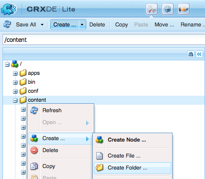

# Gerenciar imagens de assinatura do agente{#manage-agent-signature-images}

## Visão geral {#overview}

No Gerenciamento de correspondência, você pode usar uma imagem para renderizar a assinatura do agente em cartas. Depois de configurar a imagem de assinatura do agente, ao criar uma carta, você pode renderizar a imagem de assinatura do agente na carta como a assinatura do agente do remetente.

O AgentSignatureImage DDE é um DDE computado que representa a imagem de assinatura do agente. A expressão para esse DDE calculado usa uma nova função personalizada exposta pelo bloco de construção do Gerenciador de expressão. Essa função personalizada utiliza agentID e agentFolder como parâmetros de entrada e busca o conteúdo da imagem com base nesses parâmetros. O dicionário de dados do sistema SystemContext fornece letras no Gerenciamento de correspondência acesso às informações no contexto atual do sistema. O contexto do sistema inclui informações sobre os parâmetros de configuração do usuário e ativos atualmente conectados.

Você pode adicionar imagens sob a pasta cmuserroot. Em [Propriedades de Configuração do Correspondence Management](/help/forms/using/cm-configuration-properties.md), usando a propriedade Raiz do Usuário do CM, você pode alterar a pasta de onde a imagem da assinatura do agente é selecionada.

O valor do DDE agentFolder é obtido do parâmetro de configuração CMUserRoot para as propriedades de configuração do Gerenciamento de correspondência. Por padrão, esse parâmetro de configuração aponta para/content/cmUserRoot no repositório CRX. Você pode alterar o valor da configuração CMUserRoot nas Propriedades de configuração.
Você também pode substituir a função personalizada padrão para definir sua própria lógica para buscar a imagem da assinatura do usuário.

## Adicionar imagem de assinatura do agente {#adding-agent-signature-image}

1. Certifique-se de que a imagem de assinatura do agente tenha o mesmo nome que o nome de usuário AEM do usuário. (A extensão não é necessária para o nome do arquivo de imagem.)
1. No CRX, crie uma pasta chamada `cmUserRoot` na pasta de conteúdo.

   1. Ir para `https://'[server]:[port]'/crx/de`. Se necessário, faça logon como Administrador.

   1. Clique com o botão direito do mouse na pasta **content** e selecione **Create** > **Create Folder**.

      

   1. Na caixa de diálogo Criar pasta, digite o nome da pasta como `cmUserRoot`. Clique em **Salvar tudo**.

      >[!NOTE]
      >
      >cmUserRoot é o local padrão onde AEM procura a imagem de assinatura do agente. No entanto, você pode alterá-la editando a propriedade Raiz do Usuário do CM nas [Propriedades de configuração do Correspondence Management](/help/forms/using/cm-configuration-properties.md).

1. No Content Explorer, navegue até a pasta cmUserRoot e adicione a imagem de assinatura do agente a ela.

   1. Ir para `https://'[server]:[port]'/crx/explorer/index.jsp`. Faça logon como Administrador, se necessário.
   1. Clique em **Explorador de Conteúdo**. O Explorador de Conteúdo é aberto em uma nova janela.
   1. No Content Explorer, navegue até a pasta cmUserRoot e selecione-a. Clique com o botão direito do mouse na pasta **cmUserRoot** e selecione **Novo Nó**.

      

      Faça as seguintes entradas na linha para o novo nó e clique na marca de seleção verde.

      **Nome:** JohnDoe (ou o nome do arquivo de assinatura do agente)

      **Tipo:** nt:file

      Na pasta `cmUserRoot`, uma nova pasta chamada `JohnDoe` (ou o nome que você deu na etapa anterior) é criada.

   1. Clique na nova pasta que você criou (aqui `JohnDoe`). O Explorador de Conteúdo exibe o conteúdo da pasta como esmaecido.

   1. Clique duas vezes na propriedade **jcr:content**, defina seu tipo como **nt:resource** e clique na marca de seleção verde para salvar a entrada.

      Se a propriedade não estiver presente, primeiro crie uma propriedade com o nome jcr:content.

      

      Entre as subpropriedades de jcr:content está jcr:data, que está esmaecida. Clique duas vezes em jcr:data. A propriedade se torna editável e o botão Escolher arquivo aparece na entrada. Clique em **Escolha Arquivo** e selecione o arquivo de imagem que deseja usar como logotipo. O arquivo de imagem não precisa ter uma extensão.

      
   Clique em **Salvar tudo**.

1. Certifique-se de que o XDP\layout usado na letra tenha um campo de imagem no canto inferior esquerdo (ou outro lugar apropriado no layout onde você deseja renderizar a assinatura) para renderizar a imagem da assinatura.
1. Ao criar a correspondência, na guia Data , selecione um campo de imagem para a imagem de assinatura usando as seguintes etapas:

   1. Selecione Sistema no menu pop-up Tipo de vinculação, no painel direito.

   1. Selecione o DDE agentSignatureImage da lista no painel Elemento de dados para a ID SystemContext.

   1. Salve a carta.

1. Quando a letra é renderizada, você pode ver a assinatura na visualização da letra no campo de imagem de acordo com o layout.

   

