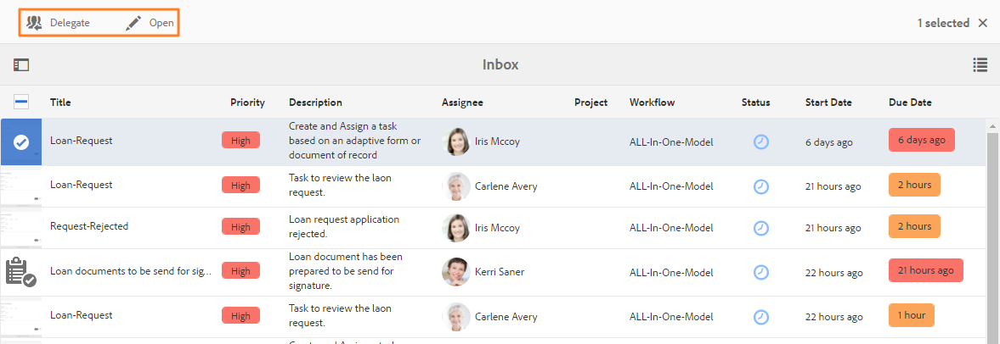

# Gerenciar aplicativos e tarefas Forms na Caixa de entrada AEM{#manage-forms-applications-and-tasks-in-aem-inbox}

Uma das muitas maneiras de iniciar ou acionar um fluxo de trabalho centrado na Forms é através de aplicativos AEM Caixa de entrada. É necessário criar um aplicativo de fluxo de trabalho para disponibilizar um fluxo de trabalho do Forms como aplicativo na Caixa de entrada. Para obter mais informações sobre o aplicativo de fluxo de trabalho e outras formas de iniciar workflows Forms, consulte [Iniciar um fluxo de trabalho centralizado na Forms no OSGi](../../forms/using/aem-forms-workflow.md#launch).

Além disso, AEM Caixa de entrada consolida notificações e tarefas de vários componentes AEM, incluindo workflows Forms. Quando um fluxo de trabalho de formulários contendo uma etapa Atribuir tarefa é acionado, o aplicativo associado é listado como uma tarefa na Caixa de entrada do destinatário. Se o destinatário for um grupo, a tarefa será exibida na Caixa de entrada de todos os membros do grupo até que um indivíduo solicite ou delegue a tarefa.

A interface do usuário Caixa de entrada fornece visualizações de calendário e listas para tarefas de visualização. Você também pode definir as configurações de visualização. É possível filtrar tarefas com base em vários parâmetros. Para obter mais informações sobre visualizações e filtros, consulte [Caixa de entrada](/help/sites-authoring/inbox.md).

Em resumo, a Caixa de entrada permite que você crie um novo aplicativo e gerencie tarefas atribuídas.

>[!NOTE]
>
>Você deve ser um membro do grupo de usuários do fluxo de trabalho para poder usar AEM Caixa de entrada.

## Criar aplicativo {#create-application}

1. Vá para AEM Caixa de entrada em https://&#39;[server]:[port]&#39;/aem/inbox.
1. Na interface da caixa de entrada, toque em **[!UICONTROL Criar > Aplicativo]**. A página Selecionar aplicativo é exibida.
1. Selecione um aplicativo e clique em **[!UICONTROL Criar]**. O formulário adaptável associado ao aplicativo é aberto. Preencha as informações no formulário adaptável e toque em **[!UICONTROL Enviar]**. Ele inicia o fluxo de trabalho associado e cria uma tarefa na Caixa de entrada do destinatário.

## Gerencie tarefas {#manage-tasks}

Quando um fluxo de trabalho do Forms é acionado e você é um destinatário ou parte do grupo destinatário, uma tarefa é exibida em sua Caixa de entrada. Você pode visualização detalhes da tarefa e executar ações disponíveis na tarefa na Caixa de entrada.

### Tarefas de solicitação ou delegadas {#claim-or-delegate-tasks}

As tarefas atribuídas a um grupo são exibidas na Caixa de entrada de todos os membros do grupo. Qualquer membro do grupo pode reivindicar essa tarefa ou delegá-la a outro membro do grupo. Para isso:

1. Toque para selecionar a miniatura da tarefa. As opções para abrir ou delegar a tarefa são exibidas na parte superior.

   

1. Faça uma das seguintes opções:

   * Para delegar a tarefa, toque em **[!UICONTROL Delegar]**. A caixa de diálogo Delegar item é aberta. Selecione um usuário, adicione um comentário e toque em **[!UICONTROL OK]**.

   

   * Para reivindicar a tarefa, toque em **[!UICONTROL Abrir]**. A caixa de diálogo Atribuir a si mesmo é aberta. Toque em **[!UICONTROL Prosseguir]** para reclamar a tarefa. A tarefa reivindicada é exibida com você como o destinatário em sua Caixa de entrada.

   

### Detalhes da visualização e executar ações no tarefa {#view-details-and-perform-actions-on-tasks}

Ao abrir uma tarefa, você pode visualização os detalhes da tarefa e executar as ações disponíveis. As ações disponíveis para uma tarefa são definidas na etapa Atribuir tarefa do fluxo de trabalho do Forms associado.

1. Toque para selecionar a miniatura da tarefa. As opções para abrir ou delegar a tarefa selecionada são exibidas na parte superior.
1. Toque em **Abrir** para obter detalhes da tarefa da visualização e execute ações. A visualização detalhada da tarefa é aberta. Nesta visualização, você pode visualização detalhes da tarefa e realizar ações na tarefa.

   >[!NOTE]
   >
   >Se uma tarefa for atribuída a um grupo, você deverá reivindicar que ele poderá abri-la em visualização detalhada.


A visualização detalhada da tarefa inclui as seguintes seções:

* Detalhes da tarefa
* Formulário
* Detalhes do fluxo de trabalho
* Barra de ferramentas Ações

#### Task details {#task-details}

A seção Detalhes da Tarefa exibe informações sobre a tarefa. As informações exibidas dependem das configurações da etapa [](/help/sites-developing/workflows-step-ref.md) Atribuir tarefa no fluxo de trabalho. O exemplo acima exibe a descrição, o status, a data do start e o fluxo de trabalho usados para a tarefa. Também permite anexar um arquivo à tarefa.

#### Formulário {#form}

A guia Formulário na área de conteúdo principal exibe o formulário enviado e os anexos em nível de campo, se houver.

#### Workflow details {#workflow-details}

A guia Detalhes do fluxo de trabalho na parte superior mostra o progresso da tarefa por meio de várias etapas no fluxo de trabalho. Mostra os estágios concluídos, atuais e pendentes da tarefa. As etapas de um fluxo de trabalho são definidas na etapa [](/help/sites-developing/workflows-step-ref.md) Atribuir tarefa do fluxo de trabalho associado.

Além disso, a guia exibe o histórico de tarefas para cada estágio concluído no fluxo de trabalho. Você pode tocar em Detalhes **[!UICONTROL da]** Visualização para uma etapa concluída para saber mais detalhes sobre essa etapa. Ele exibe comentários, anexos de formulário e tarefa, status, datas de start e término e assim por diante sobre a tarefa.


#### Actions toolbar {#actions-toolbar}

A barra de ferramentas Ações mostra todas as opções disponíveis para a tarefa. Enquanto Salvar, Redefinir e Delegar são ações padrão, outras ações disponíveis são configuradas na etapa [](/help/sites-developing/workflows-step-ref.md)Atribuir tarefa. No exemplo acima, Aprovar e Rejeitar são configurados no fluxo de trabalho.

À medida que você age na tarefa, ela continua mais no fluxo de trabalho.

### Visualização concluída tarefas {#view-completed-tasks}

AEM Caixa de entrada exibe somente tarefas ativas. Tarefas concluídas não são exibidas na lista. No entanto, você pode usar filtros de Caixa de entrada para filtrar tarefas com base em vários parâmetros, como tipo de tarefa, status, datas de start e término e assim por diante. Para visualização de tarefas concluídas:

1. Em AEM Caixa de entrada, toque em  para abrir o seletor de filtro.
1. Toque em Status **[!UICONTROL da]** Tarefa e selecione **[!UICONTROL Concluir]**. Todas as tarefas concluídas são exibidas.

   

1. Toque para selecionar uma tarefa e clique em **[!UICONTROL Abrir]**.

A tarefa é aberta para exibir o documento ou o formulário adaptável associado à tarefa. Para formulários adaptáveis, a tarefa exibe o formulário adaptável somente leitura ou seu documento de registro PDF conforme configurado na guia Formulário/Documento da etapa [do fluxo de trabalho](/help/sites-developing/workflows-step-ref.md)Atribuir Tarefa.

A seção de detalhes da tarefa exibe informações como ação executada, status da tarefa, data do start e data de término.


A guia Detalhes **[!UICONTROL do]** fluxo de trabalho mostra cada etapa do fluxo de trabalho. Toque em detalhes **[!UICONTROL da]** Visualização para obter informações detalhadas.


## Resolução de problemas {#troubleshooting-workflows}

### Não é possível visualização de itens relacionados ao Fluxo de Trabalho AEM na caixa de entrada AEM {#unable-to-see-aem-worklow-items}

Um proprietário de modelo de fluxo de trabalho não consegue visualização de itens relacionados ao Fluxo de Trabalho AEM na pasta A Receber AEM. Para resolver o problema, adicione os índices listados abaixo ao repositório AEM e recrie o índice.

1. Use um dos seguintes métodos para adicionar índices:

   * Crie os seguintes nós no CRX DE com `/oak:index/workflowDataLucene/indexRules/granite:InboxItem/properties` as respectivas propriedades, conforme especificado na tabela a seguir:

      | Nó | Propriedade | Tipo |
      |---|---|---|
      | sharedWith | sharedWith | SEQÜÊNCIA DE CARACTERES |
      | bloqueado | bloqueado | BOOLEANO |
      | return | return | BOOLEANO |
      | allowInboxSharing | allowInboxSharing | BOOLEANO |
      | allowExplitSharing | allowExplitSharing | BOOLEANO |


   * Implante os índices por meio de um pacote AEM. Você pode usar um projeto [AEM Archetype](https://docs.adobe.com/content/help/pt-BR/experience-manager-core-components/using/developing/archetype) para criar um pacote AEM implantável. Use o código de amostra a seguir para adicionar índices a um projeto do AEM Archetype:

   ```Java
      .property("sharedWith", "sharedWith").type(TYPENAME_STRING).propertyIndex()
      .property("locked", "locked").type(TYPENAME_BOOLEAN).propertyIndex()
      .property("returned", "returned").type(TYPENAME_BOOLEAN).propertyIndex()
      .property("allowInboxSharing", "allowInboxSharing").type(TYPENAME_BOOLEAN).propertyIndex()
      .property("allowExplicitSharing", "allowExplicitSharing").type(TYPENAME_BOOLEAN).propertyIndex()
   ```

1. [Crie um Índice de propriedades e defina-o como verdadeiro](https://docs.adobe.com/content/help/en/experience-manager-65/deploying/deploying/queries-and-indexing.html#the-property-index).

1. Depois de configurar índices no CRX DE ou implantar por meio de um pacote, [indexe novamente o repositório](https://helpx.adobe.com/in/experience-manager/kb/HowToCheckLuceneIndex.html#Completelyrebuildtheindex).

https://docs.adobe.com/content/help/en/experience-manager-65/deploying/deploying/queries-and-indexing.html
