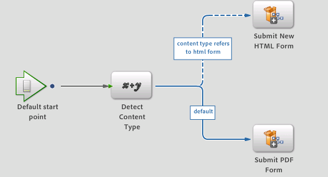

# Novo serviço de renderização e envio{#new-render-and-submit-service}

## Introdução {#introduction}

No Workbench, ao definir uma `AssignTask` operação, especifique um formulário específico (formulário XDP ou PDF). Além disso, especifique um conjunto de serviços Renderizar e Enviar, por meio do perfil de ação.

Um XDP pode ser renderizado como um formulário PDF ou HTML. Os novos recursos incluem a capacidade de:

* Renderizar e enviar um formulário XDP como HTML
* Renderizar e enviar um formulário XDP como PDF no desktop e como HTML em dispositivos móveis (por exemplo, um iPad)

### Novo serviço de formulários HTML {#new-html-forms-service}

O novo serviço de Formulários HTML aproveita o novo recurso no Forms para suportar a renderização de formulários XDP como HTML. O novo serviço de Formulários HTML expõe os seguintes métodos:

```java
/*
 * Generates a URL (for the HTML Form) to be passed to client, given a TaskContext.
 * The output of this API is something like this - /lc/content/xfaforms/profiles/default.ws.html?ContentRoot=repository://Applications/MyApplication/MyFolder&template=MyForm.xdp
 * @param taskContext task context
 * @param profileName Forms servlet URL.
 * @return form URL string
 */
public String generateFormURL(TaskContext taskContext, String profileName);

/*
 * Render the XDP Form as HTML. Can be used directly for updating the runtimeMap in render.
 * It adds the following keys to the map -
 * hint:new html form = true
 * newHTMLFormURL = the URL returned after calling 'generateFormURL' API.
 * @param TaskContext taskContext
 * @param profileName Forms servlet URL.
 * @param runtimeMap runtime map<string,object> associated with form rendering.
 * return runtimeMap
 */
public Map<String, Object> renderHTMLForm (TaskContext taskContext, String profileName, Map<String,Object> runtimeMap);
```

Mais informações sobre perfis de formulário móvel podem ser encontradas em [Criar um perfil](/help/forms/using/custom-profile.md)personalizado.

## Novos processos de renderização e envio de formulário HTML {#new-html-form-render-amp-submit-processes}

Para cada operação &#39;AssignTask&#39;, especifique um processo de Renderização e de envio com o formulário. Esses processos são chamados pelo Gerenciador de tarefas `renderForm`e `submitForm`pelas APIs para permitir a manipulação personalizada. Semântica desses processos para o Novo formulário HTML:

### Renderizar um novo formulário HTML {#render-a-new-html-form}

O novo processo para renderizar HTML, como todo processo de renderização, tem os seguintes parâmetros de E/S -

Entrada - `taskContext`

Saída - `runtimeMap`

Saída - `outFormDoc`

Este método simula o comportamento exato da `renderHTMLForm` API do NewHTMLFormsService. Ele chama a `generateFormURL` API para obter o URL para a execução HTML do formulário. Em seguida, preenche o runtimeMap com as seguintes chaves ou valores:

novo formulário html = true

newHTMLFormURL = o URL retornado após chamar a `generateFormURL` API.

### Enviar um novo formulário HTML {#submit-a-new-html-form}

Esse processo para enviar um novo formulário HTML funciona com os seguintes parâmetros de E/S -

Entrada - `taskContext`

Saída - `runtimeMap`

Saída - `outputDocument`

O processo define o `outputDocument`para o `inputDocument`recuperado `taskContext`.

## Processos de renderização ou envio padrão e perfis de ação {#default-render-or-submit-processes-and-action-profiles}

Os serviços padrão de renderização e envio permitem que o suporte renderize PDFs em um desktop e HTML em dispositivos móveis (iPad).

### Formulário de renderização padrão {#default-render-form}

Esse processo renderiza um formulário XDP em várias plataformas, sem problemas. O processo recupera o agente do usuário `taskContext`e usa os dados para chamar o processo para renderizar HTML ou PDF.


### Formulário de envio padrão {#default-submit-form}

Esse processo envia um formulário XDP em várias plataformas sem problemas. Ele recupera o agente do usuário `taskContext`e usa os dados para chamar o processo para enviar HTML ou PDF.



## Alternar a renderização de formulários móveis de PDF para HTML {#switch-the-rendering-of-mobile-forms-from-pdf-to-html}

Os navegadores estão retirando gradualmente o suporte para plug-ins baseados em NPAPI, incluindo plug-ins para o Adobe Acrobat e o Adobe Acrobat Reader. É possível alterar a renderização de formulários móveis de PDF para HTML usando as seguintes etapas:

1. Faça logon no Workbench como um usuário válido.
1. Selecione **Arquivo** > **Obter aplicativos**.

   A caixa de diálogo Obter aplicativos é exibida.

1. Selecione os aplicativos para os quais deseja alterar a renderização do formulário móvel e clique em **OK**.
1. Abra o processo para o qual deseja alterar a renderização.
1. Abra o ponto de partida/tarefa direcionada, navegue até a seção Apresentação e dados e clique em **Gerenciar Perfis** de ação.

   A caixa de diálogo Gerenciar Perfis de ação é exibida.
1. Altere as configurações de perfil de renderização padrão de PDF para HTML e clique em **OK**.
1. Verifique o processo.
1. Repita as etapas para alterar a renderização para outros processos.
1. Implante o aplicativo relevante para os processos que você alterou.

### Perfil de ação padrão {#default-action-profile}

O Perfil de Ação padrão renderizou o Formulário XDP como PDF. Esse comportamento agora foi alterado para usar os processos Formulário de renderização padrão e Formulário de envio padrão.

Algumas perguntas frequentes sobre perfis de ação são as seguintes:

 **Quais processos de renderização/envio estarão disponíveis imediatamente?**

* Guia de renderização (as guias estão obsoletas)
* Guia de formulário de renderização
* Renderizar formulário PDF
* Renderizar formulário HTML
* Renderizar novo formulário HTML (novo)
* Formulário Renderização padrão (novo)

E, processos de envio equivalentes.

 **Que Perfis de ação estarão disponíveis imediatamente?**

Para formulários XDP:

* Padrão (renderizar/enviar usando os novos processos &#39;Renderização padrão/Enviar&#39;)

 O **que precisa ser feito pelo designer do processo para permitir que o formulário seja renderizado em HTML em um dispositivo e em PDF em um desktop?**

Nada. O Perfil de Ação padrão é escolhido automaticamente e o modo de renderização também é feito automaticamente.

 O **que precisa ser feito para permitir que o formulário seja renderizado em HTML em um desktop?**

O usuário deve selecionar o botão de opção HTML para o perfil padrão.

 **Haverá algum impacto de atualização na alteração do comportamento padrão do perfil de ação?**

Sim, como os serviços de renderização e envio anteriores associados ao perfil de ação padrão eram diferentes, eles são tratados como uma personalização dos formulários existentes. Ao clicar em **Restaurar padrões**, os serviços padrão de renderização e envio são definidos.

Se você modificou os serviços de Renderização ou Enviar formulário PDF existentes ou criou serviços personalizados (por exemplo, custom1) e agora deseja usar a mesma funcionalidade para renderização HTML. É necessário replicar o novo serviço de renderização ou envio (como por exemplo, custom2) e aplicar personalizações semelhantes a essas personalizações. Agora, modifique o perfil de ação para seu XDP para start usando serviços custom2, em vez do custom1 para renderização ou envio.

O que precisa ser feito pelo designer de processos para permitir que o formulário seja renderizado em HTML em um dispositivo e em PDF em um desktop?
O que precisa ser feito pelo designer de processos para permitir que o formulário seja renderizado em HTML em um dispositivo e em PDF em um desktop?
