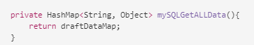

# Preparar e enviar comunicação interativa usando a interface do usuário do agente {#prepare-and-send-interactive-communication-using-the-agent-ui}

A interface do usuário do agente permite que os agentes preparem e enviem a Comunicação interativa para o processo de publicação. O Agente efetua as modificações necessárias conforme permitido e envia a Comunicação interativa para um processo de publicação, como email ou impressão.

## Visão geral {#overview}

Após a criação de uma comunicação interativa, o agente pode abrir a comunicação interativa na interface do usuário do agente e preparar uma cópia específica do recipient, inserindo dados e gerenciando o conteúdo e anexos. Por fim, o Agente pode enviar a Comunicação Interativa para um processo posterior.

Ao preparar a comunicação interativa usando a interface do usuário do agente, o agente gerencia os seguintes aspectos da comunicação interativa na interface do agente antes de enviá-la para um processo de publicação:

* **Dados**: A guia Dados da interface do usuário do agente exibe todas as variáveis editáveis pelo agente e as propriedades do modelo de dados de formulário desbloqueado no Interative Communication. Essas variáveis/propriedades são criadas ao editar ou criar fragmentos de documento incluídos na Comunicação interativa. A guia Dados também inclui todos os campos criados no modelo de canal XDP/print. A guia Dados é exibida somente quando há variáveis, propriedades do modelo de dados de formulário ou campos na Comunicação interativa que podem ser editados pelo agente.
* **Conteúdo**: Na guia Conteúdo, o Agente gerencia o conteúdo, como fragmentos de documento e variáveis de conteúdo, no Interative Communication. O agente pode fazer as alterações no fragmento do documento conforme permitido ao criar a Comunicação interativa nas propriedades desses fragmentos do documento. O agente também pode reordenar, adicionar/remover um fragmento de documento e adicionar quebras de página, se permitido.
* **Anexos**: A guia Anexos aparece na interface do agente somente se a Interative Communication tiver anexos ou se o agente tiver acesso à biblioteca. O agente pode ou não ter permissão para alterar ou editar os anexos.

## Preparar comunicação interativa usando a interface do usuário do agente {#prepare-interactive-communication-using-the-agent-ui}

1. Selecione **[!UICONTROL Forms]** > **[!UICONTROL Forms e Documentos]**.
1. Selecione a Comunicação Interativa apropriada e toque em **[!UICONTROL Abrir a interface do usuário]** do agente.

   >[!NOTE]
   >
   >A interface do usuário do agente funciona somente se a opção Interative Communication selecionada tiver um canal de impressão.

   

   Com base no conteúdo e nas propriedades do Interative Communication, a interface do usuário do agente é exibida com as três guias a seguir: Dados, conteúdo e anexo.

   

   Vá para inserir dados, gerenciar o conteúdo e gerenciar os anexos.

### Inserir dados {#enter-data}

1. Na guia Dados, digite os dados para variáveis, propriedades do modelo de dados de formulário e campos do modelo de impressão (XDP), conforme necessário. Preencha todos os campos obrigatórios marcados com um asterisco (&amp;ast;) para ativar o botão **Enviar** .

   Toque em um valor de campo de dados na pré-visualização de comunicação interativa para realçar o campo de dados correspondente na guia Dados ou vice-versa.

### Gerenciar conteúdo {#manage-content}

Na guia Conteúdo, gerencie o conteúdo, como fragmentos de documento e variáveis de conteúdo, no Interative Communication.

1. Select **[!UICONTROL Content]**. A guia de conteúdo da Comunicação interativa é exibida.

   

1. Edite os fragmentos do documento, conforme necessário, na guia Conteúdo. Para trazer o foco para o fragmento relevante na hierarquia do conteúdo, é possível tocar na linha ou parágrafo relevante na pré-visualização do Interative Communication ou tocar o fragmento diretamente na hierarquia Conteúdo.

   Por exemplo, o fragmento do documento com a linha &quot;Faça um pagamento on-line agora ... &quot; é selecionado na pré-visualização no gráfico abaixo e o mesmo fragmento de documento foi selecionado na guia Conteúdo.

   

   Na guia Conteúdo ou Dados, ao tocar em Realçar módulos selecionados no conteúdo ( ) na parte superior esquerda da pré-visualização, você pode desativar ou ativar a funcionalidade para ir para o fragmento do documento quando o texto, parágrafo ou campo de dados relevante for tocado/selecionado na pré-visualização.

   Os fragmentos que podem ser editados pelo agente durante a criação da Interative Communication têm o ícone Editar conteúdo selecionado ( ). Toque no ícone Editar conteúdo selecionado para iniciar o fragmento no modo de edição e fazer alterações nele. Use as seguintes opções para formatação e gerenciamento de texto:

   * [Opções de formatação](#formattingtext)

      * [Copiar colar texto formatado de outros aplicativos](#pasteformattedtext)
      * [Realçar partes do texto](#highlightemphasize)
   * [Caracteres especiais](#specialcharacters)
   * [Atalhos de teclado](/help/forms/using/keyboard-shortcuts.md)

   Para obter mais informações sobre as ações disponíveis para vários fragmentos de documento na interface do usuário do Agente, consulte [Ações e informações disponíveis na interface](#actionsagentui)do usuário do Agente.

1. Para adicionar uma quebra de página à saída impressa da Comunicação interativa, posicione o cursor no local em que deseja inserir uma quebra de página e selecione Quebra de página antes ou Quebra de página depois ( ).

   Um espaço reservado para quebra de página explícito é inserido na Comunicação interativa. Para visualização como uma quebra de página explícita afeta a Comunicação interativa, consulte a pré-visualização de impressão.

   

   Vá para o gerenciamento dos anexos da Comunicação interativa.

### Gerenciar anexos {#manage-attachments}

1. Selecione **[!UICONTROL Anexo]**. A interface do usuário do agente exibe os anexos disponíveis como configurados ao criar a Comunicação interativa.

   Você pode optar por não enviar um anexo juntamente com a Comunicação interativa tocando no ícone de visualização e tocar na cruz no anexo para excluí-lo (se o agente tiver permissão para excluir ou ocultar o anexo) da Comunicação interativa. Para os anexos especificados como obrigatórios ao criar a Comunicação interativa, os ícones Visualização e Excluir são desativados.

   

1. Toque no ícone Acesso à biblioteca ( ) para acessar a Biblioteca de conteúdo para inserir ativos DAM como anexos.

   >[!NOTE]
   >
   >O ícone Acesso à biblioteca estará disponível somente se o acesso à biblioteca tiver sido ativado durante a criação da Comunicação interativa (nas propriedades do Container do Documento Imprimir).

1. Se a ordem dos anexos não tiver sido bloqueada durante a criação da Comunicação interativa, você poderá reordenar os anexos selecionando um anexo e tocando nas setas para baixo e para cima.
1. Use a Pré-visualização da Web e a Pré-visualização de impressão para ver se as duas saídas estão de acordo com suas necessidades.

   Se as pré-visualizações forem satisfatórias, toque em **[!UICONTROL Enviar]** para enviar/enviar a Comunicação interativa para um processo posterior. Ou para fazer alterações, saia da pré-visualização para voltar para fazer as alterações.

## Formatação de texto {#formattingtext}

Ao editar um fragmento de texto na interface do usuário do agente, a barra de ferramentas muda dependendo do tipo de edições que você escolher fazer: Fonte, Parágrafo ou Lista:

 

Barra de ferramentas Fonte


Barra de ferramentas Parágrafo


Barra de ferramentas lista

### Realçar/enfatizar partes do texto {#highlightemphasize}

Para realçar\enfatizar partes de texto em um fragmento editável, selecione o texto e toque em Realçar cor.


### Colar texto formatado {#pasteformattedtext}


### Inserir caracteres especiais no texto {#specialcharacters}

A interface do usuário do agente tem suporte integrado para 210 caracteres especiais. O administrador pode [adicionar suporte para caracteres especiais mais/personalizados por personalização](/help/forms/using/custom-special-characters.md).

#### Delivery de anexo {#attachmentdelivery}

* Quando a Comunicação interativa é renderizada usando APIs do lado do servidor como um PDF interativo ou não interativo, o PDF renderizado contém anexos como anexos de PDF.
* Quando um processo de publicação associado a uma Comunicação interativa é carregado como parte do comando Enviar usando a interface do usuário do agente, os anexos são transmitidos como o parâmetro Lista&lt;com.adobe.idp.Documento> inAttachmentDocs.
* Workflows de mecanismo de delivery, como email e impressão, também fornecem anexos juntamente com a versão PDF da Interative Communication.

## Ações e informações disponíveis na interface do usuário do agente {#actionsagentui}

### Document fragments {#document-fragments}


* **Setas** para cima/para baixo: Setas para mover fragmentos de documento para cima ou para baixo na Comunicação interativa.
* **Excluir**: Se permitido, exclua o fragmento do documento da Comunicação interativa.
* **Quebra de página antes** (aplicável para fragmentos filho da área do público alvo): Insere uma quebra de página antes do fragmento do documento.
* **Recuo**: Aumenta ou diminui o recuo de um fragmento de documento.
* **Quebra de página após** (aplicável para fragmentos filho da área do público alvo): Insere uma quebra de página após o fragmento do documento.


* Editar (somente fragmentos de texto): Abra o editor de Rich Text para editar o fragmento do documento de texto. Para obter mais informações, consulte [Formatação de texto](#formattingtext).

* Seleção (ícone de olho): Inclui\exclui fragmento de documento da Comunicação interativa.
* Valores não preenchidos (informações): Indica o número de variáveis não preenchidas no fragmento do documento.

### Fragmentos de documento de lista {#list-document-fragments}


* Inserir linha em branco: Insere uma nova linha em branco.
* Seleção (ícone de olho): Inclui\exclui fragmento de documento da Comunicação interativa.
* Ignorar marcadores/números: Ative para ignorar marcadores/numeração no fragmento do documento da lista.
* Valores não preenchidos (informações): Indica o número de variáveis não preenchidas no fragmento do documento.

## Salvar comunicações interativas como rascunho {#save-as-draft}

Você pode usar a interface do agente para salvar um ou mais rascunhos para cada Comunicação interativa e recuperar o rascunho posteriormente para continuar trabalhando nele. Você pode especificar um nome diferente para cada rascunho para identificá-lo.

O Adobe recomenda executar essas instruções em sequência para salvar com êxito uma comunicação interativa como rascunho.

### Ativar o recurso Salvar como rascunho {#before-save-as-draft}

O recurso Salvar como rascunho não está ativado, por padrão. Execute as seguintes etapas para ativar o recurso:

1. Implemente a interface de Provedor de serviço [ccrDocumentInstance](https://helpx.adobe.com/experience-manager/6-5/forms/javadocs/com/adobe/fd/ccm/ccr/ccrDocumentInstance/api/services/CCRDocumentInstanceService.html) (SPI).

   O SPI permite que você salve a versão preliminar do Interative Communication no banco de dados com uma ID de rascunho como o identificador exclusivo. Essas instruções presumem que você tem conhecimento prévio sobre como criar um pacote OSGi usando um projeto Maven.

   Para obter exemplos de implementação de SPI, consulte [Exemplo de implementação](#sample-ccrDocumentInstance-spi)de SPI ccrDocumentInstance.
1. Abra `http://<hostname>:<port>/ system/console/bundles` e toque em **[!UICONTROL Instalar/atualizar]** para fazer upload do pacote OSGi. Verifique se o status do pacote carregado é exibido como **Ativo**. Reinicie o servidor se o status do pacote não for exibido como **Ativo**.
1. Ir para `https://'[server]:[port]'/system/console/configMgr`.
1. Toque em **[!UICONTROL Criar configuração]** de correspondência.
1. Selecione **[!UICONTROL Ativar Salvar usando CCRDocumentInstanceService]** e toque em **[!UICONTROL Salvar]**.

### Salvar uma comunicação interativa como rascunho {#save-as-draft-agent-ui}

Execute as seguintes etapas para salvar uma comunicação interativa como rascunho:

1. Selecione uma comunicação interativa no Forms Manager e toque em **[!UICONTROL Abrir interface do usuário]** do agente.

1. Faça as alterações apropriadas na interface do usuário do agente e toque em **[!UICONTROL Salvar como rascunho]**.

1. Especifique o nome do rascunho no campo **[!UICONTROL Nome]** e toque em **[!UICONTROL Concluído]**.

Depois de salvar a Comunicação interativa como um rascunho, toque em **[!UICONTROL Salvar alterações]** para salvar mais alterações no rascunho.

### Recuperar o rascunho de uma comunicação interativa {#retrieve-draft}

Depois de salvar uma comunicação interativa como rascunho, você pode recuperá-la para continuar trabalhando nela. Recupere a comunicação interativa usando:

`https://server:port/aem/forms/createcorrespondence.hmtl?draftid=[draftid]`

[o rascunho] se refere ao identificador exclusivo da versão de rascunho que é gerada após salvar uma Comunicação interativa como rascunho.

>[!NOTE]
>
>Se você fizer alterações na Comunicação interativa depois de salvá-la como um rascunho, a versão de rascunho não será aberta.

### Amostra da implementação de SPI ccrDocumentInstance {#sample-ccrDocumentInstance-spi}

Implemente o `ccrDocumentInstance` SPI para salvar uma comunicação interativa como rascunho. Segue-se uma amostra da implementação do `ccrDocumentInstance` SPI.

```javascript
package Implementation;

import com.adobe.fd.ccm.ccr.ccrDocumentInstance.api.exception.CCRDocumentException;
import com.adobe.fd.ccm.ccr.ccrDocumentInstance.api.model.CCRDocumentInstance;
import com.adobe.fd.ccm.ccr.ccrDocumentInstance.api.services.CCRDocumentInstanceService;
import org.apache.commons.lang3.StringUtils;
import org.osgi.service.component.annotations.Component;
import org.slf4j.Logger;
import org.slf4j.LoggerFactory;

import java.util.*;


@Component(service = CCRDocumentInstanceService.class, immediate = true)
public class CCRDraftService implements CCRDocumentInstanceService {

    private static final Logger logger = LoggerFactory.getLogger(CCRDraftService.class);

    private HashMap<String, Object> draftDataMap = new HashMap<>();

    @Override
    public String save(CCRDocumentInstance ccrDocumentInstance) throws CCRDocumentException {
        String documentInstanceName = ccrDocumentInstance.getName();
        if (StringUtils.isNotEmpty(documentInstanceName)) {
            logger.info("Saving ccrData with name : {}", ccrDocumentInstance.getName());
            if (!CCRDocumentInstance.Status.SUBMIT.equals(ccrDocumentInstance.getStatus())) {
                ccrDocumentInstance = mySQLDataBaseServiceCRUD(ccrDocumentInstance,null, "SAVE");
            }
        } else {
            logger.error("Could not save data as draft name is empty");
        }
        return ccrDocumentInstance.getId();
    }

    @Override
    public void update(CCRDocumentInstance ccrDocumentInstance) throws CCRDocumentException {
        String documentInstanceName = ccrDocumentInstance.getName();
        if (StringUtils.isNotEmpty(documentInstanceName)) {
            logger.info("Saving ccrData with name : {}", documentInstanceName);
            mySQLDataBaseServiceCRUD(ccrDocumentInstance, ccrDocumentInstance.getId(), "UPDATE");
        } else {
            logger.error("Could not save data as draft Name is empty");
        }
    }

    @Override
    public CCRDocumentInstance get(String id) throws CCRDocumentException {
        CCRDocumentInstance cCRDocumentInstance;
        if (StringUtils.isEmpty(id)) {
            logger.error("Could not retrieve data as draftId is empty");
            cCRDocumentInstance = null;
        } else {
            cCRDocumentInstance = mySQLDataBaseServiceCRUD(null, id,"GET");
        }
        return cCRDocumentInstance;
    }

    @Override
    public List<CCRDocumentInstance> getAll(String userId, Date creationTime, Date updateTime,
                                            Map<String, Object> optionsParams) throws CCRDocumentException {
        List<CCRDocumentInstance> ccrDocumentInstancesList = new ArrayList<>();

        HashMap<String, Object> allSavedDraft = mySQLGetALLData();
        for (String key : allSavedDraft.keySet()) {
            ccrDocumentInstancesList.add((CCRDocumentInstance) allSavedDraft.get(key));
        }
        return ccrDocumentInstancesList;
    }

    //The APIs call the service in the database using the following section.
    private CCRDocumentInstance mySQLDataBaseServiceCRUD(CCRDocumentInstance ccrDocumentInstance,String draftId, String method){
        if(method.equals("SAVE")){

            String autoGenerateId = draftDataMap.size() + 1 +"";
            ccrDocumentInstance.setId(autoGenerateId);
            draftDataMap.put(autoGenerateId, ccrDocumentInstance);
            return ccrDocumentInstance;

        }else if (method.equals("UPDATE")){

            draftDataMap.put(ccrDocumentInstance.getId(), ccrDocumentInstance);
            return ccrDocumentInstance;

        }else if(method.equals("GET")){

            return (CCRDocumentInstance) draftDataMap.get(draftId);

        }
        return null;
    }

    private HashMap<String, Object> mySQLGetALLData(){
        return draftDataMap;
    }
}
```

As operações `save`, `update`e `get`e `getAll` chamam o serviço de banco de dados para salvar uma Comunicação Interativa como rascunho, atualizar uma Comunicação Interativa, recuperar dados do banco de dados e recuperar dados de todas as Comunicações Interativas disponíveis no banco de dados. Este exemplo usa `mySQLDataBaseServiceCRUD` como o nome do serviço de banco de dados.

A tabela a seguir explica a implementação de amostra de `ccrDocumentInstance` SPI. Ele demonstra como as operações `save`, `update`, `get`e `getAll` chamam o serviço de banco de dados na implementação de amostra.

<table> 
 <tbody>
 <tr>
  <td><p><strong>Operação</strong></p></td>
  <td><p><strong>Exemplos de serviço de banco de dados</strong></p></td> 
   </tr>
  <tr>
   <td><p>Você pode criar um rascunho para uma comunicação interativa ou enviá-lo diretamente. A API para a operação de gravação verifica se a Comunicação interativa é enviada como rascunho e inclui um nome de rascunho. A API então chama o serviço mySQLDataBaseServiceCRUD com Save como método de entrada.</p></br></br>[#$sd1_sf1_dp9]</td>
   <td><p>O serviço mySQLDataBaseServiceCRUD verifica Salvar como o método de entrada e gera uma ID de rascunho gerada automaticamente e retorna para AEM. A lógica para gerar uma ID de rascunho pode variar com base no banco de dados.</p></br></br>[#$sd1_sf1_dp13]</td>
   </tr>
  <tr>
   <td><p>A API para a operação de atualização recupera o status do rascunho do Interative Communication e verifica se o Interative Communication inclui um nome de rascunho. A API chama o serviço mySQLDataBaseServiceCRUD para atualizar esse status no Banco de Dados.</p></br></br>[#$sd1_sf1_dp17]</td>
   <td><p>O serviço mySQLDataBaseServiceCRUD verifica Update como o método de entrada e salva o status do rascunho Interativo Communication no banco de dados.</br></p></td>
   </tr>
   <tr>
   <td><p>A API para a operação de obtenção verifica se o Interative Communication inclui uma ID de rascunho. Em seguida, a API chama o serviço mySQLDataBaseServiceCRUD com Get como o método de entrada para recuperar os dados da Interative Communication.</br></p></td>
   <td><p>O serviço mySQLDataBaseServiceCRUD verifica Get como o método de entrada e recupera os dados para a Comunicação Interativa com base na ID de rascunho.</p></br></br>[#$sd1_sf1_dp29]</td>
   </tr>
   <tr>
   <td><p>A API para a operação getAll chama o serviço mySQLGetALLData para recuperar dados de todas as Comunicações interativas salvas no banco de dados.</br></p></td>
   <td><p>O serviço mySQLGetALLData recupera dados de todas as Comunicações interativas salvas no banco de dados.</p></br></br>[#$sd1_sf1_dp37]</td>
   </tr>
  </tbody>
</table>

Este é um exemplo do `pom.xml` arquivo que faz parte da implementação:

```xml
<?xml version="1.0" encoding="UTF-8"?>
<project xmlns="http://maven.apache.org/POM/4.0.0"
         xmlns:xsi="http://www.w3.org/2001/XMLSchema-instance"
         xsi:schemaLocation="http://maven.apache.org/POM/4.0.0 http://maven.apache.org/xsd/maven-4.0.0.xsd">
    <modelVersion>4.0.0</modelVersion>

    <groupId>com.adobe.livecycle</groupId>
    <artifactId>draft-sample</artifactId>
    <version>2.0.0-SNAPSHOT</version>

    <name>Interact</name>
    <packaging>bundle</packaging>

    <dependencies>
        <dependency>
            <groupId>com.adobe.aemfd</groupId>
            <artifactId>aemfd-client-sdk</artifactId>
            <version>6.0.146</version>
        </dependency>
    </dependencies>


    <!-- ====================================================================== -->
    <!-- B U I L D D E F I N I T I O N -->
    <!-- ====================================================================== -->
    <build>
        <plugins>
            <plugin>
                <groupId>org.apache.felix</groupId>
                <artifactId>maven-bundle-plugin</artifactId>
                <version>3.3.0</version>
                <extensions>true</extensions>
                <executions>
                    <!--Configure extra execution of 'manifest' in process-classes phase to make sure SCR metadata is generated before unit test runs-->
                    <execution>
                        <id>scr-metadata</id>
                        <goals>
                            <goal>manifest</goal>
                        </goals>
                    </execution>
                </executions>
                <configuration>
                    <exportScr>true</exportScr>
                    <instructions>
                        <!-- Enable processing of OSGI DS component annotations -->
                        <_dsannotations>*</_dsannotations>
                        <!-- Enable processing of OSGI metatype annotations -->
                        <_metatypeannotations>*</_metatypeannotations>
                        <Bundle-SymbolicName>${project.groupId}-${project.artifactId}</Bundle-SymbolicName>
                    </instructions>
                </configuration>
            </plugin>
            <plugin>
                <groupId>org.apache.maven.plugins</groupId>
                <artifactId>maven-surefire-plugin</artifactId>
            </plugin>
            <plugin>
                <groupId>org.apache.maven.plugins</groupId>
                <artifactId>maven-compiler-plugin</artifactId>
                <configuration>
                    <source>8</source>
                    <target>8</target>
                </configuration>
            </plugin>
        </plugins>
    </build>
    <profiles>
        <profile>
            <id>autoInstall</id>
            <build>
                <plugins>
                    <plugin>
                        <groupId>org.apache.sling</groupId>
                        <artifactId>maven-sling-plugin</artifactId>
                        <executions>
                            <execution>
                                <id>install-bundle</id>
                                <phase>install</phase>
                                <goals>
                                    <goal>install</goal>
                                </goals>
                            </execution>
                        </executions>
                    </plugin>
                </plugins>
            </build>
        </profile>
    </profiles>

</project>
```

>[!NOTE]
>
>Certifique-se de atualizar a `aemfd-client-sdk` dependência para 6.0.146 ou uma versão posterior no `pom.xml` arquivo.
