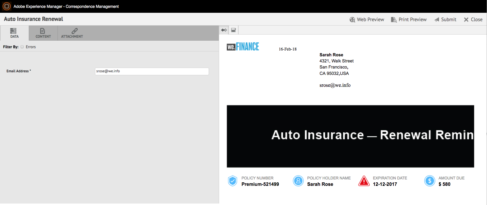

# Preparar e enviar comunicação interativa usando a interface do usuário do agente {#prepare-and-send-interactive-communication-using-the-agent-ui}

A interface do usuário do agente permite que os agentes preparem e enviem a Comunicação interativa para o processo de publicação. O Agente efetua as modificações necessárias conforme permitido e envia a Comunicação interativa para um processo posterior, como email ou impressão.

## Visão geral {#overview}

Após a criação de uma Comunicação interativa, o agente pode abrir a Comunicação interativa na interface do usuário do agente e preparar uma cópia específica do destinatário, inserindo dados e gerenciando o conteúdo e anexos. Por fim, o Agente pode enviar a Comunicação Interativa para um processo posterior.

Ao preparar a comunicação interativa usando a interface do usuário do agente, o agente gerencia os seguintes aspectos da comunicação interativa na interface do agente antes de enviá-la para um processo de publicação:

* **Dados**: A guia Dados da interface do usuário do agente exibe todas as variáveis editáveis pelo agente e as propriedades do modelo de dados de formulário desbloqueado no Interative Communication. Essas variáveis/propriedades são criadas ao editar ou criar fragmentos de documento incluídos na Comunicação interativa. A guia Dados também inclui quaisquer campos criados no modelo de canal de impressão/XDP. A guia Dados aparece somente quando há variáveis, propriedades do modelo de dados de formulário ou campos na Comunicação interativa que podem ser editados pelo agente.
* **Conteúdo**: Na guia Conteúdo, o Agente gerencia o conteúdo, como fragmentos de documento e variáveis de conteúdo, no Interative Communication. O agente pode fazer as alterações no fragmento do documento conforme permitido ao criar a Comunicação interativa nas propriedades desses fragmentos de documento. O agente também pode reordenar, adicionar/remover um fragmento de documento e adicionar quebras de página, se permitido.
* **Anexos**: A guia Anexos aparece na interface do agente somente se a Interative Communication tiver anexos ou se o agente tiver acesso à biblioteca. O agente pode ou não ter permissão para alterar ou editar os anexos.

## Preparar comunicação interativa usando a interface do usuário do agente {#prepare-interactive-communication-using-the-agent-ui}

1. Selecione **[!UICONTROL Formulários]** > **[!UICONTROL Formulários e documentos]**.
1. Selecione a Comunicação Interativa apropriada e toque em **[!UICONTROL Abrir a interface do usuário]** do agente.

   >[!NOTE]
   >
   >A interface do usuário do agente funciona somente se a opção Interative Communication selecionada tiver um canal de impressão.

   

   Com base no conteúdo e nas propriedades do Interative Communication, a interface do usuário do agente é exibida com as três guias a seguir: Dados, conteúdo e anexo.

   

   Vá para inserir dados, gerenciar o conteúdo e gerenciar os anexos.

### Inserir dados {#enter-data}

1. Na guia Dados, digite os dados para variáveis, propriedades do modelo de dados de formulário e campos do modelo de impressão (XDP), conforme necessário. Preencha todos os campos obrigatórios marcados com um asterisco (&amp;ast;) para ativar o botão **Enviar** .

   Toque em um valor de campo de dados na visualização de Comunicação interativa para realçar o campo de dados correspondente na guia Dados ou vice-versa.

### Gerenciar conteúdo {#manage-content}

Na guia Conteúdo, gerencie o conteúdo, como fragmentos de documento e variáveis de conteúdo, no Interative Communication.

1. Select **[!UICONTROL Content]**. A guia de conteúdo da Comunicação interativa é exibida.

   

1. Edite os fragmentos do documento, conforme necessário, na guia Conteúdo. Para trazer o foco para o fragmento relevante na hierarquia de conteúdo, é possível tocar na linha ou parágrafo relevante na visualização do Interative Communication ou tocar o fragmento diretamente na hierarquia Conteúdo.

   Por exemplo, o fragmento do documento com a linha &quot;Fazer um pagamento online agora ... &quot; é selecionado na visualização no gráfico abaixo e o mesmo fragmento de documento foi selecionado na guia Conteúdo.

   

   Na guia Conteúdo ou Dados, ao tocar em Realçar módulos selecionados no conteúdo ( ) na parte superior esquerda da visualização, é possível desativar ou ativar a funcionalidade para ir para o fragmento do documento quando o texto, parágrafo ou campo de dados relevante for tocado/selecionado na visualização.

   Os fragmentos que podem ser editados pelo agente durante a criação da Interative Communication têm o ícone Editar conteúdo selecionado ( ). Toque no ícone Editar conteúdo selecionado para iniciar o fragmento no modo de edição e fazer alterações nele. Use as seguintes opções para formatação e gerenciamento de texto:

   * [Opções de formatação](#formattingtext)

      * [Copiar colar texto formatado de outros aplicativos](#pasteformattedtext)
      * [Realçar partes do texto](#highlightemphasize)
   * [Caracteres especiais](#specialcharacters)
   * [Atalhos de teclado](/help/forms/using/keyboard-shortcuts.md)
   Para obter mais informações sobre as ações disponíveis para vários fragmentos de documento na interface do usuário do agente, consulte [Ações e informações disponíveis na interface](#actionsagentui)do usuário do agente.

1. Para adicionar uma quebra de página à saída impressa da Comunicação interativa, posicione o cursor no local em que deseja inserir uma quebra de página e selecione Quebra de página antes ou Quebra de página depois ( ).

   Um espaço reservado para quebra de página explícito é inserido na Comunicação interativa. Para exibir como uma quebra de página explícita afeta a Comunicação interativa, consulte a visualização de impressão.

   

   Vá para o gerenciamento dos anexos da Comunicação interativa.

### Gerenciar anexos {#manage-attachments}

1. Selecione **[!UICONTROL Anexo]**. A interface do usuário do agente exibe os anexos disponíveis como configurados ao criar a Comunicação interativa.

   Você pode optar por não enviar um anexo juntamente com a Comunicação interativa tocando no ícone de exibição e tocar na cruz no anexo para excluí-lo (se o agente tiver permissão para excluir ou ocultar o anexo) da Comunicação interativa. Para os anexos especificados como obrigatórios ao criar a Comunicação interativa, os ícones Exibir e Excluir são desativados.

   

1. Toque no ícone Acesso à biblioteca ( ) para acessar a Biblioteca de conteúdo para inserir ativos DAM como anexos.

   >[!NOTE]
   >
   >O ícone Acesso à biblioteca estará disponível somente se o acesso à biblioteca tiver sido ativado durante a criação da Comunicação interativa (nas propriedades do Contêiner de documentos do canal Imprimir).

1. Se a ordem dos anexos não tiver sido bloqueada durante a criação da Comunicação interativa, você poderá reordenar os anexos selecionando um anexo e tocando nas setas para baixo e para cima.
1. Use Visualização na Web e Visualização de impressão para ver se as duas saídas estão de acordo com sua necessidade.

   Se as visualizações forem satisfatórias, toque em **[!UICONTROL Enviar]** para enviar/enviar a Comunicação interativa para um processo de publicação. Ou para fazer alterações, saia da visualização para voltar para fazer as alterações.

## Formatação de texto {#formattingtext}

Ao editar um fragmento de texto na interface do usuário do agente, a barra de ferramentas muda dependendo do tipo de edições que você escolher fazer: Fonte, Parágrafo ou Lista:

 

Barra de ferramentas Fonte

Barra de ferramentas Parágrafo

Barra de ferramentas Lista

### Realçar/enfatizar partes do texto {#highlightemphasize}

Para realçar\enfatizar partes de texto em um fragmento editável, selecione o texto e toque em Realçar cor.

### Colar texto formatado {#pasteformattedtext}

### Inserir caracteres especiais no texto {#specialcharacters}

A interface do usuário do agente tem suporte integrado para 210 caracteres especiais. O administrador pode [adicionar suporte para caracteres especiais mais/personalizados por personalização](/help/forms/using/custom-special-characters.md).

#### Entrega do anexo {#attachmentdelivery}

* Quando a Comunicação interativa é renderizada usando APIs do lado do servidor como um PDF interativo ou não interativo, o PDF renderizado contém anexos como anexos de PDF.
* Quando um processo de publicação associado a uma Comunicação interativa é carregado como parte da interface Enviar usando o agente, os anexos são transmitidos como o parâmetro List&lt;com.adobe.idp.Document> inAttachmentDocs.
* Fluxos de trabalho do mecanismo de entrega, como email e impressão, também fornecem anexos juntamente com a versão PDF da Interative Communication.

## Ações e informações disponíveis na interface do usuário do agente {#actionsagentui}

### Document fragments {#document-fragments}

* **Setas** para cima/para baixo: Setas para mover fragmentos de documento para cima ou para baixo na Comunicação interativa.
* **Excluir**: Se permitido, exclua o fragmento do documento da Comunicação interativa.
* **Quebra de página antes** (aplicável para fragmentos filho da área de destino): Insere uma quebra de página antes do fragmento do documento.
* **Recuo**: Aumenta ou diminui o recuo de um fragmento de documento.
* **Quebra de página após** (aplicável para fragmentos filho da área de destino): Insere uma quebra de página após o fragmento do documento.

* Editar (somente fragmentos de texto): Abra o editor de Rich Text para editar o fragmento do documento de texto. Para obter mais informações, consulte [Formatação de texto](#formattingtext).

* Seleção (ícone de olho): Inclui\exclui fragmento de documento da Comunicação interativa.
* Valores não preenchidos (informações): Indica o número de variáveis não preenchidas no fragmento do documento.

### Listar fragmentos de documento {#list-document-fragments}

* Inserir linha em branco: Insere uma nova linha em branco.
* Seleção (ícone de olho): Inclui\exclui fragmento de documento da Comunicação interativa.
* Ignorar marcadores/números: Ative para ignorar marcadores/numeração no fragmento do documento da lista.
* Valores não preenchidos (informações): Indica o número de variáveis não preenchidas no fragmento do documento.

