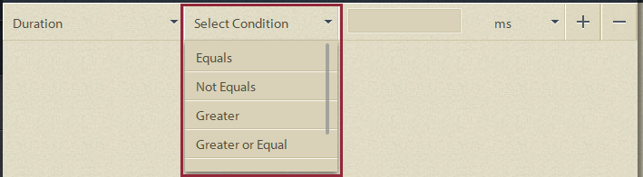
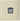
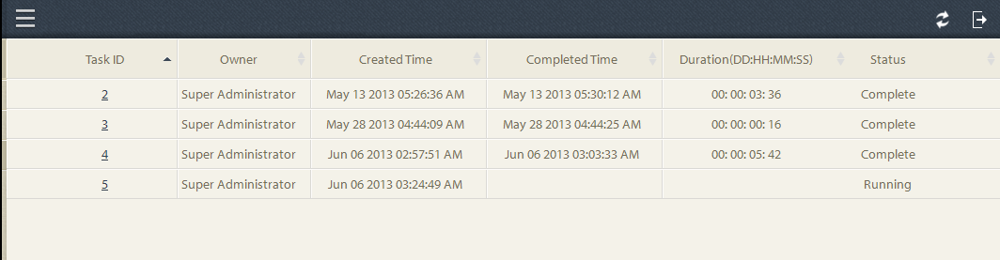
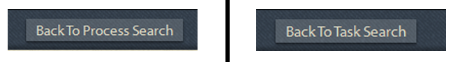

# Query Ad-hoc no Relatórios em andamento{#ad-hoc-queries-in-process-reporting}

## query Ad-hoc no Relatórios em andamento {#ad-hoc-queries-in-process-reporting-1}

query ad-hoc no Process Relatórios permitem que você crie query personalizados que podem ser usados para pesquisar detalhes de processo e tarefa das instâncias de processo do AEM Forms definidas no seu ambiente do AEM Forms.

Além disso, query ad hoc podem ser definidos usando filtros de propriedades de processo e tarefa. Esses filtros podem ser salvos e usados para executar os relatórios posteriormente.

[**Pesquisa **](/help/forms/using/process-reporting/adhoc-queries-in-process-reporting.md#p-process-task-search-p)de processos: Procure instâncias de processo com um filtro de pesquisa definido pelo usuário com base em atributos de processo.

[**Detalhes **](/help/forms/using/process-reporting/adhoc-queries-in-process-reporting.md#p-process-task-details-p)do processo: Detalhes da Visualização de uma instância do processo especificando a ID do processo.

**Pesquisa** de Tarefa: Procure instâncias de tarefa com um filtro de pesquisa definido pelo usuário com base em atributos de tarefa.

**Detalhes** da Tarefa: Detalhes da Visualização de uma instância de tarefa especificando a ID da tarefa.

### Processos e Tarefas {#processes-and-tasks}

As etapas que você segue para criar filtros e executar query para obter detalhes do processo são as mesmas do tarefa.

Isso significa que as interfaces do usuário para Pesquisa de processos e Pesquisa de Tarefas diferem somente nos campos pelos quais você pode pesquisar e nos campos retornados nos resultados da pesquisa. Isso ocorre simplesmente porque, embora muitos dos campos sejam idênticos, determinados campos são específicos de processos e determinados campos são específicos de tarefas.

Este artigo detalha as descrições das seções Pesquisa de processo/Tarefa e Detalhes de processo/Tarefa. Em locais apropriados, quaisquer diferenças específicas serão especificamente destacadas.

## Pesquisa de processos/Tarefas {#process-task-search}

Use a Pesquisa de processo/Tarefa para definir filtros para consultar instâncias de processo/tarefa.

### Para criar um query de pesquisa de processo/Tarefa {#to-create-a-process-task-search-query}

1. Para visualização dos query de Pesquisa de Processo/Tarefa salvos ou para criar um query, clique em Query **** Ad-hoc e clique em Pesquisa **de** Processo/Tarefa.

   

   O painel **Meus Filtros** é exibido à direita da visualização da árvore.

   No painel **Meus Filtros** , você pode criar novos query ad-hoc e clicar para executar query salvos anteriormente.

   

1. Para executar um query existente, basta clicar no query no painel **Meus Filtros** .
1. Para criar um query, clique em **Adicionar** (+).

   O painel **Criar filtro** é exibido.

   

   Um query consiste em um ou mais filtros de query. Para criar um filtro, adicione uma linha de filtro ao query. Por padrão, uma linha de filtro é adicionada ao query.

   **Definição de um filtro**

   1. Selecione um campo.

      

      >[!NOTE]
      >
      >A lista de campo contém os campos específicos do processo/tarefa do AEM Forms.

   1. Selecione uma condição.

      

      >[!NOTE]
      >
      >As condições listadas dependem do atributo selecionado para filtragem.

   1. Insira um valor.

      

   1. Para adicionar outro filtro ao query, clique em **Adicionar (+)** à direita da linha de filtro.

      Para remover um filtro do query, clique em **Excluir (-)** à direita da linha de filtro.

      

Depois de criar um query, use as opções no canto superior direito do painel **Criar filtro** para:

* **Cancelar**: Cancele as alterações e volte ao painel **Meus Filtros** .
* **Executar**: Execute o query atual para ver e/ou verificar os resultados. Nesse caso, não é necessário salvar o query antes de executá-lo. Você pode verificar os resultados, fazer alterações se necessário e salvar o query quando estiver satisfeito com a saída.
* **Salvar**: Salve o filtro. O filtro pode ser exibido e executado a partir do painel **Meus Filtros** .

### Opções no painel Meus Filtros {#options-in-my-filters-panel}

Use as opções no painel **Meus Filtros** para **Adicionar** , **Editar** **** ou Excluirlc_pr_edit_filteran query ad-hoc.

### Para executar um query de pesquisa {#to-execute-a-search-query}

1. Para executar um query, clique no filtro no painel **Meus Filtros** ou clique no botão **Executar** se você estiver criando ou editando um filtro.
1. Os resultados do query são exibidos no painel **Relatório** da janela **Processar Relatórios** .

   

   Você pode paginar os resultados da pesquisa com a ajuda do painel de paginação exibido na parte inferior do relatório.

   

   Na lista suspensa **Exibir** , escolha o número de resultados a serem exibidos por página.

   Na caixa de texto **Página** , digite um número de página para ir diretamente para essa página.

1. Os seguintes campos são exibidos em um resultado de Pesquisa de Processo:

   * **ID** do processo: A ID do processo. O campo está hipervinculado. Se você clicar em uma ID de processo nesse campo, será redirecionado para o painel Detalhes **[!UICONTROL do]** processo para o processo.
   * **Iniciador**: O usuário do AEM Forms que iniciou a instância do processo
   * **Hora** de criação: A data e a hora em que a instância do processo começou
   * **Hora** de conclusão: A data e a hora em que a instância do processo foi concluída
   * **Duração**: A duração do start até a conclusão da instância do processo
   * **Status**: O status atual da instância do processo.
   Por padrão, o resultado é classificado pela ID do processo. No entanto, para classificar o resultado por qualquer um dos campos, clique no título do campo.

   Como a classificação é uma operação de alternância, clique em um cabeçalho de coluna para classificar o resultado em ordem crescente e clique nele novamente para classificar em ordem decrescente.

   Da mesma forma, os seguintes campos são exibidos em um resultado de Pesquisa de Tarefa:

   * **ID** da Tarefa: A ID da tarefa. O campo está hipervinculado. Se você clicar em uma ID de tarefa nesse campo, será redirecionado para o painel Detalhes **[!UICONTROL da]** Tarefa da tarefa.
   * **Iniciador**: O usuário do AEM Forms que iniciou a instância do processo
   * **Hora** de criação: A data e a hora em que a instância do processo começou
   * **Hora** de conclusão: A data e a hora em que a instância do processo foi concluída
   * **Duração**: A duração do start até a conclusão da instância do processo
   * **Status**: O status atual da instância do processo.
   Por padrão, o resultado é classificado por ID de Tarefa. No entanto, para classificar o resultado por qualquer um dos campos, clique no título do campo. O resultado é classificado pela coluna que é indicada por uma seta escurecida ao lado do cabeçalho da coluna.

   Como a classificação é uma operação de alternância, clique em um cabeçalho de campo para classificar o resultado em ordem crescente e clique nele novamente para classificar em ordem decrescente. A ordem de classificação atual (crescente/decrescente) é indicada pela direção da seta escurecida ao lado do cabeçalho da coluna.

   

1. Clique no botão do painel  no canto superior esquerdo para recolher o painel **Meus Filtros** e expandir o espaço disponível para o painel **Relatório** .
1. Use as opções no canto superior direito do painel **Relatório **para executar operações sobre o resultado do query.

   * **Atualizar**: Atualiza o relatório com os dados mais recentes no armazenamento

   * **Exportar para CSV**: Exporte os dados do relatório para um arquivo separado por vírgulas.
   >[!NOTE]
   >
   >Quando você exporta um relatório, todo o resultado da pesquisa é exportado para um arquivo CSV e não apenas para a página atual

## Detalhes do processo/Tarefa {#process-task-details}

Use o painel Detalhes **do** processo para visualização dos detalhes de um processo específico.

Da mesma forma, use o painel Detalhes **da** Tarefa para visualização dos detalhes de uma tarefa específica.

### Detalhes do processo de visualização/Tarefa {#to-view-process-task-details}

Você pode visualização os detalhes de um processo/tarefa específica do AEM Forms:

* **De um resultado de Pesquisa de Processo/Tarefa**
* **Inserindo a ID de processo/Tarefa no painel Detalhes do processo/Tarefa**

#### De um resultado de Pesquisa de Processo/Tarefa {#from-a-process-task-search-result}

1. Execute uma pesquisa de processo/tarefa. Para obter detalhes, consulte [Para executar um query](#to-execute-a-search-query)Process Search.

   Observe que as IDs de processo exibidas retornadas no resultado são hipervinculadas.

   

1. Clique em uma ID de processo na lista para visualização dos detalhes desse processo no painel Detalhes **do** processo.

   O resultado do query Detalhes **do** processo/Tarefa exibe detalhes das tarefas/formulários contidos no processo/tarefa.

   Por padrão, o resultado é classificado por Tarefa/ID do formulário. No entanto, para classificar o resultado por qualquer um dos campos, clique no título do campo. A coluna pela qual o resultado é classificado é indicada por uma seta escurecida ao lado do cabeçalho da coluna.

   Como a classificação é uma operação de alternância, clique em um cabeçalho de campo para classificar o resultado em ordem crescente e clique nele novamente para classificar em ordem decrescente. A ordem de classificação atual (crescente/decrescente) é indicada pela direção da seta escurecida ao lado do cabeçalho da coluna.

   **Resultado de Detalhes do Processo**

   

   **Painel esquerdo:** Exibe os seguintes detalhes do processo selecionado:

   * Nome do processo
   * Hora da data de criação do processo
   * Hora de conclusão do processo
   * Duração do processo
   * Status do processo
   * Iniciador do processo
   **Painel Superior direito:** Exibe os seguintes detalhes das tarefas que compõem o processo selecionado:

   * ID da Tarefa
   * Nome da Tarefa
   * proprietário da Tarefa
   * Data e hora de criação da Tarefa
   * Hora da data de atualização da Tarefa
   * Hora de conclusão da Tarefa
   * duração da Tarefa
   * status da Tarefa
   **Painel inferior direito:** Exibe os seguintes detalhes do histórico do processo selecionado:

   * Nome do processo
   * Iniciador do processo
   * Hora da data de atualização do processo
   * Hora de conclusão do processo
   * Status do processo
   **Resultado Detalhes da Tarefa**

   

   **Painel esquerdo:** Exibe os seguintes detalhes da tarefa selecionada:

   * Nome da Tarefa
   * ID do processo ao qual essa tarefa pertence
   * descrição da Tarefa
   * Data e hora de criação da Tarefa
   * Hora de conclusão da Tarefa
   * duração da Tarefa
   * status da Tarefa
   * Rota selecionada da tarefa
   **Painel Superior direito:** Exibe os seguintes detalhes dos formulários que compõem a tarefa selecionada:

   * ID do formulário
   * Data e hora de criação do formulário
   * Data e hora de atualização do formulário
   * URL do modelo de formulário
   **Painel inferior direito:** Exibe os seguintes detalhes do histórico do processo da tarefa selecionada:

   * Tipo de atribuição de Tarefa
   * proprietário da Tarefa
   * Data e hora de criação da atribuição de Tarefa
   * Hora da data de atualização da Tarefa

1. Clique em **Voltar para Processar/Tarefa Pesquisa** para voltar ao resultado da pesquisa a partir do qual os detalhes do processo/tarefa foram detalhados.

   

   Entretanto, se os detalhes do processo/tarefa forem encontrados inserindo uma ID de processo/tarefa específica, clicar em Voltar para Processo/Pesquisa de Tarefa o levará de volta para Pesquisa **de** Processo/Tarefa, sem exibir nenhum resultado de pesquisa.

#### Inserindo a ID de processo/Tarefa no painel Detalhes do processo/Tarefa {#by-entering-the-process-task-id-in-the-process-task-details-panel-br}

1. Vá para o painel Detalhes **do** processo/Tarefa.

   

1. Na caixa de texto ID do processo/Tarefa, digite a ID do processo/tarefa.

   

   Os campos no resultado do query Detalhes **do** processo/Tarefa são campos específicos de um processo/tarefa do AEM Forms.

   Para um processo, o resultado do query exibe os detalhes das tarefas contidas no processo.

   Para uma tarefa, o resultado do query exibe os detalhes dos formulários contidos na tarefa.
