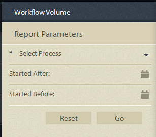

# Relatórios predefinidos no Relatórios em andamento {#pre-defined-reports-in-process-reporting}

## Relatórios Relatórios predefinidos no processo {#pre-defined-reports-in-process-reporting-1}

O Relatórios de processo de formulários AEM é fornecido com os seguintes relatórios *prontos* :

* **[Processos](#long-running-processes)**de longa duração: Um relatório de todos os processos do AEM Forms que levaram mais de um tempo para serem concluídos
* **[Gráfico](#process-duration-report)**de Duração do Processo: Um relatório de um processo de AEM Forms especificado por duração
* **[Volume](#workflow-volume-report)**do fluxo de trabalho: Um relatório das instâncias em execução e concluídas do processo especificado por data

## Processos de longa execução {#long-running-processes}

O relatório de Processos de longa execução exibe os processos do AEM Forms que levaram mais de um tempo para serem concluídos.

### Para executar um relatório de Processo Longo de Execução {#to-execute-a-long-running-process-report}

1. Para visualização da lista de relatórios predefinidos no Process Relatórios, na visualização em árvore do Relatórios **** Process, clique no nó **Reports** .
1. Clique no nó do relatório Processos **de Execução** Longa.

   

   Quando você seleciona um relatório, o painel Parâmetros **de** relatório é exibido à direita da visualização em árvore.

   

   Parâmetros:

   * **Duração** (*obrigatório*): Especifique uma duração e uma unidade de tempo. Exibe todos os processos do AEM Forms que foram executados por mais de uma duração especificada.
   * **Iniciado após** (*opcional*): Selecione uma data. Filtre o relatório para exibir instâncias de processo que começaram após a data especificada.
   * **Iniciado antes** (*opcional*): Selecione uma data. Filtre o relatório para exibir as instâncias de processo iniciadas antes da data especificada.

1. Clique em **Ir** para executar o relatório.

   O relatório é exibido no painel **Relatório** à direita da janela **Processar Relatórios** .

   

   Use as opções no canto superior direito do painel **Relatório** para executar as seguintes operações no relatório.

   * **Atualizar**: Atualiza o relatório com os dados mais recentes no armazenamento
   * **Alterar cor** da legenda: Selecionar e alterar a cor da legenda do relatório
   * **Exportar para CSV**: Exportar e baixar os dados do relatório para um arquivo separado por vírgulas

## Relatório de duração do processo {#process-duration-report}

O relatório Duração do processo exibe o número de instâncias de um processo do Forms por número de dias que cada instância executou.

### Para executar um relatório de Duração do processo {#to-execute-a-process-duration-report}

1. Para visualização dos relatórios predefinidos no Relatórios Process, na visualização em árvore do Relatórios **** Process, clique no nó **Reports** .
1. Clique no nó do relatório Duração **** dos processos.

   

   Quando você seleciona um relatório, o painel Parâmetros **de** relatório é exibido à direita da visualização em árvore.

   

   Parâmetros:

   * **Selecionar Processo** (*obrigatório*): Selecione um processo do AEM Forms.

1. Clique em **Ir** para executar o relatório.

   O relatório é exibido no painel **Relatório** à direita da janela Processar Relatórios.

   

   Use as opções no canto superior direito do painel **Relatório** para executar as seguintes operações no relatório.

   * **Atualizar**: Atualiza o relatório com os dados mais recentes no armazenamento
   * **Alterar cor** da legenda: Selecionar e alterar a cor da legenda do relatório
   * **Exportar para CSV**: Exportar e baixar os dados do relatório para um arquivo separado por vírgulas

## Relatório de volume do fluxo de trabalho {#workflow-volume-report}

O relatório de Volume do fluxo de trabalho exibe o número de instâncias atualmente em execução e concluídas de um processo de formulários AEM por dia de calendário.

### Para executar um relatório de Volume do fluxo de trabalho {#to-execute-a-workflow-volume-report}

1. Para visualização dos relatórios predefinidos no Relatórios Process, na visualização em árvore do Relatórios **** Process, clique no nó **Reports** .
1. Clique no nó do relatório Volume **do** fluxo de trabalho.

   

   Quando você seleciona um relatório, o painel Parâmetros **de** relatório é exibido à direita da visualização em árvore.

   

   Parâmetros:

   * **Selecionar Processo** (*obrigatório*): Selecione um processo do AEM Forms.

   * **Iniciado após** (*opcional*): Selecione uma data. Filtros o relatório para exibir instâncias de processo que foram iniciadas após a data especificada.

   * **Iniciado antes** (*opcional*): Selecione uma data. Filtros o relatório para exibir instâncias de processo iniciadas antes da data especificada.

1. Clique em **Ir** para executar o relatório.

   O relatório é exibido no painel **Relatório** à direita da janela **Processar Relatórios** .

   

   Use as opções no canto superior direito do painel **Relatório** para executar as seguintes operações no relatório.

   * **Atualizar**: Atualiza o relatório com os dados mais recentes no armazenamento
   * **Alterar cor** da legenda: Selecionar e alterar a cor da legenda do relatório
   * **Exportar para CSV**: Exportar e baixar os dados do relatório para um arquivo separado por vírgulas
