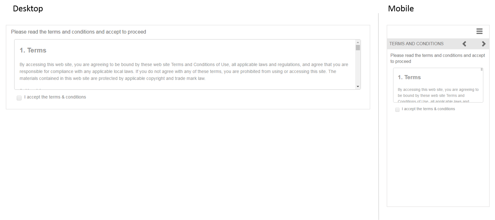

# Referenciar fragmentos de formulário adaptáveis{#reference-adaptive-form-fragments}

[Fragmento de formulário adaptável](../../forms/using/adaptive-form-fragments.md) é um grupo de campos ou um painel que contém um grupo de campos que você pode usar ao criar um formulário. Ele permite criar um formulário de maneira fácil e rápida. Você pode arrastar e soltar um fragmento de formulário adaptável em um formulário usando o navegador de ativos na barra lateral e editá-lo no editor de formulários.

Para autores de formulários adaptáveis, os fragmentos de referência são fornecidos na [Pacote complementar do AEM Forms](https://experienceleague.adobe.com/docs/experience-manager-release-information/aem-release-updates/forms-updates/aem-forms-releases.html?lang=en). Inclui os seguintes fragmentos:

* Endereço
* Informações de contato
* Informações de cartão de crédito
* Emprego Atual
* Informações de Dependentes
* Histórico de Emprego
* Receita e Despesas
* Nome
* Termos e condições
* Termos e condições com assinatura

Quando você instala o pacote, uma pasta Fragmentos de referência contendo fragmentos de referência é criada em Forms e documentos. Para instalar um pacote, consulte [Como trabalhar com pacotes](/help/sites-administering/package-manager.md).

## Endereço {#address}

Inclui campos para especificar o endereço para correspondência. Os campos disponíveis são endereço, CEP, cidade, estado e país. Ele também inclui um serviço Web pré-configurado que preenche a cidade e o estado de um CEP específico dos EUA.

<!--[Click to enlarge

](assets/address-1.png)-->

## Informações de contato {#contact-information}

Inclui campos para capturar número de telefone e endereço de email.

<!--[Click to enlarge

](assets/contact-info-1.png)-->

## Informações de cartão de crédito {#credit-card-information}

Inclui campos para registrar informações de cartão de crédito que podem ser usadas para processar pagamentos.

## Emprego Atual {#current-employment}

Inclui campos para capturar detalhes do emprego atual, como status do emprego, campo de emprego, designação, organização e data de ingresso.

<!--[Click to enlarge

](assets/current-emp-1.png)-->

## Informações de Dependentes {#dependents-information}

Inclui campos para especificar informações sobre um ou mais dependentes, como nome, relacionamento e idade, em formato tabular.

<!--[Click to enlarge

](assets/dependents-info-1.png)-->

## Histórico de Emprego {#employment-history}

Inclui campos para capturar o histórico de emprego. Permite adicionar várias organizações.

<!--[Click to enlarge

](assets/emp-history-1.png)-->

## Receita e Despesas {#income-expenditure}

Inclui campos para registrar fluxo de caixa e despesas mensais. O Forms que exige que os usuários forneçam detalhes financeiros pode usar esse fragmento para capturar receita e despesa.

<!--[Click to enlarge

](assets/income-1.png)-->

## Nome {#name}

Inclui campos para especificar título, nome, nome do meio e sobrenome.

<!--[Click to enlarge

](assets/name-1.png)-->

## Termos e condições {#terms-conditions}

Especifica os termos e condições que os usuários devem aceitar antes de enviar um formulário.

<!--[Click to enlarge

](assets/tnc-1.png)-->

## Termos e condições com assinatura {#terms-conditions-with-scribble}

Especifica os termos e condições que os usuários devem aceitar e assinar antes de enviar um formulário.

<!--[Click to enlarge

](assets/tnc-scribble-1.png)-->
